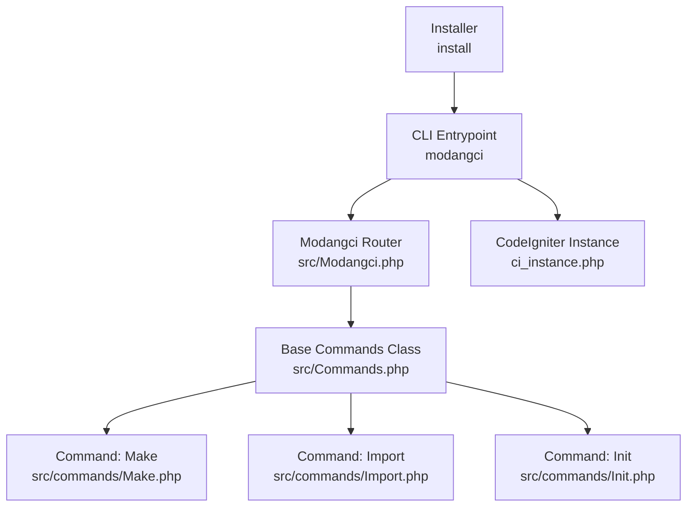
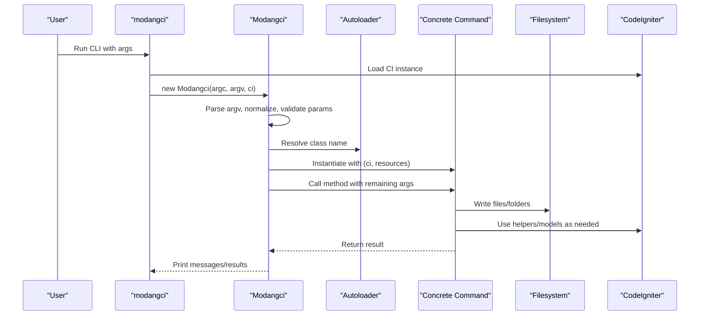
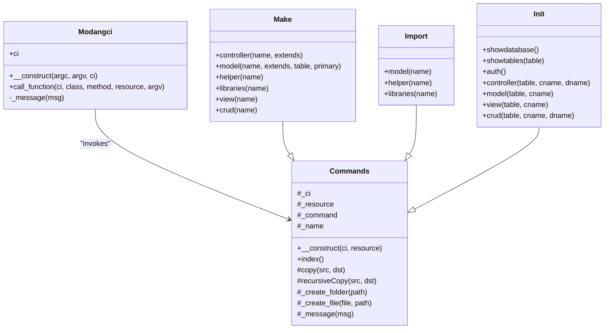
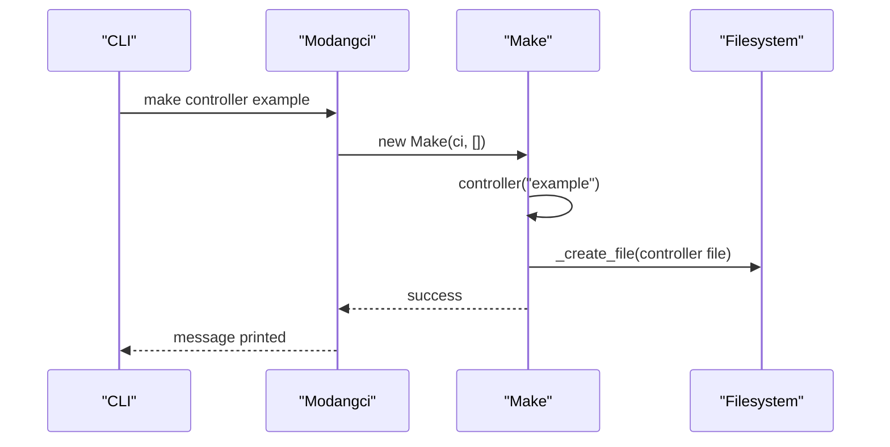
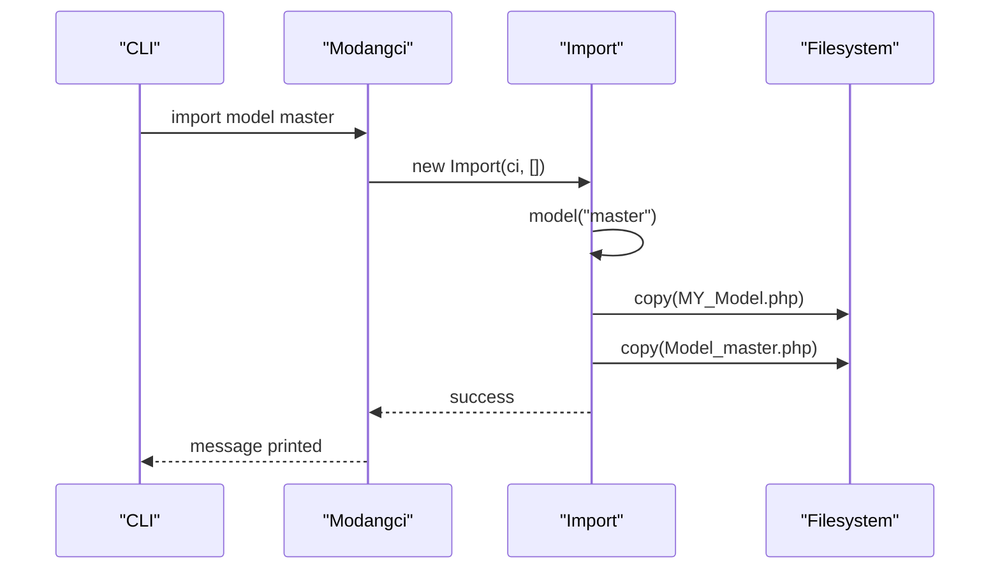
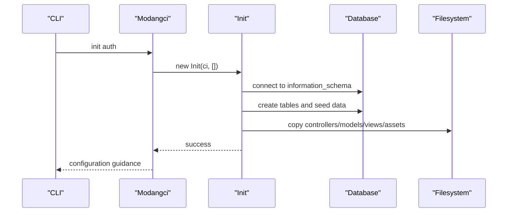
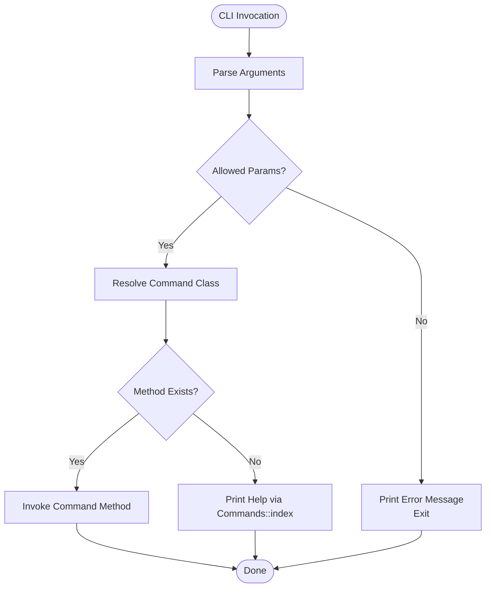
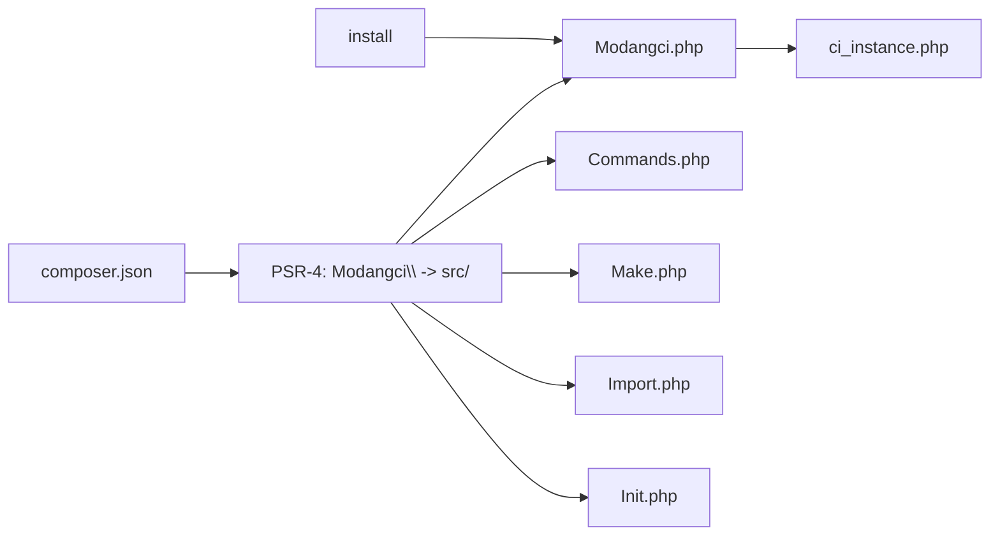

# API Reference

<cite>
**Referenced Files in This Document**
- [Modangci.php](file://src/Modangci.php)
- [Commands.php](file://src/Commands.php)
- [Make.php](file://src/commands/Make.php)
- [Import.php](file://src/commands/Import.php)
- [Init.php](file://src/commands/Init.php)
- [modangci](file://modangci)
- [install](file://install)
- [composer.json](file://composer.json)
- [README.md](file://README.md)
- [ci_instance.php](file://ci_instance.php)
- [message_helper.php](file://src/application/helpers/message_helper.php)
</cite>

## Table of Contents
1. [Introduction](#introduction)
2. [Project Structure](#project-structure)
3. [Core Components](#core-components)
4. [Architecture Overview](#architecture-overview)
5. [Detailed Component Analysis](#detailed-component-analysis)
6. [Dependency Analysis](#dependency-analysis)
7. [Performance Considerations](#performance-considerations)
8. [Troubleshooting Guide](#troubleshooting-guide)
9. [Conclusion](#conclusion)
10. [Appendices](#appendices)

## Introduction
This document provides a comprehensive API reference for Modangci’s programmatic interfaces and command implementations. It covers the main Modangci class responsible for routing CLI commands, the abstract Commands base class that defines shared utilities and scaffolding behavior, and the concrete command classes Make, Import, and Init with their public methods, parameters, return values, and usage patterns. It also documents the command execution flow, error handling mechanisms, exception types, and integration patterns with PHP applications built on CodeIgniter 3.

## Project Structure
Modangci is structured as a PSR-4 autoloaded library under the Modangci namespace. The CLI entrypoint initializes a CodeIgniter 3 application instance and delegates command execution to the Modangci router, which dynamically resolves and invokes concrete command classes.

**Diagram sources**
- [modangci:1-26](file://modangci#L1-L26)
- [Modangci.php:1-60](file://src/Modangci.php#L1-L60)
- [Commands.php:1-135](file://src/Commands.php#L1-L135)
- [Make.php:1-211](file://src/commands/Make.php#L1-L211)
- [Import.php:1-53](file://src/commands/Import.php#L1-L53)
- [Init.php:1-917](file://src/commands/Init.php#L1-L917)
- [ci_instance.php:1-87](file://ci_instance.php#L1-L87)
- [install:1-60](file://install#L1-L60)

**Section sources**
- [modangci:1-26](file://modangci#L1-L26)
- [ci_instance.php:1-87](file://ci_instance.php#L1-L87)
- [composer.json:1-25](file://composer.json#L1-L25)
- [README.md:1-41](file://README.md#L1-L41)

## Core Components
This section documents the primary programmatic interfaces and their responsibilities.

- Modangci (router): Parses CLI arguments, validates parameters, constructs the target command class and method, and executes the method with provided arguments. It also prints usage help when a method does not exist.
- Commands (base class): Provides shared utilities for file/folder creation, copying, recursive copying, and messaging. It stores references to the CodeIgniter instance and resource flags.
- Concrete commands:
  - Make: Generates controllers, models, helpers, libraries, views, and CRUD scaffolds.
  - Import: Copies prebuilt components from vendor assets into the application.
  - Init: Scaffolds authentication and CRUD scaffolding for database tables, including database schema introspection and file generation.

**Section sources**
- [Modangci.php:1-60](file://src/Modangci.php#L1-L60)
- [Commands.php:1-135](file://src/Commands.php#L1-L135)
- [Make.php:1-211](file://src/commands/Make.php#L1-L211)
- [Import.php:1-53](file://src/commands/Import.php#L1-L53)
- [Init.php:1-917](file://src/commands/Init.php#L1-L917)

## Architecture Overview
The CLI architecture follows a simple router-to-command pattern. The CLI entrypoint creates a CodeIgniter instance, then instantiates Modangci with argc/argv and the CI instance. Modangci parses the command name and method, resolves the fully qualified class name, and invokes the method with resource flags and remaining arguments.

**Diagram sources**
- [modangci:1-26](file://modangci#L1-L26)
- [Modangci.php:1-60](file://src/Modangci.php#L1-L60)
- [Make.php:1-211](file://src/commands/Make.php#L1-L211)
- [Import.php:1-53](file://src/commands/Import.php#L1-L53)
- [Init.php:1-917](file://src/commands/Init.php#L1-L917)
- [ci_instance.php:1-87](file://ci_instance.php#L1-L87)

## Detailed Component Analysis

### Modangci (Router)
Responsibilities:
- Validates that the request originates from CLI.
- Normalizes and filters arguments, allowing specific resource flags.
- Resolves the command class name and method from argv.
- Invokes the method on the concrete command class with provided arguments.
- Prints usage help when the method does not exist.

Key behaviors:
- Argument normalization and validation ensure only allowed tokens are processed.
- Resource flags (e.g., -r) are extracted and passed to the command constructor.
- Method existence checks fall back to printing the index/help message.

Public API surface:
- Constructor: accepts argc, argv, and a CodeIgniter instance.
- call_function: internal dispatcher that constructs the command class and invokes the method.

Error handling:
- Non-CLI invocation exits with a message.
- Invalid parameters cause immediate exit with a message.
- Unknown methods trigger the base Commands::index help output.

Integration:
- Designed to be instantiated by the CLI entrypoint with a prepared CodeIgniter instance.

**Section sources**
- [Modangci.php:1-60](file://src/Modangci.php#L1-L60)

### Commands (Base Class)
Responsibilities:
- Shared filesystem operations: copy single files, recursive directory copy, create folders, create files with CodeIgniter’s file helper.
- Messaging utilities for consistent console output.
- Stores CI instance and resource flags for derived commands.

Key methods:
- __construct(ci, resource): stores references.
- copy(src, dst): copies a single file and reports status.
- recursiveCopy(src, dst): recursively copies directories.
- _create_folder(path): creates a directory under APPPATH with permission checks.
- _create_file(content, path): writes a PHP file via CodeIgniter’s file helper and handles errors.
- _message(msg): prints a message to stdout.
- index(): prints usage help for available commands.

Return values:
- _create_folder: boolean indicating success.
- _create_file: boolean indicating success.
- copy/recursiveCopy: void (prints status).

Usage patterns:
- Derived commands call _create_folder/_create_file to generate files and folders.
- Messages are printed via _message for user feedback.

**Section sources**
- [Commands.php:1-135](file://src/Commands.php#L1-L135)

### Make (Concrete Command)
Purpose:
- Generates CodeIgniter artifacts: controllers, models, helpers, libraries, views, and a full CRUD scaffold.

Public methods and signatures:
- controller(name, extends = null)
  - Parameters:
    - name: string, required.
    - extends: string, optional.
  - Behavior: generates a controller class, optionally with CRUD response methods when the -r resource flag is present.
  - Returns: void (writes file via base class).
- model(name, extends = null, table = null, primary = null)
  - Parameters:
    - name: string, required.
    - extends: string, optional.
    - table: string, optional.
    - primary: string, optional.
  - Behavior: generates a model class; if table is provided, adds an all() method; if both table and primary are provided, adds a by_id() method.
  - Returns: void (writes file via base class).
- helper(name)
  - Parameters:
    - name: string, required.
  - Behavior: generates a helper file with a function stub.
  - Returns: void (writes file via base class).
- libraries(name)
  - Parameters:
    - name: string, required.
  - Behavior: generates a library class with CI instance access.
  - Returns: void (writes file via base class).
- view(name)
  - Parameters:
    - name: string, required.
  - Behavior: creates a view folder and index file; if CRUD mode is enabled, displays raw data.
  - Returns: void (writes file via base class).
- crud(name)
  - Parameters:
    - name: string, required.
  - Behavior: orchestrates controller, model, and view generation for a CRUD scaffold; enables -r resource internally.
  - Returns: void (delegates to other methods).

Resource flags:
- -r: when passed to controller, enables CRUD response methods.

Error handling:
- If required parameters are missing, prints usage help via base Commands::index.

Integration:
- Uses CodeIgniter’s file helper to write files and APPPATH for paths.

**Section sources**
- [Make.php:1-211](file://src/commands/Make.php#L1-L211)

### Import (Concrete Command)
Purpose:
- Copies prebuilt CodeIgniter components from vendor assets into the application.

Public methods and signatures:
- model(name)
  - Parameters:
    - name: string, required.
  - Behavior: copies MY_Model and a specific Model_* file from vendor to application/core.
  - Returns: void (copies files via base class).
- helper(name)
  - Parameters:
    - name: string, required.
  - Behavior: copies a helper file from vendor to application/helpers.
  - Returns: void (copies file via base class).
- libraries(name)
  - Parameters:
    - name: string, required.
  - Behavior: conditionally runs composer for certain libraries (e.g., PDF generator) and copies the library file from vendor to application/libraries.
  - Returns: void (copies file via base class).

Error handling:
- If required parameters are missing, prints usage help via base Commands::index.

Integration:
- Uses base class copy/recursiveCopy utilities and shell_exec for Composer commands.

**Section sources**
- [Import.php:1-53](file://src/commands/Import.php#L1-L53)

### Init (Concrete Command)
Purpose:
- Scaffolds authentication and CRUD scaffolding for database tables. Performs database introspection using information_schema and generates controllers, models, views, and assets.

Public methods and signatures:
- showdatabase()
  - Parameters: none.
  - Behavior: lists database tables.
  - Returns: void (prints table list).
- showtables(table = null)
  - Parameters:
    - table: string, optional.
  - Behavior: prints schema details for a given table using information_schema.
  - Returns: void (prints schema).
- auth()
  - Parameters: none.
  - Behavior: creates and seeds multiple tables for authentication and authorization, imports controllers, models, views, and assets, and prints configuration steps.
  - Returns: void (writes files and prints guidance).
- controller(table, cname, dname)
  - Parameters:
    - table: string, required.
    - cname: string, required.
    - dname: string, required.
  - Behavior: generates a controller with CRUD actions, form validation, encryption/decryption, AJAX handling, and foreign key-aware foreign table loading.
  - Returns: boolean indicating success or failure.
- model(table, cname)
  - Parameters:
    - table: string, required.
    - cname: string, required.
  - Behavior: generates a model extending a base class, with all() and by_id() methods and joins for foreign keys.
  - Returns: void (writes file via base class).
- view(table, cname)
  - Parameters:
    - table: string, required.
    - cname: string, required.
  - Behavior: generates index and form views for the table, including dynamic form controls and foreign table selects.
  - Returns: void (writes files via base class).
- crud(table, cname, dname)
  - Parameters:
    - table: string, required.
    - cname: string, required.
    - dname: string, required.
  - Behavior: orchestrates controller, model, and view generation for a CRUD scaffold and registers module entries.
  - Returns: void (delegates to other methods).

Database introspection:
- Uses a separate connection to information_schema to discover primary and foreign keys, and to gather column metadata.

Error handling:
- If required parameters are missing, prints usage help via base Commands::index.
- On database errors, prints error codes and messages via a helper.

Integration:
- Uses CodeIgniter’s database forge, encryption, and output helpers; writes files via base class.

**Section sources**
- [Init.php:1-917](file://src/commands/Init.php#L1-L917)

## Architecture Overview

**Diagram sources**
- [Modangci.php:1-60](file://src/Modangci.php#L1-L60)
- [Commands.php:1-135](file://src/Commands.php#L1-L135)
- [Make.php:1-211](file://src/commands/Make.php#L1-L211)
- [Import.php:1-53](file://src/commands/Import.php#L1-L53)
- [Init.php:1-917](file://src/commands/Init.php#L1-L917)

## Detailed Component Analysis

### Command Execution Flow (Make)

**Diagram sources**
- [Modangci.php:43-53](file://src/Modangci.php#L43-L53)
- [Make.php:16-73](file://src/commands/Make.php#L16-L73)
- [Commands.php:76-92](file://src/Commands.php#L76-L92)

### Command Execution Flow (Import)

**Diagram sources**
- [Modangci.php:43-53](file://src/Modangci.php#L43-L53)
- [Import.php:14-24](file://src/commands/Import.php#L14-L24)
- [Commands.php:20-29](file://src/Commands.php#L20-L29)

### Command Execution Flow (Init)

**Diagram sources**
- [Modangci.php:43-53](file://src/Modangci.php#L43-L53)
- [Init.php:13-29](file://src/commands/Init.php#L13-L29)
- [Init.php:125-478](file://src/commands/Init.php#L125-L478)

### Error Handling Flow

**Diagram sources**
- [Modangci.php:19-53](file://src/Modangci.php#L19-L53)

## Dependency Analysis
- Namespace and autoloading:
  - PSR-4 maps Modangci\ to src/.
- CLI bootstrap:
  - modangci loads Composer autoload, sets ROOTPATH, and requires ci_instance.php to obtain a CI instance.
- CodeIgniter integration:
  - Commands rely on CodeIgniter’s file helper for writing files and APPPATH for paths.
  - Init uses database forge, encryption, and output helpers.
- Installer:
  - install copies CLI binary and CI bootstrap into the project root.

**Diagram sources**
- [composer.json:1-25](file://composer.json#L1-L25)
- [Modangci.php:1-60](file://src/Modangci.php#L1-L60)
- [Commands.php:1-135](file://src/Commands.php#L1-L135)
- [Make.php:1-211](file://src/commands/Make.php#L1-L211)
- [Import.php:1-53](file://src/commands/Import.php#L1-L53)
- [Init.php:1-917](file://src/commands/Init.php#L1-L917)
- [ci_instance.php:1-87](file://ci_instance.php#L1-L87)
- [install:1-60](file://install#L1-L60)

**Section sources**
- [composer.json:1-25](file://composer.json#L1-L25)
- [modangci:1-26](file://modangci#L1-L26)
- [ci_instance.php:1-87](file://ci_instance.php#L1-L87)
- [install:1-60](file://install#L1-L60)

## Performance Considerations
- File operations:
  - Use recursiveCopy for bulk asset imports to minimize repeated filesystem calls.
  - Prefer single _create_file calls to reduce I/O overhead.
- Database introspection:
  - Init connects to information_schema; ensure indexes exist on key columns for optimal query performance.
- Output:
  - Base class _message prints immediately; batch messages only when necessary to reduce terminal churn.

## Troubleshooting Guide
Common issues and resolutions:
- Non-CLI invocation:
  - Symptom: Immediate exit with a CLI-only message.
  - Resolution: Run the command from the terminal using the installed CLI binary.
- Invalid parameters:
  - Symptom: Immediate exit with an “Not Allowed Parameter” message.
  - Resolution: Remove unsupported tokens; only use allowed flags and recognized command names.
- Unknown command/method:
  - Symptom: Usage help is printed.
  - Resolution: Verify the command name and method spelling; use the index help to confirm available commands.
- File write failures:
  - Symptom: Failure messages during file creation.
  - Resolution: Ensure APPPATH permissions allow writing; check disk space and directory existence.
- Database errors during Init:
  - Symptom: Error codes and messages printed via a helper.
  - Resolution: Review database credentials and schema; ensure information_schema is accessible.

**Section sources**
- [Modangci.php:13-17](file://src/Modangci.php#L13-L17)
- [Modangci.php:24-32](file://src/Modangci.php#L24-L32)
- [Modangci.php:49-52](file://src/Modangci.php#L49-L52)
- [Commands.php:62-73](file://src/Commands.php#L62-L73)
- [Commands.php:78-91](file://src/Commands.php#L78-L91)
- [message_helper.php:1-22](file://src/application/helpers/message_helper.php#L1-L22)

## Conclusion
Modangci provides a focused CLI toolkit for CodeIgniter 3 projects, enabling rapid scaffolding of controllers, models, helpers, libraries, views, and full CRUD applications. Its router-based design keeps command logic modular and extensible. The Commands base class centralizes filesystem and messaging concerns, while concrete commands encapsulate generation logic. By following the documented APIs and usage patterns, developers can integrate Modangci into existing projects and extend it with custom commands.

## Appendices

### API Versioning and Backward Compatibility
- Current state:
  - The project is marked as unstable and under active development.
- Recommendations:
  - Pin to specific commits or releases when integrating into production systems.
  - Monitor changes to command signatures and filesystem paths.
  - Prefer using the CLI entrypoint rather than invoking classes directly to minimize coupling to internal APIs.

**Section sources**
- [README.md:4-6](file://README.md#L4-L6)

### Extension Points for Custom Functionality
- Creating a custom command:
  - Extend the Commands base class and place it under src/commands/ with a PSR-4 compatible namespace.
  - Implement public methods representing your command actions.
  - Register the command class in the router if needed (not required by default).
- Integration patterns:
  - Use the CI instance to load models, helpers, and libraries within your command methods.
  - Utilize _create_folder/_create_file for consistent file generation.
  - Leverage information_schema for database-driven scaffolding similar to Init.

**Section sources**
- [Commands.php:1-135](file://src/Commands.php#L1-L135)
- [Modangci.php:43-53](file://src/Modangci.php#L43-L53)