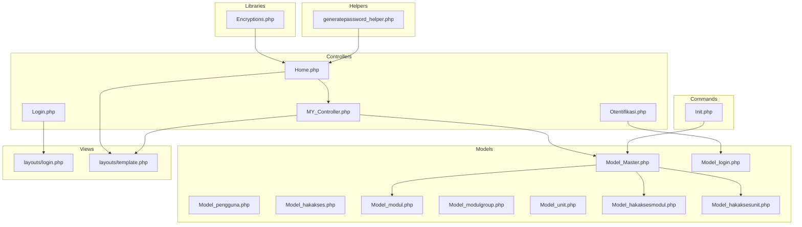
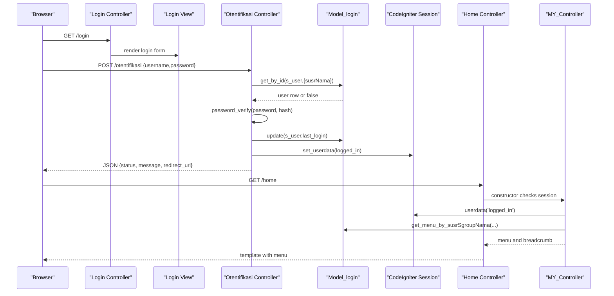
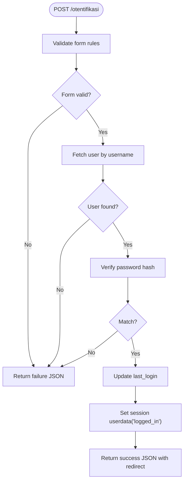
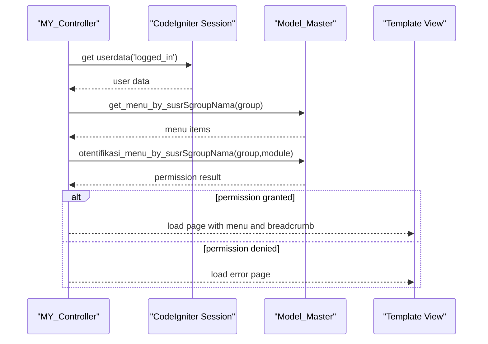
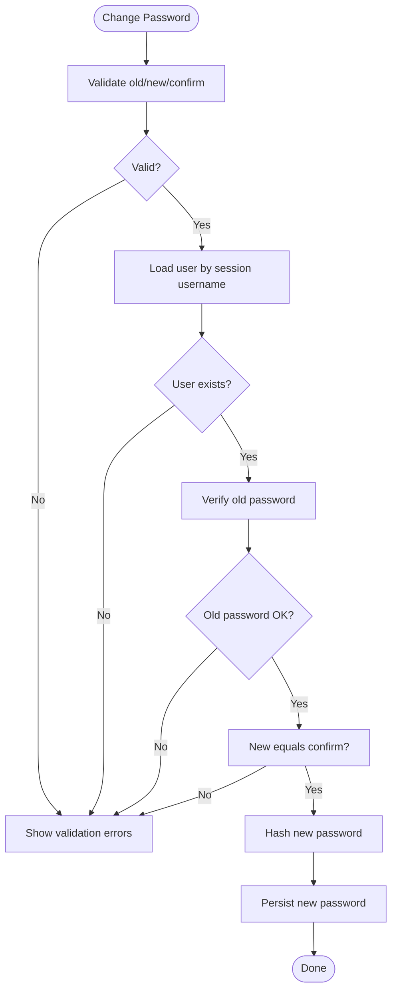
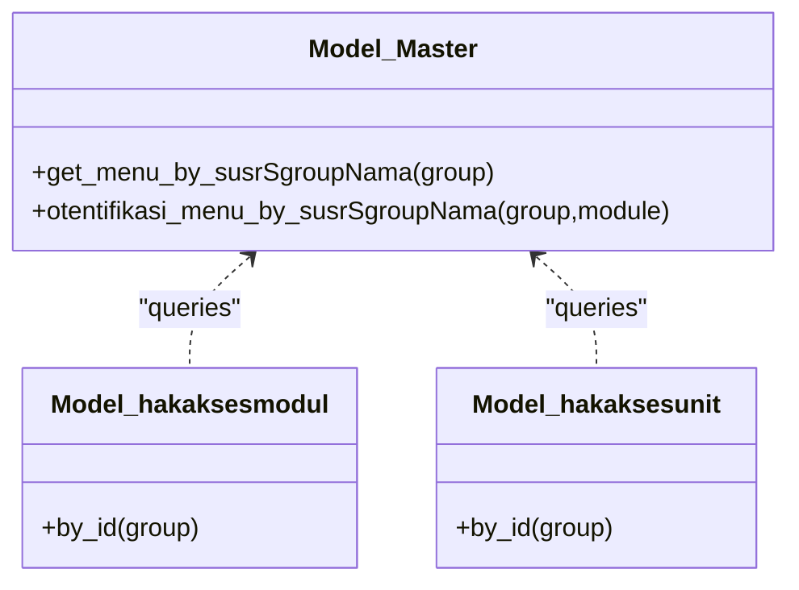
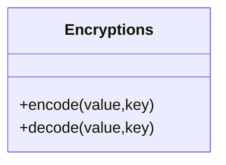
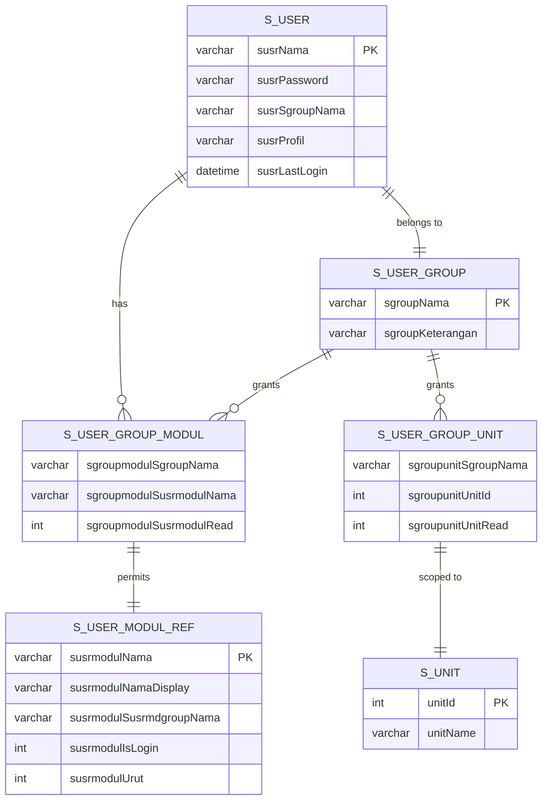
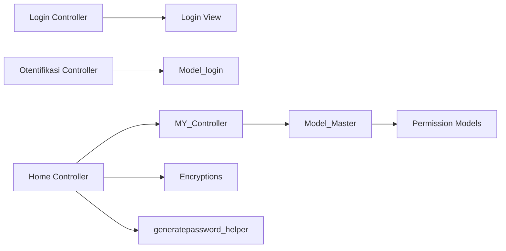

# Authentication System

<cite>
**Referenced Files in This Document**
- [Login.php](file://src/application/controllers/Login.php)
- [Otentifikasi.php](file://src/application/controllers/Otentifikasi.php)
- [Home.php](file://src/application/controllers/Home.php)
- [MY_Controller.php](file://src/application/core/MY_Controller.php)
- [Model_Master.php](file://src/application/core/Model_Master.php)
- [Model_login.php](file://src/application/models/Model_login.php)
- [Model_pengguna.php](file://src/application/models/Model_pengguna.php)
- [Model_hakakses.php](file://src/application/models/Model_hakakses.php)
- [Model_hakaksesmodul.php](file://src/application/models/Model_hakaksesmodul.php)
- [Model_hakaksesunit.php](file://src/application/models/Model_hakaksesunit.php)
- [Model_modul.php](file://src/application/models/Model_modul.php)
- [Model_modulgroup.php](file://src/application/models/Model_modulgroup.php)
- [Model_unit.php](file://src/application/models/Model_unit.php)
- [Encryptions.php](file://src/application/libraries/Encryptions.php)
- [login.php](file://src/application/views/layouts/login.php)
- [template.php](file://src/application/views/layouts/template.php)
- [generatepassword_helper.php](file://src/application/helpers/generatepassword_helper.php)
- [Init.php](file://src/commands/Init.php)
</cite>

## Table of Contents
1. [Introduction](#introduction)
2. [Project Structure](#project-structure)
3. [Core Components](#core-components)
4. [Architecture Overview](#architecture-overview)
5. [Detailed Component Analysis](#detailed-component-analysis)
6. [Dependency Analysis](#dependency-analysis)
7. [Performance Considerations](#performance-considerations)
8. [Troubleshooting Guide](#troubleshooting-guide)
9. [Conclusion](#conclusion)
10. [Appendices](#appendices)

## Introduction
This document describes Modangci’s authentication and authorization system built on CodeIgniter. It covers the authentication flow, session management, role-based navigation, and access control across modules and units. It also documents the database schema supporting users, groups, permissions, and module/unit relationships, along with security features such as password hashing and symmetric encryption.

## Project Structure
The authentication system spans controllers, models, a base controller, a custom encryption library, views, and initialization logic that creates the required database tables.

**Diagram sources**
- [Login.php:1-18](file://src/application/controllers/Login.php#L1-L18)
- [Otentifikasi.php:1-64](file://src/application/controllers/Otentifikasi.php#L1-L64)
- [Home.php:1-121](file://src/application/controllers/Home.php#L1-L121)
- [MY_Controller.php:1-59](file://src/application/core/MY_Controller.php#L1-L59)
- [Model_Master.php:1-257](file://src/application/core/Model_Master.php#L1-L257)
- [Model_login.php:1-9](file://src/application/models/Model_login.php#L1-L9)
- [Model_pengguna.php:1-36](file://src/application/models/Model_pengguna.php#L1-L36)
- [Model_hakakses.php:1-11](file://src/application/models/Model_hakakses.php#L1-L11)
- [Model_modul.php:1-37](file://src/application/models/Model_modul.php#L1-L37)
- [Model_modulgroup.php:1-11](file://src/application/models/Model_modulgroup.php#L1-L11)
- [Model_unit.php:1-11](file://src/application/models/Model_unit.php#L1-L11)
- [Model_hakaksesmodul.php:1-26](file://src/application/models/Model_hakaksesmodul.php#L1-L26)
- [Model_hakaksesunit.php:1-25](file://src/application/models/Model_hakaksesunit.php#L1-L25)
- [Encryptions.php:1-56](file://src/application/libraries/Encryptions.php#L1-L56)
- [login.php:1-140](file://src/application/views/layouts/login.php#L1-L140)
- [template.php:1-180](file://src/application/views/layouts/template.php#L1-L180)
- [generatepassword_helper.php:1-26](file://src/application/helpers/generatepassword_helper.php#L1-L26)
- [Init.php:231-351](file://src/commands/Init.php#L231-L351)

**Section sources**
- [Login.php:1-18](file://src/application/controllers/Login.php#L1-L18)
- [MY_Controller.php:1-59](file://src/application/core/MY_Controller.php#L1-L59)
- [Model_Master.php:1-257](file://src/application/core/Model_Master.php#L1-L257)
- [Init.php:231-351](file://src/commands/Init.php#L231-L351)

## Core Components
- Authentication controllers:
  - Login landing page controller.
  - Authentication handler that validates credentials and sets session.
  - Application controller that enforces session checks and access control.
- Base model with reusable CRUD and menu/permission utilities.
- Permission models for groups, modules, and units.
- Encryption library for safe encoding/decoding.
- Views for login and main layout.
- Helper for generating temporary passwords.

Key responsibilities:
- Validate credentials using hashed passwords.
- Store minimal session data and refresh last login timestamps.
- Enforce role-based navigation and module/unit permissions.
- Provide secure password change flow.
- Initialize database schema for permissions.

**Section sources**
- [Otentifikasi.php:12-62](file://src/application/controllers/Otentifikasi.php#L12-L62)
- [Home.php:28-120](file://src/application/controllers/Home.php#L28-L120)
- [MY_Controller.php:16-51](file://src/application/core/MY_Controller.php#L16-L51)
- [Model_Master.php:188-256](file://src/application/core/Model_Master.php#L188-L256)
- [Encryptions.php:21-53](file://src/application/libraries/Encryptions.php#L21-L53)

## Architecture Overview
The system follows a layered MVC pattern with centralized session enforcement and permission checks.

**Diagram sources**
- [Login.php:13-16](file://src/application/controllers/Login.php#L13-L16)
- [login.php:72-82](file://src/application/views/layouts/login.php#L72-L82)
- [Otentifikasi.php:14-33](file://src/application/controllers/Otentifikasi.php#L14-L33)
- [Otentifikasi.php:35-62](file://src/application/controllers/Otentifikasi.php#L35-L62)
- [Model_login.php:1-9](file://src/application/models/Model_login.php#L1-L9)
- [Home.php:21-26](file://src/application/controllers/Home.php#L21-L26)
- [MY_Controller.php:16-51](file://src/application/core/MY_Controller.php#L16-L51)
- [Model_Master.php:188-205](file://src/application/core/Model_Master.php#L188-L205)

## Detailed Component Analysis

### Authentication Controllers
- Login controller prevents access if already logged in and renders the login view.
- Authentication controller validates input, checks database credentials, updates last login, and sets session data.
- Home controller handles logout, password change, and dynamic role switching for administrators.

**Diagram sources**
- [Otentifikasi.php:14-33](file://src/application/controllers/Otentifikasi.php#L14-L33)
- [Otentifikasi.php:35-62](file://src/application/controllers/Otentifikasi.php#L35-L62)

**Section sources**
- [Login.php:6-16](file://src/application/controllers/Login.php#L6-L16)
- [Otentifikasi.php:14-62](file://src/application/controllers/Otentifikasi.php#L14-L62)
- [Home.php:28-33](file://src/application/controllers/Home.php#L28-L33)

### Session Management and Role-Based Navigation
- MY_Controller enforces session presence and redirects unauthenticated users to login.
- Menu retrieval and module permission checks are performed via Model_Master methods.
- Access denied pages are rendered when module permissions are missing.

**Diagram sources**
- [MY_Controller.php:16-51](file://src/application/core/MY_Controller.php#L16-L51)
- [Model_Master.php:188-238](file://src/application/core/Model_Master.php#L188-L238)
- [template.php:95-100](file://src/application/views/layouts/template.php#L95-L100)

**Section sources**
- [MY_Controller.php:16-51](file://src/application/core/MY_Controller.php#L16-L51)
- [Model_Master.php:188-238](file://src/application/core/Model_Master.php#L188-L238)

### Password Change and Role Switching
- Password change verifies old password, compares new and confirm, hashes new password, and persists.
- Administrators can switch current role; session is updated accordingly.

**Diagram sources**
- [Home.php:58-96](file://src/application/controllers/Home.php#L58-L96)

**Section sources**
- [Home.php:58-119](file://src/application/controllers/Home.php#L58-L119)

### Permission Models and Module/Unit Access Control
- Group-level module permissions are resolved via s_user_group_modul joined with s_user_modul_ref and s_user_modul_group_ref.
- Group-level unit permissions are resolved via s_user_group_unit joined with s_unit.
- These models provide per-group enumerations for configuration and UI.

**Diagram sources**
- [Model_Master.php:188-238](file://src/application/core/Model_Master.php#L188-L238)
- [Model_hakaksesmodul.php:12-24](file://src/application/models/Model_hakaksesmodul.php#L12-L24)
- [Model_hakaksesunit.php:12-23](file://src/application/models/Model_hakaksesunit.php#L12-L23)

**Section sources**
- [Model_hakaksesmodul.php:12-24](file://src/application/models/Model_hakaksesmodul.php#L12-L24)
- [Model_hakaksesunit.php:12-23](file://src/application/models/Model_hakaksesunit.php#L12-L23)

### Encryption Library
- Provides AES-256-CBC encryption/decryption with URL-safe base64 encoding.
- Used by controllers to safely pass keys in URLs.

**Diagram sources**
- [Encryptions.php:21-53](file://src/application/libraries/Encryptions.php#L21-L53)

**Section sources**
- [Encryptions.php:21-53](file://src/application/libraries/Encryptions.php#L21-L53)

### Database Schema
The initialization command defines the core permission tables and relationships.

**Diagram sources**
- [Init.php:231-351](file://src/commands/Init.php#L231-L351)

**Section sources**
- [Init.php:231-351](file://src/commands/Init.php#L231-L351)

## Dependency Analysis
- Controllers depend on models for data access and on sessions for state.
- MY_Controller depends on Model_Master for menu and permission queries.
- Views depend on controllers for data injection and templates for rendering.
- Encryption library is used by controllers for safe parameter passing.

**Diagram sources**
- [Login.php:13-16](file://src/application/controllers/Login.php#L13-L16)
- [Otentifikasi.php:9-33](file://src/application/controllers/Otentifikasi.php#L9-L33)
- [Home.php:18-26](file://src/application/controllers/Home.php#L18-L26)
- [MY_Controller.php:16-51](file://src/application/core/MY_Controller.php#L16-L51)
- [Model_Master.php:188-238](file://src/application/core/Model_Master.php#L188-L238)
- [Encryptions.php:21-53](file://src/application/libraries/Encryptions.php#L21-L53)
- [generatepassword_helper.php:6-24](file://src/application/helpers/generatepassword_helper.php#L6-L24)

**Section sources**
- [MY_Controller.php:16-51](file://src/application/core/MY_Controller.php#L16-L51)
- [Model_Master.php:188-238](file://src/application/core/Model_Master.php#L188-L238)

## Performance Considerations
- Prefer indexed foreign keys on permission tables to speed up joins during menu and permission resolution.
- Cache frequently accessed menu structures per group if the userbase is large.
- Minimize session data stored; the current design stores only essential identifiers.
- Use batch operations for bulk permission updates when initializing or migrating.

## Troubleshooting Guide
Common issues and resolutions:
- Login fails with invalid credentials:
  - Ensure the password field is hashed using the recommended hashing mechanism and that the username exists.
  - Verify the callback validation path and that the user row contains a valid hash.
- Access denied to a module:
  - Confirm the group has read permission for the module in s_user_group_modul.
  - Ensure the module exists in s_user_modul_ref and is linked to a module group.
- Session not persisting:
  - Check session configuration and that the session userdata key matches the expected structure.
- Role switching not applied:
  - Verify the administrator flag and that the session is updated after switching.

**Section sources**
- [Otentifikasi.php:35-62](file://src/application/controllers/Otentifikasi.php#L35-L62)
- [Model_Master.php:188-238](file://src/application/core/Model_Master.php#L188-L238)
- [Home.php:105-119](file://src/application/controllers/Home.php#L105-L119)

## Conclusion
Modangci’s authentication system integrates CodeIgniter’s session and form validation with a robust permission model based on user groups, modules, and units. It enforces access control centrally via a base controller and supports secure password handling and optional encryption for sensitive parameters. The initialization command establishes the schema required for multi-role access control.

## Appendices

### Practical Examples

- Setting up a user role (group):
  - Create a group via the role management interface and persist it to s_user_group.
  - Assign module permissions in s_user_group_modul for the group.
  - Assign unit permissions in s_user_group_unit for scoped access.

- Configuring module permissions:
  - Define modules in s_user_modul_ref and associate them with a module group.
  - Grant read permissions to groups in s_user_group_modul.

- Implementing access control in controllers:
  - Extend MY_Controller to inherit session enforcement and permission checks.
  - Use Model_Master methods to fetch menus and verify module access.

- Authentication flow summary:
  - Render login view, submit credentials to Otentifikasi controller.
  - On success, set session and redirect to home; otherwise, return error.
  - MY_Controller enforces session and permission checks for all protected pages.

- Logout and session timeout handling:
  - Call the logout action to unset session data and destroy the session.
  - Integrate client-side session timeout utilities as needed.

- Security best practices:
  - Always hash passwords using the recommended hashing mechanism.
  - Use HTTPS to protect credentials and session cookies.
  - Limit session data and rotate secrets periodically.
  - Sanitize inputs and leverage CodeIgniter’s XSS filtering.

**Section sources**
- [Hakakses.php:22-109](file://src/application/controllers/Hakakses.php#L22-L109)
- [Model_hakaksesmodul.php:12-24](file://src/application/models/Model_hakaksesmodul.php#L12-L24)
- [Model_hakaksesunit.php:12-23](file://src/application/models/Model_hakaksesunit.php#L12-L23)
- [MY_Controller.php:16-51](file://src/application/core/MY_Controller.php#L16-L51)
- [Home.php:28-33](file://src/application/controllers/Home.php#L28-L33)