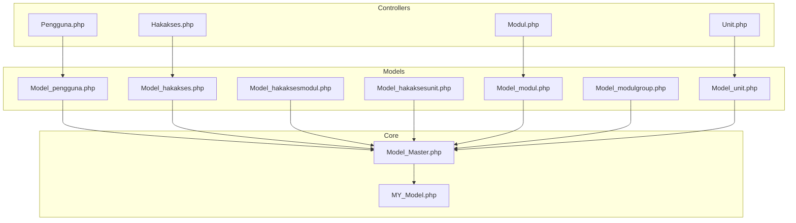
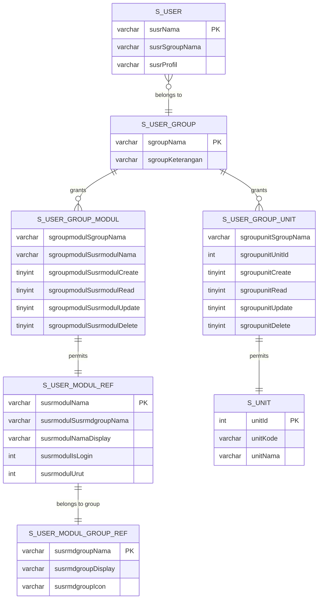
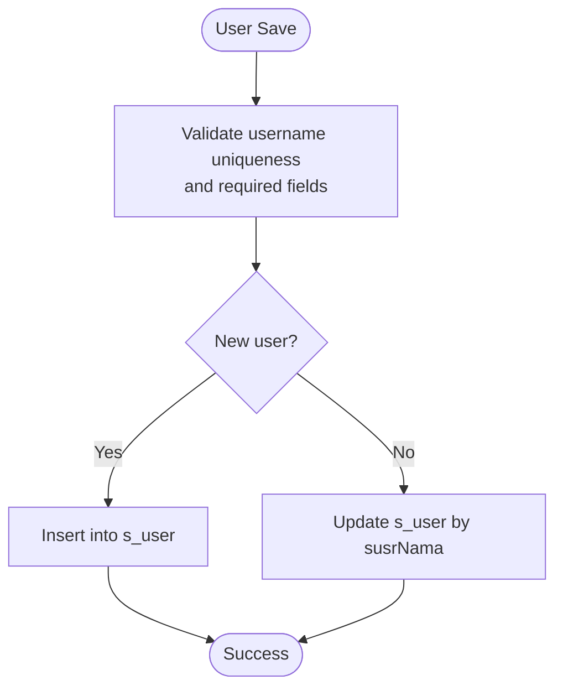
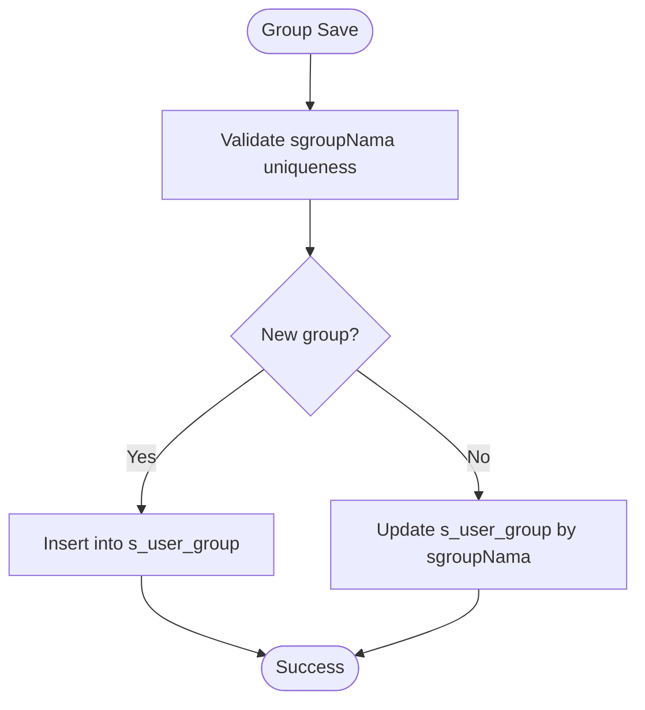
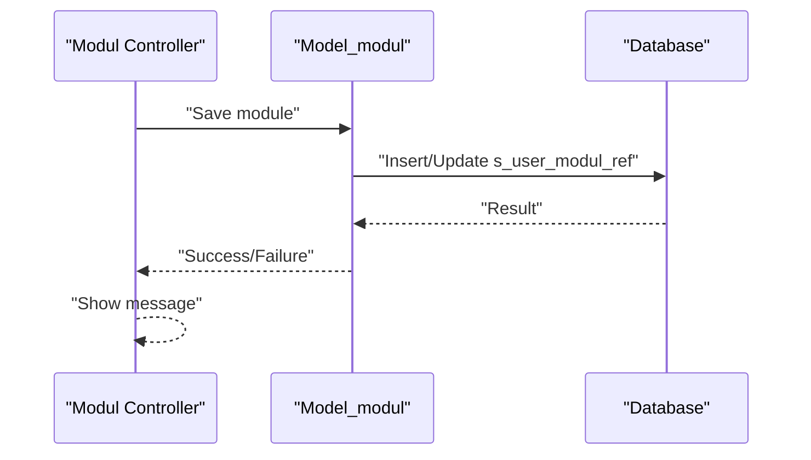
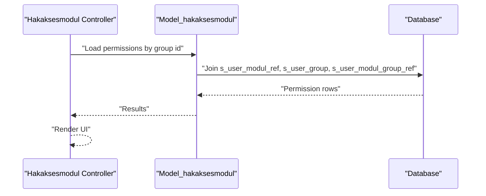
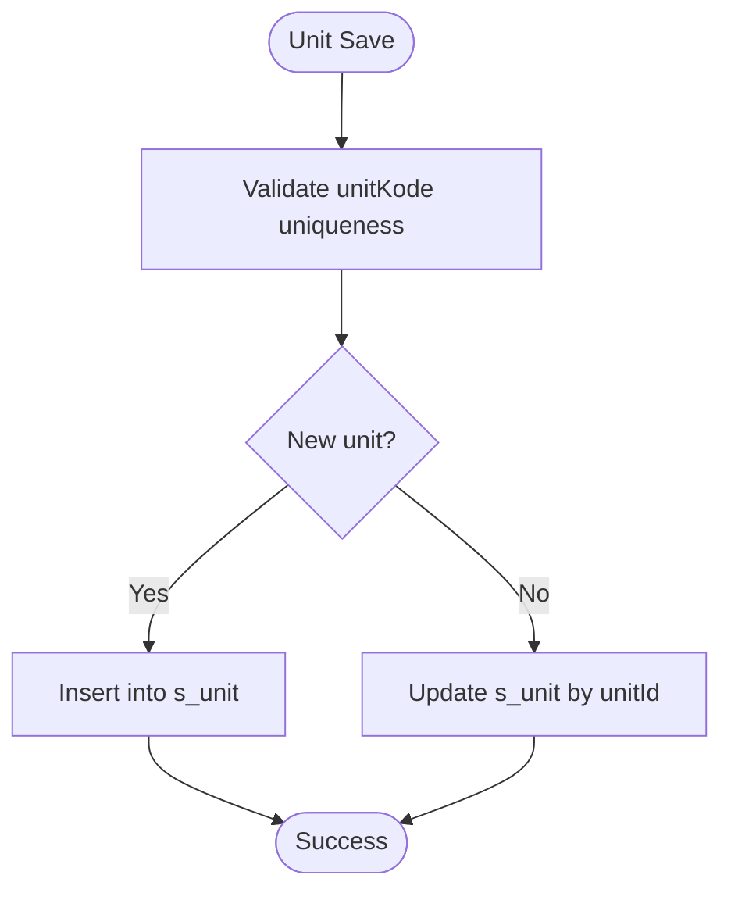
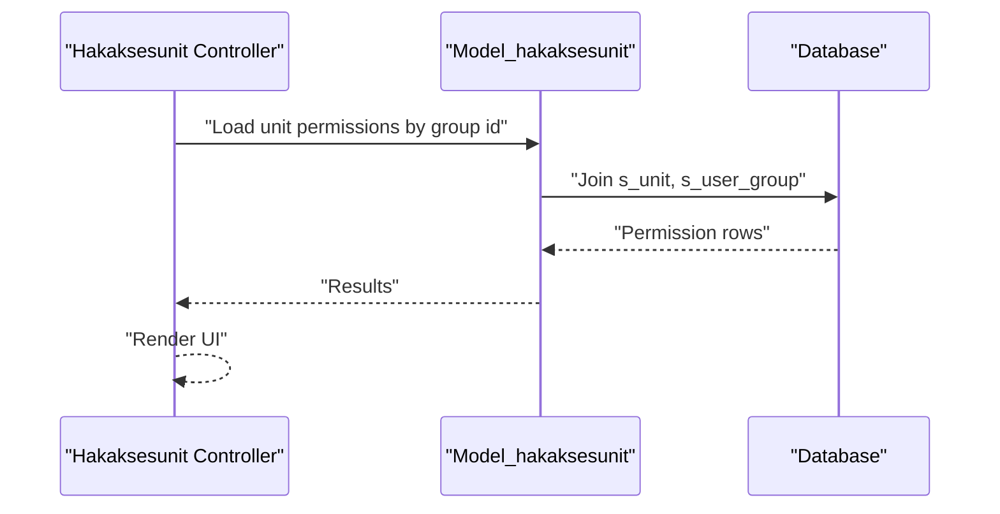
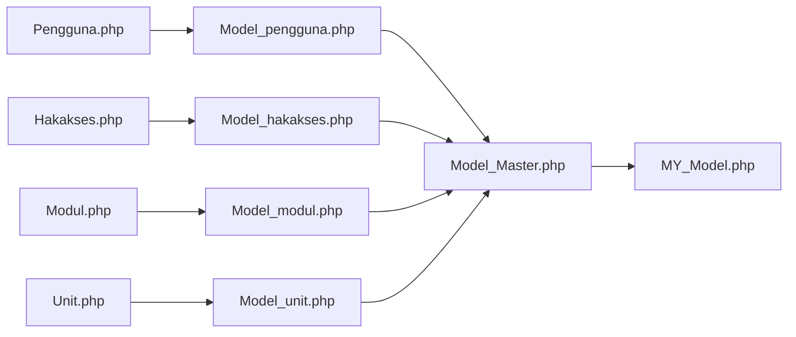

# Database Schema

<cite>
**Referenced Files in This Document**
- [Model_Master.php](file://src/application/core/Model_Master.php)
- [MY_Model.php](file://src/application/core/MY_Model.php)
- [Model_pengguna.php](file://src/application/models/Model_pengguna.php)
- [Model_hakakses.php](file://src/application/models/Model_hakakses.php)
- [Model_hakaksesmodul.php](file://src/application/models/Model_hakaksesmodul.php)
- [Model_hakaksesunit.php](file://src/application/models/Model_hakaksesunit.php)
- [Model_modul.php](file://src/application/models/Model_modul.php)
- [Model_modulgroup.php](file://src/application/models/Model_modulgroup.php)
- [Model_unit.php](file://src/application/models/Model_unit.php)
- [Pengguna.php](file://src/application/controllers/Pengguna.php)
- [Hakakses.php](file://src/application/controllers/Hakakses.php)
- [Modul.php](file://src/application/controllers/Modul.php)
- [Unit.php](file://src/application/controllers/Unit.php)
</cite>

## Table of Contents
1. [Introduction](#introduction)
2. [Project Structure](#project-structure)
3. [Core Components](#core-components)
4. [Architecture Overview](#architecture-overview)
5. [Detailed Component Analysis](#detailed-component-analysis)
6. [Dependency Analysis](#dependency-analysis)
7. [Performance Considerations](#performance-considerations)
8. [Troubleshooting Guide](#troubleshooting-guide)
9. [Conclusion](#conclusion)

## Introduction
This document describes the database schema used by Modangci’s authentication and access control system. It focuses on the user, group, module, and permission-related tables and their relationships. The schema supports multi-role user management and role-based access control across modules and units. The documentation covers table purposes, field definitions inferred from controller and model usage, join relationships, constraints observed in the application logic, and recommended indexing strategies.

## Project Structure
The authentication and access control logic is implemented using CodeIgniter MVC components:
- Controllers orchestrate requests and render views for user, group, module, and unit management.
- Models encapsulate database operations and define table names and joins.
- Core model classes provide shared CRUD and transaction utilities.

**Diagram sources**
- [Pengguna.php:1-136](file://src/application/controllers/Pengguna.php#L1-L136)
- [Hakakses.php:1-109](file://src/application/controllers/Hakakses.php#L1-L109)
- [Modul.php:1-122](file://src/application/controllers/Modul.php#L1-L122)
- [Unit.php:1-110](file://src/application/controllers/Unit.php#L1-L110)
- [Model_pengguna.php:1-36](file://src/application/models/Model_pengguna.php#L1-L36)
- [Model_hakakses.php:1-11](file://src/application/models/Model_hakakses.php#L1-L11)
- [Model_hakaksesmodul.php:1-26](file://src/application/models/Model_hakaksesmodul.php#L1-L26)
- [Model_hakaksesunit.php:1-25](file://src/application/models/Model_hakaksesunit.php#L1-L25)
- [Model_modul.php:1-37](file://src/application/models/Model_modul.php#L1-L37)
- [Model_modulgroup.php:1-11](file://src/application/models/Model_modulgroup.php#L1-L11)
- [Model_unit.php:1-11](file://src/application/models/Model_unit.php#L1-L11)
- [Model_Master.php:1-257](file://src/application/core/Model_Master.php#L1-L257)
- [MY_Model.php:1-21](file://src/application/core/MY_Model.php#L1-L21)

**Section sources**
- [Pengguna.php:1-136](file://src/application/controllers/Pengguna.php#L1-L136)
- [Hakakses.php:1-109](file://src/application/controllers/Hakakses.php#L1-L109)
- [Modul.php:1-122](file://src/application/controllers/Modul.php#L1-L122)
- [Unit.php:1-110](file://src/application/controllers/Unit.php#L1-L110)
- [Model_pengguna.php:1-36](file://src/application/models/Model_pengguna.php#L1-L36)
- [Model_hakakses.php:1-11](file://src/application/models/Model_hakakses.php#L1-L11)
- [Model_hakaksesmodul.php:1-26](file://src/application/models/Model_hakaksesmodul.php#L1-L26)
- [Model_hakaksesunit.php:1-25](file://src/application/models/Model_hakaksesunit.php#L1-L25)
- [Model_modul.php:1-37](file://src/application/models/Model_modul.php#L1-L37)
- [Model_modulgroup.php:1-11](file://src/application/models/Model_modulgroup.php#L1-L11)
- [Model_unit.php:1-11](file://src/application/models/Model_unit.php#L1-L11)
- [Model_Master.php:1-257](file://src/application/core/Model_Master.php#L1-L257)
- [MY_Model.php:1-21](file://src/application/core/MY_Model.php#L1-L21)

## Core Components
This section outlines the core database entities and their roles in the authentication system:
- Users: s_user
- Groups: s_user_group
- Modules: s_user_modul_ref
- Module groups: s_user_modul_group_ref
- Group-module permissions: s_user_group_modul
- Units: s_unit
- Group-unit permissions: s_user_group_unit

These tables are referenced by controllers and models to manage users, roles, modules, and access control.

**Section sources**
- [Model_pengguna.php:4-36](file://src/application/models/Model_pengguna.php#L4-L36)
- [Model_hakaksesmodul.php:4-26](file://src/application/models/Model_hakaksesmodul.php#L4-L26)
- [Model_hakaksesunit.php:4-25](file://src/application/models/Model_hakaksesunit.php#L4-L25)
- [Model_modul.php:4-37](file://src/application/models/Model_modul.php#L4-L37)
- [Pengguna.php:60-101](file://src/application/controllers/Pengguna.php#L60-L101)
- [Hakakses.php:55-94](file://src/application/controllers/Hakakses.php#L55-L94)
- [Modul.php:59-107](file://src/application/controllers/Modul.php#L59-L107)
- [Unit.php:57-95](file://src/application/controllers/Unit.php#L57-L95)

## Architecture Overview
The authentication system uses a normalized relational schema with explicit many-to-many relationships between groups and modules, and between groups and units. Users belong to a single group and inherit permissions granted to that group.

**Diagram sources**
- [Model_pengguna.php:11-36](file://src/application/models/Model_pengguna.php#L11-L36)
- [Model_hakaksesmodul.php:12-26](file://src/application/models/Model_hakaksesmodul.php#L12-L26)
- [Model_hakaksesunit.php:12-25](file://src/application/models/Model_hakaksesunit.php#L12-L25)
- [Model_modul.php:11-37](file://src/application/models/Model_modul.php#L11-L37)
- [Pengguna.php:60-101](file://src/application/controllers/Pengguna.php#L60-L101)
- [Hakakses.php:55-94](file://src/application/controllers/Hakakses.php#L55-L94)
- [Modul.php:59-107](file://src/application/controllers/Modul.php#L59-L107)
- [Unit.php:57-95](file://src/application/controllers/Unit.php#L57-L95)

## Detailed Component Analysis

### Users (s_user)
- Purpose: Stores user accounts and associates each user with a group.
- Key fields:
  - susrNama (Primary Key): Unique username.
  - susrSgroupNama (Foreign Key): References sgroupNama in s_user_group.
  - susrProfil: Human-readable profile name.
- Constraints:
  - Unique constraint on susrNama enforced by controller validation.
  - Foreign key constraint implied by join logic in Model_pengguna.
- Typical entries:
  - A user record with a group assignment.
- Access control:
  - Permissions are inherited via the associated group.

**Diagram sources**
- [Pengguna.php:60-101](file://src/application/controllers/Pengguna.php#L60-L101)
- [Model_pengguna.php:11-36](file://src/application/models/Model_pengguna.php#L11-L36)

**Section sources**
- [Pengguna.php:60-101](file://src/application/controllers/Pengguna.php#L60-L101)
- [Model_pengguna.php:11-36](file://src/application/models/Model_pengguna.php#L11-L36)

### Groups (s_user_group)
- Purpose: Defines roles/groups used for access control.
- Key fields:
  - sgroupNama (Primary Key): Unique group identifier.
  - sgroupKeterangan: Description of the group.
- Constraints:
  - Unique constraint on sgroupNama enforced by controller validation.
- Typical entries:
  - Administrative, Operator, Viewer groups.

**Diagram sources**
- [Hakakses.php:55-94](file://src/application/controllers/Hakakses.php#L55-L94)

**Section sources**
- [Hakakses.php:55-94](file://src/application/controllers/Hakakses.php#L55-L94)

### Modules (s_user_modul_ref) and Module Groups (s_user_modul_group_ref)
- Purpose: Defines available modules and organizes them into groups for navigation and permissions.
- Key fields:
  - s_user_modul_ref:
    - susrmodulNama (Primary Key)
    - susrmodulSusrmdgroupNama (Foreign Key to s_user_modul_group_ref)
    - susrmodulNamaDisplay: Display label
    - susrmodulIsLogin: Visibility flag for non-authenticated access
    - susrmodulUrut: Ordering weight
  - s_user_modul_group_ref:
    - susrmdgroupNama (Primary Key)
    - susrmdgroupDisplay: Group display label
    - susrmdgroupIcon: Optional icon identifier
- Typical entries:
  - Module records linked to a module group with ordering and visibility flags.

**Diagram sources**
- [Modul.php:59-107](file://src/application/controllers/Modul.php#L59-L107)
- [Model_modul.php:11-37](file://src/application/models/Model_modul.php#L11-L37)

**Section sources**
- [Modul.php:59-107](file://src/application/controllers/Modul.php#L59-L107)
- [Model_modul.php:11-37](file://src/application/models/Model_modul.php#L11-L37)

### Group-Module Permissions (s_user_group_modul)
- Purpose: Grants or restricts CRUD actions on modules per group.
- Key fields:
  - sgroupmodulSgroupNama (Composite/Foreign Key)
  - sgroupmodulSusrmodulNama (Composite/Foreign Key)
  - sgroupmodulSusrmodulCreate/Read/Update/Delete (Boolean flags)
- Typical entries:
  - A group assigned permissions for specific modules with granular action flags.

**Diagram sources**
- [Model_hakaksesmodul.php:12-26](file://src/application/models/Model_hakaksesmodul.php#L12-L26)

**Section sources**
- [Model_hakaksesmodul.php:12-26](file://src/application/models/Model_hakaksesmodul.php#L12-L26)

### Units (s_unit)
- Purpose: Represents organizational units.
- Key fields:
  - unitId (Primary Key)
  - unitKode (Unique)
  - unitNama
- Typical entries:
  - Department or division identifiers.

**Diagram sources**
- [Unit.php:57-95](file://src/application/controllers/Unit.php#L57-L95)

**Section sources**
- [Unit.php:57-95](file://src/application/controllers/Unit.php#L57-L95)

### Group-Unit Permissions (s_user_group_unit)
- Purpose: Grants or restricts CRUD actions on units per group.
- Key fields:
  - sgroupunitSgroupNama (Composite/Foreign Key)
  - sgroupunitUnitId (Composite/Foreign Key)
  - sgroupunitCreate/Read/Update/Delete (Boolean flags)
- Typical entries:
  - A group assigned permissions for specific units with granular action flags.

**Diagram sources**
- [Model_hakaksesunit.php:12-25](file://src/application/models/Model_hakaksesunit.php#L12-L25)

**Section sources**
- [Model_hakaksesunit.php:12-25](file://src/application/models/Model_hakaksesunit.php#L12-L25)

## Dependency Analysis
The controllers depend on models to fetch and persist data. Models rely on the shared database abstraction to perform CRUD operations and joins. The core model class centralizes transaction handling and logging.

**Diagram sources**
- [Pengguna.php:1-136](file://src/application/controllers/Pengguna.php#L1-L136)
- [Hakakses.php:1-109](file://src/application/controllers/Hakakses.php#L1-L109)
- [Modul.php:1-122](file://src/application/controllers/Modul.php#L1-L122)
- [Unit.php:1-110](file://src/application/controllers/Unit.php#L1-L110)
- [Model_pengguna.php:1-36](file://src/application/models/Model_pengguna.php#L1-L36)
- [Model_hakakses.php:1-11](file://src/application/models/Model_hakakses.php#L1-L11)
- [Model_modul.php:1-37](file://src/application/models/Model_modul.php#L1-L37)
- [Model_unit.php:1-11](file://src/application/models/Model_unit.php#L1-L11)
- [Model_Master.php:1-257](file://src/application/core/Model_Master.php#L1-L257)
- [MY_Model.php:1-21](file://src/application/core/MY_Model.php#L1-L21)

**Section sources**
- [Model_Master.php:56-186](file://src/application/core/Model_Master.php#L56-L186)
- [MY_Model.php:1-21](file://src/application/core/MY_Model.php#L1-L21)

## Performance Considerations
- Indexes:
  - Primary keys are implicitly indexed by the RDBMS.
  - Consider adding composite indexes on:
    - s_user(susrSgroupNama) for efficient user-to-group joins.
    - s_user_group_modul(sgroupmodulSgroupNama, sgroupmodulSusrmodulNama) for fast permission lookups.
    - s_user_group_unit(sgroupunitSgroupNama, sgroupunitUnitId) for fast unit permission lookups.
    - s_user_modul_ref(susrmodulSusrmdgroupNama) to accelerate module-group joins.
- Queries:
  - Prefer selective SELECT lists and WHERE clauses to reduce I/O.
  - Batch operations (insert_batch/update_batch) can improve throughput when updating permissions.
- Transactions:
  - All CRUD operations are wrapped in transactions in the core model, ensuring atomicity but potentially increasing lock contention under high concurrency.

[No sources needed since this section provides general guidance]

## Troubleshooting Guide
- Duplicate key errors:
  - Unique constraints on usernames and group names are validated by controllers. Errors manifest as database errors during insert/update.
- Foreign key violations:
  - Join logic implies referential integrity. Ensure s_user.susrSgroupNama references s_user_group.sgroupNama and s_user_group_modul links to both s_user_group and s_user_modul_ref.
- Permission mismatches:
  - Verify s_user_group_modul flags for Read/Create/Update/Delete align with intended access.
- Logging:
  - Core model logs queries when a debug logging helper exists, aiding diagnosis of failed operations.

**Section sources**
- [Pengguna.php:64-66](file://src/application/controllers/Pengguna.php#L64-L66)
- [Hakakses.php:58-61](file://src/application/controllers/Hakakses.php#L58-L61)
- [Modul.php:62-70](file://src/application/controllers/Modul.php#L62-L70)
- [Unit.php:60-64](file://src/application/controllers/Unit.php#L60-L64)
- [Model_Master.php:56-186](file://src/application/core/Model_Master.php#L56-L186)

## Conclusion
Modangci’s authentication schema centers on a clean separation of concerns: users belong to groups, groups grant permissions to modules and units, and controllers coordinate data entry and retrieval. The schema supports multi-role access control with granular CRUD flags and leverages CodeIgniter’s model layer for consistent database operations and transactional integrity.