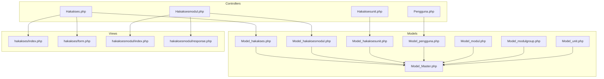
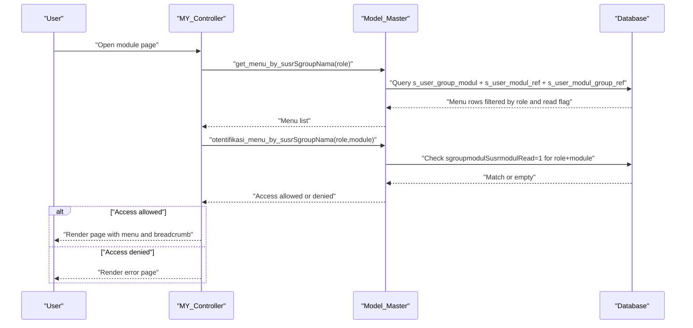
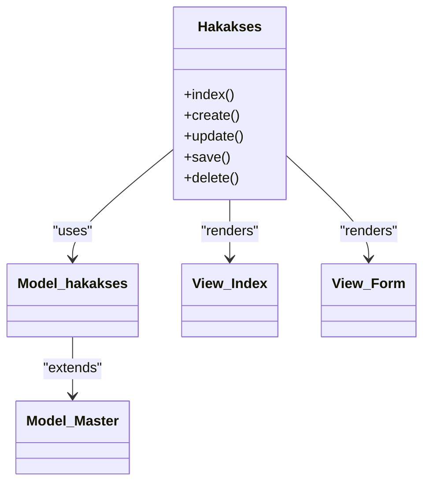
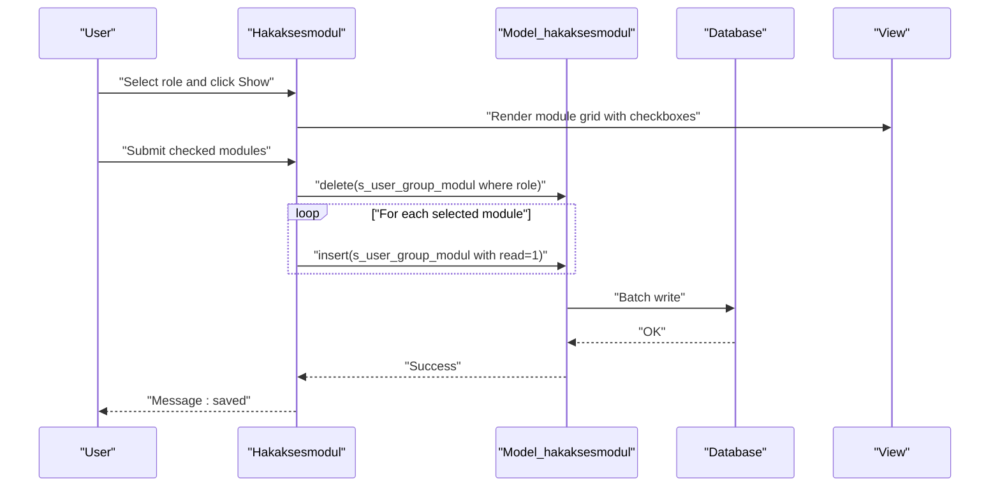
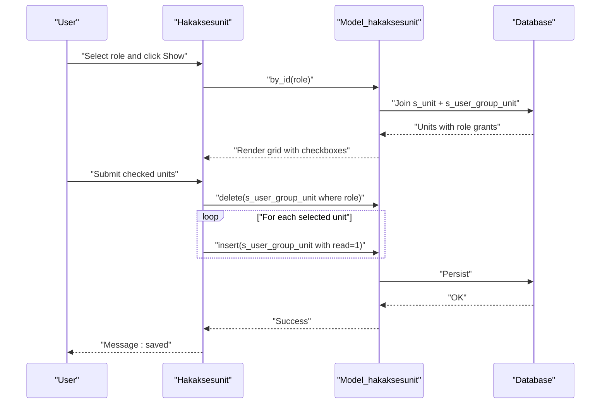
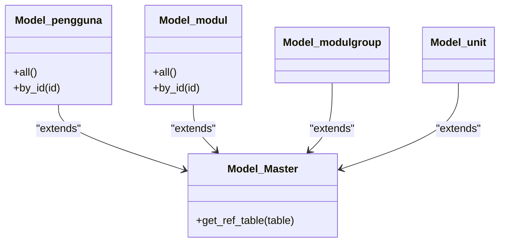
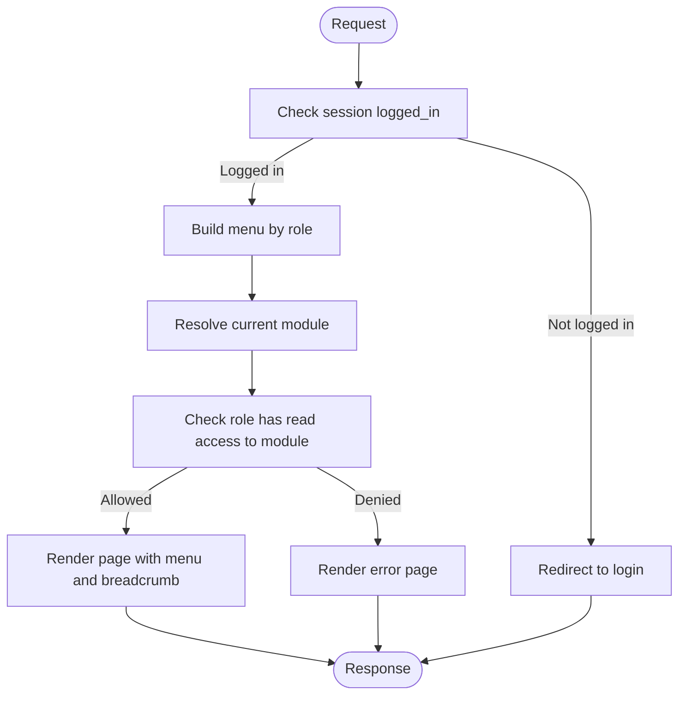
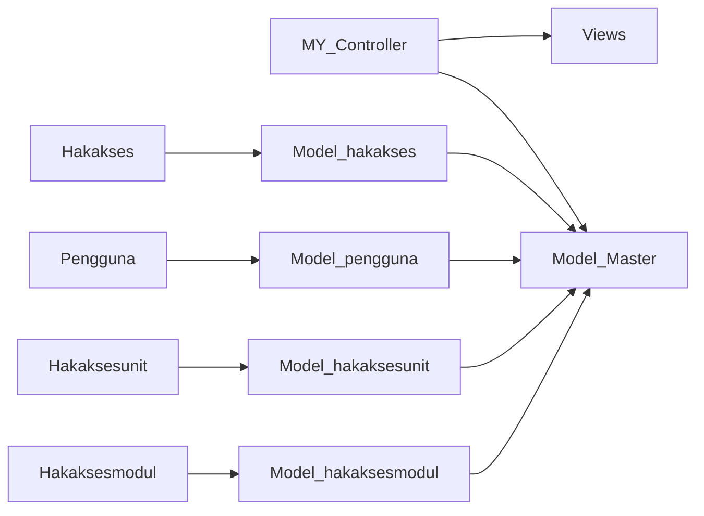

# Role and Permission System

<cite>
**Referenced Files in This Document**
- [MY_Controller.php](file://src/application/core/MY_Controller.php)
- [Model_Master.php](file://src/application/core/Model_Master.php)
- [Hakakses.php](file://src/application/controllers/Hakakses.php)
- [Model_hakakses.php](file://src/application/models/Model_hakakses.php)
- [Hakaksesmodul.php](file://src/application/controllers/Hakaksesmodul.php)
- [Model_hakaksesmodul.php](file://src/application/models/Model_hakaksesmodul.php)
- [Hakaksesunit.php](file://src/application/controllers/Hakaksesunit.php)
- [Model_hakaksesunit.php](file://src/application/models/Model_hakaksesunit.php)
- [Pengguna.php](file://src/application/controllers/Pengguna.php)
- [Model_pengguna.php](file://src/application/models/Model_pengguna.php)
- [Model_modul.php](file://src/application/models/Model_modul.php)
- [Model_modulgroup.php](file://src/application/models/Model_modulgroup.php)
- [Model_unit.php](file://src/application/models/Model_unit.php)
- [index.php (hakakses/index)](file://src/application/views/pages/hakakses/index.php)
- [form.php (hakakses/form)](file://src/application/views/pages/hakakses/form.php)
- [index.php (hakaksesmodul/index)](file://src/application/views/pages/hakaksesmodul/index.php)
- [response.php (hakaksesmodul/response)](file://src/application/views/pages/hakaksesmodul/response.php)
</cite>

## Table of Contents
1. [Introduction](#introduction)
2. [Project Structure](#project-structure)
3. [Core Components](#core-components)
4. [Architecture Overview](#architecture-overview)
5. [Detailed Component Analysis](#detailed-component-analysis)
6. [Dependency Analysis](#dependency-analysis)
7. [Performance Considerations](#performance-considerations)
8. [Troubleshooting Guide](#troubleshooting-guide)
9. [Conclusion](#conclusion)
10. [Appendices](#appendices)

## Introduction
This document explains Modangci’s role and permission management system. It covers the hierarchical role structure, permission assignment mechanisms, and access control implementation. It documents the role-based navigation system, module permissions, and unit-based access control. It also details the permission matrix, role inheritance patterns, and dynamic menu generation based on user roles. Practical examples illustrate role creation, permission assignment, and access control enforcement. Finally, it addresses permission validation, access checking mechanisms, and troubleshooting permission-related issues.

## Project Structure
The permission system spans controllers, models, and views under the application directory. Controllers orchestrate user actions and delegate to models for persistence and retrieval. Models encapsulate database queries and permission logic. Views render role and permission management screens.

**Diagram sources**
- [Hakakses.php:1-109](file://src/application/controllers/Hakakses.php#L1-L109)
- [Hakaksesmodul.php:1-82](file://src/application/controllers/Hakaksesmodul.php#L1-L82)
- [Hakaksesunit.php:1-83](file://src/application/controllers/Hakaksesunit.php#L1-L83)
- [Pengguna.php:1-136](file://src/application/controllers/Pengguna.php#L1-L136)
- [Model_hakakses.php:1-11](file://src/application/models/Model_hakakses.php#L1-L11)
- [Model_hakaksesmodul.php:1-26](file://src/application/models/Model_hakaksesmodul.php#L1-L26)
- [Model_hakaksesunit.php:1-25](file://src/application/models/Model_hakaksesunit.php#L1-L25)
- [Model_pengguna.php:1-36](file://src/application/models/Model_pengguna.php#L1-L36)
- [Model_modul.php:1-37](file://src/application/models/Model_modul.php#L1-L37)
- [Model_modulgroup.php:1-11](file://src/application/models/Model_modulgroup.php#L1-L11)
- [Model_unit.php:1-11](file://src/application/models/Model_unit.php#L1-L11)
- [index.php (hakakses/index):1-88](file://src/application/views/pages/hakakses/index.php#L1-L88)
- [form.php (hakakses/form):1-52](file://src/application/views/pages/hakakses/form.php#L1-L52)
- [index.php (hakaksesmodul/index):1-50](file://src/application/views/pages/hakaksesmodul/index.php#L1-L50)
- [response.php (hakaksesmodul/response):1-74](file://src/application/views/pages/hakaksesmodul/response.php#L1-L74)

**Section sources**
- [Hakakses.php:1-109](file://src/application/controllers/Hakakses.php#L1-L109)
- [Hakaksesmodul.php:1-82](file://src/application/controllers/Hakaksesmodul.php#L1-L82)
- [Hakaksesunit.php:1-83](file://src/application/controllers/Hakaksesunit.php#L1-L83)
- [Pengguna.php:1-136](file://src/application/controllers/Pengguna.php#L1-L136)
- [Model_Master.php:1-257](file://src/application/core/Model_Master.php#L1-L257)
- [MY_Controller.php:1-59](file://src/application/core/MY_Controller.php#L1-L59)
- [Model_hakakses.php:1-11](file://src/application/models/Model_hakakses.php#L1-L11)
- [Model_hakaksesmodul.php:1-26](file://src/application/models/Model_hakaksesmodul.php#L1-L26)
- [Model_hakaksesunit.php:1-25](file://src/application/models/Model_hakaksesunit.php#L1-L25)
- [Model_pengguna.php:1-36](file://src/application/models/Model_pengguna.php#L1-L36)
- [Model_modul.php:1-37](file://src/application/models/Model_modul.php#L1-L37)
- [Model_modulgroup.php:1-11](file://src/application/models/Model_modulgroup.php#L1-L11)
- [Model_unit.php:1-11](file://src/application/models/Model_unit.php#L1-L11)
- [index.php (hakakses/index):1-88](file://src/application/views/pages/hakakses/index.php#L1-L88)
- [form.php (hakakses/form):1-52](file://src/application/views/pages/hakakses/form.php#L1-L52)
- [index.php (hakaksesmodul/index):1-50](file://src/application/views/pages/hakaksesmodul/index.php#L1-L50)
- [response.php (hakaksesmodul/response):1-74](file://src/application/views/pages/hakaksesmodul/response.php#L1-L74)

## Core Components
- Role definition and management:
  - Role entity: s_user_group (name and description).
  - Management UI: controllers and views for listing, creating, updating, and deleting roles.
- Module permissions:
  - Role-to-module mapping via s_user_group_modul with read flag.
  - Dynamic menu generation based on role’s granted modules.
- Unit permissions:
  - Role-to-unit mapping via s_user_group_unit with read flag.
  - Unit-scoped access control enforced per role.
- User assignment:
  - Users belong to a single role (susrSgroupNama).
  - User CRUD operations and password reset.
- Access control enforcement:
  - Base controller checks module access per role before rendering pages.
  - Menu building and breadcrumb resolution rely on role permissions.

Key implementation references:
- Role CRUD: [Hakakses.php:22-107](file://src/application/controllers/Hakakses.php#L22-L107)
- Module permission assignment: [Hakaksesmodul.php:22-81](file://src/application/controllers/Hakaksesmodul.php#L22-L81)
- Unit permission assignment: [Hakaksesunit.php:22-81](file://src/application/controllers/Hakaksesunit.php#L22-L81)
- User management and role assignment: [Pengguna.php:22-134](file://src/application/controllers/Pengguna.php#L22-L134)
- Access control and menu generation: [MY_Controller.php:20-51](file://src/application/core/MY_Controller.php#L20-L51), [Model_Master.php:188-256](file://src/application/core/Model_Master.php#L188-L256)

**Section sources**
- [Hakakses.php:22-107](file://src/application/controllers/Hakakses.php#L22-L107)
- [Hakaksesmodul.php:22-81](file://src/application/controllers/Hakaksesmodul.php#L22-L81)
- [Hakaksesunit.php:22-81](file://src/application/controllers/Hakaksesunit.php#L22-L81)
- [Pengguna.php:22-134](file://src/application/controllers/Pengguna.php#L22-L134)
- [MY_Controller.php:20-51](file://src/application/core/MY_Controller.php#L20-L51)
- [Model_Master.php:188-256](file://src/application/core/Model_Master.php#L188-L256)

## Architecture Overview
The system enforces role-based access control at two levels:
- UI navigation: menu items are dynamically generated from a role’s granted modules.
- Request-level access: controllers check whether the current role has permission to access a given module.

**Diagram sources**
- [MY_Controller.php:20-51](file://src/application/core/MY_Controller.php#L20-L51)
- [Model_Master.php:188-256](file://src/application/core/Model_Master.php#L188-L256)

**Section sources**
- [MY_Controller.php:20-51](file://src/application/core/MY_Controller.php#L20-L51)
- [Model_Master.php:188-256](file://src/application/core/Model_Master.php#L188-L256)

## Detailed Component Analysis

### Role Definition and Management
Roles are stored in s_user_group with name and description. The system supports listing, creating, editing, and deleting roles. The UI renders a table of roles and provides create/edit forms.

**Diagram sources**
- [Hakakses.php:1-109](file://src/application/controllers/Hakakses.php#L1-L109)
- [Model_hakakses.php:1-11](file://src/application/models/Model_hakakses.php#L1-L11)
- [Model_Master.php:1-257](file://src/application/core/Model_Master.php#L1-L257)
- [index.php (hakakses/index):1-88](file://src/application/views/pages/hakakses/index.php#L1-L88)
- [form.php (hakakses/form):1-52](file://src/application/views/pages/hakakses/form.php#L1-L52)

Practical example: Creating a role
- Navigate to the role management page and click Create.
- Fill in the role name and description.
- Submit the form; the controller validates input and persists to s_user_group.

Practical example: Deleting a role
- From the role list, trigger Delete for a selected role.
- The controller decodes the key, deletes the record, and reports success or error.

**Section sources**
- [Hakakses.php:22-107](file://src/application/controllers/Hakakses.php#L22-L107)
- [index.php (hakakses/index):1-88](file://src/application/views/pages/hakakses/index.php#L1-L88)
- [form.php (hakakses/form):1-52](file://src/application/views/pages/hakakses/form.php#L1-L52)

### Module Permissions and Role-Based Navigation
Module permissions are managed per role via s_user_group_modul. Each role-module pair stores a read flag indicating access. The menu is built from this mapping and grouped by module group.

**Diagram sources**
- [Hakaksesmodul.php:31-81](file://src/application/controllers/Hakaksesmodul.php#L31-L81)
- [Model_hakaksesmodul.php:12-24](file://src/application/models/Model_hakaksesmodul.php#L12-L24)
- [index.php (hakaksesmodul/index):1-50](file://src/application/views/pages/hakaksesmodul/index.php#L1-L50)
- [response.php (hakaksesmodul/response):1-74](file://src/application/views/pages/hakaksesmodul/response.php#L1-L74)

Permission matrix concept
- Rows: Roles (s_user_group).
- Columns: Modules (s_user_modul_ref).
- Cells: Read flag (sgroupmodulSusrmodulRead).
- Grouping: Modules grouped by s_user_modul_group_ref.

Role inheritance pattern
- The system does not define explicit role inheritance. Access is granted per role-module pair. To emulate inheritance, assign the same modules to multiple roles and manage them centrally.

Dynamic menu generation
- Menu construction: [Model_Master.php:188-205](file://src/application/core/Model_Master.php#L188-L205)
- Access check per module: [Model_Master.php:222-238](file://src/application/core/Model_Master.php#L222-L238)
- Controller integration: [MY_Controller.php:24-41](file://src/application/core/MY_Controller.php#L24-L41)

**Section sources**
- [Hakaksesmodul.php:22-81](file://src/application/controllers/Hakaksesmodul.php#L22-L81)
- [Model_hakaksesmodul.php:1-26](file://src/application/models/Model_hakaksesmodul.php#L1-L26)
- [Model_Master.php:188-256](file://src/application/core/Model_Master.php#L188-L256)
- [MY_Controller.php:20-51](file://src/application/core/MY_Controller.php#L20-L51)
- [index.php (hakaksesmodul/index):1-50](file://src/application/views/pages/hakaksesmodul/index.php#L1-L50)
- [response.php (hakaksesmodul/response):1-74](file://src/application/views/pages/hakaksesmodul/response.php#L1-L74)

### Unit-Based Access Control
Unit permissions are managed per role via s_user_group_unit. Each role-unit pair stores a read flag indicating access. The UI lists units and allows assigning units to a role.

**Diagram sources**
- [Hakaksesunit.php:31-81](file://src/application/controllers/Hakaksesunit.php#L31-L81)
- [Model_hakaksesunit.php:12-23](file://src/application/models/Model_hakaksesunit.php#L12-L23)

Unit permissions relationship
- Units are defined in s_unit.
- Grants are stored in s_user_group_unit with foreign keys to role and unit.

**Section sources**
- [Hakaksesunit.php:22-81](file://src/application/controllers/Hakaksesunit.php#L22-L81)
- [Model_hakaksesunit.php:1-25](file://src/application/models/Model_hakaksesunit.php#L1-L25)

### User Groups, Module Permissions, and Individual User Permissions
Users are associated with a single role (susrSgroupNama). Module and unit permissions are inherited from the user’s role. The system does not implement per-user overrides for modules/units; all access is role-driven.

**Diagram sources**
- [Model_pengguna.php:1-36](file://src/application/models/Model_pengguna.php#L1-L36)
- [Model_Master.php:1-257](file://src/application/core/Model_Master.php#L1-L257)
- [Model_modul.php:1-37](file://src/application/models/Model_modul.php#L1-L37)
- [Model_modulgroup.php:1-11](file://src/application/models/Model_modulgroup.php#L1-L11)
- [Model_unit.php:1-11](file://src/application/models/Model_unit.php#L1-L11)

User management and role assignment
- List users with role names joined from s_user_group.
- Create/update user with role selection.
- Reset user password using a helper.

**Section sources**
- [Pengguna.php:22-134](file://src/application/controllers/Pengguna.php#L22-L134)
- [Model_pengguna.php:11-36](file://src/application/models/Model_pengguna.php#L11-L36)

### Access Control Enforcement and Validation
Access control is enforced in two steps:
1) Menu and page availability:
   - Menu items are built from s_user_group_modul with read flag.
   - Controller checks module access per role before rendering.
2) Form and action validation:
   - Controllers validate input and enforce required fields.
   - Database errors are captured and surfaced to users.

**Diagram sources**
- [MY_Controller.php:16-41](file://src/application/core/MY_Controller.php#L16-L41)
- [Model_Master.php:188-238](file://src/application/core/Model_Master.php#L188-L238)

Validation and error handling
- Form validation rules in controllers ensure required fields and uniqueness.
- Database transaction wrappers return success/failure; errors are reported to users.

**Section sources**
- [MY_Controller.php:16-51](file://src/application/core/MY_Controller.php#L16-L51)
- [Model_Master.php:56-186](file://src/application/core/Model_Master.php#L56-L186)
- [Hakakses.php:55-94](file://src/application/controllers/Hakakses.php#L55-L94)
- [Hakaksesmodul.php:50-81](file://src/application/controllers/Hakaksesmodul.php#L50-L81)
- [Hakaksesunit.php:50-81](file://src/application/controllers/Hakaksesunit.php#L50-L81)
- [Pengguna.php:60-101](file://src/application/controllers/Pengguna.php#L60-L101)

## Dependency Analysis
The permission system relies on a small set of core models and controllers. Controllers depend on models for data access and on views for presentation. The base controller centralizes access control logic.

**Diagram sources**
- [MY_Controller.php:1-59](file://src/application/core/MY_Controller.php#L1-L59)
- [Model_Master.php:1-257](file://src/application/core/Model_Master.php#L1-L257)
- [Hakaksesmodul.php:1-82](file://src/application/controllers/Hakaksesmodul.php#L1-L82)
- [Model_hakaksesmodul.php:1-26](file://src/application/models/Model_hakaksesmodul.php#L1-L26)
- [Hakaksesunit.php:1-83](file://src/application/controllers/Hakaksesunit.php#L1-L83)
- [Model_hakaksesunit.php:1-25](file://src/application/models/Model_hakaksesunit.php#L1-L25)
- [Pengguna.php:1-136](file://src/application/controllers/Pengguna.php#L1-L136)
- [Model_pengguna.php:1-36](file://src/application/models/Model_pengguna.php#L1-L36)
- [Hakakses.php:1-109](file://src/application/controllers/Hakakses.php#L1-L109)
- [Model_hakakses.php:1-11](file://src/application/models/Model_hakakses.php#L1-L11)

**Section sources**
- [MY_Controller.php:1-59](file://src/application/core/MY_Controller.php#L1-L59)
- [Model_Master.php:1-257](file://src/application/core/Model_Master.php#L1-L257)
- [Hakaksesmodul.php:1-82](file://src/application/controllers/Hakaksesmodul.php#L1-L82)
- [Model_hakaksesmodul.php:1-26](file://src/application/models/Model_hakaksesmodul.php#L1-L26)
- [Hakaksesunit.php:1-83](file://src/application/controllers/Hakaksesunit.php#L1-L83)
- [Model_hakaksesunit.php:1-25](file://src/application/models/Model_hakaksesunit.php#L1-L25)
- [Pengguna.php:1-136](file://src/application/controllers/Pengguna.php#L1-L136)
- [Model_pengguna.php:1-36](file://src/application/models/Model_pengguna.php#L1-L36)
- [Hakakses.php:1-109](file://src/application/controllers/Hakakses.php#L1-L109)
- [Model_hakakses.php:1-11](file://src/application/models/Model_hakakses.php#L1-L11)

## Performance Considerations
- Prefer batch inserts for module/unit assignments to reduce round-trips.
- Indexes on join columns (role, module, unit) improve menu and access checks.
- Limit menu queries to necessary columns to minimize payload.
- Use transactions for assignment operations to maintain consistency.

## Troubleshooting Guide
Common issues and resolutions:
- Access denied to a module:
  - Verify the role has sgroupmodulSusrmodulRead=1 for the module.
  - Confirm the module belongs to a visible group (non-null susrmdgroupNama).
  - Check the current module name matches the role’s granted module.
- Menu item missing:
  - Ensure the module’s group is not null and ordered correctly.
  - Confirm the role exists and is assigned to users.
- Role deletion fails:
  - Check for dependent records in s_user_group_modul or s_user_group_unit.
  - Remove dependencies before deletion.
- User cannot log in:
  - Confirm session contains logged_in and role information.
  - Ensure the user’s role has at least one granted module.

Diagnostic references:
- Access check logic: [Model_Master.php:222-238](file://src/application/core/Model_Master.php#L222-L238)
- Menu building: [Model_Master.php:188-205](file://src/application/core/Model_Master.php#L188-L205)
- Controller access enforcement: [MY_Controller.php:24-41](file://src/application/core/MY_Controller.php#L24-L41)

**Section sources**
- [Model_Master.php:188-238](file://src/application/core/Model_Master.php#L188-L238)
- [MY_Controller.php:24-41](file://src/application/core/MY_Controller.php#L24-L41)

## Conclusion
Modangci’s role and permission system centers on three pillars: roles (s_user_group), module permissions (s_user_group_modul), and unit permissions (s_user_group_unit). Access control is enforced at both the navigation and request levels. The base controller builds menus from role grants and checks module access before rendering pages. Users are assigned to a single role, inheriting all module and unit permissions for that role. The system provides straightforward CRUD for roles and permission assignment UIs for modules and units, with robust validation and error reporting.

## Appendices

### Permission Matrix Reference
- Roles: s_user_group (sgroupNama, sgroupKeterangan)
- Modules: s_user_modul_ref (susrmodulNama, susrmodulNamaDisplay, susrmdgroupNama)
- Module groups: s_user_modul_group_ref (susrmdgroupNama, susrmdgroupDisplay)
- Role-module grants: s_user_group_modul (sgroupmodulSgroupNama, sgroupmodulSusrmodulNama, sgroupmodulSusrmodulRead)
- Units: s_unit (unitId, ...)
- Role-unit grants: s_user_group_unit (sgroupunitSgroupNama, sgroupunitUnitId, sgroupunitUnitRead)

**Section sources**
- [Model_Master.php:188-256](file://src/application/core/Model_Master.php#L188-L256)
- [Model_hakaksesmodul.php:12-24](file://src/application/models/Model_hakaksesmodul.php#L12-L24)
- [Model_hakaksesunit.php:12-23](file://src/application/models/Model_hakaksesunit.php#L12-L23)