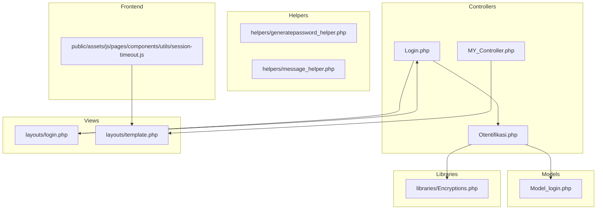
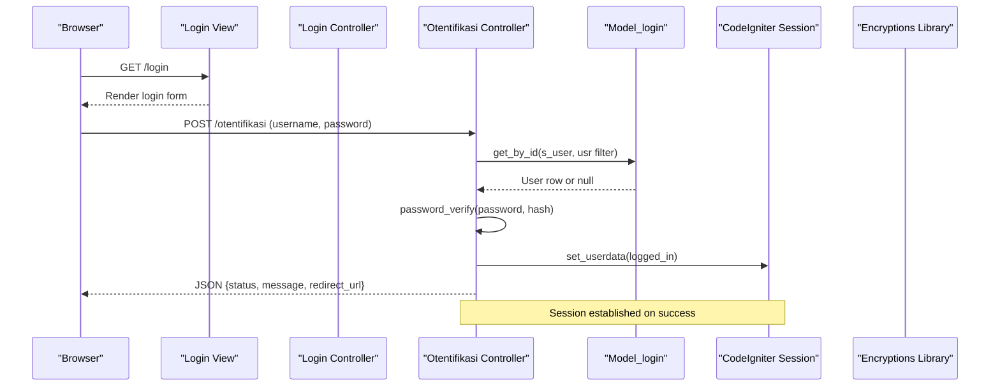
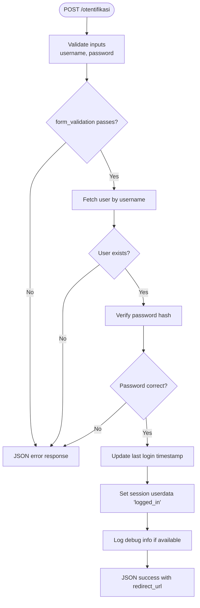
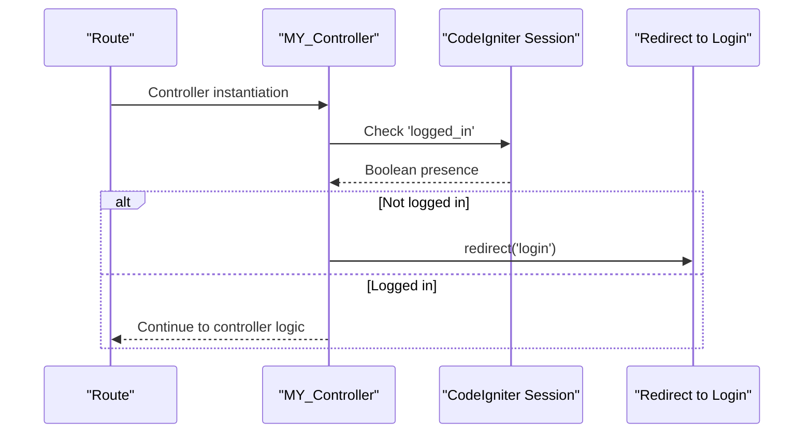
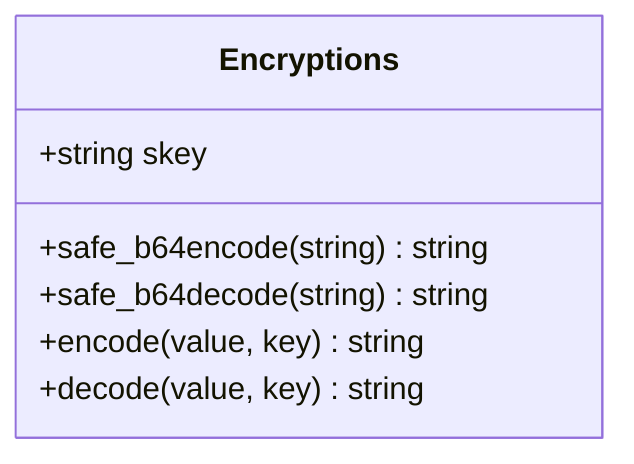
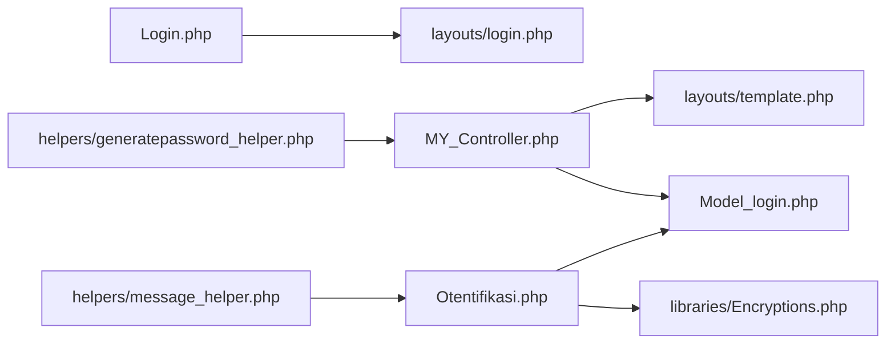
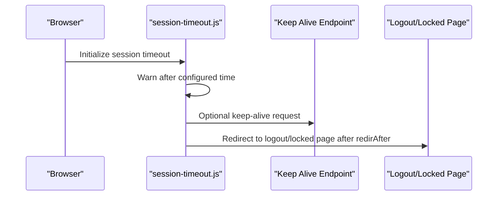

# Session Management and Security

<cite>
**Referenced Files in This Document**
- [Login.php](file://src/application/controllers/Login.php)
- [Otentifikasi.php](file://src/application/controllers/Otentifikasi.php)
- [MY_Controller.php](file://src/application/core/MY_Controller.php)
- [Encryptions.php](file://src/application/libraries/Encryptions.php)
- [Model_login.php](file://src/application/models/Model_login.php)
- [login.php](file://src/application/views/layouts/login.php)
- [template.php](file://src/application/views/layouts/template.php)
- [session-timeout.js](file://src/public/assets/js/pages/components/utils/session-timeout.js)
- [generatepassword_helper.php](file://src/application/helpers/generatepassword_helper.php)
- [message_helper.php](file://src/application/helpers/message_helper.php)
</cite>

## Table of Contents
1. [Introduction](#introduction)
2. [Project Structure](#project-structure)
3. [Core Components](#core-components)
4. [Architecture Overview](#architecture-overview)
5. [Detailed Component Analysis](#detailed-component-analysis)
6. [Dependency Analysis](#dependency-analysis)
7. [Performance Considerations](#performance-considerations)
8. [Security Measures](#security-measures)
9. [Session Timeout Handling](#session-timeout-handling)
10. [Troubleshooting Guide](#troubleshooting-guide)
11. [Conclusion](#conclusion)

## Introduction
This document explains Modangci’s session management and security features with a focus on authentication flows, session lifecycle, password handling, encryption, CSRF protection, input sanitization, and session timeout policies. It documents how the system authenticates users, maintains session state, validates access permissions, and enforces security best practices to protect against common threats such as session hijacking and unauthorized access.

## Project Structure
The authentication and session management logic spans controllers, a base controller, a custom encryption library, views, and frontend session timeout utilities. The following diagram shows the high-level structure and interactions among key components.

**Diagram sources**
- [Login.php:1-18](file://src/application/controllers/Login.php#L1-L18)
- [Otentifikasi.php:1-64](file://src/application/controllers/Otentifikasi.php#L1-L64)
- [MY_Controller.php:1-59](file://src/application/core/MY_Controller.php#L1-L59)
- [Model_login.php:1-9](file://src/application/models/Model_login.php#L1-L9)
- [login.php:1-140](file://src/application/views/layouts/login.php#L1-L140)
- [template.php:1-180](file://src/application/views/layouts/template.php#L1-L180)
- [Encryptions.php:1-56](file://src/application/libraries/Encryptions.php#L1-L56)
- [generatepassword_helper.php:1-26](file://src/application/helpers/generatepassword_helper.php#L1-L26)
- [message_helper.php:1-22](file://src/application/helpers/message_helper.php#L1-L22)
- [session-timeout.js:1-31](file://src/public/assets/js/pages/components/utils/session-timeout.js#L1-L31)

**Section sources**
- [Login.php:1-18](file://src/application/controllers/Login.php#L1-L18)
- [Otentifikasi.php:1-64](file://src/application/controllers/Otentifikasi.php#L1-L64)
- [MY_Controller.php:1-59](file://src/application/core/MY_Controller.php#L1-L59)
- [login.php:1-140](file://src/application/views/layouts/login.php#L1-L140)
- [template.php:1-180](file://src/application/views/layouts/template.php#L1-L180)
- [Encryptions.php:1-56](file://src/application/libraries/Encryptions.php#L1-L56)
- [generatepassword_helper.php:1-26](file://src/application/helpers/generatepassword_helper.php#L1-L26)
- [message_helper.php:1-22](file://src/application/helpers/message_helper.php#L1-L22)
- [session-timeout.js:1-31](file://src/public/assets/js/pages/components/utils/session-timeout.js#L1-L31)

## Core Components
- Authentication Controllers
  - Login controller initializes the login page and redirects authenticated users away from the login route.
  - Authentication controller validates credentials, checks database records, verifies passwords, sets session data, and returns JSON responses.
- Base Controller and Access Control
  - Base controller enforces session presence for protected routes and redirects unauthenticated users to the login page.
- Encryption Library
  - Provides AES-256-CBC encoding/decoding with URL-safe base64 and configurable keys.
- Helpers
  - Password generation helper produces numeric tokens for temporary use.
  - Message helper standardizes JSON responses for UI messaging.
- Views
  - Login view renders the sign-in form targeting the authentication endpoint.
  - Template view loads layout and assets for authenticated pages.
- Frontend Session Timeout
  - Session timeout plugin configuration for warnings, keep-alive, and redirection.

**Section sources**
- [Login.php:1-18](file://src/application/controllers/Login.php#L1-L18)
- [Otentifikasi.php:1-64](file://src/application/controllers/Otentifikasi.php#L1-L64)
- [MY_Controller.php:1-59](file://src/application/core/MY_Controller.php#L1-L59)
- [Encryptions.php:1-56](file://src/application/libraries/Encryptions.php#L1-L56)
- [generatepassword_helper.php:1-26](file://src/application/helpers/generatepassword_helper.php#L1-L26)
- [message_helper.php:1-22](file://src/application/helpers/message_helper.php#L1-L22)
- [login.php:1-140](file://src/application/views/layouts/login.php#L1-L140)
- [template.php:1-180](file://src/application/views/layouts/template.php#L1-L180)
- [session-timeout.js:1-31](file://src/public/assets/js/pages/components/utils/session-timeout.js#L1-L31)

## Architecture Overview
The authentication architecture follows a layered MVC pattern with explicit session enforcement and standardized responses.

**Diagram sources**
- [login.php:72-82](file://src/application/views/layouts/login.php#L72-L82)
- [Login.php:1-18](file://src/application/controllers/Login.php#L1-L18)
- [Otentifikasi.php:1-64](file://src/application/controllers/Otentifikasi.php#L1-L64)
- [Model_login.php:1-9](file://src/application/models/Model_login.php#L1-L9)
- [Encryptions.php:1-56](file://src/application/libraries/Encryptions.php#L1-L56)

## Detailed Component Analysis

### Login Controller
- Purpose: Prevents authenticated users from accessing the login page and renders the login view for anonymous users.
- Behavior:
  - Checks session flag and redirects to home if already logged in.
  - Loads the login view for unauthenticated users.

**Section sources**
- [Login.php:1-18](file://src/application/controllers/Login.php#L1-L18)
- [login.php:1-140](file://src/application/views/layouts/login.php#L1-L140)

### Authentication Controller (Otentifikasi)
- Purpose: Validates login credentials, authenticates users, updates last login timestamps, sets session data, and returns structured JSON responses.
- Validation Rules:
  - Username and password are trimmed, required, and XSS-cleaned.
  - Password triggers a custom callback to check database credentials.
- Authentication Flow:
  - Retrieves user by username from the s_user table via the model.
  - Verifies password using password_verify against stored hash.
  - On success:
    - Updates last login timestamp.
    - Sets session data under logged_in with user attributes.
    - Logs debug information if available.
    - Returns success JSON with redirect URL.
  - On failure:
    - Returns error JSON with a generic incorrect credentials message.

**Diagram sources**
- [Otentifikasi.php:14-33](file://src/application/controllers/Otentifikasi.php#L14-L33)
- [Otentifikasi.php:35-62](file://src/application/controllers/Otentifikasi.php#L35-L62)

**Section sources**
- [Otentifikasi.php:1-64](file://src/application/controllers/Otentifikasi.php#L1-L64)
- [Model_login.php:1-9](file://src/application/models/Model_login.php#L1-L9)

### Base Controller (Access Control)
- Purpose: Enforce session presence for protected controllers extending the base controller.
- Behavior:
  - Redirects unauthenticated users to the login page.
  - Provides a master data getter that builds page data using session attributes and performs module access validation.

**Diagram sources**
- [MY_Controller.php:16-17](file://src/application/core/MY_Controller.php#L16-L17)

**Section sources**
- [MY_Controller.php:1-59](file://src/application/core/MY_Controller.php#L1-L59)

### Encryption Library (Encryptions)
- Purpose: Provide symmetric encryption and decryption using AES-256-CBC with URL-safe base64 encoding.
- Key Features:
  - Initializes CodeIgniter encryption library with cipher, mode, and key.
  - Encodes/decodes values with safe base64 transformations.
  - Uses a configurable secret key for encryption operations.
- Usage Notes:
  - Suitable for encrypting sensitive data at rest or in transit when integrated with secure transport and storage practices.

**Diagram sources**
- [Encryptions.php:1-56](file://src/application/libraries/Encryptions.php#L1-L56)

**Section sources**
- [Encryptions.php:1-56](file://src/application/libraries/Encryptions.php#L1-L56)

### Helpers
- Password Generation Helper:
  - Generates a numeric-only password of specified length without repeated digits.
- Message Helper:
  - Produces standardized JSON responses for UI alerts with status, message, and HTML response payload.

**Section sources**
- [generatepassword_helper.php:1-26](file://src/application/helpers/generatepassword_helper.php#L1-L26)
- [message_helper.php:1-22](file://src/application/helpers/message_helper.php#L1-L22)

### Views
- Login View:
  - Renders the login form targeting the authentication endpoint and includes UI assets.
- Template View:
  - Loads layout, navigation, and content areas for authenticated pages.

**Section sources**
- [login.php:1-140](file://src/application/views/layouts/login.php#L1-L140)
- [template.php:1-180](file://src/application/views/layouts/template.php#L1-L180)

## Dependency Analysis
The following diagram illustrates dependencies among controllers, models, libraries, and helpers involved in authentication and session management.

**Diagram sources**
- [Login.php:1-18](file://src/application/controllers/Login.php#L1-L18)
- [Otentifikasi.php:1-64](file://src/application/controllers/Otentifikasi.php#L1-L64)
- [MY_Controller.php:1-59](file://src/application/core/MY_Controller.php#L1-L59)
- [Model_login.php:1-9](file://src/application/models/Model_login.php#L1-L9)
- [Encryptions.php:1-56](file://src/application/libraries/Encryptions.php#L1-L56)
- [login.php:1-140](file://src/application/views/layouts/login.php#L1-L140)
- [template.php:1-180](file://src/application/views/layouts/template.php#L1-L180)
- [generatepassword_helper.php:1-26](file://src/application/helpers/generatepassword_helper.php#L1-L26)
- [message_helper.php:1-22](file://src/application/helpers/message_helper.php#L1-L22)

**Section sources**
- [Login.php:1-18](file://src/application/controllers/Login.php#L1-L18)
- [Otentifikasi.php:1-64](file://src/application/controllers/Otentifikasi.php#L1-L64)
- [MY_Controller.php:1-59](file://src/application/core/MY_Controller.php#L1-L59)
- [Model_login.php:1-9](file://src/application/models/Model_login.php#L1-L9)
- [Encryptions.php:1-56](file://src/application/libraries/Encryptions.php#L1-L56)
- [login.php:1-140](file://src/application/views/layouts/login.php#L1-L140)
- [template.php:1-180](file://src/application/views/layouts/template.php#L1-L180)
- [generatepassword_helper.php:1-26](file://src/application/helpers/generatepassword_helper.php#L1-L26)
- [message_helper.php:1-22](file://src/application/helpers/message_helper.php#L1-L22)

## Performance Considerations
- Password verification uses a single database lookup followed by hash verification; ensure the user table has an index on the username field to optimize retrieval.
- Session data is minimal and includes only essential user attributes; avoid storing large payloads in session to reduce memory overhead.
- Keep-alive requests during session timeout should be lightweight to minimize server load.

## Security Measures
This section documents the implemented and recommended security controls for Modangci.

- Password Hashing
  - Passwords are verified using a verified hash comparison routine, indicating the system stores bcrypt-compatible hashes and validates them securely.
  - Reference: [Otentifikasi.php:42-56](file://src/application/controllers/Otentifikasi.php#L42-L56)

- Encryption Implementation
  - Symmetric encryption uses AES-256-CBC with URL-safe base64 encoding. Ensure keys are managed securely and rotated periodically.
  - Reference: [Encryptions.php:21-53](file://src/application/libraries/Encryptions.php#L21-L53)

- Session Security Best Practices
  - Session fixation: The system sets session data upon successful login. To mitigate session fixation, regenerate session IDs after login or use secure session configuration.
  - Session cookie security: Configure secure, HttpOnly, SameSite, and domain-specific cookie settings at the framework level.
  - Session timeouts: Implement backend session expiration and invalidate sessions on logout.

- CSRF Protection
  - No explicit CSRF tokens were identified in the login or authentication controllers. Add CSRF protection by enabling the built-in CSRF filter or integrating CSRF tokens in forms and AJAX requests.

- Input Sanitization and Validation
  - Form validation trims and cleans inputs and applies required and XSS filters.
  - References:
    - [Otentifikasi.php:14-15](file://src/application/controllers/Otentifikasi.php#L14-L15)
    - [login.php:72-82](file://src/application/views/layouts/login.php#L72-L82)

- Access Control and Authorization
  - Base controller enforces session presence for protected controllers.
  - Module-level access checks are performed in the base controller’s master data getter to restrict unauthorized module access.
  - References:
    - [MY_Controller.php:16-17](file://src/application/core/MY_Controller.php#L16-L17)
    - [MY_Controller.php:33-40](file://src/application/core/MY_Controller.php#L33-L40)

- Automatic Redirection for Unauthorized Access
  - Unauthenticated users are redirected to the login page.
  - Unauthorized module access results in an error page template.
  - References:
    - [MY_Controller.php:16-17](file://src/application/core/MY_Controller.php#L16-L17)
    - [MY_Controller.php:35-40](file://src/application/core/MY_Controller.php#L35-L40)

- Session Validation Mechanisms
  - Session presence is checked at controller initialization and during page rendering.
  - References:
    - [Login.php:9-10](file://src/application/controllers/Login.php#L9-L10)
    - [MY_Controller.php:16-17](file://src/application/core/MY_Controller.php#L16-L17)

- Session Cleanup and Audit Trails
  - Logout is not implemented in the analyzed controllers; implement logout to clear session data and optionally log audit events.
  - Consider adding audit logs for authentication events (successful login, failed attempts, session expiry).

- Secure Session Handling Examples
  - Successful login sets session data and returns a redirect URL.
  - References:
    - [Otentifikasi.php:50-54](file://src/application/controllers/Otentifikasi.php#L50-L54)
    - [Otentifikasi.php:24-27](file://src/application/controllers/Otentifikasi.php#L24-L27)

- Protection Against Session Hijacking
  - Implement IP binding, user agent checks, and secure cookie flags.
  - Rotate session identifiers after login and on privilege changes.

- Additional Security Recommendations
  - Enforce HTTPS across the application.
  - Apply rate limiting for login attempts.
  - Sanitize and validate all inputs server-side, especially for administrative actions.

**Section sources**
- [Otentifikasi.php:14-33](file://src/application/controllers/Otentifikasi.php#L14-L33)
- [Otentifikasi.php:42-56](file://src/application/controllers/Otentifikasi.php#L42-L56)
- [Encryptions.php:21-53](file://src/application/libraries/Encryptions.php#L21-L53)
- [MY_Controller.php:16-17](file://src/application/core/MY_Controller.php#L16-L17)
- [MY_Controller.php:33-40](file://src/application/core/MY_Controller.php#L33-L40)
- [login.php:72-82](file://src/application/views/layouts/login.php#L72-L82)

## Session Timeout Handling
The frontend integrates a session timeout plugin to warn users and redirect them after inactivity. The configuration defines warning and redirection timings, keep-alive URL, and UI messages.

**Diagram sources**
- [session-timeout.js:6-17](file://src/public/assets/js/pages/components/utils/session-timeout.js#L6-L17)

**Section sources**
- [session-timeout.js:1-31](file://src/public/assets/js/pages/components/utils/session-timeout.js#L1-L31)

## Troubleshooting Guide
- Authentication Fails Silently
  - Ensure the authentication controller returns JSON responses and the frontend handles them properly.
  - Verify that the login view targets the correct endpoint and includes required fields.
  - References:
    - [Otentifikasi.php:29-31](file://src/application/controllers/Otentifikasi.php#L29-L31)
    - [login.php:72-82](file://src/application/views/layouts/login.php#L72-L82)

- Redirect Loops to Login
  - Confirm that the login controller checks session presence and redirects authenticated users away from the login route.
  - References:
    - [Login.php:9-10](file://src/application/controllers/Login.php#L9-L10)

- Unauthorized Access Attempts
  - Verify that the base controller redirects unauthenticated users to the login page and that module access checks return the error page for unauthorized modules.
  - References:
    - [MY_Controller.php:16-17](file://src/application/core/MY_Controller.php#L16-L17)
    - [MY_Controller.php:35-40](file://src/application/core/MY_Controller.php#L35-L40)

- Session Timeout Misconfiguration
  - Adjust warning and redirection timings in the frontend configuration and ensure keep-alive URLs are reachable.
  - References:
    - [session-timeout.js:6-17](file://src/public/assets/js/pages/components/utils/session-timeout.js#L6-L17)

- Password Hash Verification Issues
  - Confirm that stored passwords are hashed using a compatible scheme and that the verification routine matches the hashing method.
  - References:
    - [Otentifikasi.php:42-56](file://src/application/controllers/Otentifikasi.php#L42-L56)

- Encryption Failures
  - Verify encryption key configuration and ensure the encryption library is initialized with the correct cipher and mode.
  - References:
    - [Encryptions.php:25-31](file://src/application/libraries/Encryptions.php#L25-L31)

## Conclusion
Modangci implements a clear authentication flow with session-based access control, password verification using verified hashes, and a frontend session timeout mechanism. To strengthen security, integrate CSRF protection, enforce HTTPS, implement logout and audit logging, and apply session fixation and hijacking mitigations. The provided components offer a solid foundation for secure session management and can be extended to meet enterprise-grade security requirements.