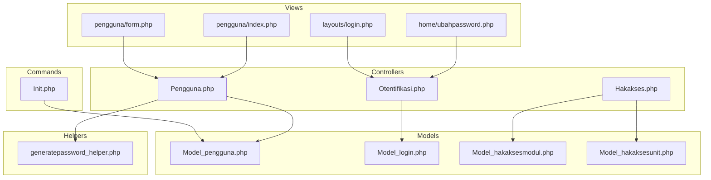
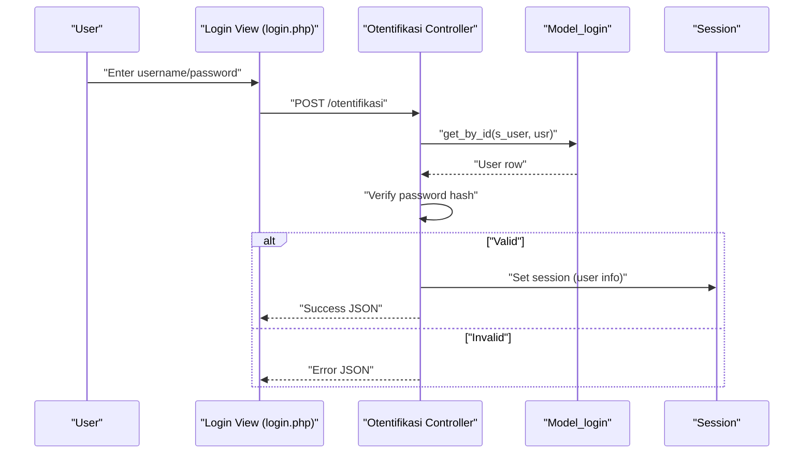
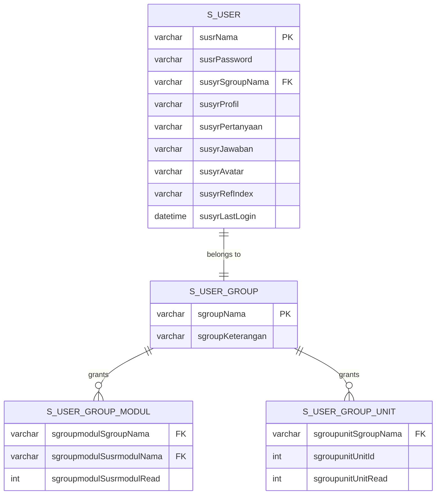
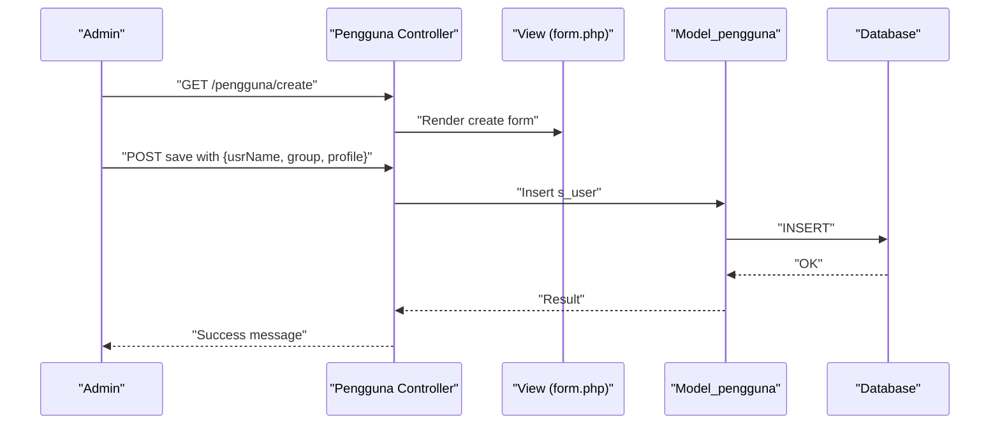
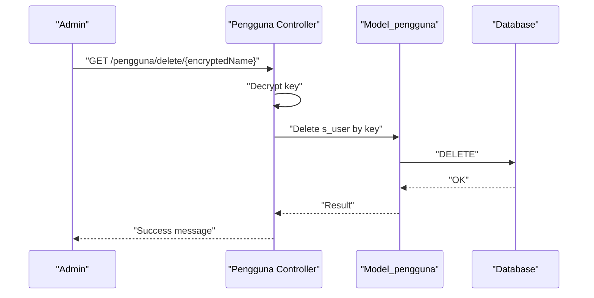
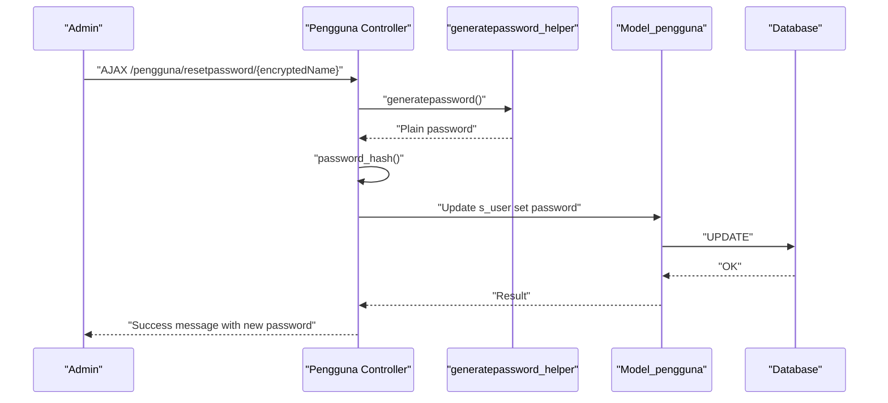
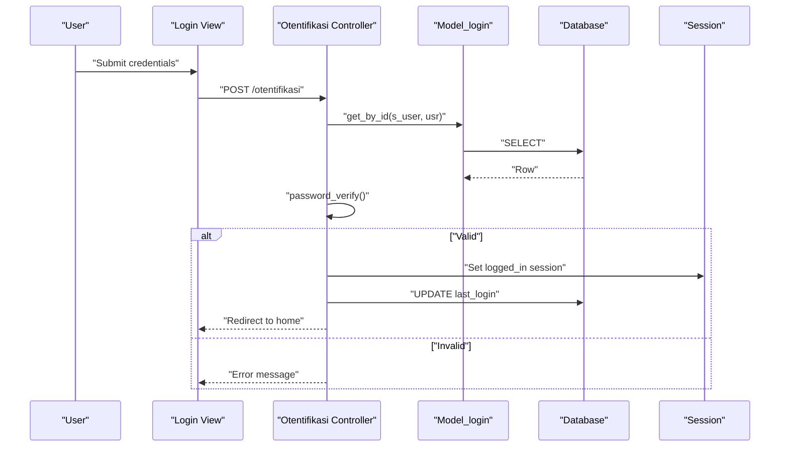
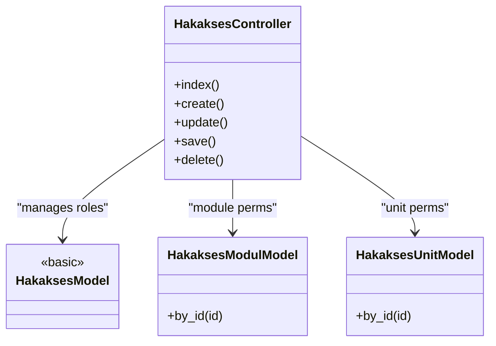
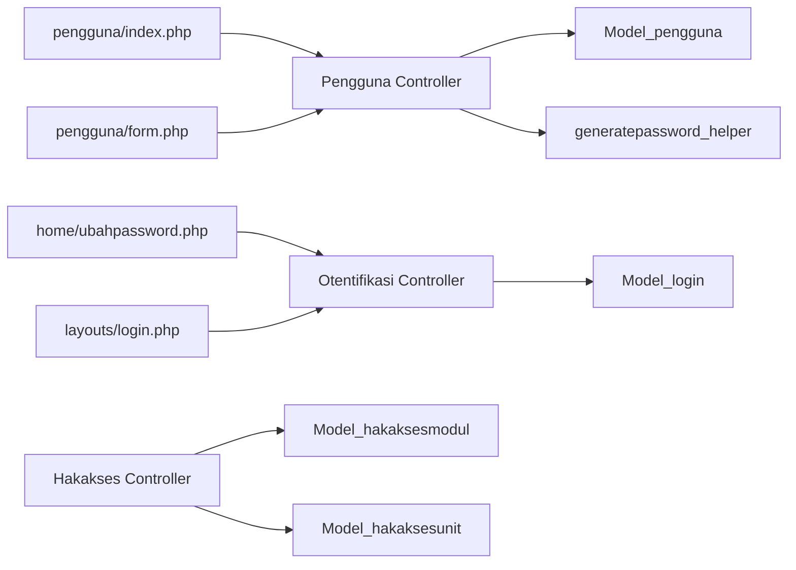

# User Management

<cite>
**Referenced Files in This Document**
- [Pengguna.php](file://src/application/controllers/Pengguna.php)
- [Model_pengguna.php](file://src/application/models/Model_pengguna.php)
- [form.php](file://src/application/views/pages/pengguna/form.php)
- [index.php](file://src/application/views/pages/pengguna/index.php)
- [generatepassword_helper.php](file://src/application/helpers/generatepassword_helper.php)
- [Init.php](file://src/commands/Init.php)
- [Otentifikasi.php](file://src/application/controllers/Otentifikasi.php)
- [Model_login.php](file://src/application/models/Model_login.php)
- [ubahpassword.php](file://src/application/views/pages/home/ubahpassword.php)
- [login.php](file://src/application/views/layouts/login.php)
- [Model_hakaksesmodul.php](file://src/application/models/Model_hakaksesmodul.php)
- [Model_hakaksesunit.php](file://src/application/models/Model_hakaksesunit.php)
- [Hakakses.php](file://src/application/controllers/Hakakses.php)
</cite>

## Table of Contents
1. [Introduction](#introduction)
2. [Project Structure](#project-structure)
3. [Core Components](#core-components)
4. [Architecture Overview](#architecture-overview)
5. [Detailed Component Analysis](#detailed-component-analysis)
6. [Dependency Analysis](#dependency-analysis)
7. [Performance Considerations](#performance-considerations)
8. [Troubleshooting Guide](#troubleshooting-guide)
9. [Conclusion](#conclusion)
10. [Appendices](#appendices)

## Introduction
This document explains Modangci’s user management system with a focus on authentication, user registration, profile management, and administrative workflows. It documents the user data model, CRUD operations, password management, and integration with roles and permissions via groups and module/unit access controls. Security considerations and best practices are included to guide safe and effective user account management.

## Project Structure
User management spans three layers:
- Controllers: user administration (create, update, delete, reset password)
- Models: data access and joins with groups and permissions
- Views: listing, forms, and login interface

**Diagram sources**
- [Pengguna.php:1-136](file://src/application/controllers/Pengguna.php#L1-L136)
- [Model_pengguna.php:1-36](file://src/application/models/Model_pengguna.php#L1-L36)
- [generatepassword_helper.php:1-26](file://src/application/helpers/generatepassword_helper.php#L1-L26)
- [Otentifikasi.php:1-64](file://src/application/controllers/Otentifikasi.php#L1-L64)
- [Model_login.php:1-9](file://src/application/models/Model_login.php#L1-L9)
- [Hakakses.php:1-109](file://src/application/controllers/Hakakses.php#L1-L109)
- [Model_hakaksesmodul.php:1-26](file://src/application/models/Model_hakaksesmodul.php#L1-L26)
- [Model_hakaksesunit.php:1-25](file://src/application/models/Model_hakaksesunit.php#L1-L25)
- [index.php:1-98](file://src/application/views/pages/pengguna/index.php#L1-L98)
- [form.php:1-65](file://src/application/views/pages/pengguna/form.php#L1-L65)
- [ubahpassword.php:1-62](file://src/application/views/pages/home/ubahpassword.php#L1-L62)
- [login.php:1-140](file://src/application/views/layouts/login.php#L1-L140)
- [Init.php:354-421](file://src/commands/Init.php#L354-L421)

**Section sources**
- [Pengguna.php:1-136](file://src/application/controllers/Pengguna.php#L1-L136)
- [Model_pengguna.php:1-36](file://src/application/models/Model_pengguna.php#L1-L36)
- [index.php:1-98](file://src/application/views/pages/pengguna/index.php#L1-L98)
- [form.php:1-65](file://src/application/views/pages/pengguna/form.php#L1-L65)
- [generatepassword_helper.php:1-26](file://src/application/helpers/generatepassword_helper.php#L1-L26)
- [Otentifikasi.php:1-64](file://src/application/controllers/Otentifikasi.php#L1-L64)
- [Model_login.php:1-9](file://src/application/models/Model_login.php#L1-L9)
- [ubahpassword.php:1-62](file://src/application/views/pages/home/ubahpassword.php#L1-L62)
- [login.php:1-140](file://src/application/views/layouts/login.php#L1-L140)
- [Init.php:354-421](file://src/commands/Init.php#L354-L421)

## Core Components
- User Administration Controller (Pengguna): handles listing, creating/updating users, deleting, and resetting passwords.
- User Model (Model_pengguna): queries users joined with group information.
- Authentication Controller (Otentifikasi): validates credentials, sets session, updates last login.
- Password Reset Helper (generatepassword_helper): generates temporary numeric passwords.
- Role and Permission Models (Model_hakaksesmodul, Model_hakaksesunit): resolve group-level module and unit access.
- Login View and Change Password View: front-end forms for authentication and password change.

**Section sources**
- [Pengguna.php:22-134](file://src/application/controllers/Pengguna.php#L22-L134)
- [Model_pengguna.php:11-34](file://src/application/models/Model_pengguna.php#L11-L34)
- [Otentifikasi.php:12-62](file://src/application/controllers/Otentifikasi.php#L12-L62)
- [generatepassword_helper.php:4-25](file://src/application/helpers/generatepassword_helper.php#L4-L25)
- [Model_hakaksesmodul.php:12-24](file://src/application/models/Model_hakaksesmodul.php#L12-L24)
- [Model_hakaksesunit.php:12-23](file://src/application/models/Model_hakaksesunit.php#L12-L23)
- [ubahpassword.php:21-54](file://src/application/views/pages/home/ubahpassword.php#L21-L54)
- [login.php:72-82](file://src/application/views/layouts/login.php#L72-L82)

## Architecture Overview
The user management flow integrates controllers, models, views, and helpers. Authentication uses hashed passwords and sessions. User administration supports AJAX saving and deletion, with encryption for sensitive keys in URLs.

**Diagram sources**
- [login.php:72-82](file://src/application/views/layouts/login.php#L72-L82)
- [Otentifikasi.php:12-62](file://src/application/controllers/Otentifikasi.php#L12-L62)
- [Model_login.php:1-9](file://src/application/models/Model_login.php#L1-L9)

## Detailed Component Analysis

### User Data Model
The user entity is stored in the s_user table with the following key fields:
- Identifier and credentials
  - usrName: unique username (primary key)
  - usrPassword: hashed password
- Group membership
  - usrSgroupNama: references s_user_group.sgroupNama (foreign key)
- Profile and metadata
  - usrProfil: profile/full name
  - usrPertanyaan: security question
  - usrJawaban: security answer
  - usrAvatar: avatar filename
  - usrRefIndex: reference index
  - usrLastLogin: last login timestamp

Group membership and permissions are enforced via:
- s_user_group: defines roles/groups
- s_user_group_modul: module-level permissions per group
- s_user_group_unit: unit-level permissions per group

**Diagram sources**
- [Init.php:356-412](file://src/commands/Init.php#L356-L412)
- [Model_hakaksesmodul.php:4-24](file://src/application/models/Model_hakaksesmodul.php#L4-L24)
- [Model_hakaksesunit.php:4-23](file://src/application/models/Model_hakaksesunit.php#L4-L23)

**Section sources**
- [Init.php:356-412](file://src/commands/Init.php#L356-L412)
- [Model_pengguna.php:4-34](file://src/application/models/Model_pengguna.php#L4-L34)
- [Model_hakaksesmodul.php:12-24](file://src/application/models/Model_hakaksesmodul.php#L12-L24)
- [Model_hakaksesunit.php:12-23](file://src/application/models/Model_hakaksesunit.php#L12-L23)

### User Registration and Profile Management
- Registration is performed via the user admin interface:
  - Create form renders fields for username, group, and profile name.
  - Save operation inserts a new user with hashed password and group assignment.
- Profile management:
  - Edit form allows updating username, group, and profile name.
  - Session-aware views show current user details for password change.

**Diagram sources**
- [Pengguna.php:34-101](file://src/application/controllers/Pengguna.php#L34-L101)
- [form.php:22-56](file://src/application/views/pages/pengguna/form.php#L22-L56)
- [Model_pengguna.php:11-21](file://src/application/models/Model_pengguna.php#L11-L21)

**Section sources**
- [Pengguna.php:34-101](file://src/application/controllers/Pengguna.php#L34-L101)
- [form.php:22-56](file://src/application/views/pages/pengguna/form.php#L22-L56)
- [Model_pengguna.php:11-21](file://src/application/models/Model_pengguna.php#L11-L21)

### User Status Management and Deactivation
- Deletion removes a user by username after decrypting the key from the URL.
- There is no explicit “deactivate” flag in the user model; deletion is the primary mechanism for removing access.

**Diagram sources**
- [Pengguna.php:103-114](file://src/application/controllers/Pengguna.php#L103-L114)
- [Model_pengguna.php:23-34](file://src/application/models/Model_pengguna.php#L23-L34)

**Section sources**
- [Pengguna.php:103-114](file://src/application/controllers/Pengguna.php#L103-L114)
- [Model_pengguna.php:23-34](file://src/application/models/Model_pengguna.php#L23-L34)

### Password Management
- Reset password:
  - Generates a numeric password via helper, hashes it, and updates the user record.
  - Returns a success message containing the generated password.
- Change password (authenticated user):
  - Dedicated form for current user to change password with old/new/confirm checks.

**Diagram sources**
- [Pengguna.php:116-134](file://src/application/controllers/Pengguna.php#L116-L134)
- [generatepassword_helper.php:6-24](file://src/application/helpers/generatepassword_helper.php#L6-L24)
- [Model_pengguna.php:23-34](file://src/application/models/Model_pengguna.php#L23-L34)

**Section sources**
- [Pengguna.php:116-134](file://src/application/controllers/Pengguna.php#L116-L134)
- [generatepassword_helper.php:4-25](file://src/application/helpers/generatepassword_helper.php#L4-L25)
- [ubahpassword.php:21-54](file://src/application/views/pages/home/ubahpassword.php#L21-L54)

### Authentication and Session Handling
- Login form posts credentials to the authentication controller.
- Controller retrieves user by username, verifies password hash, and sets session data including role and profile.
- On successful login, last login timestamp is updated.

**Diagram sources**
- [login.php:72-82](file://src/application/views/layouts/login.php#L72-L82)
- [Otentifikasi.php:12-62](file://src/application/controllers/Otentifikasi.php#L12-L62)
- [Model_login.php:1-9](file://src/application/models/Model_login.php#L1-L9)
- [Init.php:413-420](file://src/commands/Init.php#L413-L420)

**Section sources**
- [login.php:72-82](file://src/application/views/layouts/login.php#L72-L82)
- [Otentifikasi.php:12-62](file://src/application/controllers/Otentifikasi.php#L12-L62)
- [Model_login.php:1-9](file://src/application/models/Model_login.php#L1-L9)
- [Init.php:413-420](file://src/commands/Init.php#L413-L420)

### Group Assignments and Permission Inheritance
- Groups are managed via a dedicated controller/model for roles.
- Module-level permissions are resolved by joining s_user_modul_ref with s_user_group_modul.
- Unit-level permissions are resolved by joining s_unit with s_user_group_unit.
- Users inherit permissions based on their group membership.

**Diagram sources**
- [Hakakses.php:22-107](file://src/application/controllers/Hakakses.php#L22-L107)
- [Model_hakaksesmodul.php:12-24](file://src/application/models/Model_hakaksesmodul.php#L12-L24)
- [Model_hakaksesunit.php:12-23](file://src/application/models/Model_hakaksesunit.php#L12-L23)

**Section sources**
- [Hakakses.php:22-107](file://src/application/controllers/Hakakses.php#L22-L107)
- [Model_hakaksesmodul.php:12-24](file://src/application/models/Model_hakaksesmodul.php#L12-L24)
- [Model_hakaksesunit.php:12-23](file://src/application/models/Model_hakaksesunit.php#L12-L23)

## Dependency Analysis
- Controllers depend on models for data access and on helpers for password generation.
- Views depend on controllers for rendering forms and lists.
- Authentication depends on hashed passwords and session storage.
- Group and permission systems rely on foreign keys linking users to groups and groups to module/unit permissions.

**Diagram sources**
- [Pengguna.php:1-136](file://src/application/controllers/Pengguna.php#L1-L136)
- [Model_pengguna.php:1-36](file://src/application/models/Model_pengguna.php#L1-L36)
- [generatepassword_helper.php:1-26](file://src/application/helpers/generatepassword_helper.php#L1-L26)
- [Otentifikasi.php:1-64](file://src/application/controllers/Otentifikasi.php#L1-L64)
- [Model_login.php:1-9](file://src/application/models/Model_login.php#L1-L9)
- [Hakakses.php:1-109](file://src/application/controllers/Hakakses.php#L1-L109)
- [Model_hakaksesmodul.php:1-26](file://src/application/models/Model_hakaksesmodul.php#L1-L26)
- [Model_hakaksesunit.php:1-25](file://src/application/models/Model_hakaksesunit.php#L1-L25)
- [index.php:1-98](file://src/application/views/pages/pengguna/index.php#L1-L98)
- [form.php:1-65](file://src/application/views/pages/pengguna/form.php#L1-L65)
- [ubahpassword.php:1-62](file://src/application/views/pages/home/ubahpassword.php#L1-L62)
- [login.php:1-140](file://src/application/views/layouts/login.php#L1-L140)

**Section sources**
- [Pengguna.php:1-136](file://src/application/controllers/Pengguna.php#L1-L136)
- [Model_pengguna.php:1-36](file://src/application/models/Model_pengguna.php#L1-L36)
- [Otentifikasi.php:1-64](file://src/application/controllers/Otentifikasi.php#L1-L64)
- [Model_login.php:1-9](file://src/application/models/Model_login.php#L1-L9)
- [Hakakses.php:1-109](file://src/application/controllers/Hakakses.php#L1-L109)
- [Model_hakaksesmodul.php:1-26](file://src/application/models/Model_hakaksesmodul.php#L1-L26)
- [Model_hakaksesunit.php:1-25](file://src/application/models/Model_hakaksesunit.php#L1-L25)
- [index.php:1-98](file://src/application/views/pages/pengguna/index.php#L1-L98)
- [form.php:1-65](file://src/application/views/pages/pengguna/form.php#L1-L65)
- [ubahpassword.php:1-62](file://src/application/views/pages/home/ubahpassword.php#L1-L62)
- [login.php:1-140](file://src/application/views/layouts/login.php#L1-L140)

## Performance Considerations
- Use indexed columns for username and group name to optimize joins and lookups.
- Prefer server-side pagination for large user lists to reduce payload sizes.
- Cache frequently accessed group and permission data where appropriate.
- Minimize database round-trips by batching reads/writes in bulk operations.

## Troubleshooting Guide
- Validation errors during save:
  - Ensure required fields (username, group, profile) are present and unique for new users.
  - Check for XSS cleaning and uniqueness constraints applied by the controller.
- Password reset failures:
  - Verify the helper generates a valid password and hashing succeeds.
  - Confirm the target user exists and the update executes without constraint violations.
- Login failures:
  - Confirm the username exists and the password matches the stored hash.
  - Ensure sessions are configured and writable.
- Permission issues:
  - Verify group membership and associated module/unit permissions are correctly linked.

**Section sources**
- [Pengguna.php:60-101](file://src/application/controllers/Pengguna.php#L60-L101)
- [generatepassword_helper.php:6-24](file://src/application/helpers/generatepassword_helper.php#L6-L24)
- [Otentifikasi.php:12-62](file://src/application/controllers/Otentifikasi.php#L12-L62)
- [Hakakses.php:55-94](file://src/application/controllers/Hakakses.php#L55-L94)

## Conclusion
Modangci’s user management centers on a clean separation of concerns: controllers orchestrate user operations, models encapsulate data access, and views provide intuitive forms. Authentication relies on secure password hashing and session-based user state. Group and permission models enable flexible role-based access control across modules and units. Following the outlined best practices ensures robust, maintainable, and secure user administration.

## Appendices

### User CRUD Operations Summary
- Create: POST to save endpoint with username, group, and profile; inserts into s_user.
- Read: List users with group join; view individual user by ID.
- Update: Submit edited fields; updates s_user by username.
- Delete: Remove user by encrypted username key.

**Section sources**
- [Pengguna.php:22-114](file://src/application/controllers/Pengguna.php#L22-L114)
- [Model_pengguna.php:11-34](file://src/application/models/Model_pengguna.php#L11-L34)
- [index.php:36-91](file://src/application/views/pages/pengguna/index.php#L36-L91)
- [form.php:22-56](file://src/application/views/pages/pengguna/form.php#L22-L56)

### Password Management Examples
- Reset password: Admin triggers reset; system generates a numeric password, hashes it, and updates the user record.
- Change password: Authenticated user submits old/new/confirm; validation ensures consistency.

**Section sources**
- [Pengguna.php:116-134](file://src/application/controllers/Pengguna.php#L116-L134)
- [generatepassword_helper.php:6-24](file://src/application/helpers/generatepassword_helper.php#L6-L24)
- [ubahpassword.php:21-54](file://src/application/views/pages/home/ubahpassword.php#L21-L54)

### Security Considerations and Best Practices
- Always hash passwords using strong hashing (default algorithm).
- Enforce unique usernames and validate inputs rigorously.
- Use HTTPS to protect credentials in transit.
- Limit password reset scope to authorized administrators.
- Regularly review group memberships and inherited permissions.
- Store sessions securely and configure proper session storage paths.

[No sources needed since this section provides general guidance]