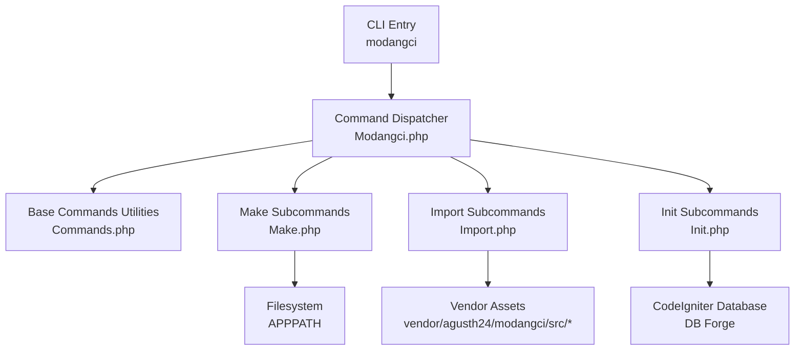
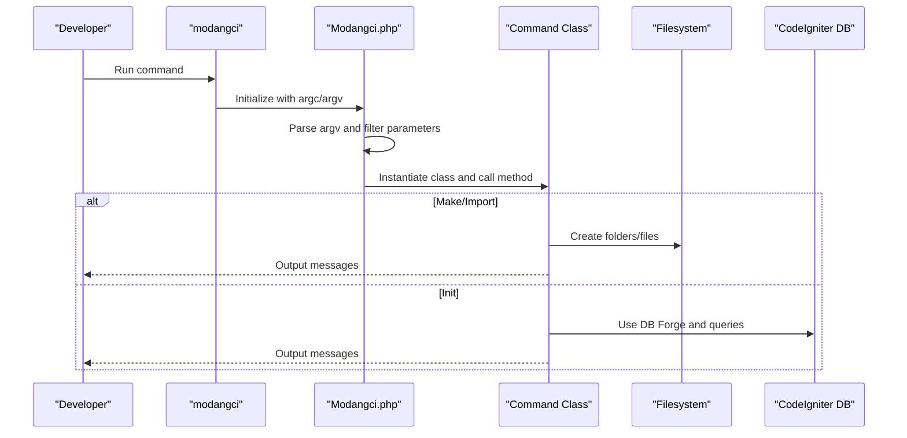
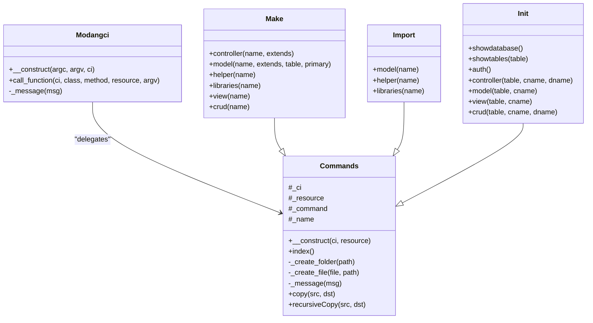
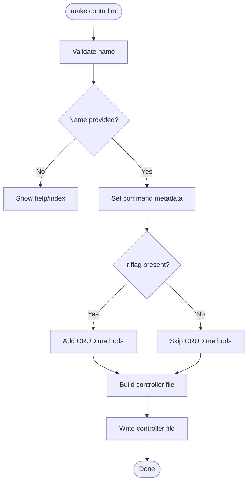
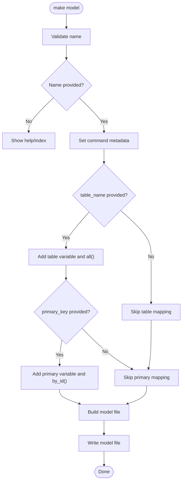
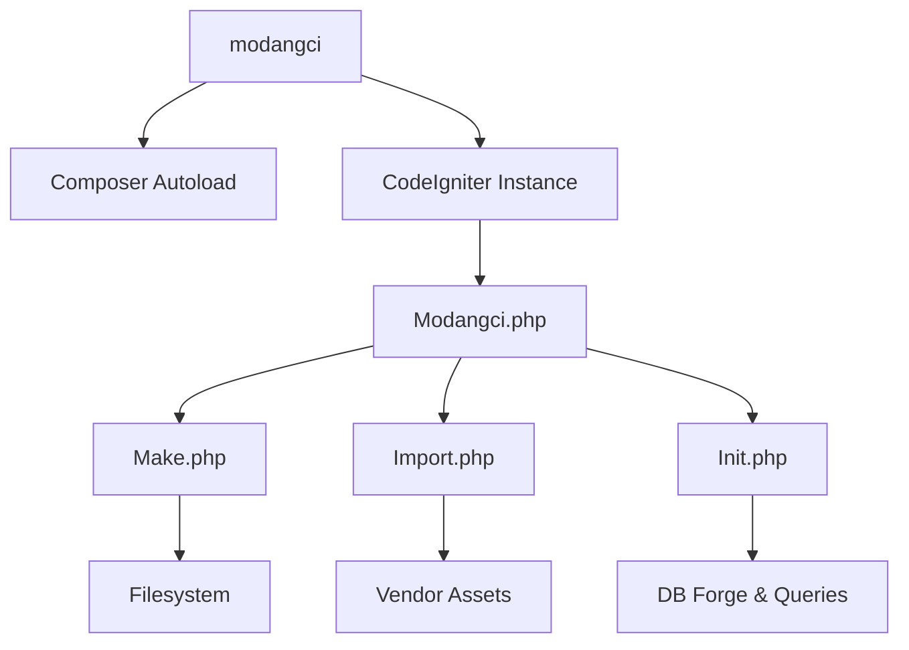

# CLI Command Reference

<cite>
**Referenced Files in This Document**
- [modangci](file://modangci)
- [install](file://install)
- [README.md](file://README.md)
- [composer.json](file://composer.json)
- [src/Modangci.php](file://src/Modangci.php)
- [src/Commands.php](file://src/Commands.php)
- [src/commands/Make.php](file://src/commands/Make.php)
- [src/commands/Import.php](file://src/commands/Import.php)
- [src/commands/Init.php](file://src/commands/Init.php)
</cite>

## Table of Contents
1. [Introduction](#introduction)
2. [Project Structure](#project-structure)
3. [Core Components](#core-components)
4. [Architecture Overview](#architecture-overview)
5. [Detailed Component Analysis](#detailed-component-analysis)
6. [Dependency Analysis](#dependency-analysis)
7. [Performance Considerations](#performance-considerations)
8. [Troubleshooting Guide](#troubleshooting-guide)
9. [Conclusion](#conclusion)
10. [Appendices](#appendices)

## Introduction
This document provides comprehensive CLI command documentation for Modangci, a CodeIgniter 3 command-line tool that generates CRUD scaffolding and boilerplate code. It covers all available commands under the make, import, and init subcommands, including syntax, parameters, usage examples, and integration with the CodeIgniter development workflow. It also documents command-specific options such as the -r flag for resource generation, table mapping for CRUD operations, and authentication setup parameters.

## Project Structure
Modangci is structured around a CLI entry point that loads a CodeIgniter application instance and dispatches commands to dedicated handler classes. The primary components are:
- CLI entry script that boots CodeIgniter and invokes the command dispatcher
- Command dispatcher that parses arguments and routes to the appropriate command class
- Base command class providing shared utilities for file/folder creation and copying
- Subcommand classes for make, import, and init operations

**Diagram sources**
- [modangci:1-26](file://modangci#L1-L26)
- [src/Modangci.php:10-41](file://src/Modangci.php#L10-L41)
- [src/Commands.php:14-97](file://src/Commands.php#L14-L97)
- [src/commands/Make.php:7-211](file://src/commands/Make.php#L7-L211)
- [src/commands/Import.php:7-53](file://src/commands/Import.php#L7-L53)
- [src/commands/Init.php:7-917](file://src/commands/Init.php#L7-L917)

**Section sources**
- [modangci:1-26](file://modangci#L1-L26)
- [src/Modangci.php:10-41](file://src/Modangci.php#L10-L41)
- [src/Commands.php:14-97](file://src/Commands.php#L14-L97)

## Core Components
- CLI entry point: Initializes CodeIgniter, loads autoloader, and instantiates the command dispatcher.
- Command dispatcher: Parses argv, validates allowed parameters, constructs the target class and method, and executes the command.
- Base commands utilities: Provides shared helpers for copying files, recursive copying, creating folders, writing files, and messaging.

Key behaviors:
- Parameter filtering: Only alphabetic identifiers and allowed flags are accepted; invalid parameters cause termination.
- Dynamic class/method resolution: The dispatcher resolves the command class and method from argv.
- Resource flags: Flags like -r are captured and passed to command handlers for conditional behavior.

**Section sources**
- [modangci:12-25](file://modangci#L12-L25)
- [src/Modangci.php:19-41](file://src/Modangci.php#L19-L41)
- [src/Commands.php:20-97](file://src/Commands.php#L20-L97)

## Architecture Overview
The CLI architecture follows a simple dispatch pattern:
- The CLI entry script sets the working directory and CodeIgniter root.
- It requires Composer autoload and loads the CodeIgniter instance.
- The Modangci dispatcher parses argv, filters allowed parameters, and resolves the target command class and method.
- The command class performs filesystem operations or database actions depending on the subcommand.

**Diagram sources**
- [modangci:18-25](file://modangci#L18-L25)
- [src/Modangci.php:43-53](file://src/Modangci.php#L43-L53)
- [src/commands/Make.php:7-211](file://src/commands/Make.php#L7-L211)
- [src/commands/Import.php:7-53](file://src/commands/Import.php#L7-L53)
- [src/commands/Init.php:13-917](file://src/commands/Init.php#L13-L917)

## Detailed Component Analysis

### make subcommands
Purpose: Generate CodeIgniter components (controller, model, helper, libraries, view) and CRUD scaffolding.

Available commands:
- make controller name [extends_name] [-r]
- make model name [extends_name] [table_name] [primary_key]
- make helper name
- make libraries name
- make view name
- make crud name

Parameters:
- name: Component name (required for most commands).
- extends_name: Optional base class to extend (defaults vary by component).
- table_name: Optional database table name for model/table mapping.
- primary_key: Optional primary key for model operations.
- -r: Optional flag enabling CRUD resource generation for controller.

Behavior highlights:
- Controller generation: Creates a controller with optional CRUD methods when -r is present. Optionally loads a model and renders a view when CRUD mode is enabled.
- Model generation: Creates a model with optional table mapping and primary key. Adds convenience methods when table is provided.
- Helper generation: Creates a helper file with a function stub.
- Libraries generation: Creates a library class with optional CodeIgniter instance access.
- View generation: Creates a basic HTML view or a data-aware view in CRUD mode.
- CRUD generation: Orchestrates controller, model, and view creation with CRUD resources.

Practical examples:
- Generate a basic controller: make controller Example
- Generate a controller with CRUD methods: make controller Example -r
- Generate a model mapped to a table: make model User users id
- Generate a helper: make helper my_helper
- Generate a library: make libraries PDF
- Generate a view: make view example
- Generate a full CRUD: make crud Product

Expected outputs:
- Creation messages for each generated file/folder.
- Overwrite prevention: Messages when files/folders already exist.

Integration tips:
- Use -r consistently for controllers intended to serve CRUD endpoints.
- Pair make model with table mapping to streamline database operations.

**Section sources**
- [src/commands/Make.php:16-211](file://src/commands/Make.php#L16-L211)
- [src/Commands.php:99-133](file://src/Commands.php#L99-L133)

### import subcommands
Purpose: Import reusable components from the vendor package into the application.

Available commands:
- import model master
- import helper datetoindo
- import helper daystoindo
- import helper monthtoindo
- import helper generatepassword
- import helper debuglog
- import helper terbilang
- import helper message
- import libraries pdfgenerator
- import libraries encryptions

Behavior highlights:
- Copies files from vendor assets to application directories.
- Handles Composer dependencies for libraries (e.g., pdfgenerator).
- Provides feedback on copied files or missing source files.

Practical examples:
- Import master model: import model master
- Import Indonesian date helper: import helper datetoindo
- Import PDF generator library: import libraries pdfgenerator

Expected outputs:
- “copied” messages for successful copies.
- “file not found” messages when vendor assets are missing.

Integration tips:
- After importing libraries, configure autoload and application settings as prompted by init auth.

**Section sources**
- [src/commands/Import.php:14-53](file://src/commands/Import.php#L14-L53)

### init subcommands
Purpose: Scaffold authentication and CRUD scaffolding based on database schema.

Available commands:
- init auth
- init controller table_name controller_class controller_display
- init model table_name model_class
- init view table_name folder_name
- init crud table_name class_name display_name

Parameters:
- table_name: Database table to scaffold against.
- controller_class: Controller class name.
- controller_display: Human-readable display name for the controller.
- model_class: Model class name.
- folder_name: View folder name.
- class_name: Shared class name for CRUD components.
- display_name: Display label for CRUD pages.

Behavior highlights:
- auth: Creates role-based tables, inserts default records, imports controllers, models, views, and libraries, and prints configuration steps.
- controller: Generates a full controller with CRUD actions, form validation, encryption, and AJAX handling based on table schema.
- model: Generates a model extending a master class with methods to fetch all rows and by ID, including joins for foreign keys.
- view: Generates index and form views with dynamic table headers, body cells, and form controls based on table schema.
- crud: Orchestrates controller, model, and view generation for a given table.

Practical examples:
- Scaffold authentication: init auth
- Scaffold controller for a table: init controller users User Users
- Scaffold model for a table: init model users user
- Scaffold views for a table: init view users user
- Scaffold full CRUD: init crud users User Users

Expected outputs:
- Step-by-step progress messages during scaffolding.
- Configuration reminders for autoload and base URL.

Integration tips:
- After running init auth, set autoload and config as instructed by the command output.
- Use init controller/model/view/crud to rapidly build CRUD pages aligned with existing database tables.

**Section sources**
- [src/commands/Init.php:125-478](file://src/commands/Init.php#L125-L478)
- [src/commands/Init.php:480-701](file://src/commands/Init.php#L480-L701)
- [src/commands/Init.php:703-917](file://src/commands/Init.php#L703-L917)

## Architecture Overview
The CLI command architecture is designed for extensibility and separation of concerns:
- CLI entry script initializes the environment and CodeIgniter instance.
- The dispatcher validates and parses arguments, then delegates to the appropriate command class.
- Command classes encapsulate filesystem operations and database interactions.

**Diagram sources**
- [src/Modangci.php:7-60](file://src/Modangci.php#L7-L60)
- [src/Commands.php:7-135](file://src/Commands.php#L7-L135)
- [src/commands/Make.php:7-211](file://src/commands/Make.php#L7-L211)
- [src/commands/Import.php:7-53](file://src/commands/Import.php#L7-L53)
- [src/commands/Init.php:7-917](file://src/commands/Init.php#L7-L917)

## Detailed Component Analysis

### make controller
Syntax
- make controller name [extends_name] [-r]

Parameters
- name: Controller name (required)
- extends_name: Optional base class (defaults vary)
- -r: Enable CRUD resource generation

Processing logic
- Validates name presence.
- Sets internal command metadata.
- Conditionally generates CRUD methods when -r is present.
- Optionally loads a model and renders a view in CRUD mode.

**Diagram sources**
- [src/commands/Make.php:16-73](file://src/commands/Make.php#L16-L73)

**Section sources**
- [src/commands/Make.php:16-73](file://src/commands/Make.php#L16-L73)

### make model
Syntax
- make model name [extends_name] [table_name] [primary_key]

Parameters
- name: Model name (required)
- extends_name: Optional base class
- table_name: Optional table name for mapping
- primary_key: Optional primary key for mapping

Processing logic
- Validates name presence.
- Sets internal command metadata.
- Adds table and primary key variables/functions when provided.
- Writes the model file.

**Diagram sources**
- [src/commands/Make.php:75-127](file://src/commands/Make.php#L75-L127)

**Section sources**
- [src/commands/Make.php:75-127](file://src/commands/Make.php#L75-L127)

### make helper
Syntax
- make helper name

Parameters
- name: Helper name (required)

Processing logic
- Validates name presence.
- Creates a helper file with a function stub.

**Section sources**
- [src/commands/Make.php:129-148](file://src/commands/Make.php#L129-L148)

### make libraries
Syntax
- make libraries name

Parameters
- name: Library name (required)

Processing logic
- Validates name presence.
- Creates a library class with optional CodeIgniter instance access.

**Section sources**
- [src/commands/Make.php:150-170](file://src/commands/Make.php#L150-L170)

### make view
Syntax
- make view name

Parameters
- name: View name (required)

Processing logic
- Validates name presence.
- Creates a basic HTML view or a data-aware view in CRUD mode.

**Section sources**
- [src/commands/Make.php:172-194](file://src/commands/Make.php#L172-L194)

### make crud
Syntax
- make crud name

Parameters
- name: CRUD name (required)

Processing logic
- Enables CRUD mode internally.
- Invokes controller, model, and view generation with CRUD resources.

**Section sources**
- [src/commands/Make.php:196-209](file://src/commands/Make.php#L196-L209)

### import model
Syntax
- import model master

Behavior
- Copies master model files from vendor to application/core.

**Section sources**
- [src/commands/Import.php:14-24](file://src/commands/Import.php#L14-L24)

### import helper
Syntax
- import helper name

Behavior
- Copies helper files from vendor to application/helpers.

**Section sources**
- [src/commands/Import.php:26-35](file://src/commands/Import.php#L26-L35)

### import libraries
Syntax
- import libraries name

Behavior
- Checks for Composer dependencies and installs if needed.
- Copies library files from vendor to application/libraries.

**Section sources**
- [src/commands/Import.php:37-51](file://src/commands/Import.php#L37-L51)

### init auth
Syntax
- init auth

Behavior
- Creates role-based tables and default records.
- Imports controllers, models, views, and libraries.
- Prints configuration reminders for autoload and base URL.

**Section sources**
- [src/commands/Init.php:125-478](file://src/commands/Init.php#L125-L478)

### init controller
Syntax
- init controller table_name controller_class controller_display

Behavior
- Reads table schema and constraints.
- Generates a controller with CRUD actions, form validation, encryption, and AJAX handling.
- Loads foreign reference data for form selects.

**Section sources**
- [src/commands/Init.php:480-640](file://src/commands/Init.php#L480-L640)

### init model
Syntax
- init model table_name model_class

Behavior
- Reads table schema and foreign keys.
- Generates a model extending a master class with all() and by_id() methods.
- Builds JOIN clauses for foreign keys.

**Section sources**
- [src/commands/Init.php:642-701](file://src/commands/Init.php#L642-L701)

### init view
Syntax
- init view table_name folder_name

Behavior
- Reads table schema.
- Generates index and form views with dynamic headers, body cells, and form controls.
- Handles foreign key references for select inputs.

**Section sources**
- [src/commands/Init.php:703-917](file://src/commands/Init.php#L703-L917)

## Dependency Analysis
- CLI entry depends on Composer autoload and CodeIgniter instance loading.
- Command dispatcher depends on argument parsing and class/method resolution.
- Command classes depend on CodeIgniter’s file helper for writing files and database for schema inspection.
- Import and Init commands depend on vendor assets availability.

**Diagram sources**
- [modangci:18-25](file://modangci#L18-L25)
- [src/Modangci.php:43-53](file://src/Modangci.php#L43-L53)
- [src/commands/Make.php:7-211](file://src/commands/Make.php#L7-L211)
- [src/commands/Import.php:7-53](file://src/commands/Import.php#L7-L53)
- [src/commands/Init.php:13-917](file://src/commands/Init.php#L13-L917)

**Section sources**
- [composer.json:20-24](file://composer.json#L20-L24)
- [src/Modangci.php:43-53](file://src/Modangci.php#L43-L53)

## Performance Considerations
- File operations: Writing files and copying directories can be I/O bound; ensure sufficient disk permissions and space.
- Database operations: Schema inspection queries are lightweight but still involve database connections; ensure database credentials are configured.
- Composer dependency installation: Installing packages may take time; run during initial setup.

## Troubleshooting Guide
Common issues and resolutions:
- Invalid parameter detected: The CLI rejects non-alphabetic identifiers except allowed flags. Remove or correct the offending argument.
  - Evidence: Parameter filtering logic checks allowed parameters and exits on invalid input.
  - Section sources
    - [src/Modangci.php:24-28](file://src/Modangci.php#L24-L28)

- Command not found: Ensure the subcommand and method names match available options. Use the help/index output for guidance.
  - Evidence: Dispatcher falls back to printing available commands when the method does not exist.
  - Section sources
    - [src/Modangci.php:49-52](file://src/Modangci.php#L49-L52)

- File already exists: The system prevents overwriting existing files/folders and prints a message. Remove or rename the existing item if intentional overwrite is desired.
  - Evidence: File creation checks existence and aborts if present.
  - Section sources
    - [src/Commands.php:78-82](file://src/Commands.php#L78-L82)

- Vendor asset not found: Import commands rely on vendor assets. Verify the vendor path and re-run installation.
  - Evidence: Copy operations check file existence and report missing files.
  - Section sources
    - [src/Commands.php:22-29](file://src/Commands.php#L22-L29)

- Database connection issues: Init commands require a working database connection. Ensure CodeIgniter database configuration is correct.
  - Evidence: Init constructor loads database and uses information_schema.
  - Section sources
    - [src/commands/Init.php:13-29](file://src/commands/Init.php#L13-L29)

- Missing Composer dependency: Some libraries require Composer packages. The import command attempts to install dependencies; ensure Composer is available.
  - Evidence: Import command checks for required packages and runs composer commands.
  - Section sources
    - [src/commands/Import.php:45-46](file://src/commands/Import.php#L45-L46)

## Conclusion
Modangci streamlines CodeIgniter development by providing robust CLI commands for generating controllers, models, helpers, libraries, views, and full CRUD scaffolding. The make subcommands offer quick boilerplate generation, import subcommands bring reusable components into your app, and init subcommands accelerate authentication and CRUD scaffolding from database schemas. By following the documented syntax, parameters, and integration steps, developers can significantly reduce boilerplate and focus on application logic.

## Appendices

### Installation and Setup
- Install a CodeIgniter project and require the package.
- Run the installer to place CLI and instance files.
- Use the CLI to generate components and scaffolding.

**Section sources**
- [README.md:7-14](file://README.md#L7-L14)
- [install:15-26](file://install#L15-L26)

### Command Index
- make controller, make model, make helper, make libraries, make view, make crud
- import model, import helper, import libraries
- init auth, init controller, init model, init view, init crud

**Section sources**
- [src/Commands.php:99-133](file://src/Commands.php#L99-L133)
- [README.md:15-41](file://README.md#L15-L41)