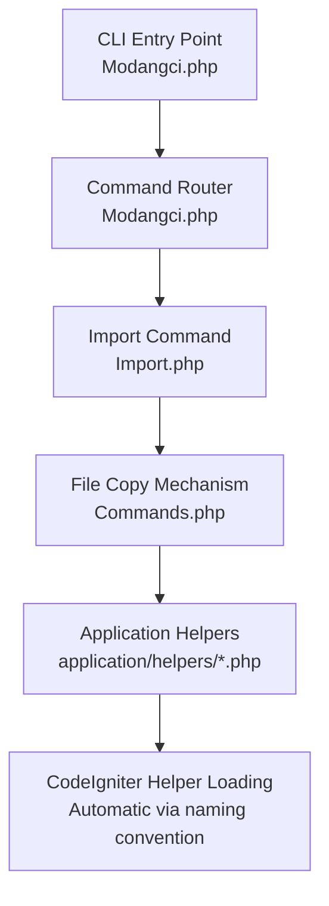
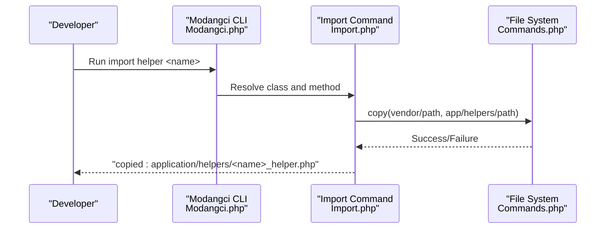
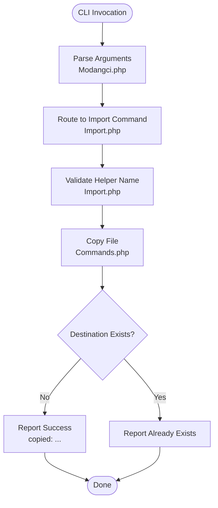
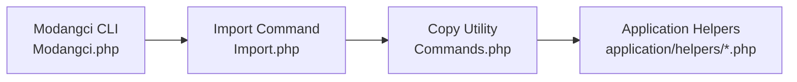

# Helper Import

<cite>
**Referenced Files in This Document**
- [datetoindo_helper.php](file://src/application/helpers/datetoindo_helper.php)
- [daystoindo_helper.php](file://src/application/helpers/daystoindo_helper.php)
- [monthtoindo_helper.php](file://src/application/helpers/monthtoindo_helper.php)
- [debuglog_helper.php](file://src/application/helpers/debuglog_helper.php)
- [generatepassword_helper.php](file://src/application/helpers/generatepassword_helper.php)
- [message_helper.php](file://src/application/helpers/message_helper.php)
- [terbilang_helper.php](file://src/application/helpers/terbilang_helper.php)
- [Import.php](file://src/commands/Import.php)
- [Commands.php](file://src/commands/Commands.php)
- [Modangci.php](file://src/Modangci.php)
- [README.md](file://README.md)
- [Home.php](file://src/application/controllers/Home.php)
- [MY_Controller.php](file://src/application/core/MY_Controller.php)
</cite>

## Table of Contents
1. [Introduction](#introduction)
2. [Project Structure](#project-structure)
3. [Core Components](#core-components)
4. [Architecture Overview](#architecture-overview)
5. [Detailed Component Analysis](#detailed-component-analysis)
6. [Dependency Analysis](#dependency-analysis)
7. [Performance Considerations](#performance-considerations)
8. [Troubleshooting Guide](#troubleshooting-guide)
9. [Conclusion](#conclusion)
10. [Appendices](#appendices)

## Introduction
This document explains the helper import functionality in Modangci, focusing on how to import and use built-in helpers that enhance CodeIgniter applications with Indonesian date formatting, logging, password generation, message rendering, and number-to-word conversion. It covers the import process, file copying mechanism, and integration with CodeIgniter’s helper loading system. Practical examples demonstrate importing individual helpers and using them in controllers and models, along with best practices for helper development and maintenance.

## Project Structure
Modangci organizes helper imports under the CLI command system. Helpers are copied from the package’s vendor directory into the application’s helpers directory. The CLI entry point validates CLI requests and routes commands to the appropriate handler.

**Diagram sources**
- [Modangci.php:10-41](file://src/Modangci.php#L10-L41)
- [Import.php:26-35](file://src/commands/Import.php#L26-L35)
- [Commands.php:20-29](file://src/commands/Commands.php#L20-L29)

**Section sources**
- [Modangci.php:10-41](file://src/Modangci.php#L10-L41)
- [Commands.php:99-133](file://src/commands/Commands.php#L99-L133)
- [README.md:23-33](file://README.md#L23-L33)

## Core Components
This section lists all available helpers and their purposes. Each helper follows CodeIgniter’s helper naming convention and function existence checks.

- Date formatting helpers
  - datetoindo: Converts a date string to an Indonesian format (e.g., "DD Month YYYY").
  - daystoindo: Maps numeric day-of-week to Indonesian names.
  - monthtoindo: Maps numeric month to Indonesian names.
- Utility helpers
  - debuglog: Writes structured logs for requests/responses to a file stream.
  - generatepassword: Generates a random numeric password of configurable length.
  - message: Returns a JSON-formatted alert message and exits the request lifecycle.
  - terbilang: Converts numbers to Indonesian words, including decimal parts.

These helpers are designed to be loaded automatically by CodeIgniter when placed under application/helpers with the correct naming pattern.

**Section sources**
- [datetoindo_helper.php:4-22](file://src/application/helpers/datetoindo_helper.php#L4-L22)
- [daystoindo_helper.php:4-22](file://src/application/helpers/daystoindo_helper.php#L4-L22)
- [monthtoindo_helper.php:4-27](file://src/application/helpers/monthtoindo_helper.php#L4-L27)
- [debuglog_helper.php:4-31](file://src/application/helpers/debuglog_helper.php#L4-L31)
- [generatepassword_helper.php:4-25](file://src/application/helpers/generatepassword_helper.php#L4-L25)
- [message_helper.php:4-20](file://src/application/helpers/message_helper.php#L4-L20)
- [terbilang_helper.php:13-107](file://src/application/helpers/terbilang_helper.php#L13-L107)

## Architecture Overview
The helper import architecture consists of three layers:
- CLI Layer: Validates CLI invocation and parses arguments.
- Command Layer: Routes to the Import command.
- File System Layer: Copies helper files from vendor to application/helpers using a standardized copy method.

**Diagram sources**
- [Modangci.php:36-40](file://src/Modangci.php#L36-L40)
- [Import.php:26-35](file://src/commands/Import.php#L26-L35)
- [Commands.php:20-29](file://src/commands/Commands.php#L20-L29)

## Detailed Component Analysis

### Helper Import Process
The import process is initiated via CLI commands. The Import command accepts a helper name and copies the corresponding helper file from the vendor directory to application/helpers. The copy operation uses a shared static method that checks for source existence and reports outcomes.

**Diagram sources**
- [Modangci.php:36-40](file://src/Modangci.php#L36-L40)
- [Import.php:26-35](file://src/commands/Import.php#L26-L35)
- [Commands.php:20-29](file://src/commands/Commands.php#L20-L29)

**Section sources**
- [Modangci.php:10-41](file://src/Modangci.php#L10-L41)
- [Import.php:26-35](file://src/commands/Import.php#L26-L35)
- [Commands.php:20-29](file://src/commands/Commands.php#L20-L29)

### Helper Naming Conventions and Function Signatures
All helpers follow CodeIgniter’s helper naming convention and include a guard against redeclaration. The function names and typical usage patterns are:

- datetoindo
  - Purpose: Convert date to Indonesian format.
  - Signature: datetoindo(dateString)
  - Behavior: Returns formatted date or false for invalid input.
  - Example usage: [datetoindo_helper.php:6](file://src/application/helpers/datetoindo_helper.php#L6)

- daystoindo
  - Purpose: Map numeric day-of-week to Indonesian name.
  - Signature: daystoindo(dayNumber)
  - Behavior: Returns Indonesian weekday name or false for empty input.
  - Example usage: [daystoindo_helper.php:6](file://src/application/helpers/daystoindo_helper.php#L6)

- monthtoindo
  - Purpose: Map numeric month to Indonesian name.
  - Signature: monthtoindo(monthNumberOrCode)
  - Behavior: Returns Indonesian month name or false for empty input.
  - Example usage: [monthtoindo_helper.php:6](file://src/application/helpers/monthtoindo_helper.php#L6)

- debuglog
  - Purpose: Log request/response metadata to a stream.
  - Signature: debuglog(object, optionalData)
  - Behavior: Captures timestamp, user, IP, and payload; writes to a file stream if configured.
  - Example usage: [debuglog_helper.php:6](file://src/application/helpers/debuglog_helper.php#L6)

- generatepassword
  - Purpose: Generate a random numeric password.
  - Signature: generatepassword(length)
  - Behavior: Returns a numeric password up to a maximum length.
  - Example usage: [generatepassword_helper.php:6](file://src/application/helpers/generatepassword_helper.php#L6)

- message
  - Purpose: Emit a JSON-formatted alert and terminate the request.
  - Signature: message(text, type)
  - Behavior: Sets JSON content type, builds an alert HTML snippet, echoes JSON, and exits.
  - Example usage: [message_helper.php:6](file://src/application/helpers/message_helper.php#L6)

- terbilang
  - Purpose: Convert numbers to Indonesian words.
  - Signature: terbilang(number, delimiter)
  - Behavior: Handles integer and fractional parts; returns a capitalized phrase.
  - Example usage: [terbilang_helper.php:15](file://src/application/helpers/terbilang_helper.php#L15)

**Section sources**
- [datetoindo_helper.php:4-22](file://src/application/helpers/datetoindo_helper.php#L4-L22)
- [daystoindo_helper.php:4-22](file://src/application/helpers/daystoindo_helper.php#L4-L22)
- [monthtoindo_helper.php:4-27](file://src/application/helpers/monthtoindo_helper.php#L4-L27)
- [debuglog_helper.php:4-31](file://src/application/helpers/debuglog_helper.php#L4-L31)
- [generatepassword_helper.php:4-25](file://src/application/helpers/generatepassword_helper.php#L4-L25)
- [message_helper.php:4-20](file://src/application/helpers/message_helper.php#L4-L20)
- [terbilang_helper.php:13-107](file://src/application/helpers/terbilang_helper.php#L13-L107)

### Using Helpers in Controllers and Models
After importing, helpers are automatically loadable by CodeIgniter because they follow the helper naming convention. In practice, developers can call helper functions directly after ensuring the helper file exists in application/helpers.

Examples in the codebase:
- message helper is used in a controller action to return JSON alerts and exit immediately.
  - Reference: [Home.php:85](file://src/application/controllers/Home.php#L85), [Home.php:91](file://src/application/controllers/Home.php#L91), [Home.php:114](file://src/application/controllers/Home.php#L114)

Note: The MY_Controller base class demonstrates session-based access control and page composition but does not explicitly load helpers. Helpers are typically loaded per controller or globally via CodeIgniter’s loader.

**Section sources**
- [Home.php:85](file://src/application/controllers/Home.php#L85)
- [Home.php:91](file://src/application/controllers/Home.php#L91)
- [Home.php:114](file://src/application/controllers/Home.php#L114)
- [MY_Controller.php:13-18](file://src/application/core/MY_Controller.php#L13-L18)

### Integration with CodeIgniter’s Helper Loading System
CodeIgniter automatically discovers helpers placed under application/helpers with the naming pattern <name>_helper.php. Once imported, the functions become available in controllers, models, and views without explicit loading statements.

Best practices:
- Keep helper filenames lowercase and suffix with _helper.php.
- Wrap helper functions in function_exists guards to prevent redeclaration errors.
- Avoid heavy computation inside helpers; delegate to models or libraries when necessary.
- Centralize configuration (e.g., log file paths) in constants or configuration files.

**Section sources**
- [datetoindo_helper.php:4](file://src/application/helpers/datetoindo_helper.php#L4)
- [daystoindo_helper.php:4](file://src/application/helpers/daystoindo_helper.php#L4)
- [monthtoindo_helper.php:4](file://src/application/helpers/monthtoindo_helper.php#L4)
- [debuglog_helper.php:4](file://src/application/helpers/debuglog_helper.php#L4)
- [generatepassword_helper.php:4](file://src/application/helpers/generatepassword_helper.php#L4)
- [message_helper.php:4](file://src/application/helpers/message_helper.php#L4)
- [terbilang_helper.php:13](file://src/application/helpers/terbilang_helper.php#L13)

## Dependency Analysis
The import pipeline depends on the CLI entry point, the Import command, and the shared copy utility. There are no circular dependencies among helpers themselves.

**Diagram sources**
- [Modangci.php:36-40](file://src/Modangci.php#L36-L40)
- [Import.php:26-35](file://src/commands/Import.php#L26-L35)
- [Commands.php:20-29](file://src/commands/Commands.php#L20-L29)

**Section sources**
- [Modangci.php:10-41](file://src/Modangci.php#L10-L41)
- [Import.php:26-35](file://src/commands/Import.php#L26-L35)
- [Commands.php:20-29](file://src/commands/Commands.php#L20-L29)

## Performance Considerations
- Logging: The debuglog helper captures and writes to a stream. For high-throughput environments, consider rotating log files or switching to a database-backed logger.
- Password generation: The generatepassword helper uses a simple numeric generator. For stronger security, prefer cryptographically secure generators and include mixed character sets.
- Message rendering: The message helper terminates the request immediately after output. Ensure no further processing occurs after calling it.
- Number-to-words: The terbilang helper performs string manipulation and recursion. For very large numbers, consider caching or limiting precision.

[No sources needed since this section provides general guidance]

## Troubleshooting Guide
Common issues and resolutions:
- CLI not invoked: The CLI entry point checks for CLI requests and exits otherwise. Ensure the command is executed from the terminal.
  - Reference: [Modangci.php:13-17](file://src/Modangci.php#L13-L17)
- Invalid parameter: Non-alphabetic parameters are rejected. Use only alphabetic characters and allowed flags.
  - Reference: [Modangci.php:24-28](file://src/Modangci.php#L24-L28)
- Helper not found: Verify the helper file exists in application/helpers with the correct naming pattern.
  - Reference: [Import.php:32](file://src/commands/Import.php#L32)
- Function already declared: Ensure the helper wraps functions in function_exists guards.
  - Reference: [datetoindo_helper.php:4](file://src/application/helpers/datetoindo_helper.php#L4)

**Section sources**
- [Modangci.php:13-17](file://src/Modangci.php#L13-L17)
- [Modangci.php:24-28](file://src/Modangci.php#L24-L28)
- [Import.php:32](file://src/commands/Import.php#L32)
- [datetoindo_helper.php:4](file://src/application/helpers/datetoindo_helper.php#L4)

## Conclusion
Modangci simplifies helper import by copying prebuilt helpers from the package to application/helpers. Once imported, helpers integrate seamlessly with CodeIgniter’s automatic loading. The documented helpers provide practical capabilities for Indonesian date formatting, logging, password generation, message rendering, and number-to-word conversion. Follow the naming conventions and best practices to maintain clean, efficient, and reusable helper code.

[No sources needed since this section summarizes without analyzing specific files]

## Appendices

### How to Import Individual Helpers
- Use the import helper command with the desired helper name.
- The system copies the helper file from vendor to application/helpers.
- After import, the helper functions are available automatically.

References:
- [README.md:23-33](file://README.md#L23-L33)
- [Commands.php:111-119](file://src/commands/Commands.php#L111-L119)
- [Import.php:26-35](file://src/commands/Import.php#L26-L35)

**Section sources**
- [README.md:23-33](file://README.md#L23-L33)
- [Commands.php:111-119](file://src/commands/Commands.php#L111-L119)
- [Import.php:26-35](file://src/commands/Import.php#L26-L35)