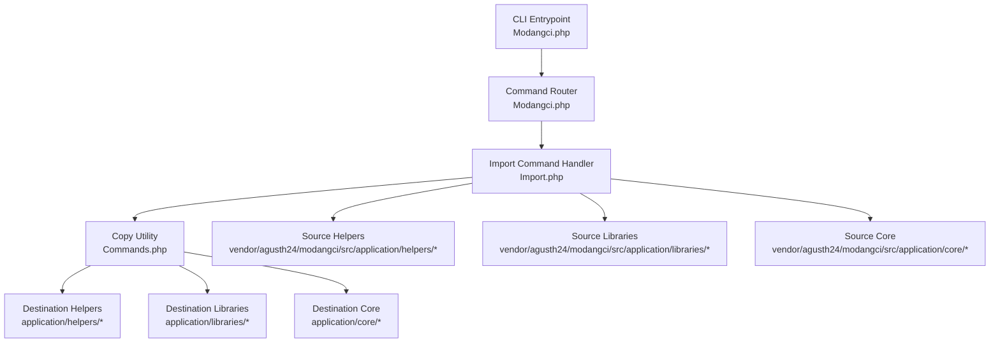
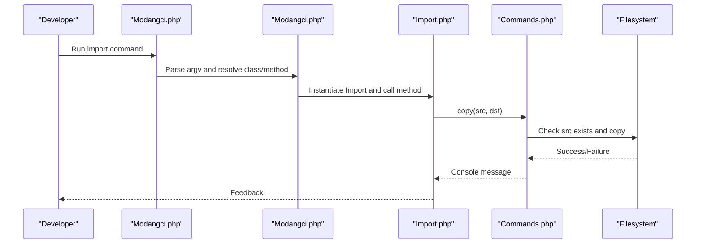
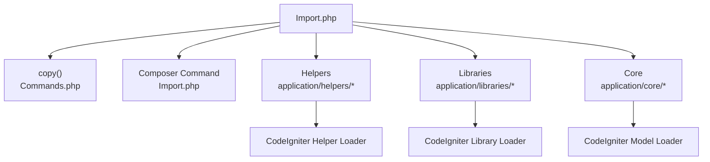

# Import Commands

<cite>
**Referenced Files in This Document**
- [Import.php](file://src/commands/Import.php)
- [Commands.php](file://src/Commands.php)
- [Modangci.php](file://src/Modangci.php)
- [install](file://install)
- [README.md](file://README.md)
- [MY_Model.php](file://src/application/core/MY_Model.php)
- [Model_Master.php](file://src/application/core/Model_Master.php)
- [datetoindo_helper.php](file://src/application/helpers/datetoindo_helper.php)
- [daystoindo_helper.php](file://src/application/helpers/daystoindo_helper.php)
- [monthtoindo_helper.php](file://src/application/helpers/monthtoindo_helper.php)
- [generatepassword_helper.php](file://src/application/helpers/generatepassword_helper.php)
- [message_helper.php](file://src/application/helpers/message_helper.php)
- [debuglog_helper.php](file://src/application/helpers/debuglog_helper.php)
- [terbilang_helper.php](file://src/application/helpers/terbilang_helper.php)
- [Pdfgenerator.php](file://src/application/libraries/Pdfgenerator.php)
- [Encryptions.php](file://src/application/libraries/Encryptions.php)
</cite>

## Table of Contents
1. [Introduction](#introduction)
2. [Project Structure](#project-structure)
3. [Core Components](#core-components)
4. [Architecture Overview](#architecture-overview)
5. [Detailed Component Analysis](#detailed-component-analysis)
6. [Dependency Analysis](#dependency-analysis)
7. [Performance Considerations](#performance-considerations)
8. [Troubleshooting Guide](#troubleshooting-guide)
9. [Conclusion](#conclusion)

## Introduction
This document explains Modangci’s import command family for CodeIgniter 3. It covers how to import:
- Model master templates
- Helper utilities (date formatting, Indonesian month/day names, password generation, message handling, debug logging, and number-to-text)
- Library components (PDF generator and encryption utilities)

For each import command, we describe the source location, target destination, file copying process, and integration steps. We also provide examples for importing pre-built components, customizing imported files, resolving conflicts with existing files, validating imports, backing up files, and rolling back changes. Finally, we address common scenarios such as upgrading existing components, adding new functionality, and maintaining code consistency across team environments.

## Project Structure
Modangci organizes import-related assets under the vendor subtree and copies them into the application directories during import. The CLI entrypoint routes commands to the appropriate handler.

**Diagram sources**
- [Modangci.php:36-40](file://src/Modangci.php#L36-L40)
- [Import.php:20-21](file://src/commands/Import.php#L20-L21)
- [Import.php:32](file://src/commands/Import.php#L32)
- [Import.php:48](file://src/commands/Import.php#L48)
- [Commands.php:20-29](file://src/Commands.php#L20-L29)

**Section sources**
- [Modangci.php:10-41](file://src/Modangci.php#L10-L41)
- [README.md:23-33](file://README.md#L23-L33)

## Core Components
- Import command handler: Orchestrates model, helper, and library imports.
- Copy utility: Performs file copy operations with existence checks and messaging.
- Source assets: Prebuilt helpers, libraries, and core templates under vendor.
- Destination paths: application/helpers, application/libraries, application/core.

Key behaviors:
- Validation: Checks if source files exist before copying.
- Messaging: Provides console feedback for copied files and missing sources.
- Composer integration: Installs library dependencies when required.

**Section sources**
- [Import.php:14-51](file://src/commands/Import.php#L14-L51)
- [Commands.php:20-29](file://src/Commands.php#L20-L29)
- [Commands.php:99-124](file://src/Commands.php#L99-L124)

## Architecture Overview
The import workflow follows a simple pipeline: CLI parses arguments → router resolves command → handler executes copy → destination files updated.

**Diagram sources**
- [Modangci.php:36-40](file://src/Modangci.php#L36-L40)
- [Import.php:20-21](file://src/commands/Import.php#L20-L21)
- [Commands.php:20-29](file://src/Commands.php#L20-L29)

## Detailed Component Analysis

### Import Model Master
Imports the base model infrastructure required by generated models.

- Command: import model master
- Source: vendor/agusth24/modangci/src/application/core/MY_Model.php and vendor/agusth24/modangci/src/application/core/Model_{Name}.php
- Target: application/core/MY_Model.php and application/core/Model_{Name}.php
- Integration:
  - MY_Model extends CI_Model and conditionally loads Model_Master if present.
  - Model_Master extends MY_Model and provides reusable database operations and menu-related helpers.
- Example usage:
  - Import base model: import model master
  - After import, create your model by extending Model_Master in application/models/Model_{Name}.php

Validation and conflict handling:
- The import copies files without checking for existing targets. To avoid overwriting customizations, back up application/core before importing.

Backup and rollback:
- Back up: cp -r application/core application/core.backup
- Rollback: rm -rf application/core && mv application/core.backup application/core

**Section sources**
- [Import.php:14-24](file://src/commands/Import.php#L14-L24)
- [MY_Model.php:12-16](file://src/application/core/MY_Model.php#L12-L16)
- [Model_Master.php:1-8](file://src/application/core/Model_Master.php#L1-L8)

### Import Helper: Date Formatting (Indonesian)
Formats dates into Indonesian textual representation.

- Command: import helper datetoindo
- Source: vendor/agusth24/modangci/src/application/helpers/datetoindo_helper.php
- Target: application/helpers/datetoindo_helper.php
- Integration: Loads automatically via CodeIgniter’s helper loading mechanism.
- Example usage:
  - Load helper: $this->load->helper('datetoindo');
  - Use function: datetoindo('YYYY-MM-DD')

Customization:
- Modify month names array and formatting logic inside the helper file.

Conflict resolution:
- If a file with the same name exists, rename or back up the existing file before importing.

**Section sources**
- [Import.php:26-35](file://src/commands/Import.php#L26-L35)
- [datetoindo_helper.php:4-22](file://src/application/helpers/datetoindo_helper.php#L4-L22)

### Import Helper: Days and Months (Indonesian)
Provides localized day-of-week and month-name helpers.

- Command: import helper daystoindo and import helper monthtoindo
- Source: vendor/agusth24/modangci/src/application/helpers/daystoindo_helper.php and monthtoindo_helper.php
- Target: application/helpers/daystoindo_helper.php and application/helpers/monthtoindo_helper.php
- Integration: Load via $this->load->helper('daystoindo') and $this->load->helper('monthtoindo').
- Example usage:
  - daystoindo(): returns Indonesian weekday name
  - monthtoindo(): returns Indonesian month name

Customization:
- Adjust arrays for days/months and formatting rules.

Conflict resolution:
- Backup existing files and merge changes if needed.

**Section sources**
- [Import.php:26-35](file://src/commands/Import.php#L26-L35)
- [daystoindo_helper.php](file://src/application/helpers/daystoindo_helper.php)
- [monthtoindo_helper.php](file://src/application/helpers/monthtoindo_helper.php)

### Import Helper: Password Generation
Generates secure numeric passwords.

- Command: import helper generatepassword
- Source: vendor/agusth24/modangci/src/application/helpers/generatepassword_helper.php
- Target: application/helpers/generatepassword_helper.php
- Integration: Load via $this->load->helper('generatepassword').
- Example usage:
  - generatepassword(length): returns a numeric password of specified length

Customization:
- Change character set and length limits inside the helper.

Conflict resolution:
- Rename or back up existing helper before importing.

**Section sources**
- [Import.php:26-35](file://src/commands/Import.php#L26-L35)
- [generatepassword_helper.php:4-25](file://src/application/helpers/generatepassword_helper.php#L4-L25)

### Import Helper: Message Handling
Standardizes JSON response messages with Bootstrap-style alerts.

- Command: import helper message
- Source: vendor/agusth24/modangci/src/application/helpers/message_helper.php
- Target: application/helpers/message_helper.php
- Integration: Load via $this->load->helper('message').
- Example usage:
  - message("Your message", "success"): returns JSON with HTML alert

Customization:
- Modify alert types and HTML markup.

Conflict resolution:
- Back up and merge if overriding existing helper.

**Section sources**
- [Import.php:26-35](file://src/commands/Import.php#L26-L35)
- [message_helper.php:4-21](file://src/application/helpers/message_helper.php#L4-L21)

### Import Helper: Debug Logging
Logs SQL queries and optional payloads for CRUD operations.

- Command: import helper debuglog
- Source: vendor/agusth24/modangci/src/application/helpers/debuglog_helper.php
- Target: application/helpers/debuglog_helper.php
- Integration: Called internally by Model_Master methods when present.
- Example usage:
  - debuglog($sql_or_payload): writes logs for debugging

Customization:
- Adjust log storage or format.

Conflict resolution:
- Back up existing debuglog helper if present.

**Section sources**
- [Import.php:26-35](file://src/commands/Import.php#L26-L35)
- [Model_Master.php:61](file://src/application/core/Model_Master.php#L61)

### Import Helper: Number-to-Text (Terbilang)
Converts numbers to Indonesian text.

- Command: import helper terbilang
- Source: vendor/agusth24/modangci/src/application/helpers/terbilang_helper.php
- Target: application/helpers/terbilang_helper.php
- Integration: Load via $this->load->helper('terbilang').
- Example usage:
  - terbilang($number): returns Indonesian text representation

Customization:
- Extend logic for larger numbers or formatting preferences.

Conflict resolution:
- Backup and merge if overriding existing helper.

**Section sources**
- [Import.php:26-35](file://src/commands/Import.php#L26-L35)
- [terbilang_helper.php](file://src/application/helpers/terbilang_helper.php)

### Import Libraries: PDF Generator
Generates PDFs from HTML using Dompdf.

- Command: import libraries pdfgenerator
- Source: vendor/agusth24/modangci/src/application/libraries/Pdfgenerator.php
- Target: application/libraries/Pdfgenerator.php
- Composer dependency: dompdf/dompdf (automatically required by import)
- Integration: Load via $this->load->library('Pdfgenerator').
- Example usage:
  - $this->pdfgenerator->generate($html, $filename, $orientation, $size);

Customization:
- Adjust Dompdf options, paper sizes, and rendering behavior.

Conflict resolution:
- Back up existing Pdfgenerator if present.

**Section sources**
- [Import.php:37-51](file://src/commands/Import.php#L37-L51)
- [Pdfgenerator.php:3-16](file://src/application/libraries/Pdfgenerator.php#L3-L16)

### Import Libraries: Encryptions
Provides AES-256-CBC encryption with Base64-safe encoding.

- Command: import libraries encryptions
- Source: vendor/agusth24/modangci/src/application/libraries/Encryptions.php
- Target: application/libraries/Encryptions.php
- Integration: Load via $this->load->library('Encryptions').
- Example usage:
  - $this->encryptions->encode($plaintext)
  - $this->encryptions->decode($ciphertext)

Customization:
- Change default key or cipher mode.

Conflict resolution:
- Back up existing Encryptions if present.

**Section sources**
- [Import.php:37-51](file://src/commands/Import.php#L37-L51)
- [Encryptions.php:1-56](file://src/application/libraries/Encryptions.php#L1-L56)

## Dependency Analysis
The import system relies on a small set of dependencies and integrates with CodeIgniter’s helper/library loading mechanisms.

**Diagram sources**
- [Import.php:20-21](file://src/commands/Import.php#L20-L21)
- [Import.php:32](file://src/commands/Import.php#L32)
- [Import.php:48](file://src/commands/Import.php#L48)
- [Import.php:46](file://src/commands/Import.php#L46)
- [MY_Model.php:12-16](file://src/application/core/MY_Model.php#L12-L16)

**Section sources**
- [Import.php:39-46](file://src/commands/Import.php#L39-L46)
- [Commands.php:20-29](file://src/Commands.php#L20-L29)

## Performance Considerations
- File copy operations are linear with respect to the number of files copied.
- Using Composer for PDF generator adds a network dependency; cache Composer downloads when possible.
- Avoid frequent imports in CI/CD pipelines; prefer idempotent setups and backups.

## Troubleshooting Guide
Common issues and resolutions:
- Source file not found:
  - Symptom: “file not found” message during import.
  - Resolution: Verify vendor installation and correct command spelling.
- Overwriting existing files:
  - Symptom: Customizations lost after import.
  - Resolution: Back up application/helpers, application/libraries, application/core before importing.
- Composer dependency errors (PDF generator):
  - Symptom: Failure to load Dompdf.
  - Resolution: Ensure Composer is installed and run composer install/update; retry import.
- Helper/library not loading:
  - Symptom: Function/class not found.
  - Resolution: Confirm helper/library is loaded in controller or autoload configuration.

Validation and rollback:
- Validation: Check that destination files exist after import.
- Rollback: Restore from backup made prior to import.

**Section sources**
- [Commands.php:22-28](file://src/Commands.php#L22-L28)
- [Import.php:46](file://src/commands/Import.php#L46)

## Conclusion
Modangci’s import commands streamline adding reusable components to CodeIgniter projects. By understanding source/target locations, integration points, and conflict resolution strategies, teams can consistently adopt standardized helpers, libraries, and model infrastructure across environments. Always back up before importing and validate post-import to maintain reliability.