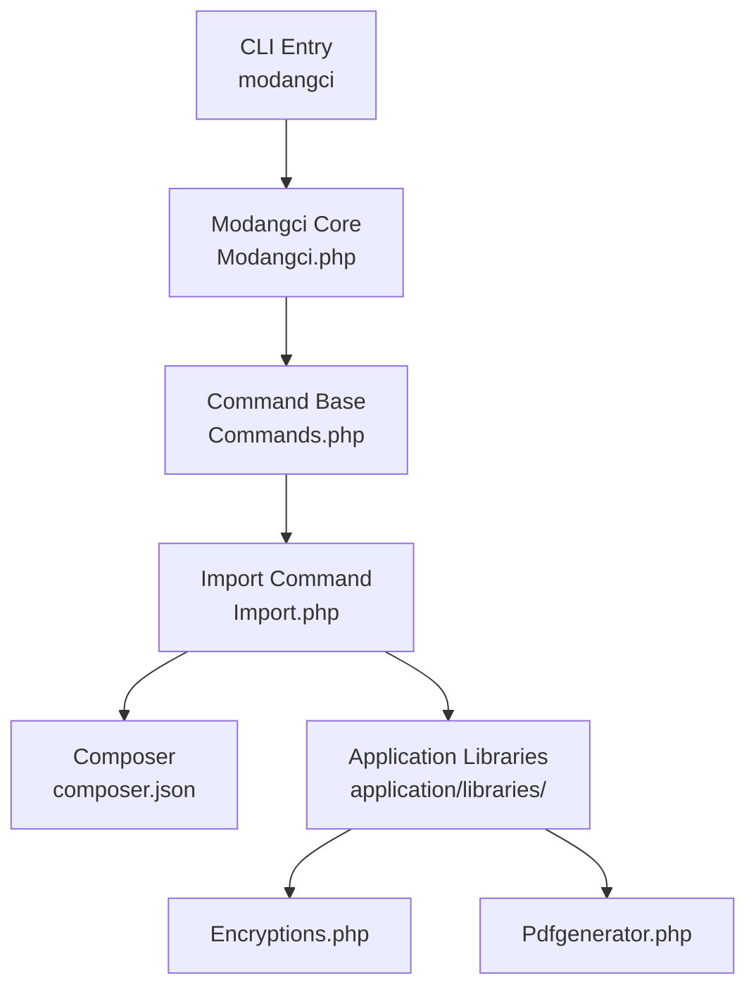
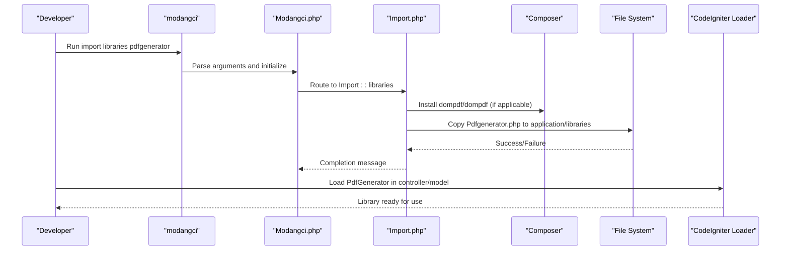
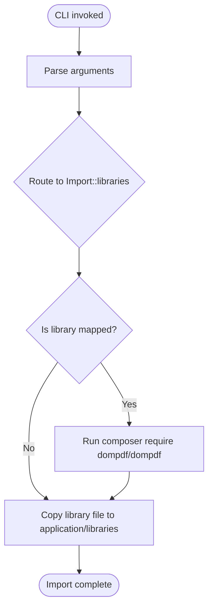
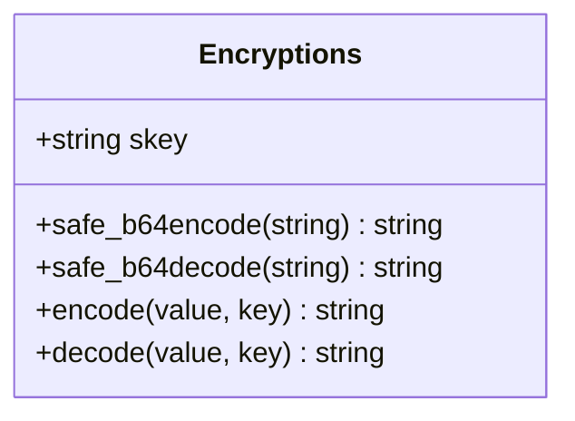
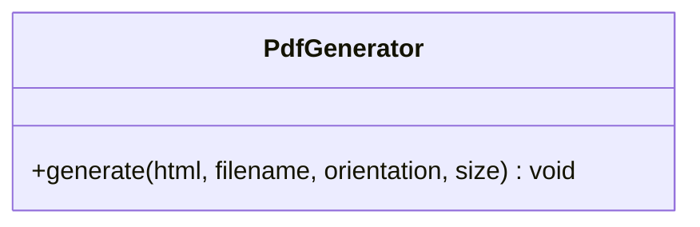
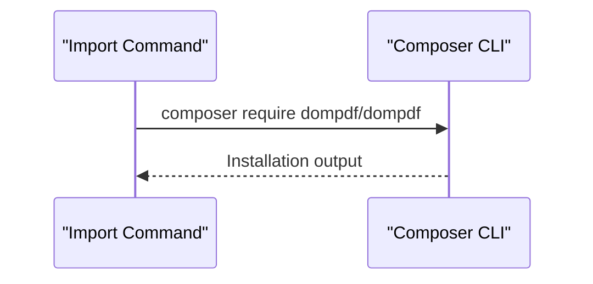
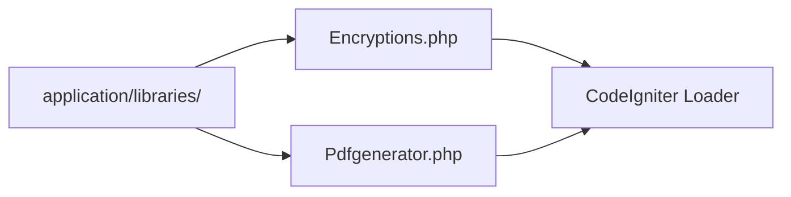
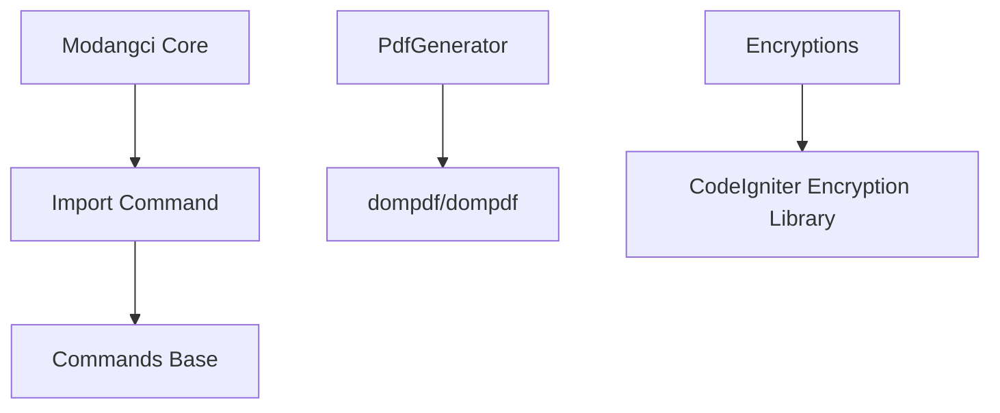

# Library Import

<cite>
**Referenced Files in This Document**
- [Import.php](file://src/commands/Import.php)
- [Commands.php](file://src/Commands.php)
- [Modangci.php](file://src/Modangci.php)
- [Pdfgenerator.php](file://src/application/libraries/Pdfgenerator.php)
- [Encryptions.php](file://src/application/libraries/Encryptions.php)
- [composer.json](file://composer.json)
- [install](file://install)
- [modangci](file://modangci)
- [ci_instance.php](file://ci_instance.php)
- [README.md](file://README.md)
</cite>

## Table of Contents
1. [Introduction](#introduction)
2. [Project Structure](#project-structure)
3. [Core Components](#core-components)
4. [Architecture Overview](#architecture-overview)
5. [Detailed Component Analysis](#detailed-component-analysis)
6. [Dependency Analysis](#dependency-analysis)
7. [Performance Considerations](#performance-considerations)
8. [Troubleshooting Guide](#troubleshooting-guide)
9. [Conclusion](#conclusion)

## Introduction
This document explains the library import functionality in Modangci, focusing on how to import encryption and PDF generation libraries into a CodeIgniter 3 application. It covers the automatic Composer dependency management for the PDF generator (dompdf/dompdf), the library import workflow, file placement in the application/libraries directory, and integration with CodeIgniter's library loading system. It also provides practical examples for importing libraries, configuring dependencies, using library methods in controllers and models, and handling Composer integration.

## Project Structure
Modangci provides a command-line interface to scaffold and import CodeIgniter components. The library import feature resides under the Import command and integrates with Composer for dependency management.

**Diagram sources**
- [modangci:1-26](file://modangci#L1-L26)
- [Modangci.php:1-60](file://src/Modangci.php#L1-L60)
- [Commands.php:1-135](file://src/Commands.php#L1-L135)
- [Import.php:1-53](file://src/commands/Import.php#L1-L53)
- [composer.json:1-25](file://composer.json#L1-L25)

**Section sources**
- [modangci:1-26](file://modangci#L1-L26)
- [Modangci.php:1-60](file://src/Modangci.php#L1-L60)
- [Commands.php:1-135](file://src/Commands.php#L1-L135)
- [Import.php:1-53](file://src/commands/Import.php#L1-L53)
- [composer.json:1-25](file://composer.json#L1-L25)

## Core Components
- Import command: Orchestrates copying library files from the vendor directory into the application/libraries directory and optionally runs Composer to install dependencies.
- Library implementations:
  - Encryptions: Provides encoding/decoding utilities built on CodeIgniter's encryption library.
  - PdfGenerator: Generates PDFs using Dompdf with configurable paper size and orientation.
- Composer integration: Automatically installs dompdf/dompdf when importing the PDF generator library.
- CodeIgniter integration: Libraries are placed in application/libraries and loaded via CodeIgniter's loader.

**Section sources**
- [Import.php:37-51](file://src/commands/Import.php#L37-L51)
- [Encryptions.php:1-56](file://src/application/libraries/Encryptions.php#L1-L56)
- [Pdfgenerator.php:1-17](file://src/application/libraries/Pdfgenerator.php#L1-L17)
- [composer.json:17-24](file://composer.json#L17-L24)

## Architecture Overview
The library import workflow follows a predictable sequence: CLI invocation, command routing, dependency resolution, file copying, and integration with CodeIgniter.

**Diagram sources**
- [modangci:1-26](file://modangci#L1-L26)
- [Modangci.php:1-60](file://src/Modangci.php#L1-L60)
- [Import.php:37-51](file://src/commands/Import.php#L37-L51)
- [Pdfgenerator.php:1-17](file://src/application/libraries/Pdfgenerator.php#L1-L17)

## Detailed Component Analysis

### Import Command Workflow
The Import command handles library imports and Composer dependency management.

- Command routing: The CLI entry point parses arguments and routes to the Import command.
- Dependency mapping: A mapping defines which libraries require Composer installation.
- File copying: Copies the selected library file from the vendor directory to application/libraries.
- Output: Echoes success or failure messages for each operation.

**Diagram sources**
- [Import.php:37-51](file://src/commands/Import.php#L37-L51)
- [Modangci.php:36-53](file://src/Modangci.php#L36-L53)

**Section sources**
- [Import.php:37-51](file://src/commands/Import.php#L37-L51)
- [Modangci.php:36-53](file://src/Modangci.php#L36-L53)

### Encryption Library (Encryptions)
The Encryptions library provides encoding and decoding utilities using CodeIgniter’s encryption library with AES-256-CBC.

- Initialization: Dynamically loads CodeIgniter’s encryption library and initializes it with cipher, mode, and key.
- Encoding: Encodes plaintext using the configured encryption settings and applies a URL-safe base64 encoding.
- Decoding: Decodes ciphertext using the inverse of the URL-safe base64 encoding and decrypts it with the encryption library.

**Diagram sources**
- [Encryptions.php:1-56](file://src/application/libraries/Encryptions.php#L1-L56)

**Section sources**
- [Encryptions.php:1-56](file://src/application/libraries/Encryptions.php#L1-L56)

### PDF Generator Library (PdfGenerator)
The PdfGenerator library generates PDFs using Dompdf with configurable paper size and orientation.

- Dependencies: Requires dompdf/dompdf installed via Composer.
- Configuration: Sets execution time and memory limits for PDF generation.
- Rendering: Loads HTML content, sets paper size and orientation, renders, and streams the PDF.

**Diagram sources**
- [Pdfgenerator.php:1-17](file://src/application/libraries/Pdfgenerator.php#L1-L17)

**Section sources**
- [Pdfgenerator.php:1-17](file://src/application/libraries/Pdfgenerator.php#L1-L17)
- [composer.json:17-24](file://composer.json#L17-L24)

### Composer Integration
- Automatic dependency management: When importing the PDF generator library, the Import command executes Composer to install dompdf/dompdf.
- PSR-4 autoloading: Composer configuration defines PSR-4 autoloading for Modangci classes.

**Diagram sources**
- [Import.php:45-46](file://src/commands/Import.php#L45-L46)
- [composer.json:20-24](file://composer.json#L20-L24)

**Section sources**
- [Import.php:39-46](file://src/commands/Import.php#L39-L46)
- [composer.json:17-24](file://composer.json#L17-L24)

### CodeIgniter Library Loading Integration
- File placement: Imported libraries are copied to application/libraries/<LibraryName>.php.
- Loading: CodeIgniter’s loader automatically recognizes libraries placed in application/libraries according to CodeIgniter conventions.
- Usage: Libraries can be accessed via the CodeIgniter instance in controllers and models.

**Diagram sources**
- [Encryptions.php:1-56](file://src/application/libraries/Encryptions.php#L1-L56)
- [Pdfgenerator.php:1-17](file://src/application/libraries/Pdfgenerator.php#L1-L17)

**Section sources**
- [Encryptions.php:1-56](file://src/application/libraries/Encryptions.php#L1-L56)
- [Pdfgenerator.php:1-17](file://src/application/libraries/Pdfgenerator.php#L1-L17)

## Dependency Analysis
- Internal dependencies:
  - Import command depends on the base Commands class for shared functionality.
  - Modangci core routes CLI invocations to the appropriate command class.
- External dependencies:
  - PdfGenerator depends on dompdf/dompdf.
  - Encryptions depends on CodeIgniter’s encryption library.

**Diagram sources**
- [Import.php:1-53](file://src/commands/Import.php#L1-L53)
- [Commands.php:1-135](file://src/Commands.php#L1-L135)
- [Modangci.php:1-60](file://src/Modangci.php#L1-L60)
- [Pdfgenerator.php:1-17](file://src/application/libraries/Pdfgenerator.php#L1-L17)
- [composer.json:17-24](file://composer.json#L17-L24)

**Section sources**
- [Import.php:1-53](file://src/commands/Import.php#L1-L53)
- [Commands.php:1-135](file://src/Commands.php#L1-L135)
- [Modangci.php:1-60](file://src/Modangci.php#L1-L60)
- [Pdfgenerator.php:1-17](file://src/application/libraries/Pdfgenerator.php#L1-L17)
- [composer.json:17-24](file://composer.json#L17-L24)

## Performance Considerations
- Memory and execution time: PdfGenerator temporarily increases memory limit and disables execution time limits during PDF generation to handle larger documents.
- Encryption overhead: Dynamic initialization of the encryption library occurs on each encode/decode call; consider caching keys or reusing instances if performance is critical.

**Section sources**
- [Pdfgenerator.php:8-9](file://src/application/libraries/Pdfgenerator.php#L8-L9)
- [Encryptions.php:22-31](file://src/application/libraries/Encryptions.php#L22-L31)

## Troubleshooting Guide
- Composer dependency not installed:
  - Symptom: PDF generation fails due to missing Dompdf class.
  - Resolution: Ensure dompdf/dompdf is installed via Composer and autoloaded.
- Library not found after import:
  - Symptom: CodeIgniter cannot locate the library file.
  - Resolution: Verify the library file was copied to application/libraries and that the class name matches the file name.
- Encryption errors:
  - Symptom: Encode/decode operations fail.
  - Resolution: Confirm the encryption library is initialized with a valid key and cipher mode.
- CLI invocation issues:
  - Symptom: Command not recognized or not executed.
  - Resolution: Ensure the CLI entry point is used and that the working directory is correct.

**Section sources**
- [Import.php:37-51](file://src/commands/Import.php#L37-L51)
- [Pdfgenerator.php:1-17](file://src/application/libraries/Pdfgenerator.php#L1-L17)
- [Encryptions.php:1-56](file://src/application/libraries/Encryptions.php#L1-L56)
- [modangci:1-26](file://modangci#L1-L26)

## Conclusion
Modangci’s library import functionality streamlines adding encryption and PDF generation capabilities to CodeIgniter applications. It automates Composer dependency management for PDF generation, copies library files into application/libraries, and integrates seamlessly with CodeIgniter’s library loading system. By following the documented workflow and best practices, developers can quickly extend their applications with robust encryption and PDF generation features.