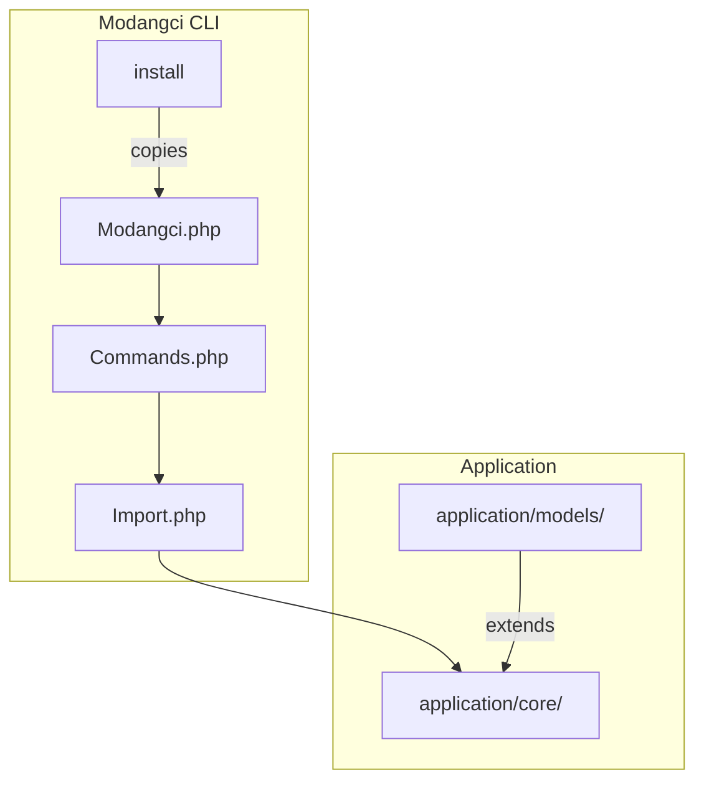
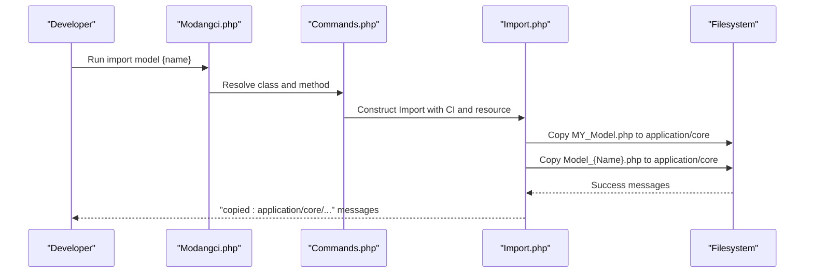
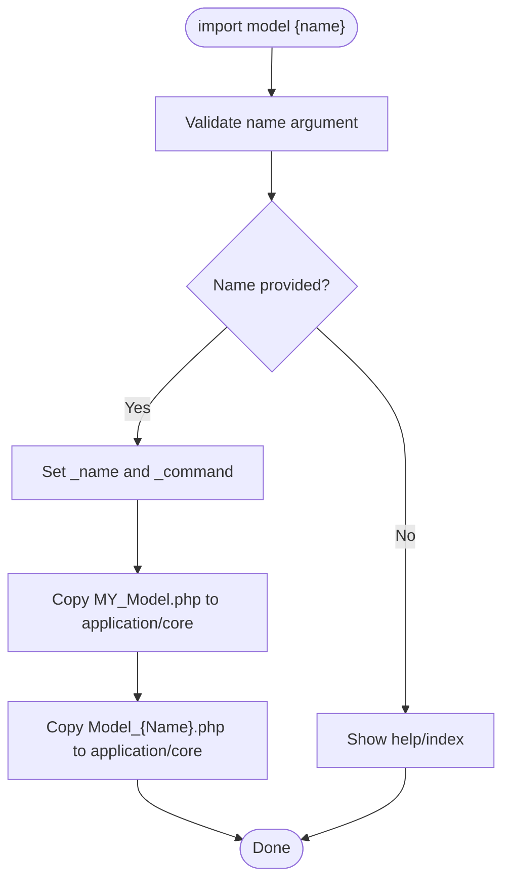
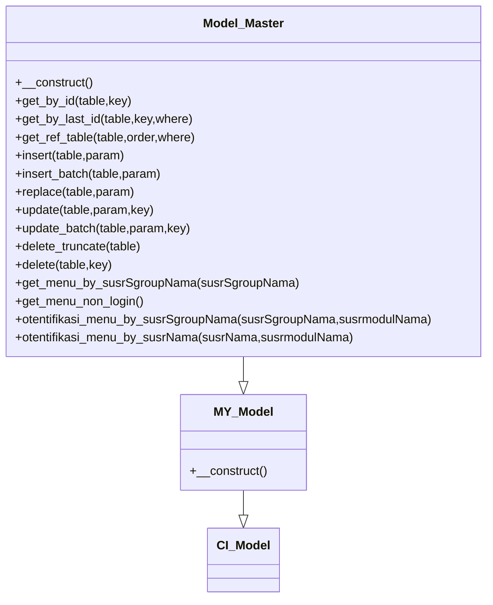
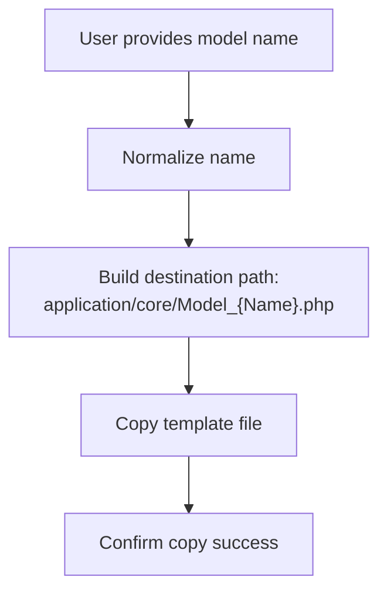
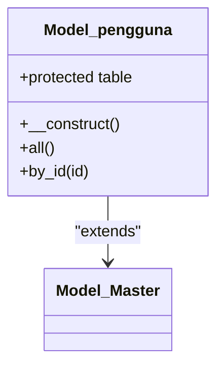
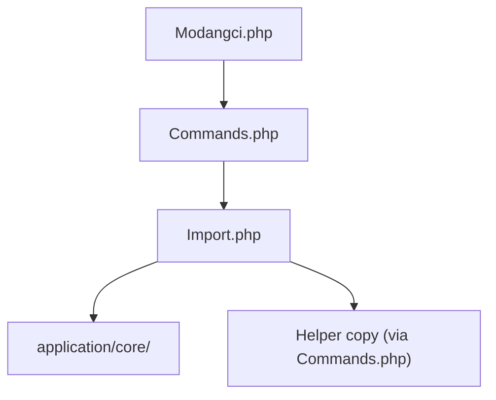

# Model Import

<cite>
**Referenced Files in This Document**
- [Import.php](file://src/commands/Import.php)
- [Commands.php](file://src/Commands.php)
- [Modangci.php](file://src/Modangci.php)
- [MY_Model.php](file://src/application/core/MY_Model.php)
- [Model_Master.php](file://src/application/core/Model_Master.php)
- [Model_pengguna.php](file://src/application/models/Model_pengguna.php)
- [install](file://install)
- [README.md](file://README.md)
- [Init.php](file://src/commands/Init.php)
</cite>

## Table of Contents
1. [Introduction](#introduction)
2. [Project Structure](#project-structure)
3. [Core Components](#core-components)
4. [Architecture Overview](#architecture-overview)
5. [Detailed Component Analysis](#detailed-component-analysis)
6. [Dependency Analysis](#dependency-analysis)
7. [Performance Considerations](#performance-considerations)
8. [Troubleshooting Guide](#troubleshooting-guide)
9. [Conclusion](#conclusion)

## Introduction
This document explains the model import functionality in Modangci. It focuses on how the import command copies base model files and custom model templates into a CodeIgniter 3 application, how imported models are named and placed, and how they relate to the base model layer. It also covers inheritance patterns, method overrides, customization, and best practices for integrating imported models into an existing MVC architecture.

## Project Structure
Modangci provides CLI commands to scaffold and import reusable components into a CodeIgniter application. The model import capability centers around:
- Base model layer under application/core (MY_Model.php and Model_Master.php)
- Imported custom model templates under application/core (Model_{Name}.php)
- Example models under application/models that extend Model_Master

**Diagram sources**
- [Modangci.php:10-41](file://src/Modangci.php#L10-L41)
- [Commands.php:14-18](file://src/Commands.php#L14-L18)
- [Import.php:9-24](file://src/commands/Import.php#L9-L24)
- [install:15-26](file://install#L15-L26)

**Section sources**
- [README.md:23-33](file://README.md#L23-L33)
- [Modangci.php:10-41](file://src/Modangci.php#L10-L41)
- [Commands.php:14-18](file://src/Commands.php#L14-L18)
- [Import.php:9-24](file://src/commands/Import.php#L9-L24)
- [install:15-26](file://install#L15-L26)

## Core Components
- Import command: Orchestrates copying of base and custom model files into the application.
- Base model layer: MY_Model.php and Model_Master.php define the foundational model hierarchy.
- Custom model templates: Model_{Name}.php files are copied into application/core for reuse.
- CLI entrypoint: Modangci.php routes CLI invocations to the appropriate command class and method.
- Helper copy mechanism: Commands.php provides a generic copy utility used by Import.php.

Key behaviors:
- Automatic copying of base model files and a custom model template when importing a model.
- Naming convention for imported models: Model_{Name}.php placed under application/core.
- Inheritance pattern: Custom models extend Model_Master, which itself extends MY_Model.

**Section sources**
- [Import.php:14-24](file://src/commands/Import.php#L14-L24)
- [MY_Model.php:3-15](file://src/application/core/MY_Model.php#L3-L15)
- [Model_Master.php:2](file://src/application/core/Model_Master.php#L2)
- [Commands.php:20-29](file://src/Commands.php#L20-L29)
- [Modangci.php:36-40](file://src/Modangci.php#L36-L40)

## Architecture Overview
The model import architecture follows a layered approach:
- CLI invocation via Modangci.php resolves the command class and method.
- Import.php handles model-specific logic, including copying base and custom templates.
- Base models (MY_Model.php and Model_Master.php) are placed under application/core.
- Custom model templates are placed under application/core as Model_{Name}.php.
- Existing models under application/models demonstrate extending Model_Master.

**Diagram sources**
- [Modangci.php:36-40](file://src/Modangci.php#L36-L40)
- [Commands.php:20-29](file://src/Commands.php#L20-L29)
- [Import.php:20-21](file://src/commands/Import.php#L20-L21)

## Detailed Component Analysis

### Import Command: Model Import Workflow
The import model command performs:
- Validates the provided model name.
- Sets internal command metadata.
- Copies base model files (MY_Model.php) and the custom model template (Model_{Name}.php) into application/core.

**Diagram sources**
- [Import.php:14-24](file://src/commands/Import.php#L14-L24)
- [Import.php:20-21](file://src/commands/Import.php#L20-L21)

**Section sources**
- [Import.php:14-24](file://src/commands/Import.php#L14-L24)
- [Import.php:20-21](file://src/commands/Import.php#L20-L21)

### Base Model Layer: MY_Model and Model_Master
- MY_Model extends the CodeIgniter framework’s CI_Model and conditionally loads Model_Master if present.
- Model_Master extends MY_Model and provides a rich set of database operations (CRUD, transactions, menu-related helpers).

**Diagram sources**
- [MY_Model.php:3-15](file://src/application/core/MY_Model.php#L3-L15)
- [Model_Master.php:2](file://src/application/core/Model_Master.php#L2)

**Section sources**
- [MY_Model.php:3-15](file://src/application/core/MY_Model.php#L3-L15)
- [Model_Master.php:2](file://src/application/core/Model_Master.php#L2)

### Custom Model Template Placement and Naming
- Base model files: MY_Model.php and Model_Master.php are copied into application/core.
- Custom model template: Model_{Name}.php is copied into application/core, where {Name} is derived from the command argument.
- The naming convention ensures uniqueness and clarity for model classes.

**Diagram sources**
- [Import.php:17](file://src/commands/Import.php#L17)
- [Import.php:21](file://src/commands/Import.php#L21)

**Section sources**
- [Import.php:17](file://src/commands/Import.php#L17)
- [Import.php:21](file://src/commands/Import.php#L21)

### Relationship Between Base Models and Custom Models
- MY_Model is the foundation for all models.
- Model_Master extends MY_Model and encapsulates shared data access patterns.
- Application models (under application/models) typically extend Model_Master to inherit common methods and behaviors.

**Diagram sources**
- [Model_pengguna.php:2](file://src/application/models/Model_pengguna.php#L2)
- [Model_Master.php:2](file://src/application/core/Model_Master.php#L2)

**Section sources**
- [Model_pengguna.php:2](file://src/application/models/Model_pengguna.php#L2)
- [Model_Master.php:2](file://src/application/core/Model_Master.php#L2)

### Examples: How to Import Different Model Types
- Import the base model layer: import model master
- After importing, create custom model templates per domain entity (e.g., Model_User, Model_Product).
- Place these templates under application/core to enable reuse across the application.

Note: The import command copies base files and a template; you still need to implement domain-specific logic in the template and place it under application/core.

**Section sources**
- [README.md:24](file://README.md#L24)
- [Import.php:20-21](file://src/commands/Import.php#L20-L21)

### Customizing Imported Model Templates
- The template copied by the import command resides under application/core as Model_{Name}.php.
- Customize the template to define:
  - Protected properties for table names and primary keys.
  - Methods for domain-specific queries and operations.
  - Overrides for inherited methods from Model_Master when needed.
- Place the customized template under application/core so it can be reused by controllers and services.

Best practices:
- Keep shared logic in Model_Master; override only when necessary.
- Use protected properties to configure table names and keys.
- Encapsulate complex queries in dedicated methods for readability and testability.

**Section sources**
- [Import.php:21](file://src/commands/Import.php#L21)
- [Model_Master.php:2](file://src/application/core/Model_Master.php#L2)

### Integrating with Existing CodeIgniter MVC Architecture
- Controllers instantiate models from application/models or application/core depending on your structure.
- Models extending Model_Master benefit from standardized CRUD and transaction methods.
- Ensure MY_Model and Model_Master are loaded before custom models by placing them under application/core.

Integration steps:
- Import the base models via the import command.
- Create custom model templates under application/core.
- Extend Model_Master in your domain models located under application/models.

**Section sources**
- [MY_Model.php:12-15](file://src/application/core/MY_Model.php#L12-L15)
- [Model_pengguna.php:2](file://src/application/models/Model_pengguna.php#L2)

### Model Inheritance Patterns and Method Overrides
- Inheritance chain: CI_Model -> MY_Model -> Model_Master -> Domain Models.
- Override methods from Model_Master when domain logic requires specialized behavior.
- Add domain-specific methods alongside inherited ones for clarity.

Example patterns:
- Override insert/update to add audit fields or soft deletes.
- Add composite queries or reporting methods in domain models.

**Section sources**
- [MY_Model.php:3](file://src/application/core/MY_Model.php#L3)
- [Model_Master.php:2](file://src/application/core/Model_Master.php#L2)
- [Model_pengguna.php:11-34](file://src/application/models/Model_pengguna.php#L11-L34)

## Dependency Analysis
The import functionality depends on:
- CLI routing via Modangci.php to resolve the Import command.
- Generic copy utilities in Commands.php to copy files into the application.
- Base model files (MY_Model.php and Model_Master.php) and custom templates (Model_{Name}.php) in the vendor source.

**Diagram sources**
- [Modangci.php:36-40](file://src/Modangci.php#L36-L40)
- [Commands.php:20-29](file://src/Commands.php#L20-L29)
- [Import.php:20-21](file://src/commands/Import.php#L20-L21)

**Section sources**
- [Modangci.php:36-40](file://src/Modangci.php#L36-L40)
- [Commands.php:20-29](file://src/Commands.php#L20-L29)
- [Import.php:20-21](file://src/commands/Import.php#L20-L21)

## Performance Considerations
- Centralized base models reduce duplication and improve maintainability.
- Using transactions in Model_Master helps ensure data consistency during batch operations.
- Keep domain-specific methods focused and avoid heavy logic in base classes to minimize overhead.

## Troubleshooting Guide
Common issues and resolutions:
- File not found errors during import: Verify the vendor source paths and ensure the installer has copied modangci assets into the project root.
- Permission denied when writing files: Ensure the application/core directory is writable by the CLI user.
- Model not loading after import: Confirm MY_Model.php and Model_Master.php are present in application/core and that custom templates are named correctly (Model_{Name}.php).

**Section sources**
- [Commands.php:22-28](file://src/Commands.php#L22-L28)
- [install:22-23](file://install#L22-L23)

## Conclusion
The model import functionality in Modangci streamlines setting up a reusable model layer in CodeIgniter applications. By copying base models and custom templates into application/core, developers can quickly establish a consistent inheritance pattern with MY_Model and Model_Master, and build domain-specific models that extend Model_Master. Following the naming conventions, placing files in the correct locations, and customizing templates appropriately ensures smooth integration with existing MVC architectures and promotes maintainable, scalable code.