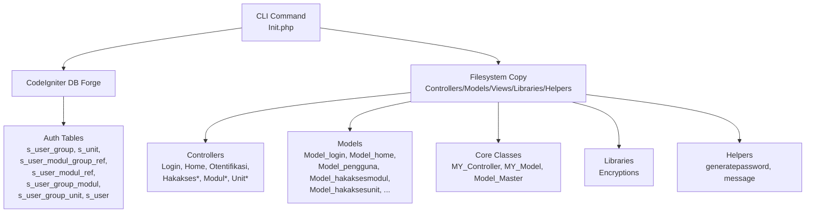
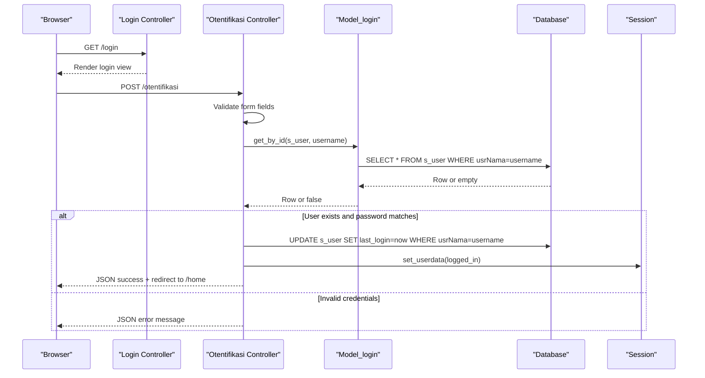
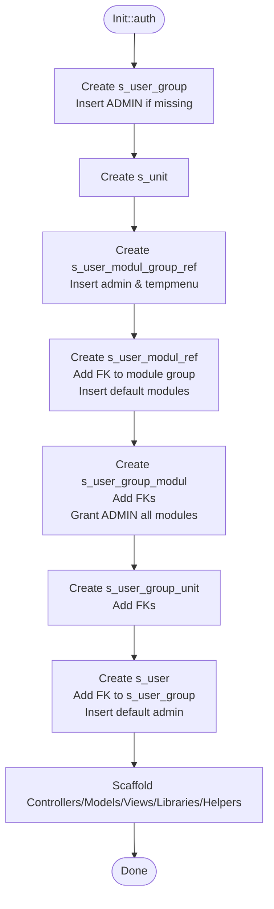
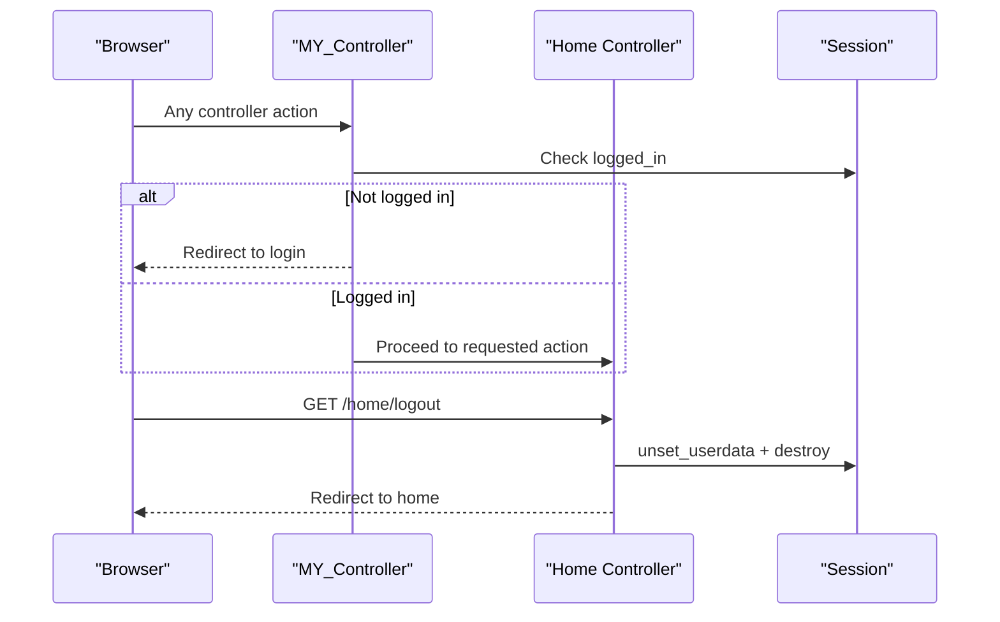
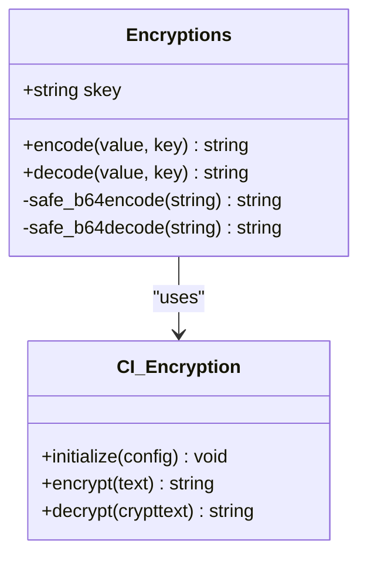
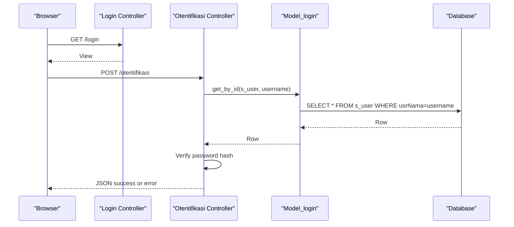
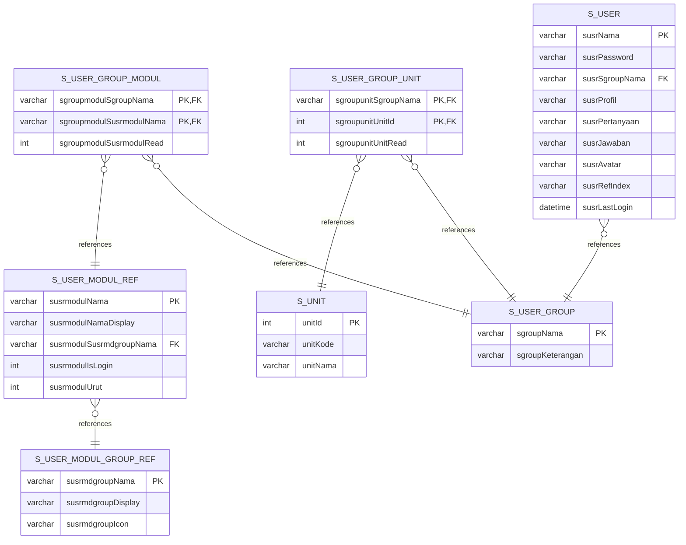
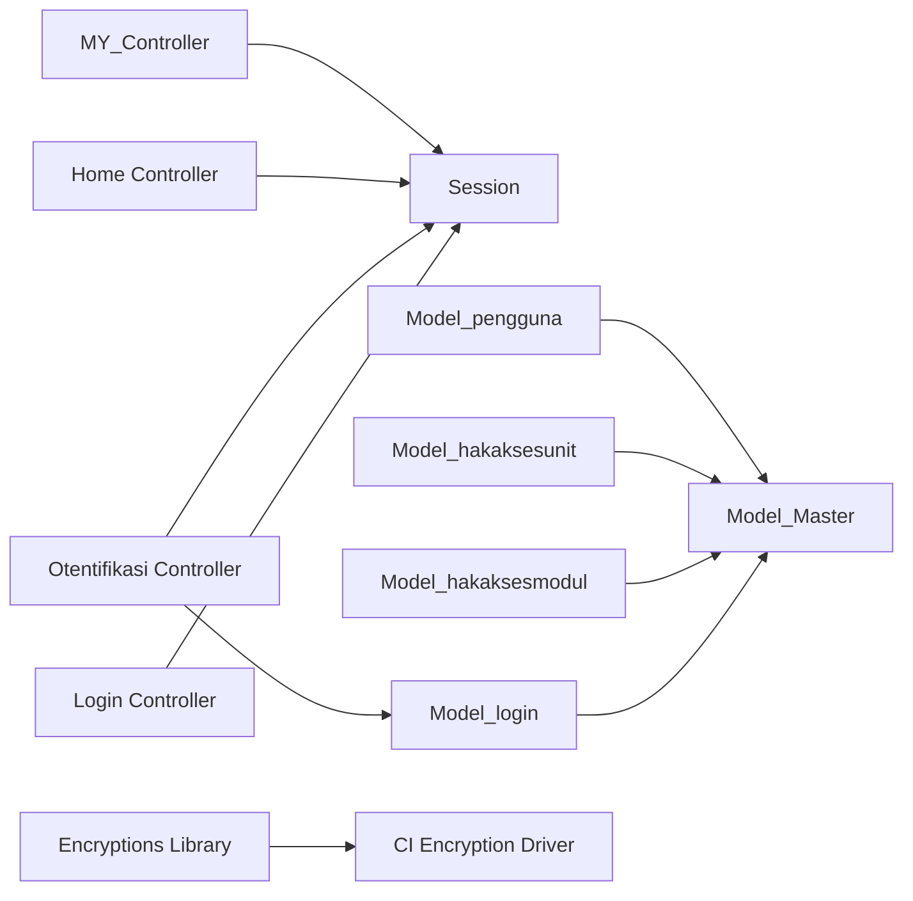

# Authentication System Setup

<cite>
**Referenced Files in This Document**
- [Init.php](file://src/commands/Init.php)
- [Login.php](file://src/application/controllers/Login.php)
- [Otentifikasi.php](file://src/application/controllers/Otentifikasi.php)
- [Home.php](file://src/application/controllers/Home.php)
- [MY_Controller.php](file://src/application/core/MY_Controller.php)
- [Model_Master.php](file://src/application/core/Model_Master.php)
- [Encryptions.php](file://src/application/libraries/Encryptions.php)
- [generatepassword_helper.php](file://src/application/helpers/generatepassword_helper.php)
- [Model_login.php](file://src/application/models/Model_login.php)
- [Model_home.php](file://src/application/models/Model_home.php)
- [Model_pengguna.php](file://src/application/models/Model_pengguna.php)
- [Model_hakaksesmodul.php](file://src/application/models/Model_hakaksesmodul.php)
- [Model_hakaksesunit.php](file://src/application/libraries/Encryptions.php)
</cite>

## Table of Contents
1. [Introduction](#introduction)
2. [Project Structure](#project-structure)
3. [Core Components](#core-components)
4. [Architecture Overview](#architecture-overview)
5. [Detailed Component Analysis](#detailed-component-analysis)
6. [Dependency Analysis](#dependency-analysis)
7. [Performance Considerations](#performance-considerations)
8. [Troubleshooting Guide](#troubleshooting-guide)
9. [Conclusion](#conclusion)
10. [Appendices](#appendices)

## Introduction
This document explains the complete authentication system initialization for Modangci. It covers the database schema creation for multi-role permissions, default data insertion, foreign key constraints, controller and model scaffolding, session management, encryption library integration, and helper configuration. It also provides step-by-step verification, default admin credentials, troubleshooting tips, and guidance for customizing roles and extending permissions.

## Project Structure
The authentication system spans CLI initialization, controllers, models, core classes, libraries, and helpers. The CLI command creates database tables, inserts defaults, sets constraints, and copies framework components into the application.

**Diagram sources**
- [Init.php:125-478](file://src/commands/Init.php#L125-L478)
- [Login.php:1-18](file://src/application/controllers/Login.php#L1-L18)
- [Home.php:1-121](file://src/application/controllers/Home.php#L1-L121)
- [Otentifikasi.php:1-64](file://src/application/controllers/Otentifikasi.php#L1-L64)
- [MY_Controller.php:1-59](file://src/application/core/MY_Controller.php#L1-L59)
- [Model_Master.php:1-257](file://src/application/core/Model_Master.php#L1-L257)
- [Encryptions.php:1-56](file://src/application/libraries/Encryptions.php#L1-L56)
- [generatepassword_helper.php:1-26](file://src/application/helpers/generatepassword_helper.php#L1-L26)

**Section sources**
- [Init.php:125-478](file://src/commands/Init.php#L125-L478)

## Core Components
- CLI Initialization: Creates tables, inserts defaults, adds constraints, and scaffolds controllers, models, views, libraries, and helpers.
- Session Management: Enforces login checks via MY_Controller and stores user data in sessions.
- Encryption Library: Provides safe encoding/decoding for URIs and secure encryption routines.
- Helpers: Utility functions for password generation and standardized messages.
- Models: Shared database operations and role-based menu retrieval.

**Section sources**
- [Init.php:125-478](file://src/commands/Init.php#L125-L478)
- [MY_Controller.php:13-18](file://src/application/core/MY_Controller.php#L13-L18)
- [Encryptions.php:21-53](file://src/application/libraries/Encryptions.php#L21-L53)
- [generatepassword_helper.php:4-25](file://src/application/helpers/generatepassword_helper.php#L4-L25)
- [Model_Master.php:9-257](file://src/application/core/Model_Master.php#L9-L257)

## Architecture Overview
The authentication flow begins at the login page, validates credentials against the s_user table, sets session data, and routes users through MY_Controller’s access control. Menu visibility and module access are derived from s_user_group_modul and s_user_modul_ref.

**Diagram sources**
- [Login.php:13-16](file://src/application/controllers/Login.php#L13-L16)
- [Otentifikasi.php:12-33](file://src/application/controllers/Otentifikasi.php#L12-L33)
- [Otentifikasi.php:35-62](file://src/application/controllers/Otentifikasi.php#L35-L62)
- [Model_login.php:1-9](file://src/application/models/Model_login.php#L1-L9)

## Detailed Component Analysis

### CLI Initialization: Database Schema, Defaults, Constraints, and Scaffolding
The CLI command performs:
- Table creation for user groups, units, module groups, modules, group-module permissions, group-unit permissions, and users.
- Default data insertion for ADMIN group, module groups, modules, and a default admin user.
- Foreign key constraint setup for referential integrity.
- Scaffolding of controllers, models, views, libraries, and helpers.

Key steps:
- Create s_user_group with primary key on group name and insert ADMIN group if missing.
- Create s_unit with auto-increment primary key.
- Create s_user_modul_group_ref with default admin and tempmenu entries.
- Create s_user_modul_ref with cascade FK to module group; insert default modules with ordering.
- Create s_user_group_modul with composite primary key and FKs to s_user_modul_ref and s_user_group; grant ADMIN all modules.
- Create s_user_group_unit with composite primary key and FKs to s_unit and s_user_group.
- Create s_user with FK to s_user_group; insert default admin with hashed password.
- Create sessions folder and copy framework assets and code.

**Diagram sources**
- [Init.php:125-478](file://src/commands/Init.php#L125-L478)

**Section sources**
- [Init.php:125-478](file://src/commands/Init.php#L125-L478)

### Session Management and Access Control
- MY_Controller enforces login checks on all controllers extending it. Unauthenticated requests are redirected to the login page.
- Home controller manages logout and exposes endpoints to change passwords and roles for ADMIN users.
- Session data includes username, group, original group, and profile.

**Diagram sources**
- [MY_Controller.php:13-18](file://src/application/core/MY_Controller.php#L13-L18)
- [Home.php:28-33](file://src/application/controllers/Home.php#L28-L33)

**Section sources**
- [MY_Controller.php:13-18](file://src/application/core/MY_Controller.php#L13-L18)
- [Home.php:28-33](file://src/application/controllers/Home.php#L28-L33)

### Encryption Library Integration
The Encryptions library wraps CodeIgniter’s encryption to safely encode/decode values for URIs and secure storage. It initializes AES-256-CBC with a configurable key and strips padding for URL-safe transport.

**Diagram sources**
- [Encryptions.php:1-56](file://src/application/libraries/Encryptions.php#L1-L56)

**Section sources**
- [Encryptions.php:21-53](file://src/application/libraries/Encryptions.php#L21-L53)

### Helper Function Configuration
- generatepassword helper generates a numeric password of specified length for provisioning new users.
- message helper is referenced by controllers for standardized feedback.

**Section sources**
- [generatepassword_helper.php:4-25](file://src/application/helpers/generatepassword_helper.php#L4-L25)

### Controllers and Models for Authentication

#### Login and Authentication Flow
- Login controller renders the login view and prevents access if already logged in.
- Otentifikasi controller validates credentials, verifies password hash, updates last login, and sets session data.
- Model_login extends the master model and is used by Otentifikasi for user lookup.

**Diagram sources**
- [Login.php:13-16](file://src/application/controllers/Login.php#L13-L16)
- [Otentifikasi.php:12-33](file://src/application/controllers/Otentifikasi.php#L12-L33)
- [Otentifikasi.php:35-62](file://src/application/controllers/Otentifikasi.php#L35-L62)
- [Model_login.php:1-9](file://src/application/models/Model_login.php#L1-L9)

**Section sources**
- [Login.php:1-18](file://src/application/controllers/Login.php#L1-L18)
- [Otentifikasi.php:1-64](file://src/application/controllers/Otentifikasi.php#L1-L64)
- [Model_login.php:1-9](file://src/application/models/Model_login.php#L1-L9)

#### Home Controller and Role Switching
- Home controller extends MY_Controller and loads Model_home.
- Provides logout, password change, and ADMIN-only role switching endpoints.

**Section sources**
- [Home.php:1-121](file://src/application/controllers/Home.php#L1-L121)
- [Model_home.php:1-9](file://src/application/models/Model_home.php#L1-L9)

#### Multi-Role Permission Models
- Model_pengguna: Lists users joined with their groups.
- Model_hakaksesmodul: Retrieves module permissions per group with joins to module and group refs.
- Model_hakaksesunit: Retrieves unit permissions per group with joins to unit and group.

**Section sources**
- [Model_pengguna.php:1-36](file://src/application/models/Model_pengguna.php#L1-L36)
- [Model_hakaksesmodul.php:1-26](file://src/application/models/Model_hakaksesmodul.php#L1-L26)
- [Model_hakaksesunit.php:1-25](file://src/application/models/Model_hakaksesunit.php#L1-L25)

### Database Schema and Relationships
The schema supports a multi-role architecture with inheritance-like behavior via s_user_group_modul and s_user_group_unit.

**Diagram sources**
- [Init.php:142-420](file://src/commands/Init.php#L142-L420)

**Section sources**
- [Init.php:142-420](file://src/commands/Init.php#L142-L420)

## Dependency Analysis
- Controllers depend on MY_Controller for session enforcement and on models for data operations.
- Models depend on Model_Master for CRUD operations and database queries.
- Otentifikasi depends on Model_login and CodeIgniter’s form validation and session.
- Encryption library integrates with CodeIgniter’s encryption driver.
- Views rely on layout templates and helpers for rendering and messaging.

**Diagram sources**
- [Login.php:1-18](file://src/application/controllers/Login.php#L1-L18)
- [Otentifikasi.php:1-64](file://src/application/controllers/Otentifikasi.php#L1-L64)
- [Home.php:1-121](file://src/application/controllers/Home.php#L1-L121)
- [MY_Controller.php:1-59](file://src/application/core/MY_Controller.php#L1-L59)
- [Model_login.php:1-9](file://src/application/models/Model_login.php#L1-L9)
- [Model_pengguna.php:1-36](file://src/application/models/Model_pengguna.php#L1-L36)
- [Model_hakaksesmodul.php:1-26](file://src/application/models/Model_hakaksesmodul.php#L1-L26)
- [Model_hakaksesunit.php:1-25](file://src/application/models/Model_hakaksesunit.php#L1-L25)
- [Encryptions.php:1-56](file://src/application/libraries/Encryptions.php#L1-L56)

**Section sources**
- [MY_Controller.php:13-18](file://src/application/core/MY_Controller.php#L13-L18)
- [Otentifikasi.php:35-62](file://src/application/controllers/Otentifikasi.php#L35-L62)
- [Model_Master.php:9-257](file://src/application/core/Model_Master.php#L9-L257)

## Performance Considerations
- Use foreign keys and indexed columns to optimize joins in menu and permission retrieval.
- Batch inserts for default module and group-module assignments reduce transaction overhead.
- Keep session save path configured and ensure filesystem performance for session writes.
- Avoid excessive logging in production; debuglog usage can be toggled via helper availability.

## Troubleshooting Guide
Common issues and resolutions:
- Login fails with invalid credentials:
  - Verify the default admin user exists and password is hashed.
  - Confirm the s_user table and FK to s_user_group are present.
- Access denied to pages:
  - Ensure the user’s group has module permissions in s_user_group_modul.
  - Check s_user_modul_ref entries and ordering.
- Session not persisting:
  - Confirm sessions folder exists and is writable.
  - Verify sess_save_path in config and autoload settings.
- Encryption errors:
  - Ensure encryption library is loaded and cipher mode/key match expectations.
- Role switching not working:
  - Only ADMIN can switch roles; verify session data and controller logic.

Verification checklist:
- Default admin credentials: username “admin”, password “admin” (hashed on creation).
- Tables created: s_user_group, s_unit, s_user_modul_group_ref, s_user_modul_ref, s_user_group_modul, s_user_group_unit, s_user.
- Constraints present: module ref FK to module group, group-module FKs, group-unit FKs, user FK to group.
- Controllers/models copied: Login, Home, Otentifikasi, and multi-role controllers/models.
- Autoload configured: database, session, form_validation, encryptions; helpers url, form, security, message.
- Configured base_url and sess_save_path.

**Section sources**
- [Init.php:413-420](file://src/commands/Init.php#L413-L420)
- [MY_Controller.php:13-18](file://src/application/core/MY_Controller.php#L13-L18)
- [Otentifikasi.php:35-62](file://src/application/controllers/Otentifikasi.php#L35-L62)
- [Home.php:47-56](file://src/application/controllers/Home.php#L47-L56)

## Conclusion
Modangci’s authentication system initializes a robust multi-role architecture with clear separation of concerns. The CLI command automates schema creation, default data, and scaffolding. Session enforcement, encryption, and helper utilities provide a secure and maintainable foundation. Administrators can manage users, modules, and units while leveraging inherited permissions for scalable access control.

## Appendices

### Step-by-Step Setup Verification
- Run the CLI init command to create tables, insert defaults, and scaffold components.
- Configure autoload and config as indicated by the CLI output.
- Navigate to the login page and log in with default admin credentials.
- Verify menu items appear based on ADMIN group permissions.
- Test logout and re-login to confirm session persistence.
- Use the role switching endpoint (ADMIN only) to test permission inheritance.

### Default Admin Credentials
- Username: admin
- Password: admin (hashed during initialization)

### Customizing Roles and Extending Permissions
- Add new groups in s_user_group and assign module/unit permissions in s_user_group_modul and s_user_group_unit.
- Extend s_user_modul_ref with new modules and assign to groups.
- Use Encryptions library for secure URI encoding/decoding.
- Leverage helpers for standardized messaging and password generation.