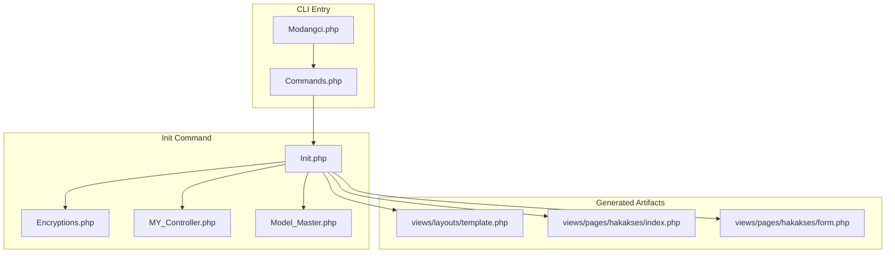
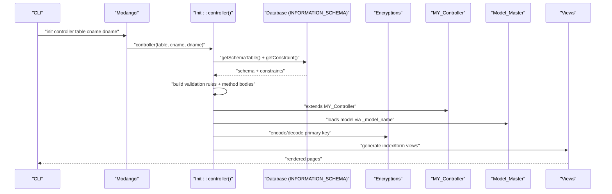
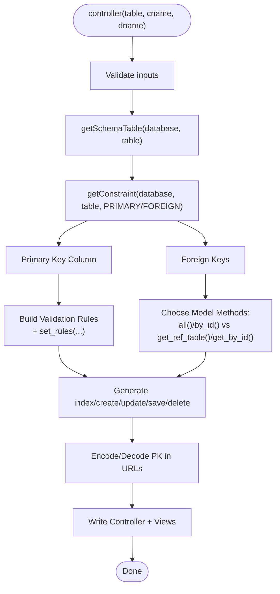
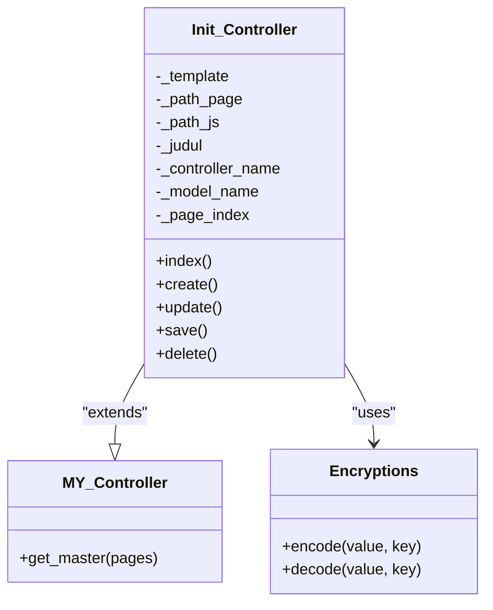
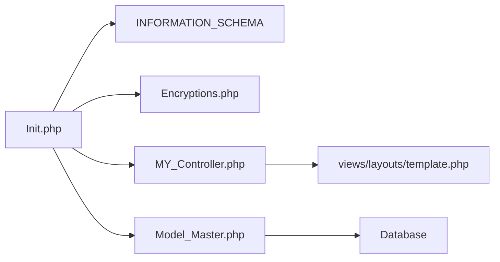

# Controller Generation

<cite>
**Referenced Files in This Document**
- [Init.php](file://src/commands/Init.php)
- [Encryptions.php](file://src/application/libraries/Encryptions.php)
- [MY_Controller.php](file://src/application/core/MY_Controller.php)
- [Model_Master.php](file://src/application/core/Model_Master.php)
- [template.php](file://src/application/views/layouts/template.php)
- [index.php](file://src/application/views/pages/hakakses/index.php)
- [form.php](file://src/application/views/pages/hakakses/form.php)
- [Commands.php](file://src/Commands.php)
- [Modangci.php](file://src/Modangci.php)
</cite>

## Table of Contents
1. [Introduction](#introduction)
2. [Project Structure](#project-structure)
3. [Core Components](#core-components)
4. [Architecture Overview](#architecture-overview)
5. [Detailed Component Analysis](#detailed-component-analysis)
6. [Dependency Analysis](#dependency-analysis)
7. [Performance Considerations](#performance-considerations)
8. [Troubleshooting Guide](#troubleshooting-guide)
9. [Conclusion](#conclusion)
10. [Appendices](#appendices)

## Introduction
This document explains Modangci’s controller generation functionality within the init commands. It focuses on how the system analyzes database schemas to generate CRUD controllers dynamically, including automatic detection of primary keys and foreign keys, table relationships, generated controller structure (index, create, update, save, delete), form validation rules derived from database constraints and nullability, integration with the encryption library for URL parameter encoding, and the template system setup. It also covers customization patterns, naming conventions, template path configuration, and AJAX handling.

## Project Structure
Modangci organizes scaffolding under the commands namespace, with the Init command responsible for generating controllers, models, and views. Controllers extend a base controller, models extend a master model, and views render within a shared layout template.

**Diagram sources**
- [Modangci.php:1-60](file://src/Modangci.php#L1-L60)
- [Commands.php:1-135](file://src/Commands.php#L1-L135)
- [Init.php:1-917](file://src/commands/Init.php#L1-L917)
- [Encryptions.php:1-56](file://src/application/libraries/Encryptions.php#L1-L56)
- [MY_Controller.php:1-59](file://src/application/core/MY_Controller.php#L1-L59)
- [Model_Master.php:1-257](file://src/application/core/Model_Master.php#L1-L257)
- [template.php:1-180](file://src/application/views/layouts/template.php#L1-L180)
- [index.php:1-88](file://src/application/views/pages/hakakses/index.php#L1-L88)
- [form.php:1-52](file://src/application/views/pages/hakakses/form.php#L1-L52)

**Section sources**
- [Modangci.php:1-60](file://src/Modangci.php#L1-L60)
- [Commands.php:1-135](file://src/Commands.php#L1-L135)
- [Init.php:1-917](file://src/commands/Init.php#L1-L917)

## Core Components
- Init command: Orchestrates controller, model, and view generation from database schema.
- Encryption library: Provides URL-safe encoding/decoding for primary key parameters.
- Base controller: Supplies template and menu integration for generated controllers.
- Master model: Provides CRUD operations and convenience methods used by generated models.
- Template system: Centralized layout renders page-specific views.

**Section sources**
- [Init.php:480-640](file://src/commands/Init.php#L480-L640)
- [Encryptions.php:1-56](file://src/application/libraries/Encryptions.php#L1-L56)
- [MY_Controller.php:1-59](file://src/application/core/MY_Controller.php#L1-L59)
- [Model_Master.php:1-257](file://src/application/core/Model_Master.php#L1-L257)
- [template.php:1-180](file://src/application/views/layouts/template.php#L1-L180)

## Architecture Overview
The controller generation process follows a schema-first approach:
- Detects primary and foreign keys via INFORMATION_SCHEMA.
- Builds form validation rules from column metadata (nullable, comments).
- Generates controller methods with AJAX-aware save logic.
- Uses encryption for URL-safe primary key passing.
- Renders views within a shared template.

**Diagram sources**
- [Modangci.php:35-53](file://src/Modangci.php#L35-L53)
- [Init.php:480-640](file://src/commands/Init.php#L480-L640)
- [Encryptions.php:1-56](file://src/application/libraries/Encryptions.php#L1-L56)
- [MY_Controller.php:1-59](file://src/application/core/MY_Controller.php#L1-L59)
- [Model_Master.php:1-257](file://src/application/core/Model_Master.php#L1-L257)
- [template.php:1-180](file://src/application/views/layouts/template.php#L1-L180)

## Detailed Component Analysis

### Controller Generation Method
The controller generator accepts three arguments: table name, controller class name, and display name. It:
- Normalizes inputs and queries INFORMATION_SCHEMA for schema and constraints.
- Determines primary key and foreign keys.
- Chooses model method invocation based on foreign key presence.
- Builds form validation rules from column metadata (nullable, comments).
- Generates controller methods: index, create, update, save, delete.
- Uses AJAX detection to branch save logic.
- Encodes/decodes primary keys for URLs.

**Diagram sources**
- [Init.php:480-640](file://src/commands/Init.php#L480-L640)
- [Init.php:79-108](file://src/commands/Init.php#L79-L108)
- [Init.php:57-77](file://src/commands/Init.php#L57-L77)

**Section sources**
- [Init.php:480-640](file://src/commands/Init.php#L480-L640)
- [Init.php:79-108](file://src/commands/Init.php#L79-L108)
- [Init.php:57-77](file://src/commands/Init.php#L57-L77)

### Automatic Detection of Keys and Relationships
- Primary key detection uses INFORMATION_SCHEMA.KEY_COLUMN_USAGE with constraint name equal to PRIMARY.
- Foreign key detection filters rows where REFERENCED_COLUMN_NAME is not null.
- Joined schema query pairs columns with optional foreign key references.

**Section sources**
- [Init.php:57-77](file://src/commands/Init.php#L57-L77)
- [Init.php:79-108](file://src/commands/Init.php#L79-L108)

### Generated Controller Structure
- index(): Loads master data, sets create/update/delete URLs, and renders index view.
- create(): Initializes form view with save URL and empty data.
- update(): Decodes encrypted primary key from URI segment, loads record, and renders form.
- save(): Validates form, builds parameter array, inserts or updates depending on old PK, handles AJAX messages.
- delete(): Decodes encrypted primary key, deletes record, and displays success/error.

**Diagram sources**
- [MY_Controller.php:1-59](file://src/application/core/MY_Controller.php#L1-L59)
- [Init.php:527-631](file://src/commands/Init.php#L527-L631)
- [Encryptions.php:1-56](file://src/application/libraries/Encryptions.php#L1-L56)

**Section sources**
- [Init.php:527-631](file://src/commands/Init.php#L527-L631)

### Form Validation Rules Generation
Validation rules are built from database metadata:
- Primary key: required; unique on create, not required on update.
- Non-auto-increment columns: required if IS_NULLABLE is NO; otherwise optional.
- COLUMN_COMMENT is used as label when present.

**Section sources**
- [Init.php:505-525](file://src/commands/Init.php#L505-L525)

### Integration with Encryption Library
- URL parameter encoding: update and delete actions decode the primary key using the encryption library.
- Save action uses hidden field containing old primary key to distinguish insert vs update.

**Section sources**
- [Init.php:573](file://src/commands/Init.php#L573)
- [Init.php:619](file://src/commands/Init.php#L619)
- [Init.php:870](file://src/commands/Init.php#L870)
- [Encryptions.php:1-56](file://src/application/libraries/Encryptions.php#L1-L56)

### Template System Setup
- Controllers set template path and page path; MY_Controller’s get_master supplies menus and breadcrumb data.
- Views render within the shared template, which includes subheader and layout partials.

**Section sources**
- [Init.php:537-546](file://src/commands/Init.php#L537-L546)
- [MY_Controller.php:20-51](file://src/application/core/MY_Controller.php#L20-L51)
- [template.php:95-100](file://src/application/views/layouts/template.php#L95-L100)

### AJAX Handling Patterns
- A constant IS_AJAX detects XHR requests.
- Save method branches logic based on IS_AJAX to handle AJAX submissions and return appropriate messages.

**Section sources**
- [Init.php:530](file://src/commands/Init.php#L530)
- [Init.php:588-615](file://src/commands/Init.php#L588-L615)

### Examples of Customization
- Adding custom methods: Extend the generated controller class and add new methods. The base controller and model remain compatible.
- Modifying generated code structure: Adjust controller template generation in the controller method to change method signatures or add helper calls.
- Customizing validation: Modify the validation rule building loop to add custom rules or conditions based on column names or types.
- Changing template path: Update the template and page path assignments in the controller method to target different layout or view folders.

**Section sources**
- [Init.php:527-631](file://src/commands/Init.php#L527-L631)
- [Init.php:505-525](file://src/commands/Init.php#L505-L525)
- [Init.php:537-546](file://src/commands/Init.php#L537-L546)

### Controller Naming Conventions
- Controller class name is normalized to lowercase.
- Display name is capitalized for human-readable titles.
- Model name is derived as model_<lowercase controller>.

**Section sources**
- [Init.php:486-488](file://src/commands/Init.php#L486-L488)
- [Init.php:542](file://src/commands/Init.php#L542)

### Template Path Configuration
- Template path is set to a shared layout.
- Page path is set to a folder under views/pages/<controller>.
- The base controller’s get_master supplies menus and breadcrumb data.

**Section sources**
- [Init.php:537-546](file://src/commands/Init.php#L537-L546)
- [MY_Controller.php:20-51](file://src/application/core/MY_Controller.php#L20-L51)
- [template.php:95-100](file://src/application/views/layouts/template.php#L95-L100)

## Dependency Analysis
The controller generation depends on:
- Database schema metadata (INFORMATION_SCHEMA).
- Encryption library for URL-safe primary key handling.
- Base controller and master model for rendering and persistence.
- Template system for view composition.

**Diagram sources**
- [Init.php:480-640](file://src/commands/Init.php#L480-L640)
- [Encryptions.php:1-56](file://src/application/libraries/Encryptions.php#L1-L56)
- [MY_Controller.php:1-59](file://src/application/core/MY_Controller.php#L1-L59)
- [Model_Master.php:1-257](file://src/application/core/Model_Master.php#L1-L257)
- [template.php:1-180](file://src/application/views/layouts/template.php#L1-L180)

**Section sources**
- [Init.php:480-640](file://src/commands/Init.php#L480-L640)
- [Encryptions.php:1-56](file://src/application/libraries/Encryptions.php#L1-L56)
- [MY_Controller.php:1-59](file://src/application/core/MY_Controller.php#L1-L59)
- [Model_Master.php:1-257](file://src/application/core/Model_Master.php#L1-L257)
- [template.php:1-180](file://src/application/views/layouts/template.php#L1-L180)

## Performance Considerations
- INFORMATION_SCHEMA queries are lightweight and cached by the framework; still, avoid excessive repeated calls in tight loops.
- AJAX save reduces round-trips for validation and submission.
- Using batch operations in models can improve throughput for bulk updates.

[No sources needed since this section provides general guidance]

## Troubleshooting Guide
- Table not found: The generator checks schema existence and prints a message if absent.
- Unique validation failures: Ensure primary key uniqueness constraints align with the generated validation rules.
- Encryption errors: Verify encryption key configuration and that encoded segments are passed correctly.
- Template rendering issues: Confirm template and page paths match the controller’s assignments.

**Section sources**
- [Init.php:634-637](file://src/commands/Init.php#L634-L637)
- [Init.php:530](file://src/commands/Init.php#L530)
- [Encryptions.php:38-53](file://src/application/libraries/Encryptions.php#L38-L53)

## Conclusion
Modangci’s Init command provides a robust, schema-driven controller generation pipeline. It automatically derives validation rules, integrates encryption for secure URLs, and composes views within a shared template. The resulting controllers follow a consistent CRUD pattern, are easy to customize, and integrate seamlessly with the base controller and master model layers.

## Appendices

### Generated Controller Methods Reference
- index(): Lists records and prepares create/update/delete URLs.
- create(): Initializes form with save URL and empty data.
- update(): Loads existing record by decoded primary key and renders form.
- save(): Validates, inserts or updates, and handles AJAX responses.
- delete(): Deletes record by decoded primary key and reports outcome.

**Section sources**
- [Init.php:548-629](file://src/commands/Init.php#L548-L629)

### Example View Integration
- Index view renders a table with encoded update/delete links.
- Form view posts to save URL and includes hidden old primary key field.

**Section sources**
- [index.php:50-68](file://src/application/views/pages/hakakses/index.php#L50-L68)
- [form.php:24](file://src/application/views/pages/hakakses/form.php#L24)