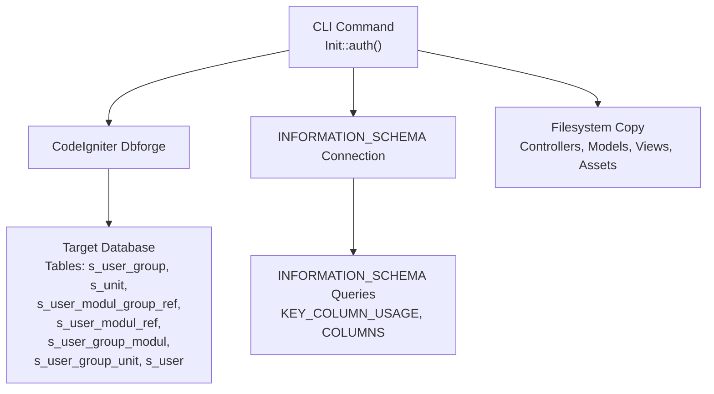
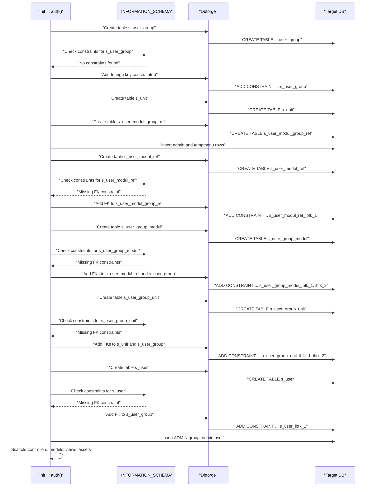
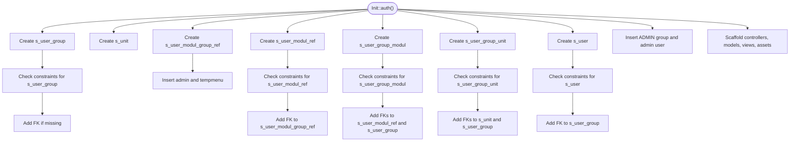

# Database Schema Creation

<cite>
**Referenced Files in This Document**
- [Init.php](file://src/commands/Init.php)
- [Model_Master.php](file://src/application/core/Model_Master.php)
- [Model_modul.php](file://src/application/models/Model_modul.php)
- [Model_pengguna.php](file://src/application/models/Model_pengguna.php)
- [composer.json](file://composer.json)
</cite>

## Table of Contents
1. [Introduction](#introduction)
2. [Project Structure](#project-structure)
3. [Core Components](#core-components)
4. [Architecture Overview](#architecture-overview)
5. [Detailed Component Analysis](#detailed-component-analysis)
6. [Dependency Analysis](#dependency-analysis)
7. [Performance Considerations](#performance-considerations)
8. [Troubleshooting Guide](#troubleshooting-guide)
9. [Conclusion](#conclusion)

## Introduction
This document explains how Modangci creates the authentication-related database schema during the init auth command. It documents all seven tables involved in the authentication system, their fields, data types, constraints, and relationships. It also covers the INFORMATION_SCHEMA queries used to detect schema presence and constraints, the default data insertion process for ADMIN user group, temporary menu references, and default modules, and provides guidance for customizing the schema safely.

## Project Structure
The authentication schema creation is implemented in a CLI command module that uses CodeIgniter’s database forge and a dedicated INFORMATION_SCHEMA connection to inspect constraints and schema metadata. The command scaffolds controllers, models, views, and assets after creating the schema.



**Diagram sources**
- [Init.php:125-478](file://src/commands/Init.php#L125-L478)
- [Init.php:57-108](file://src/commands/Init.php#L57-L108)

**Section sources**
- [Init.php:125-478](file://src/commands/Init.php#L125-L478)
- [composer.json:1-25](file://composer.json#L1-L25)

## Core Components
- Init command: Orchestrates schema creation, default data insertion, and scaffolding of application files.
- INFORMATION_SCHEMA queries: Used to check for existing constraints and schema metadata before altering tables.
- CodeIgniter Dbforge: Creates tables and adds foreign key constraints when missing.
- Model_Master: Provides shared database operations used by authentication models.

**Section sources**
- [Init.php:57-108](file://src/commands/Init.php#L57-L108)
- [Init.php:125-478](file://src/commands/Init.php#L125-L478)
- [Model_Master.php:1-257](file://src/application/core/Model_Master.php#L1-L257)

## Architecture Overview
The init auth process follows a deterministic sequence:
- Establish an INFORMATION_SCHEMA connection.
- Create each table via Dbforge with InnoDB engine.
- Add primary keys and, if missing, foreign key constraints.
- Insert default records for ADMIN group, temporary menu entries, and default modules.
- Scaffold controllers, models, views, and assets.



**Diagram sources**
- [Init.php:125-478](file://src/commands/Init.php#L125-L478)
- [Init.php:57-108](file://src/commands/Init.php#L57-L108)

## Detailed Component Analysis

### Table: s_user_group
- Purpose: Stores user groups (roles).
- Primary key: Composite key on sgroupNama (unique group name).
- Engine: InnoDB.
- Default data: ADMIN group inserted if not exists.

Fields and constraints:
- sgroupNama: VARCHAR(255), PK, NOT NULL, DEFAULT ''.
- sgroupKeterangan: VARCHAR(255), DEFAULT ''.

Default data insertion:
- ADMIN group with description “ADMINISTRATOR” is inserted if not present.

Relationships:
- Referenced by s_user_group_modul (via sgroupmodulSgroupNama).
- Referenced by s_user_group_unit (via sgroupunitSgroupNama).
- Referenced by s_user (via usrSgroupNama).

**Section sources**
- [Init.php:142-165](file://src/commands/Init.php#L142-L165)

### Table: s_unit
- Purpose: Logical units/branches/departments.
- Primary key: unitId (auto-increment INT).
- Engine: InnoDB.

Fields and constraints:
- unitId: INT(11), PK, AUTO_INCREMENT.
- unitKode: VARCHAR(10), DEFAULT ''.
- unitNama: VARCHAR(75), DEFAULT ''.

Relationships:
- Referenced by s_user_group_unit (via sgroupunitUnitId).

**Section sources**
- [Init.php:167-189](file://src/commands/Init.php#L167-L189)

### Table: s_user_modul_group_ref
- Purpose: Module group taxonomy (e.g., admin, tempmenu).
- Primary key: susrmdgroupNama (unique group name).
- Engine: InnoDB.

Fields and constraints:
- susrmdgroupNama: VARCHAR(50), PK, NOT NULL, DEFAULT ''.
- susrmdgroupDisplay: VARCHAR(100), NOT NULL, DEFAULT ''.
- susrmdgroupIcon: VARCHAR(255), NOT NULL, DEFAULT ''.

Default data insertion:
- admin group with display “Administrator” and icon.
- tempmenu group with display “Temporary”.

**Section sources**
- [Init.php:191-229](file://src/commands/Init.php#L191-L229)

### Table: s_user_modul_ref
- Purpose: Available modules and their grouping.
- Primary key: susrmodulNama (unique module name).
- Engine: InnoDB.

Fields and constraints:
- susrmodulNama: VARCHAR(255), PK, NOT NULL, DEFAULT ''.
- susrmodulNamaDisplay: VARCHAR(255), NOT NULL.
- susrmodulSusrmdgroupNama: VARCHAR(50), NOT NULL (FK to s_user_modul_group_ref).
- susrmodulIsLogin: INT(4), DEFAULT 1.
- susrmodulUrut: INT(11), NOT NULL.

Foreign key:
- s_user_modul_ref_ibfk_1: REFERENCES s_user_modul_group_ref(susrmdgroupNama) ON UPDATE CASCADE.

Default data insertion:
- Seven default modules: modulgroup, modul, unit, hakakses, hakaksesmodul, hakaksesunit, pengguna.
- Each assigned to the admin group with incrementing order.

**Section sources**
- [Init.php:231-281](file://src/commands/Init.php#L231-L281)
- [Init.php:57-77](file://src/commands/Init.php#L57-L77)

### Table: s_user_group_modul
- Purpose: Permissions matrix linking groups to modules.
- Primary key: Composite (sgroupmodulSgroupNama, sgroupmodulSusrmodulNama).
- Engine: InnoDB.

Fields and constraints:
- sgroupmodulSgroupNama: VARCHAR(255), PK, FK to s_user_group.
- sgroupmodulSusrmodulNama: VARCHAR(100), PK, FK to s_user_modul_ref.
- sgroupmodulSusrmodulRead: INT(11), DEFAULT 1.

Foreign keys:
- s_user_group_modul_ibfk_1: REFERENCES s_user_modul_ref(susrmodulNama) ON UPDATE CASCADE.
- s_user_group_modul_ibfk_2: REFERENCES s_user_group(sgroupNama) ON DELETE NO ACTION ON UPDATE CASCADE.

Default data insertion:
- ADMIN group granted access to all default modules with read=1.

**Section sources**
- [Init.php:282-322](file://src/commands/Init.php#L282-L322)

### Table: s_user_group_unit
- Purpose: Assigns units to user groups.
- Primary key: Composite (sgroupunitSgroupNama, sgroupunitUnitId).
- Engine: InnoDB.

Fields and constraints:
- sgroupunitSgroupNama: VARCHAR(255), PK, FK to s_user_group.
- sgroupunitUnitId: INT(11), PK, FK to s_unit.
- sgroupunitUnitRead: INT(11), DEFAULT 1.

Foreign keys:
- s_user_group_unit_ibfk_1: REFERENCES s_unit(unitId) ON UPDATE CASCADE.
- s_user_group_unit_ibfk_2: REFERENCES s_user_group(sgroupNama) ON DELETE NO ACTION ON UPDATE CASCADE.

**Section sources**
- [Init.php:323-352](file://src/commands/Init.php#L323-L352)

### Table: s_user
- Purpose: Application users.
- Primary key: usrnusrNama (unique username).
- Engine: InnoDB.

Fields and constraints:
- susrNama: VARCHAR(255), PK, NOT NULL, DEFAULT ''.
- susrPassword: VARCHAR(255), NOT NULL, DEFAULT ''.
- susrSgroupNama: VARCHAR(255), DEFAULT '' (FK to s_user_group).
- susrProfil: VARCHAR(255), DEFAULT ''.
- susrPertanyaan: VARCHAR(255), NOT NULL, DEFAULT ''.
- susrJawaban: VARCHAR(255), NOT NULL, DEFAULT ''.
- susrAvatar: VARCHAR(100), NOT NULL, DEFAULT ''.
- susrRefIndex: VARCHAR(100), NOT NULL, DEFAULT ''.
- susrLastLogin: DATETIME.

Foreign key:
- s_user_ibfk_1: REFERENCES s_user_group(sgroupNama) ON UPDATE CASCADE.

Default data insertion:
- admin user with hashed password, assigned to ADMIN group.

**Section sources**
- [Init.php:354-421](file://src/commands/Init.php#L354-L421)

### Relationship Diagram
```mermaid
erDiagram
S_USER_GROUP {
varchar sgroupNama PK
varchar sgroupKeterangan
}
S_UNIT {
int unitId PK AI
varchar unitKode
varchar unitNama
}
S_USER_MODUL_GROUP_REF {
varchar susrmdgroupNama PK
varchar susrmdgroupDisplay
varchar susrmdgroupIcon
}
S_USER_MODUL_REF {
varchar susrmodulNama PK
varchar susrmodulNamaDisplay
varchar susrmodulSusrmdgroupNama FK
int susrmodulIsLogin
int susrmodulUrut
}
S_USER_GROUP_MODUL {
varchar sgroupmodulSgroupNama PK,FK
varchar sgroupmodulSusrmodulNama PK,FK
int sgroupmodulSusrmodulRead
}
S_USER_GROUP_UNIT {
varchar sgroupunitSgroupNama PK,FK
int sgroupunitUnitId PK,FK
int sgroupunitUnitRead
}
S_USER {
varchar susrNama PK
varchar susrPassword
varchar susrSgroupNama FK
varchar susrProfil
varchar susrPertanyaan
varchar susrJawaban
varchar susrAvatar
varchar susrRefIndex
datetime susrLastLogin
}
S_USER_GROUP ||--o{ S_USER_GROUP_MODUL : "has"
S_USER_MODUL_REF }o--|| S_USER_MODUL_GROUP_REF : "belongs_to"
S_USER_GROUP_MODUL }o--|| S_USER_MODUL_REF : "grants_access_to"
S_USER_GROUP_MODUL }o--|| S_USER_GROUP : "assigns"
S_USER_GROUP_UNIT }o--|| S_USER_GROUP : "assigns"
S_USER_GROUP_UNIT }o--|| S_UNIT : "assigns"
S_USER }o--|| S_USER_GROUP : "belongs_to"
```

**Diagram sources**
- [Init.php:142-421](file://src/commands/Init.php#L142-L421)

## Dependency Analysis
- INFORMATION_SCHEMA queries:
  - KEY_COLUMN_USAGE: Used to check for existing constraints by name and referenced columns.
  - COLUMNS + KEY_COLUMN_USAGE join: Retrieves column metadata and associated foreign key info for a given table.
- Dbforge usage:
  - Creates tables with InnoDB engine and adds primary keys.
  - Conditionally adds foreign key constraints when missing.
- Models:
  - Model_Master provides generic CRUD and menu retrieval functions used by authentication models.
  - Model_modul and Model_pengguna demonstrate joins against the authentication schema.



**Diagram sources**
- [Init.php:57-108](file://src/commands/Init.php#L57-L108)
- [Init.php:125-478](file://src/commands/Init.php#L125-L478)

**Section sources**
- [Init.php:57-108](file://src/commands/Init.php#L57-L108)
- [Model_Master.php:188-257](file://src/application/core/Model_Master.php#L188-L257)
- [Model_modul.php:11-36](file://src/application/models/Model_modul.php#L11-L36)
- [Model_pengguna.php:11-35](file://src/application/models/Model_pengguna.php#L11-L35)

## Performance Considerations
- InnoDB engine is used for all tables, ensuring ACID compliance and foreign key support.
- Constraints are conditionally added only when missing, minimizing redundant operations.
- Default inserts are performed with transactions to maintain consistency.

[No sources needed since this section provides general guidance]

## Troubleshooting Guide
Common issues and resolutions:
- Constraint already exists:
  - Symptom: Error when adding a foreign key constraint with a specific name.
  - Resolution: The command checks for the constraint by name before adding it. No manual action needed.
- Missing INFORMATION_SCHEMA privileges:
  - Symptom: Queries against INFORMATION_SCHEMA fail.
  - Resolution: Ensure the configured database user has SELECT access to the target database and INFORMATION_SCHEMA.
- Foreign key constraint fails due to data type mismatch:
  - Symptom: Error when adding FK; referenced and referencing columns differ in type/constraints.
  - Resolution: Verify that the referencing column matches the referenced column’s type and nullability.
- Duplicate default data:
  - Symptom: Attempting to insert ADMIN or default modules fails due to unique key violation.
  - Resolution: The command checks existence before inserting; re-run the init auth command to confirm defaults are in place.
- Session folder permissions:
  - Symptom: Web server cannot write session files.
  - Resolution: Ensure the sessions directory exists and is writable by the web server.

**Section sources**
- [Init.php:57-108](file://src/commands/Init.php#L57-L108)
- [Init.php:125-478](file://src/commands/Init.php#L125-L478)

## Conclusion
The init auth command systematically creates Modangci’s authentication schema, ensures referential integrity via INFORMATION_SCHEMA checks, and seeds essential default data. The modular design allows for safe customization by extending the schema while preserving relationships. Following the guidance herein will help maintain a robust, compatible, and extensible authentication system.