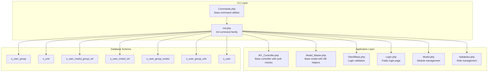
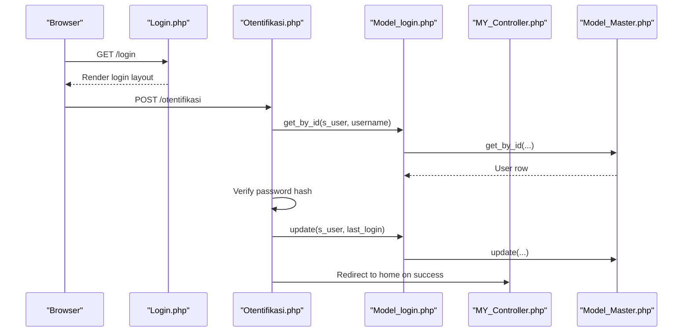
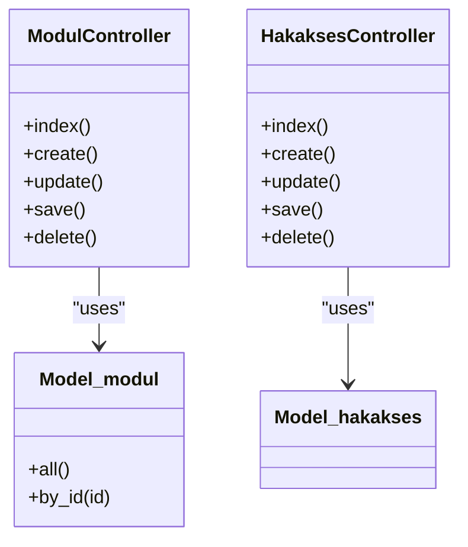
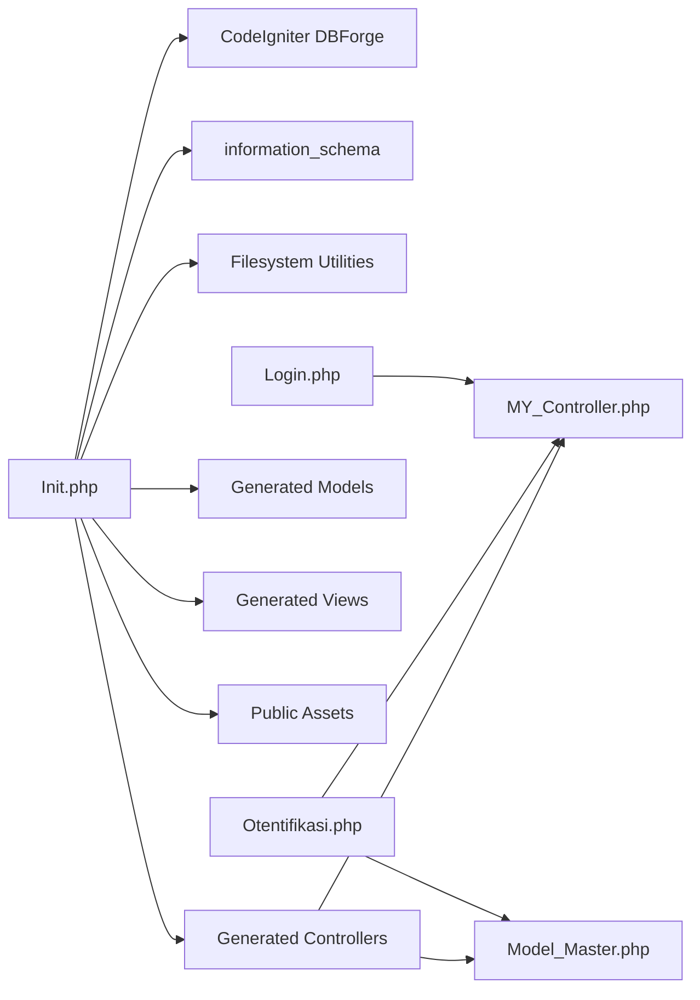

# Init Commands

<cite>
**Referenced Files in This Document**
- [Init.php](file://src/commands/Init.php)
- [Commands.php](file://src/Commands.php)
- [MY_Controller.php](file://src/application/core/MY_Controller.php)
- [Model_Master.php](file://src/application/core/Model_Master.php)
- [Otentifikasi.php](file://src/application/controllers/Otentifikasi.php)
- [Login.php](file://src/application/controllers/Login.php)
- [Model_login.php](file://src/application/models/Model_login.php)
- [Hakakses.php](file://src/application/controllers/Hakakses.php)
- [Modul.php](file://src/application/controllers/Modul.php)
- [Model_modul.php](file://src/application/models/Model_modul.php)
- [Model_hakakses.php](file://src/application/models/Model_hakakses.php)
</cite>

## Table of Contents
1. [Introduction](#introduction)
2. [Project Structure](#project-structure)
3. [Core Components](#core-components)
4. [Architecture Overview](#architecture-overview)
5. [Detailed Component Analysis](#detailed-component-analysis)
6. [Dependency Analysis](#dependency-analysis)
7. [Performance Considerations](#performance-considerations)
8. [Troubleshooting Guide](#troubleshooting-guide)
9. [Conclusion](#conclusion)

## Introduction
This document explains Modangci’s init command family with a focus on authentication scaffolding, database schema creation, UI template integration, and permission setup. It covers the prerequisites, database configuration requirements, user role and permission assignments, and provides step-by-step setup guides. It also documents configuration options, environment-specific settings, and troubleshooting tips for common setup issues. Finally, it outlines how to customize the authentication system and extend the permission framework.

## Project Structure
The init commands live under the commands namespace and build upon CodeIgniter’s core MVC structure. The init auth command creates database tables, seeds default roles and permissions, and copies controllers, models, views, and assets into the application. It also prints configuration steps for autoloading and session storage.

**Diagram sources**
- [Commands.php:1-135](file://src/Commands.php#L1-L135)
- [Init.php:1-478](file://src/commands/Init.php#L1-L478)
- [MY_Controller.php:1-59](file://src/application/core/MY_Controller.php#L1-L59)
- [Model_Master.php:1-257](file://src/application/core/Model_Master.php#L1-L257)
- [Otentifikasi.php:1-64](file://src/application/controllers/Otentifikasi.php#L1-L64)
- [Login.php:1-18](file://src/application/controllers/Login.php#L1-L18)
- [Modul.php:1-122](file://src/application/controllers/Modul.php#L1-L122)
- [Hakakses.php:1-109](file://src/application/controllers/Hakakses.php#L1-L109)

**Section sources**
- [Commands.php:1-135](file://src/Commands.php#L1-L135)
- [Init.php:1-478](file://src/commands/Init.php#L1-L478)

## Core Components
- Init command base: Provides filesystem copy, recursive copy, folder and file creation utilities, and informational messaging.
- Init auth: Creates and seeds the authentication and permission schema, sets up sessions, and integrates UI templates and assets.
- Base controller and models: Enforce authentication, compute menus, and enforce module-level permissions.
- Login and authentication controllers: Handle login validation and session creation.

Key responsibilities:
- Schema creation: s_user_group, s_unit, s_user_modul_group_ref, s_user_modul_ref, s_user_group_modul, s_user_group_unit, s_user.
- Seed data: ADMIN group, admin user, default modules, and default module-group entries.
- UI integration: Copies controllers, models, views, and assets into the application.
- Configuration hints: Autoload libraries/helpers and session path.

**Section sources**
- [Init.php:125-478](file://src/commands/Init.php#L125-L478)
- [MY_Controller.php:13-51](file://src/application/core/MY_Controller.php#L13-L51)
- [Model_Master.php:188-257](file://src/application/core/Model_Master.php#L188-L257)
- [Otentifikasi.php:12-62](file://src/application/controllers/Otentifikasi.php#L12-L62)
- [Login.php:6-16](file://src/application/controllers/Login.php#L6-L16)

## Architecture Overview
The init auth command orchestrates:
- Database schema creation via CodeIgniter’s Forge.
- Constraint enforcement and foreign keys.
- Seeding default roles, units, module groups, modules, and permissions.
- Seeding an admin user with hashed password.
- Copying MVC scaffolding and assets.
- Printing configuration steps for autoloading and session storage.

```mermaid
sequenceDiagram
participant CLI as "CLI"
participant Init as "Init.auth()"
participant Forge as "CodeIgniter DBForge"
participant IS as "information_schema"
participant DB as "Application DB"
CLI->>Init : Run "init auth"
Init->>Forge : Create s_user_group
Init->>DB : Insert ADMIN group
Init->>Forge : Create s_unit
Init->>Forge : Create s_user_modul_group_ref
Init->>DB : Insert admin/tempmenu module groups
Init->>Forge : Create s_user_modul_ref
Init->>IS : Check foreign key constraint
Init->>Forge : Add foreign key if missing
Init->>DB : Seed default modules
Init->>Forge : Create s_user_group_modul
Init->>IS : Check composite FKs
Init->>Forge : Add FKs if missing
Init->>DB : Assign default modules to ADMIN
Init->>Forge : Create s_user_group_unit
Init->>Forge : Create s_user
Init->>IS : Check FK
Init->>Forge : Add FK if missing
Init->>DB : Insert admin user (hashed password)
Init->>Init : Create sessions folder
Init->>Init : Copy controllers, models, views, assets
Init-->>CLI : Print autoload and config hints
```

**Diagram sources**
- [Init.php:125-478](file://src/commands/Init.php#L125-L478)

## Detailed Component Analysis

### Init Auth: Authentication and Permission Scaffolding
- Prerequisites
  - Active CodeIgniter application with database configured.
  - Write permissions to application and public directories.
- Database configuration requirements
  - Uses current database connection settings to initialize information_schema connection for introspection.
  - Creates tables with InnoDB engine and enforces foreign keys via DBForge.
- User role setup
  - s_user_group: ADMIN group seeded.
  - s_user: admin user created with hashed password.
- Permission assignment
  - s_user_modul_group_ref: admin and tempmenu groups.
  - s_user_modul_ref: default modules (modulgroup, modul, unit, hakakses, hakaksesmodul, hakaksesunit, pengguna).
  - s_user_group_modul: grants ADMIN READ access to all default modules.
  - s_user_group_unit: links units to groups (initially empty; populated via s_unit).
  - s_user: references s_user_group via foreign key.
- UI template integration
  - Copies controllers, models, views, and assets into the application.
  - Creates sessions directory for session storage.
- Configuration hints
  - Autoload libraries and helpers.
  - Set base_url and sess_save_path.

Step-by-step setup guide
1. Ensure database credentials are correct in CodeIgniter config.
2. Run the init auth command to scaffold authentication and permissions.
3. Review printed autoload and config hints and apply them.
4. Verify tables were created and seed data inserted.
5. Access the login page and log in with the admin account.

Customization and extension
- To add new module groups, insert into s_user_modul_group_ref and reference in s_user_modul_ref.
- To add new modules, insert into s_user_modul_ref and grant access in s_user_group_modul.
- To add new roles, insert into s_user_group and assign module permissions in s_user_group_modul.

**Section sources**
- [Init.php:125-478](file://src/commands/Init.php#L125-L478)
- [Init.php:57-108](file://src/commands/Init.php#L57-L108)
- [Init.php:31-41](file://src/commands/Init.php#L31-L41)

### Authentication Flow and Authorization
- Login controller renders the login view and redirects if already logged in.
- Authentication controller validates credentials against s_user, verifies password hash, updates last login, and starts a session.
- Base controller enforces authentication and computes menu and permission checks per module.

**Diagram sources**
- [Login.php:13-16](file://src/application/controllers/Login.php#L13-L16)
- [Otentifikasi.php:35-62](file://src/application/controllers/Otentifikasi.php#L35-L62)
- [Model_login.php:1-9](file://src/application/models/Model_login.php#L1-L9)
- [MY_Controller.php:16-18](file://src/application/core/MY_Controller.php#L16-L18)
- [Model_Master.php:9-21](file://src/application/core/Model_Master.php#L9-L21)

**Section sources**
- [Login.php:6-16](file://src/application/controllers/Login.php#L6-L16)
- [Otentifikasi.php:12-62](file://src/application/controllers/Otentifikasi.php#L12-L62)
- [MY_Controller.php:13-51](file://src/application/core/MY_Controller.php#L13-L51)
- [Model_Master.php:188-257](file://src/application/core/Model_Master.php#L188-L257)

### Module and Role Management Controllers
- Module controller manages s_user_modul_ref and s_user_modul_group_ref, including ordering and grouping.
- Role controller manages s_user_group and integrates with s_user_group_modul for permission assignment.

**Diagram sources**
- [Modul.php:1-122](file://src/application/controllers/Modul.php#L1-L122)
- [Hakakses.php:1-109](file://src/application/controllers/Hakakses.php#L1-L109)
- [Model_modul.php:1-37](file://src/application/models/Model_modul.php#L1-L37)
- [Model_hakakses.php:1-11](file://src/application/models/Model_hakakses.php#L1-L11)

**Section sources**
- [Modul.php:59-120](file://src/application/controllers/Modul.php#L59-L120)
- [Hakakses.php:55-107](file://src/application/controllers/Hakakses.php#L55-L107)
- [Model_modul.php:11-35](file://src/application/models/Model_modul.php#L11-L35)
- [Model_hakakses.php:1-11](file://src/application/models/Model_hakakses.php#L1-L11)

### Additional Init Commands
Beyond auth, the init family supports generating CRUD scaffolding:
- Controller scaffolding: reads table schema and generates a controller with create/update/delete/save actions.
- Model scaffolding: generates a model with all()/by_id() methods and joins for foreign keys.
- View scaffolding: generates index and form views with dynamic inputs and selects for foreign keys.
- CRUD scaffolding: composes controller, model, and view generation and registers a temporary module with default permissions.

These commands rely on information_schema introspection to derive primary and foreign keys, and they generate code tailored to the target table.

**Section sources**
- [Init.php:480-917](file://src/commands/Init.php#L480-L917)
- [Init.php:57-108](file://src/commands/Init.php#L57-L108)

## Dependency Analysis
- Init depends on CodeIgniter’s database and forge capabilities.
- It uses information_schema to validate and add foreign key constraints.
- Generated controllers depend on MY_Controller and Model_Master for shared behavior.
- Authentication depends on session and encryption libraries.

**Diagram sources**
- [Init.php:125-478](file://src/commands/Init.php#L125-L478)
- [MY_Controller.php:1-59](file://src/application/core/MY_Controller.php#L1-L59)
- [Model_Master.php:1-257](file://src/application/core/Model_Master.php#L1-L257)
- [Otentifikasi.php:1-64](file://src/application/controllers/Otentifikasi.php#L1-L64)
- [Login.php:1-18](file://src/application/controllers/Login.php#L1-L18)

**Section sources**
- [Init.php:125-478](file://src/commands/Init.php#L125-L478)
- [MY_Controller.php:13-51](file://src/application/core/MY_Controller.php#L13-L51)
- [Model_Master.php:188-257](file://src/application/core/Model_Master.php#L188-L257)

## Performance Considerations
- Transactional writes: Model_Master wraps inserts/updates/deletes in transactions to maintain consistency.
- Information_schema queries: Used to validate constraints; ensure database credentials permit access to information_schema.
- Session storage: Using filesystem sessions requires writable apppath/sessions; ensure appropriate permissions and disk space.
- Autoload optimization: Limit autoloaded libraries/helpers to reduce boot overhead.

## Troubleshooting Guide
Common issues and resolutions
- Cannot connect to database
  - Verify database credentials in CodeIgniter config.
  - Ensure the application can reach the database server.
- information_schema access denied
  - Grant USAGE privilege on information_schema to the application user.
- Foreign key constraint errors during init
  - Confirm that referenced tables exist and have compatible definitions.
  - Re-run init after correcting schema mismatches.
- Login fails
  - Confirm s_user contains the admin record with a valid hashed password.
  - Check session library and sess_save_path configuration.
- Menu or permission not visible
  - Ensure s_user_group_modul grants READ permission for the role to the module.
  - Verify s_user references a valid group and that the module is enabled.

Environment-specific settings
- Autoload libraries and helpers as suggested by init auth.
- Set base_url to match your environment.
- Configure sess_save_path to a writable directory.

**Section sources**
- [Init.php:125-478](file://src/commands/Init.php#L125-L478)
- [Otentifikasi.php:35-62](file://src/application/controllers/Otentifikasi.php#L35-L62)
- [MY_Controller.php:16-18](file://src/application/core/MY_Controller.php#L16-L18)
- [Model_Master.php:56-130](file://src/application/core/Model_Master.php#L56-L130)

## Conclusion
The init command family in Modangci provides a complete, repeatable setup for authentication, permissions, and UI scaffolding. By following the step-by-step guides, applying the printed configuration hints, and understanding the underlying schema and controllers, you can quickly bootstrap a secure, role-aware application. Extending the system involves adding module groups and modules, assigning permissions via s_user_group_modul, and integrating new controllers/models/views with the existing base classes.