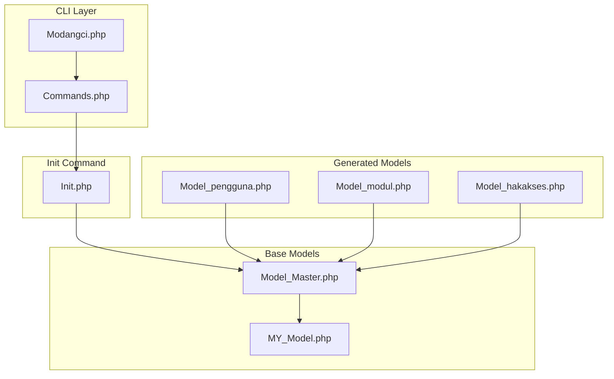
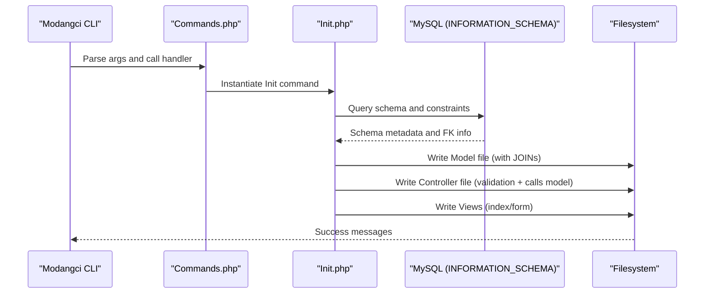
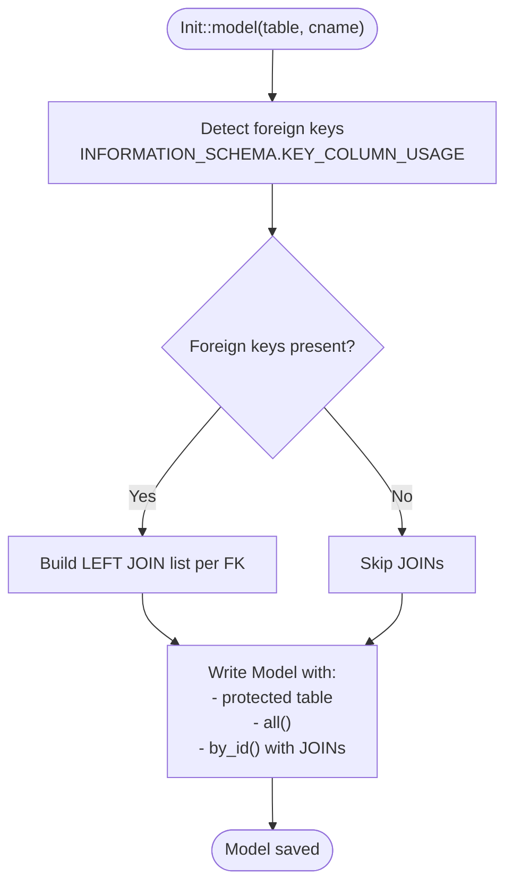
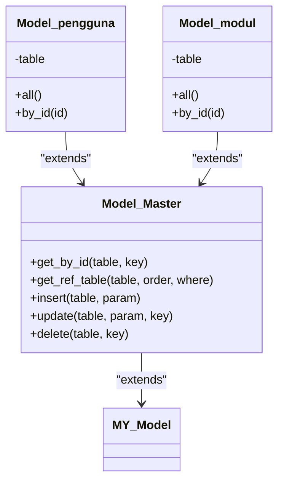
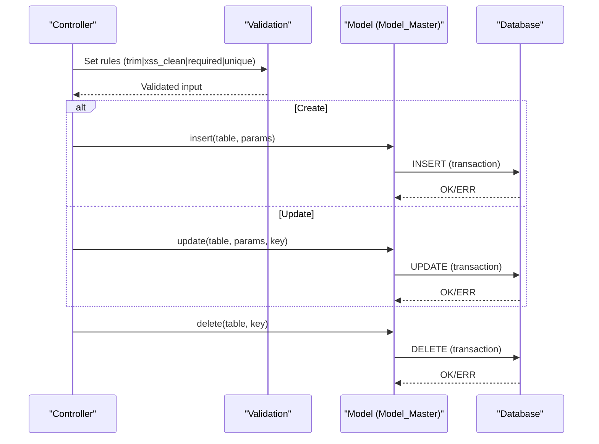
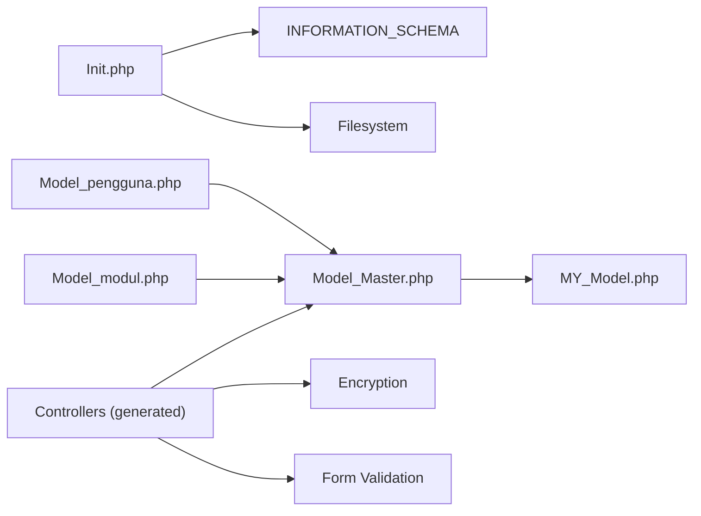

# Model Generation

<cite>
**Referenced Files in This Document**
- [Init.php](file://src/commands/Init.php)
- [Model_Master.php](file://src/application/core/Model_Master.php)
- [MY_Model.php](file://src/application/core/MY_Model.php)
- [MY_Controller.php](file://src/application/core/MY_Controller.php)
- [Modangci.php](file://src/Modangci.php)
- [Commands.php](file://src/Commands.php)
- [Model_pengguna.php](file://src/application/models/Model_pengguna.php)
- [Model_modul.php](file://src/application/models/Model_modul.php)
- [Model_hakakses.php](file://src/application/models/Model_hakakses.php)
</cite>

## Table of Contents
1. [Introduction](#introduction)
2. [Project Structure](#project-structure)
3. [Core Components](#core-components)
4. [Architecture Overview](#architecture-overview)
5. [Detailed Component Analysis](#detailed-component-analysis)
6. [Dependency Analysis](#dependency-analysis)
7. [Performance Considerations](#performance-considerations)
8. [Troubleshooting Guide](#troubleshooting-guide)
9. [Conclusion](#conclusion)

## Introduction
This document explains Modangci’s model generation capabilities during init commands. It focuses on how the system automatically creates CRUD models from database tables, detects foreign keys, generates JOIN clauses, and integrates with the Model_Master base class. It also covers naming conventions, relationship handling, customization options, and query optimization techniques. Examples demonstrate extending the base model and integrating form validation and data sanitization.

## Project Structure
Modangci organizes scaffolding logic under a CLI command system:
- Commands orchestrator and dispatch: [Modangci.php](file://src/Modangci.php), [Commands.php](file://src/Commands.php)
- Init command implementation: [Init.php](file://src/commands/Init.php)
- Base model layer: [Model_Master.php](file://src/application/core/Model_Master.php), [MY_Model.php](file://src/application/core/MY_Model.php)
- Example generated models: [Model_pengguna.php](file://src/application/models/Model_pengguna.php), [Model_modul.php](file://src/application/models/Model_modul.php), [Model_hakakses.php](file://src/application/models/Model_hakakses.php)
- Controller base: [MY_Controller.php](file://src/application/core/MY_Controller.php)

**Diagram sources**
- [Modangci.php:1-60](file://src/Modangci.php#L1-L60)
- [Commands.php:1-135](file://src/Commands.php#L1-L135)
- [Init.php:1-917](file://src/commands/Init.php#L1-L917)
- [MY_Model.php:1-21](file://src/application/core/MY_Model.php#L1-L21)
- [Model_Master.php:1-257](file://src/application/core/Model_Master.php#L1-L257)
- [Model_pengguna.php:1-36](file://src/application/models/Model_pengguna.php#L1-L36)
- [Model_modul.php:1-37](file://src/application/models/Model_modul.php#L1-L37)
- [Model_hakakses.php:1-11](file://src/application/models/Model_hakakses.php#L1-L11)

**Section sources**
- [Modangci.php:1-60](file://src/Modangci.php#L1-L60)
- [Commands.php:1-135](file://src/Commands.php#L1-L135)
- [Init.php:1-917](file://src/commands/Init.php#L1-L917)
- [MY_Model.php:1-21](file://src/application/core/MY_Model.php#L1-L21)
- [Model_Master.php:1-257](file://src/application/core/Model_Master.php#L1-L257)
- [Model_pengguna.php:1-36](file://src/application/models/Model_pengguna.php#L1-L36)
- [Model_modul.php:1-37](file://src/application/models/Model_modul.php#L1-L37)
- [Model_hakakses.php:1-11](file://src/application/models/Model_hakakses.php#L1-L11)

## Core Components
- Init command: Reads database schema via INFORMATION_SCHEMA, detects primary and foreign keys, and generates:
  - Models with automatic JOIN clauses for foreign keys
  - Controllers with form validation and sanitization
  - Views with dynamic forms and tables
- Model_Master base class: Provides reusable CRUD operations and transactional wrappers around CodeIgniter’s Active Record.

Key responsibilities:
- Foreign key detection and JOIN generation in model methods
- Controller-side form validation and XSS cleaning
- Integration with MY_Controller for menu and permission checks
- Transactional insert/update/delete with optional debug logging

**Section sources**
- [Init.php:57-108](file://src/commands/Init.php#L57-L108)
- [Init.php:642-701](file://src/commands/Init.php#L642-L701)
- [Init.php:480-640](file://src/commands/Init.php#L480-L640)
- [Model_Master.php:9-186](file://src/application/core/Model_Master.php#L9-L186)

## Architecture Overview
The init workflow connects CLI parsing, database introspection, and code generation. Generated models extend Model_Master, inheriting robust CRUD and transactional behavior.

**Diagram sources**
- [Modangci.php:39-53](file://src/Modangci.php#L39-L53)
- [Commands.php:43-53](file://src/Commands.php#L43-L53)
- [Init.php:57-108](file://src/commands/Init.php#L57-L108)
- [Init.php:642-701](file://src/commands/Init.php#L642-L701)
- [Init.php:480-640](file://src/commands/Init.php#L480-L640)

## Detailed Component Analysis

### Automatic Model Creation and JOIN Generation
- Foreign key detection: Queries INFORMATION_SCHEMA.KEY_COLUMN_USAGE to find referenced tables and columns.
- JOIN clause generation: For each foreign key, the generator appends a LEFT JOIN in the model’s all() and by_id() methods.
- Model structure:
  - Protected table property set to the target table
  - Methods: all(), by_id()
  - Extends Model_Master for transactional operations

**Diagram sources**
- [Init.php:655-701](file://src/commands/Init.php#L655-L701)
- [Init.php:57-108](file://src/commands/Init.php#L57-L108)

**Section sources**
- [Init.php:655-701](file://src/commands/Init.php#L655-L701)
- [Model_pengguna.php:1-36](file://src/application/models/Model_pengguna.php#L1-L36)
- [Model_modul.php:1-37](file://src/application/models/Model_modul.php#L1-L37)

### Generated Model Methods
- all(): Selects all columns from the table and applies generated JOINs, returning a result set or false.
- by_id(id): Same as all() but filters by the provided key and returns a single row or false.
- Integration: These methods rely on Model_Master for database access and transaction handling.

**Diagram sources**
- [MY_Model.php:1-21](file://src/application/core/MY_Model.php#L1-L21)
- [Model_Master.php:1-257](file://src/application/core/Model_Master.php#L1-L257)
- [Model_pengguna.php:1-36](file://src/application/models/Model_pengguna.php#L1-L36)
- [Model_modul.php:1-37](file://src/application/models/Model_modul.php#L1-L37)

**Section sources**
- [Model_Master.php:9-186](file://src/application/core/Model_Master.php#L9-L186)
- [Model_pengguna.php:11-35](file://src/application/models/Model_pengguna.php#L11-L35)
- [Model_modul.php:11-36](file://src/application/models/Model_modul.php#L11-L36)

### Controller Integration and Validation
- The init controller generator:
  - Detects primary and foreign keys
  - Builds form validation rules with trim/xss_clean and required flags
  - Adds uniqueness validation for primary keys when inserting
  - Loads referenced tables for dropdowns in forms
  - Calls model methods: insert(), update(), delete(), or fallbacks get_ref_table() and get_by_id() when no foreign keys are present

**Diagram sources**
- [Init.php:480-640](file://src/commands/Init.php#L480-L640)
- [Model_Master.php:56-186](file://src/application/core/Model_Master.php#L56-L186)

**Section sources**
- [Init.php:480-640](file://src/commands/Init.php#L480-L640)
- [Model_Master.php:56-186](file://src/application/core/Model_Master.php#L56-L186)

### Model Naming Conventions and Relationship Handling
- Naming:
  - Model class: Model_[lowercase controller name]
  - Table name: Lowercased input passed to init model
- Relationship handling:
  - Foreign keys drive JOIN clauses in generated models
  - When no foreign keys are detected, controllers fall back to generic getters from Model_Master

**Section sources**
- [Init.php:642-701](file://src/commands/Init.php#L642-L701)
- [Init.php:480-525](file://src/commands/Init.php#L480-L525)

### Customization Examples
- Extend Model_Master:
  - Add custom queries or computed fields in the generated model
  - Override or augment existing methods while keeping transactional behavior
- Add custom query methods:
  - Define additional methods in the model that reuse Model_Master’s db connection and transaction wrappers
- Extend base model functionality:
  - Introduce shared logic in Model_Master for all models (e.g., soft-delete helpers, audit fields)

Note: The examples below reference file locations rather than code content.

- Extend a generated model: [Model_pengguna.php:1-36](file://src/application/models/Model_pengguna.php#L1-L36)
- Base model for CRUD and transactions: [Model_Master.php:1-257](file://src/application/core/Model_Master.php#L1-L257)

**Section sources**
- [Model_pengguna.php:1-36](file://src/application/models/Model_pengguna.php#L1-L36)
- [Model_Master.php:1-257](file://src/application/core/Model_Master.php#L1-L257)

### Query Optimization Techniques
- Prefer selective columns: Generated all() selects *, which can be optimized by overriding with explicit columns in custom models.
- Index foreign keys: Ensure referenced columns are indexed to speed up JOINs.
- Limit result sets: Use ordering and pagination in custom methods for large datasets.
- Batch operations: Use insert_batch() and update_batch() from Model_Master for bulk updates.

**Section sources**
- [Model_Master.php:71-130](file://src/application/core/Model_Master.php#L71-L130)

## Dependency Analysis
- Init depends on:
  - CodeIgniter database and dbforge
  - INFORMATION_SCHEMA for introspection
  - Filesystem helpers for writing generated files
- Generated models depend on:
  - Model_Master for CRUD and transactions
  - MY_Model for base CI_Model extension
- Controllers depend on:
  - MY_Controller for session and menu logic
  - Encryption library for safe URLs
  - Form validation for sanitization

**Diagram sources**
- [Init.php:13-29](file://src/commands/Init.php#L13-L29)
- [Init.php:57-108](file://src/commands/Init.php#L57-L108)
- [Model_pengguna.php:1-36](file://src/application/models/Model_pengguna.php#L1-L36)
- [Model_modul.php:1-37](file://src/application/models/Model_modul.php#L1-L37)
- [Model_Master.php:1-257](file://src/application/core/Model_Master.php#L1-L257)
- [MY_Model.php:1-21](file://src/application/core/MY_Model.php#L1-L21)

**Section sources**
- [Init.php:13-29](file://src/commands/Init.php#L13-L29)
- [Init.php:57-108](file://src/commands/Init.php#L57-L108)
- [Model_pengguna.php:1-36](file://src/application/models/Model_pengguna.php#L1-L36)
- [Model_modul.php:1-37](file://src/application/models/Model_modul.php#L1-L37)
- [Model_Master.php:1-257](file://src/application/core/Model_Master.php#L1-L257)
- [MY_Model.php:1-21](file://src/application/core/MY_Model.php#L1-L21)

## Performance Considerations
- Use explicit column selection instead of SELECT * in production models to reduce I/O.
- Add database indexes on foreign key columns and frequently filtered columns.
- Leverage batch operations for bulk inserts/updates.
- Avoid unnecessary JOINs when not required by the view/controller logic.

[No sources needed since this section provides general guidance]

## Troubleshooting Guide
- Model not generated:
  - Verify table name and permissions to INFORMATION_SCHEMA
  - Check filesystem write permissions for application folders
- Foreign keys missing in JOINs:
  - Confirm referential constraints exist in MySQL
  - Ensure the database user has access to INFORMATION_SCHEMA
- Transaction failures:
  - Review returned boolean from model methods and inspect database errors
  - Enable debug logging if available to capture last queries

**Section sources**
- [Init.php:57-108](file://src/commands/Init.php#L57-L108)
- [Model_Master.php:56-186](file://src/application/core/Model_Master.php#L56-L186)

## Conclusion
Modangci’s init command automates CRUD model generation by analyzing database schemas, detecting foreign keys, and generating JOIN-enabled models that extend Model_Master. Together with controller scaffolding and validation, it accelerates development while preserving transactional safety and extensibility. Developers can tailor generated models and base classes to meet performance and business requirements.