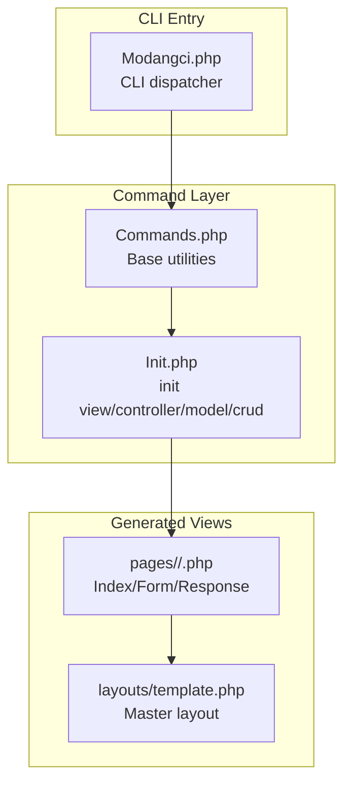
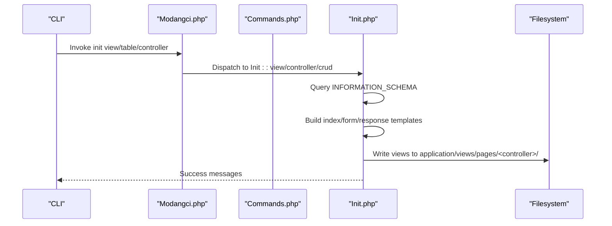
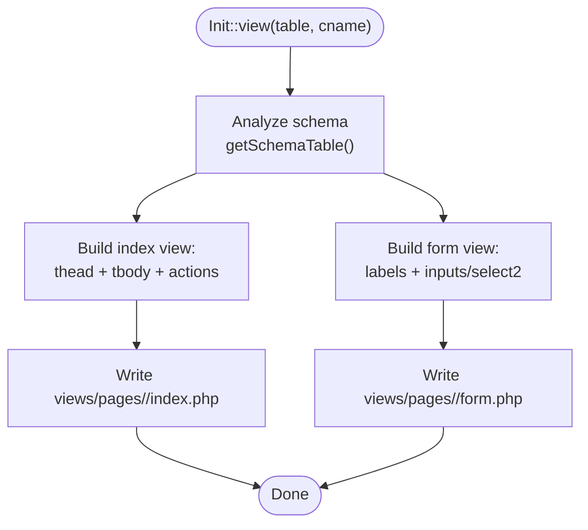
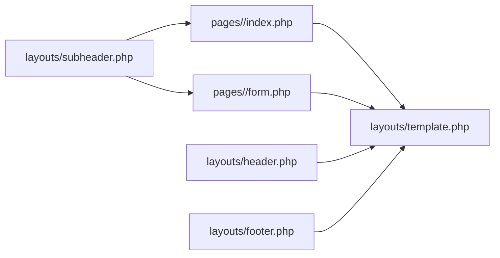
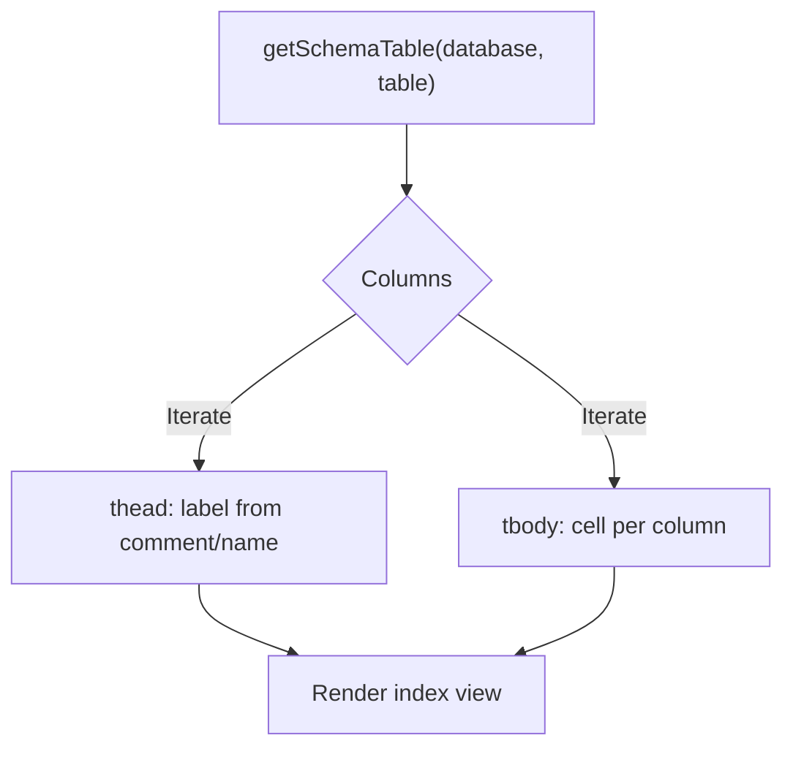
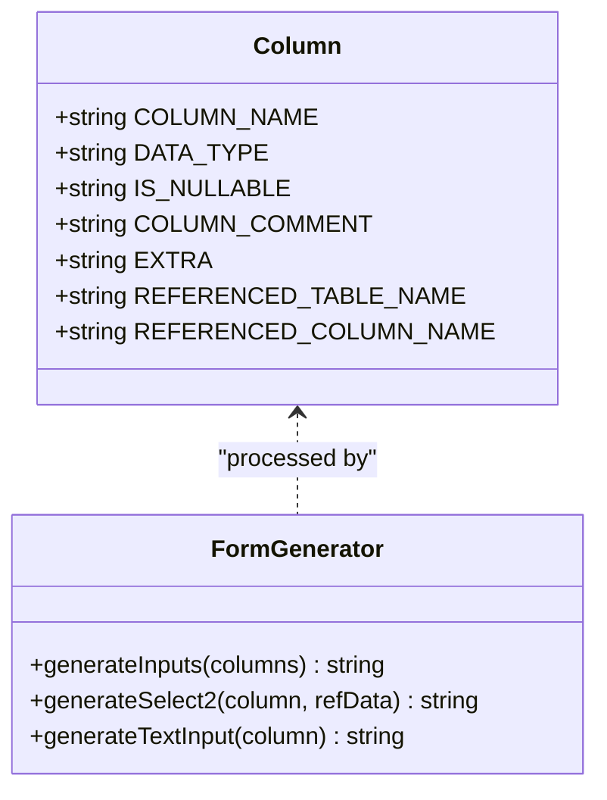
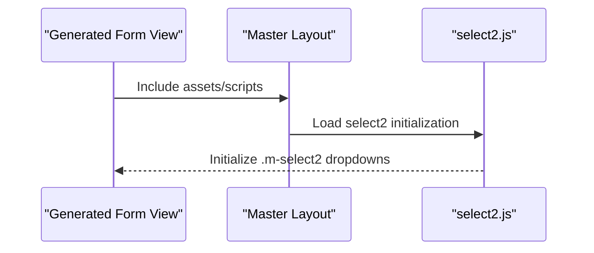
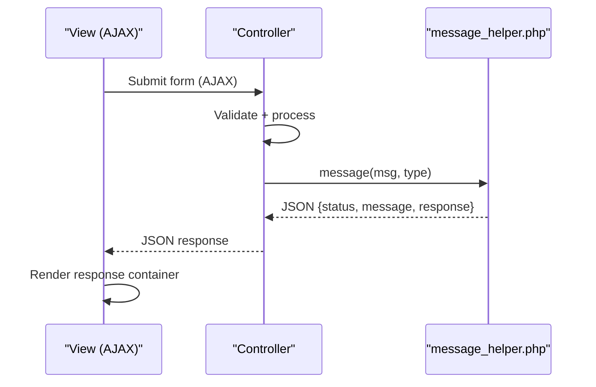
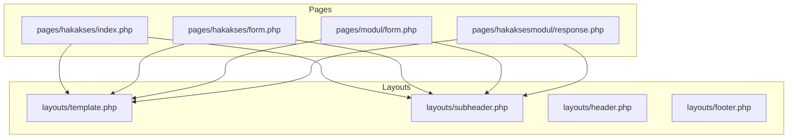
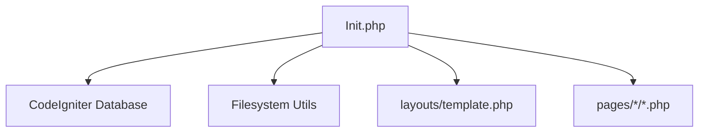

# View Generation

<cite>
**Referenced Files in This Document**
- [Init.php](file://src/commands/Init.php)
- [Commands.php](file://src/Commands.php)
- [Modangci.php](file://src/Modangci.php)
- [template.php](file://src/application/views/layouts/template.php)
- [index.php](file://src/application/views/pages/hakakses/index.php)
- [form.php](file://src/application/views/pages/hakakses/form.php)
- [index.php](file://src/application/views/pages/hakaksesmodul/index.php)
- [response.php](file://src/application/views/pages/hakaksesmodul/response.php)
- [index.php](file://src/application/views/pages/hakaksesunit/index.php)
- [index.php](file://src/application/views/pages/modul/index.php)
- [form.php](file://src/application/views/pages/modul/form.php)
- [form.php](file://src/application/views/pages/pengguna/form.php)
- [message_helper.php](file://src/application/helpers/message_helper.php)
- [select2.js](file://src/public/assets/js/pages/crud/forms/widgets/select2.js)
</cite>

## Table of Contents
1. [Introduction](#introduction)
2. [Project Structure](#project-structure)
3. [Core Components](#core-components)
4. [Architecture Overview](#architecture-overview)
5. [Detailed Component Analysis](#detailed-component-analysis)
6. [Dependency Analysis](#dependency-analysis)
7. [Performance Considerations](#performance-considerations)
8. [Troubleshooting Guide](#troubleshooting-guide)
9. [Conclusion](#conclusion)

## Introduction
This document explains Modangci’s view generation functionality during init commands. It focuses on the automatic Bootstrap-based view scaffolding for CRUD operations, including index, form, and response views. It details how dynamic table headers and bodies are generated from database schema analysis, how form fields are produced with appropriate input types for different data types and foreign keys, and how select2 dropdowns are integrated for foreign key relationships. It also covers the responsive Bootstrap layout structure, view folder organization, partial template integration, AJAX response handling, and customization options for generated views.

## Project Structure
Modangci organizes views under application/views/pages/<controller>/ with shared layout fragments under application/views/layouts/. The init command generates:
- Index view: a responsive table listing records with action controls
- Form view: a structured form with appropriate input types and select2 for foreign keys
- Response view: a specialized view for AJAX-driven operations (e.g., permission matrices)

**Diagram sources**
- [Modangci.php:1-60](file://src/Modangci.php#L1-L60)
- [Commands.php:1-135](file://src/Commands.php#L1-L135)
- [Init.php:1-917](file://src/commands/Init.php#L1-L917)
- [template.php:1-180](file://src/application/views/layouts/template.php#L1-L180)

**Section sources**
- [Modangci.php:1-60](file://src/Modangci.php#L1-L60)
- [Commands.php:1-135](file://src/Commands.php#L1-L135)
- [Init.php:1-917](file://src/commands/Init.php#L1-L917)
- [template.php:1-180](file://src/application/views/layouts/template.php#L1-L180)

## Core Components
- CLI dispatcher: routes CLI invocations to the appropriate command class and method
- Base command utilities: folder/file creation, recursive copying, messaging
- Init command: performs database schema introspection and generates views, controllers, models, and assets

Key responsibilities:
- Schema analysis via INFORMATION_SCHEMA to derive columns, primary keys, and foreign keys
- Dynamic generation of index table headers and rows
- Dynamic generation of form fields with appropriate input types
- Foreign key-aware form fields using select2 dropdowns
- Bootstrap-based layout integration via shared template and partials
- AJAX response handling via a standardized message helper

**Section sources**
- [Modangci.php:1-60](file://src/Modangci.php#L1-L60)
- [Commands.php:1-135](file://src/Commands.php#L1-L135)
- [Init.php:57-123](file://src/commands/Init.php#L57-L123)
- [Init.php:703-917](file://src/commands/Init.php#L703-L917)

## Architecture Overview
The init command orchestrates view generation by:
- Analyzing the target table’s schema
- Building index and form templates dynamically
- Writing files into application/views/pages/<controller>/
- Integrating with the shared master layout and partials

**Diagram sources**
- [Modangci.php:19-53](file://src/Modangci.php#L19-L53)
- [Commands.php:20-92](file://src/Commands.php#L20-L92)
- [Init.php:703-917](file://src/commands/Init.php#L703-L917)

## Detailed Component Analysis

### View Generation Engine (Init::view)
The view generator:
- Creates a views/pages/<controller> directory
- Builds an index view with a responsive table and action buttons
- Builds a form view with labeled inputs and select2 dropdowns for foreign keys
- Uses a hidden “old” primary key field to distinguish create vs. update flows
- Integrates with the shared master layout and partials

Dynamic generation highlights:
- Table header and body construction from schema inspection
- Conditional rendering for foreign key columns using select2
- Bootstrap grid and portlet structure for responsive layout
- Partial inclusion for subheader and master layout

**Diagram sources**
- [Init.php:703-917](file://src/commands/Init.php#L703-L917)
- [Init.php:79-108](file://src/commands/Init.php#L79-L108)

**Section sources**
- [Init.php:703-917](file://src/commands/Init.php#L703-L917)
- [Init.php:79-108](file://src/commands/Init.php#L79-L108)

### Bootstrap Layout Integration
Generated views embed into the shared master layout and partials:
- Master layout: assets, scripts, and page injection point
- Partials: header, subheader, sidebar, footer included per view
- Portlet structure: consistent card-like containers with head/body/foot sections

**Diagram sources**
- [template.php:95-100](file://src/application/views/layouts/template.php#L95-L100)
- [index.php:1-31](file://src/application/views/pages/hakakses/index.php#L1-L31)
- [form.php:1-52](file://src/application/views/pages/hakakses/form.php#L1-L52)

**Section sources**
- [template.php:1-180](file://src/application/views/layouts/template.php#L1-L180)
- [index.php:1-31](file://src/application/views/pages/hakakses/index.php#L1-L31)
- [form.php:1-52](file://src/application/views/pages/hakakses/form.php#L1-L52)

### Dynamic Table Header and Body Generation
The index view builds:
- Headers from column metadata (skipping auto-increment fields)
- Rows iterating over dataset with encryption-based action URLs
- Action buttons for update and delete

**Diagram sources**
- [Init.php:79-108](file://src/commands/Init.php#L79-L108)
- [Init.php:718-842](file://src/commands/Init.php#L718-L842)

**Section sources**
- [Init.php:718-842](file://src/commands/Init.php#L718-L842)

### Form Field Generation and Input Types
The form view generates:
- Text inputs for non-key, non-auto fields
- Select2 dropdowns for foreign key columns, populated from referenced tables
- Hidden “old” primary key field for update detection
- Proper labels derived from comments or column names

**Diagram sources**
- [Init.php:717-751](file://src/commands/Init.php#L717-L751)

**Section sources**
- [Init.php:717-751](file://src/commands/Init.php#L717-L751)

### Integration with Select2 Dropdowns
Select2 is used for foreign key fields:
- Generated select elements include the m-select2 class
- The select2 initialization script is loaded via the master layout
- Options are populated from the referenced table’s primary key and display fields

**Diagram sources**
- [form.php:33-40](file://src/application/views/pages/pengguna/form.php#L33-L40)
- [select2.js:176-187](file://src/public/assets/js/pages/crud/forms/widgets/select2.js#L176-L187)
- [template.php:157-176](file://src/application/views/layouts/template.php#L157-L176)

**Section sources**
- [form.php:33-40](file://src/application/views/pages/pengguna/form.php#L33-L40)
- [select2.js:176-187](file://src/public/assets/js/pages/crud/forms/widgets/select2.js#L176-L187)
- [template.php:157-176](file://src/application/views/layouts/template.php#L157-L176)

### AJAX Response Handling in Generated Views
Generated views include a response container and rely on a standardized message helper:
- The message helper returns JSON with status, message, and HTML alert
- Controllers set IS_AJAX flag and return JSON for AJAX requests
- Views render the alert inside the response container

**Diagram sources**
- [Init.php:588-615](file://src/commands/Init.php#L588-L615)
- [message_helper.php:6-20](file://src/application/helpers/message_helper.php#L6-L20)

**Section sources**
- [Init.php:588-615](file://src/commands/Init.php#L588-L615)
- [message_helper.php:6-20](file://src/application/helpers/message_helper.php#L6-L20)

### View Folder Organization and Partial Templates
- Folder structure: application/views/pages/<controller>/index.php, form.php
- Partial templates: subheader included in each view; master layout injects header, footer, sidebar
- Assets: Bootstrap, Metronic styles/scripts loaded centrally

**Diagram sources**
- [index.php:1-31](file://src/application/views/pages/hakakses/index.php#L1-L31)
- [form.php:1-52](file://src/application/views/pages/hakakses/form.php#L1-L52)
- [form.php:22-76](file://src/application/views/pages/modul/form.php#L22-L76)
- [response.php:1-74](file://src/application/views/pages/hakaksesmodul/response.php#L1-L74)
- [template.php:95-100](file://src/application/views/layouts/template.php#L95-L100)

**Section sources**
- [index.php:1-31](file://src/application/views/pages/hakakses/index.php#L1-L31)
- [form.php:1-52](file://src/application/views/pages/hakakses/form.php#L1-L52)
- [form.php:22-76](file://src/application/views/pages/modul/form.php#L22-L76)
- [response.php:1-74](file://src/application/views/pages/hakaksesmodul/response.php#L1-L74)
- [template.php:95-100](file://src/application/views/layouts/template.php#L95-L100)

### Examples of Customizing Generated Views
- Add custom styling: modify the generated view’s portlet body classes or wrap content in additional Bootstrap containers
- Modify Bootstrap components: replace form-control with custom variants or add validation classes
- Integrate additional partials: include extra partials in the generated view for specialized headers or footers
- Extend select2 behavior: initialize additional select2 options in the master layout scripts or page-specific scripts
- Customize AJAX response: adjust the message helper or add custom fields to the JSON response payload

[No sources needed since this section provides general guidance]

## Dependency Analysis
The init command depends on:
- CodeIgniter database and dbforge for schema queries and table creation
- Filesystem utilities for writing views and copying assets
- Shared layout and partials for consistent presentation

**Diagram sources**
- [Init.php:13-28](file://src/commands/Init.php#L13-L28)
- [Commands.php:20-92](file://src/Commands.php#L20-L92)
- [template.php:95-100](file://src/application/views/layouts/template.php#L95-L100)

**Section sources**
- [Init.php:13-28](file://src/commands/Init.php#L13-L28)
- [Commands.php:20-92](file://src/Commands.php#L20-L92)
- [template.php:95-100](file://src/application/views/layouts/template.php#L95-L100)

## Performance Considerations
- Schema queries use INFORMATION_SCHEMA joins; ensure proper indexing on INFORMATION_SCHEMA tables for large databases
- Select2 initialization occurs globally; avoid redundant initializations by ensuring only necessary selects are marked with the m-select2 class
- Minimize DOM updates in AJAX responses by returning compact HTML and updating only the response container

[No sources needed since this section provides general guidance]

## Troubleshooting Guide
Common issues and resolutions:
- Table not found: verify the table name and database connection in the init command
- Missing select2 behavior: confirm the m-select2 class is present and the select2 script is loaded by the master layout
- AJAX response not displaying: check that the controller sets the IS_AJAX flag and the message helper returns JSON
- Foreign key dropdown empty: ensure the referenced table has data and the controller populates the referenced table variable for the view

**Section sources**
- [Init.php:634-637](file://src/commands/Init.php#L634-L637)
- [select2.js:176-187](file://src/public/assets/js/pages/crud/forms/widgets/select2.js#L176-L187)
- [message_helper.php:6-20](file://src/application/helpers/message_helper.php#L6-L20)

## Conclusion
Modangci’s init command automates Bootstrap-based view scaffolding for CRUD operations by analyzing database schemas and generating index, form, and response views. It integrates seamlessly with the shared master layout and partials, supports select2 for foreign keys, and handles AJAX responses through a standardized helper. Developers can customize the generated views by adjusting Bootstrap components, adding partials, and extending AJAX behavior while maintaining a consistent responsive layout.