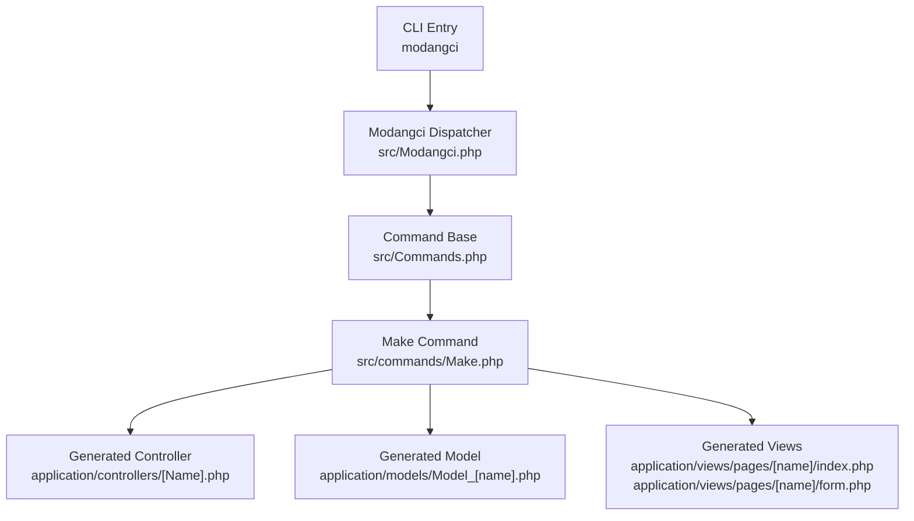
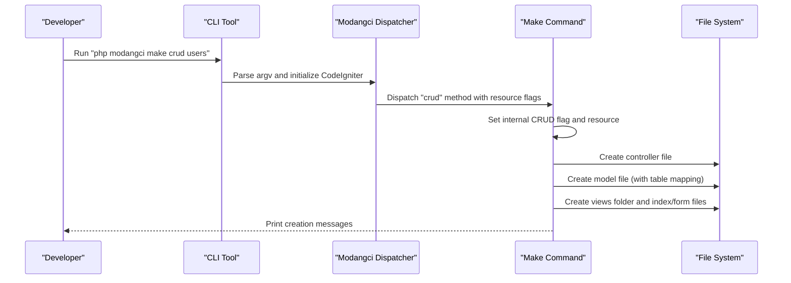
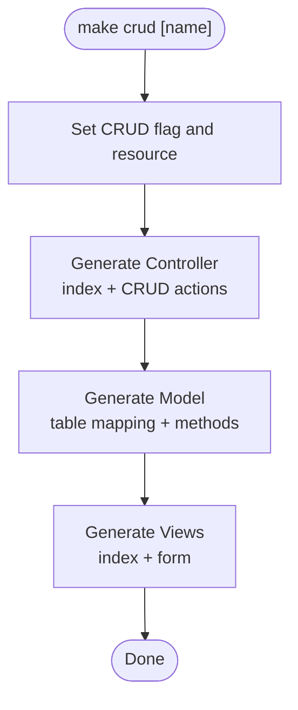
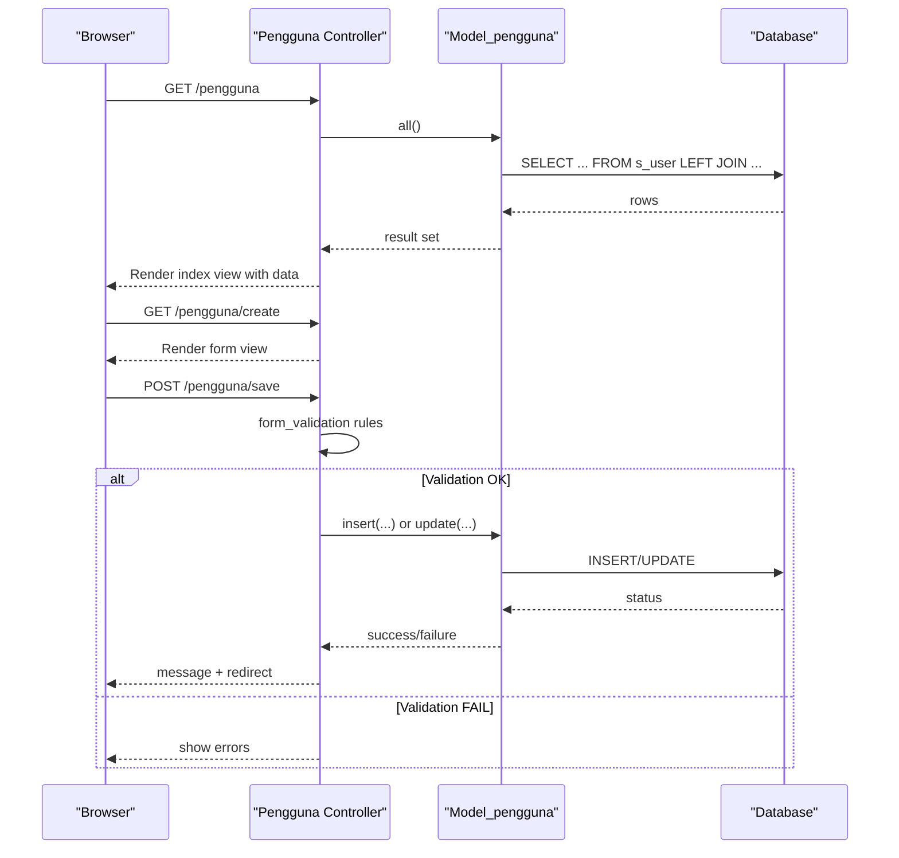
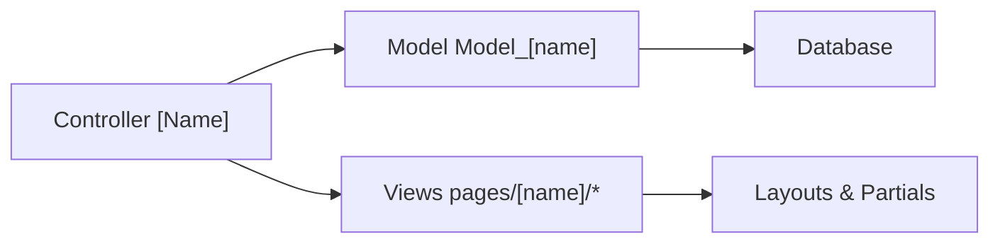

# CRUD Operation Generation

<cite>
**Referenced Files in This Document**
- [modangci](file://modangci)
- [Modangci.php](file://src/Modangci.php)
- [Make.php](file://src/commands/Make.php)
- [Commands.php](file://src/Commands.php)
- [MY_Controller.php](file://src/application/core/MY_Controller.php)
- [MY_Model.php](file://src/application/core/MY_Model.php)
- [Model_Master.php](file://src/application/core/Model_Master.php)
- [Pengguna.php](file://src/application/controllers/Pengguna.php)
- [Model_pengguna.php](file://src/application/models/Model_pengguna.php)
- [index.php (pengguna)](file://src/application/views/pages/pengguna/index.php)
- [form.php (pengguna)](file://src/application/views/pages/pengguna/form.php)
- [README.md](file://README.md)
</cite>

## Table of Contents
1. [Introduction](#introduction)
2. [Project Structure](#project-structure)
3. [Core Components](#core-components)
4. [Architecture Overview](#architecture-overview)
5. [Detailed Component Analysis](#detailed-component-analysis)
6. [Dependency Analysis](#dependency-analysis)
7. [Performance Considerations](#performance-considerations)
8. [Troubleshooting Guide](#troubleshooting-guide)
9. [Conclusion](#conclusion)

## Introduction
This document explains how the make crud command generates a complete CRUD system in a CodeIgniter 3 application scaffolded by Modangci. It covers the command syntax, the automated generation of controllers, models, and views, and how the generated components integrate with CodeIgniter’s core features such as form validation, database operations, encryption, and session management. It also provides examples for users, products, and categories, along with troubleshooting guidance for common multi-component generation issues.

## Project Structure
Modangci is a command-line tool that scaffolds CodeIgniter components. The CLI entry point initializes a CodeIgniter instance and dispatches commands to the appropriate handler class. The Make command orchestrates generation of controllers, models, and views, and supports a dedicated CRUD mode.

**Diagram sources**
- [modangci:1-26](file://modangci#L1-L26)
- [Modangci.php:1-60](file://src/Modangci.php#L1-L60)
- [Commands.php:1-135](file://src/Commands.php#L1-L135)
- [Make.php:1-211](file://src/commands/Make.php#L1-L211)

**Section sources**
- [README.md:1-41](file://README.md#L1-L41)
- [modangci:1-26](file://modangci#L1-L26)
- [Modangci.php:1-60](file://src/Modangci.php#L1-L60)
- [Commands.php:1-135](file://src/Commands.php#L1-L135)
- [Make.php:1-211](file://src/commands/Make.php#L1-L211)

## Core Components
- CLI entry and dispatcher: Initializes CodeIgniter and routes commands to the Make class.
- Make command: Generates controllers, models, and views; supports a dedicated CRUD mode that wires them together.
- Base classes: MY_Controller and Model_Master provide shared behavior for sessions, routing, and database operations.

Key behaviors:
- The make crud command sets internal flags to enable CRUD scaffolding and invokes controller, model, and view generators in sequence.
- Controllers load models and render views; models encapsulate database queries; views render lists and forms.

**Section sources**
- [Modangci.php:19-53](file://src/Modangci.php#L19-L53)
- [Make.php:196-209](file://src/commands/Make.php#L196-L209)
- [Commands.php:59-97](file://src/Commands.php#L59-L97)
- [MY_Controller.php:1-59](file://src/application/core/MY_Controller.php#L1-L59)
- [Model_Master.php:1-257](file://src/application/core/Model_Master.php#L1-L257)

## Architecture Overview
The CRUD generation flow is orchestrated by the Make command. It toggles internal flags, then sequentially creates:
- A controller with lifecycle actions (index, create, update, save, delete).
- A model with database integration (table mapping, listing, and lookup).
- Views for listing and editing records.

**Diagram sources**
- [modangci:1-26](file://modangci#L1-L26)
- [Modangci.php:19-53](file://src/Modangci.php#L19-L53)
- [Make.php:196-209](file://src/commands/Make.php#L196-L209)

## Detailed Component Analysis

### Make Command: CRUD Orchestration
The Make command coordinates generation of controllers, models, and views. The crud method:
- Sets internal flags to indicate CRUD mode.
- Invokes controller generation with resource flags enabling CRUD actions.
- Invokes model generation with table mapping.
- Invokes view generation with a views folder and index/form templates.

**Diagram sources**
- [Make.php:196-209](file://src/commands/Make.php#L196-L209)

**Section sources**
- [Make.php:196-209](file://src/commands/Make.php#L196-L209)

### Generated Controller Behavior
The controller generator creates a controller class that:
- Loads the associated model when in CRUD mode.
- Implements index to fetch data and render the list view.
- Optionally includes CRUD actions (create, update, save, delete) when invoked with resource flags.

Integration points:
- Uses CodeIgniter’s loader to attach the model.
- Renders views with data passed from the model.

**Section sources**
- [Make.php:16-73](file://src/commands/Make.php#L16-L73)

### Generated Model Behavior
The model generator creates a model class that:
- Accepts optional table and primary key arguments.
- Provides a listing method to fetch all records.
- Provides a lookup method to fetch a single record by key.

Integration points:
- Extends the framework’s model base.
- Uses the database library for queries.

**Section sources**
- [Make.php:75-127](file://src/commands/Make.php#L75-L127)

### Generated View Templates
The view generator creates:
- A views folder named after the entity.
- An index view for listing records.
- A form view for create/update.

Integration points:
- Index view displays data and action links.
- Form view posts to a save endpoint.

**Section sources**
- [Make.php:172-194](file://src/commands/Make.php#L172-L194)

### Real-World CRUD Example: Users
The existing users module demonstrates a production-ready CRUD implementation that aligns with the generated scaffolding. It includes:
- Controller actions: index, create, update, save, delete, resetpassword.
- Model methods: listing with joins and by-id lookup.
- Views: index page with table and form page with inputs.

**Diagram sources**
- [Pengguna.php:22-135](file://src/application/controllers/Pengguna.php#L22-L135)
- [Model_pengguna.php:11-35](file://src/application/models/Model_pengguna.php#L11-L35)
- [index.php (pengguna):1-98](file://src/application/views/pages/pengguna/index.php#L1-L98)
- [form.php (pengguna):1-65](file://src/application/views/pages/pengguna/form.php#L1-L65)

**Section sources**
- [Pengguna.php:22-135](file://src/application/controllers/Pengguna.php#L22-L135)
- [Model_pengguna.php:11-35](file://src/application/models/Model_pengguna.php#L11-L35)
- [index.php (pengguna):1-98](file://src/application/views/pages/pengguna/index.php#L1-L98)
- [form.php (pengguna):1-65](file://src/application/views/pages/pengguna/form.php#L1-L65)

### Generated CRUD Methods and Responsibilities
- index: Fetches all records via the model and renders the list view.
- create: Prepares form view with save URL and empty data.
- update: Loads a single record by key and renders the form pre-filled.
- save: Validates input, inserts or updates records, and reports success/failure.
- delete: Removes a record by key and reports outcome.

These mirror the real-world users module and can be adapted to other entities such as products or categories.

**Section sources**
- [Pengguna.php:34-114](file://src/application/controllers/Pengguna.php#L34-L114)

### Integration with CodeIgniter Features
- Session management: Base controller enforces login checks and prepares menus and breadcrumbs.
- Form validation: Controller applies validation rules before save.
- Encryption: Keys are encoded/decoded for safe URLs.
- Database operations: Model_Master provides transactional insert/update/delete with optional logging.
- Views: Layouts and partials are loaded consistently across pages.

**Section sources**
- [MY_Controller.php:16-51](file://src/application/core/MY_Controller.php#L16-L51)
- [Pengguna.php:60-101](file://src/application/controllers/Pengguna.php#L60-L101)
- [Model_Master.php:56-186](file://src/application/core/Model_Master.php#L56-L186)

## Dependency Analysis
The generated CRUD components depend on:
- Controller depends on Model and CodeIgniter’s loader/view system.
- Model depends on the database library and optionally on Model_Master for standardized operations.
- Views depend on layout templates and controller-provided data.

**Diagram sources**
- [Make.php:16-73](file://src/commands/Make.php#L16-L73)
- [Make.php:75-127](file://src/commands/Make.php#L75-L127)
- [Make.php:172-194](file://src/commands/Make.php#L172-L194)

**Section sources**
- [Make.php:16-73](file://src/commands/Make.php#L16-L73)
- [Make.php:75-127](file://src/commands/Make.php#L75-L127)
- [Make.php:172-194](file://src/commands/Make.php#L172-L194)

## Performance Considerations
- Prefer batch operations where applicable (insert_batch, update_batch) to reduce round trips.
- Use pagination for large datasets in index views.
- Add indexes on frequently filtered columns in models’ where clauses.
- Minimize heavy logic in controllers; delegate to models.

## Troubleshooting Guide
Common issues and resolutions during multi-component generation:
- Permission denied when writing files or folders:
  - Ensure the application path is writable by the CLI user.
  - Verify APPPATH resolves correctly in the environment.
- Duplicate file or folder exists:
  - Remove or rename existing files/folders before regenerating.
- Resource flags not recognized:
  - Confirm the -r flag is passed when invoking controller generation with CRUD actions.
- Database table mismatch:
  - Provide the correct table name when generating the model so the listing method targets the right table.
- View rendering errors:
  - Ensure the views folder is created and the index/form files are present.
- Session or login redirects:
  - Base controller enforces login; ensure session is initialized and valid before accessing protected pages.

**Section sources**
- [Commands.php:59-97](file://src/Commands.php#L59-L97)
- [Make.php:196-209](file://src/commands/Make.php#L196-L209)

## Conclusion
The make crud command streamlines CRUD scaffolding by generating a cohesive set of controller, model, and view files while preserving integration with CodeIgniter’s ecosystem. By following the patterns demonstrated in the users module, developers can quickly build maintainable CRUD interfaces for entities such as users, products, or categories, leveraging built-in features like form validation, encryption, database transactions, and session management.