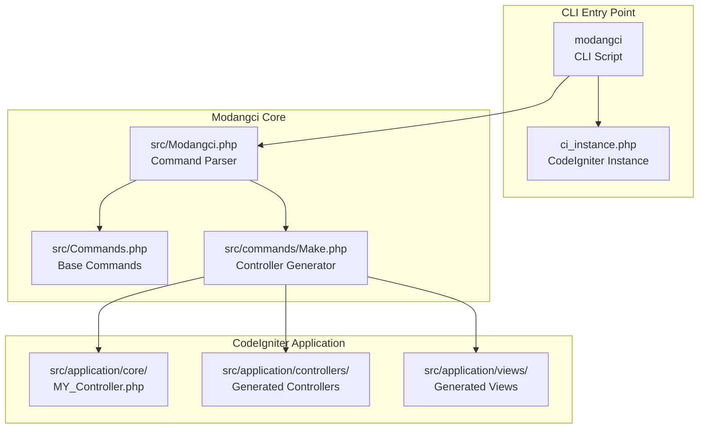
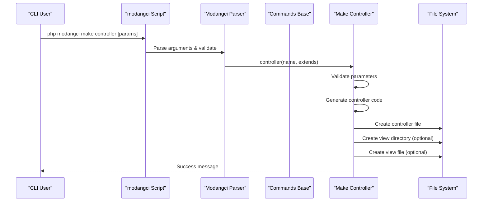
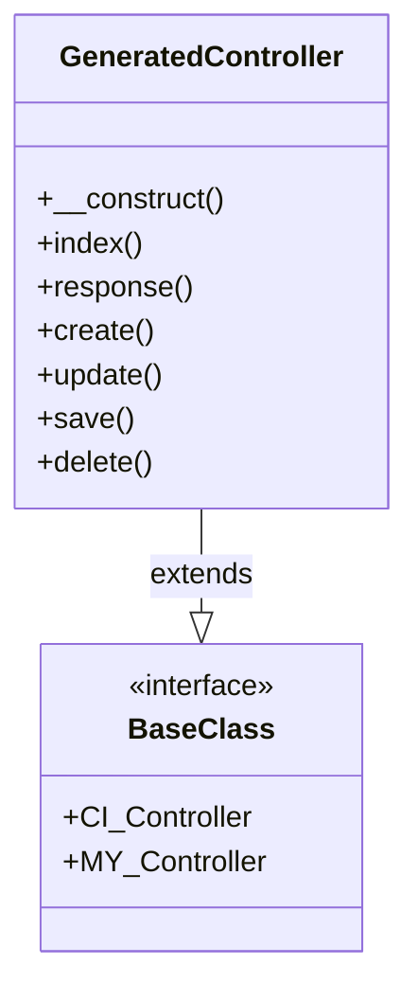
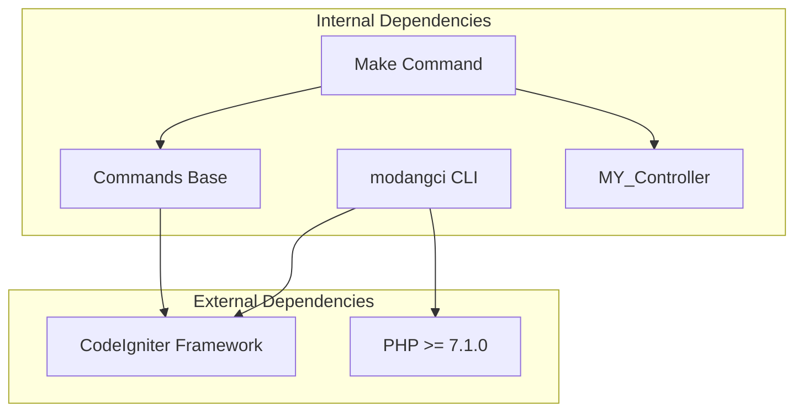

# Controller Generation

<cite>
**Referenced Files in This Document**
- [modangci](file://modangci)
- [ci_instance.php](file://ci_instance.php)
- [README.md](file://README.md)
- [composer.json](file://composer.json)
- [src/Modangci.php](file://src/Modangci.php)
- [src/Commands.php](file://src/Commands.php)
- [src/commands/Make.php](file://src/commands/Make.php)
- [src/application/core/MY_Controller.php](file://src/application/core/MY_Controller.php)
- [src/application/controllers/Home.php](file://src/application/controllers/Home.php)
- [src/application/controllers/Pengguna.php](file://src/application/controllers/Pengguna.php)
</cite>

## Table of Contents
1. [Introduction](#introduction)
2. [Project Structure](#project-structure)
3. [Core Components](#core-components)
4. [Architecture Overview](#architecture-overview)
5. [Detailed Component Analysis](#detailed-component-analysis)
6. [Dependency Analysis](#dependency-analysis)
7. [Performance Considerations](#performance-considerations)
8. [Troubleshooting Guide](#troubleshooting-guide)
9. [Conclusion](#conclusion)

## Introduction
This document provides comprehensive guidance for using the `make controller` command to generate CodeIgniter 3 controllers with the Modangci CLI tool. It explains the command syntax, demonstrates practical examples, and details the generated controller structure including constructor loading, index method, and optional CRUD method implementations. The documentation covers integration with CodeIgniter's CI_Controller base class and custom base classes, along with troubleshooting common issues.

## Project Structure
The Modangci CLI tool integrates with a CodeIgniter 3 application through a dedicated CLI entry point and command processing pipeline. The key components are organized as follows:



**Diagram sources**
- [modangci:1-26](file://modangci#L1-L26)
- [ci_instance.php:1-87](file://ci_instance.php#L1-L87)
- [src/Modangci.php:1-60](file://src/Modangci.php#L1-L60)
- [src/Commands.php:1-135](file://src/Commands.php#L1-L135)
- [src/commands/Make.php:1-211](file://src/commands/Make.php#L1-L211)

**Section sources**
- [modangci:1-26](file://modangci#L1-L26)
- [ci_instance.php:1-87](file://ci_instance.php#L1-L87)
- [src/Modangci.php:1-60](file://src/Modangci.php#L1-L60)
- [src/Commands.php:1-135](file://src/Commands.php#L1-L135)
- [src/commands/Make.php:1-211](file://src/commands/Make.php#L1-L211)

## Core Components
The controller generation functionality is implemented through a modular command system:

### Command Syntax and Parameters
The `make controller` command follows this syntax:
```
php modangci make controller [name] [--extends=BaseClass] [-r]
```

Key parameters:
- **name**: Required controller name (must match /^[a-zA-Z_]+$/ pattern)
- **--extends=BaseClass**: Optional custom base class (defaults to CI_Controller)
- **-r**: Optional flag to generate resource-style CRUD methods

### Base Command Processing
The command processing pipeline validates parameters, loads the CodeIgniter instance, and delegates to the appropriate command handler.

**Section sources**
- [src/Modangci.php:19-41](file://src/Modangci.php#L19-L41)
- [src/Commands.php:99-133](file://src/Commands.php#L99-L133)
- [README.md:15-16](file://README.md#L15-L16)

## Architecture Overview
The controller generation process follows a structured flow from CLI invocation to file creation:



**Diagram sources**
- [modangci:18-25](file://modangci#L18-L25)
- [src/Modangci.php:36-40](file://src/Modangci.php#L36-L40)
- [src/commands/Make.php:16-73](file://src/commands/Make.php#L16-L73)
- [src/Commands.php:76-92](file://src/Commands.php#L76-L92)

## Detailed Component Analysis

### Controller Generation Implementation
The controller generation logic is implemented in the Make class with the following key features:

#### Constructor Loading Behavior
The generated controller constructor automatically handles model loading when CRUD mode is enabled:
- Loads model with name pattern: `model_[controller_name]`
- Uses CodeIgniter's load->model() method
- Sets up proper model instance for data operations

#### Index Method Implementation
The index method varies based on CRUD mode:
- **Non-CRUD mode**: Outputs a simple greeting message
- **CRUD mode (-r)**: Loads data from the associated model and renders the view

#### CRUD Method Generation
When the `-r` flag is specified, the generator creates five standard CRUD methods:
- `response()`: Basic response method
- `create()`: Creation interface
- `update()`: Update interface  
- `save()`: Data persistence method
- `delete()`: Deletion method

### Generated Controller Structure
The generated controller follows this template:



**Diagram sources**
- [src/commands/Make.php:54-68](file://src/commands/Make.php#L54-L68)
- [src/commands/Make.php:22-44](file://src/commands/Make.php#L22-L44)

### Integration with CodeIgniter Base Classes
The generator supports two primary integration patterns:

#### Default Integration (CI_Controller)
When no custom base class is specified, controllers extend CI_Controller:
- Inherits core CodeIgniter functionality
- Provides standard controller capabilities
- Compatible with all CodeIgniter applications

#### Custom Base Class Integration
Controllers can extend custom base classes like MY_Controller:
- Supports application-specific functionality
- Enables shared controller behaviors
- Maintains compatibility with CodeIgniter patterns

**Section sources**
- [src/commands/Make.php:56](file://src/commands/Make.php#L56)
- [src/application/core/MY_Controller.php:3](file://src/application/core/MY_Controller.php#L3)

### Practical Examples

#### Example 1: Simple Controller Generation
Command: `php modangci make controller users`
Expected outcome:
- Creates `application/controllers/Users.php`
- Extends CI_Controller by default
- Generates basic index method
- No CRUD methods included

#### Example 2: Controller with CRUD Methods
Command: `php modangci make controller posts -r`
Expected outcome:
- Creates `application/controllers/Posts.php`
- Extends CI_Controller
- Generates CRUD methods: response, create, update, save, delete
- Creates corresponding view directory and file

#### Example 3: Controller with Custom Base Class
Command: `php modangci make controller admin --extends=MY_Controller`
Expected outcome:
- Creates `application/controllers/Admin.php`
- Extends MY_Controller (custom base class)
- Inherits application-specific functionality

**Section sources**
- [src/commands/Make.php:16-73](file://src/commands/Make.php#L16-L73)
- [README.md:13](file://README.md#L13)

## Dependency Analysis
The controller generation system has the following dependency relationships:



**Diagram sources**
- [composer.json:17-19](file://composer.json#L17-L19)
- [src/commands/Make.php:5](file://src/commands/Make.php#L5)
- [src/Commands.php:5](file://src/Commands.php#L5)

### Parameter Validation and Error Handling
The system implements comprehensive parameter validation:
- Validates controller name against allowed character patterns
- Checks for valid parameter combinations
- Handles missing or invalid parameters gracefully
- Provides meaningful error messages for troubleshooting

**Section sources**
- [src/Modangci.php:24-33](file://src/Modangci.php#L24-L33)
- [src/Commands.php:76-92](file://src/Commands.php#L76-L92)

## Performance Considerations
The controller generation process is lightweight and efficient:
- Single-file generation with minimal overhead
- Direct filesystem writes using CodeIgniter's file helper
- No external network dependencies
- Fast execution suitable for development workflows

## Troubleshooting Guide

### Common Issues and Solutions

#### Invalid Controller Name
**Problem**: Controller name contains invalid characters
**Solution**: Use only alphabetic characters and underscores
**Example**: ✗ `users-admin` → ✓ `users_admin`

#### Missing Required Parameters
**Problem**: Missing controller name argument
**Solution**: Provide a valid controller name
**Example**: ✗ `php modangci make controller` → ✓ `php modangci make controller users`

#### File Permission Errors
**Problem**: Unable to create controller files
**Solution**: Check write permissions for the application directory
**Common causes**:
- Insufficient directory permissions
- Readonly filesystem
- SELinux/AppArmor restrictions

#### Invalid Base Class Specification
**Problem**: Custom base class not found
**Solution**: Ensure the base class exists in the core directory
**Requirements**:
- Base class must extend CI_Controller
- Class must be autoloadable
- Proper namespace and file location

#### CRUD Mode Issues
**Problem**: CRUD methods not generating correctly
**Solution**: Verify the `-r` flag is properly specified
**Additional steps**:
- Ensure model with pattern `model_[controller_name]` exists
- Check that view directory structure is correct

### Debugging Steps
1. **Verify CLI Access**: Ensure running from command line interface
2. **Check Dependencies**: Confirm CodeIgniter framework is properly installed
3. **Validate Parameters**: Review command syntax and parameter combinations
4. **Inspect Permissions**: Verify write access to application directories
5. **Test Base Class**: Ensure custom base classes are properly defined

**Section sources**
- [src/Modangci.php:13-17](file://src/Modangci.php#L13-L17)
- [src/Commands.php:62-73](file://src/Commands.php#L62-L73)
- [src/Commands.php:83-91](file://src/Commands.php#L83-L91)

## Conclusion
The Modangci controller generation system provides a powerful and flexible solution for CodeIgniter 3 development. Its clean command syntax, comprehensive parameter support, and integration with both standard and custom base classes makes it an essential tool for rapid application development. The system's robust error handling and validation ensure reliable operation while maintaining simplicity for developers at all skill levels.

Key benefits include:
- Streamlined controller creation workflow
- Flexible base class integration
- Automatic CRUD method generation
- Comprehensive error handling
- Minimal performance impact
- Easy troubleshooting capabilities

The documented examples and troubleshooting guide provide practical guidance for successful controller generation in real-world development scenarios.