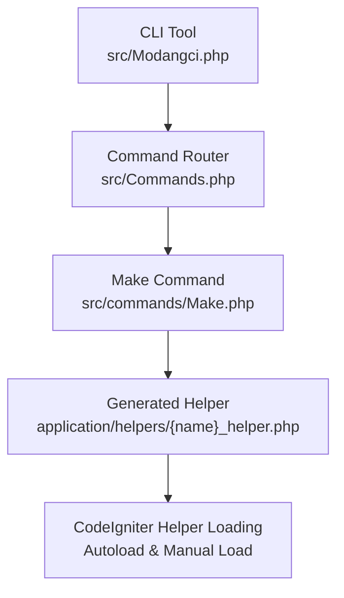
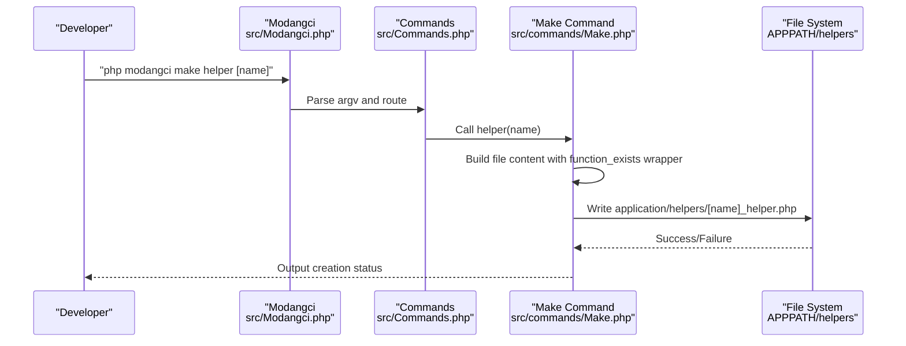
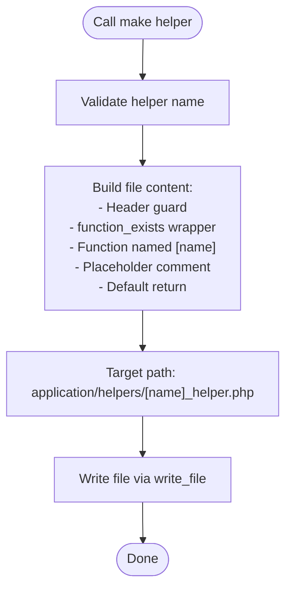
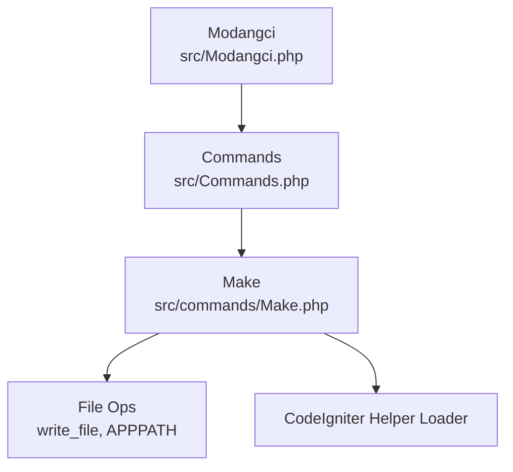

# Helper Generation

<cite>
**Referenced Files in This Document**
- [README.md](file://README.md)
- [src/Modangci.php](file://src/Modangci.php)
- [src/Commands.php](file://src/Commands.php)
- [src/commands/Make.php](file://src/commands/Make.php)
- [src/application/helpers/datetoindo_helper.php](file://src/application/helpers/datetoindo_helper.php)
- [src/application/helpers/daystoindo_helper.php](file://src/application/helpers/daystoindo_helper.php)
- [src/application/helpers/monthtoindo_helper.php](file://src/application/helpers/monthtoindo_helper.php)
- [src/application/helpers/generatepassword_helper.php](file://src/application/helpers/generatepassword_helper.php)
- [src/application/helpers/debuglog_helper.php](file://src/application/helpers/debuglog_helper.php)
- [src/application/helpers/message_helper.php](file://src/application/helpers/message_helper.php)
- [src/application/helpers/terbilang_helper.php](file://src/application/helpers/terbilang_helper.php)
</cite>

## Table of Contents
1. [Introduction](#introduction)
2. [Project Structure](#project-structure)
3. [Core Components](#core-components)
4. [Architecture Overview](#architecture-overview)
5. [Detailed Component Analysis](#detailed-component-analysis)
6. [Dependency Analysis](#dependency-analysis)
7. [Performance Considerations](#performance-considerations)
8. [Troubleshooting Guide](#troubleshooting-guide)
9. [Conclusion](#conclusion)
10. [Appendices](#appendices)

## Introduction
This document explains how to generate CodeIgniter helper files using the make helper command. It covers the syntax, the generated file structure, function declaration patterns, and best practices for helper naming, parameters, and return values. It also describes how generated helpers integrate with CodeIgniter’s helper loading system and how to autoload them.

## Project Structure
The helper generation capability is part of a CLI tool that scaffolds CodeIgniter artifacts. The relevant parts of the project structure include:
- CLI entry and routing: src/Modangci.php and src/Commands.php
- Command implementations: src/commands/Make.php
- Example helpers in src/application/helpers/ showing established patterns

**Diagram sources**
- [src/Modangci.php:10-41](file://src/Modangci.php#L10-L41)
- [src/Commands.php:37-57](file://src/Commands.php#L37-L57)
- [src/commands/Make.php:129-148](file://src/commands/Make.php#L129-L148)

**Section sources**
- [README.md:15-22](file://README.md#L15-L22)
- [src/Modangci.php:10-41](file://src/Modangci.php#L10-L41)
- [src/Commands.php:37-57](file://src/Commands.php#L37-L57)
- [src/commands/Make.php:129-148](file://src/commands/Make.php#L129-L148)

## Core Components
- CLI entrypoint: Initializes CLI checks and routes commands to the appropriate handler.
- Command router: Parses arguments and dispatches to the correct command class and method.
- Make command: Implements the helper generator and writes files to application/helpers.

Key behaviors:
- The make helper command accepts a helper name and generates a file named {name}_helper.php under application/helpers.
- Generated files include a standard CodeIgniter header and a function_exists wrapper around a function named after the helper.

**Section sources**
- [src/Modangci.php:10-41](file://src/Modangci.php#L10-L41)
- [src/Commands.php:76-92](file://src/Commands.php#L76-L92)
- [src/commands/Make.php:129-148](file://src/commands/Make.php#L129-L148)

## Architecture Overview
The helper generation flow is a simple pipeline from CLI invocation to file creation.

**Diagram sources**
- [src/Modangci.php:36-41](file://src/Modangci.php#L36-L41)
- [src/Commands.php:43-53](file://src/Commands.php#L43-L53)
- [src/commands/Make.php:129-148](file://src/commands/Make.php#L129-L148)

## Detailed Component Analysis

### Make Command: Helper Generation
The Make command’s helper method builds a minimal helper file with:
- A standard CodeIgniter header guard
- A function_exists wrapper for the generated function
- A function named after the helper
- A placeholder comment and a default return value

**Diagram sources**
- [src/commands/Make.php:129-148](file://src/commands/Make.php#L129-L148)
- [src/Commands.php:76-92](file://src/Commands.php#L76-L92)

**Section sources**
- [src/commands/Make.php:129-148](file://src/commands/Make.php#L129-L148)
- [src/Commands.php:76-92](file://src/Commands.php#L76-L92)

### Generated Helper File Structure
A generated helper file follows this structure:
- PHP opening tag and header guard
- A function_exists wrapper
- A function named after the helper
- A placeholder comment indicating where to add logic
- A default return statement

Example references:
- Generated skeleton: [src/commands/Make.php:135-144](file://src/commands/Make.php#L135-L144)
- File writing routine: [src/Commands.php:76-92](file://src/Commands.php#L76-L92)

Naming convention:
- File name: {name}_helper.php
- Function name: {name}
- Wrapper: function_exists("{name}")

Integration with CodeIgniter:
- The header guard ensures safe inclusion.
- The function_exists wrapper prevents redeclaration errors.

**Section sources**
- [src/commands/Make.php:129-148](file://src/commands/Make.php#L129-L148)
- [src/Commands.php:76-92](file://src/Commands.php#L76-L92)

### Real-World Helper Patterns
To guide best practices, review existing helpers in the repository:

- Date formatting helpers:
  - Indonesian date formatter: [src/application/helpers/datetoindo_helper.php:6-22](file://src/application/helpers/datetoindo_helper.php#L6-L22)
  - Day-of-week mapping: [src/application/helpers/daystoindo_helper.php:6-21](file://src/application/helpers/daystoindo_helper.php#L6-L21)
  - Month name mapping: [src/application/helpers/monthtoindo_helper.php:6-26](file://src/application/helpers/monthtoindo_helper.php#L6-L26)

- Utility helpers:
  - Password generation: [src/application/helpers/generatepassword_helper.php:6-24](file://src/application/helpers/generatepassword_helper.php#L6-L24)
  - Debug logging: [src/application/helpers/debuglog_helper.php:6-31](file://src/application/helpers/debuglog_helper.php#L6-L31)

- Message formatting:
  - JSON message builder with CodeIgniter output: [src/application/helpers/message_helper.php:6-20](file://src/application/helpers/message_helper.php#L6-L20)

- Complex formatting:
  - Number-to-word conversion: [src/application/helpers/terbilang_helper.php:15-106](file://src/application/helpers/terbilang_helper.php#L15-L106)

These examples demonstrate:
- Parameter handling and validation
- Return value patterns (boolean, string, JSON)
- Accessing CodeIgniter instance via get_instance()
- Using CodeIgniter output library for structured responses

**Section sources**
- [src/application/helpers/datetoindo_helper.php:6-22](file://src/application/helpers/datetoindo_helper.php#L6-L22)
- [src/application/helpers/daystoindo_helper.php:6-21](file://src/application/helpers/daystoindo_helper.php#L6-L21)
- [src/application/helpers/monthtoindo_helper.php:6-26](file://src/application/helpers/monthtoindo_helper.php#L6-L26)
- [src/application/helpers/generatepassword_helper.php:6-24](file://src/application/helpers/generatepassword_helper.php#L6-L24)
- [src/application/helpers/debuglog_helper.php:6-31](file://src/application/helpers/debuglog_helper.php#L6-L31)
- [src/application/helpers/message_helper.php:6-20](file://src/application/helpers/message_helper.php#L6-L20)
- [src/application/helpers/terbilang_helper.php:15-106](file://src/application/helpers/terbilang_helper.php#L15-L106)

### Best Practices for Helper Functions
- Naming:
  - Use descriptive, lowercase names with underscores for readability.
  - Match the file name pattern: {name}_helper.php and function name: {name}.
- Parameters:
  - Define defaults for optional parameters.
  - Validate inputs early and return appropriate sentinel values (false, empty string) when invalid.
- Return values:
  - Be explicit about return types.
  - For UI or API helpers, consider returning structured data or formatted strings.
- Safety:
  - Always wrap helper functions in function_exists to prevent redefinition.
  - Include the standard CodeIgniter header guard.
- Integration:
  - Use get_instance() to access CodeIgniter resources when needed.
  - For API-like helpers, consider setting content type and encoding responses appropriately.

**Section sources**
- [src/commands/Make.php:135-144](file://src/commands/Make.php#L135-L144)
- [src/application/helpers/message_helper.php:8-19](file://src/application/helpers/message_helper.php#L8-L19)

### CodeIgniter Helper Loading and Autoloading
- Manual loading: Helpers are loaded in controllers or models using the CodeIgniter helper loader.
- Autoloading: Helpers can be autoloaded by adding entries to the autoloader configuration so they are available globally without manual loading.

Note: The repository does not include an explicit autoload configuration file. To autoload a generated helper, configure the framework’s autoloader to include application/helpers/{name}_helper.php.

**Section sources**
- [README.md:18](file://README.md#L18)

## Dependency Analysis
The helper generation depends on:
- CLI routing and argument parsing
- File writing utilities
- CodeIgniter’s helper loading mechanism

**Diagram sources**
- [src/Modangci.php:36-41](file://src/Modangci.php#L36-L41)
- [src/Commands.php:43-53](file://src/Commands.php#L43-L53)
- [src/commands/Make.php:129-148](file://src/commands/Make.php#L129-L148)
- [src/Commands.php:76-92](file://src/Commands.php#L76-L92)

**Section sources**
- [src/Modangci.php:36-41](file://src/Modangci.php#L36-L41)
- [src/Commands.php:43-53](file://src/Commands.php#L43-L53)
- [src/commands/Make.php:129-148](file://src/commands/Make.php#L129-L148)
- [src/Commands.php:76-92](file://src/Commands.php#L76-L92)

## Performance Considerations
- Keep helper functions small and focused to minimize overhead.
- Avoid heavy I/O inside helpers; defer to models or libraries when necessary.
- Prefer built-in PHP functions and CodeIgniter utilities for performance.

## Troubleshooting Guide
Common issues and resolutions:
- Helper not found:
  - Ensure the file is named {name}_helper.php and placed under application/helpers.
  - Confirm the function name matches the helper name and is wrapped in function_exists.
- Redefinition errors:
  - Verify function_exists wrapper is present.
- Autoloading not working:
  - Add the helper to the framework’s autoload configuration so it loads automatically.

**Section sources**
- [src/commands/Make.php:135-144](file://src/commands/Make.php#L135-L144)
- [README.md:18](file://README.md#L18)

## Conclusion
The make helper command streamlines creating reusable, well-structured helpers that follow CodeIgniter conventions. By adhering to naming, safety, and return-value patterns demonstrated by existing helpers, you can build maintainable utilities that integrate cleanly with the framework and can be autoloaded for broad availability.

## Appendices

### Example Workflows
- Generate a helper:
  - Run: php modangci make helper [name]
  - Edit application/helpers/[name]_helper.php to implement logic.
- Use a helper:
  - Load manually in a controller or model.
  - Or configure autoloading to make it globally available.

**Section sources**
- [README.md:18](file://README.md#L18)
- [src/commands/Make.php:129-148](file://src/commands/Make.php#L129-L148)