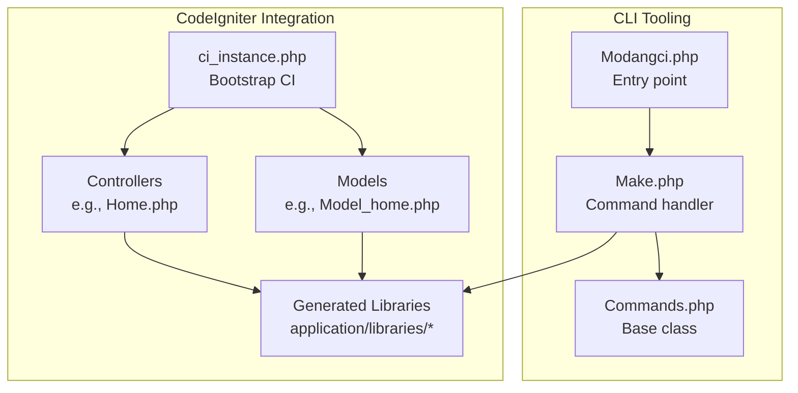
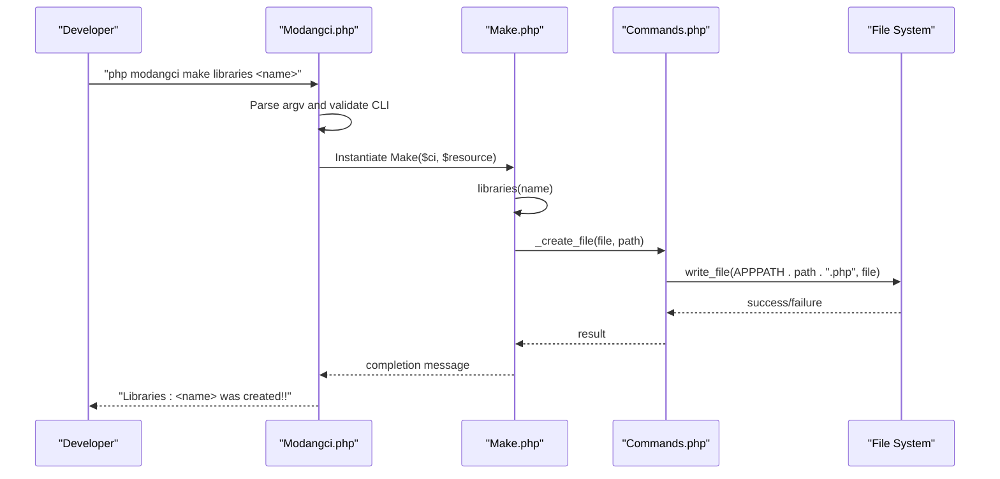
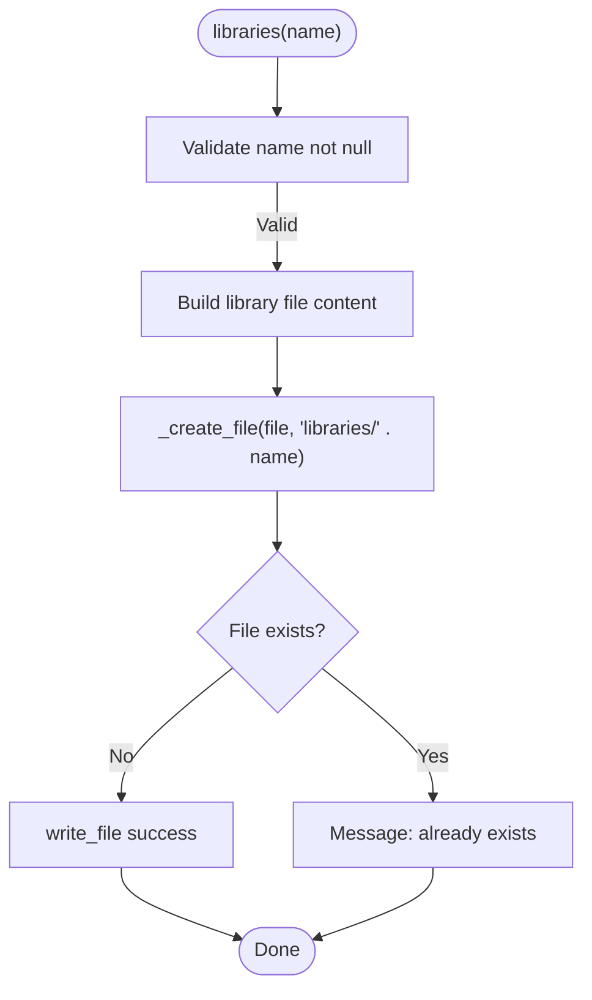
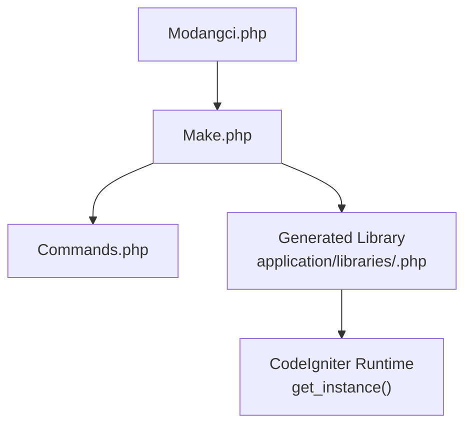

# Library Generation

<cite>
**Referenced Files in This Document**
- [Make.php](file://src/commands/Make.php)
- [Commands.php](file://src/Commands.php)
- [Modangci.php](file://src/Modangci.php)
- [Encryptions.php](file://src/application/libraries/Encryptions.php)
- [Pdfgenerator.php](file://src/application/libraries/Pdfgenerator.php)
- [README.md](file://README.md)
- [ci_instance.php](file://ci_instance.php)
- [MY_Controller.php](file://src/application/core/MY_Controller.php)
- [Home.php](file://src/application/controllers/Home.php)
- [Model_home.php](file://src/application/models/Model_home.php)
</cite>

## Table of Contents
1. [Introduction](#introduction)
2. [Project Structure](#project-structure)
3. [Core Components](#core-components)
4. [Architecture Overview](#architecture-overview)
5. [Detailed Component Analysis](#detailed-component-analysis)
6. [Dependency Analysis](#dependency-analysis)
7. [Performance Considerations](#performance-considerations)
8. [Troubleshooting Guide](#troubleshooting-guide)
9. [Conclusion](#conclusion)
10. [Appendices](#appendices)

## Introduction
This document explains how to generate CodeIgniter libraries using the make libraries command. It covers the syntax, the generated library structure, constructor handling for accessing the CodeIgniter instance via $this->CI, and practical patterns for integrating libraries with CodeIgniter’s core systems. It also provides best practices for library design, method organization, loading, instantiation, and usage within controllers and models.

## Project Structure
The library generation capability is part of the CLI tooling under the src/commands/Make.php class. The Make class extends the base Commands class and implements a libraries method that scaffolds a new library file in application/libraries/. The Commands base class handles file creation and messaging.

**Diagram sources**
- [Modangci.php:1-60](file://src/Modangci.php#L1-L60)
- [Commands.php:1-135](file://src/Commands.php#L1-L135)
- [Make.php:150-170](file://src/commands/Make.php#L150-L170)
- [ci_instance.php:1-86](file://ci_instance.php#L1-L86)
- [Home.php:1-121](file://src/application/controllers/Home.php#L1-L121)
- [Model_home.php:1-9](file://src/application/models/Model_home.php#L1-L9)

**Section sources**
- [Make.php:150-170](file://src/commands/Make.php#L150-L170)
- [Commands.php:76-92](file://src/Commands.php#L76-L92)
- [Modangci.php:36-41](file://src/Modangci.php#L36-L41)
- [README.md:15-21](file://README.md#L15-L21)

## Core Components
- Make command handler: Generates library skeletons with a constructor that captures the CodeIgniter instance via get_instance().
- Base Commands class: Provides shared file/folder creation utilities and messaging.
- CLI entry point: Parses arguments and dispatches to the appropriate command method.
- Generated library structure: Includes a constructor that sets $this->CI and a placeholder area for your code.

Key behaviors:
- The libraries method creates a file in application/libraries/<Name>.php.
- The constructor initializes $this->CI using get_instance() so the library can access CodeIgniter’s loaded helpers, models, and other resources.
- The base Commands class writes files using CodeIgniter’s file helper and validates existence before writing.

**Section sources**
- [Make.php:150-170](file://src/commands/Make.php#L150-L170)
- [Commands.php:76-92](file://src/Commands.php#L76-L92)
- [Modangci.php:36-41](file://src/Modangci.php#L36-L41)

## Architecture Overview
The library generation flow is a CLI-driven process that scaffolds files and integrates with CodeIgniter’s runtime environment.

**Diagram sources**
- [Modangci.php:36-41](file://src/Modangci.php#L36-L41)
- [Make.php:150-170](file://src/commands/Make.php#L150-L170)
- [Commands.php:76-92](file://src/Commands.php#L76-L92)

## Detailed Component Analysis

### Make Command Handler (libraries)
The libraries method generates a new library class with a constructor that captures the CodeIgniter instance. It writes the file to application/libraries/<Name>.php.

**Diagram sources**
- [Make.php:150-170](file://src/commands/Make.php#L150-L170)
- [Commands.php:76-92](file://src/Commands.php#L76-L92)

Implementation highlights:
- Constructor sets $this->CI = get_instance() to access CodeIgniter’s loaded resources.
- Placeholder comment indicates where custom methods should be added.
- Uses the base class’s _create_file to write the file safely.

**Section sources**
- [Make.php:150-170](file://src/commands/Make.php#L150-L170)
- [Commands.php:76-92](file://src/Commands.php#L76-L92)

### Base Commands Class (File Operations)
The base Commands class centralizes file and folder creation, including existence checks and error messaging.

Key responsibilities:
- _create_folder: Creates directories under APPPATH with permission checks.
- _create_file: Writes files using CodeIgniter’s write_file helper and validates success.
- Messaging: Provides consistent console output for user feedback.

These utilities ensure generated libraries are placed correctly and safely.

**Section sources**
- [Commands.php:59-92](file://src/Commands.php#L59-L92)

### CLI Entry Point (Argument Parsing and Dispatch)
The CLI entry point parses arguments, validates CLI context, and dispatches to the Make command handler.

Highlights:
- Validates CLI context and exits if not invoked from CLI.
- Builds class and method names dynamically from argv.
- Calls the target method with resource flags and remaining arguments.

This enables the make libraries command to be invoked consistently from the terminal.

**Section sources**
- [Modangci.php:10-41](file://src/Modangci.php#L10-L41)

### Generated Library Structure and Constructor Handling
The generated library follows CodeIgniter conventions:
- File location: application/libraries/<Name>.php
- Constructor: Initializes $this->CI via get_instance() for access to CodeIgniter’s loaded helpers, models, and services.
- Method area: Commented placeholder for your methods.

Integration patterns:
- Access CodeIgniter resources through $this->CI (e.g., load helpers, models).
- Use $this->CI->load->library(...) to load additional libraries.
- Use $this->CI->load->helper(...) to load helpers.
- Use $this->CI->db for database operations if needed.

**Section sources**
- [Make.php:150-170](file://src/commands/Make.php#L150-L170)

### Practical Examples: Generated Library Patterns
Below are common library patterns you can implement in your generated library:

- Utility library: Encapsulate reusable functions and helpers. Example patterns include encryption utilities and PDF generation.
- Service class: Encapsulate business logic and orchestrate interactions with models and other libraries.
- Reusable component: Provide cross-cutting concerns like logging, caching, or formatting.

Existing examples in the repository demonstrate these patterns:
- Encryption library: Demonstrates accessing CodeIgniter’s encryption library via $this->CI and performing encode/decode operations.
- PDF generator: Demonstrates external library usage (Dompdf) and rendering PDFs.

**Section sources**
- [Encryptions.php:1-56](file://src/application/libraries/Encryptions.php#L1-L56)
- [Pdfgenerator.php:1-17](file://src/application/libraries/Pdfgenerator.php#L1-L17)

### Loading, Instantiation, and Usage Within Controllers and Models
- Controllers: Load libraries in constructors or methods using $this->load->library('Name').
- Models: Load libraries in constructors or methods using $this->load->library('Name').
- Access within methods: Use $this->name->method() after loading.

The generated library’s constructor already captures $this->CI, enabling seamless access to CodeIgniter’s loaded resources from within your methods.

**Section sources**
- [Home.php:18](file://src/application/controllers/Home.php#L18)
- [Model_home.php:4](file://src/application/models/Model_home.php#L4)
- [Make.php:160-163](file://src/commands/Make.php#L160-L163)

### Best Practices for Library Design and Organization
- Naming conventions: Use PascalCase for class names and match file names exactly (e.g., MyLibrary.php).
- Constructor responsibilities: Initialize dependencies and capture $this->CI for framework access.
- Method organization: Group related functionality into cohesive methods; keep methods focused and testable.
- Integration patterns:
  - Load helpers and models via $this->CI->load->helper(...) and $this->CI->load->model(...).
  - Use $this->CI->db for database operations if needed.
  - Avoid hardcoding paths; rely on CodeIgniter’s loader and configuration.
- Error handling: Return meaningful results or throw exceptions for failures.
- Documentation: Add comments explaining purpose, parameters, and return values.
- Testing: Keep methods pure where possible; isolate framework-dependent parts.

**Section sources**
- [Make.php:150-170](file://src/commands/Make.php#L150-L170)
- [Encryptions.php:22-53](file://src/application/libraries/Encryptions.php#L22-L53)
- [Pdfgenerator.php:6-15](file://src/application/libraries/Pdfgenerator.php#L6-L15)

## Dependency Analysis
The library generation flow depends on the CLI entry point, the Make command handler, and the base Commands class for file operations. Generated libraries depend on CodeIgniter’s runtime environment and the get_instance() mechanism.

**Diagram sources**
- [Modangci.php:36-41](file://src/Modangci.php#L36-L41)
- [Make.php:150-170](file://src/commands/Make.php#L150-L170)
- [Commands.php:76-92](file://src/Commands.php#L76-L92)
- [ci_instance.php:79-82](file://ci_instance.php#L79-L82)

**Section sources**
- [Modangci.php:36-41](file://src/Modangci.php#L36-L41)
- [Make.php:150-170](file://src/commands/Make.php#L150-L170)
- [Commands.php:76-92](file://src/Commands.php#L76-L92)
- [ci_instance.php:79-82](file://ci_instance.php#L79-L82)

## Performance Considerations
- Minimize heavy operations in constructors; defer expensive initialization to methods that are actually called.
- Cache frequently accessed configuration or computed values within the library instance.
- Use CodeIgniter’s built-in caching mechanisms when appropriate.
- Avoid unnecessary helper/model loads; load only what you need in each method.

## Troubleshooting Guide
Common issues and resolutions:
- File already exists: The base class prevents overwriting existing files. Rename or remove the existing file before regenerating.
- Unable to write file: Ensure the application/libraries/ directory is writable by the CLI user.
- CLI context error: The CLI entry point checks for CLI requests and exits otherwise. Run the command from the terminal.
- Missing CodeIgniter instance: Ensure the library is constructed within a CodeIgniter context; the constructor uses get_instance().

**Section sources**
- [Commands.php:76-92](file://src/Commands.php#L76-L92)
- [Modangci.php:12-17](file://src/Modangci.php#L12-L17)
- [Make.php:160-163](file://src/commands/Make.php#L160-L163)

## Conclusion
The make libraries command streamlines creating reusable CodeIgniter libraries with a proper constructor that captures the CodeIgniter instance via $this->CI. By following the generated structure and best practices, you can build robust libraries that integrate seamlessly with CodeIgniter’s core systems, enhancing maintainability and reusability across controllers and models.

## Appendices

### Command Reference
- Syntax: php modangci make libraries [name]
- Behavior: Generates application/libraries/<Name>.php with a constructor setting $this->CI and a placeholder for your methods.
- Output: Console messages indicating success or failure.

**Section sources**
- [README.md:19](file://README.md#L19)
- [Make.php:150-170](file://src/commands/Make.php#L150-L170)

### Example Integration Patterns
- Encryption utility: Access CodeIgniter’s encryption library via $this->CI and perform encode/decode operations.
- PDF generation: Use external libraries (e.g., Dompdf) through $this->CI and render PDFs.

**Section sources**
- [Encryptions.php:22-53](file://src/application/libraries/Encryptions.php#L22-L53)
- [Pdfgenerator.php:6-15](file://src/application/libraries/Pdfgenerator.php#L6-L15)