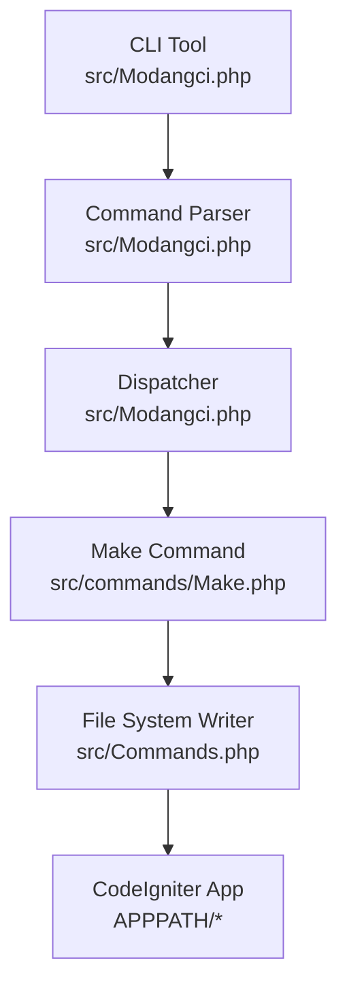
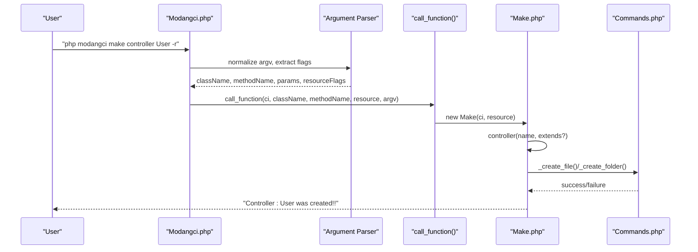
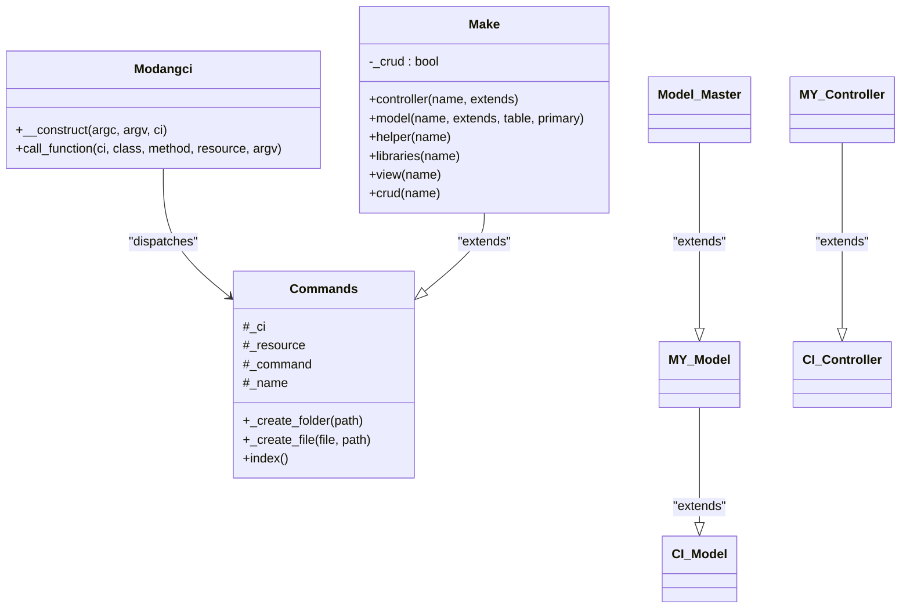

# Make Commands

<cite>
**Referenced Files in This Document**
- [Make.php](file://src/commands/Make.php)
- [Commands.php](file://src/Commands.php)
- [Modangci.php](file://src/Modangci.php)
- [MY_Controller.php](file://src/application/core/MY_Controller.php)
- [MY_Model.php](file://src/application/core/MY_Model.php)
- [Model_Master.php](file://src/application/core/Model_Master.php)
- [Home.php](file://src/application/controllers/Home.php)
- [Model_home.php](file://src/application/models/Model_home.php)
- [template.php](file://src/application/views/layouts/template.php)
- [README.md](file://README.md)
</cite>

## Table of Contents
1. [Introduction](#introduction)
2. [Project Structure](#project-structure)
3. [Core Components](#core-components)
4. [Architecture Overview](#architecture-overview)
5. [Detailed Component Analysis](#detailed-component-analysis)
6. [Dependency Analysis](#dependency-analysis)
7. [Performance Considerations](#performance-considerations)
8. [Troubleshooting Guide](#troubleshooting-guide)
9. [Conclusion](#conclusion)

## Introduction
This document explains Modangci’s make command family for rapid scaffolding of CodeIgniter 3 applications. It covers all make subcommands: controller, model, view, crud, helper, and libraries. For each command, we describe syntax, required parameters, optional flags, and practical examples. We also document the -r flag for resource generation, table specification for CRUD operations, and base class customization options. Finally, we explain the underlying template system and how generated code integrates with CodeIgniter conventions.

## Project Structure
Modangci organizes CLI scaffolding under src/commands and delegates runtime to src/Modangci.php. Generated artifacts are written into the CodeIgniter application directory (APPPATH) under controllers/, models/, helpers/, libraries/, and views/.

**Diagram sources**
- [Modangci.php:10-41](file://src/Modangci.php#L10-L41)
- [Make.php:7-73](file://src/commands/Make.php#L7-L73)
- [Commands.php:59-92](file://src/Commands.php#L59-L92)

**Section sources**
- [README.md:15-22](file://README.md#L15-L22)
- [Modangci.php:10-41](file://src/Modangci.php#L10-L41)

## Core Components
- Modangci CLI entrypoint parses arguments, validates allowed flags, and dispatches to the appropriate command class and method.
- Commands base class provides shared filesystem operations and messaging.
- Make command class implements generation logic for controllers, models, views, helpers, libraries, and CRUD bundles.

Key behaviors:
- Argument normalization and validation
- Resource flag parsing (-r)
- Safe file/folder creation with existence checks
- Message output for success and failure

**Section sources**
- [Modangci.php:19-41](file://src/Modangci.php#L19-L41)
- [Commands.php:59-97](file://src/Commands.php#L59-L97)
- [Make.php:7-73](file://src/commands/Make.php#L7-L73)

## Architecture Overview
The make command pipeline follows a simple flow: parse CLI args -> validate -> instantiate command class -> call method -> generate files.

**Diagram sources**
- [Modangci.php:36-53](file://src/Modangci.php#L36-L53)
- [Make.php:16-73](file://src/commands/Make.php#L16-L73)
- [Commands.php:76-92](file://src/Commands.php#L76-L92)

## Detailed Component Analysis

### Make Command Family Overview
The Make command class exposes methods for generating:
- Controllers
- Models
- Views
- Helpers
- Libraries
- Complete CRUD bundles

It also supports a resource mode (-r) that injects standard CRUD action stubs into controllers.

**Section sources**
- [Make.php:16-209](file://src/commands/Make.php#L16-L209)
- [Commands.php:99-133](file://src/Commands.php#L99-L133)

### Make controller
Generates a controller class extending a configurable base class (defaults to CI_Controller). With -r, adds response(), create(), update(), save(), and delete() action stubs. Without -r, writes a minimal index() that echoes a message. When in CRUD mode, loads a model named model_<controller> and renders a view under the controller’s lowercase name.

Syntax:
- make controller <name> [extends] [-r]

Parameters:
- name: controller name (required)
- extends: base class name (optional; defaults to CI_Controller)
- -r: enable resource mode (optional)

Behavior highlights:
- Normalizes name to PascalCase for class name
- Uses provided extends or falls back to CI_Controller
- In resource mode, generates CRUD action stubs
- In CRUD mode, loads model model_<name> and renders views/<name>/index

Practical examples:
- Generate a simple controller: make controller User
- Generate a controller extending a custom base: make controller Admin MY_Controller
- Generate a resource controller: make controller User -r

Integration with CodeIgniter:
- Extends CI_Controller by default
- Uses CodeIgniter loader to load models and views
- Follows CodeIgniter naming conventions for controllers and views

Common parameter combinations:
- controller User
- controller Admin MY_Controller -r
- controller Post CI_Controller

Validation rules:
- name must be provided; otherwise, help/index is shown

**Section sources**
- [Make.php:16-73](file://src/commands/Make.php#L16-L73)
- [Commands.php:99-133](file://src/Commands.php#L99-L133)

### Make model
Generates a model class extending a configurable base class (defaults to CI_Model). Supports optional table and primary key parameters to generate convenience methods:
- all(): selects all rows from the table
- by_id($id): selects a single row by primary key

Syntax:
- make model <name> [extends] [table] [primary]

Parameters:
- name: model name (required)
- extends: base class name (optional; defaults to CI_Model)
- table: database table name (optional)
- primary: primary key column (optional; requires table)

Behavior highlights:
- Normalizes name to PascalCase for class name
- Adds protected $table and $primary variables when provided
- Generates all() and by_id() methods when table is provided

Practical examples:
- Generate a basic model: make model UserModel
- Generate a model extending a custom base: make model UserModel MY_Model
- Generate a model with table integration: make model UserModel MY_Model users id

Integration with CodeIgniter:
- Extends CI_Model by default
- Uses CodeIgniter database library for queries
- Integrates with Model_Master when MY_Model extends it

Common parameter combinations:
- model User
- model UserModel MY_Model
- model User MY_Model users id

Validation rules:
- name must be provided; otherwise, help/index is shown

**Section sources**
- [Make.php:75-127](file://src/commands/Make.php#L75-L127)
- [MY_Model.php:3-10](file://src/application/core/MY_Model.php#L3-L10)
- [Model_Master.php:2-7](file://src/application/core/Model_Master.php#L2-L7)

### Make helper
Generates a CodeIgniter helper file with a function wrapper and guards against redeclaration.

Syntax:
- make helper <name>

Parameters:
- name: helper name (required)

Behavior highlights:
- Creates a helper file with function_exists() guard
- Names the function as <name> and appends _helper to filename

Practical examples:
- make helper user
- make helper stringutils

Integration with CodeIgniter:
- Follows CodeIgniter helper naming convention (name_helper.php)
- Uses function_exists() guard to prevent redefinition errors

Common parameter combinations:
- helper user
- helper stringutils

Validation rules:
- name must be provided; otherwise, help/index is shown

**Section sources**
- [Make.php:129-148](file://src/commands/Make.php#L129-L148)

### Make libraries
Generates a CodeIgniter library class with an instance accessor to CodeIgniter.

Syntax:
- make libraries <name>

Parameters:
- name: library name (required)

Behavior highlights:
- Creates a library class with constructor accessing CI instance
- Provides a place to add custom methods

Practical examples:
- make libraries PDF
- make libraries Cache

Integration with CodeIgniter:
- Follows CodeIgniter library naming convention
- Accesses CodeIgniter instance via get_instance()

Common parameter combinations:
- libraries PDF
- libraries Cache

Validation rules:
- name must be provided; otherwise, help/index is shown

**Section sources**
- [Make.php:150-170](file://src/commands/Make.php#L150-L170)

### Make view
Generates a basic HTML view file. In CRUD mode, includes a placeholder for echoing data.

Syntax:
- make view <name>

Parameters:
- name: view name (required)

Behavior highlights:
- Creates a folder under views/<name> and an index file
- In CRUD mode, prints raw data for demonstration

Practical examples:
- make view user
- make view dashboard

Integration with CodeIgniter:
- Outputs plain HTML
- In CRUD mode, expects a datas variable passed from controller

Common parameter combinations:
- view user
- view dashboard

Validation rules:
- name must be provided; otherwise, help/index is shown

**Section sources**
- [Make.php:172-194](file://src/commands/Make.php#L172-L194)

### Make crud
Bundles controller, model, and view generation into a single operation. Enables resource mode automatically and sets table specification to the given name.

Syntax:
- make crud <name>

Parameters:
- name: entity name (required)

Behavior highlights:
- Sets internal CRUD mode and resource flag
- Calls controller(), model(), and view() in sequence
- Uses table name equal to the entity name for model generation

Practical examples:
- make crud User

Integration with CodeIgniter:
- Generates a complete CRUD stack for the entity
- Controller loads model model_<name> and renders views/<name>/index

Common parameter combinations:
- crud User

Validation rules:
- name must be provided; otherwise, help/index is shown

**Section sources**
- [Make.php:196-209](file://src/commands/Make.php#L196-L209)

### Base Class Customization Options
- Controllers: The extends parameter allows specifying a custom base class (e.g., MY_Controller). The generated controller extends the provided class or CI_Controller by default.
- Models: The extends parameter allows specifying a custom base class (e.g., MY_Model). The generated model extends the provided class or CI_Model by default.

Integration with CodeIgniter:
- Controllers extend CI_Controller by default; MY_Controller extends CI_Controller and provides common properties and methods for page rendering.
- Models extend CI_Model by default; MY_Model extends CI_Model and may include Model_Master for reusable database operations.

**Section sources**
- [Make.php:56, 114, 158, 176:56-56](file://src/commands/Make.php#L56-L56)
- [MY_Controller.php:3-18](file://src/application/core/MY_Controller.php#L3-L18)
- [MY_Model.php:3-10](file://src/application/core/MY_Model.php#L3-L10)
- [Model_Master.php:2-7](file://src/application/core/Model_Master.php#L2-L7)

### Resource Generation with -r Flag
The -r flag enables resource mode for controllers:
- Adds response(), create(), update(), save(), and delete() action stubs
- In CRUD mode, loads a model model_<controller> and renders a view under the controller’s lowercase name

Usage:
- make controller User -r
- make crud User (automatically enables -r)

**Section sources**
- [Make.php:23-44, 202:23-44](file://src/commands/Make.php#L23-L44)
- [Make.php:47-52](file://src/commands/Make.php#L47-L52)

### Table Specification for CRUD Operations
When generating models with table and primary key parameters, the generator creates convenience methods:
- all(): selects all rows from the table
- by_id($id): selects a single row by primary key

Usage:
- make model UserModel MY_Model users id

**Section sources**
- [Make.php:84-111](file://src/commands/Make.php#L84-L111)

### Step-by-Step Examples

#### Generate a Controller with CRUD Methods
1. Run: make controller User -r
2. Expected outcome:
   - Controller class User extending CI_Controller
   - Actions: response(), create(), update(), save(), delete()
   - Controller loads model model_user and renders views/user/index

**Section sources**
- [Make.php:16-73](file://src/commands/Make.php#L16-L73)

#### Generate a Model with Database Integration
1. Run: make model UserModel MY_Model users id
2. Expected outcome:
   - Model class Model_UserModel extending MY_Model
   - Protected variables: $table = 'users', $primary = 'id'
   - Methods: all(), by_id($id)

**Section sources**
- [Make.php:75-127](file://src/commands/Make.php#L75-L127)

#### Generate a View with Bootstrap Styling
1. Run: make view user
2. Expected outcome:
   - Folder views/user created
   - File views/user/index containing basic HTML
3. To integrate with the layout:
   - Ensure your controller loads a template (e.g., MY_Controller) and passes data to the view
   - Example template structure: [template.php](file://src/application/views/layouts/template.php)

**Section sources**
- [Make.php:172-194](file://src/commands/Make.php#L172-L194)
- [template.php:95-100](file://src/application/views/layouts/template.php#L95-L100)

#### Generate a Complete Resource Controller
1. Run: make crud User
2. Expected outcome:
   - Controller User with CRUD actions
   - Model Model_User with table and primary key integration
   - View views/user/index

**Section sources**
- [Make.php:196-209](file://src/commands/Make.php#L196-L209)

### Underlying Template System and CodeIgniter Conventions
- Controllers: Generated classes follow CodeIgniter naming conventions and extend either CI_Controller or a custom base class (e.g., MY_Controller).
- Models: Generated classes extend CI_Model or a custom base class (e.g., MY_Model) and may include Model_Master for reusable database operations.
- Views: Generated views are placed under views/<name>/index and can be integrated into a layout (e.g., template.php).
- Helpers and Libraries: Follow CodeIgniter naming conventions for helper files and library classes.

Integration examples:
- MY_Controller provides common properties and methods for page rendering and session checks.
- Model_Master provides reusable database operations like insert, update, delete, and get_by_id.

**Section sources**
- [MY_Controller.php:3-18](file://src/application/core/MY_Controller.php#L3-L18)
- [Model_Master.php:8-21](file://src/application/core/Model_Master.php#L8-L21)
- [template.php:95-100](file://src/application/views/layouts/template.php#L95-L100)

## Dependency Analysis
The make command family depends on:
- Modangci CLI parser for argument handling and dispatch
- Commands base class for filesystem operations and messaging
- CodeIgniter core classes for base controller/model behavior

**Diagram sources**
- [Modangci.php:10-53](file://src/Modangci.php#L10-L53)
- [Commands.php:7-18](file://src/Commands.php#L7-L18)
- [Make.php:7-210](file://src/commands/Make.php#L7-L210)
- [MY_Controller.php:3](file://src/application/core/MY_Controller.php#L3)
- [MY_Model.php:3](file://src/application/core/MY_Model.php#L3)
- [Model_Master.php:2](file://src/application/core/Model_Master.php#L2)

**Section sources**
- [Modangci.php:10-53](file://src/Modangci.php#L10-L53)
- [Commands.php:7-18](file://src/Commands.php#L7-L18)
- [Make.php:7-210](file://src/commands/Make.php#L7-L210)

## Performance Considerations
- Filesystem operations are synchronous; generation is fast but can be slowed by slow disks.
- Avoid generating large numbers of files in quick succession; batch operations may benefit from scheduling.
- Using -r adds extra method stubs; consider removing unused methods in production.

## Troubleshooting Guide
Common issues and resolutions:
- Invalid parameter: The CLI rejects non-alphabetic parameters except allowed flags (-r, --resource). Ensure only valid flags are used.
- Permission denied: The filesystem writer requires write permissions to APPPATH. Ensure the web server or CLI user has write access.
- File already exists: The generator checks for existing files and folders and aborts with a message. Remove or rename conflicting items.
- Missing CodeIgniter instance: The CLI enforces CLI-only execution. Ensure you run the command from the terminal.

Validation and error handling:
- Argument validation prevents invalid flags
- Existence checks for files and folders
- Messaging for success and failure states

**Section sources**
- [Modangci.php:24-28](file://src/Modangci.php#L24-L28)
- [Commands.php:78-91](file://src/Commands.php#L78-L91)

## Conclusion
Modangci’s make command family accelerates CodeIgniter development by generating controllers, models, views, helpers, libraries, and complete CRUD stacks. By leveraging the -r flag and table specifications, developers can quickly scaffold resourceful controllers and models with database integration. The generated code adheres to CodeIgniter conventions and integrates seamlessly with existing base classes like MY_Controller and MY_Model.