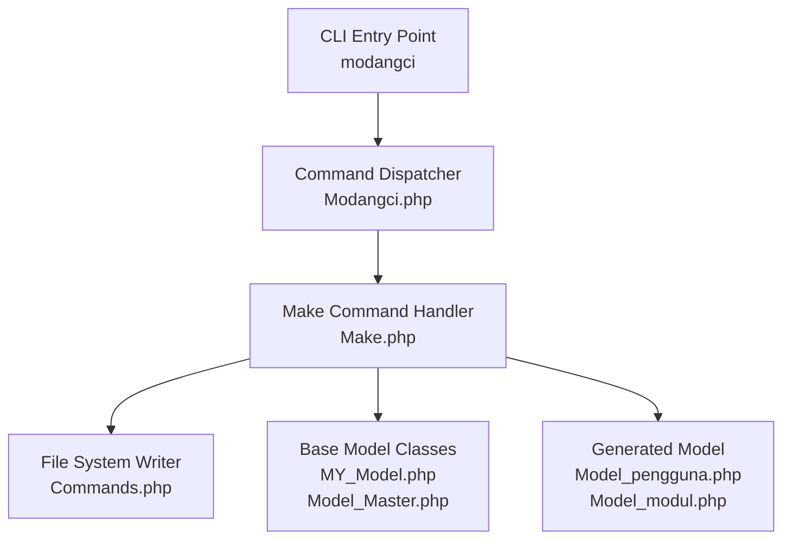
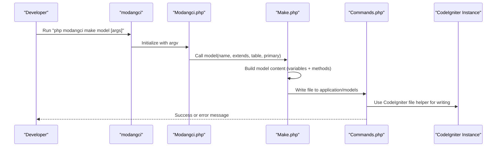
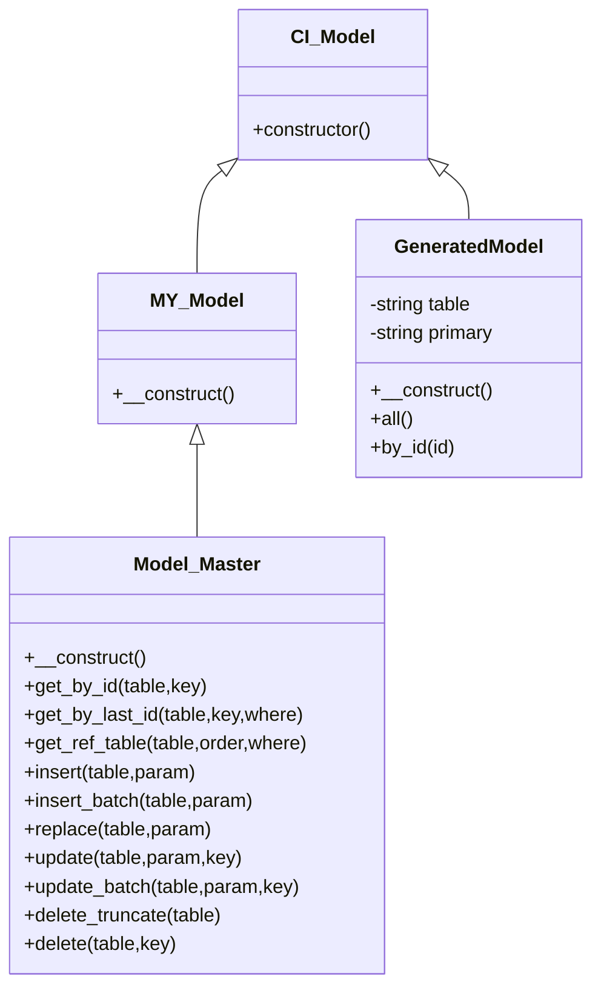
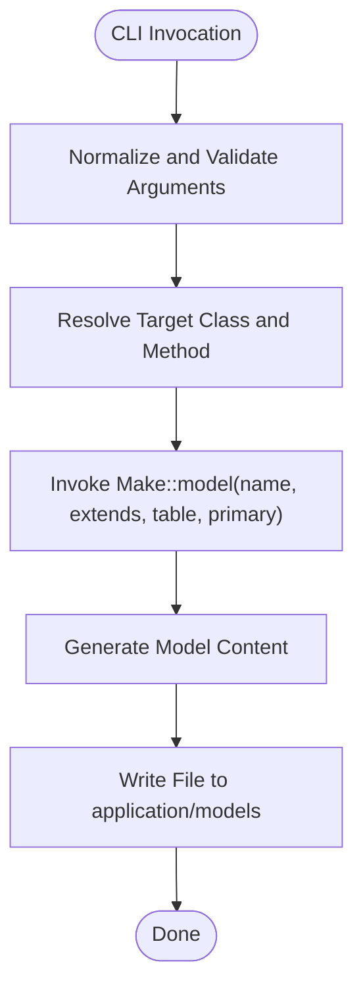
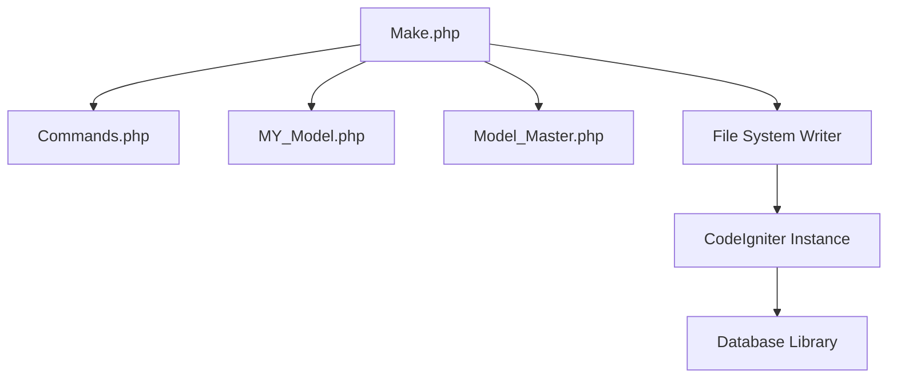

# Model Generation

<cite>
**Referenced Files in This Document**
- [Make.php](file://src/commands/Make.php)
- [Commands.php](file://src/Commands.php)
- [Modangci.php](file://src/Modangci.php)
- [MY_Model.php](file://src/application/core/MY_Model.php)
- [Model_Master.php](file://src/application/core/Model_Master.php)
- [Model_pengguna.php](file://src/application/models/Model_pengguna.php)
- [Model_modul.php](file://src/application/models/Model_modul.php)
- [modangci](file://modangci)
- [ci_instance.php](file://ci_instance.php)
- [README.md](file://README.md)
</cite>

## Table of Contents
1. [Introduction](#introduction)
2. [Project Structure](#project-structure)
3. [Core Components](#core-components)
4. [Architecture Overview](#architecture-overview)
5. [Detailed Component Analysis](#detailed-component-analysis)
6. [Dependency Analysis](#dependency-analysis)
7. [Performance Considerations](#performance-considerations)
8. [Troubleshooting Guide](#troubleshooting-guide)
9. [Conclusion](#conclusion)

## Introduction
This document explains how to generate CodeIgniter models using the make model command. It covers the command syntax, parameter usage for database integration, automatic method generation, and the resulting model structure. It also provides examples and guidance for integrating with CodeIgniter's database library, along with common issues and solutions.

## Project Structure
The model generation feature is implemented as part of a CLI tool that scaffolds CodeIgniter components. The relevant parts of the repository include:
- CLI command dispatcher and argument parsing
- Command classes that generate files
- Base model classes that generated models extend
- Example models showing real-world usage

**Diagram sources**
- [modangci:1-26](file://modangci#L1-L26)
- [Modangci.php:1-60](file://src/Modangci.php#L1-L60)
- [Make.php:1-211](file://src/commands/Make.php#L1-L211)
- [Commands.php:1-135](file://src/Commands.php#L1-L135)
- [MY_Model.php:1-21](file://src/application/core/MY_Model.php#L1-L21)
- [Model_Master.php:1-257](file://src/application/core/Model_Master.php#L1-L257)
- [Model_pengguna.php:1-36](file://src/application/models/Model_pengguna.php#L1-L36)
- [Model_modul.php:1-37](file://src/application/models/Model_modul.php#L1-L37)

**Section sources**
- [README.md:1-41](file://README.md#L1-L41)
- [Modangci.php:1-60](file://src/Modangci.php#L1-L60)
- [Make.php:1-211](file://src/commands/Make.php#L1-L211)
- [Commands.php:1-135](file://src/Commands.php#L1-L135)

## Core Components
- Command dispatcher: Parses CLI arguments and routes to the appropriate command handler.
- Make command handler: Generates model files with configurable base class, table, and primary key.
- Base model classes: Provide foundational database operations and extendability.
- File system writer: Creates directories and files with proper checks for existence and permissions.

Key responsibilities:
- Parse command arguments and validate parameters.
- Generate model skeleton with protected properties and methods.
- Integrate with CodeIgniter's database library for query execution.
- Provide helpful error messages for common issues.

**Section sources**
- [Modangci.php:10-41](file://src/Modangci.php#L10-L41)
- [Make.php:75-127](file://src/commands/Make.php#L75-L127)
- [Commands.php:59-92](file://src/Commands.php#L59-L92)
- [MY_Model.php:1-21](file://src/application/core/MY_Model.php#L1-L21)
- [Model_Master.php:1-257](file://src/application/core/Model_Master.php#L1-L257)

## Architecture Overview
The model generation process follows a clear flow from CLI invocation to file creation and integration with CodeIgniter’s MVC framework.

**Diagram sources**
- [modangci:1-26](file://modangci#L1-L26)
- [Modangci.php:10-41](file://src/Modangci.php#L10-L41)
- [Make.php:75-127](file://src/commands/Make.php#L75-L127)
- [Commands.php:76-92](file://src/Commands.php#L76-L92)
- [ci_instance.php:1-87](file://ci_instance.php#L1-L87)

## Detailed Component Analysis

### Command Syntax and Parameters
- Syntax: `php modangci make model [name] [--extends=BaseClass] [--table=TableName] [--primary=PrimaryKey]`
- Parameters:
  - name: Required. The model name (converted to Model_name).
  - --extends: Optional. Base class to extend (defaults to CI_Model if not provided).
  - --table: Optional. Database table name for automatic query methods.
  - --primary: Optional. Primary key field name for by_id() method.

Behavior:
- If --table is provided, a protected table property and an all() method are generated.
- If both --table and --primary are provided, a protected primary property and a by_id($id) method are generated.
- The generated model extends either the specified base class or CI_Model by default.

Examples:
- Simple model: `php modangci make model User`
- Model with database integration: `php modangci make model User --table=user_table`
- Model with custom base class: `php modangci make model User --extends=Model_Master`
- Full integration: `php modangci make model User --table=user_table --primary=id`

**Section sources**
- [README.md:15-21](file://README.md#L15-L21)
- [Make.php:75-127](file://src/commands/Make.php#L75-L127)

### Generated Model Structure
The generated model includes:
- Protected properties:
  - table: set to the provided table name when --table is used.
  - primary: set to the provided primary key when both --table and --primary are used.
- Constructor: Calls the parent constructor.
- Methods:
  - all(): Executes SELECT * FROM table and returns results or false.
  - by_id($id): Executes SELECT * FROM table WHERE primary = $id and returns a single row or false.

Integration with CodeIgniter:
- Uses $this->db for queries.
- Relies on CodeIgniter’s database library loaded via the base model class.

Example of generated SQL:
- all(): SELECT * FROM table
- by_id($id): SELECT * FROM table WHERE primary = $id

Note: The current implementation uses a placeholder variable name for the WHERE clause in by_id(). This is documented in the Troubleshooting Guide.

**Section sources**
- [Make.php:84-111](file://src/commands/Make.php#L84-L111)
- [Model_pengguna.php:1-36](file://src/application/models/Model_pengguna.php#L1-L36)
- [Model_modul.php:1-37](file://src/application/models/Model_modul.php#L1-L37)

### Method Generation Details

#### all() Method
Purpose: Fetch all records from the associated table.
Logic:
- Select all columns.
- From the table stored in the protected table property.
- Execute query and return result set or false.

Complexity:
- Time: O(n) where n is the number of rows.
- Space: Proportional to result set size.

Integration:
- Uses CodeIgniter’s database library for query building and execution.

**Section sources**
- [Make.php:86-95](file://src/commands/Make.php#L86-L95)

#### by_id($id) Method
Purpose: Retrieve a single record by its primary key.
Logic:
- Select all columns.
- From the table stored in the protected table property.
- Apply WHERE condition using the primary key field.
- Return single row or false.

Complexity:
- Time: O(log n) average for indexed primary key, O(n) worst-case for unindexed keys.
- Space: Single row result.

Integration:
- Uses CodeIgniter’s database library for query building and execution.

Notes:
- The current implementation uses a placeholder variable name for the WHERE clause. See Troubleshooting Guide for details.

**Section sources**
- [Make.php:100-111](file://src/commands/Make.php#L100-L111)

### Base Model Classes
- MY_Model: Minimal extension of CI_Model with constructor delegation.
- Model_Master: Extends MY_Model and provides comprehensive CRUD and query utilities, including transaction-aware operations and debugging hooks.

Benefits:
- Reusability: Generated models can extend Model_Master for richer functionality.
- Consistency: Shared patterns for database operations across models.

**Section sources**
- [MY_Model.php:1-21](file://src/application/core/MY_Model.php#L1-L21)
- [Model_Master.php:1-257](file://src/application/core/Model_Master.php#L1-L257)

### Example Models
Existing models demonstrate practical usage:
- Model_pengguna: Extends Model_Master, defines table, and implements all() and by_id() with joins and ordering.
- Model_modul: Extends Model_Master, defines table, and implements all() and by_id() with joins and ordering.

These examples illustrate how generated models can be extended with additional logic while maintaining the base structure.

**Section sources**
- [Model_pengguna.php:1-36](file://src/application/models/Model_pengguna.php#L1-L36)
- [Model_modul.php:1-37](file://src/application/models/Model_modul.php#L1-L37)

## Architecture Overview

**Diagram sources**
- [MY_Model.php:1-21](file://src/application/core/MY_Model.php#L1-L21)
- [Model_Master.php:1-257](file://src/application/core/Model_Master.php#L1-L257)
- [Make.php:75-127](file://src/commands/Make.php#L75-L127)

## Detailed Component Analysis

### CLI Argument Parsing and Dispatch
- The CLI entry point initializes the CodeIgniter instance and passes argv to the dispatcher.
- Arguments are normalized and validated; allowed parameters include -r and --resource.
- The dispatcher resolves the target class and method, then invokes the Make command handler with parsed arguments.

**Diagram sources**
- [modangci:1-26](file://modangci#L1-L26)
- [Modangci.php:10-41](file://src/Modangci.php#L10-L41)
- [Make.php:75-127](file://src/commands/Make.php#L75-L127)
- [Commands.php:76-92](file://src/Commands.php#L76-L92)

**Section sources**
- [Modangci.php:10-41](file://src/Modangci.php#L10-L41)
- [Make.php:75-127](file://src/commands/Make.php#L75-L127)
- [Commands.php:76-92](file://src/Commands.php#L76-L92)

### File Creation and Validation
- The file system writer checks for existing directories and files to prevent overwrites.
- It uses CodeIgniter’s file helper to write content and provides user feedback on success or failure.

Common outcomes:
- Success: "Model: Model_name was created!!"
- Failure: "This Model: Model_name file already exists." or "Unable to write the file Model: Model_name."

**Section sources**
- [Commands.php:59-92](file://src/Commands.php#L59-L92)

### Integration with CodeIgniter Database Library
- Generated models rely on $this->db for query construction and execution.
- They extend either CI_Model or a custom base class that loads the database library.
- The database library is accessed through the base model class, ensuring availability in generated models.

**Section sources**
- [MY_Model.php:1-21](file://src/application/core/MY_Model.php#L1-L21)
- [Model_Master.php:1-257](file://src/application/core/Model_Master.php#L1-L257)
- [Make.php:86-111](file://src/commands/Make.php#L86-L111)

## Dependency Analysis

**Diagram sources**
- [Make.php:1-211](file://src/commands/Make.php#L1-L211)
- [Commands.php:1-135](file://src/Commands.php#L1-L135)
- [MY_Model.php:1-21](file://src/application/core/MY_Model.php#L1-L21)
- [Model_Master.php:1-257](file://src/application/core/Model_Master.php#L1-L257)
- [ci_instance.php:1-87](file://ci_instance.php#L1-L87)

**Section sources**
- [Make.php:1-211](file://src/commands/Make.php#L1-L211)
- [Commands.php:1-135](file://src/Commands.php#L1-L135)
- [ci_instance.php:1-87](file://ci_instance.php#L1-L87)

## Performance Considerations
- Query efficiency: Using all() returns the entire table; consider adding filters or pagination for large datasets.
- Indexing: Ensure the primary key is indexed to optimize by_id() performance.
- Transactions: When extending Model_Master, batch operations benefit from transaction handling to maintain consistency.
- Memory usage: Large result sets can consume memory; consider streaming or limiting results.

## Troubleshooting Guide

Common issues and resolutions:
- Invalid table name:
  - Symptom: Generated methods may produce incorrect queries.
  - Resolution: Verify the table name exists in the database and is spelled correctly.
- Missing database configuration:
  - Symptom: Queries fail or database library is unavailable.
  - Resolution: Ensure CodeIgniter’s database configuration is present and loaded before using generated models.
- Method generation failures:
  - Symptom: by_id() does not apply WHERE clause correctly.
  - Cause: The current implementation uses a placeholder variable name for the WHERE clause.
  - Resolution: Extend the generated model and implement the by_id() method manually to use the correct primary key variable name.
- File conflicts:
  - Symptom: "This Model: Model_name file already exists."
  - Resolution: Remove the existing file or choose a different model name.
- Permission errors:
  - Symptom: "Unable to write the file Model: Model_name."
  - Resolution: Check write permissions for the application/models directory.

SQL examples:
- all(): SELECT * FROM table
- by_id($id): SELECT * FROM table WHERE primary = $id

Note: The placeholder variable name in by_id() prevents correct WHERE clause generation. Implement the method manually to fix this.

**Section sources**
- [Make.php:100-111](file://src/commands/Make.php#L100-L111)
- [Commands.php:76-92](file://src/Commands.php#L76-L92)

## Conclusion
The make model command streamlines CodeIgniter model creation with optional database integration. By specifying --table and --primary, developers can quickly generate models with essential query methods. While the current implementation provides a solid foundation, manual adjustments may be needed for precise WHERE clause handling in by_id(). Integrating with base model classes enhances functionality and maintains consistency across the application.