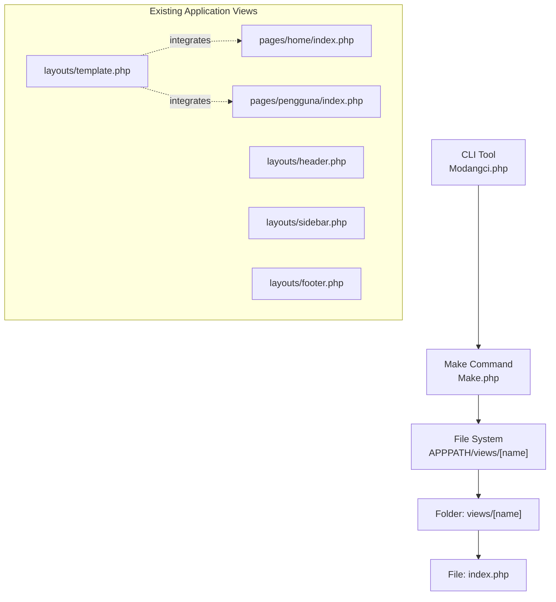
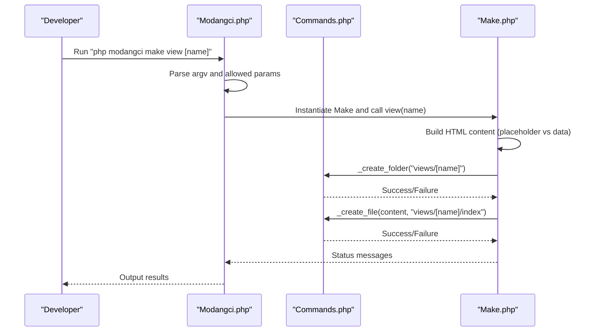
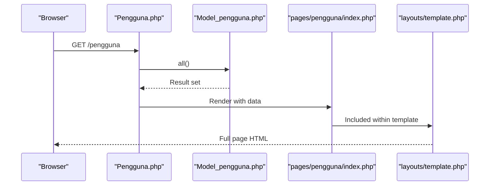
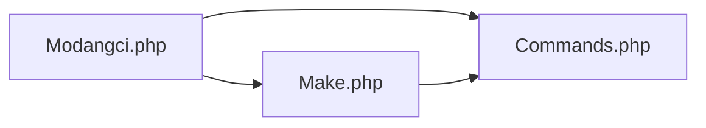

# View Generation

<cite>
**Referenced Files in This Document**
- [Make.php](file://src/commands/Make.php)
- [Commands.php](file://src/Commands.php)
- [Modangci.php](file://src/Modangci.php)
- [template.php](file://src/application/views/layouts/template.php)
- [header.php](file://src/application/views/layouts/header.php)
- [sidebar.php](file://src/application/views/layouts/sidebar.php)
- [footer.php](file://src/application/views/layouts/footer.php)
- [index.php](file://src/application/views/pages/home/index.php)
- [index.php](file://src/application/views/pages/pengguna/index.php)
- [Pengguna.php](file://src/application/controllers/Pengguna.php)
- [Model_pengguna.php](file://src/application/models/Model_pengguna.php)
</cite>

## Table of Contents
1. [Introduction](#introduction)
2. [Project Structure](#project-structure)
3. [Core Components](#core-components)
4. [Architecture Overview](#architecture-overview)
5. [Detailed Component Analysis](#detailed-component-analysis)
6. [Dependency Analysis](#dependency-analysis)
7. [Performance Considerations](#performance-considerations)
8. [Troubleshooting Guide](#troubleshooting-guide)
9. [Conclusion](#conclusion)

## Introduction
This document explains how to generate views using the make view command in the CLI tool. It covers the command syntax, generated file structure, default HTML content, and how the -r flag influences view generation. It also demonstrates how generated views integrate with controllers and models, and provides guidance for common issues such as invalid names, missing directories, and file permission errors.

## Project Structure
The CLI tool resides under src/ and generates files under the CodeIgniter application directory (APPPATH). The view generator creates a dedicated folder per view name and places an index.php file inside it. Existing application views demonstrate a layered layout system that integrates pages into a master template.

**Diagram sources**
- [Modangci.php:10-41](file://src/Modangci.php#L10-L41)
- [Make.php:172-194](file://src/commands/Make.php#L172-L194)
- [template.php:1-180](file://src/application/views/layouts/template.php#L1-L180)
- [index.php:1-7](file://src/application/views/pages/home/index.php#L1-L7)
- [index.php:1-98](file://src/application/views/pages/pengguna/index.php#L1-L98)

**Section sources**
- [Modangci.php:10-41](file://src/Modangci.php#L10-L41)
- [Make.php:172-194](file://src/commands/Make.php#L172-L194)

## Core Components
- CLI entrypoint parses arguments and routes to the appropriate command class and method.
- The Make command implements view generation, including folder creation and file writing.
- The Commands base class provides shared helpers for creating folders and files, including existence checks and error messaging.

Key behaviors:
- Command syntax: make view [name]
- Generates APPPATH/views/[lowercase name]/index.php
- Default content includes HTML5 boilerplate, a title tag, and a body with either a placeholder or data display depending on context.

**Section sources**
- [Modangci.php:36-53](file://src/Modangci.php#L36-L53)
- [Make.php:172-194](file://src/commands/Make.php#L172-L194)
- [Commands.php:59-97](file://src/Commands.php#L59-L97)

## Architecture Overview
The CLI command pipeline and view generation flow are illustrated below.

**Diagram sources**
- [Modangci.php:19-41](file://src/Modangci.php#L19-L41)
- [Make.php:172-194](file://src/commands/Make.php#L172-L194)
- [Commands.php:59-97](file://src/Commands.php#L59-L97)

## Detailed Component Analysis

### make view command
- Purpose: Generate a new view folder and index.php file.
- Syntax: php modangci make view [name]
- Behavior:
  - Creates a folder named after the lowercase view name under views/.
  - Writes an index.php file containing HTML5 boilerplate, a title tag, and a body with default content.
  - Default body content is a placeholder heading when not invoked via CRUD mode.
  - The -r flag does not affect the view command directly; it controls controller/model generation for CRUD scaffolding.

Generated structure:
- Folder: application/views/[lowercase name]/
- File: application/views/[lowercase name]/index.php

Default content highlights:
- HTML5 doctype and head/title/body structure
- Title tag set to the view name
- Body content includes either a placeholder heading or data display (see next section)

**Section sources**
- [Make.php:172-194](file://src/commands/Make.php#L172-L194)

### Data presentation in views
- When invoked indirectly via the CRUD workflow (make crud [name]), the view’s body displays data passed from the controller.
- The controller loads a model and passes data to the view; the view renders the data accordingly.

Integration example:
- Controller loads a model and sets data arrays.
- The view receives and iterates over the data to render lists or forms.

Note: The -r flag does not alter the view command itself but enables CRUD scaffolding that includes data-driven views.

**Section sources**
- [Make.php:178-181](file://src/commands/Make.php#L178-L181)
- [Pengguna.php:22-32](file://src/application/controllers/Pengguna.php#L22-L32)
- [index.php:50-83](file://src/application/views/pages/pengguna/index.php#L50-L83)

### Bootstrap-styled views
- The application uses a master template that includes Bootstrap-based assets and layout components.
- While the CLI-generated view is minimal, integrating it into the existing layout system is straightforward:
  - Load the master template in the controller.
  - Pass the view path to the template so it renders the page content within the layout.

Reference layout and integration points:
- Master template includes CSS/JS bundles and layout partials.
- Pages are loaded inside the template via a variable that resolves to the page view path.

**Section sources**
- [template.php:14-51](file://src/application/views/layouts/template.php#L14-L51)
- [template.php:95-100](file://src/application/views/layouts/template.php#L95-L100)
- [header.php:1-98](file://src/application/views/layouts/header.php#L1-L98)
- [sidebar.php:1-128](file://src/application/views/layouts/sidebar.php#L1-L128)
- [footer.php:1-11](file://src/application/views/layouts/footer.php#L1-L11)

### Controller and model integration
- Controllers load models, gather data, and pass it to views.
- Views receive data arrays and render them appropriately.
- The example controller demonstrates:
  - Loading a master template and a page-specific view.
  - Passing data arrays and action URLs to the view.

**Diagram sources**
- [Pengguna.php:22-32](file://src/application/controllers/Pengguna.php#L22-L32)
- [Model_pengguna.php:11-21](file://src/application/models/Model_pengguna.php#L11-L21)
- [index.php:1-98](file://src/application/views/pages/pengguna/index.php#L1-L98)
- [template.php:95-100](file://src/application/views/layouts/template.php#L95-L100)

**Section sources**
- [Pengguna.php:22-32](file://src/application/controllers/Pengguna.php#L22-L32)
- [Model_pengguna.php:11-21](file://src/application/models/Model_pengguna.php#L11-L21)
- [index.php:50-83](file://src/application/views/pages/pengguna/index.php#L50-L83)

### Examples

- Simple view with basic HTML structure:
  - Command: php modangci make view product
  - Generated: application/views/product/index.php with HTML5 boilerplate and a placeholder heading in the body.

- View with data presentation:
  - Command: php modangci make crud product
  - Generated: controller, model, and view configured to display data from the model.
  - The view renders a table of records using the data passed by the controller.

Note: The -r flag does not modify the view command directly; it is used for controller/model generation in CRUD scaffolding.

**Section sources**
- [Make.php:172-194](file://src/commands/Make.php#L172-L194)
- [Make.php:196-209](file://src/commands/Make.php#L196-L209)

## Dependency Analysis
The CLI command depends on the Commands base class for filesystem operations and routing. The Make command encapsulates view generation logic and delegates file/folder creation to shared helpers.

**Diagram sources**
- [Modangci.php:36-53](file://src/Modangci.php#L36-L53)
- [Make.php:172-194](file://src/commands/Make.php#L172-L194)
- [Commands.php:59-97](file://src/Commands.php#L59-L97)

**Section sources**
- [Modangci.php:36-53](file://src/Modangci.php#L36-L53)
- [Make.php:172-194](file://src/commands/Make.php#L172-L194)
- [Commands.php:59-97](file://src/Commands.php#L59-L97)

## Performance Considerations
- View generation is a one-time operation; performance is negligible.
- When rendering data-heavy views, ensure efficient queries in models and avoid unnecessary loops in views.
- Use pagination or limits for large datasets to reduce payload size.

## Troubleshooting Guide
Common issues and resolutions:
- Invalid view name:
  - Ensure the name contains only letters and underscores and is not empty.
  - The CLI validates parameters and rejects disallowed values.

- Missing parent directories:
  - The generator creates the view folder recursively. If the APPPATH/views directory is not writable, creation fails.
  - Verify write permissions for APPPATH and APPPATH/views.

- File creation permissions:
  - The generator writes index.php under the view folder. If the destination is not writable, the operation fails.
  - Confirm that the web server user has write access to APPPATH/views/[name].

- Overwriting existing files:
  - The generator checks for existing files and folders and reports conflicts instead of overwriting.

- Integrating with templates:
  - To apply Bootstrap styles, load the master template in your controller and pass the page view path to the template.

**Section sources**
- [Modangci.php:24-32](file://src/Modangci.php#L24-L32)
- [Commands.php:62-73](file://src/Commands.php#L62-L73)
- [Commands.php:78-91](file://src/Commands.php#L78-L91)

## Conclusion
The make view command provides a quick way to scaffold a new view with a clean HTML5 structure. Combined with the existing layout system and CRUD scaffolding, developers can rapidly create styled, data-driven pages that integrate seamlessly with controllers and models. Pay attention to naming rules, directory permissions, and template integration for smooth development.