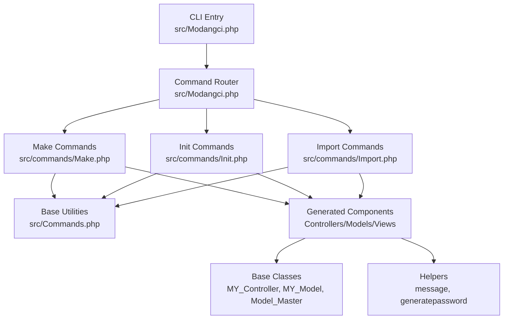
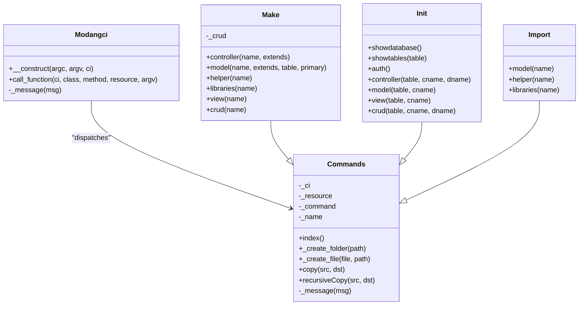
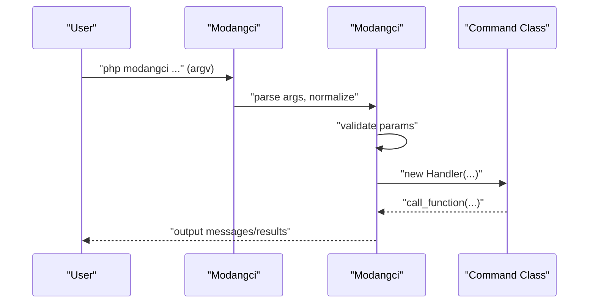
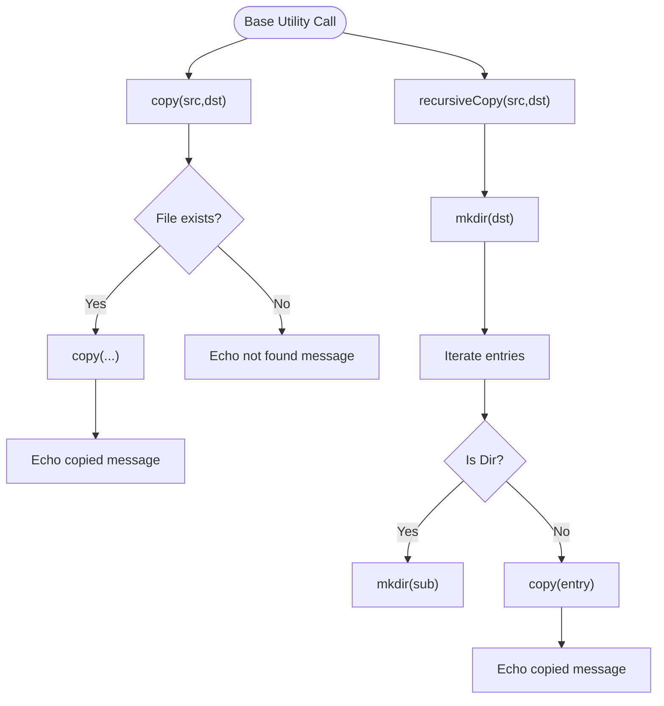
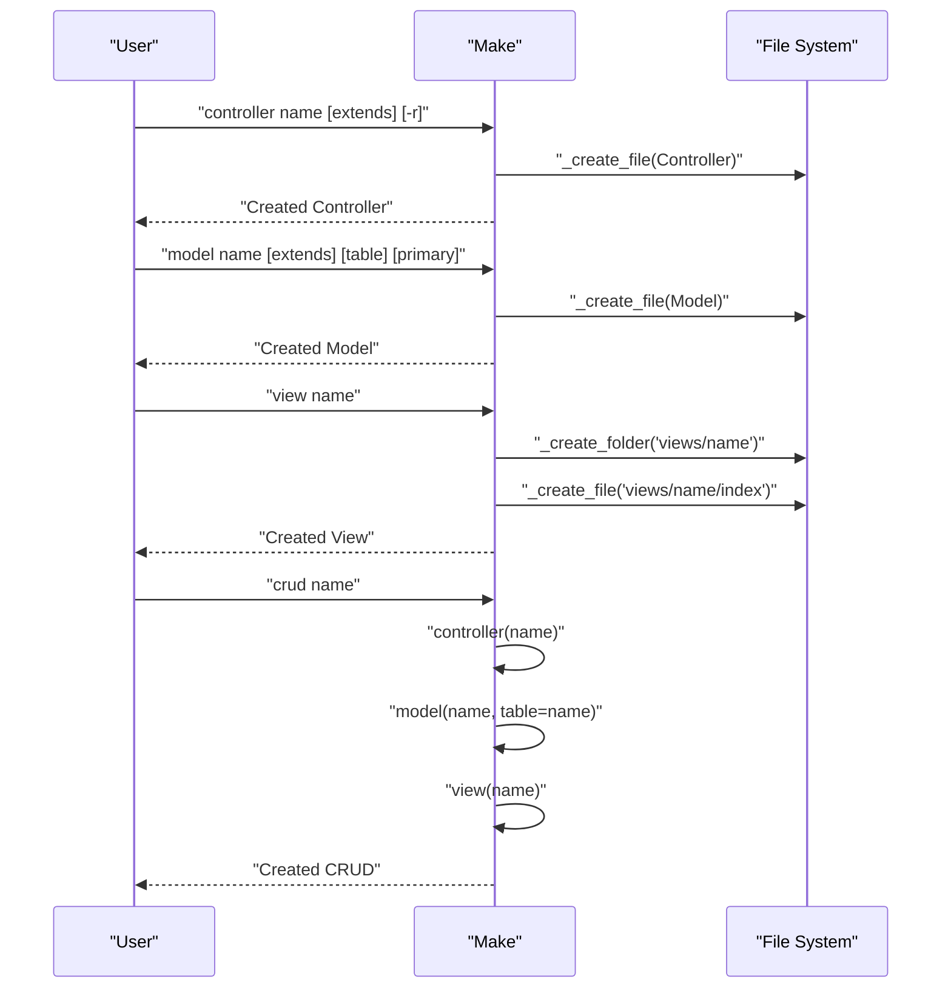
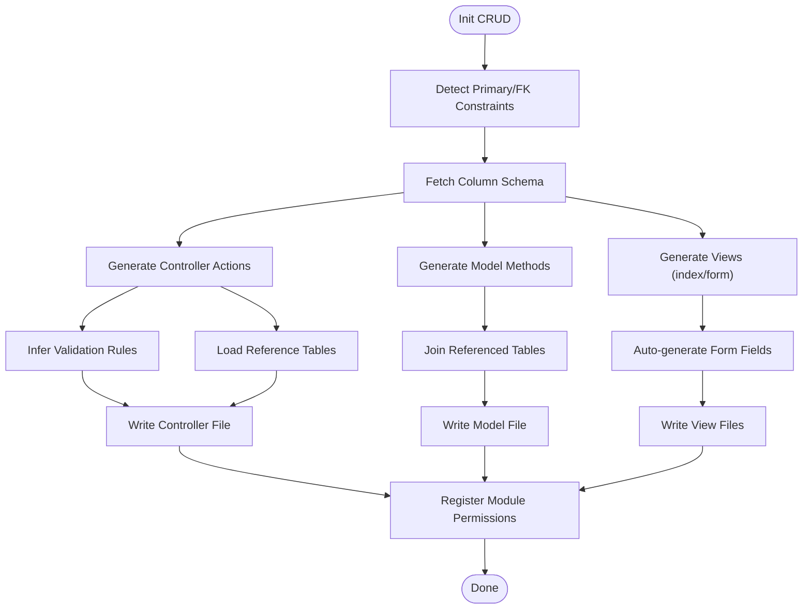
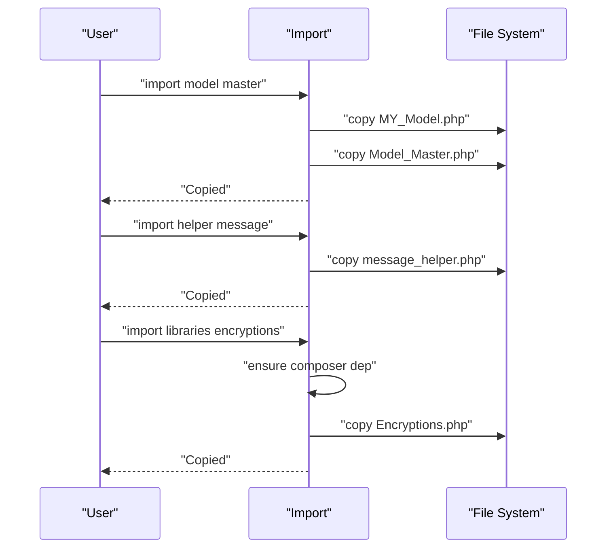
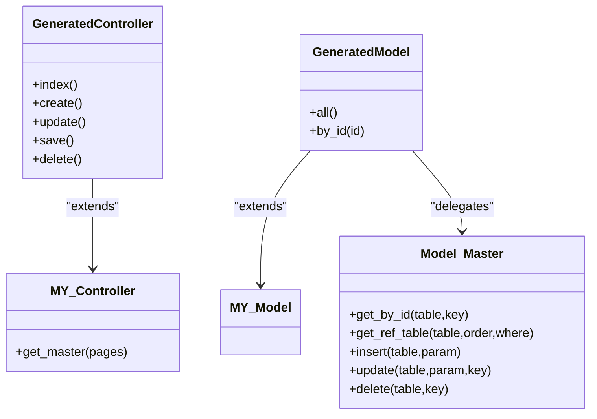
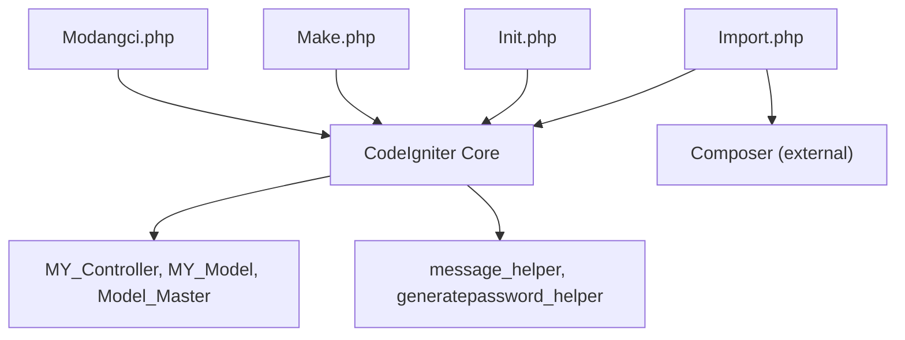

# Code Generation System

<cite>
**Referenced Files in This Document**
- [Modangci.php](file://src/Modangci.php)
- [Commands.php](file://src/Commands.php)
- [Make.php](file://src/commands/Make.php)
- [Init.php](file://src/commands/Init.php)
- [Import.php](file://src/commands/Import.php)
- [MY_Controller.php](file://src/application/core/MY_Controller.php)
- [MY_Model.php](file://src/application/core/MY_Model.php)
- [Model_Master.php](file://src/application/core/Model_Master.php)
- [message_helper.php](file://src/application/helpers/message_helper.php)
- [generatepassword_helper.php](file://src/application/helpers/generatepassword_helper.php)
- [README.md](file://README.md)
</cite>

## Table of Contents
1. [Introduction](#introduction)
2. [Project Structure](#project-structure)
3. [Core Components](#core-components)
4. [Architecture Overview](#architecture-overview)
5. [Detailed Component Analysis](#detailed-component-analysis)
6. [Dependency Analysis](#dependency-analysis)
7. [Performance Considerations](#performance-considerations)
8. [Troubleshooting Guide](#troubleshooting-guide)
9. [Conclusion](#conclusion)
10. [Appendices](#appendices)

## Introduction
This document explains Modangci’s automated component creation system for CodeIgniter 3. It covers the template architecture, generation algorithms, and integration with CodeIgniter conventions. It documents the component generation process for controllers (with optional CRUD methods), models (with database table mapping), views (with Bootstrap integration), and complete CRUD operation generation. It also details the resource generation option (-r flag), custom base class extensions, and template customization capabilities. Examples of generated code structure, naming conventions, and integration patterns are included, along with advanced features such as foreign key handling, validation rule inference, and automatic form field generation. Guidance is provided for customization, template modification, and extending the generation system.

## Project Structure
Modangci is organized around a CLI entry point and modular command handlers:
- CLI entry and routing: src/Modangci.php
- Base command utilities: src/Commands.php
- Generation commands: src/commands/Make.php, src/commands/Init.php, src/commands/Import.php
- CodeIgniter base classes and helpers used by generated components: src/application/core/*, src/application/helpers/*

**Diagram sources**
- [Modangci.php:1-60](file://src/Modangci.php#L1-L60)
- [Make.php:1-211](file://src/commands/Make.php#L1-L211)
- [Init.php:1-917](file://src/commands/Init.php#L1-L917)
- [Import.php:1-53](file://src/commands/Import.php#L1-L53)
- [MY_Controller.php:1-59](file://src/application/core/MY_Controller.php#L1-L59)
- [MY_Model.php:1-21](file://src/application/core/MY_Model.php#L1-L21)
- [Model_Master.php:1-257](file://src/application/core/Model_Master.php#L1-L257)
- [message_helper.php:1-22](file://src/application/helpers/message_helper.php#L1-L22)
- [generatepassword_helper.php:1-26](file://src/application/helpers/generatepassword_helper.php#L1-L26)

**Section sources**
- [README.md:1-41](file://README.md#L1-L41)
- [Modangci.php:1-60](file://src/Modangci.php#L1-L60)

## Core Components
- CLI entry and routing: Parses arguments, validates parameters, and dispatches to the appropriate command class and method.
- Base command utilities: Provides shared helpers for copying files/folders, creating directories and files, and messaging.
- Make commands: Generates controllers, models, helpers, libraries, standalone views, and full CRUD scaffolds.
- Init commands: Scaffolds authentication, controllers, models, views, and full CRUD with database introspection and Bootstrap integration.
- Import commands: Copies prebuilt components (controllers, models, helpers, libraries) into the application.

Key responsibilities:
- Argument parsing and validation
- Template composition and file writing
- Integration with CodeIgniter conventions (namespaces, base classes, helpers)
- Advanced features: foreign key detection, validation inference, Bootstrap form generation

**Section sources**
- [Modangci.php:10-53](file://src/Modangci.php#L10-L53)
- [Commands.php:20-97](file://src/Commands.php#L20-L97)
- [Make.php:16-211](file://src/commands/Make.php#L16-L211)
- [Init.php:480-917](file://src/commands/Init.php#L480-L917)
- [Import.php:14-52](file://src/commands/Import.php#L14-L52)

## Architecture Overview
The system follows a layered architecture:
- CLI layer: src/Modangci.php parses arguments and routes to command handlers.
- Command layer: src/commands/Make.php, src/commands/Init.php, src/commands/Import.php implement generation logic.
- Base utilities: src/Commands.php provides file/folder operations and messaging.
- Generated components integrate with CodeIgniter base classes and helpers.

**Diagram sources**
- [Modangci.php:7-59](file://src/Modangci.php#L7-L59)
- [Commands.php:7-97](file://src/Commands.php#L7-L97)
- [Make.php:7-211](file://src/commands/Make.php#L7-L211)
- [Init.php:7-917](file://src/commands/Init.php#L7-L917)
- [Import.php:7-52](file://src/commands/Import.php#L7-L52)

## Detailed Component Analysis

### CLI Entry and Routing
- Validates CLI context and rejects non-CLI invocations.
- Normalizes arguments and extracts allowed flags (e.g., -r, --resource).
- Builds the target class and method names and invokes the handler.
- Falls back to printing available commands if the method does not exist.

**Diagram sources**
- [Modangci.php:10-53](file://src/Modangci.php#L10-L53)

**Section sources**
- [Modangci.php:10-53](file://src/Modangci.php#L10-L53)

### Base Command Utilities
- Provides shared operations for copying single files, recursive directory copying, creating folders, and writing files.
- Centralizes messaging and error reporting.

**Diagram sources**
- [Commands.php:20-57](file://src/Commands.php#L20-L57)

**Section sources**
- [Commands.php:20-97](file://src/Commands.php#L20-L97)

### Make Commands: Controllers, Models, Views, Helpers, Libraries, and CRUD
- Controller generation:
  - Supports custom base class extension via an optional second argument.
  - Optional CRUD methods via the -r flag: response, create, update, save, delete.
  - Loads a model and renders a view when in CRUD mode.
- Model generation:
  - Supports custom base class extension.
  - Optional table mapping and primary key injection to generate convenience methods (all, by_id).
- Helper and Library generation:
  - Creates boilerplate files with proper CodeIgniter conventions.
- View generation:
  - Creates a basic HTML page or integrates with CRUD data when in CRUD mode.
- CRUD generation:
  - Orchestrates controller, model, and view creation with a unified flag.

**Diagram sources**
- [Make.php:16-211](file://src/commands/Make.php#L16-L211)
- [Commands.php:76-92](file://src/Commands.php#L76-L92)

**Section sources**
- [Make.php:16-211](file://src/commands/Make.php#L16-L211)
- [Commands.php:76-92](file://src/Commands.php#L76-L92)

### Init Commands: Authentication, Controllers, Models, Views, and CRUD with Database Introspection
- Authentication scaffolding:
  - Creates tables for user groups, units, modules, and users.
  - Seeds default data and sets up referential constraints.
  - Copies core controllers, models, helpers, libraries, views, and assets into the application.
- Controller scaffolding:
  - Uses database introspection to detect primary and foreign keys.
  - Infers validation rules from schema (nullable vs required, auto-increment exclusion).
  - Generates AJAX-aware save/update/delete actions with encryption for keys.
  - Loads related reference tables for foreign key fields.
- Model scaffolding:
  - Extends Model_Master and generates all/by_id methods with joins for foreign keys.
- View scaffolding:
  - Generates index and form pages with Bootstrap classes.
  - Automatically creates form controls for referenced tables (select) and others (text).
  - Includes pagination-ready table rendering and action buttons.
- CRUD scaffolding:
  - Chains controller, model, and view generation and registers module permissions.

**Diagram sources**
- [Init.php:57-108](file://src/commands/Init.php#L57-L108)
- [Init.php:480-640](file://src/commands/Init.php#L480-L640)
- [Init.php:642-701](file://src/commands/Init.php#L642-L701)
- [Init.php:703-892](file://src/commands/Init.php#L703-L892)
- [Init.php:894-917](file://src/commands/Init.php#L894-L917)

**Section sources**
- [Init.php:125-478](file://src/commands/Init.php#L125-L478)
- [Init.php:480-917](file://src/commands/Init.php#L480-L917)

### Import Commands: Prebuilt Component Distribution
- Copies core base classes, helpers, and libraries into the application.
- Handles Composer dependencies for certain libraries (e.g., PDF generator).

**Diagram sources**
- [Import.php:14-52](file://src/commands/Import.php#L14-L52)

**Section sources**
- [Import.php:14-52](file://src/commands/Import.php#L14-L52)

### Generated Component Integration with CodeIgniter Conventions
- Controllers extend MY_Controller (or custom base class) and use a consistent template pattern with breadcrumb, menus, and permission checks.
- Models extend MY_Model and delegate persistence to Model_Master for transaction-safe CRUD operations.
- Helpers provide reusable utilities (e.g., JSON message responses, password generation).
- Views integrate with Bootstrap and layout templates, using form controls inferred from schema.

**Diagram sources**
- [MY_Controller.php:3-59](file://src/application/core/MY_Controller.php#L3-L59)
- [MY_Model.php:3-21](file://src/application/core/MY_Model.php#L3-L21)
- [Model_Master.php:2-257](file://src/application/core/Model_Master.php#L2-L257)
- [Make.php:16-127](file://src/commands/Make.php#L16-L127)
- [Init.php:480-701](file://src/commands/Init.php#L480-L701)

**Section sources**
- [MY_Controller.php:3-59](file://src/application/core/MY_Controller.php#L3-L59)
- [MY_Model.php:3-21](file://src/application/core/MY_Model.php#L3-L21)
- [Model_Master.php:2-257](file://src/application/core/Model_Master.php#L2-L257)
- [Make.php:16-127](file://src/commands/Make.php#L16-L127)
- [Init.php:480-701](file://src/commands/Init.php#L480-L701)

## Dependency Analysis
- CLI depends on CodeIgniter input and file helpers for CLI detection and file operations.
- Command classes depend on CodeIgniter database and dbforge for Init scaffolding.
- Generated components depend on base classes and helpers for consistent behavior.
- Import command depends on Composer for library dependencies.

**Diagram sources**
- [Modangci.php:10-17](file://src/Modangci.php#L10-L17)
- [Init.php:13-29](file://src/commands/Init.php#L13-L29)
- [Import.php:39-47](file://src/commands/Import.php#L39-L47)

**Section sources**
- [Modangci.php:10-17](file://src/Modangci.php#L10-L17)
- [Init.php:13-29](file://src/commands/Init.php#L13-L29)
- [Import.php:39-47](file://src/commands/Import.php#L39-L47)

## Performance Considerations
- File operations: The system writes files and copies directories. For large projects, consider batching writes and avoiding redundant filesystem checks.
- Database introspection: Init uses INFORMATION_SCHEMA queries to infer schema and constraints. These queries are efficient but should be executed once per scaffold operation.
- Transaction safety: Model_Master wraps CRUD operations in transactions to maintain consistency; ensure database engines support transactions (e.g., InnoDB).
- Bootstrap rendering: Views are generated with Bootstrap classes; ensure asset loading is optimized in production.

[No sources needed since this section provides general guidance]

## Troubleshooting Guide
- Non-CLI invocation: The CLI entry checks for CLI context and exits otherwise. Run commands from the terminal.
- Parameter validation: Arguments are normalized and validated; invalid flags trigger a message and exit. Use documented flags and options.
- File creation failures: Creation methods return false if directories or files cannot be written. Verify permissions and paths.
- Missing Composer dependencies: Import libraries may require Composer packages. Install dependencies before importing.
- Database connectivity: Init requires a working database connection and INFORMATION_SCHEMA access. Ensure database credentials and driver settings are correct.

**Section sources**
- [Modangci.php:13-17](file://src/Modangci.php#L13-L17)
- [Modangci.php:24-32](file://src/Modangci.php#L24-L32)
- [Commands.php:78-91](file://src/Commands.php#L78-L91)
- [Import.php:45-47](file://src/commands/Import.php#L45-L47)
- [Init.php:13-29](file://src/commands/Init.php#L13-L29)

## Conclusion
Modangci provides a robust, convention-driven code generation system for CodeIgniter 3. It supports manual scaffolding via Make commands and intelligent scaffolding via Init commands that leverage database introspection. The system integrates seamlessly with CodeIgniter’s base classes and helpers, generating consistent controllers, models, views, and full CRUD applications. Advanced features such as foreign key handling, validation inference, and Bootstrap form generation streamline development. The modular architecture allows customization and extension for diverse project needs.

[No sources needed since this section summarizes without analyzing specific files]

## Appendices

### Naming Conventions and Generated Code Structure
- Controllers: PascalCase class name; extends CI_Controller or custom base class.
- Models: Model_PascalCase; extends CI_Model or custom base class; optionally includes table and primary key mappings.
- Views: Lowercase folder under views/pages; index.php and form.php for CRUD.
- Helpers: lowercase_helper.php; autoload-friendly structure.
- Libraries: PascalCase class; autoload-friendly structure.

Examples of generated structure:
- Controller: application/controllers/Example.php
- Model: application/models/Model_example.php
- View: application/views/pages/example/index.php, application/views/pages/example/form.php
- Helper: application/helpers/example_helper.php
- Library: application/libraries/Example.php

**Section sources**
- [Make.php:54-124](file://src/commands/Make.php#L54-L124)
- [Make.php:172-194](file://src/commands/Make.php#L172-L194)
- [Init.php:480-917](file://src/commands/Init.php#L480-L917)

### Advanced Features and Capabilities
- Foreign key handling: Init detects foreign keys and generates joins, loads reference tables, and creates select controls for related data.
- Validation rule inference: Rules are derived from schema (required for non-nullable fields, unique constraints for primary keys).
- Automatic form field generation: Based on schema, selects are generated for foreign keys; text inputs for regular fields.
- Resource generation (-r): Adds CRUD methods to controllers for quick prototyping.
- Custom base class extensions: Controllers and models accept custom base classes for shared behavior.

**Section sources**
- [Init.php:57-108](file://src/commands/Init.php#L57-L108)
- [Init.php:504-525](file://src/commands/Init.php#L504-L525)
- [Init.php:726-750](file://src/commands/Init.php#L726-L750)
- [Make.php:22-44](file://src/commands/Make.php#L22-L44)

### Customization and Extension
- Modify templates: Adjust the string templates in Make and Init command files to change generated code structure.
- Add new commands: Extend the Commands base class and register new command classes similarly to Make, Init, and Import.
- Customize base classes: Extend MY_Controller and MY_Model to inject common behaviors; ensure generated components remain compatible.
- Template customization: Replace or augment the copied assets and views during Import or Init to align with project-specific UI frameworks.

**Section sources**
- [Make.php:16-211](file://src/commands/Make.php#L16-L211)
- [Init.php:480-917](file://src/commands/Init.php#L480-L917)
- [Import.php:14-52](file://src/commands/Import.php#L14-L52)