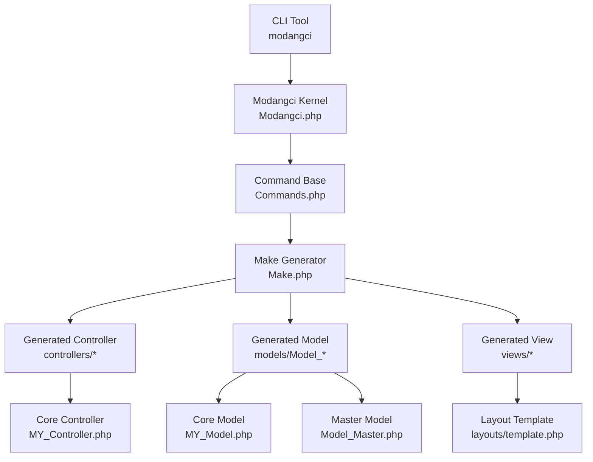
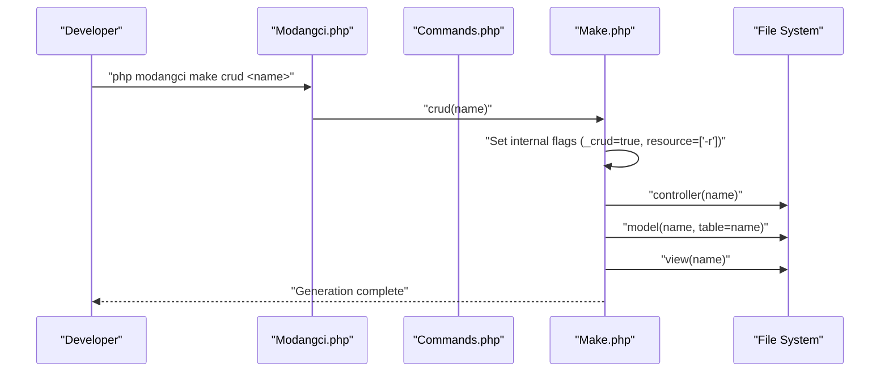
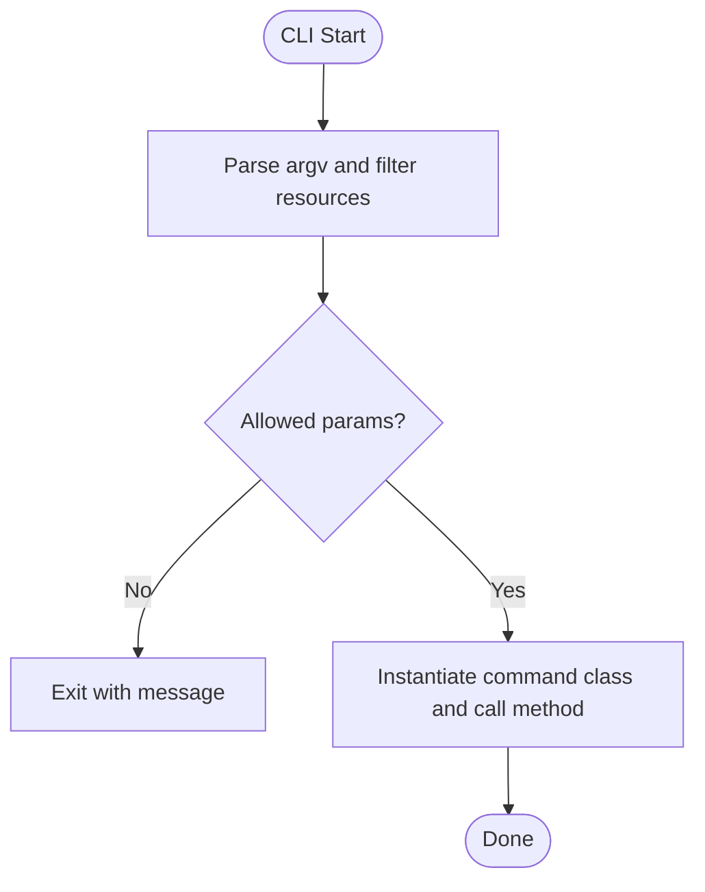
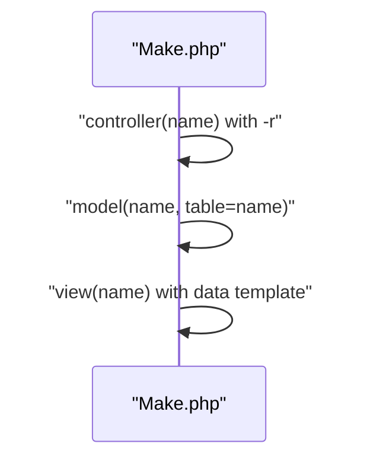
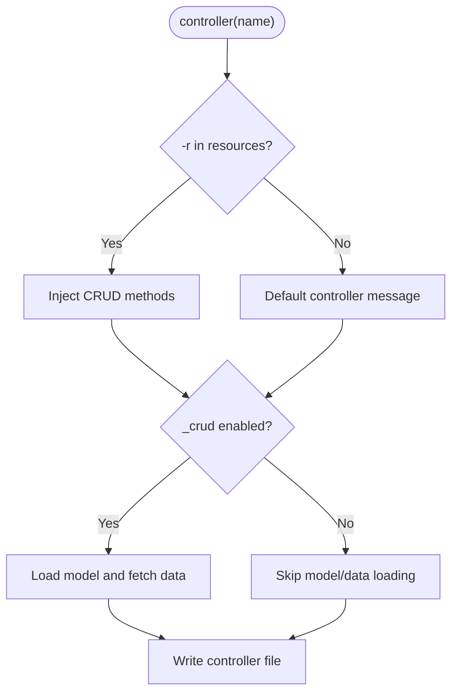
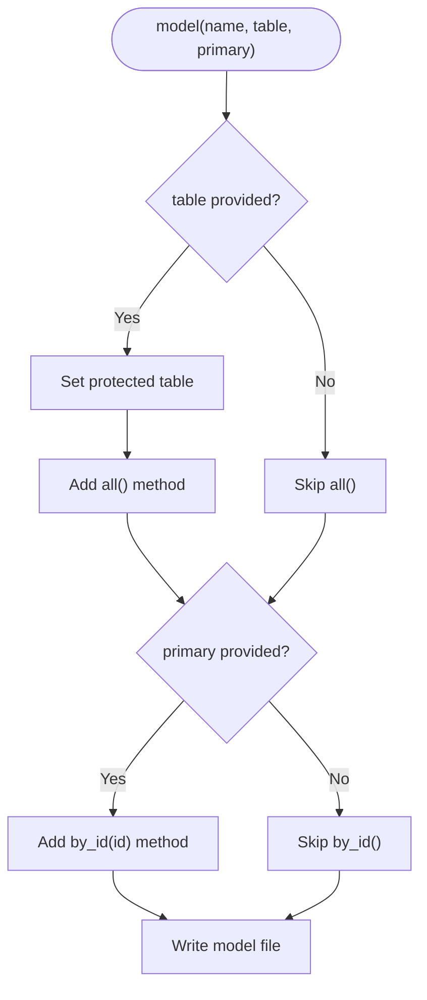
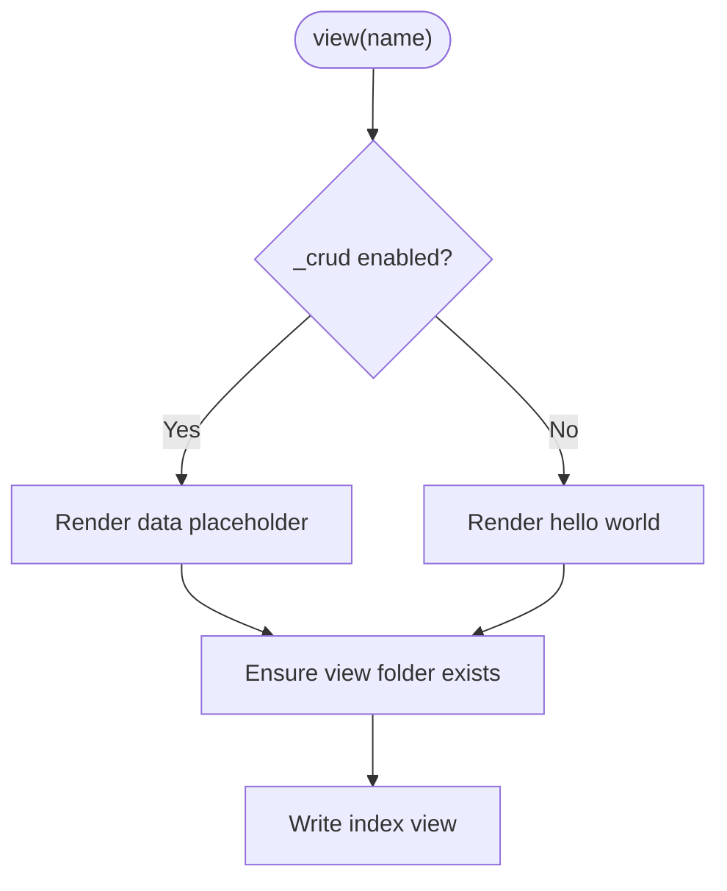
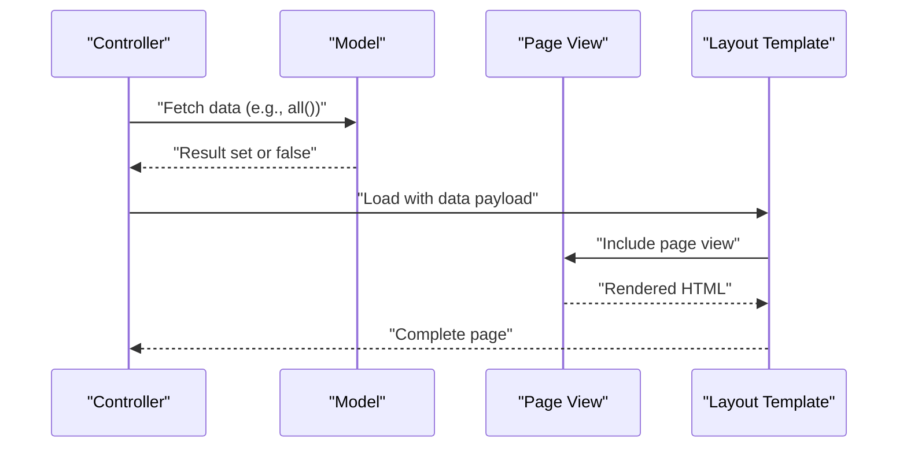
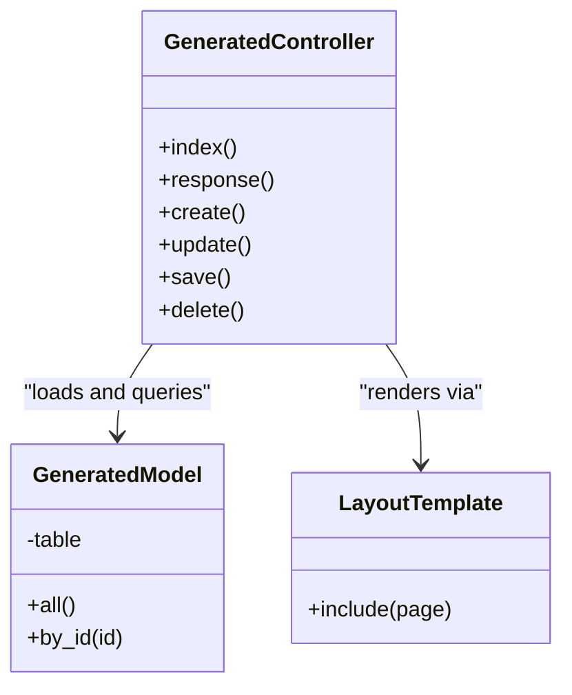
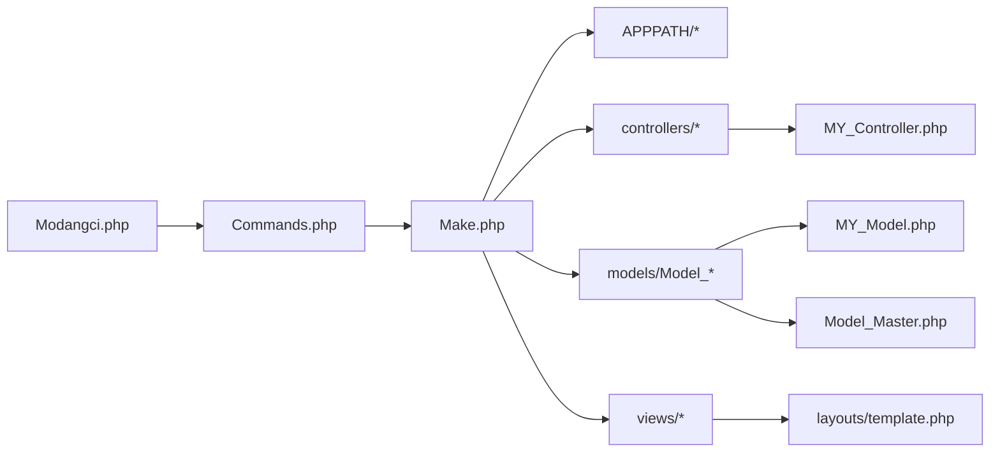

# CRUD Operation Generation

<cite>
**Referenced Files in This Document**
- [Make.php](file://src/commands/Make.php)
- [Modangci.php](file://src/Modangci.php)
- [Commands.php](file://src/Commands.php)
- [MY_Controller.php](file://src/application/core/MY_Controller.php)
- [MY_Model.php](file://src/application/core/MY_Model.php)
- [Model_Master.php](file://src/application/core/Model_Master.php)
- [Pengguna.php](file://src/application/controllers/Pengguna.php)
- [Model_pengguna.php](file://src/application/models/Model_pengguna.php)
- [template.php](file://src/application/views/layouts/template.php)
- [index.php](file://src/application/views/pages/modul/index.php)
- [README.md](file://README.md)
- [install](file://install)
</cite>

## Table of Contents
1. [Introduction](#introduction)
2. [Project Structure](#project-structure)
3. [Core Components](#core-components)
4. [Architecture Overview](#architecture-overview)
5. [Detailed Component Analysis](#detailed-component-analysis)
6. [Dependency Analysis](#dependency-analysis)
7. [Performance Considerations](#performance-considerations)
8. [Troubleshooting Guide](#troubleshooting-guide)
9. [Conclusion](#conclusion)

## Introduction
This document explains the CRUD operation generation functionality in Modangci. It covers the end-to-end workflow that generates controllers, models, and views with a single command, including how the -r flag injects CRUD methods into controllers, how models map to database tables and expose query methods, and how views render data. It also documents the parameter passing between components, the MVC data flow, and customization options for each generated component.

## Project Structure
Modangci integrates with a CodeIgniter 3 application. The CLI tool orchestrates generation under the application’s APPPATH using a dedicated commands layer. The generated components follow CodeIgniter conventions and integrate with the application’s core classes.

**Diagram sources**
- [Modangci.php:10-41](file://src/Modangci.php#L10-L41)
- [Commands.php:14-18](file://src/Commands.php#L14-L18)
- [Make.php:11-211](file://src/commands/Make.php#L11-L211)
- [MY_Controller.php:3-59](file://src/application/core/MY_Controller.php#L3-L59)
- [MY_Model.php:3-21](file://src/application/core/MY_Model.php#L3-L21)
- [Model_Master.php:2-257](file://src/application/core/Model_Master.php#L2-L257)
- [template.php:1-180](file://src/application/views/layouts/template.php#L1-L180)

**Section sources**
- [README.md:15-22](file://README.md#L15-L22)
- [Modangci.php:10-41](file://src/Modangci.php#L10-L41)
- [Commands.php:99-133](file://src/Commands.php#L99-L133)

## Core Components
- CLI kernel parses arguments, validates allowed parameters, and dispatches to the appropriate command class and method.
- Command base provides shared utilities for creating folders and files, and prints messages.
- Make generator implements CRUD generation and individual component generation, including the -r flag behavior and table mapping in models.
- Core framework classes define the base controller and model that generated components extend.
- Master model provides reusable database operations used by generated models.

Key responsibilities:
- Modangci.php: argument parsing, resource extraction, and dynamic dispatch.
- Commands.php: file/folder creation utilities and help output.
- Make.php: controller/model/view generation, -r flag behavior, and table mapping.
- MY_Controller.php, MY_Model.php, Model_Master.php: base classes for generated components.
- template.php: layout that renders generated views.

**Section sources**
- [Modangci.php:19-40](file://src/Modangci.php#L19-L40)
- [Commands.php:76-97](file://src/Commands.php#L76-L97)
- [Make.php:16-211](file://src/commands/Make.php#L16-L211)
- [MY_Controller.php:3-59](file://src/application/core/MY_Controller.php#L3-L59)
- [MY_Model.php:3-21](file://src/application/core/MY_Model.php#L3-L21)
- [Model_Master.php:2-257](file://src/application/core/Model_Master.php#L2-L257)

## Architecture Overview
The CRUD generation workflow is a three-stage pipeline:
1. Controller creation with optional CRUD methods via -r.
2. Model creation with table mapping and query methods.
3. View creation with a data display template.

**Diagram sources**
- [Modangci.php:36-40](file://src/Modangci.php#L36-L40)
- [Make.php:196-209](file://src/commands/Make.php#L196-L209)
- [Make.php:16-73](file://src/commands/Make.php#L16-L73)
- [Make.php:75-127](file://src/commands/Make.php#L75-L127)
- [Make.php:172-194](file://src/commands/Make.php#L172-L194)

## Detailed Component Analysis

### CLI and Command Dispatch
- Argument parsing enforces allowed parameters and extracts resources like -r.
- Dynamic instantiation of the command class and method ensures extensibility.
- The help output enumerates supported commands, including make crud.

**Diagram sources**
- [Modangci.php:19-40](file://src/Modangci.php#L19-L40)
- [Modangci.php:43-53](file://src/Modangci.php#L43-L53)
- [Commands.php:99-133](file://src/Commands.php#L99-L133)

**Section sources**
- [Modangci.php:19-40](file://src/Modangci.php#L19-L40)
- [Modangci.php:43-53](file://src/Modangci.php#L43-L53)
- [Commands.php:99-133](file://src/Commands.php#L99-L133)

### CRUD Generation Workflow
- The crud(name) method sets internal flags and invokes controller, model, and view generators in sequence.
- The -r flag controls whether CRUD methods are injected into the controller.
- The model is configured with table mapping when a table name is provided.

**Diagram sources**
- [Make.php:196-209](file://src/commands/Make.php#L196-L209)
- [Make.php:23-44](file://src/commands/Make.php#L23-L44)
- [Make.php:84-96](file://src/commands/Make.php#L84-L96)
- [Make.php:178-181](file://src/commands/Make.php#L178-L181)

**Section sources**
- [Make.php:196-209](file://src/commands/Make.php#L196-L209)

### Controller Generation (-r Flag Behavior)
- When -r is present, the controller includes response, create, update, save, and delete methods.
- The controller optionally loads a model and delegates data retrieval to the view.
- Without -r, the controller defaults to a placeholder message.

**Diagram sources**
- [Make.php:23-44](file://src/commands/Make.php#L23-L44)
- [Make.php:47-52](file://src/commands/Make.php#L47-L52)
- [Make.php:54-73](file://src/commands/Make.php#L54-L73)

**Section sources**
- [Make.php:16-73](file://src/commands/Make.php#L16-L73)

### Model Generation (Table Mapping and Query Methods)
- If a table is provided, the model defines a protected table variable and exposes an all() method.
- If both table and primary key are provided, the model exposes a by_id() method.
- Generated models extend the application’s master model to reuse transactional and CRUD utilities.

**Diagram sources**
- [Make.php:84-96](file://src/commands/Make.php#L84-L96)
- [Make.php:98-111](file://src/commands/Make.php#L98-L111)
- [Model_Master.php:56-115](file://src/application/core/Model_Master.php#L56-L115)

**Section sources**
- [Make.php:75-127](file://src/commands/Make.php#L75-L127)
- [Model_Master.php:56-115](file://src/application/core/Model_Master.php#L56-L115)

### View Generation (Data Display Template)
- With CRUD mode enabled, the view displays raw data placeholders.
- Without CRUD mode, the view renders a simple HTML structure.
- Views are placed under a folder named after the generated resource.

**Diagram sources**
- [Make.php:178-181](file://src/commands/Make.php#L178-L181)
- [Make.php:190-194](file://src/commands/Make.php#L190-L194)

**Section sources**
- [Make.php:172-194](file://src/commands/Make.php#L172-L194)

### MVC Data Flow and Integration Patterns
- Controllers extend the application’s base controller and load the corresponding model.
- The controller passes data to the layout template, which renders the page.
- The layout includes subviews and assets, and forwards the data payload to the page view.

**Diagram sources**
- [Pengguna.php:22-32](file://src/application/controllers/Pengguna.php#L22-L32)
- [Model_pengguna.php:11-21](file://src/application/models/Model_pengguna.php#L11-L21)
- [template.php:95-100](file://src/application/views/layouts/template.php#L95-L100)
- [index.php:1-94](file://src/application/views/pages/modul/index.php#L1-L94)

**Section sources**
- [Pengguna.php:19-32](file://src/application/controllers/Pengguna.php#L19-L32)
- [Model_pengguna.php:11-21](file://src/application/models/Model_pengguna.php#L11-L21)
- [template.php:95-100](file://src/application/views/layouts/template.php#L95-L100)
- [index.php:50-79](file://src/application/views/pages/modul/index.php#L50-L79)

### Relationship Between Generated Components
- Generated controller depends on the generated model and loads the view with data.
- Generated model encapsulates table mapping and query logic, optionally delegating to the master model for transactions.
- Generated view consumes the data passed by the controller and renders it using the layout.

**Diagram sources**
- [Make.php:23-44](file://src/commands/Make.php#L23-L44)
- [Make.php:84-96](file://src/commands/Make.php#L84-L96)
- [Make.php:178-181](file://src/commands/Make.php#L178-L181)
- [template.php:95-100](file://src/application/views/layouts/template.php#L95-L100)

**Section sources**
- [Make.php:16-73](file://src/commands/Make.php#L16-L73)
- [Make.php:75-127](file://src/commands/Make.php#L75-L127)
- [Make.php:172-194](file://src/commands/Make.php#L172-L194)

### Customization Options
- Controller customization:
  - Extend a custom base controller by specifying an extends name when generating the controller.
  - Remove or modify injected CRUD methods by not using the -r flag.
- Model customization:
  - Provide table and primary key to enable automatic query methods.
  - Extend a custom base model by specifying an extends name when generating the model.
- View customization:
  - Replace the placeholder template with a structured HTML table or component markup.
  - Adjust the view folder placement and naming convention as needed.

**Section sources**
- [README.md:15-21](file://README.md#L15-L21)
- [Make.php:16-73](file://src/commands/Make.php#L16-L73)
- [Make.php:75-127](file://src/commands/Make.php#L75-L127)
- [Make.php:172-194](file://src/commands/Make.php#L172-L194)

## Dependency Analysis
- CLI depends on the command base and generator classes.
- Generator depends on file system utilities and writes under APPPATH.
- Generated controller depends on the base controller and the generated model.
- Generated model depends on the base model and optionally the master model for transactional operations.
- Generated view depends on the layout template.

**Diagram sources**
- [Modangci.php:36-40](file://src/Modangci.php#L36-L40)
- [Commands.php:76-97](file://src/Commands.php#L76-L97)
- [Make.php:16-211](file://src/commands/Make.php#L16-L211)
- [MY_Controller.php:3-59](file://src/application/core/MY_Controller.php#L3-L59)
- [MY_Model.php:3-21](file://src/application/core/MY_Model.php#L3-L21)
- [Model_Master.php:2-257](file://src/application/core/Model_Master.php#L2-L257)
- [template.php:1-180](file://src/application/views/layouts/template.php#L1-L180)

**Section sources**
- [Modangci.php:36-40](file://src/Modangci.php#L36-L40)
- [Commands.php:76-97](file://src/Commands.php#L76-L97)
- [Make.php:16-211](file://src/commands/Make.php#L16-L211)

## Performance Considerations
- Minimize unnecessary joins and selects in generated model methods; tailor the all() and by_id() methods to required columns.
- Use pagination or limit clauses for large datasets in index views.
- Avoid heavy logic in controllers; delegate to models and keep views lightweight.
- Reuse the master model’s transactional methods to ensure atomicity and reduce boilerplate.

## Troubleshooting Guide
- Command not found:
  - Verify the command syntax and ensure the CLI tool is installed and accessible.
  - Confirm the help output lists make crud as a supported command.
- Resource parameter errors:
  - Only allowed parameters are accepted; invalid tokens cause the tool to exit with a message.
- File or folder already exists:
  - The generator checks for duplicates and aborts with a message if conflicts are detected.
- Unable to write:
  - Ensure the application has write permissions under APPPATH for the target directories.

**Section sources**
- [README.md:15-22](file://README.md#L15-L22)
- [Modangci.php:24-28](file://src/Modangci.php#L24-L28)
- [Commands.php:78-91](file://src/Commands.php#L78-L91)

## Conclusion
Modangci streamlines CRUD generation by orchestrating controller, model, and view creation in a single command. The -r flag injects practical CRUD methods into controllers, models gain automatic table mapping and query methods, and views render data through a standardized layout. By extending base classes and leveraging the master model’s transactional utilities, generated components integrate cleanly with the application’s architecture while remaining customizable.