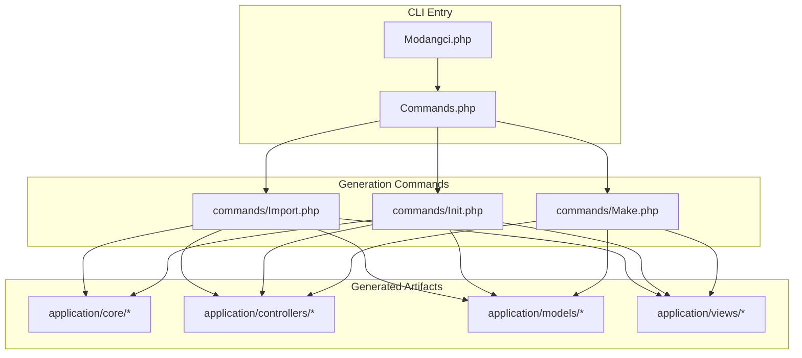
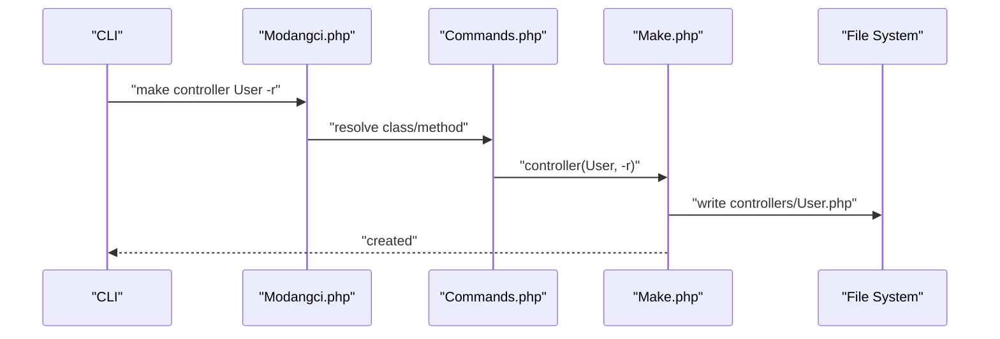
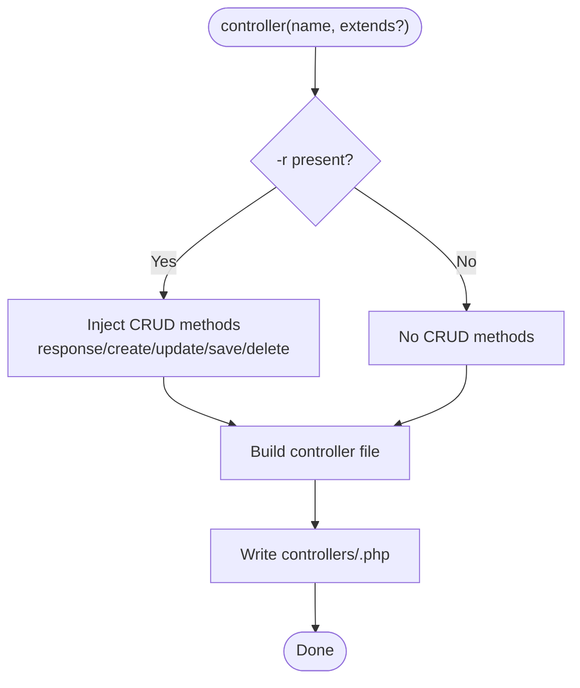
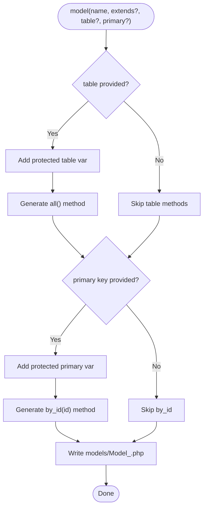
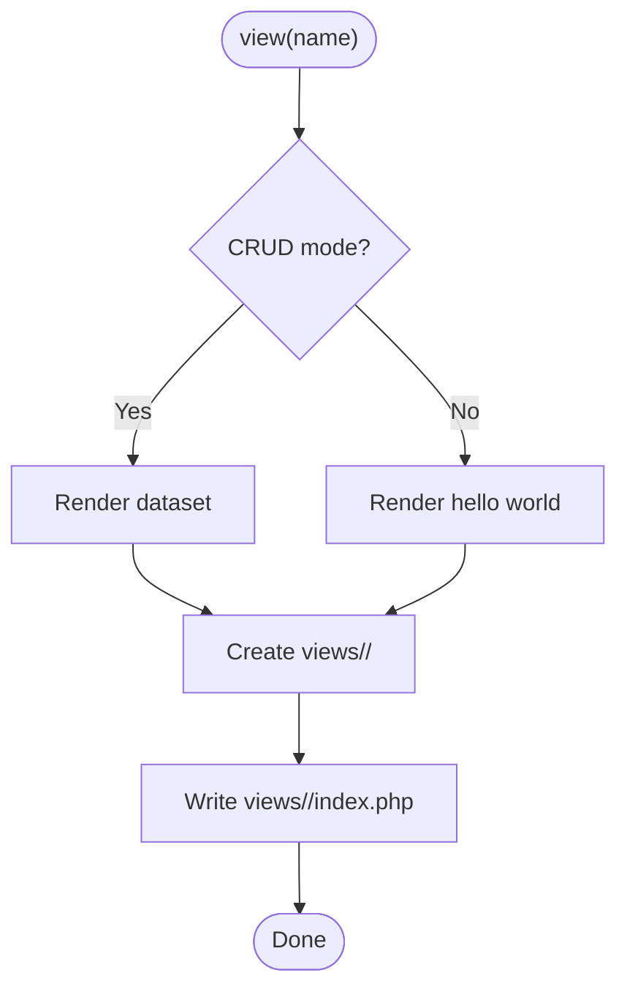
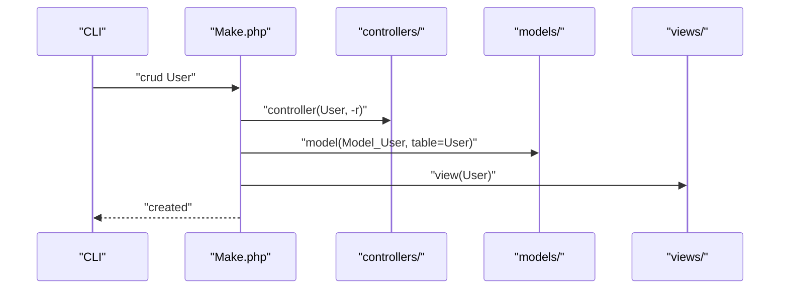
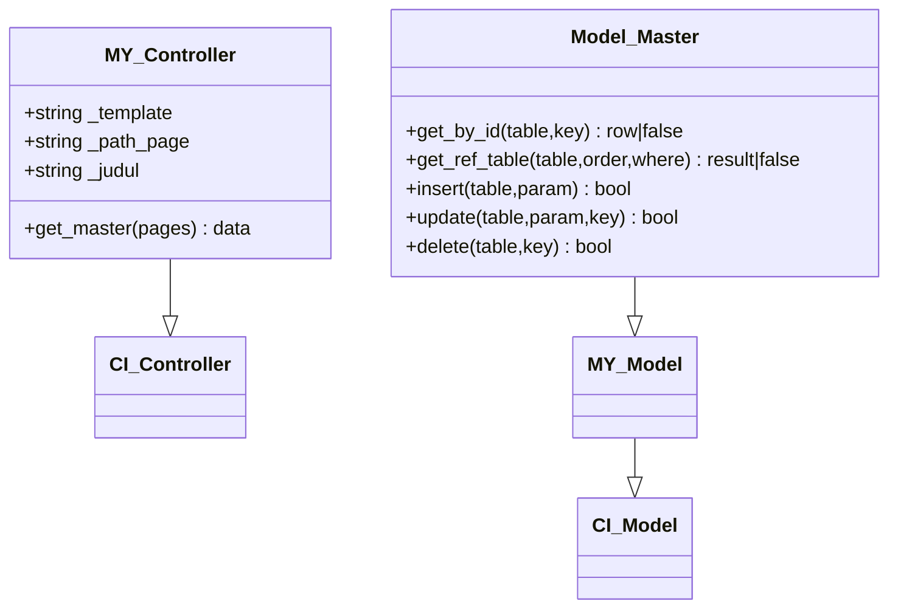
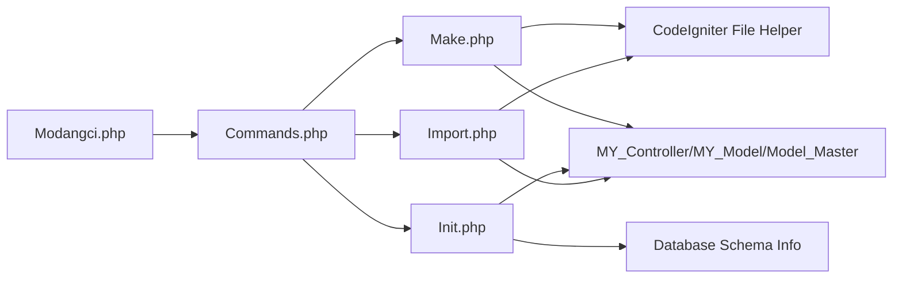

# Component Generation

<cite>
**Referenced Files in This Document**
- [Modangci.php](file://src/Modangci.php)
- [Commands.php](file://src/Commands.php)
- [Make.php](file://src/commands/Make.php)
- [Init.php](file://src/commands/Init.php)
- [Import.php](file://src/commands/Import.php)
- [MY_Controller.php](file://src/application/core/MY_Controller.php)
- [MY_Model.php](file://src/application/core/MY_Model.php)
- [Model_Master.php](file://src/application/core/Model_Master.php)
- [Hakakses.php](file://src/application/controllers/Hakakses.php)
- [Model_hakakses.php](file://src/application/models/Model_hakakses.php)
- [index.php](file://src/application/views/pages/hakakses/index.php)
</cite>

## Table of Contents
1. [Introduction](#introduction)
2. [Project Structure](#project-structure)
3. [Core Components](#core-components)
4. [Architecture Overview](#architecture-overview)
5. [Detailed Component Analysis](#detailed-component-analysis)
6. [Dependency Analysis](#dependency-analysis)
7. [Performance Considerations](#performance-considerations)
8. [Troubleshooting Guide](#troubleshooting-guide)
9. [Conclusion](#conclusion)

## Introduction
This document explains the component generation functionality in Modangci, focusing on generating controllers, models, views, and complete CRUD stacks. It covers:
- Controllers with optional CRUD method injection via a flag
- Models with configurable table mapping and primary key handling
- Views with Bootstrap-based templates and folder structure creation
- Complete CRUD generation that composes controllers, models, and views together
It also documents naming conventions, integration patterns with the CodeIgniter framework, and how generated components align with existing base classes and helpers.

## Project Structure
Modangci exposes CLI commands to generate scaffolding for CodeIgniter applications. The command routing and generation logic live under src/commands, while the generated artifacts are placed under CodeIgniter’s standard application directories (controllers, models, views, core, helpers, libraries).

**Diagram sources**
- [Modangci.php:10-41](file://src/Modangci.php#L10-L41)
- [Commands.php:99-134](file://src/Commands.php#L99-L134)
- [Make.php:16-73](file://src/commands/Make.php#L16-L73)
- [Init.php:480-640](file://src/commands/Init.php#L480-L640)
- [Import.php:14-24](file://src/commands/Import.php#L14-L24)

**Section sources**
- [Modangci.php:10-41](file://src/Modangci.php#L10-L41)
- [Commands.php:99-134](file://src/Commands.php#L99-L134)

## Core Components
- Command dispatcher: routes CLI arguments to specific generators
- Base file/folder creation utilities: safe creation with existence checks and messaging
- Generators:
  - Make: generates controllers, models, helpers, libraries, views, and full CRUD stacks
  - Init: scaffolds controllers, models, views, and assets from database schema
  - Import: copies base classes and helpers/libraries into the application

Key behaviors:
- Controllers can optionally inject CRUD stub methods (-r flag)
- Models can specify table and primary key to auto-generate query methods
- Views are created with Bootstrap-based templates and folder structure
- CRUD generation composes controller, model, and view together

**Section sources**
- [Commands.php:76-97](file://src/Commands.php#L76-L97)
- [Make.php:16-73](file://src/commands/Make.php#L16-L73)
- [Make.php:75-127](file://src/commands/Make.php#L75-L127)
- [Make.php:172-194](file://src/commands/Make.php#L172-L194)
- [Make.php:196-210](file://src/commands/Make.php#L196-L210)

## Architecture Overview
The CLI entry parses arguments, selects a generator, and writes files into the CodeIgniter application path. Generated components integrate with existing base classes and helpers.

**Diagram sources**
- [Modangci.php:36-40](file://src/Modangci.php#L36-L40)
- [Commands.php:43-53](file://src/Commands.php#L43-L53)
- [Make.php:16-73](file://src/commands/Make.php#L16-L73)

## Detailed Component Analysis

### Controller Generation
Controller generation supports:
- Extending a specified base class (defaults to the framework base)
- Optional CRUD method injection via the -r resource flag
- Automatic model loading and data retrieval when invoked in CRUD mode
- Naming convention: PascalCase class name mapped to a controller file

Processing logic:
- Parse resource flags to detect -r
- Build CRUD stub methods when -r is present
- Optionally load a model and fetch data when in CRUD mode
- Write the controller file under application/controllers/

**Diagram sources**
- [Make.php:16-73](file://src/commands/Make.php#L16-L73)

**Section sources**
- [Make.php:16-73](file://src/commands/Make.php#L16-L73)

### Model Generation
Model generation supports:
- Specifying a base class (defaults to the framework base)
- Declaring a database table to enable generic query methods
- Declaring a primary key to enable by-id queries
- Naming convention: Model_<lowercase name> under application/models/

Processing logic:
- If table is provided, generate an all() method
- If both table and primary key are provided, generate a by_id($id) method
- Write the model file under application/models/

**Diagram sources**
- [Make.php:75-127](file://src/commands/Make.php#L75-L127)

**Section sources**
- [Make.php:75-127](file://src/commands/Make.php#L75-L127)

### View Generation
View generation supports:
- Creating a Bootstrap-based HTML skeleton
- In CRUD mode, displays raw dataset for quick inspection
- Naming convention: lowercase view name under application/views/<name>/index.php
- Automatically creates the target folder

Processing logic:
- Determine content: Bootstrap skeleton or raw dataset dump in CRUD mode
- Create the views/<name> folder
- Write index.php under the folder

**Diagram sources**
- [Make.php:172-194](file://src/commands/Make.php#L172-L194)

**Section sources**
- [Make.php:172-194](file://src/commands/Make.php#L172-L194)

### CRUD Generation Workflow
CRUD generation composes three components:
- Controller: with optional CRUD methods
- Model: with table mapping and primary key-aware methods
- View: Bootstrap-based index page

Processing logic:
- Enable CRUD mode internally
- Invoke controller(name) with -r
- Invoke model(name, table=name)
- Invoke view(name)
- Write all three artifacts

**Diagram sources**
- [Make.php:196-210](file://src/commands/Make.php#L196-L210)

**Section sources**
- [Make.php:196-210](file://src/commands/Make.php#L196-L210)

### Integration with CodeIgniter Framework
Generated controllers and models integrate with existing base classes and helpers:
- Controllers extend MY_Controller (or framework base), inheriting session checks and layout helpers
- Models extend Model_Master (or framework base), inheriting transactional CRUD methods and convenience functions
- Views leverage the shared layout and Bootstrap assets

**Diagram sources**
- [MY_Controller.php:3-51](file://src/application/core/MY_Controller.php#L3-L51)
- [MY_Model.php:3-15](file://src/application/core/MY_Model.php#L3-L15)
- [Model_Master.php:2-257](file://src/application/core/Model_Master.php#L2-L257)

**Section sources**
- [MY_Controller.php:3-51](file://src/application/core/MY_Controller.php#L3-L51)
- [Model_Master.php:2-257](file://src/application/core/Model_Master.php#L2-L257)

### Example Generated Code Structure and Naming Conventions
- Controller: application/controllers/User.php
- Model: application/models/Model_user.php
- View: application/views/user/index.php
- Layout and assets: application/views/layouts/* and public/*

Integration patterns:
- Controllers set template, page path, and model name, then render views with shared layouts
- Models encapsulate database operations and are loaded by controllers
- Views use Bootstrap classes and expect data passed by controllers

**Section sources**
- [Hakakses.php:5-31](file://src/application/controllers/Hakakses.php#L5-L31)
- [Model_hakakses.php:2-10](file://src/application/models/Model_hakakses.php#L2-L10)
- [index.php:1-88](file://src/application/views/pages/hakakses/index.php#L1-L88)

## Dependency Analysis
The generation commands depend on:
- CodeIgniter’s file helper for writing files
- Application core classes for integration
- Database schema metadata for Init scaffolding

**Diagram sources**
- [Modangci.php:12-17](file://src/Modangci.php#L12-L17)
- [Commands.php:20-29](file://src/Commands.php#L20-L29)
- [Init.php:13-29](file://src/commands/Init.php#L13-L29)

**Section sources**
- [Modangci.php:12-17](file://src/Modangci.php#L12-L17)
- [Commands.php:20-29](file://src/Commands.php#L20-L29)
- [Init.php:13-29](file://src/commands/Init.php#L13-L29)

## Performance Considerations
- Generation is file I/O bound; batch operations (Init/Import) use recursive copying to minimize overhead
- CRUD generation composes three separate writes; consider batching or caching if generating many resources
- Avoid unnecessary repeated writes by checking existence before creation

## Troubleshooting Guide
Common issues and resolutions:
- CLI not invoked from terminal: the tool exits early if not called from CLI
- Invalid parameters: non-alphabetic arguments are rejected unless whitelisted resource flags
- File/folder already exists: creation routines return false and print messages; resolve conflicts manually
- Unable to write: ensure proper permissions for application directories

**Section sources**
- [Modangci.php:13-17](file://src/Modangci.php#L13-L17)
- [Modangci.php:24-32](file://src/Modangci.php#L24-L32)
- [Commands.php:78-91](file://src/Commands.php#L78-L91)

## Conclusion
Modangci provides a streamlined CLI for generating controllers, models, views, and full CRUD stacks tailored to CodeIgniter applications. By leveraging base classes and helpers, generated components integrate seamlessly with existing architecture. Use Make for quick scaffolding and Init for database-driven generation, ensuring consistent naming and structure across your application.