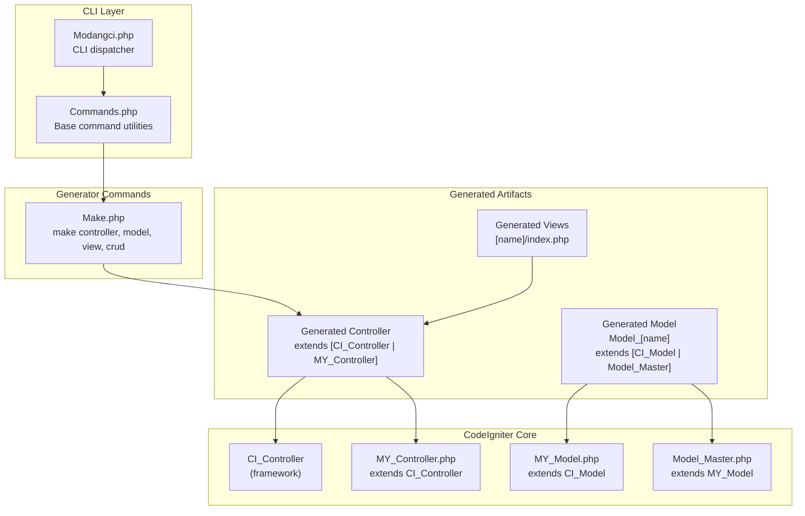
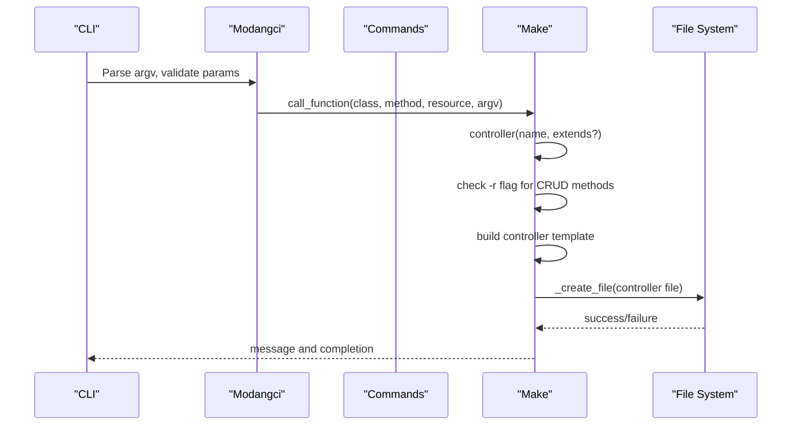
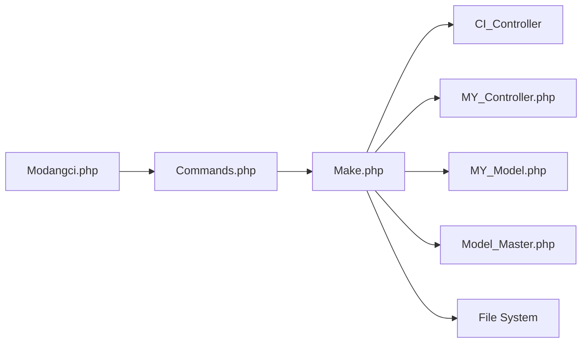

# Controller Generation

<cite>
**Referenced Files in This Document**
- [Modangci.php](file://src/Modangci.php)
- [Commands.php](file://src/Commands.php)
- [Make.php](file://src/commands/Make.php)
- [MY_Controller.php](file://src/application/core/MY_Controller.php)
- [MY_Model.php](file://src/application/core/MY_Model.php)
- [Model_Master.php](file://src/application/core/Model_Master.php)
- [Home.php](file://src/application/controllers/Home.php)
- [Model_home.php](file://src/application/models/Model_home.php)
- [README.md](file://README.md)
</cite>

## Table of Contents
1. [Introduction](#introduction)
2. [Project Structure](#project-structure)
3. [Core Components](#core-components)
4. [Architecture Overview](#architecture-overview)
5. [Detailed Component Analysis](#detailed-component-analysis)
6. [Dependency Analysis](#dependency-analysis)
7. [Performance Considerations](#performance-considerations)
8. [Troubleshooting Guide](#troubleshooting-guide)
9. [Conclusion](#conclusion)

## Introduction
This document explains the controller generation functionality in Modangci, focusing on how controllers are scaffolded with optional CRUD method injection, base class extension options, and integration with the CodeIgniter framework. It covers:
- How the CLI routing works to dispatch to the Make controller generator
- Base class extension options (CI_Controller vs custom MY_Controller)
- Naming conventions and file structure for generated controllers
- Optional CRUD method injection via the -r flag
- Constructor behavior when CRUD mode is enabled (model loading)
- index() method behavior for data loading and view rendering
- Parameter handling, model loading patterns, and view rendering workflows

## Project Structure
Modangci integrates with a CodeIgniter 3 application. The controller generation logic resides in the Make command class, while the framework base classes define the inheritance model used by generated controllers.

**Diagram sources**
- [Modangci.php:10-41](file://src/Modangci.php#L10-L41)
- [Commands.php:7-135](file://src/Commands.php#L7-L135)
- [Make.php:16-73](file://src/commands/Make.php#L16-L73)
- [MY_Controller.php:3-53](file://src/application/core/MY_Controller.php#L3-L53)
- [MY_Model.php:3-15](file://src/application/core/MY_Model.php#L3-L15)
- [Model_Master.php:2-7](file://src/application/core/Model_Master.php#L2-L7)

**Section sources**
- [Modangci.php:10-41](file://src/Modangci.php#L10-L41)
- [Commands.php:7-135](file://src/Commands.php#L7-L135)
- [Make.php:16-73](file://src/commands/Make.php#L16-L73)

## Core Components
- CLI Dispatcher (Modangci): Parses arguments, validates parameters, and routes to the appropriate command class and method.
- Base Commands Utilities (Commands): Provides shared utilities for file/folder creation, messaging, and recursive copying.
- Make Command (Make): Implements controller, model, view, and CRUD scaffolding. Handles -r flag for CRUD method injection and sets CRUD mode for related generators.
- Framework Base Classes: Define the inheritance hierarchy used by generated controllers and models.

Key responsibilities:
- Argument parsing and validation
- Resource flag handling (-r)
- Template generation for controllers
- Conditional CRUD method injection
- Model loading in constructors when CRUD mode is enabled
- View rendering in index() method
- File creation and messaging

**Section sources**
- [Modangci.php:19-41](file://src/Modangci.php#L19-L41)
- [Commands.php:76-97](file://src/Commands.php#L76-L97)
- [Make.php:16-73](file://src/commands/Make.php#L16-L73)

## Architecture Overview
The controller generation pipeline follows a clear flow from CLI invocation to file creation and inheritance mapping.

**Diagram sources**
- [Modangci.php:39-53](file://src/Modangci.php#L39-L53)
- [Make.php:16-73](file://src/commands/Make.php#L16-L73)
- [Commands.php:76-97](file://src/Commands.php#L76-L97)

## Detailed Component Analysis

### CLI Dispatcher and Parameter Validation
- Validates CLI context and rejects non-CLI requests.
- Normalizes arguments to lowercase and filters allowed parameters.
- Supports resource flags like -r/--resource.
- Routes to the Make controller generator with parsed arguments.

Behavior highlights:
- Parameter filtering ensures only allowed flags are accepted.
- Case-insensitive argument handling improves usability.
- Dispatches to Make::controller with remaining arguments.

**Section sources**
- [Modangci.php:13-41](file://src/Modangci.php#L13-L41)

### Base Commands Utilities
Provides reusable functionality:
- File creation with overwrite checks and success messages.
- Folder creation with existence checks.
- Recursive directory copying utility.
- Centralized messaging for consistent output.

These utilities are used by Make to create controllers, models, and views.

**Section sources**
- [Commands.php:20-57](file://src/Commands.php#L20-L57)
- [Commands.php:76-97](file://src/Commands.php#L76-L97)

### Make Controller Generator
Implements controller scaffolding with:
- Base class extension selection:
  - Defaults to CI_Controller if no extends provided.
  - Uses provided extends name if supplied.
- Optional CRUD method injection via -r flag:
  - Generates response(), create(), update(), save(), delete() stubs.
- Constructor behavior:
  - Loads model named model_[lowercase controller name] when CRUD mode is enabled.
  - Otherwise prints a placeholder message.
- index() method:
  - In CRUD mode: loads all records from the model and renders [lowercase controller name]/index.php with data.
  - Otherwise prints a placeholder message.

Template construction:
- Builds a PHP class file with proper namespace and class declaration.
- Applies chosen base class (CI_Controller or custom).
- Conditionally injects CRUD methods and constructor/model/view logic.

Naming conventions:
- Generated controller class name is capitalized controller name.
- Generated model name is model_[lowercase controller name].
- Generated view path is [lowercase controller name]/index.php.

Integration with CodeIgniter:
- Extends CI_Controller or custom MY_Controller.
- Uses CodeIgniter’s loader to load models and views.
- Follows CodeIgniter’s MVC conventions.

**Section sources**
- [Make.php:16-73](file://src/commands/Make.php#L16-L73)
- [Make.php:22-44](file://src/commands/Make.php#L22-L44)
- [Make.php:46-52](file://src/commands/Make.php#L46-L52)
- [Make.php:54-68](file://src/commands/Make.php#L54-L68)

### CRUD Mode and Related Generators
- CRUD mode is activated by the crud() method, which:
  - Sets internal CRUD flag.
  - Passes -r to the controller generator.
  - Calls controller(), model(), and view() in sequence.
- The model generator can set table and primary key for generated models.
- The view generator creates a basic HTML page with placeholder content when in CRUD mode.

**Section sources**
- [Make.php:196-210](file://src/commands/Make.php#L196-L210)

### Framework Base Classes and Inheritance
- MY_Controller extends CI_Controller and adds:
  - Session-based authentication guard.
  - Master layout and breadcrumb helpers.
  - Menu and permission integration.
- MY_Model extends CI_Model and conditionally loads Model_Master if present.
- Model_Master provides common CRUD operations and transaction wrappers.

Generated controllers can inherit from either CI_Controller or MY_Controller depending on the extends parameter.

**Section sources**
- [MY_Controller.php:3-53](file://src/application/core/MY_Controller.php#L3-L53)
- [MY_Model.php:3-15](file://src/application/core/MY_Model.php#L3-L15)
- [Model_Master.php:2-7](file://src/application/core/Model_Master.php#L2-L7)

### Example Generated Controller Structure
The generated controller follows this structure:
- Class declaration extending CI_Controller or a custom base class.
- Constructor:
  - Calls parent constructor.
  - Loads model model_[lowercase controller name] when CRUD mode is enabled.
- index() method:
  - In CRUD mode: loads all records from the model and renders [lowercase controller name]/index.php with data.
  - Otherwise prints a placeholder message.
- Optional CRUD methods (when -r is provided):
  - response(), create(), update(), save(), delete() stubs.

Inheritance mapping:
- If extends is omitted, generated controller extends CI_Controller.
- If extends is provided, it extends the specified base class (e.g., MY_Controller).

**Section sources**
- [Make.php:54-68](file://src/commands/Make.php#L54-L68)
- [Make.php:46-52](file://src/commands/Make.php#L46-L52)
- [Make.php:22-44](file://src/commands/Make.php#L22-L44)

### Integration with CodeIgniter Framework
- Controllers extend CI_Controller or MY_Controller.
- Models extend CI_Model or Model_Master.
- Views are rendered using CodeIgniter’s loader.
- Authentication and session handling are integrated via MY_Controller.

Practical implications:
- Generated controllers automatically benefit from MY_Controller features like session guards and master layout helpers.
- CRUD-enabled controllers can immediately load and render model data.

**Section sources**
- [MY_Controller.php:13-18](file://src/application/core/MY_Controller.php#L13-L18)
- [MY_Controller.php:20-51](file://src/application/core/MY_Controller.php#L20-L51)
- [MY_Model.php:12-15](file://src/application/core/MY_Model.php#L12-L15)

## Dependency Analysis
The controller generation process depends on:
- CLI dispatcher for routing and validation
- Base command utilities for file operations
- CodeIgniter base classes for inheritance
- Optional CRUD mode for method injection and model/view generation

**Diagram sources**
- [Modangci.php:10-41](file://src/Modangci.php#L10-L41)
- [Commands.php:7-135](file://src/Commands.php#L7-L135)
- [Make.php:16-73](file://src/commands/Make.php#L16-L73)
- [MY_Controller.php:3-53](file://src/application/core/MY_Controller.php#L3-L53)
- [MY_Model.php:3-15](file://src/application/core/MY_Model.php#L3-L15)
- [Model_Master.php:2-7](file://src/application/core/Model_Master.php#L2-L7)

**Section sources**
- [Modangci.php:10-41](file://src/Modangci.php#L10-L41)
- [Commands.php:7-135](file://src/Commands.php#L7-L135)
- [Make.php:16-73](file://src/commands/Make.php#L16-L73)

## Performance Considerations
- File operations are synchronous; ensure adequate permissions and disk space.
- Model loading in constructors is lightweight but consider lazy-loading for heavy datasets.
- View rendering overhead is minimal; avoid excessive data passing in index().

## Troubleshooting Guide
Common issues and resolutions:
- Non-CLI invocation: The dispatcher exits with a message. Run the command from the terminal.
- Invalid parameters: Only allowed flags are accepted; invalid flags trigger an error message and exit.
- Unable to create files/folders: Check permissions and target paths. The generator reports failure and stops.
- Missing base classes: Ensure MY_Controller and MY_Model are present for custom inheritance.
- CRUD mode mismatch: Verify that -r is passed when expecting CRUD methods and that the model is generated with table metadata.

**Section sources**
- [Modangci.php:13-17](file://src/Modangci.php#L13-L17)
- [Modangci.php:24-28](file://src/Modangci.php#L24-L28)
- [Commands.php:78-91](file://src/Commands.php#L78-L91)

## Conclusion
Modangci’s controller generation provides a streamlined way to scaffold controllers with optional CRUD capabilities, flexible base class inheritance, and integration with CodeIgniter’s loader and session mechanisms. By leveraging the -r flag and CRUD mode, developers can quickly generate functional controllers that load models, handle data, and render views, aligning with CodeIgniter’s MVC patterns.