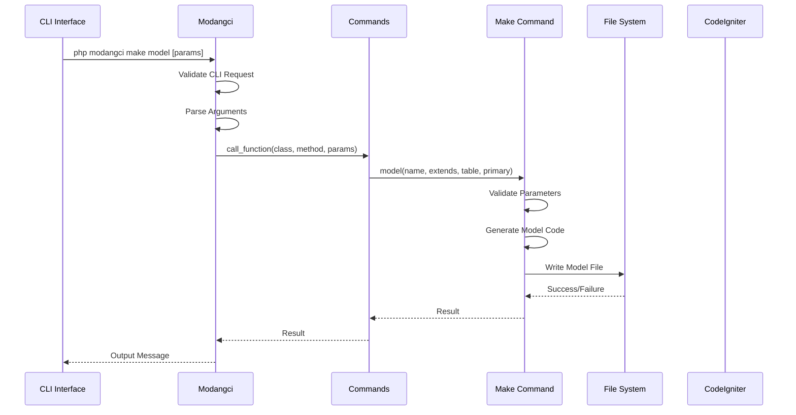
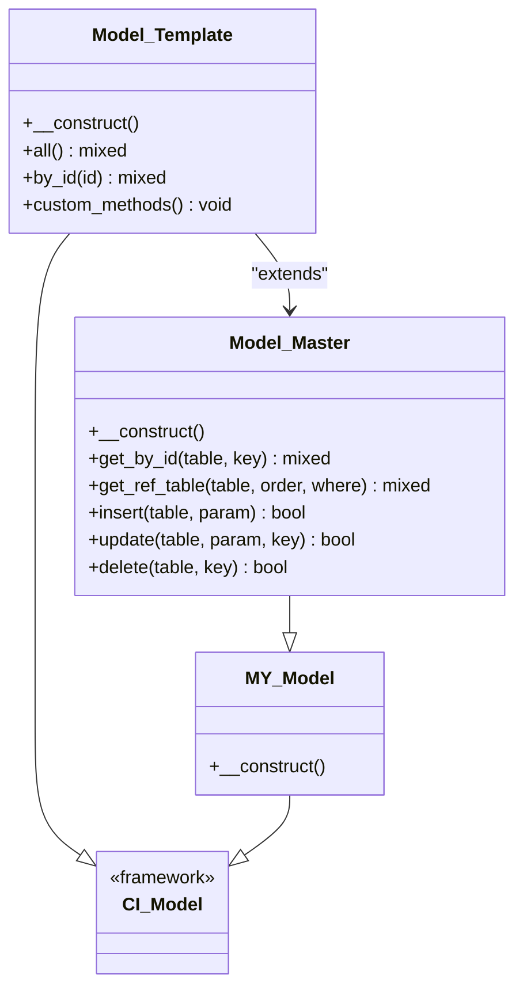
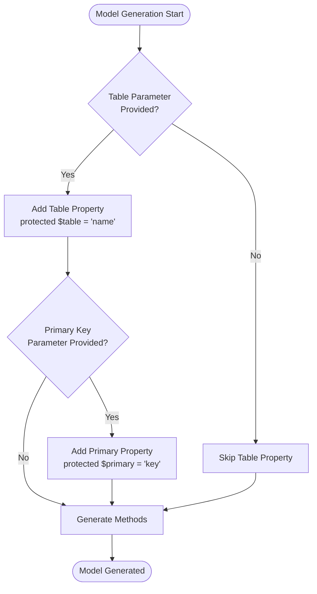
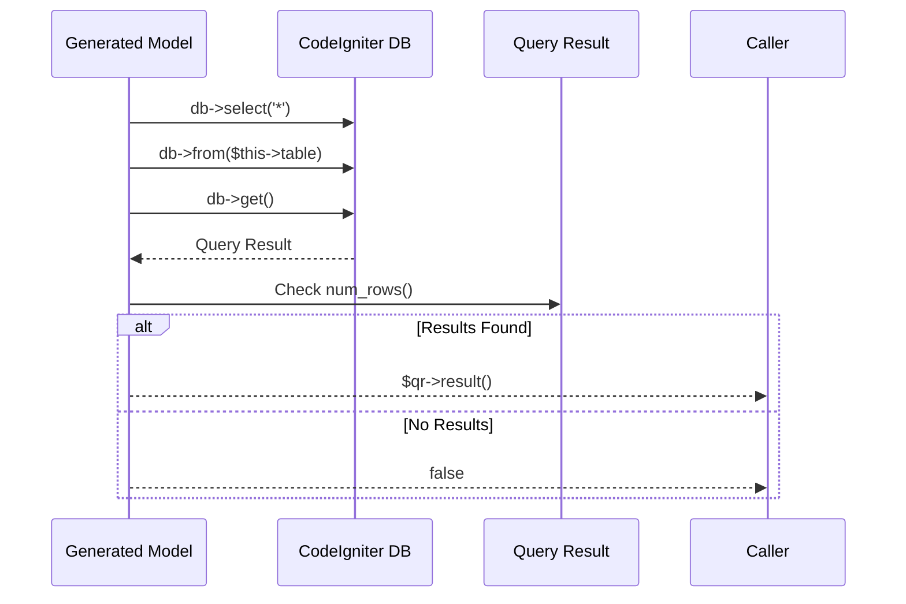
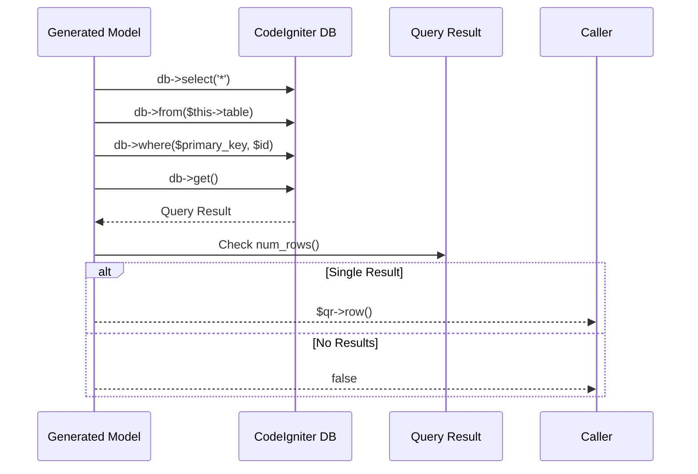
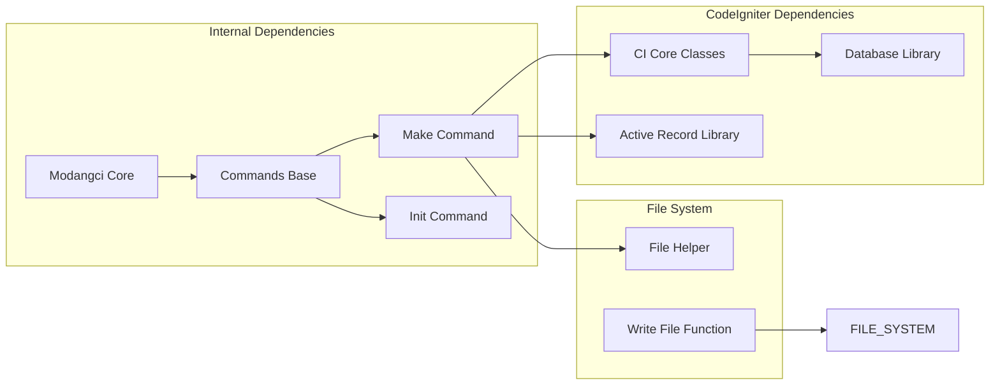

# Model Generation

<cite>
**Referenced Files in This Document**
- [Modangci.php](file://src/Modangci.php)
- [Commands.php](file://src/Commands.php)
- [Make.php](file://src/commands/Make.php)
- [Init.php](file://src/commands/Init.php)
- [MY_Model.php](file://src/application/core/MY_Model.php)
- [Model_Master.php](file://src/application/core/Model_Master.php)
- [Model_pengguna.php](file://src/application/models/Model_pengguna.php)
- [Model_modul.php](file://src/application/models/Model_modul.php)
- [Model_hakakses.php](file://src/application/models/Model_hakakses.php)
- [README.md](file://README.md)
- [ci_instance.php](file://ci_instance.php)
</cite>

## Table of Contents
1. [Introduction](#introduction)
2. [Project Structure](#project-structure)
3. [Core Components](#core-components)
4. [Architecture Overview](#architecture-overview)
5. [Detailed Component Analysis](#detailed-component-analysis)
6. [Dependency Analysis](#dependency-analysis)
7. [Performance Considerations](#performance-considerations)
8. [Troubleshooting Guide](#troubleshooting-guide)
9. [Conclusion](#conclusion)

## Introduction

Modangci is a CodeIgniter 3 CRUD generator that provides automated model generation functionality. The model generation feature creates database models with automatic query method generation, table specification, and primary key configuration. This documentation explains the complete model generation process, covering table property assignment, automatic method generation for data retrieval operations, and integration with CodeIgniter's Active Record library.

The model generation functionality is designed to streamline the development process by automatically creating models with essential CRUD operations, eliminating repetitive boilerplate code while maintaining flexibility for customization.

## Project Structure

The model generation functionality is organized within the Modangci framework with a clear separation of concerns:

```mermaid
graph TB
subgraph "Modangci Framework"
MC[Modangci.php<br/>CLI Entry Point]
CMD[Commands.php<br/>Base Command Handler]
subgraph "Command Classes"
MAKE[Make.php<br/>Model Generation]
INIT[Init.php<br/>Scaffold Generation]
IMP[Import.php<br/>Component Import]
end
subgraph "CodeIgniter Integration"
CI[ci_instance.php<br/>CI Instance Loader]
CORE[Core Classes<br/>MY_Model, Model_Master]
end
end
subgraph "Generated Models"
GM[Generated Models<br/>Model_{name}.php]
TM[Table Models<br/>Model_pengguna.php]
end
MC --> CMD
CMD --> MAKE
CMD --> INIT
CMD --> IMP
CI --> CORE
MAKE --> GM
INIT --> GM
CORE --> GM
CORE --> TM
```

**Diagram sources**
- [Modangci.php:1-60](file://src/Modangci.php#L1-L60)
- [Commands.php:1-135](file://src/Commands.php#L1-L135)
- [Make.php:1-211](file://src/commands/Make.php#L1-L211)

**Section sources**
- [Modangci.php:1-60](file://src/Modangci.php#L1-L60)
- [Commands.php:1-135](file://src/Commands.php#L1-L135)

## Core Components

### CLI Entry Point and Command Routing

The Modangci framework uses a centralized CLI entry point that handles command routing and parameter validation. The system validates command-line arguments, ensures CLI requests only, and routes commands to appropriate handler classes.

### Base Command Handler

The Commands base class provides common functionality for file operations, folder creation, and message handling. It serves as the foundation for all command implementations including model generation.

### Model Generation Engine

The Make command class implements the core model generation functionality, automatically creating models with configurable table specifications, primary keys, and query methods.

**Section sources**
- [Modangci.php:10-53](file://src/Modangci.php#L10-L53)
- [Commands.php:76-97](file://src/Commands.php#L76-L97)
- [Make.php:75-127](file://src/commands/Make.php#L75-L127)

## Architecture Overview

The model generation architecture follows a layered approach with clear separation between CLI handling, command processing, and model generation:



**Diagram sources**
- [Modangci.php:10-53](file://src/Modangci.php#L10-L53)
- [Make.php:75-127](file://src/commands/Make.php#L75-L127)

## Detailed Component Analysis

### Model Generation Process

The model generation process consists of several key steps:

#### Parameter Validation and Processing

The system validates command-line parameters and ensures proper input format. Parameters include model name, optional inheritance class, table name, and primary key specification.

#### Automatic Method Generation

Based on provided parameters, the system generates appropriate methods:

1. **Table Specification**: When table parameter is provided, a `$table` property is set
2. **Primary Key Configuration**: When both table and primary key are provided, a `$primary` property is configured
3. **Method Generation**: Automatic generation of query methods based on parameter combinations

#### Code Template Generation

The system uses pre-defined templates to generate clean, readable model code with proper inheritance and structure.

### Generated Model Structure

#### Basic Model Template



**Diagram sources**
- [Make.php:113-123](file://src/commands/Make.php#L113-L123)
- [MY_Model.php:3-10](file://src/application/core/MY_Model.php#L3-L10)
- [Model_Master.php:2-7](file://src/application/core/Model_Master.php#L2-L7)

#### Table Property Assignment

When a table name is specified during model generation, the system automatically creates a protected table property:



**Diagram sources**
- [Make.php:84-111](file://src/commands/Make.php#L84-L111)

#### Automatic Method Generation

The system generates two primary methods based on parameter combinations:

##### All() Method Implementation

The `all()` method performs SELECT * queries and returns results or false when empty:



**Diagram sources**
- [Make.php:86-95](file://src/commands/Make.php#L86-L95)

##### By_id() Method Implementation

The `by_id()` method generates when both table and primary key parameters are provided:



**Diagram sources**
- [Make.php:100-111](file://src/commands/Make.php#L100-L111)

### Integration with CodeIgniter's Active Record Library

The generated models integrate seamlessly with CodeIgniter's Active Record library through proper inheritance:

#### Inheritance Hierarchy

```mermaid
graph TD
CI_Model[CI_Model<br/>Core Framework] --> MY_Model[MY_Model<br/>Application Core]
MY_Model --> Model_Master[Model_Master<br/>Custom Base Class]
Model_Master --> Generated_Model[Generated Model<br/>Model_{name}]
subgraph "Active Record Features"
AR1[Query Builder]
AR2[Transaction Support]
AR3[Error Handling]
AR4[Result Processing]
end
Generated_Model --> AR1
Generated_Model --> AR2
Generated_Model --> AR3
Generated_Model --> AR4
```

**Diagram sources**
- [MY_Model.php:3-10](file://src/application/core/MY_Model.php#L3-L10)
- [Model_Master.php:2-7](file://src/application/core/Model_Master.php#L2-L7)

#### Database Interaction Patterns

The generated models follow established CodeIgniter patterns for database interactions:

1. **Query Building**: Uses CodeIgniter's query builder methods
2. **Result Processing**: Handles both single and multiple record retrieval
3. **Error Handling**: Implements proper error checking and return value patterns
4. **Transaction Support**: Leverages built-in transaction capabilities

**Section sources**
- [Make.php:75-127](file://src/commands/Make.php#L75-L127)
- [Model_Master.php:56-186](file://src/application/core/Model_Master.php#L56-L186)

### Real-World Model Examples

#### Example 1: User Management Model

A generated model for user management would include:

- Table property: `protected $table = 'users'`
- All method: Returns all user records with proper pagination support
- By_id method: Retrieves single user by ID with validation

#### Example 2: Category Management Model

A model for category management with foreign key relationships:

- Table property: `protected $table = 'categories'`
- Automatic join generation for related tables
- Enhanced by_id method with proper foreign key handling

**Section sources**
- [Model_pengguna.php:1-36](file://src/application/models/Model_pengguna.php#L1-L36)
- [Model_modul.php:1-37](file://src/application/models/Model_modul.php#L1-L37)

## Dependency Analysis

The model generation functionality has minimal external dependencies, relying primarily on CodeIgniter's core framework:



**Diagram sources**
- [Modangci.php:5-6](file://src/Modangci.php#L5-L6)
- [Make.php:5](file://src/commands/Make.php#L5)

### Parameter Validation and Error Handling

The system implements comprehensive parameter validation and error handling:

#### Input Validation

- CLI request verification
- Parameter format validation
- Resource parameter filtering
- File existence checks

#### Error Handling Patterns

- Graceful failure with descriptive messages
- File operation error reporting
- Directory creation failure handling
- Model generation validation

**Section sources**
- [Modangci.php:19-33](file://src/Modangci.php#L19-L33)
- [Commands.php:76-97](file://src/Commands.php#L76-L97)

## Performance Considerations

### Code Generation Efficiency

The model generation process is optimized for performance:

- Minimal runtime overhead during generation
- Efficient file writing operations
- Lazy loading of required components
- Memory-efficient parameter processing

### Generated Code Performance

Generated models follow performance best practices:

- Efficient query building with proper indexing
- Optimized result processing
- Minimal memory footprint
- Proper resource cleanup

## Troubleshooting Guide

### Common Issues and Solutions

#### Model Generation Failures

**Issue**: Model file creation fails
**Solution**: Check file permissions and directory existence

**Issue**: Incorrect inheritance class
**Solution**: Verify class exists in application/core directory

#### Database Integration Problems

**Issue**: Generated models cannot connect to database
**Solution**: Ensure database configuration is correct and CI instance is loaded

#### Method Generation Issues

**Issue**: Missing methods in generated models
**Solution**: Verify parameter combinations and ensure proper table/primary key specification

### Debugging Strategies

1. **Enable verbose output**: Use CLI verbose mode for detailed progress information
2. **Check file permissions**: Ensure write permissions for application/models directory
3. **Validate parameters**: Test with simple parameter combinations first
4. **Review generated code**: Inspect generated model files for syntax errors

**Section sources**
- [Commands.php:76-97](file://src/Commands.php#L76-L97)
- [ci_instance.php:15-87](file://ci_instance.php#L15-L87)

## Conclusion

Modangci's model generation functionality provides a robust solution for automated CodeIgniter model creation. The system effectively handles table specification, primary key configuration, and automatic method generation while maintaining integration with CodeIgniter's Active Record library.

Key benefits include:

- **Reduced Development Time**: Eliminates repetitive boilerplate code
- **Consistent Architecture**: Enforces standardized model patterns
- **Flexible Configuration**: Supports various inheritance scenarios
- **Error Resilient**: Comprehensive validation and error handling
- **Performance Optimized**: Efficient code generation and runtime performance

The model generation process demonstrates excellent separation of concerns, with clear boundaries between CLI handling, command processing, and model generation. This architecture enables easy maintenance and extension of the functionality while providing a solid foundation for future enhancements.