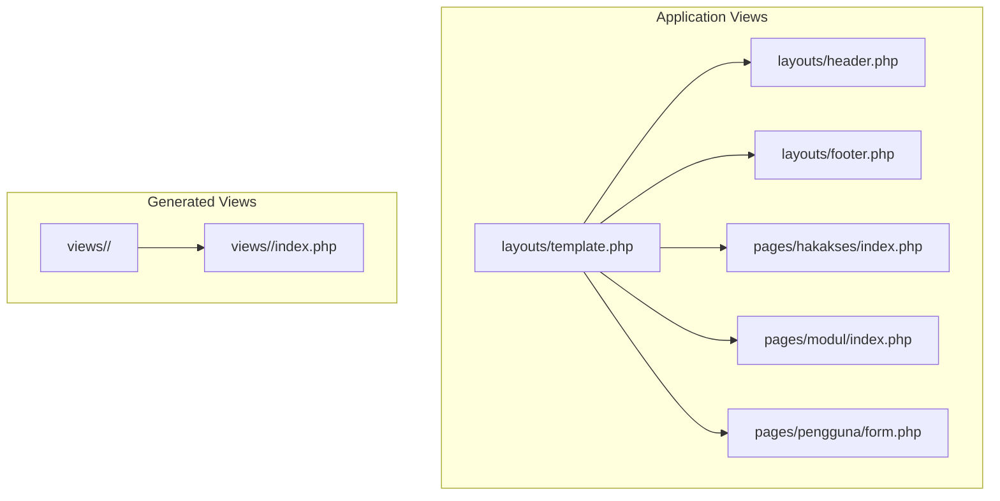
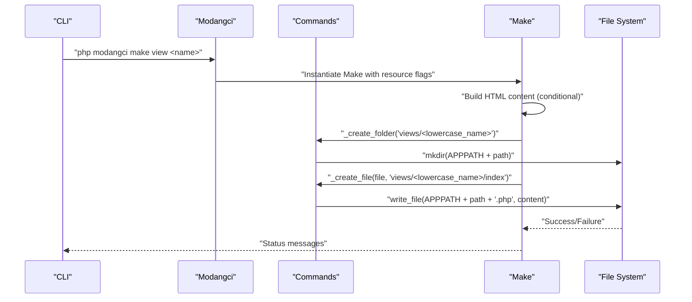
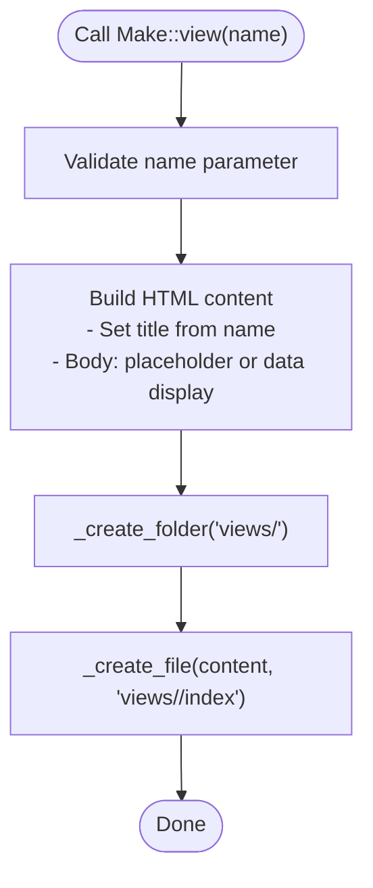
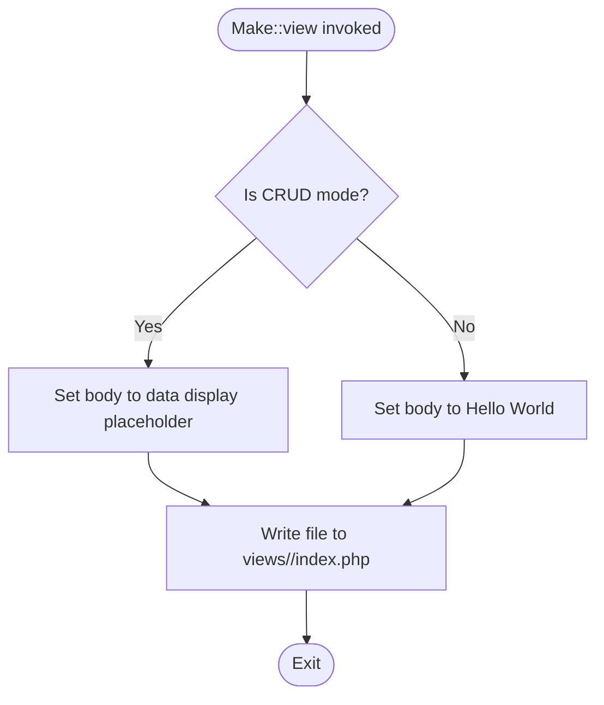
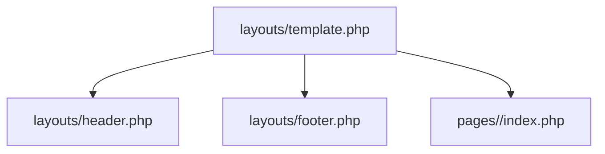
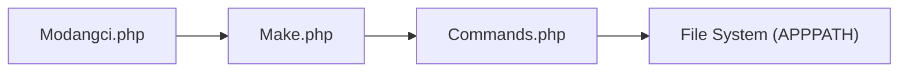

# View Generation

<cite>
**Referenced Files in This Document**
- [Make.php](file://src/commands/Make.php)
- [Commands.php](file://src/Commands.php)
- [Modangci.php](file://src/Modangci.php)
- [template.php](file://src/application/views/layouts/template.php)
- [header.php](file://src/application/views/layouts/header.php)
- [footer.php](file://src/application/views/layouts/footer.php)
- [index.php](file://src/application/views/pages/hakakses/index.php)
- [index.php](file://src/application/views/pages/modul/index.php)
- [form.php](file://src/application/views/pages/pengguna/form.php)
- [README.md](file://README.md)
</cite>

## Table of Contents
1. [Introduction](#introduction)
2. [Project Structure](#project-structure)
3. [Core Components](#core-components)
4. [Architecture Overview](#architecture-overview)
5. [Detailed Component Analysis](#detailed-component-analysis)
6. [Dependency Analysis](#dependency-analysis)
7. [Performance Considerations](#performance-considerations)
8. [Troubleshooting Guide](#troubleshooting-guide)
9. [Conclusion](#conclusion)

## Introduction
This document explains the view generation functionality in Modangci, focusing on how views are scaffolded, organized, and integrated into the application’s layout system. It covers:
- Folder structure creation under views/[lowercase_name]/
- File naming conventions (index.php)
- Default view content generation (HTML structure, title tags, body content)
- Conditional content generation based on CRUD mode (placeholder vs. data display templates)
- Automatic folder creation and index.php generation
- Examples of generated view code structure, Bootstrap integration patterns, and data display templates
- View organization, partial template usage, and integration with the overall application layout system

## Project Structure
Modangci integrates with a CodeIgniter 3 application. Views are generated under the application views directory and follow a consistent folder-per-resource pattern. Existing views demonstrate a layered layout system composed of a main template and reusable partials.

**Diagram sources**
- [template.php:1-180](file://src/application/views/layouts/template.php#L1-L180)
- [header.php:1-98](file://src/application/views/layouts/header.php#L1-L98)
- [footer.php:1-11](file://src/application/views/layouts/footer.php#L1-L11)
- [index.php:1-88](file://src/application/views/pages/hakakses/index.php#L1-L88)
- [index.php:1-94](file://src/application/views/pages/modul/index.php#L1-L94)
- [form.php:1-65](file://src/application/views/pages/pengguna/form.php#L1-L65)

**Section sources**
- [README.md:1-41](file://README.md#L1-L41)

## Core Components
- View generator command: Creates a new view folder and index.php file under views/.
- Conditional content: Generates either placeholder content or a data display template depending on whether the resource is created in CRUD mode.
- Folder and file naming: Uses lowercase resource names for the folder and index.php for the main view file.
- Integration with layout system: Generated views can load shared partials (e.g., subheader) and integrate with the main template via the standard CodeIgniter view loading mechanism.

Key behaviors:
- Automatic folder creation under views/[lowercase_name]/
- index.php file generation inside the newly created folder
- Default HTML structure with a title tag and body content
- Conditional body content: placeholder content when not in CRUD mode; data display template when in CRUD mode

**Section sources**
- [Make.php:172-194](file://src/commands/Make.php#L172-L194)
- [Make.php:196-209](file://src/commands/Make.php#L196-L209)

## Architecture Overview
The view generation process is orchestrated by the CLI entry point and the command dispatcher. The generator relies on shared helper functions to create folders and files, and it writes a minimal HTML skeleton to the target file.

**Diagram sources**
- [Modangci.php:36-41](file://src/Modangci.php#L36-L41)
- [Make.php:172-194](file://src/commands/Make.php#L172-L194)
- [Commands.php:59-92](file://src/Commands.php#L59-L92)

## Detailed Component Analysis

### View Generation Command
The Make::view method constructs a minimal HTML document with a title and body. The body content is conditionally set:
- In CRUD mode: prints a placeholder representation of data
- Otherwise: renders a simple “Hello World” heading

It then creates the target folder and writes the index.php file.

**Diagram sources**
- [Make.php:172-194](file://src/commands/Make.php#L172-L194)
- [Commands.php:59-92](file://src/Commands.php#L59-L92)

**Section sources**
- [Make.php:172-194](file://src/commands/Make.php#L172-L194)

### CRUD Mode Conditional Content
When generating a CRUD resource, the view body displays a placeholder representation of the data variable. This is intended to be replaced with actual templating logic in real applications.

**Diagram sources**
- [Make.php:178-181](file://src/commands/Make.php#L178-L181)

**Section sources**
- [Make.php:178-181](file://src/commands/Make.php#L178-L181)

### Bootstrap Integration Patterns
Existing pages demonstrate Bootstrap-based UI patterns and layout integration:
- Portlet-style containers with head/title and body sections
- Tables with responsive behavior and action buttons
- Forms with structured groups and validation-ready attributes
- Partial inclusion via CodeIgniter’s view loader for subheaders and other reusable components

These patterns illustrate how generated views can be extended to include similar structures and Bootstrap classes.

**Section sources**
- [index.php:1-88](file://src/application/views/pages/hakakses/index.php#L1-L88)
- [index.php:1-94](file://src/application/views/pages/modul/index.php#L1-L94)
- [form.php:1-65](file://src/application/views/pages/pengguna/form.php#L1-L65)

### Data Display Templates
Real pages show how data is iterated and rendered:
- Loop over datasets to produce rows
- Use encryption helpers for safe URLs
- Render localized values and computed fields
- Provide action links for update/delete operations

This demonstrates how a generated data display template can evolve into a production-ready view.

**Section sources**
- [index.php:47-73](file://src/application/views/pages/hakakses/index.php#L47-L73)
- [index.php:49-78](file://src/application/views/pages/modul/index.php#L49-L78)

### Layout System Integration
The main application template composes the page by loading shared partials and injecting the requested page view. This pattern can be mirrored in generated views by:
- Loading a subheader partial
- Defining placeholders for dynamic content
- Ensuring consistent Bootstrap grid and component classes

**Diagram sources**
- [template.php:80-100](file://src/application/views/layouts/template.php#L80-L100)

**Section sources**
- [template.php:1-180](file://src/application/views/layouts/template.php#L1-L180)

## Dependency Analysis
The view generation command depends on:
- CLI entry point to dispatch the command
- Base command class for folder and file creation utilities
- CodeIgniter’s file helper for writing files

**Diagram sources**
- [Modangci.php:36-41](file://src/Modangci.php#L36-L41)
- [Make.php:172-194](file://src/commands/Make.php#L172-L194)
- [Commands.php:59-92](file://src/Commands.php#L59-L92)

**Section sources**
- [Modangci.php:1-60](file://src/Modangci.php#L1-L60)
- [Make.php:1-211](file://src/commands/Make.php#L1-L211)
- [Commands.php:1-135](file://src/Commands.php#L1-L135)

## Performance Considerations
- Minimal overhead: The generator writes a small static HTML file per resource.
- No runtime rendering cost for generated scaffolding; actual performance depends on downstream controllers/models/views.
- Use of partials and shared assets reduces duplication and improves maintainability.

## Troubleshooting Guide
Common issues and resolutions:
- Permission denied when creating folders or files:
  - Ensure the APPPATH directory is writable by the CLI user.
  - Check that the destination path does not already exist with conflicting permissions.
- Resource name validation failures:
  - Only alphabetic characters and underscores are allowed; invalid parameters will cause the CLI to exit with an error message.
- Overwriting existing resources:
  - The generator checks for existing files/folders and will abort with a message if they already exist.

Operational indicators:
- Messages confirm successful creation or failure reasons.
- The generator prints status messages for each step.

**Section sources**
- [Modangci.php:19-33](file://src/Modangci.php#L19-L33)
- [Commands.php:59-92](file://src/Commands.php#L59-L92)

## Conclusion
Modangci’s view generation provides a fast way to scaffold views with consistent folder and file naming, while offering a clear path to evolve into fully functional pages. By leveraging the existing layout system and Bootstrap patterns, generated views can be quickly adapted to match the application’s design and data-handling needs. The conditional content logic supports both quick prototyping and structured CRUD templates.