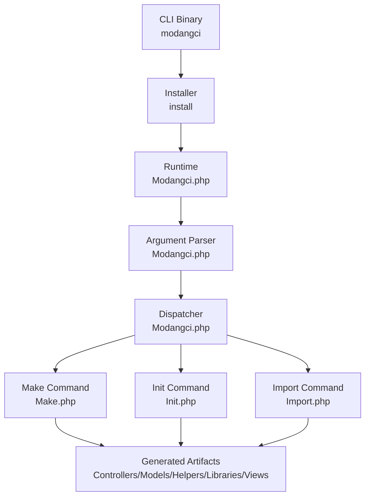
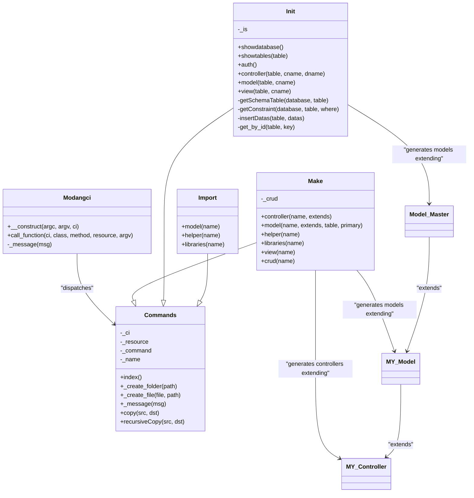
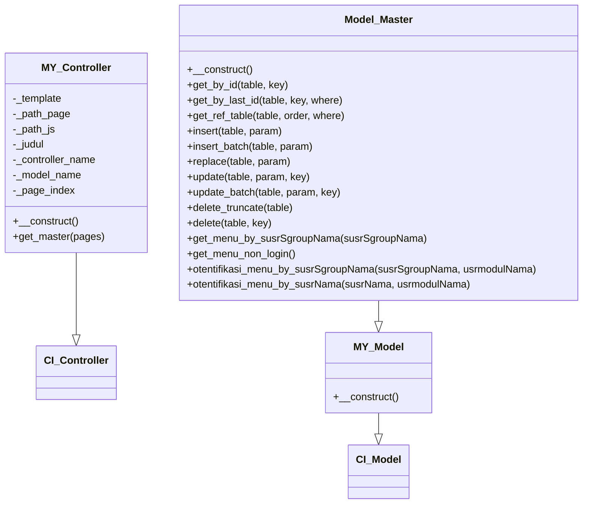
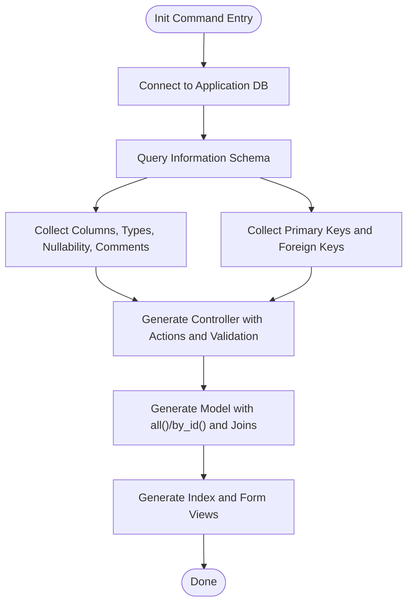
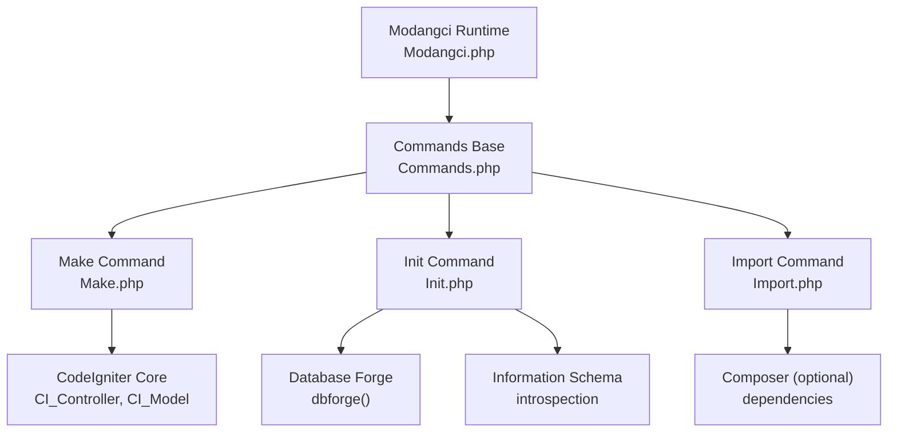

# Generation Configuration

<cite>
**Referenced Files in This Document**
- [README.md](file://README.md)
- [composer.json](file://composer.json)
- [install](file://install)
- [Modangci.php](file://src/Modangci.php)
- [Commands.php](file://src/Commands.php)
- [Make.php](file://src/commands/Make.php)
- [Init.php](file://src/commands/Init.php)
- [Import.php](file://src/commands/Import.php)
- [MY_Controller.php](file://src/application/core/MY_Controller.php)
- [MY_Model.php](file://src/application/core/MY_Model.php)
- [Model_Master.php](file://src/application/core/Model_Master.php)
- [Home.php](file://src/application/controllers/Home.php)
- [Model_home.php](file://src/application/models/Model_home.php)
</cite>

## Table of Contents
1. [Introduction](#introduction)
2. [Project Structure](#project-structure)
3. [Core Components](#core-components)
4. [Architecture Overview](#architecture-overview)
5. [Detailed Component Analysis](#detailed-component-analysis)
6. [Dependency Analysis](#dependency-analysis)
7. [Performance Considerations](#performance-considerations)
8. [Troubleshooting Guide](#troubleshooting-guide)
9. [Conclusion](#conclusion)
10. [Appendices](#appendices)

## Introduction
This document explains Modangci’s generation configuration options and parameters for CodeIgniter 3. It covers command-line usage, resource flags, customization options, validation and defaults, error scenarios, base class extension mechanisms for controllers and models, table specification and primary key configuration, and database integration. It also includes examples of command syntax variations, parameter combinations, advanced configuration scenarios, parameter precedence, validation rules, and troubleshooting.

## Project Structure
Modangci is a CodeIgniter 3 CLI tool packaged as a Composer package. The CLI entrypoint installs a binary script and delegates to the internal Modangci runtime. The runtime parses arguments, validates allowed flags, and dispatches to command handlers (Make, Init, Import). Generated artifacts are written into the target CodeIgniter application under standard directories.

**Diagram sources**
- [install](file://install)
- [Modangci.php](file://src/Modangci.php)
- [Make.php](file://src/commands/Make.php)
- [Init.php](file://src/commands/Init.php)
- [Import.php](file://src/commands/Import.php)

**Section sources**
- [README.md](file://README.md)
- [composer.json](file://composer.json)
- [install](file://install)

## Core Components
- CLI entrypoint and installer: Copies runtime and binary into the application root.
- Runtime dispatcher: Validates CLI context, normalizes arguments, filters resource flags, and dispatches to command classes.
- Command handlers:
  - Make: Generates controllers, models, helpers, libraries, views, and CRUD bundles.
  - Init: Scaffolds authentication and CRUD scaffolding from database schema.
  - Import: Imports reusable components (core models, helpers, libraries).
- Base classes: MY_Controller and MY_Model provide foundational behavior; Model_Master adds database operations.

Key generation parameters and flags:
- Resource flag -r: Enables CRUD method stubs in generated controllers and related scaffolding.
- Extends parameters: Allows specifying base classes for controllers and models.
- Table and primary key parameters: Configure model table mapping and primary key handling.

Validation and defaults:
- Argument normalization and filtering for allowed flags.
- Default base classes when extends parameters are omitted.
- Conditional generation of CRUD methods and model functions based on presence of flags and parameters.

**Section sources**
- [Modangci.php](file://src/Modangci.php)
- [Commands.php](file://src/Commands.php)
- [Make.php](file://src/commands/Make.php)
- [Init.php](file://src/commands/Init.php)
- [Import.php](file://src/commands/Import.php)
- [MY_Controller.php](file://src/application/core/MY_Controller.php)
- [MY_Model.php](file://src/application/core/MY_Model.php)
- [Model_Master.php](file://src/application/core/Model_Master.php)

## Architecture Overview
The CLI architecture separates concerns across argument parsing, resource flag handling, command dispatch, and artifact generation. The Init command integrates with the application database to introspect schema and generate strongly typed CRUD scaffolding.

**Diagram sources**
- [Modangci.php](file://src/Modangci.php)
- [Commands.php](file://src/Commands.php)
- [Make.php](file://src/commands/Make.php)
- [Init.php](file://src/commands/Init.php)
- [Import.php](file://src/commands/Import.php)
- [MY_Controller.php](file://src/application/core/MY_Controller.php)
- [MY_Model.php](file://src/application/core/MY_Model.php)
- [Model_Master.php](file://src/application/core/Model_Master.php)

## Detailed Component Analysis

### CLI Runtime and Argument Parsing
- Enforces CLI context and exits otherwise.
- Normalizes arguments to lowercase and filters allowed resource flags.
- Dispatches to the appropriate command class and method with remaining arguments.

Parameter validation and precedence:
- Unknown non-flag arguments cause immediate exit with an “Not Allowed Parameter” message.
- Resource flags are extracted and passed to command handlers; they influence subsequent generation behavior.

Default handling:
- If a command expects parameters but receives none, it prints usage via the index method.

Error scenarios:
- Non-CLI invocation terminates immediately.
- Invalid flags trigger termination with a message.
- File/folder creation failures are reported with contextual messages.

**Section sources**
- [Modangci.php](file://src/Modangci.php)
- [Commands.php](file://src/Commands.php)

### Make Command: Controllers, Models, Helpers, Libraries, Views, CRUD
- Controller generation:
  - Supports optional extends parameter; defaults to the framework’s base controller if omitted.
  - With -r, generates CRUD stubs (response, create, update, save, delete).
  - Conditionally loads a model and renders a view when in CRUD mode.
- Model generation:
  - Supports optional extends parameter; defaults to the framework’s base model if omitted.
  - With table parameter, generates an all() function selecting from the table.
  - With both table and primary key parameters, generates a by_id() function using the provided primary key.
- Helper, Libraries, and View generation:
  - Creates skeleton files with minimal boilerplate.
- CRUD bundle:
  - Generates controller, model, and view with -r enabled and sets internal flags accordingly.

Parameter validation and defaults:
- Missing required parameters invokes usage help.
- Extends parameters default to framework base classes when null or empty string.
- Table and primary key parameters are treated as present if not null and not equal to the sentinel string.

Error scenarios:
- Attempting to overwrite existing folders or files triggers a message and aborts.
- Unable to write files/folders results in a failure message.

**Section sources**
- [Make.php](file://src/commands/Make.php)

### Init Command: Database-Driven Scaffolding
- Database introspection:
  - Uses the application’s database connection to query information schema for table metadata and constraints.
  - Retrieves columns, data types, nullability, comments, and foreign keys.
- Authentication scaffolding:
  - Creates role-based tables and seeds initial data.
  - Copies core controllers, models, helpers, libraries, views, and assets into the application.
- Controller scaffolding:
  - Generates a controller class extending a base controller.
  - Builds index/create/update/save/delete actions with form validation and encryption-aware key handling.
  - Loads related reference tables for foreign key columns.
- Model scaffolding:
  - Generates a model extending a master model with all() and by_id() methods.
  - Joins referenced tables for foreign key columns.
- View scaffolding:
  - Generates index and form views with dynamic table headers, rows, and form controls.
  - Renders select controls for foreign key references.

Parameter validation and defaults:
- Missing parameters trigger usage help.
- Defaults for primary key and foreign key handling are derived from schema inspection.

Error scenarios:
- Non-existent tables produce a “Table Not Found” message.
- Database errors during transactions are captured and surfaced via messages.

**Section sources**
- [Init.php](file://src/commands/Init.php)

### Import Command: Reusable Components
- Imports core model templates and custom model templates into application/core.
- Imports helper files into application/helpers.
- Imports library files into application/libraries; runs Composer for specific dependencies when required.

Parameter validation and defaults:
- Missing name triggers usage help.
- Library import may execute Composer to satisfy dependencies.

**Section sources**
- [Import.php](file://src/commands/Import.php)

### Base Class Extension Mechanism
- Controllers:
  - Generated controllers can extend a custom base controller by passing an extends parameter.
  - The provided example demonstrates a base controller that enforces authentication and prepares shared view data.
- Models:
  - Generated models can extend a custom base model by passing an extends parameter.
  - The provided example shows a master model that encapsulates database operations and integrates with a base model.

**Diagram sources**
- [MY_Controller.php](file://src/application/core/MY_Controller.php)
- [MY_Model.php](file://src/application/core/MY_Model.php)
- [Model_Master.php](file://src/application/core/Model_Master.php)

**Section sources**
- [MY_Controller.php](file://src/application/core/MY_Controller.php)
- [MY_Model.php](file://src/application/core/MY_Model.php)
- [Model_Master.php](file://src/application/core/Model_Master.php)
- [Home.php](file://src/application/controllers/Home.php)
- [Model_home.php](file://src/application/models/Model_home.php)

### Table Specification, Primary Key Configuration, and Database Integration
- Table specification:
  - When generating a model with a table parameter, the generator creates a protected property and an all() function that selects from the specified table.
- Primary key configuration:
  - When both table and primary key parameters are provided, the generator adds a protected primary property and a by_id() function that queries by the given primary key.
- Database integration:
  - The Init command connects to the application database and queries information schema to derive table and column metadata, foreign keys, and constraints.
  - It uses these insights to generate strongly typed controllers, models, and views.

**Diagram sources**
- [Init.php](file://src/commands/Init.php)

**Section sources**
- [Make.php](file://src/commands/Make.php)
- [Init.php](file://src/commands/Init.php)

## Dependency Analysis
- Runtime depends on CodeIgniter’s input helper for CLI detection and file helper for writing artifacts.
- Make and Init depend on CodeIgniter’s database and database forge for schema operations and table creation.
- Generated controllers depend on base controller classes; generated models depend on base model classes and optionally a master model.

**Diagram sources**
- [Modangci.php](file://src/Modangci.php)
- [Commands.php](file://src/Commands.php)
- [Make.php](file://src/commands/Make.php)
- [Init.php](file://src/commands/Init.php)
- [Import.php](file://src/commands/Import.php)

**Section sources**
- [Modangci.php](file://src/Modangci.php)
- [Make.php](file://src/commands/Make.php)
- [Init.php](file://src/commands/Init.php)
- [Import.php](file://src/commands/Import.php)

## Performance Considerations
- Batch operations: Prefer batch insert/update methods when generating models to reduce transaction overhead.
- Database introspection: The Init command performs multiple information schema queries; caching or limiting schema scans can improve performance in large databases.
- File writes: Writing many files during CRUD scaffolding can be I/O bound; ensure adequate disk performance.

## Troubleshooting Guide
Common issues and resolutions:
- Non-CLI invocation:
  - Symptom: Immediate exit with a CLI-only message.
  - Resolution: Run the command from a terminal.
- Invalid flags:
  - Symptom: Immediate exit with “Not Allowed Parameter”.
  - Resolution: Use only supported flags (e.g., -r).
- Overwriting existing files/folders:
  - Symptom: Messages indicating existing items and abort.
  - Resolution: Remove or rename existing items, or choose a different name.
- Database connectivity (Init):
  - Symptom: Failures during table creation or schema inspection.
  - Resolution: Verify database credentials and permissions; ensure the information schema database is accessible.
- Missing Composer dependencies (Import libraries):
  - Symptom: Library import fails due to missing packages.
  - Resolution: Run the recommended Composer command to install required packages.

**Section sources**
- [Modangci.php](file://src/Modangci.php)
- [Init.php](file://src/commands/Init.php)
- [Import.php](file://src/commands/Import.php)

## Conclusion
Modangci provides a flexible CLI for generating and scaffolding CodeIgniter 3 applications. Its parameterized generation supports customization via extends parameters, resource flags, and database-driven scaffolding. The runtime enforces validation and defaults, while the base class hierarchy enables consistent controller and model behavior. By understanding parameter precedence, validation rules, and error scenarios, developers can efficiently configure and troubleshoot generation workflows.

## Appendices

### Command Syntax and Examples
- Make controller:
  - Syntax: make controller name [extends_name] [-r]
  - Example: generate a controller named Example extending a custom base controller with CRUD stubs.
- Make model:
  - Syntax: make model name [extends_name] [table_name] [primary_key]
  - Example: generate a model named Example with table mapping and primary key handling.
- Make helper/libraries/view:
  - Syntax: make helper name, make libraries name, make view name
  - Example: generate a helper and a library with default skeletons.
- Make CRUD:
  - Syntax: make crud name
  - Example: generate a complete CRUD bundle with controller, model, and view.
- Import components:
  - Syntax: import model master, import helper name, import libraries name
  - Example: import a reusable model template and a helper.
- Init scaffolding:
  - Syntax: init auth, init controller table_name controller_class controller_display, init model table_name model_class, init view table_name folder_name, init crud table_name class_name display_name
  - Example: scaffold authentication and a CRUD module from an existing table.

**Section sources**
- [README.md](file://README.md)
- [Make.php](file://src/commands/Make.php)
- [Import.php](file://src/commands/Import.php)
- [Init.php](file://src/commands/Init.php)