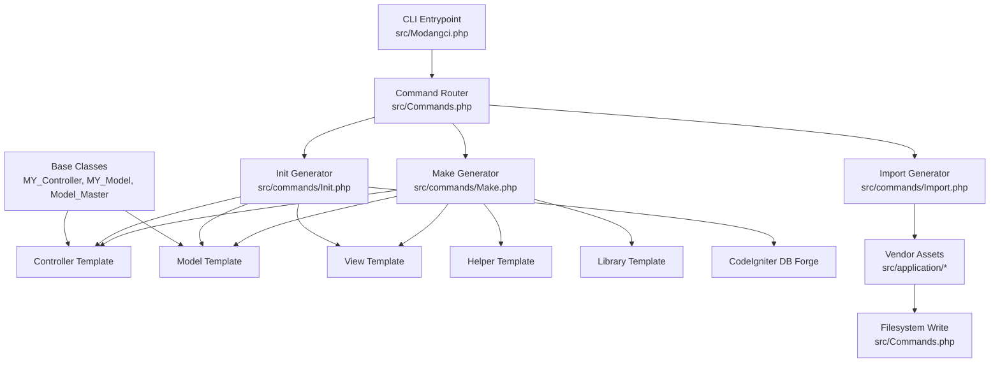
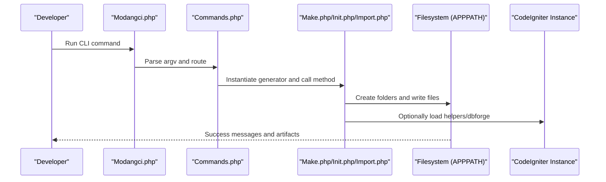
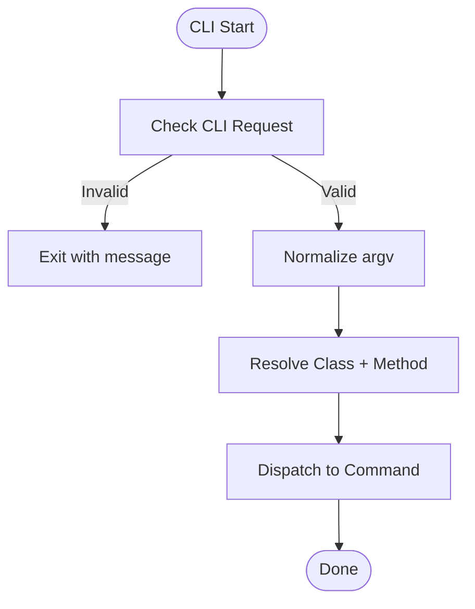
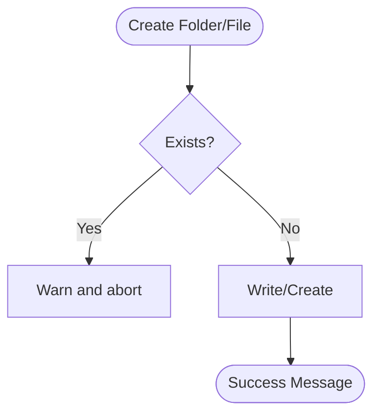
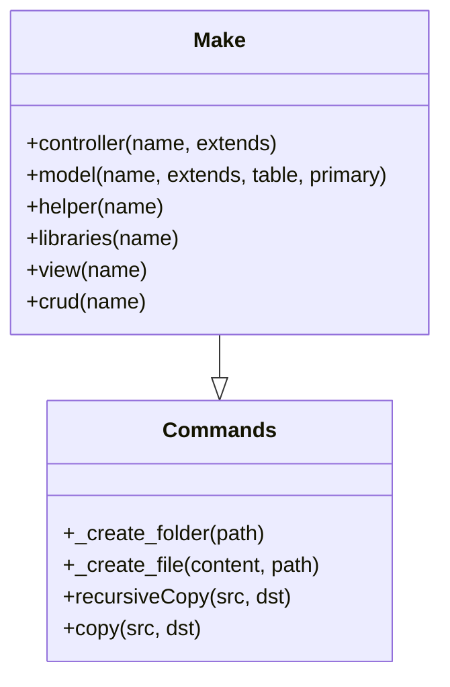
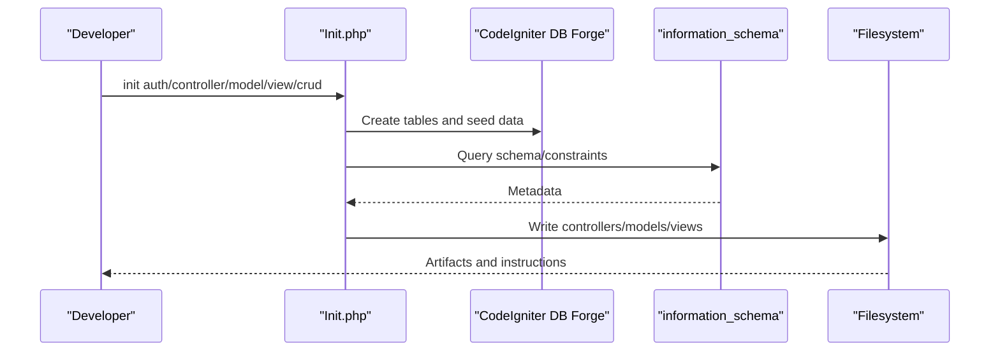
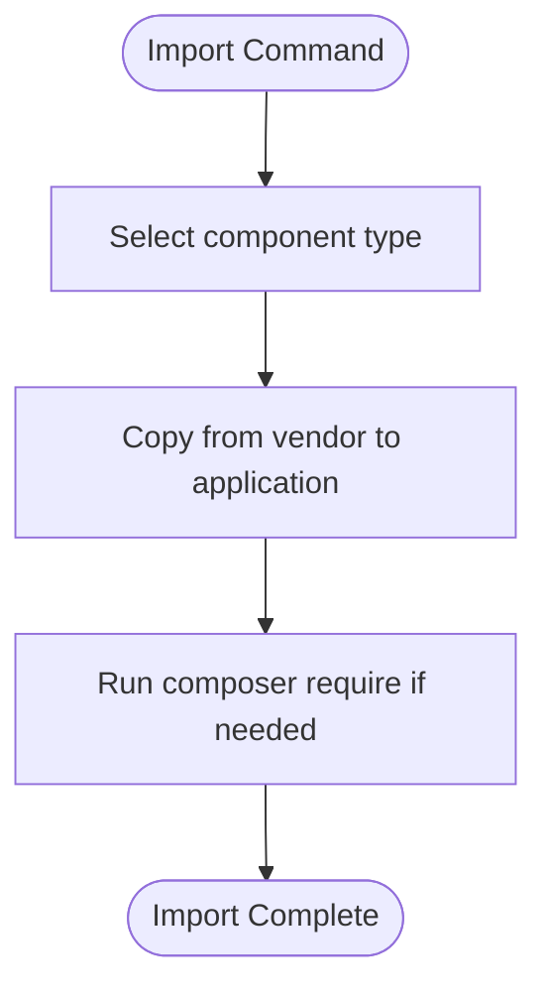
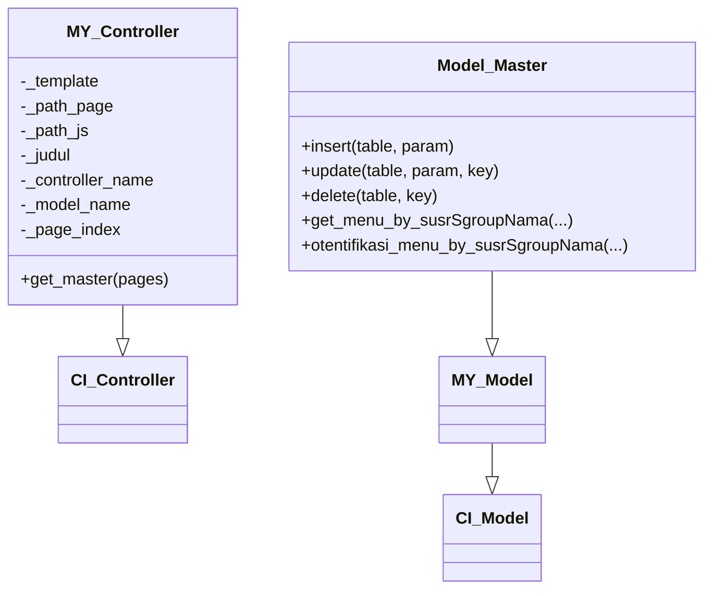
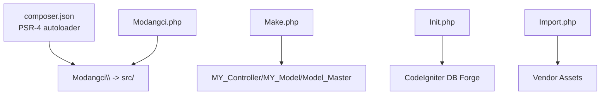

# Template System

<cite>
**Referenced Files in This Document**
- [Modangci.php](file://src/Modangci.php)
- [Commands.php](file://src/Commands.php)
- [Make.php](file://src/commands/Make.php)
- [Init.php](file://src/commands/Init.php)
- [Import.php](file://src/commands/Import.php)
- [MY_Controller.php](file://src/application/core/MY_Controller.php)
- [MY_Model.php](file://src/application/core/MY_Model.php)
- [Model_Master.php](file://src/application/core/Model_Master.php)
- [message_helper.php](file://src/application/helpers/message_helper.php)
- [Encryptions.php](file://src/application/libraries/Encryptions.php)
- [Model_hakakses.php](file://src/application/models/Model_hakakses.php)
- [Hakakses.php](file://src/application/controllers/Hakakses.php)
- [composer.json](file://composer.json)
</cite>

## Table of Contents
1. [Introduction](#introduction)
2. [Project Structure](#project-structure)
3. [Core Components](#core-components)
4. [Architecture Overview](#architecture-overview)
5. [Detailed Component Analysis](#detailed-component-analysis)
6. [Dependency Analysis](#dependency-analysis)
7. [Performance Considerations](#performance-considerations)
8. [Troubleshooting Guide](#troubleshooting-guide)
9. [Conclusion](#conclusion)
10. [Appendices](#appendices)

## Introduction
This document explains Modangci’s template system architecture for CodeIgniter 3. It covers how templates are generated, how files are created and organized, and how the system integrates with CodeIgniter conventions. It documents the template structures for controllers, models, views, helpers, and libraries, and details the file creation workflow, directory maintenance, and naming conventions. It also describes customization capabilities, base class extension mechanisms, automatic generation patterns, validation and error handling, and debugging techniques.

## Project Structure
Modangci is a CLI tool that scaffolds CodeIgniter applications. The CLI entrypoint routes commands to specific generators, which either create files from templates or import prebuilt components from vendor assets. The system adheres to CodeIgniter’s conventional directory layout under application/ and public/.

**Diagram sources**
- [Modangci.php:1-60](file://src/Modangci.php#L1-L60)
- [Commands.php:1-135](file://src/Commands.php#L1-L135)
- [Make.php:1-211](file://src/commands/Make.php#L1-L211)
- [Init.php:1-917](file://src/commands/Init.php#L1-L917)
- [Import.php:1-53](file://src/commands/Import.php#L1-L53)
- [MY_Controller.php:1-59](file://src/application/core/MY_Controller.php#L1-L59)
- [MY_Model.php:1-21](file://src/application/core/MY_Model.php#L1-L21)
- [Model_Master.php:1-257](file://src/application/core/Model_Master.php#L1-L257)

**Section sources**
- [Modangci.php:1-60](file://src/Modangci.php#L1-L60)
- [Commands.php:1-135](file://src/Commands.php#L1-L135)
- [composer.json:1-25](file://composer.json#L1-L25)

## Core Components
- CLI Entrypoint: Parses arguments, validates CLI context, and dispatches to the appropriate command class.
- Command Base: Provides shared filesystem operations (folder creation, file writing, recursive copy).
- Generators:
  - Make: Creates controllers, models, helpers, libraries, views, and CRUD bundles.
  - Init: Scaffolds authentication, controllers, models, views, and imports assets from vendor.
  - Import: Copies prebuilt components from vendor to application/.
- Base Classes: MY_Controller, MY_Model, Model_Master define conventions and reusable logic.

Key behaviors:
- Naming normalization and enforcement (class names capitalized, lowercase folders).
- Conditional generation of CRUD methods and model/table scaffolding.
- Validation via CodeIgniter form validation and AJAX-aware save routines.
- Debugging hooks via helper functions and transaction logging.

**Section sources**
- [Modangci.php:10-53](file://src/Modangci.php#L10-L53)
- [Commands.php:20-97](file://src/Commands.php#L20-L97)
- [Make.php:16-211](file://src/commands/Make.php#L16-L211)
- [Init.php:125-478](file://src/commands/Init.php#L125-L478)
- [Import.php:14-52](file://src/commands/Import.php#L14-L52)
- [MY_Controller.php:13-51](file://src/application/core/MY_Controller.php#L13-L51)
- [MY_Model.php:12-15](file://src/application/core/MY_Model.php#L12-L15)
- [Model_Master.php:56-186](file://src/application/core/Model_Master.php#L56-L186)

## Architecture Overview
The CLI orchestrates command execution, which then writes files to APPPATH according to CodeIgniter conventions. Generators use templates embedded in PHP strings and optionally introspect database schemas for Init.

**Diagram sources**
- [Modangci.php:10-53](file://src/Modangci.php#L10-L53)
- [Commands.php:43-53](file://src/Commands.php#L43-L53)
- [Make.php:16-211](file://src/commands/Make.php#L16-L211)
- [Init.php:13-29](file://src/commands/Init.php#L13-L29)
- [Import.php:14-52](file://src/commands/Import.php#L14-L52)

## Detailed Component Analysis

### CLI Entrypoint and Routing
- Validates CLI context and rejects web requests.
- Normalizes arguments and enforces allowed parameters.
- Resolves command class and method, then invokes dynamically.

**Diagram sources**
- [Modangci.php:13-41](file://src/Modangci.php#L13-L41)

**Section sources**
- [Modangci.php:10-53](file://src/Modangci.php#L10-L53)

### Command Base: Filesystem Operations
- Folder creation with existence checks and permission handling.
- File creation with overwrite prevention and write_file helper.
- Recursive copy for assets and views.

**Diagram sources**
- [Commands.php:59-97](file://src/Commands.php#L59-L97)

**Section sources**
- [Commands.php:20-97](file://src/Commands.php#L20-L97)

### Make Generator: Template Creation
- Controllers:
  - Optional CRUD methods (-r flag).
  - Optional model loading and data rendering.
  - Extends CI_Controller or custom base class.
- Models:
  - Optional table and primary key scaffolding.
  - Auto-generated all()/by_id() methods.
  - Extends CI_Model or custom base class.
- Helpers:
  - Function wrapper with guard.
- Libraries:
  - Constructor with CodeIgniter instance access.
- Views:
  - Optional simple HTML or CRUD data placeholder.
  - Creates page folder and index view.
- CRUD bundle:
  - Chains controller, model, and view generation.

**Diagram sources**
- [Make.php:16-211](file://src/commands/Make.php#L16-L211)
- [Commands.php:59-97](file://src/Commands.php#L59-L97)

**Section sources**
- [Make.php:16-211](file://src/commands/Make.php#L16-L211)

### Init Generator: Schema-Driven Scaffolding
- Authentication scaffolding:
  - Creates tables via dbforge.
  - Seeds default groups, modules, and users.
  - Imports controllers, models, views, assets, and core files.
- Controller scaffolding:
  - Reads schema and constraints from information_schema.
  - Generates CRUD actions with form validation and encryption.
  - Loads foreign reference data for selects.
- Model scaffolding:
  - Builds join-enabled all()/by_id() based on foreign keys.
- View scaffolding:
  - Generates index table and form with dynamic columns and selects.

**Diagram sources**
- [Init.php:125-478](file://src/commands/Init.php#L125-L478)
- [Init.php:480-640](file://src/commands/Init.php#L480-L640)
- [Init.php:642-701](file://src/commands/Init.php#L642-L701)
- [Init.php:703-892](file://src/commands/Init.php#L703-L892)

**Section sources**
- [Init.php:125-478](file://src/commands/Init.php#L125-L478)
- [Init.php:480-640](file://src/commands/Init.php#L480-L640)
- [Init.php:642-701](file://src/commands/Init.php#L642-L701)
- [Init.php:703-892](file://src/commands/Init.php#L703-L892)

### Import Generator: Vendor Asset Copy
- Copies core, helpers, libraries, and assets from vendor to application/.
- Handles Composer dependency injection for specific libraries.

**Diagram sources**
- [Import.php:14-52](file://src/commands/Import.php#L14-L52)

**Section sources**
- [Import.php:14-52](file://src/commands/Import.php#L14-L52)

### Base Classes and Conventions
- MY_Controller:
  - Session guard and breadcrumb/menu resolution.
  - Centralized page data composition via get_master().
- MY_Model:
  - Extends CI_Model and auto-includes Model_Master if present.
- Model_Master:
  - Transactional CRUD helpers, logging hook via debuglog helper, menu retrieval, and access control helpers.

**Diagram sources**
- [MY_Controller.php:3-51](file://src/application/core/MY_Controller.php#L3-L51)
- [MY_Model.php:3-15](file://src/application/core/MY_Model.php#L3-L15)
- [Model_Master.php:2-257](file://src/application/core/Model_Master.php#L2-L257)

**Section sources**
- [MY_Controller.php:13-51](file://src/application/core/MY_Controller.php#L13-L51)
- [MY_Model.php:12-15](file://src/application/core/MY_Model.php#L12-L15)
- [Model_Master.php:56-257](file://src/application/core/Model_Master.php#L56-L257)

### Example Generated Artifacts
- Controller example demonstrates CRUD actions, encryption decoding, form validation, and AJAX handling.
- Model example shows minimal extension of Model_Master.
- Helper and library examples demonstrate standardized wrappers.

**Section sources**
- [Hakakses.php:1-109](file://src/application/controllers/Hakakses.php#L1-L109)
- [Model_hakakses.php:1-11](file://src/application/models/Model_hakakses.php#L1-L11)
- [message_helper.php:4-21](file://src/application/helpers/message_helper.php#L4-L21)
- [Encryptions.php:21-53](file://src/application/libraries/Encryptions.php#L21-L53)

## Dependency Analysis
- Autoloading: PSR-4 maps Modangci namespace to src/.
- CLI routing depends on CodeIgniter input and helper loading.
- Generators depend on CodeIgniter filesystem helpers and dbforge for Init.
- Base classes are autoloaded via MY_* naming and optional Model_Master inclusion.

**Diagram sources**
- [composer.json:20-24](file://composer.json#L20-L24)
- [Modangci.php:12-17](file://src/Modangci.php#L12-L17)
- [Make.php:54-68](file://src/commands/Make.php#L54-L68)
- [Init.php:13-29](file://src/commands/Init.php#L13-L29)
- [Import.php:39-48](file://src/commands/Import.php#L39-L48)

**Section sources**
- [composer.json:20-24](file://composer.json#L20-L24)
- [Modangci.php:12-17](file://src/Modangci.php#L12-L17)
- [Make.php:54-68](file://src/commands/Make.php#L54-L68)
- [Init.php:13-29](file://src/commands/Init.php#L13-L29)
- [Import.php:39-48](file://src/commands/Import.php#L39-L48)

## Performance Considerations
- Use Init’s schema-driven generation to avoid manual CRUD boilerplate and reduce runtime overhead.
- Prefer batch operations where applicable (e.g., insert_batch/update_batch) via Model_Master to minimize round trips.
- Keep view templates lean; defer heavy logic to controllers/models.
- Leverage MY_Controller’s centralized data composition to avoid duplication.

## Troubleshooting Guide
Common issues and resolutions:
- CLI not running in terminal:
  - The CLI checks for CLI context and exits otherwise. Ensure you run via php index.php or equivalent.
- Permission errors when creating folders or files:
  - Verify APPPATH permissions and that the web server can write to application/.
- Duplicate files or folders:
  - Generators check for existing paths and abort to prevent overwrites. Remove manually if necessary.
- Missing base classes:
  - Ensure MY_Controller, MY_Model, and Model_Master are copied/imported. MY_Model auto-includes Model_Master if present.
- Database schema errors during Init:
  - Confirm database credentials and that information_schema is accessible. Review table creation and constraint steps.
- AJAX save failures:
  - Validate form validation rules and ensure encryption keys match. Use message helper responses for diagnostics.

**Section sources**
- [Modangci.php:13-17](file://src/Modangci.php#L13-L17)
- [Commands.php:62-73](file://src/Commands.php#L62-L73)
- [MY_Model.php:12-15](file://src/application/core/MY_Model.php#L12-L15)
- [Init.php:13-29](file://src/commands/Init.php#L13-L29)
- [Hakakses.php:55-94](file://src/application/controllers/Hakakses.php#L55-L94)

## Conclusion
Modangci provides a robust, convention-friendly template system for CodeIgniter 3. It automates controller, model, view, helper, and library creation, supports schema-driven scaffolding, and integrates seamlessly with MY_Controller and Model_Master patterns. By enforcing naming and directory conventions and offering customization hooks, it accelerates development while maintaining adherence to CodeIgniter best practices.

## Appendices

### Template Structure Reference
- Controllers:
  - Base: CI_Controller or custom base class.
  - Optional: CRUD methods, model loading, and data rendering.
- Models:
  - Base: CI_Model or MY_Model/Model_Master chain.
  - Optional: table and primary key scaffolding with all()/by_id().
- Views:
  - Page-specific folders with index and form views.
  - Dynamic content placeholders for CRUD.
- Helpers:
  - Function wrapper with guard clause.
- Libraries:
  - Constructor with CodeIgniter instance access.

**Section sources**
- [Make.php:54-68](file://src/commands/Make.php#L54-L68)
- [Make.php:113-123](file://src/commands/Make.php#L113-L123)
- [Make.php:183-189](file://src/commands/Make.php#L183-L189)
- [Make.php:135-144](file://src/commands/Make.php#L135-L144)
- [Make.php:156-166](file://src/commands/Make.php#L156-L166)

### Customization and Extension Patterns
- Extend base classes:
  - Replace MY_Controller/MY_Model/Model_Master with your own implementations and import via Init or Import.
- Modify templates:
  - Adjust Make generator templates to inject additional traits, constructor logic, or method stubs.
- Integrate helpers and libraries:
  - Use Import to bring in additional helpers/libraries and update autoload accordingly.

**Section sources**
- [MY_Controller.php:3-51](file://src/application/core/MY_Controller.php#L3-L51)
- [MY_Model.php:3-15](file://src/application/core/MY_Model.php#L3-L15)
- [Model_Master.php:2-7](file://src/application/core/Model_Master.php#L2-L7)
- [Import.php:14-52](file://src/commands/Import.php#L14-L52)