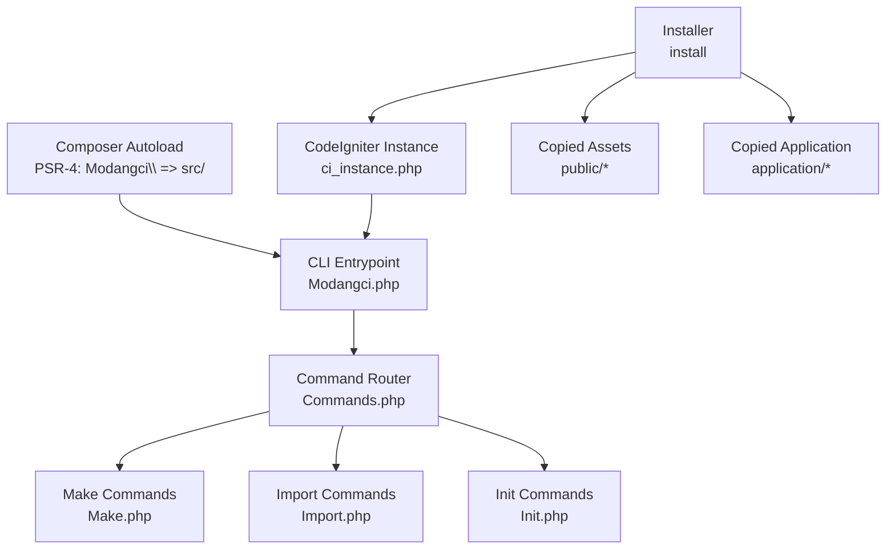
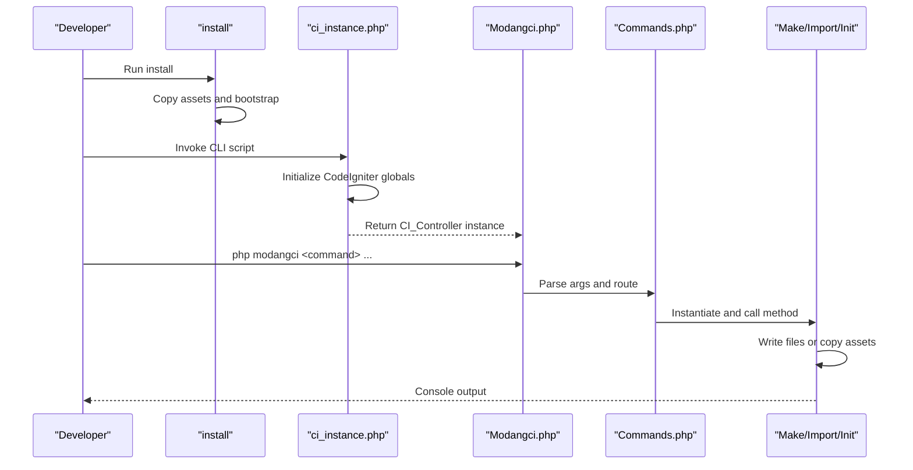
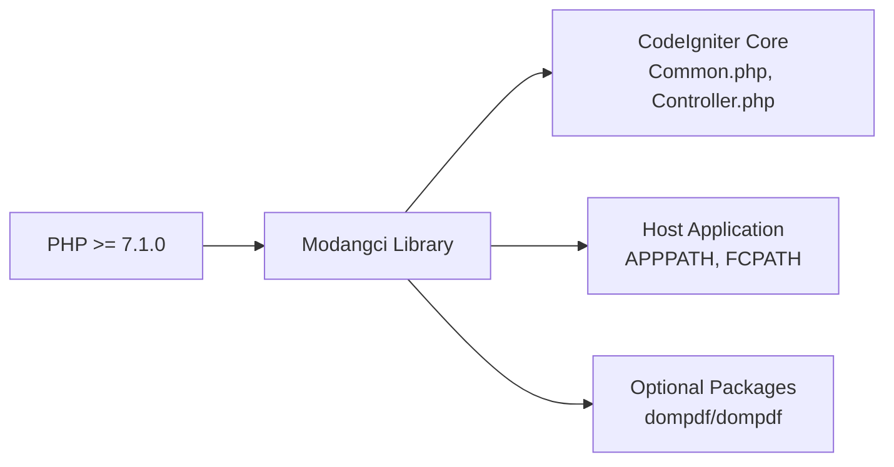

# Configuration and Customization

<cite>
**Referenced Files in This Document**
- [composer.json](file://composer.json)
- [README.md](file://README.md)
- [Modangci.php](file://src/Modangci.php)
- [Commands.php](file://src/Commands.php)
- [ci_instance.php](file://ci_instance.php)
- [install](file://install)
- [Init.php](file://src/commands/Init.php)
- [Make.php](file://src/commands/Make.php)
- [Import.php](file://src/commands/Import.php)
- [MY_Controller.php](file://src/application/core/MY_Controller.php)
- [MY_Model.php](file://src/application/core/MY_Model.php)
- [Model_Master.php](file://src/application/core/Model_Master.php)
- [template.php](file://src/application/views/layouts/template.php)
- [Home.php](file://src/application/controllers/Home.php)
- [Model_pengguna.php](file://src/application/models/Model_pengguna.php)
- [Encryptions.php](file://src/application/libraries/Encryptions.php)
- [message_helper.php](file://src/application/helpers/message_helper.php)
</cite>

## Table of Contents
1. [Introduction](#introduction)
2. [Project Structure](#project-structure)
3. [Core Components](#core-components)
4. [Architecture Overview](#architecture-overview)
5. [Detailed Component Analysis](#detailed-component-analysis)
6. [Dependency Analysis](#dependency-analysis)
7. [Performance Considerations](#performance-considerations)
8. [Troubleshooting Guide](#troubleshooting-guide)
9. [Conclusion](#conclusion)
10. [Appendices](#appendices)

## Introduction
This document explains how to configure and customize Modangci for CodeIgniter 3.x, including Composer PSR-4 autoloading, CLI integration with an existing CodeIgniter application, and the extensibility options provided by the plugin-like command system. It covers environment setup, configuration file formats, customization of templates and styling, extending base classes, creating custom commands, and best practices for security and deployment.

## Project Structure
Modangci is packaged as a Composer library that integrates into an existing CodeIgniter application via a small bootstrap script and an installer. The core CLI entrypoint delegates to command classes under a dedicated namespace. The application scaffolding includes controllers, models, views, assets, helpers, and libraries that can be imported or generated.

**Diagram sources**
- [composer.json:20-24](file://composer.json#L20-L24)
- [Modangci.php:10-41](file://src/Modangci.php#L10-L41)
- [Commands.php:7-18](file://src/Commands.php#L7-L18)
- [Make.php:7-14](file://src/commands/Make.php#L7-L14)
- [Import.php:7-12](file://src/commands/Import.php#L7-L12)
- [Init.php:7-12](file://src/commands/Init.php#L7-L12)
- [ci_instance.php:15-86](file://ci_instance.php#L15-L86)
- [install:15-26](file://install#L15-L26)

**Section sources**
- [composer.json:1-25](file://composer.json#L1-L25)
- [README.md:1-41](file://README.md#L1-L41)
- [ci_instance.php:15-86](file://ci_instance.php#L15-L86)
- [install:15-60](file://install#L15-L60)

## Core Components
- Composer configuration defines PSR-4 autoloading so Modangci classes resolve under the Modangci\ namespace from src/.
- CLI entrypoint validates CLI context, parses arguments, and dispatches to the appropriate command class.
- Base command class provides shared filesystem operations and messaging.
- Command classes implement “make,” “import,” and “init” workflows to scaffold or copy components into the host CodeIgniter application.
- Core application scaffolding includes MY_Controller, MY_Model, Model_Master, helpers, libraries, and views.

**Section sources**
- [composer.json:20-24](file://composer.json#L20-L24)
- [Modangci.php:10-59](file://src/Modangci.php#L10-L59)
- [Commands.php:7-134](file://src/Commands.php#L7-L134)
- [Make.php:7-211](file://src/commands/Make.php#L7-L211)
- [Import.php:7-53](file://src/commands/Import.php#L7-L53)
- [Init.php:7-478](file://src/commands/Init.php#L7-L478)

## Architecture Overview
The CLI architecture is a thin bridge between the host CodeIgniter application and Modangci’s command system. The installer copies essential files into the host app, and the CLI bootstrap initializes CodeIgniter so commands can leverage the framework’s loader, database, and helpers.

**Diagram sources**
- [install:15-26](file://install#L15-L26)
- [ci_instance.php:79-86](file://ci_instance.php#L79-L86)
- [Modangci.php:10-41](file://src/Modangci.php#L10-L41)
- [Commands.php:43-53](file://src/Commands.php#L43-L53)
- [Make.php:16-73](file://src/commands/Make.php#L16-L73)
- [Import.php:14-35](file://src/commands/Import.php#L14-L35)
- [Init.php:125-478](file://src/commands/Init.php#L125-L478)

## Detailed Component Analysis

### Composer Configuration and PSR-4 Autoloading
- Package declares a PSR-4 namespace mapping that resolves Modangci\ to src/, enabling autoloading of all command and core classes.
- Requires PHP >= 7.1.0.

Best practices:
- Keep the namespace consistent with the package name to avoid collisions.
- Ensure src/ remains the canonical source location for Modangci classes.

**Section sources**
- [composer.json:17-24](file://composer.json#L17-L24)

### CLI Entrypoint and Command Routing
- Validates CLI context and rejects web requests.
- Normalizes arguments, filters allowed flags, and constructs the target class and method names.
- Delegates to the command class’ method if it exists; otherwise prints the help index.

Security considerations:
- Enforces CLI-only execution.
- Sanitizes parameters against a whitelist of allowed flags.

**Section sources**
- [Modangci.php:10-59](file://src/Modangci.php#L10-L59)

### Base Command Utilities
- Provides filesystem helpers: single-file copy, recursive directory copy, folder creation, and file writing with overwrite checks.
- Centralized console messaging.

Extensibility:
- Extend the base Commands class to add new filesystem operations or shared logic for custom commands.

**Section sources**
- [Commands.php:20-97](file://src/Commands.php#L20-L97)

### Make Commands
- Generates controllers, models, helpers, libraries, and views.
- Supports a resource flag to generate a basic CRUD skeleton.
- Writes files into the host application’s directories using APPPATH.

Customization tips:
- Adjust the generated templates by editing the file generation logic in the Make command class.
- Add new scaffolding templates by introducing new methods and file patterns.

**Section sources**
- [Make.php:16-211](file://src/commands/Make.php#L16-L211)

### Import Commands
- Copies prebuilt components (core models, helpers, libraries) into the host application.
- Some libraries require additional Composer dependencies (e.g., PDF generator) and are installed automatically.

Integration notes:
- After importing, ensure the host application’s autoload configuration loads the copied components.

**Section sources**
- [Import.php:14-53](file://src/commands/Import.php#L14-L53)

### Init Commands
- Initializes a ready-to-use admin scaffolding: creates database tables, seeds roles and permissions, imports controllers, models, views, and assets.
- Outputs configuration hints for autoload and config settings.

Key capabilities:
- Database introspection to derive primary keys, foreign keys, and schema details.
- Dynamic generation of controllers with CRUD actions and views with form scaffolding.
- Menu and permission retrieval via Model_Master.

**Section sources**
- [Init.php:125-478](file://src/commands/Init.php#L125-L478)

### Core Application Classes and Extensibility
- MY_Controller centralizes layout selection, breadcrumb generation, and access control checks.
- MY_Model extends CI_Model and conditionally loads Model_Master if present.
- Model_Master provides reusable CRUD operations and permission-related queries.

Extending base classes:
- To customize controller behavior, extend MY_Controller and override methods like get_master().
- To add shared model logic, extend MY_Model or Model_Master and implement domain-specific methods.

**Section sources**
- [MY_Controller.php:3-59](file://src/application/core/MY_Controller.php#L3-L59)
- [MY_Model.php:3-21](file://src/application/core/MY_Model.php#L3-L21)
- [Model_Master.php:2-257](file://src/application/core/Model_Master.php#L2-L257)

### Views and Styling Customization
- The default layout renders a modular admin template and includes asset bundles for styles and scripts.
- Customize by replacing or extending the layout and page views, and by adjusting asset paths and skin CSS files.

Patterns:
- Use the template’s page injection mechanism to render module-specific views.
- Add per-page scripts via the scripts array passed to the layout.

**Section sources**
- [template.php:14-180](file://src/application/views/layouts/template.php#L14-L180)

### Controllers and Models Example
- Home controller demonstrates how to set up a controller that uses MY_Controller’s layout and Model_Master for data retrieval.
- Model_pengguna illustrates joining related tables and exposing typed methods for listing and fetching records.

Customization:
- Override controller initialization to set different templates, page paths, and model names.
- Extend models to encapsulate domain logic and reuse across controllers.

**Section sources**
- [Home.php:4-121](file://src/application/controllers/Home.php#L4-L121)
- [Model_pengguna.php:2-36](file://src/application/models/Model_pengguna.php#L2-L36)

### Libraries and Helpers
- Encryptions library wraps CodeIgniter’s encryption with a simplified interface and safe base64 encoding.
- message helper standardizes AJAX response formatting for consistent frontend handling.

Customization:
- Replace or extend libraries to integrate third-party packages.
- Enhance helpers to provide domain-specific utilities.

**Section sources**
- [Encryptions.php:2-56](file://src/application/libraries/Encryptions.php#L2-L56)
- [message_helper.php:4-22](file://src/application/helpers/message_helper.php#L4-L22)

## Dependency Analysis
Modangci depends on:
- PHP >= 7.1.0
- CodeIgniter 3.x core classes initialized via ci_instance.php
- Optional Composer packages for certain libraries (e.g., PDF generator)

**Diagram sources**
- [composer.json:17-19](file://composer.json#L17-L19)
- [ci_instance.php:34-77](file://ci_instance.php#L34-L77)
- [Import.php:37-46](file://src/commands/Import.php#L37-L46)

**Section sources**
- [composer.json:17-19](file://composer.json#L17-L19)
- [ci_instance.php:34-77](file://ci_instance.php#L34-L77)
- [Import.php:37-46](file://src/commands/Import.php#L37-L46)

## Performance Considerations
- Use batch operations where possible (e.g., insert_batch, update_batch) to reduce transaction overhead.
- Minimize repeated database calls in controllers by caching frequently accessed menus or permissions.
- Keep generated views lean; defer heavy computations to models or background jobs.

## Troubleshooting Guide
Common issues and resolutions:
- CLI not recognized: Ensure the script is invoked from the project root and that the environment is set to CLI.
- Permission errors when writing files: Verify write permissions for APPPATH and directories under application/.
- Missing autoload entries after import: Update the host application’s autoload configuration to load the imported components.
- Composer dependency failures: Install required packages manually if the import command fails to execute shell commands.

**Section sources**
- [Modangci.php:13-17](file://src/Modangci.php#L13-L17)
- [Commands.php:76-92](file://src/Commands.php#L76-L92)
- [Import.php:45-46](file://src/commands/Import.php#L45-L46)

## Conclusion
Modangci provides a robust, extensible CLI toolkit for CodeIgniter 3.x that integrates cleanly with existing applications. By leveraging Composer autoloading, a clear command routing system, and scaffolded core components, developers can accelerate CRUD generation, import reusable utilities, and bootstrap role-based admin systems. Customization is achieved through extending base classes, modifying templates, and adding new commands.

## Appendices

### Environment Setup and Configuration
- Development vs. Production:
  - Set the environment variable for CodeIgniter to choose environment-specific configuration files.
  - Ensure autoload arrays include required libraries and helpers for your generated components.
- Configuration files:
  - Host application constants and environment configs are loaded during bootstrap.
  - Generated components may require updates to base_url and session save paths.

**Section sources**
- [ci_instance.php:18-40](file://ci_instance.php#L18-L40)
- [Init.php:471-478](file://src/commands/Init.php#L471-L478)

### Creating Custom Commands
- Extend the base Commands class to reuse filesystem and messaging utilities.
- Add a new command class under the Modangci\Commands namespace and implement methods for your workflow.
- Register the command in the CLI router or add a dispatcher entry to route user input to your new class.

**Section sources**
- [Commands.php:7-18](file://src/Commands.php#L7-L18)
- [Modangci.php:36-53](file://src/Modangci.php#L36-L53)

### Extending Base Classes
- Controllers: Extend MY_Controller to standardize layout, menus, and access control.
- Models: Extend MY_Model or Model_Master to share CRUD and permission logic.
- Libraries: Wrap framework features or third-party packages for consistent usage across controllers.
- Helpers: Provide reusable functions for formatting, validation, or UI utilities.

**Section sources**
- [MY_Controller.php:3-59](file://src/application/core/MY_Controller.php#L3-L59)
- [MY_Model.php:3-21](file://src/application/core/MY_Model.php#L3-L21)
- [Model_Master.php:2-257](file://src/application/core/Model_Master.php#L2-L257)
- [Encryptions.php:2-56](file://src/application/libraries/Encryptions.php#L2-L56)
- [message_helper.php:4-22](file://src/application/helpers/message_helper.php#L4-L22)

### Security Best Practices
- Validate and sanitize all user inputs in controllers and models.
- Use prepared statements and ORM-like patterns exposed by the framework.
- Store secrets and encryption keys securely; avoid hardcoding sensitive values.
- Limit file writes to necessary directories and enforce strict permissions.

**Section sources**
- [Modangci.php:24-32](file://src/Modangci.php#L24-L32)
- [Home.php:62-96](file://src/application/controllers/Home.php#L62-L96)
- [Encryptions.php:3-53](file://src/application/libraries/Encryptions.php#L3-L53)

### Deployment Strategies for Customized Installations
- Freeze Composer dependencies and lock versions for reproducible builds.
- Commit only necessary generated files; exclude auto-generated assets if they are rebuilt in CI.
- Use environment-specific configuration files and keep secrets out of version control.
- Automate scaffolding steps in CI to ensure consistency across environments.

[No sources needed since this section provides general guidance]