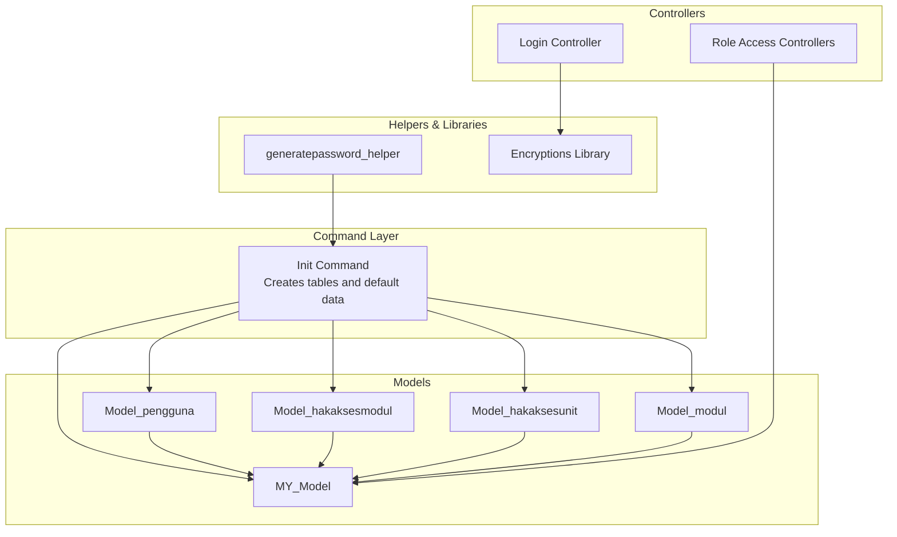
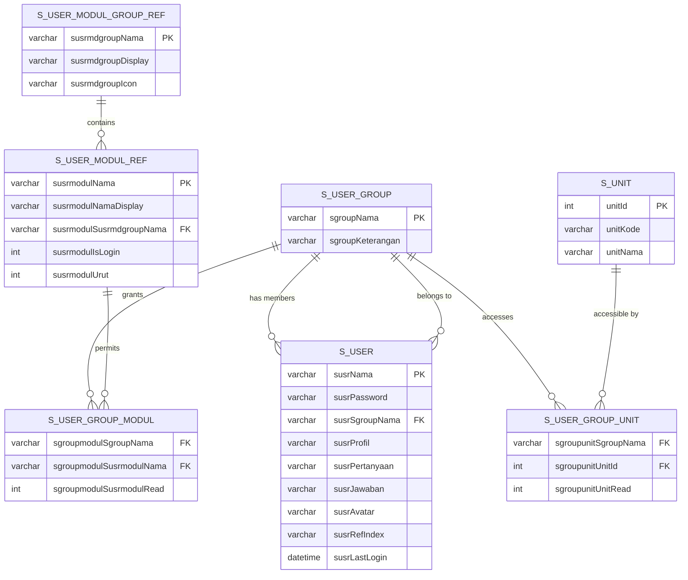
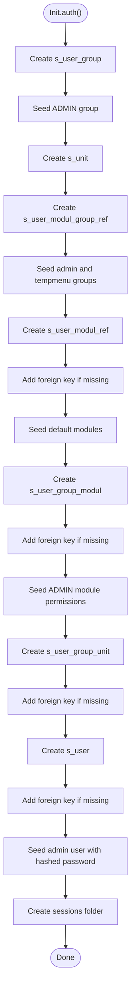
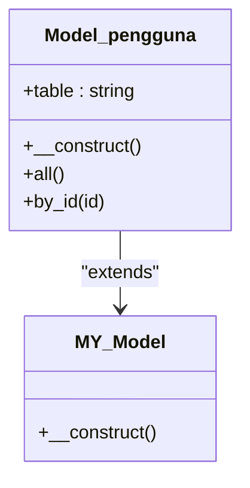
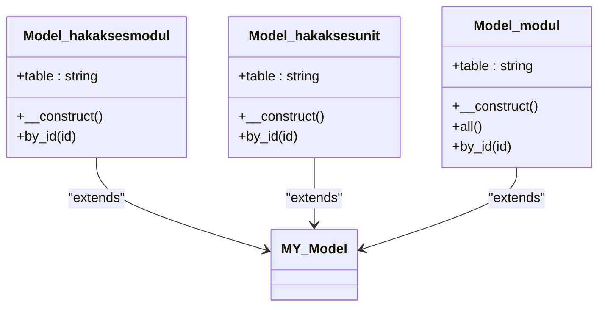
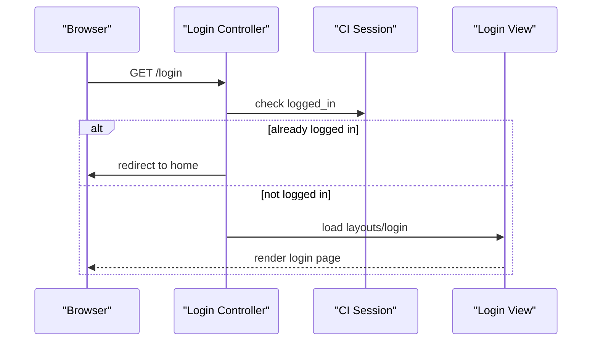
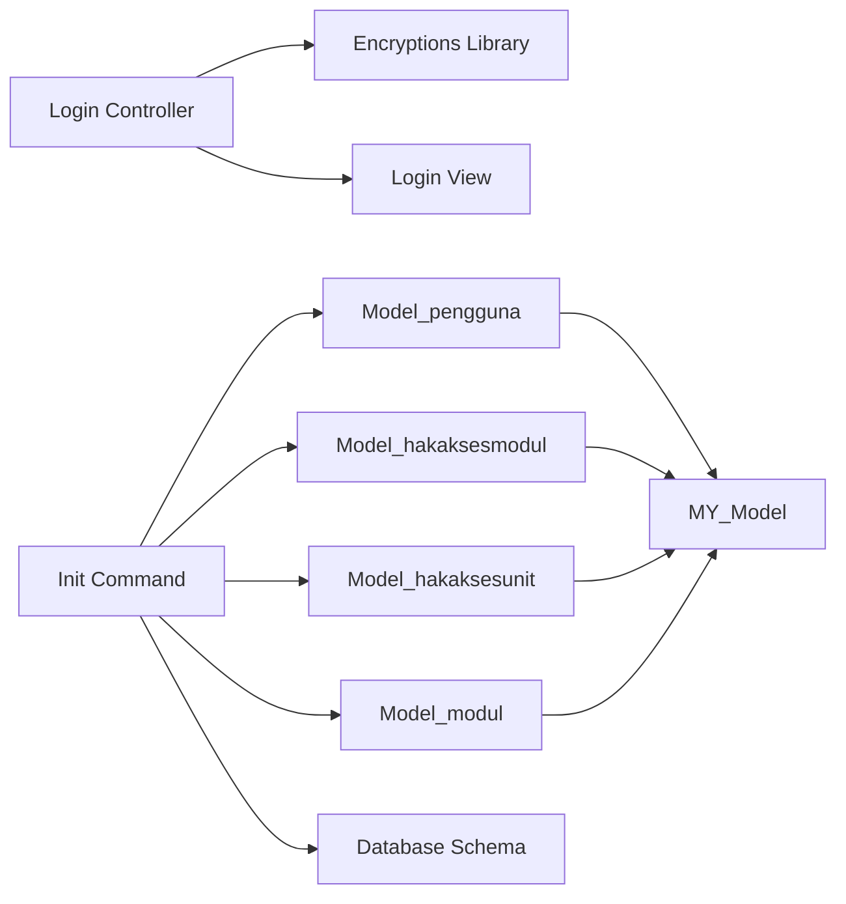

# Authentication Database Schema

<cite>
**Referenced Files in This Document**
- [Init.php](file://src/commands/Init.php)
- [MY_Model.php](file://src/application/core/MY_Model.php)
- [Model_pengguna.php](file://src/application/models/Model_pengguna.php)
- [Model_hakaksesmodul.php](file://src/application/models/Model_hakaksesmodul.php)
- [Model_hakaksesunit.php](file://src/application/models/Model_hakaksesunit.php)
- [Model_modul.php](file://src/application/models/Model_modul.php)
- [Login.php](file://src/application/controllers/Login.php)
- [Model_login.php](file://src/application/models/Model_login.php)
- [generatepassword_helper.php](file://src/application/helpers/generatepassword_helper.php)
- [Encryptions.php](file://src/application/libraries/Encryptions.php)
</cite>

## Table of Contents
1. [Introduction](#introduction)
2. [Project Structure](#project-structure)
3. [Core Components](#core-components)
4. [Architecture Overview](#architecture-overview)
5. [Detailed Component Analysis](#detailed-component-analysis)
6. [Dependency Analysis](#dependency-analysis)
7. [Performance Considerations](#performance-considerations)
8. [Troubleshooting Guide](#troubleshooting-guide)
9. [Conclusion](#conclusion)

## Introduction
This document describes the authentication database schema and implementation used by Modangci. It covers the complete set of authentication-related tables, their relationships, constraints, and how they integrate with the generated CRUD components and controllers. It also documents the multi-role architecture supporting user groups, module permissions, and unit-based access control, along with migration processes, default data insertion, and security considerations such as password hashing and session management.

## Project Structure
The authentication system spans several layers:
- Database schema creation and migrations via a command class
- Base framework models and a master model
- Authentication-specific models for users, roles, modules, and units
- Controllers for login and role-based access management
- Helpers and libraries supporting encryption and password generation
- Views and assets for the login page and role management UI

**Diagram sources**
- [Init.php:125-478](file://src/commands/Init.php#L125-L478)
- [MY_Model.php:1-21](file://src/application/core/MY_Model.php#L1-L21)
- [Model_pengguna.php:1-36](file://src/application/models/Model_pengguna.php#L1-L36)
- [Model_hakaksesmodul.php:1-26](file://src/application/models/Model_hakaksesmodul.php#L1-L26)
- [Model_hakaksesunit.php:1-25](file://src/application/models/Model_hakaksesunit.php#L1-L25)
- [Model_modul.php:1-37](file://src/application/models/Model_modul.php#L1-L37)
- [Login.php:1-18](file://src/application/controllers/Login.php#L1-L18)
- [generatepassword_helper.php](file://src/application/helpers/generatepassword_helper.php)
- [Encryptions.php](file://src/application/libraries/Encryptions.php)

**Section sources**
- [Init.php:125-478](file://src/commands/Init.php#L125-L478)
- [MY_Model.php:1-21](file://src/application/core/MY_Model.php#L1-L21)

## Core Components
This section outlines the authentication tables, their fields, primary keys, and foreign key constraints. It also documents default data insertion and migration steps.

- s_user_group
  - Purpose: Defines user groups (roles) such as ADMIN.
  - Primary key: sgroupNama (unique group identifier).
  - Default data: ADMIN group inserted during initialization.

- s_unit
  - Purpose: Unit dimension for hierarchical or organizational access control.
  - Primary key: unitId (auto-increment).
  - Fields include unitCode and unitName.

- s_user_modul_group_ref
  - Purpose: Module groups (e.g., admin, tempmenu) used to categorize modules.
  - Primary key: susrmdgroupNama.
  - Default data: admin and tempmenu groups inserted during initialization.

- s_user_modul_ref
  - Purpose: Individual modules (features) with metadata such as display name, grouping, sort order, and login requirement.
  - Primary key: susrmodulNama.
  - Foreign key: susrmodulSusrmdgroupNama references s_user_modul_group_ref(susrmdgroupNama).
  - Default data: predefined modules inserted during initialization.

- s_user_group_modul
  - Purpose: Permission bridge between user groups and modules (who can read/access which modules).
  - Composite primary key: (sgroupmodulSgroupNama, sgroupmodulSusrmodulNama).
  - Foreign keys:
    - sgroupmodulSusrmodulNama references s_user_modul_ref(susrmodulNama)
    - sgroupmodulSgroupNama references s_user_group(sgroupNama)
  - Default data: ADMIN group granted access to all default modules during initialization.

- s_user_group_unit
  - Purpose: Unit-based access control per user group.
  - Composite primary key: (sgroupunitSgroupNama, sgroupunitUnitId).
  - Foreign keys:
    - sgroupunitUnitId references s_unit(unitId)
    - sgroupunitSgroupNama references s_user_group(sgroupNama)

- s_user
  - Purpose: Application users with credentials and profile attributes.
  - Primary key: susrNama (username).
  - Foreign key: susrSgroupNama references s_user_group(sgroupNama).
  - Fields include hashed password, profile, security question/answer, avatar, ref index, and last login timestamp.
  - Default data: admin user inserted during initialization with a hashed password.

Migration and default data insertion are orchestrated by the Init command. It creates tables, adds foreign key constraints when missing, and seeds default records for groups, modules, group-module permissions, units, and the admin user.

**Section sources**
- [Init.php:142-420](file://src/commands/Init.php#L142-L420)
- [Model_pengguna.php:4-10](file://src/application/models/Model_pengguna.php#L4-L10)
- [Model_modul.php:4-10](file://src/application/models/Model_modul.php#L4-L10)
- [Model_hakaksesmodul.php:4-10](file://src/application/models/Model_hakaksesmodul.php#L4-L10)
- [Model_hakaksesunit.php:4-10](file://src/application/models/Model_hakaksesunit.php#L4-L10)

## Architecture Overview
The authentication architecture follows a multi-role pattern:
- Users belong to a single group (s_user.susrSgroupNama -> s_user_group.sgroupNama).
- Groups have module permissions defined in s_user_group_modul.
- Groups have unit-level access defined in s_user_group_unit.
- Modules are grouped under s_user_modul_group_ref and listed in s_user_modul_ref.
- Users are represented by s_user with hashed passwords and profile metadata.

**Diagram sources**
- [Init.php:142-420](file://src/commands/Init.php#L142-L420)

## Detailed Component Analysis

### Database Migration and Constraint Management
The Init command performs:
- Table creation for all authentication tables with appropriate field definitions and primary keys.
- Constraint checks against INFORMATION_SCHEMA to avoid duplicating foreign keys.
- Addition of foreign key constraints when missing.
- Seeding of default data for groups, module groups, modules, group-module permissions, units, and the admin user.
- Creation of sessions directory for session storage.

**Diagram sources**
- [Init.php:125-478](file://src/commands/Init.php#L125-L478)

**Section sources**
- [Init.php:125-478](file://src/commands/Init.php#L125-L478)

### User Model and Join Logic
The user model demonstrates how user records are joined with their group information for display and management.

**Diagram sources**
- [MY_Model.php:1-21](file://src/application/core/MY_Model.php#L1-L21)
- [Model_pengguna.php:1-36](file://src/application/models/Model_pengguna.php#L1-L36)

**Section sources**
- [Model_pengguna.php:4-34](file://src/application/models/Model_pengguna.php#L4-L34)

### Module and Group Access Models
These models encapsulate queries to enforce multi-role and module permission logic.

**Diagram sources**
- [MY_Model.php:1-21](file://src/application/core/MY_Model.php#L1-L21)
- [Model_hakaksesmodul.php:1-26](file://src/application/models/Model_hakaksesmodul.php#L1-L26)
- [Model_hakaksesunit.php:1-25](file://src/application/models/Model_hakaksesunit.php#L1-L25)
- [Model_modul.php:1-37](file://src/application/models/Model_modul.php#L1-L37)

**Section sources**
- [Model_hakaksesmodul.php:12-24](file://src/application/models/Model_hakaksesmodul.php#L12-L24)
- [Model_hakaksesunit.php:12-23](file://src/application/models/Model_hakaksesunit.php#L12-L23)
- [Model_modul.php:11-35](file://src/application/models/Model_modul.php#L11-L35)

### Login Flow and Session Management
The login controller checks whether a user is already logged in and renders the login view. Session management is configured via the application configuration to use a dedicated sessions directory.

**Diagram sources**
- [Login.php:1-18](file://src/application/controllers/Login.php#L1-L18)

**Section sources**
- [Login.php:6-16](file://src/application/controllers/Login.php#L6-L16)

### Password Hashing and Security Helpers
Default user creation uses a secure hashing mechanism for storing passwords. A helper exists for generating passwords, and an encryption library is available for encoding/decoding identifiers in URLs and forms.

- Default user password is hashed using a secure hashing method during initialization.
- The generatepassword_helper provides utilities for password generation.
- The Encryptions library supports encoding/decoding values for safe transport in URLs.

**Section sources**
- [Init.php:419-419](file://src/commands/Init.php#L419-L419)
- [generatepassword_helper.php](file://src/application/helpers/generatepassword_helper.php)
- [Encryptions.php](file://src/application/libraries/Encryptions.php)

## Dependency Analysis
The authentication system exhibits layered dependencies:
- Controllers depend on models and libraries/helpers.
- Models extend a shared base model and encapsulate queries.
- The Init command orchestrates schema creation and seeding.
- Views rely on controllers and models to render data.

**Diagram sources**
- [Login.php:1-18](file://src/application/controllers/Login.php#L1-L18)
- [MY_Model.php:1-21](file://src/application/core/MY_Model.php#L1-L21)
- [Model_pengguna.php:1-36](file://src/application/models/Model_pengguna.php#L1-L36)
- [Model_hakaksesmodul.php:1-26](file://src/application/models/Model_hakaksesmodul.php#L1-L26)
- [Model_hakaksesunit.php:1-25](file://src/application/models/Model_hakaksesunit.php#L1-L25)
- [Model_modul.php:1-37](file://src/application/models/Model_modul.php#L1-L37)
- [Init.php:125-478](file://src/commands/Init.php#L125-L478)

**Section sources**
- [MY_Model.php:1-21](file://src/application/core/MY_Model.php#L1-L21)
- [Init.php:125-478](file://src/commands/Init.php#L125-L478)

## Performance Considerations
- Indexing: Ensure primary keys and foreign keys are indexed (auto-created by the migration process). Consider adding indexes on frequently filtered columns such as user group names and module names.
- Queries: Models join tables to fetch related data. Keep joins minimal and selective to reduce overhead.
- Sessions: Store sessions in a dedicated folder to avoid filesystem bottlenecks and improve scalability.

## Troubleshooting Guide
- Missing foreign keys: The Init command checks INFORMATION_SCHEMA and adds constraints if absent. If constraints appear duplicated, verify the constraint names and referenced tables.
- Default data conflicts: The Init command checks for existing records before inserting defaults. If duplicates occur, adjust seed logic or clean up conflicting rows.
- Login redirection loop: The Login controller redirects logged-in users away from the login page. Verify session data and base URL configuration.
- Session storage: Ensure the sessions directory exists and is writable by the web server.

**Section sources**
- [Init.php:57-77](file://src/commands/Init.php#L57-L77)
- [Login.php:9-10](file://src/application/controllers/Login.php#L9-L10)

## Conclusion
Modangci’s authentication system provides a robust, multi-role architecture with clear separation of concerns across controllers, models, and database schema. The Init command automates schema creation, constraint management, and default data seeding. The models encapsulate permission and access queries, while the login controller integrates with session management. Security is addressed through password hashing and encryption utilities. Together, these components enable scalable, maintainable role-based access control with unit-aware permissions.