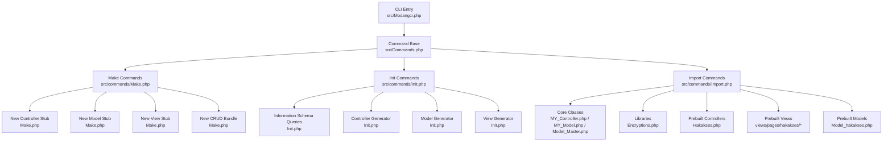
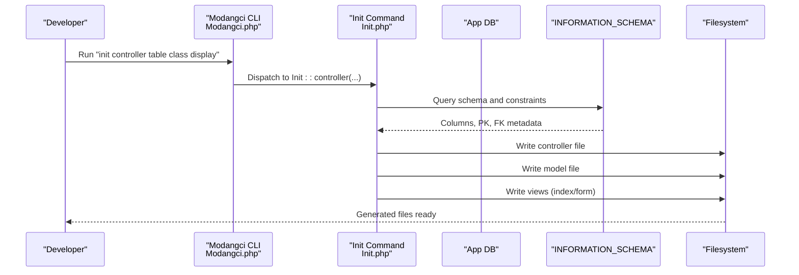
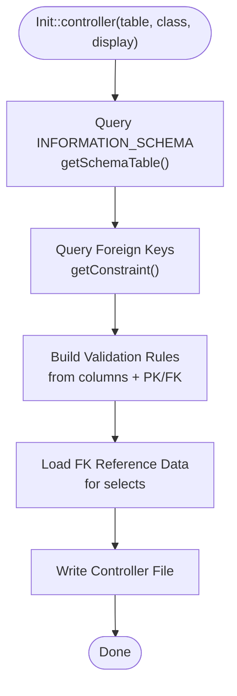
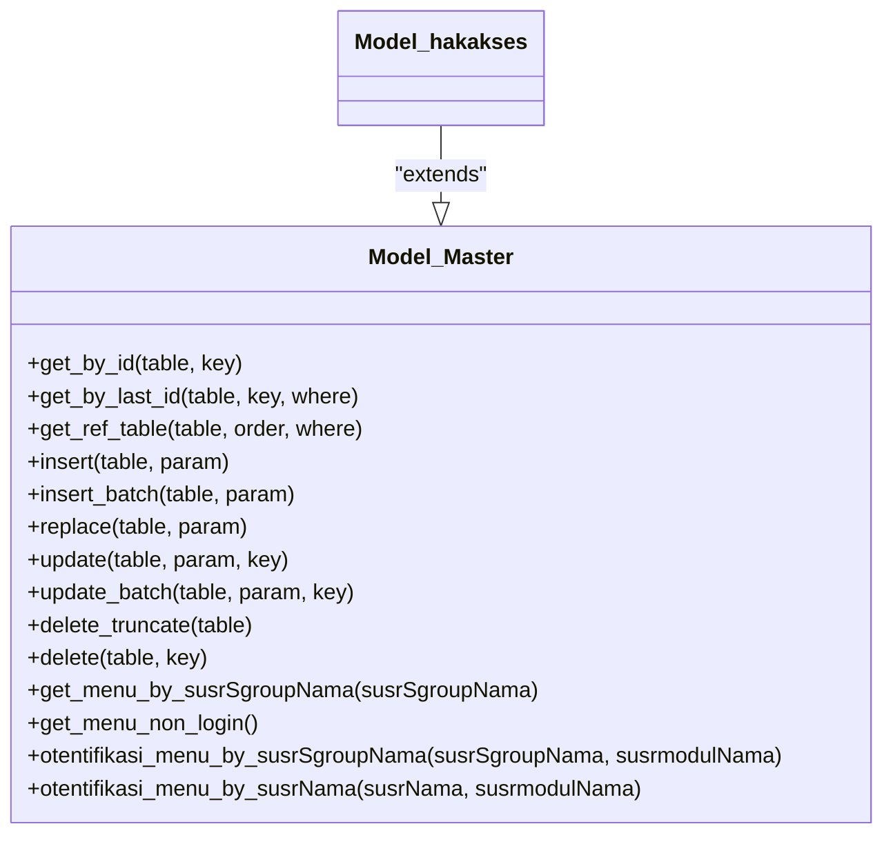
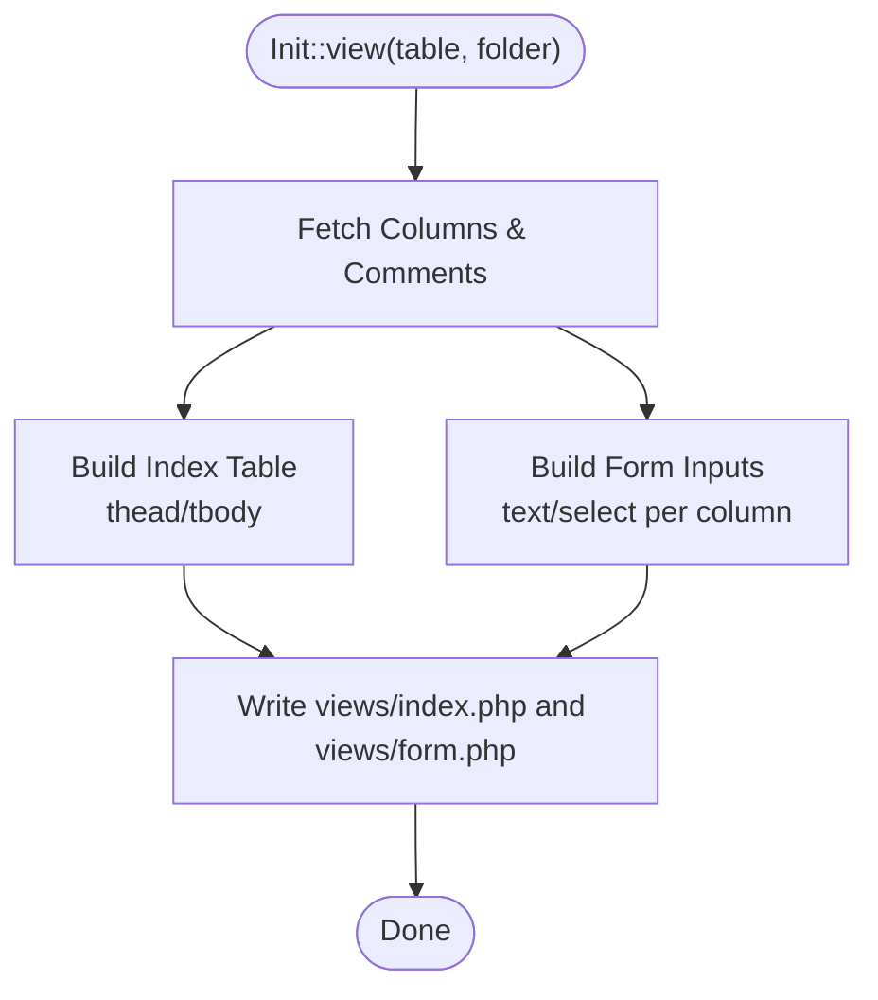
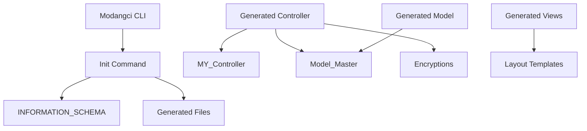

# Automatic CRUD Generation

<cite>
**Referenced Files in This Document**
- [Modangci.php](file://src/Modangci.php)
- [Commands.php](file://src/Commands.php)
- [Make.php](file://src/commands/Make.php)
- [Init.php](file://src/commands/Init.php)
- [Import.php](file://src/commands/Import.php)
- [MY_Controller.php](file://src/application/core/MY_Controller.php)
- [MY_Model.php](file://src/application/core/MY_Model.php)
- [Model_Master.php](file://src/application/core/Model_Master.php)
- [Encryptions.php](file://src/application/libraries/Encryptions.php)
- [Hakakses.php](file://src/application/controllers/Hakakses.php)
- [Model_hakakses.php](file://src/application/models/Model_hakakses.php)
- [index.php](file://src/application/views/pages/hakakses/index.php)
- [form.php](file://src/application/views/pages/hakakses/form.php)
- [README.md](file://README.md)
</cite>

## Table of Contents
1. [Introduction](#introduction)
2. [Project Structure](#project-structure)
3. [Core Components](#core-components)
4. [Architecture Overview](#architecture-overview)
5. [Detailed Component Analysis](#detailed-component-analysis)
6. [Dependency Analysis](#dependency-analysis)
7. [Performance Considerations](#performance-considerations)
8. [Troubleshooting Guide](#troubleshooting-guide)
9. [Conclusion](#conclusion)
10. [Appendices](#appendices)

## Introduction
This document explains Modangci’s automatic CRUD operation generation system for CodeIgniter 3. It covers how database schema analysis translates into controller, model, and view generation. It documents the controller generation process including form validation rules, AJAX handling, encryption integration, and foreign key data loading. It details model generation with automatic JOIN statements, primary key handling, and CRUD method creation. It also covers view generation with Bootstrap integration, form field generation based on column types, and table display logic. Finally, it provides examples of generated code for different table structures, foreign key scenarios, and validation rule inference, along with customization options, template modification, and extending generated CRUD functionality.

## Project Structure
Modangci is a CLI-driven scaffolding tool that generates controllers, models, and views from database schema metadata. The CLI entry point routes commands to dedicated command classes, which either scaffold new components or import prebuilt assets.

**Diagram sources**
- [Modangci.php:1-60](file://src/Modangci.php#L1-L60)
- [Commands.php:1-135](file://src/Commands.php#L1-L135)
- [Make.php:1-211](file://src/commands/Make.php#L1-L211)
- [Init.php:1-917](file://src/commands/Init.php#L1-L917)
- [Import.php:1-53](file://src/commands/Import.php#L1-L53)
- [MY_Controller.php:1-59](file://src/application/core/MY_Controller.php#L1-L59)
- [MY_Model.php:1-21](file://src/application/core/MY_Model.php#L1-L21)
- [Model_Master.php:1-257](file://src/application/core/Model_Master.php#L1-L257)
- [Encryptions.php:1-56](file://src/application/libraries/Encryptions.php#L1-L56)
- [Hakakses.php:1-109](file://src/application/controllers/Hakakses.php#L1-L109)
- [Model_hakakses.php:1-11](file://src/application/models/Model_hakakses.php#L1-L11)
- [index.php:1-88](file://src/application/views/pages/hakakses/index.php#L1-L88)
- [form.php:1-52](file://src/application/views/pages/hakakses/form.php#L1-L52)

**Section sources**
- [Modangci.php:1-60](file://src/Modangci.php#L1-L60)
- [Commands.php:1-135](file://src/Commands.php#L1-L135)
- [README.md:1-41](file://README.md#L1-L41)

## Core Components
- CLI entry and routing: Parses arguments, validates CLI context, and dispatches to command classes.
- Command base: Provides shared helpers for copying files/folders, creating folders and files, and messaging.
- Make commands: Generates controller/model/view stubs and a full CRUD bundle (-r flag enables response/create/update/save/delete methods).
- Init commands: Reads database schema via INFORMATION_SCHEMA, infers primary and foreign keys, and generates controller, model, and view tailored to the table.
- Import commands: Copies core framework classes, libraries, controllers, models, and views into the target application.

**Section sources**
- [Modangci.php:10-53](file://src/Modangci.php#L10-L53)
- [Commands.php:20-97](file://src/Commands.php#L20-L97)
- [Make.php:16-211](file://src/commands/Make.php#L16-L211)
- [Init.php:57-123](file://src/commands/Init.php#L57-L123)
- [Import.php:14-51](file://src/commands/Import.php#L14-L51)

## Architecture Overview
The generation pipeline is driven by database schema metadata. The Init command queries INFORMATION_SCHEMA to discover columns, data types, nullability, comments, primary keys, and foreign keys. Based on this, it generates:
- Controller: form validation rules, AJAX detection, encryption for keys, foreign key data loading, and CRUD actions.
- Model: base CRUD operations and automatic JOINs for foreign-keyed tables.
- View: Bootstrap-based index and form pages, with dynamic field rendering and foreign key selects.

**Diagram sources**
- [Modangci.php:10-53](file://src/Modangci.php#L10-L53)
- [Init.php:57-123](file://src/commands/Init.php#L57-L123)
- [Init.php:480-640](file://src/commands/Init.php#L480-L640)

## Detailed Component Analysis

### CLI Entry and Routing
- Validates CLI context and rejects web requests.
- Parses arguments, normalizes flags, and dispatches to the appropriate command class/method.
- Supports resource flags (e.g., -r) passed through to command constructors.

**Section sources**
- [Modangci.php:13-41](file://src/Modangci.php#L13-L41)

### Command Base Utilities
- Copying single files and recursive directory copies.
- Creating folders and files with existence checks and user feedback.
- Centralized messaging for CLI output.

**Section sources**
- [Commands.php:20-97](file://src/Commands.php#L20-L97)

### Make Commands
- Controller: Creates a controller stub with optional CRUD methods when -r is present. Optionally loads a model and renders a view.
- Model: Creates a model stub with optional table and primary key variables and basic all()/by_id() methods.
- View: Creates a minimal HTML page or a placeholder when in CRUD mode.
- CRUD: Bundles controller, model, and view generation with -r enabled.

**Section sources**
- [Make.php:16-211](file://src/commands/Make.php#L16-L211)

### Init Controller Generation
- Infers primary and foreign keys from INFORMATION_SCHEMA.
- Builds form validation rules from column metadata, including required fields and unique constraints.
- Generates AJAX-aware save logic with insert/update branching and error reporting.
- Encrypts/decrypts keys in URLs using the Encryptions library.
- Loads foreign key reference data into views for select inputs.

**Diagram sources**
- [Init.php:480-640](file://src/commands/Init.php#L480-L640)
- [Init.php:79-108](file://src/commands/Init.php#L79-L108)
- [Init.php:57-77](file://src/commands/Init.php#L57-L77)

**Section sources**
- [Init.php:480-640](file://src/commands/Init.php#L480-L640)
- [Init.php:79-108](file://src/commands/Init.php#L79-L108)
- [Init.php:57-77](file://src/commands/Init.php#L57-L77)

### Init Model Generation
- Detects foreign keys and auto-generates LEFT JOINs in all() and by_id().
- Emits a base model class extending Model_Master with standard CRUD operations.

**Diagram sources**
- [Model_Master.php:1-257](file://src/application/core/Model_Master.php#L1-L257)
- [Model_hakakses.php:1-11](file://src/application/models/Model_hakakses.php#L1-L11)

**Section sources**
- [Init.php:642-701](file://src/commands/Init.php#L642-L701)
- [Model_Master.php:56-186](file://src/application/core/Model_Master.php#L56-L186)

### Init View Generation
- Generates an index table with sortable columns and action buttons.
- Generates a form with inputs for non-FK columns and select dropdowns for FK columns.
- Uses Bootstrap classes and integrates with the layout system.

**Diagram sources**
- [Init.php:703-800](file://src/commands/Init.php#L703-L800)

**Section sources**
- [Init.php:703-800](file://src/commands/Init.php#L703-L800)

### Encryption Integration
- The generated controller uses Encryptions to encode/decode keys in URLs for update/delete actions.
- The library supports AES-256-CBC with safe base64 encoding for URL-safe tokens.

**Section sources**
- [Encryptions.php:21-53](file://src/application/libraries/Encryptions.php#L21-L53)
- [Hakakses.php:46-51](file://src/application/controllers/Hakakses.php#L46-L51)
- [Hakakses.php:98-100](file://src/application/controllers/Hakakses.php#L98-L100)

### Example: Generated CRUD for a Simple Table
- Controller: Defines index/create/update/save/delete, AJAX-aware save, encryption for keys, and loads foreign reference data.
- Model: Extends Model_Master and inherits insert/update/delete methods.
- Views: Bootstrap-styled index and form pages.

**Section sources**
- [Hakakses.php:1-109](file://src/application/controllers/Hakakses.php#L1-L109)
- [Model_hakakses.php:1-11](file://src/application/models/Model_hakakses.php#L1-L11)
- [index.php:1-88](file://src/application/views/pages/hakakses/index.php#L1-L88)
- [form.php:1-52](file://src/application/views/pages/hakakses/form.php#L1-L52)

### Example: Generated CRUD with Foreign Keys
- Controller: Adds foreign key reference data to view data and builds select inputs in the form.
- Model: Auto-generates JOINs for referenced tables in all() and by_id().
- Views: Renders select dropdowns bound to referenced tables.

**Section sources**
- [Init.php:655-685](file://src/commands/Init.php#L655-L685)
- [Init.php:726-751](file://src/commands/Init.php#L726-L751)

### Example: Validation Rule Inference
- Required fields inferred from IS_NULLABLE = 'NO'.
- Unique rules applied to primary keys during create.
- XSS cleaning and trimming applied broadly.

**Section sources**
- [Init.php:506-525](file://src/commands/Init.php#L506-L525)

### Customization Options and Template Modification
- Modify generated controller/model/view templates by editing the Init command’s string builders.
- Adjust Bootstrap classes and layout integration by editing view templates.
- Extend base classes (MY_Controller, MY_Model, Model_Master) to add shared behavior.

**Section sources**
- [Init.php:480-640](file://src/commands/Init.php#L480-L640)
- [Init.php:642-701](file://src/commands/Init.php#L642-L701)
- [Init.php:703-800](file://src/commands/Init.php#L703-L800)
- [MY_Controller.php:1-59](file://src/application/core/MY_Controller.php#L1-L59)
- [MY_Model.php:1-21](file://src/application/core/MY_Model.php#L1-L21)
- [Model_Master.php:1-257](file://src/application/core/Model_Master.php#L1-L257)

### Extending Generated CRUD Functionality
- Add custom methods to the generated model by extending Model_Master methods.
- Override controller actions to add hooks, extra validation, or custom rendering.
- Introduce additional helpers or libraries via Import commands and use them in generated code.

**Section sources**
- [Model_Master.php:56-186](file://src/application/core/Model_Master.php#L56-L186)
- [Import.php:14-51](file://src/commands/Import.php#L14-L51)

## Dependency Analysis
- CLI depends on command classes.
- Init depends on database connectivity and INFORMATION_SCHEMA.
- Generated controller depends on MY_Controller, Model_Master, and Encryptions.
- Generated model depends on Model_Master.
- Generated views depend on the layout system and Bootstrap classes.

**Diagram sources**
- [Modangci.php:10-53](file://src/Modangci.php#L10-L53)
- [Init.php:13-29](file://src/commands/Init.php#L13-L29)
- [MY_Controller.php:1-59](file://src/application/core/MY_Controller.php#L1-L59)
- [Model_Master.php:1-257](file://src/application/core/Model_Master.php#L1-L257)
- [Encryptions.php:1-56](file://src/application/libraries/Encryptions.php#L1-L56)

**Section sources**
- [Modangci.php:10-53](file://src/Modangci.php#L10-L53)
- [Init.php:13-29](file://src/commands/Init.php#L13-L29)

## Performance Considerations
- Information schema queries are lightweight but avoid repeated runs by caching metadata per generation session.
- Generated JOINs in models increase query cost; limit joins to necessary relations.
- AJAX save operations reduce round trips; ensure proper error handling and minimal payload.
- Bootstrap-heavy views can be optimized by removing unused CSS/JS or switching to a minimal theme.

## Troubleshooting Guide
- CLI context errors: Ensure commands are run from CLI, not a browser.
- File conflicts: Creation helpers check for existing files/folders and abort with messages.
- Database connectivity: INFORMATION_SCHEMA queries require read access to the schema database.
- Encryption key mismatch: Ensure encryption_key is configured consistently across controllers and views.
- Validation failures: Review generated rules and adjust required fields or unique constraints.

**Section sources**
- [Modangci.php:13-17](file://src/Modangci.php#L13-L17)
- [Commands.php:62-73](file://src/Commands.php#L62-L73)
- [Init.php:13-29](file://src/commands/Init.php#L13-L29)
- [Hakakses.php:46-51](file://src/application/controllers/Hakakses.php#L46-L51)

## Conclusion
Modangci automates CRUD scaffolding by analyzing database schema and generating cohesive controller, model, and view artifacts. It enforces secure practices like encryption for keys, robust validation inference, and AJAX-aware save logic. Developers can customize templates, extend base classes, and refine generated code to fit project-specific needs.

## Appendices
- Installation and usage commands are documented in the project README.

**Section sources**
- [README.md:7-41](file://README.md#L7-L41)