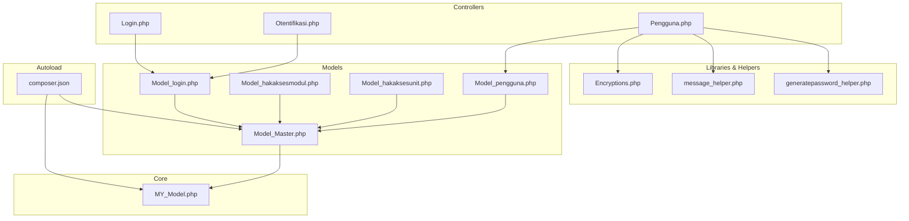
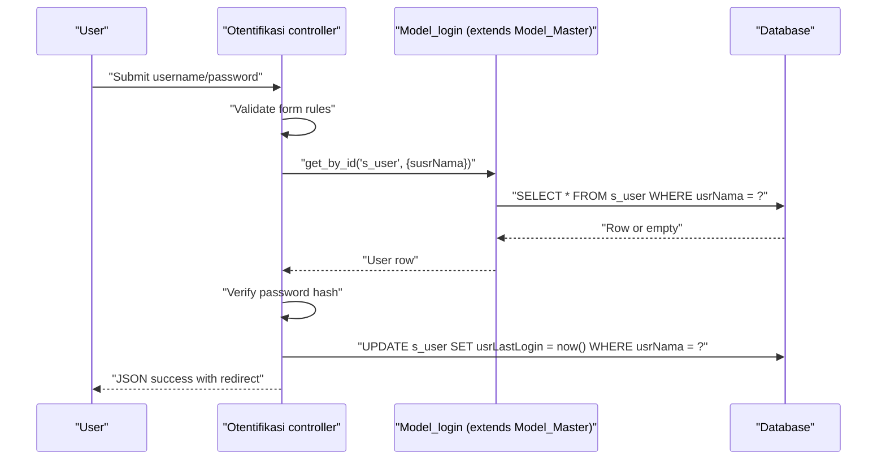
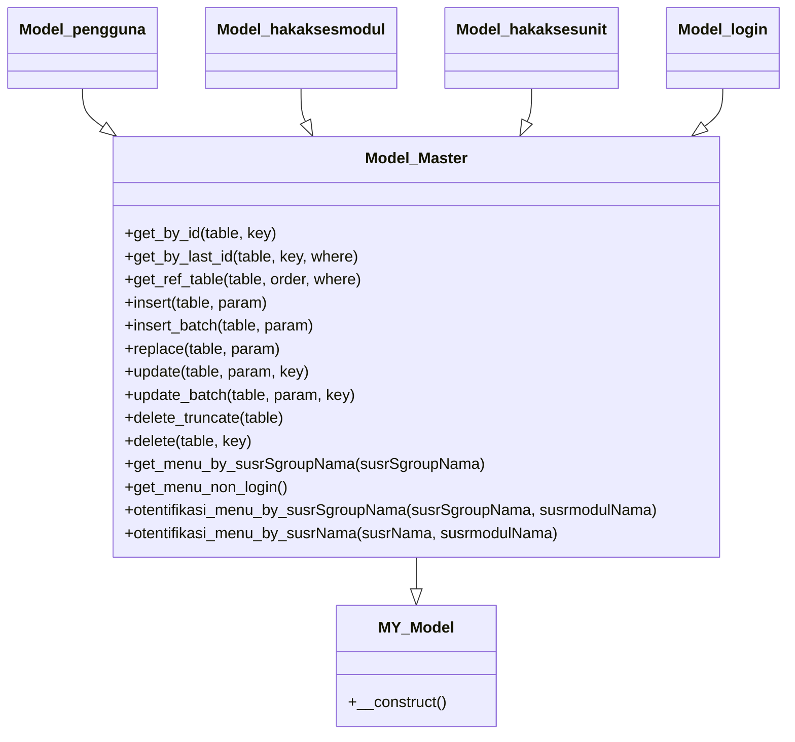
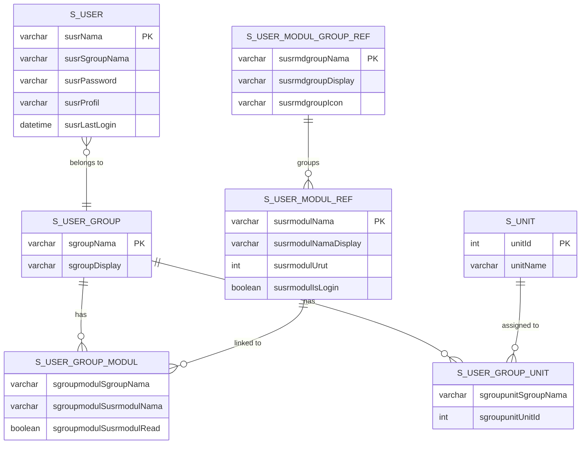
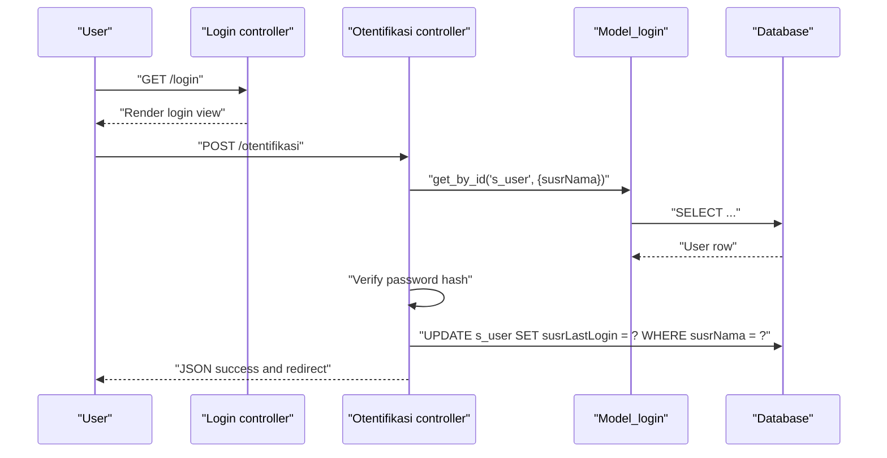
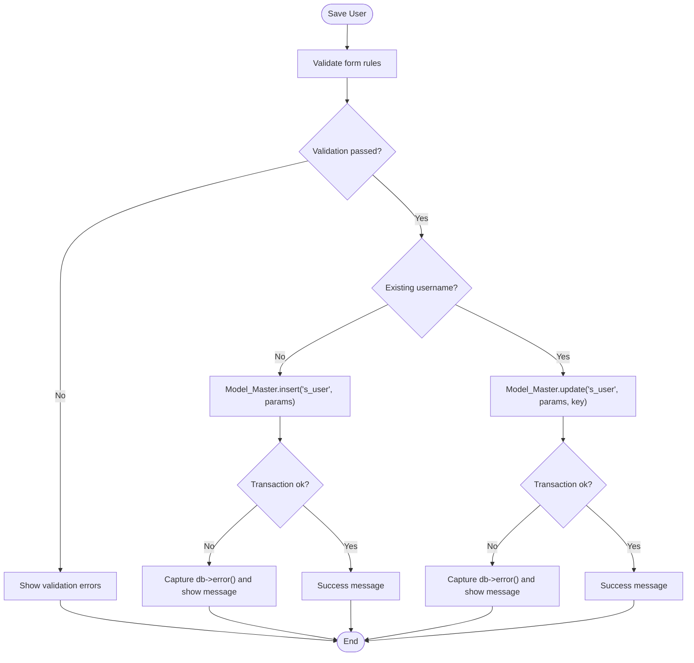
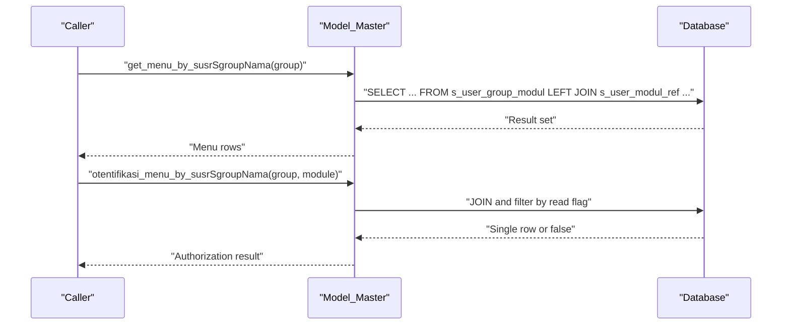
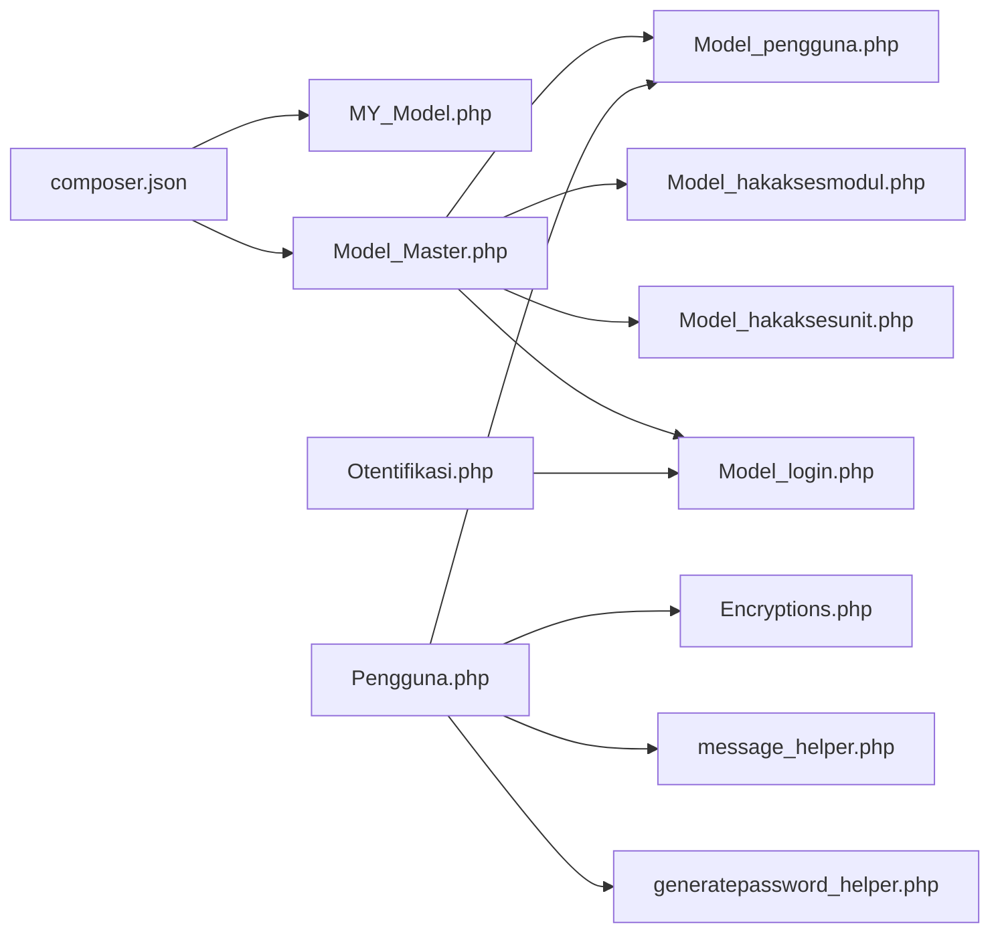

# Database Integration

<cite>
**Referenced Files in This Document**
- [composer.json](file://composer.json)
- [MY_Model.php](file://src/application/core/MY_Model.php)
- [Model_Master.php](file://src/application/core/Model_Master.php)
- [Model_pengguna.php](file://src/application/models/Model_pengguna.php)
- [Model_hakaksesmodul.php](file://src/application/models/Model_hakaksesmodul.php)
- [Model_hakaksesunit.php](file://src/application/models/Model_hakaksesunit.php)
- [Model_login.php](file://src/application/models/Model_login.php)
- [Login.php](file://src/application/controllers/Login.php)
- [Otentifikasi.php](file://src/application/controllers/Otentifikasi.php)
- [Pengguna.php](file://src/application/controllers/Pengguna.php)
- [Encryptions.php](file://src/application/libraries/Encryptions.php)
- [message_helper.php](file://src/application/helpers/message_helper.php)
- [generatepassword_helper.php](file://src/application/helpers/generatepassword_helper.php)
</cite>

## Table of Contents
1. [Introduction](#introduction)
2. [Project Structure](#project-structure)
3. [Core Components](#core-components)
4. [Architecture Overview](#architecture-overview)
5. [Detailed Component Analysis](#detailed-component-analysis)
6. [Dependency Analysis](#dependency-analysis)
7. [Performance Considerations](#performance-considerations)
8. [Troubleshooting Guide](#troubleshooting-guide)
9. [Conclusion](#conclusion)
10. [Appendices](#appendices)

## Introduction
This document explains the database integration of Modangci’s schema-aware code generation and authentication system. It covers how database schema detection and foreign key relationship handling are implemented via model patterns, how CRUD operations are generated automatically from table structures, and how authentication relies on predefined user, group, and permission tables. It also documents database operations, transactions, error handling, and practical guidance for schema changes and migrations.

## Project Structure
Modangci follows a layered CodeIgniter 3.x architecture:
- Controllers orchestrate requests and delegate to models.
- Models encapsulate database operations and expose reusable query builders.
- Libraries and helpers provide encryption, messaging, and password generation utilities.
- The autoloader maps PSR-4 namespaces to the src directory.

**Diagram sources**
- [composer.json:1-25](file://composer.json#L1-L25)
- [MY_Model.php:1-21](file://src/application/core/MY_Model.php#L1-L21)
- [Model_Master.php:1-257](file://src/application/core/Model_Master.php#L1-L257)
- [Model_pengguna.php:1-36](file://src/application/models/Model_pengguna.php#L1-L36)
- [Model_hakaksesmodul.php:1-26](file://src/application/models/Model_hakaksesmodul.php#L1-L26)
- [Model_hakaksesunit.php:1-25](file://src/application/models/Model_hakaksesunit.php#L1-L25)
- [Model_login.php:1-9](file://src/application/models/Model_login.php#L1-L9)
- [Login.php:1-18](file://src/application/controllers/Login.php#L1-L18)
- [Otentifikasi.php:1-64](file://src/application/controllers/Otentifikasi.php#L1-L64)
- [Pengguna.php:1-136](file://src/application/controllers/Pengguna.php#L1-L136)
- [Encryptions.php:1-56](file://src/application/libraries/Encryptions.php#L1-L56)
- [message_helper.php:1-22](file://src/application/helpers/message_helper.php#L1-L22)
- [generatepassword_helper.php:1-26](file://src/application/helpers/generatepassword_helper.php#L1-L26)

**Section sources**
- [composer.json:1-25](file://composer.json#L1-L25)
- [MY_Model.php:1-21](file://src/application/core/MY_Model.php#L1-L21)
- [Model_Master.php:1-257](file://src/application/core/Model_Master.php#L1-L257)

## Core Components
- Model_Master: Centralized CRUD and query builder with transactional safety and optional debug logging. Provides generic methods for selecting, inserting, updating, replacing, deleting, truncating, and retrieving reference lists. Also exposes menu and authorization queries against schema tables.
- Model_pengguna: Extends Model_Master to work with the user table and join with user groups.
- Model_hakaksesmodul and Model_hakaksesunit: Extend Model_Master to resolve module and unit permissions bound to user groups via association tables.
- Model_login: Extends Model_Master to support user lookup during authentication.
- Controllers: Login, Otentifikasi, and Pengguna coordinate user actions, form validation, encryption, and messaging.
- Libraries and Helpers: Encryptions for encoding/decoding keys, message helper for JSON responses, and generatepassword helper for resetting passwords.

Key capabilities:
- Schema-aware CRUD: Methods accept table names and associative arrays, enabling automatic CRUD generation from table structure.
- Transactions: All write operations wrap in CodeIgniter transactions and log last query when a debug hook exists.
- Authentication: User credentials validated against hashed passwords stored in the user table; session data populated with group and profile attributes.
- Menu and authorization: Queries join user/group/module/unit tables to compute accessible menus and permissions.

**Section sources**
- [Model_Master.php:9-257](file://src/application/core/Model_Master.php#L9-L257)
- [Model_pengguna.php:1-36](file://src/application/models/Model_pengguna.php#L1-L36)
- [Model_hakaksesmodul.php:1-26](file://src/application/models/Model_hakaksesmodul.php#L1-L26)
- [Model_hakaksesunit.php:1-25](file://src/application/models/Model_hakaksesunit.php#L1-L25)
- [Model_login.php:1-9](file://src/application/models/Model_login.php#L1-L9)
- [Otentifikasi.php:35-62](file://src/application/controllers/Otentifikasi.php#L35-L62)
- [Pengguna.php:60-134](file://src/application/controllers/Pengguna.php#L60-L134)
- [Encryptions.php:21-53](file://src/application/libraries/Encryptions.php#L21-L53)
- [message_helper.php:6-20](file://src/application/helpers/message_helper.php#L6-L20)
- [generatepassword_helper.php:6-24](file://src/application/helpers/generatepassword_helper.php#L6-L24)

## Architecture Overview
The authentication and authorization pipeline integrates controllers, models, and schema tables. The following sequence diagram maps the login flow and user CRUD operations.

**Diagram sources**
- [Otentifikasi.php:14-33](file://src/application/controllers/Otentifikasi.php#L14-L33)
- [Otentifikasi.php:35-62](file://src/application/controllers/Otentifikasi.php#L35-L62)
- [Model_login.php:1-9](file://src/application/models/Model_login.php#L1-L9)
- [Model_Master.php:9-21](file://src/application/core/Model_Master.php#L9-L21)

## Detailed Component Analysis

### Model_Master: Transactional CRUD and Query Builder
Model_Master centralizes database operations:
- Selectors: get_by_id, get_by_last_id, get_ref_table
- Mutators: insert, insert_batch, replace, update, update_batch, delete, delete_truncate
- Menu and authorization: get_menu_by_susrSgroupNama, get_menu_non_login, otentifikasi_menu_by_susrSgroupNama, otentifikasi_menu_by_susrNama

Transaction behavior:
- All write operations wrap in CodeIgniter transactions.
- Optional debug logging captures the last executed query when a debug hook exists.

Menu and authorization:
- Joins across user/group/module/unit reference tables to compute accessible modules and groups.

**Diagram sources**
- [MY_Model.php:3-10](file://src/application/core/MY_Model.php#L3-L10)
- [Model_Master.php:2-257](file://src/application/core/Model_Master.php#L2-L257)
- [Model_pengguna.php:2-10](file://src/application/models/Model_pengguna.php#L2-L10)
- [Model_hakaksesmodul.php:2-10](file://src/application/models/Model_hakaksesmodul.php#L2-L10)
- [Model_hakaksesunit.php:2-10](file://src/application/models/Model_hakaksesunit.php#L2-L10)
- [Model_login.php:2-8](file://src/application/models/Model_login.php#L2-L8)

**Section sources**
- [Model_Master.php:9-257](file://src/application/core/Model_Master.php#L9-L257)

### Authentication Database Schema and Relationships
Authentication relies on the following schema tables and relationships:
- s_user: Stores user credentials, group membership, and profile metadata.
- s_user_group: Defines user groups used for permission assignment.
- s_user_modul_ref: Module definitions and display metadata.
- s_user_modul_group_ref: Module group definitions and ordering metadata.
- s_user_group_modul: Association table linking groups to modules with read/write flags.
- s_unit: Unit definitions used for unit-level permissions.
- s_user_group_unit: Association table linking groups to units.

**Diagram sources**
- [Model_Master.php:188-256](file://src/application/core/Model_Master.php#L188-L256)
- [Model_pengguna.php:4-35](file://src/application/models/Model_pengguna.php#L4-L35)
- [Model_hakaksesmodul.php:4-25](file://src/application/models/Model_hakaksesmodul.php#L4-L25)
- [Model_hakaksesunit.php:4-24](file://src/application/models/Model_hakaksesunit.php#L4-L24)

### Login and Session Management
- The Login controller prevents access to the login page if already logged in.
- The Otentifikasi controller validates credentials using Model_login and updates last login timestamps.
- On successful authentication, session data is set with user, group, and profile identifiers.

**Diagram sources**
- [Login.php:9-16](file://src/application/controllers/Login.php#L9-L16)
- [Otentifikasi.php:35-62](file://src/application/controllers/Otentifikasi.php#L35-L62)
- [Model_login.php:1-9](file://src/application/models/Model_login.php#L1-L9)
- [Model_Master.php:9-21](file://src/application/core/Model_Master.php#L9-L21)

**Section sources**
- [Login.php:1-18](file://src/application/controllers/Login.php#L1-L18)
- [Otentifikasi.php:35-62](file://src/application/controllers/Otentifikasi.php#L35-L62)

### User CRUD Operations
- The Pengguna controller manages user records, delegating to Model_pengguna for joins with s_user_group.
- Form validation enforces uniqueness of usernames and required fields.
- Save operations insert or update s_user depending on whether an existing username is present.
- Delete operations remove users after decryption of the identifier.
- Reset password generates a random numeric password and hashes it before updating s_user.

**Diagram sources**
- [Pengguna.php:60-101](file://src/application/controllers/Pengguna.php#L60-L101)
- [Model_Master.php:56-130](file://src/application/core/Model_Master.php#L56-L130)
- [message_helper.php:6-20](file://src/application/helpers/message_helper.php#L6-L20)

**Section sources**
- [Pengguna.php:60-134](file://src/application/controllers/Pengguna.php#L60-L134)
- [Model_pengguna.php:11-35](file://src/application/models/Model_pengguna.php#L11-L35)

### Permission Resolution and Menu Building
- Module permissions per group are resolved via s_user_group_modul joined with s_user_modul_ref and s_user_modul_group_ref.
- Unit permissions per group are resolved via s_user_group_unit joined with s_unit.
- Non-login modules are exposed via get_menu_non_login.

**Diagram sources**
- [Model_Master.php:188-238](file://src/application/core/Model_Master.php#L188-L238)

**Section sources**
- [Model_Master.php:188-256](file://src/application/core/Model_Master.php#L188-L256)
- [Model_hakaksesmodul.php:12-24](file://src/application/models/Model_hakaksesmodul.php#L12-L24)
- [Model_hakaksesunit.php:12-23](file://src/application/models/Model_hakaksesunit.php#L12-L23)

## Dependency Analysis
- Autoloading: composer.json configures PSR-4 to map Modangci namespace to src/, ensuring classes load consistently.
- Core inheritance: MY_Model is extended by Model_Master, which is then extended by domain-specific models.
- Controller-model coupling: Controllers depend on models for data access and on helpers/libraries for encryption and messaging.
- Transaction coupling: All write paths rely on CodeIgniter transactions and optional debug logging.

**Diagram sources**
- [composer.json:20-24](file://composer.json#L20-L24)
- [MY_Model.php:12-15](file://src/application/core/MY_Model.php#L12-L15)
- [Model_Master.php:2-7](file://src/application/core/Model_Master.php#L2-L7)
- [Model_pengguna.php:2-10](file://src/application/models/Model_pengguna.php#L2-L10)
- [Model_hakaksesmodul.php:2-10](file://src/application/models/Model_hakaksesmodul.php#L2-L10)
- [Model_hakaksesunit.php:2-10](file://src/application/models/Model_hakaksesunit.php#L2-L10)
- [Model_login.php:2-8](file://src/application/models/Model_login.php#L2-L8)
- [Pengguna.php:19-20](file://src/application/controllers/Pengguna.php#L19-L20)
- [Encryptions.php:21-53](file://src/application/libraries/Encryptions.php#L21-L53)
- [message_helper.php:6-20](file://src/application/helpers/message_helper.php#L6-L20)
- [generatepassword_helper.php:6-24](file://src/application/helpers/generatepassword_helper.php#L6-L24)
- [Otentifikasi.php:9](file://src/application/controllers/Otentifikasi.php#L9)

**Section sources**
- [composer.json:20-24](file://composer.json#L20-L24)
- [Pengguna.php:19-20](file://src/application/controllers/Pengguna.php#L19-L20)
- [Otentifikasi.php:9](file://src/application/controllers/Otentifikasi.php#L9)

## Performance Considerations
- Prefer batch operations: Use insert_batch and update_batch to reduce round trips when handling multiple rows.
- Limit selectors: Use get_ref_table with filters and order clauses to avoid fetching unnecessary rows.
- Index foreign keys: Ensure s_user.susrSgroupNama, s_user_group_modul.* foreign keys, and s_user_group_unit.* foreign keys are indexed for JOIN-heavy queries.
- Minimize payload: Use targeted SELECT lists (as seen in menu queries) to reduce memory and bandwidth.
- Transaction boundaries: Keep transaction scopes small to minimize lock contention.

## Troubleshooting Guide
Common issues and remedies:
- Duplicate usernames: Validation enforces uniqueness; ensure the database enforces the same constraint at the RDBMS level.
- Transaction failures: All write operations return false on transaction failure; capture db->error() for diagnostics.
- Debugging queries: When a debug hook exists, last queries are logged; enable it to inspect generated SQL.
- Session not set: Verify that the login controller sets session data and that sessions are configured properly.

**Section sources**
- [Pengguna.php:94-96](file://src/application/controllers/Pengguna.php#L94-L96)
- [Pengguna.php:111](file://src/application/controllers/Pengguna.php#L111)
- [Model_Master.php:58-68](file://src/application/core/Model_Master.php#L58-L68)
- [Model_Master.php:73-84](file://src/application/core/Model_Master.php#L73-L84)
- [Model_Master.php:88-99](file://src/application/core/Model_Master.php#L88-L99)
- [Model_Master.php:103-115](file://src/application/core/Model_Master.php#L103-L115)
- [Model_Master.php:119-130](file://src/application/core/Model_Master.php#L119-L130)
- [Model_Master.php:144-157](file://src/application/core/Model_Master.php#L144-L157)
- [Model_Master.php:172-186](file://src/application/core/Model_Master.php#L172-L186)

## Conclusion
Modangci’s database integration leverages a robust, schema-aware model layer that enables automatic CRUD generation and secure authentication flows. By centralizing transactions, query building, and authorization logic in Model_Master, the system remains maintainable and extensible. Adhering to the outlined performance and migration practices ensures reliable operation as schemas evolve.

## Appendices

### Database Table Creation Examples
- Create s_user with a group foreign key and hashed password field.
- Create s_user_group with display metadata.
- Create s_user_modul_ref and s_user_modul_group_ref for modules and groups.
- Create s_user_group_modul with composite primary key and read flag.
- Create s_unit and s_user_group_unit for unit-level permissions.

These steps align with the JOIN patterns used in Model_Master and the controllers.

### Schema Modification and Migration Strategies
- Add indexes on foreign keys used in JOINs (e.g., s_user.susrSgroupNama, s_user_group_modul.*).
- Introduce new module or unit associations by adding rows to s_user_group_modul or s_user_group_unit.
- Maintain referential integrity at the database level to prevent runtime anomalies.
- Use batch operations for large-scale updates to improve performance.