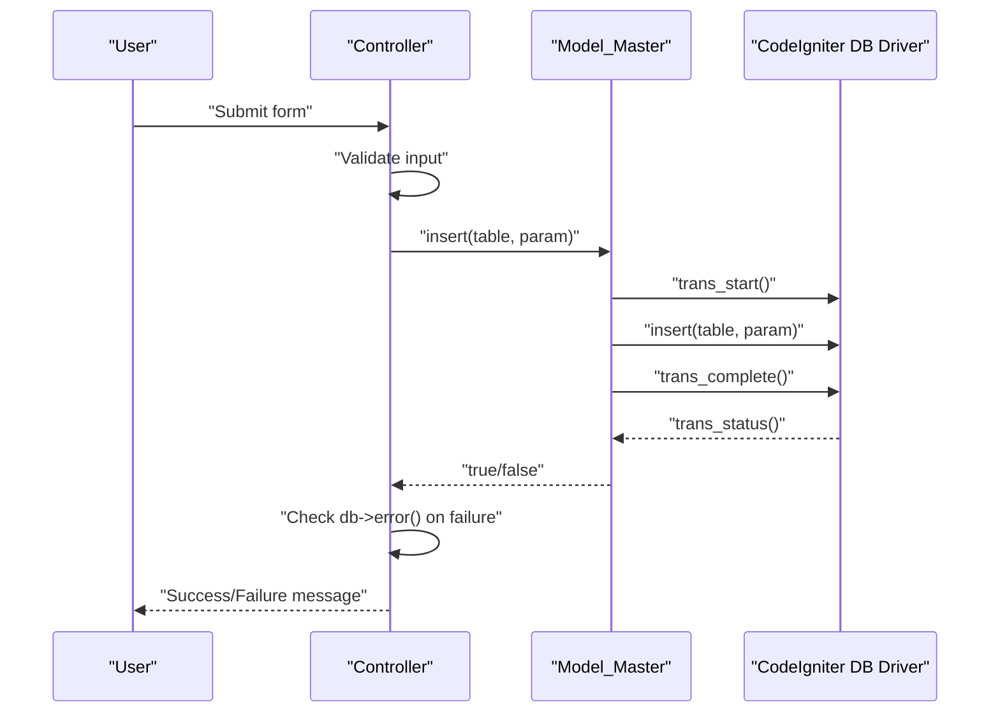
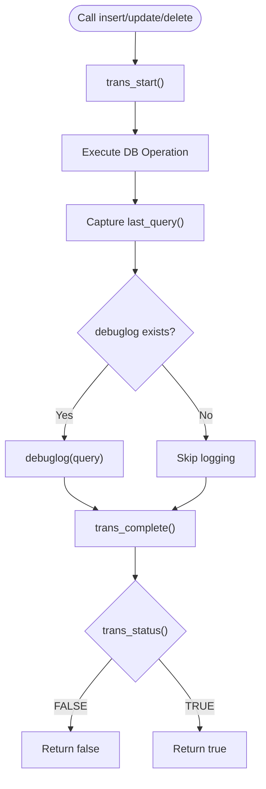
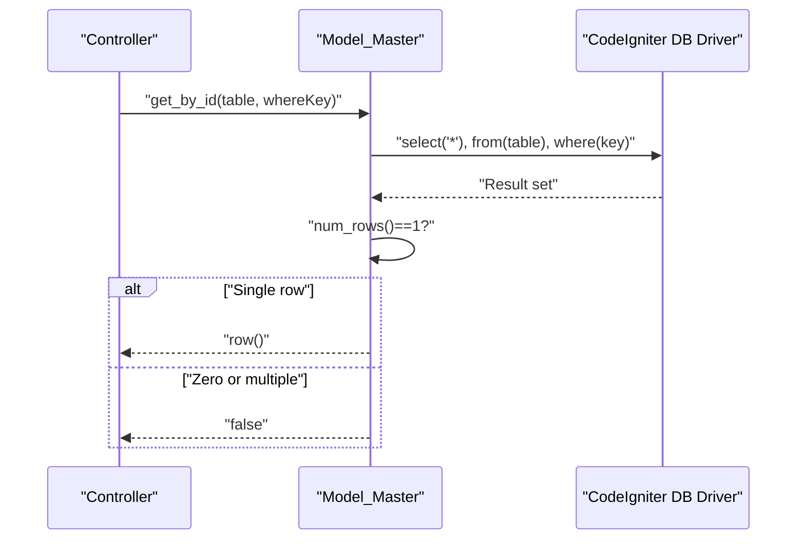
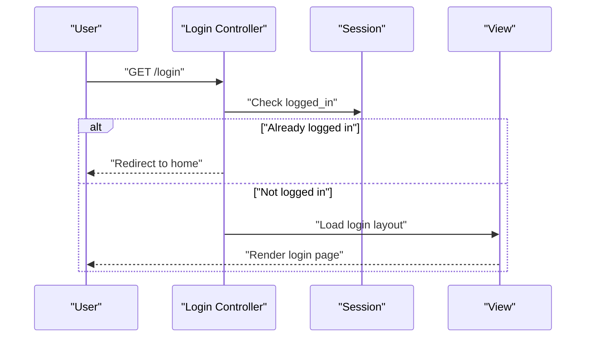
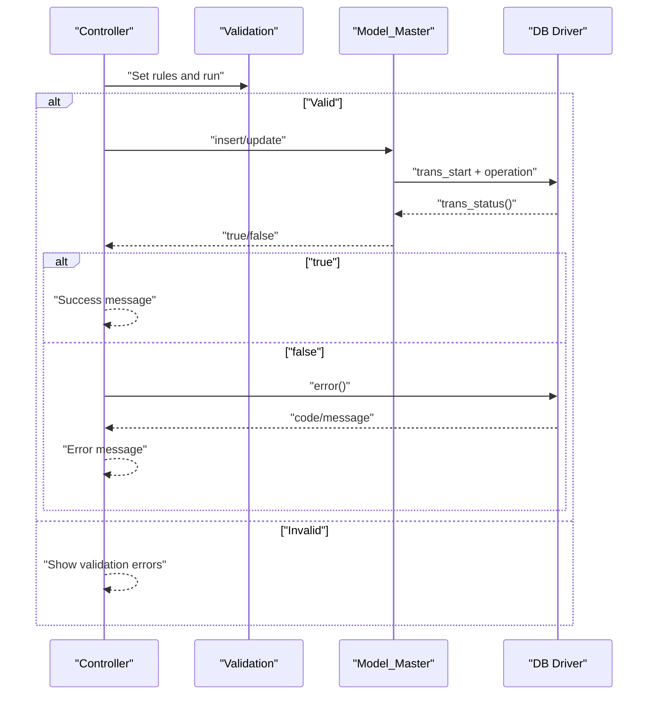
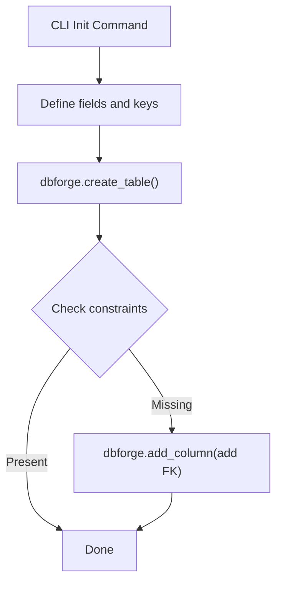
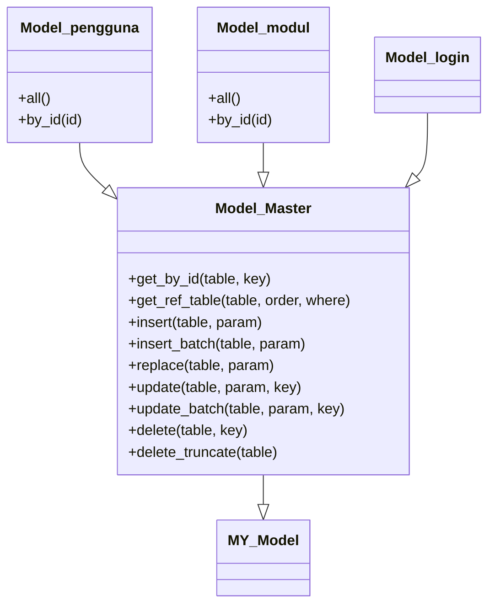
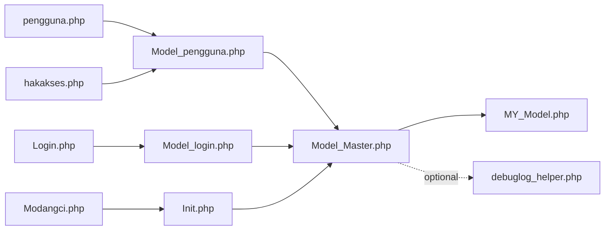

# Database Operations and Transactions

<cite>
**Referenced Files in This Document**
- [Model_Master.php](file://src/application/core/Model_Master.php)
- [MY_Model.php](file://src/application/core/MY_Model.php)
- [Model_pengguna.php](file://src/application/models/Model_pengguna.php)
- [Model_modul.php](file://src/application/models/Model_modul.php)
- [Model_login.php](file://src/application/models/Model_login.php)
- [pengguna.php](file://src/application/controllers/Pengguna.php)
- [hakakses.php](file://src/application/controllers/Hakakses.php)
- [Login.php](file://src/application/controllers/Login.php)
- [debuglog_helper.php](file://src/application/helpers/debuglog_helper.php)
- [Init.php](file://src/commands/Init.php)
- [Modangci.php](file://src/Modangci.php)
- [composer.json](file://composer.json)
</cite>

## Table of Contents
1. [Introduction](#introduction)
2. [Project Structure](#project-structure)
3. [Core Components](#core-components)
4. [Architecture Overview](#architecture-overview)
5. [Detailed Component Analysis](#detailed-component-analysis)
6. [Dependency Analysis](#dependency-analysis)
7. [Performance Considerations](#performance-considerations)
8. [Troubleshooting Guide](#troubleshooting-guide)
9. [Conclusion](#conclusion)

## Introduction
This document explains Modangci’s database operation handling and transaction management. It focuses on the transaction wrapper methods (insert, update, delete, replace, insert_batch, update_batch, delete_truncate) and the get_by_id method, detailing how they ensure data consistency, error handling strategies, logging, and integration with CodeIgniter’s database forge for dynamic schema creation. It also covers authentication setup patterns, CRUD operations, data validation, transaction handling examples, error propagation, and performance considerations for MySQL.

## Project Structure
Modangci is a CodeIgniter 3 application with a layered structure:
- Controllers orchestrate requests and delegate to models.
- Models encapsulate database operations and transactions.
- Helpers provide cross-cutting concerns like logging.
- CLI tooling integrates with CodeIgniter’s database forge to initialize and evolve the schema.

```mermaid
graph TB
subgraph "Controllers"
C1["pengguna.php"]
C2["hakakses.php"]
C3["Login.php"]
end
subgraph "Models"
M1["Model_pengguna.php"]
M2["Model_modul.php"]
M3["Model_login.php"]
MM["Model_Master.php"]
end
subgraph "Core"
CM["MY_Model.php"]
end
subgraph "Helpers"
H1["debuglog_helper.php"]
end
subgraph "CLI"
CLI["Modangci.php"]
CMD["Init.php"]
end
C1 --> M1
C2 --> M1
C3 --> M3
M1 --> MM
M2 --> MM
M3 --> MM
MM --> CM
CLI --> CMD
CMD --> MM
MM -. logs .-> H1
```

**Diagram sources**
- [pengguna.php:1-136](file://src/application/controllers/Pengguna.php#L1-L136)
- [hakakses.php:1-109](file://src/application/controllers/Hakakses.php#L1-L109)
- [Login.php:1-18](file://src/application/controllers/Login.php#L1-L18)
- [Model_pengguna.php:1-36](file://src/application/models/Model_pengguna.php#L1-L36)
- [Model_modul.php:1-37](file://src/application/models/Model_modul.php#L1-L37)
- [Model_login.php:1-9](file://src/application/models/Model_login.php#L1-L9)
- [Model_Master.php:1-257](file://src/application/core/Model_Master.php#L1-L257)
- [MY_Model.php:1-21](file://src/application/core/MY_Model.php#L1-L21)
- [debuglog_helper.php:1-34](file://src/application/helpers/debuglog_helper.php#L1-L34)
- [Modangci.php:1-60](file://src/Modangci.php#L1-L60)
- [Init.php:167-351](file://src/commands/Init.php#L167-L351)

**Section sources**
- [Modangci.php:1-60](file://src/Modangci.php#L1-L60)
- [composer.json:1-25](file://composer.json#L1-L25)

## Core Components
- Model_Master: Centralized transaction wrappers and common queries (get_by_id, get_ref_table, CRUD operations, menu retrieval).
- MY_Model: Base model extending CI_Model; loads Model_Master if present.
- Controllers: Validate input, build parameters, and call model methods; surface errors via CodeIgniter’s db->error().
- Helpers: Optional debug logging of queries and context.
- CLI Init: Uses CodeIgniter’s dbforge to create tables and enforce referential constraints.

Key responsibilities:
- Transaction wrappers wrap each operation in a transaction boundary and return boolean outcomes.
- get_by_id ensures single-row retrieval semantics.
- CRUD methods propagate failures via db->trans_status() checks.
- CLI Init automates schema creation and constraint enforcement.

**Section sources**
- [Model_Master.php:9-257](file://src/application/core/Model_Master.php#L9-L257)
- [MY_Model.php:1-21](file://src/application/core/MY_Model.php#L1-L21)
- [debuglog_helper.php:1-34](file://src/application/helpers/debuglog_helper.php#L1-L34)
- [Init.php:167-351](file://src/commands/Init.php#L167-L351)

## Architecture Overview
The system follows a classic MVC pattern with transactional models:
- Controllers receive user actions, validate, and call model methods.
- Models encapsulate database logic and enforce atomicity via transactions.
- CLI tooling initializes and evolves the schema using dbforge.



**Diagram sources**
- [pengguna.php:60-101](file://src/application/controllers/Pengguna.php#L60-L101)
- [Model_Master.php:56-69](file://src/application/core/Model_Master.php#L56-L69)
- [Model_pengguna.php:11-21](file://src/application/models/Model_pengguna.php#L11-L21)

## Detailed Component Analysis

### Transaction Wrapper Methods
Model_Master provides transactional CRUD methods:
- insert(table, param): Starts a transaction, performs insert, logs last query if debuglog exists, completes transaction, and returns boolean based on trans_status().
- insert_batch(table, param): Same pattern for batch inserts.
- replace(table, param): Atomic replace operation.
- update(table, param, key): Applies where condition, updates, logs, and returns outcome.
- update_batch(table, param, key): Batch update within a transaction.
- delete(table, key): Reads rows, logs, deletes within a transaction, and returns outcome.
- delete_truncate(table): Empties table within a transaction and logs previous rows.

Behavioral notes:
- Each wrapper uses trans_start/trans_complete to ensure atomicity.
- On failure, trans_status() determines return value.
- Optional debug logging is invoked when debuglog helper is loaded.



**Diagram sources**
- [Model_Master.php:56-69](file://src/application/core/Model_Master.php#L56-L69)
- [Model_Master.php:101-115](file://src/application/core/Model_Master.php#L101-L115)
- [Model_Master.php:159-186](file://src/application/core/Model_Master.php#L159-L186)
- [debuglog_helper.php:6-30](file://src/application/helpers/debuglog_helper.php#L6-L30)

**Section sources**
- [Model_Master.php:56-186](file://src/application/core/Model_Master.php#L56-L186)
- [debuglog_helper.php:1-34](file://src/application/helpers/debuglog_helper.php#L1-L34)

### get_by_id Method
Purpose:
- Retrieve exactly one row by a where clause, returning either the row object or false.

Usage pattern:
- Controllers pass associative arrays as keys to filter by primary or unique identifiers.
- Ensures strict single-row expectations for safe updates/deletes.



**Diagram sources**
- [Model_Master.php:9-21](file://src/application/core/Model_Master.php#L9-L21)
- [hakakses.php:50-53](file://src/application/controllers/Hakakses.php#L50-L53)

**Section sources**
- [Model_Master.php:9-21](file://src/application/core/Model_Master.php#L9-L21)
- [hakakses.php:50-53](file://src/application/controllers/Hakakses.php#L50-L53)

### Authentication Setup Patterns
- Login controller enforces session checks and renders the login view.
- Model_login extends Model_Master but does not override methods; it relies on shared transactional patterns for authentication-related operations if used.
- Menu retrieval methods in Model_Master support permission-aware navigation.



**Diagram sources**
- [Login.php:1-18](file://src/application/controllers/Login.php#L1-L18)
- [Model_login.php:1-9](file://src/application/models/Model_login.php#L1-L9)

**Section sources**
- [Login.php:1-18](file://src/application/controllers/Login.php#L1-L18)
- [Model_login.php:1-9](file://src/application/models/Model_login.php#L1-L9)

### CRUD Operations and Data Validation
Controllers demonstrate typical CRUD flows:
- Create: Build form view, collect POST data, validate, and call insert on Model_Master.
- Update: Decode encrypted ID, fetch existing record via get_by_id, validate, and call update.
- Delete: Decode ID, call delete on Model_Master.
- Validation: Uses CodeIgniter’s form_validation rules; messages are shown on success/failure.

Error propagation:
- On failure, controllers read db->error() and surface SQL error code/message.



**Diagram sources**
- [pengguna.php:60-101](file://src/application/controllers/Pengguna.php#L60-L101)
- [hakakses.php:55-94](file://src/application/controllers/Hakakses.php#L55-L94)
- [Model_Master.php:56-69](file://src/application/core/Model_Master.php#L56-L69)

**Section sources**
- [pengguna.php:60-101](file://src/application/controllers/Pengguna.php#L60-L101)
- [hakakses.php:55-94](file://src/application/controllers/Hakakses.php#L55-L94)

### Database Forge Integration (CLI)
The CLI Init command uses CodeIgniter’s dbforge to:
- Define table schemas programmatically.
- Add primary and composite keys.
- Create tables conditionally.
- Add foreign key constraints when missing.



**Diagram sources**
- [Init.php:167-351](file://src/commands/Init.php#L167-L351)

**Section sources**
- [Init.php:167-351](file://src/commands/Init.php#L167-L351)

### Data Models Overview
The application defines several domain models that extend Model_Master:
- Model_pengguna: User listing and retrieval with group join.
- Model_modul: Module listing with module group join.
- Model_login: Placeholder for authentication logic.



**Diagram sources**
- [MY_Model.php:1-21](file://src/application/core/MY_Model.php#L1-L21)
- [Model_Master.php:1-257](file://src/application/core/Model_Master.php#L1-L257)
- [Model_pengguna.php:1-36](file://src/application/models/Model_pengguna.php#L1-L36)
- [Model_modul.php:1-37](file://src/application/models/Model_modul.php#L1-L37)
- [Model_login.php:1-9](file://src/application/models/Model_login.php#L1-L9)

**Section sources**
- [Model_pengguna.php:1-36](file://src/application/models/Model_pengguna.php#L1-L36)
- [Model_modul.php:1-37](file://src/application/models/Model_modul.php#L1-L37)
- [Model_login.php:1-9](file://src/application/models/Model_login.php#L1-L9)

## Dependency Analysis
- Controllers depend on models for data access and on CodeIgniter’s validation and session libraries.
- Models depend on CodeIgniter’s database driver and optional debug logging helper.
- CLI depends on CodeIgniter’s dbforge and db drivers to initialize schema.
- Autoloading is configured via PSR-4 for the Modangci namespace.



**Diagram sources**
- [pengguna.php:1-136](file://src/application/controllers/Pengguna.php#L1-L136)
- [hakakses.php:1-109](file://src/application/controllers/Hakakses.php#L1-L109)
- [Login.php:1-18](file://src/application/controllers/Login.php#L1-L18)
- [Model_pengguna.php:1-36](file://src/application/models/Model_pengguna.php#L1-L36)
- [Model_login.php:1-9](file://src/application/models/Model_login.php#L1-L9)
- [Model_Master.php:1-257](file://src/application/core/Model_Master.php#L1-L257)
- [MY_Model.php:1-21](file://src/application/core/MY_Model.php#L1-L21)
- [debuglog_helper.php:1-34](file://src/application/helpers/debuglog_helper.php#L1-L34)
- [Modangci.php:1-60](file://src/Modangci.php#L1-L60)
- [Init.php:167-351](file://src/commands/Init.php#L167-L351)

**Section sources**
- [Modangci.php:1-60](file://src/Modangci.php#L1-L60)
- [composer.json:20-24](file://composer.json#L20-L24)

## Performance Considerations
- Transaction boundaries: Wrappers encapsulate single operations in transactions. For multi-step workflows, consider grouping related operations within a single transaction to maintain consistency while minimizing round-trips.
- Logging overhead: debuglog helper writes to files; disable or throttle in production to avoid I/O overhead.
- Batch operations: Prefer insert_batch and update_batch to reduce network overhead and improve throughput for bulk data.
- Indexes and constraints: CLI Init creates primary keys and foreign keys; ensure appropriate indexes exist on frequently filtered columns (e.g., usernames, group names).
- Connection lifecycle: CodeIgniter manages per-request connections; avoid long-running transactions and ensure proper commit/rollback paths.
- MySQL-specific optimizations: Use appropriate storage engines, charset, and collation as defined during schema initialization. Consider innodb_flush_log_at_trx_commit tuning for write-heavy workloads if applicable to deployment environment.

[No sources needed since this section provides general guidance]

## Troubleshooting Guide
Common issues and resolutions:
- Transaction failures: Inspect db->error() returned by controllers to capture SQLSTATE/SQLCODE and message for diagnostics.
- Ambiguous results: get_by_id expects a single row; if zero or multiple rows are returned, it returns false—verify uniqueness of the where key.
- Logging: Ensure debuglog helper is loaded to capture queries and context; otherwise, enable alternative logging mechanisms.
- Schema drift: Use CLI Init to recreate tables and re-add constraints if foreign keys are missing.

Operational tips:
- Wrap multi-step updates in a single transaction to prevent partial writes.
- Validate inputs early in controllers to fail fast and avoid unnecessary DB calls.
- Monitor db->trans_status() outcomes in models to detect silent failures.

**Section sources**
- [pengguna.php:94-96](file://src/application/controllers/Pengguna.php#L94-L96)
- [hakakses.php:104-106](file://src/application/controllers/Hakakses.php#L104-L106)
- [Model_Master.php:9-21](file://src/application/core/Model_Master.php#L9-L21)
- [debuglog_helper.php:1-34](file://src/application/helpers/debuglog_helper.php#L1-L34)

## Conclusion
Modangci’s database layer centers on Model_Master transaction wrappers and get_by_id to ensure atomicity and predictable single-row retrieval. Controllers integrate validation and error reporting via CodeIgniter’s db->error(). The CLI Init command leverages CodeIgniter’s dbforge to automate schema creation and constraint enforcement. By following the established patterns, teams can implement robust CRUD operations, maintain data consistency, and scale performance through batching and proper indexing.