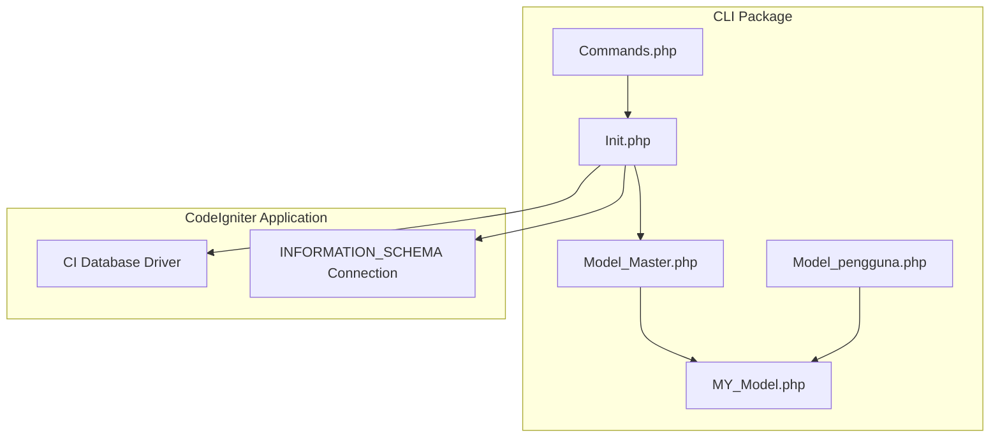
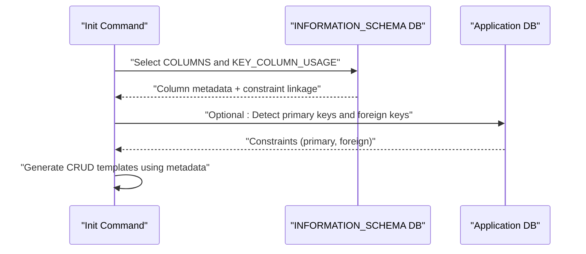
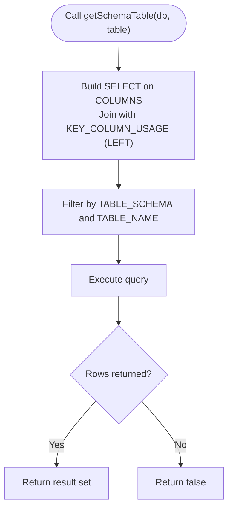
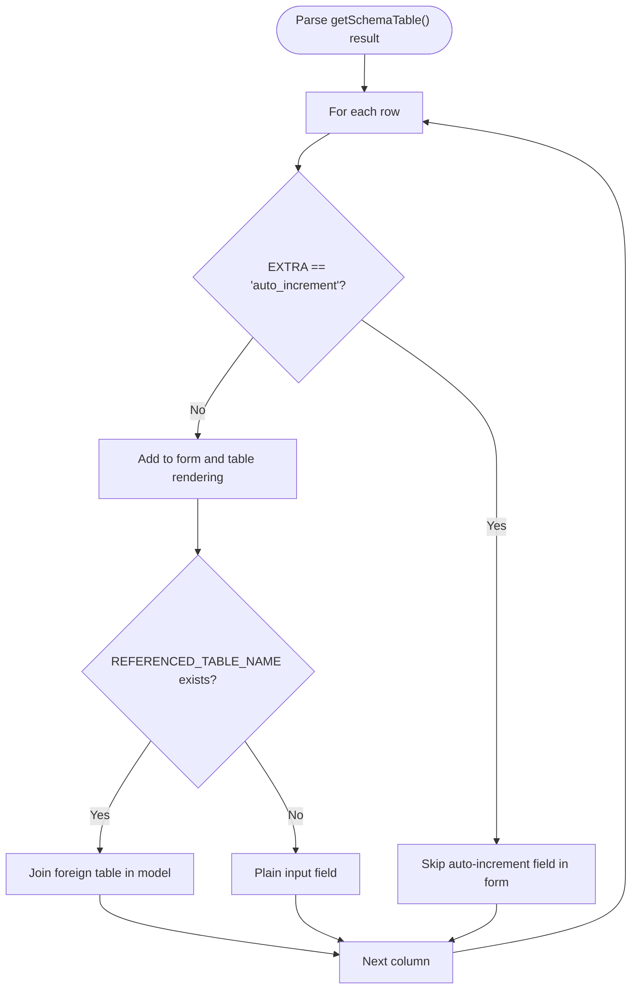
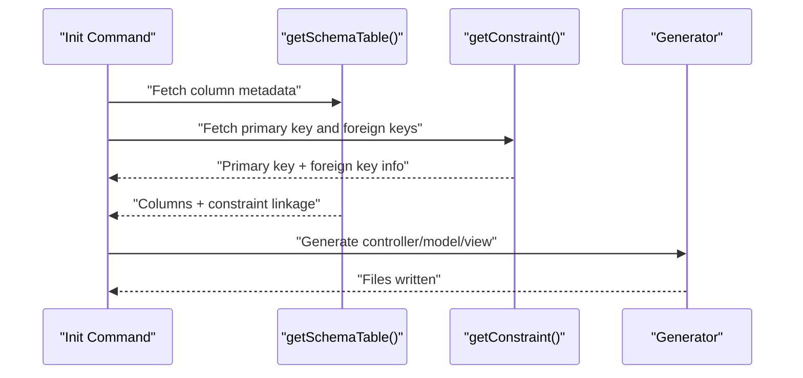
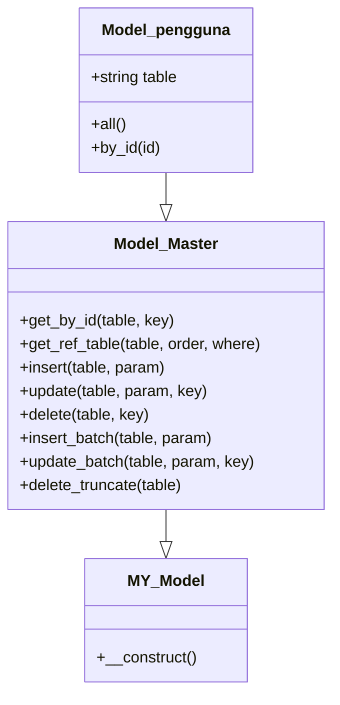
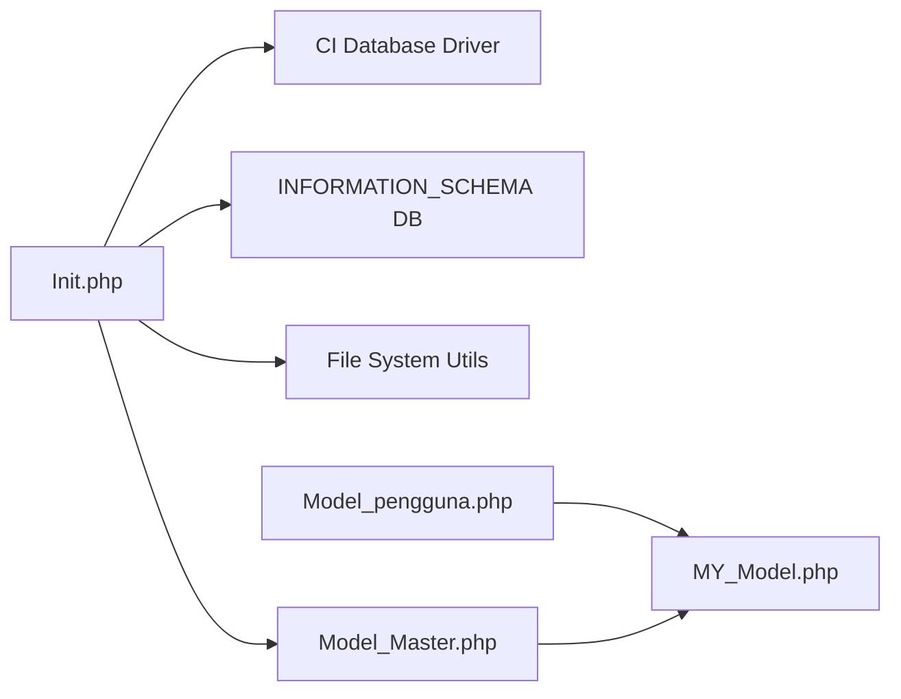

# Schema Detection and Analysis

<cite>
**Referenced Files in This Document**
- [Init.php](file://src/commands/Init.php)
- [Model_Master.php](file://src/application/core/Model_Master.php)
- [MY_Model.php](file://src/application/core/MY_Model.php)
- [Model_pengguna.php](file://src/application/models/Model_pengguna.php)
- [Commands.php](file://src/Commands.php)
- [composer.json](file://composer.json)
- [README.md](file://README.md)
</cite>

## Table of Contents
1. [Introduction](#introduction)
2. [Project Structure](#project-structure)
3. [Core Components](#core-components)
4. [Architecture Overview](#architecture-overview)
5. [Detailed Component Analysis](#detailed-component-analysis)
6. [Dependency Analysis](#dependency-analysis)
7. [Performance Considerations](#performance-considerations)
8. [Troubleshooting Guide](#troubleshooting-guide)
9. [Conclusion](#conclusion)

## Introduction
This document explains how Modangci detects and analyzes database schemas using CodeIgniter’s database abstraction and the INFORMATION_SCHEMA. It focuses on:
- How the system queries INFORMATION_SCHEMA to discover tables, columns, constraints, and foreign key relationships
- The getSchemaTable() and getConstraint() methods that extract metadata
- The schema parsing process including column properties (data types, nullability, constraints), primary keys, auto-increment fields, and foreign key references
- Example outputs and how this information drives automatic CRUD generation
- Database driver compatibility, caching mechanisms, and performance considerations for large databases

## Project Structure
Modangci is a CodeIgniter 3 CLI package that scaffolds authentication, controllers, models, views, and CRUD automatically. The schema detection and analysis logic resides in the Init command class, which uses a dedicated connection to INFORMATION_SCHEMA to gather metadata.

**Diagram sources**
- [Commands.php:1-135](file://src/Commands.php#L1-L135)
- [Init.php:1-29](file://src/commands/Init.php#L1-L29)
- [Model_Master.php:1-257](file://src/application/core/Model_Master.php#L1-L257)
- [MY_Model.php:1-21](file://src/application/core/MY_Model.php#L1-L21)
- [Model_pengguna.php:1-36](file://src/application/models/Model_pengguna.php#L1-L36)

**Section sources**
- [README.md:1-41](file://README.md#L1-L41)
- [composer.json:1-25](file://composer.json#L1-L25)

## Core Components
- Init command: Orchestrates schema discovery via INFORMATION_SCHEMA and generates CRUD artifacts.
- Model_Master: Provides reusable database operations (insert, update, delete, batch operations) and transaction logging hooks.
- MY_Model: Base model class that loads Model_Master when present.
- Model_pengguna: Demonstrates a generated model that joins foreign tables discovered from schema metadata.

Key responsibilities:
- getSchemaTable(database, table): Returns column metadata and constraint linkage for a given table.
- getConstraint(database, table, where): Filters constraints (primary key, foreign keys) for a given table.
- Automatic CRUD generation: Uses schema metadata to build controllers, models, and views.

**Section sources**
- [Init.php:57-108](file://src/commands/Init.php#L57-L108)
- [Model_Master.php:56-130](file://src/application/core/Model_Master.php#L56-L130)
- [MY_Model.php:12-15](file://src/application/core/MY_Model.php#L12-L15)
- [Model_pengguna.php:4-35](file://src/application/models/Model_pengguna.php#L4-L35)

## Architecture Overview
The schema detection architecture uses a separate CodeIgniter database connection configured to the INFORMATION_SCHEMA database. This allows querying system tables without interfering with the application’s operational database.

**Diagram sources**
- [Init.php:15-29](file://src/commands/Init.php#L15-L29)
- [Init.php:79-108](file://src/commands/Init.php#L79-L108)
- [Init.php:57-77](file://src/commands/Init.php#L57-L77)

## Detailed Component Analysis

### Schema Detection Methods
- getSchemaTable(database, table)
  - Selects column metadata from INFORMATION_SCHEMA.COLUMNS
  - Left joins with INFORMATION_SCHEMA.KEY_COLUMN_USAGE to include constraint linkage
  - Filters by TABLE_SCHEMA and TABLE_NAME
  - Returns rows containing column properties and optional foreign key references

- getConstraint(database, table, where)
  - Queries INFORMATION_SCHEMA.KEY_COLUMN_USAGE
  - Filters by TABLE_SCHEMA, TABLE_NAME, and optional conditions (e.g., PRIMARY key or foreign keys)
  - Returns constraint definitions for further processing

**Diagram sources**
- [Init.php:79-108](file://src/commands/Init.php#L79-L108)

**Section sources**
- [Init.php:79-108](file://src/commands/Init.php#L79-L108)
- [Init.php:57-77](file://src/commands/Init.php#L57-L77)

### Schema Parsing and Metadata Extraction
The system parses the result set from getSchemaTable() to extract:
- Column name, default value, nullability, data type, length/precision, key type, extra flags, comment
- Constraint linkage: constraint name, referenced table/column for foreign keys
- Auto-increment detection via EXTRA flag
- Primary key column name via primary key constraint lookup

**Diagram sources**
- [Init.php:717-751](file://src/commands/Init.php#L717-L751)

**Section sources**
- [Init.php:717-751](file://src/commands/Init.php#L717-L751)

### Automatic CRUD Generation Using Schema Metadata
- Controller generation:
  - Builds form validation rules based on IS_NULLABLE and COLUMN_COMMENT
  - Generates save/update/delete actions
  - Loads foreign table data for dropdowns when foreign keys exist
- Model generation:
  - Adds JOIN clauses for referenced tables
  - Exposes all() and by_id() methods
- View generation:
  - Renders table headers and rows using COLUMN_COMMENT or COLUMN_NAME
  - Renders form inputs with appropriate types and options for foreign keys

**Diagram sources**
- [Init.php:480-640](file://src/commands/Init.php#L480-L640)
- [Init.php:642-701](file://src/commands/Init.php#L642-L701)
- [Init.php:703-751](file://src/commands/Init.php#L703-L751)

**Section sources**
- [Init.php:480-640](file://src/commands/Init.php#L480-L640)
- [Init.php:642-701](file://src/commands/Init.php#L642-L701)
- [Init.php:703-751](file://src/commands/Init.php#L703-L751)

### Example: Generated Model with Foreign Keys
A generated model demonstrates how foreign keys are used to join related tables during reads.

**Diagram sources**
- [Model_Master.php:1-257](file://src/application/core/Model_Master.php#L1-L257)
- [MY_Model.php:1-21](file://src/application/core/MY_Model.php#L1-L21)
- [Model_pengguna.php:1-36](file://src/application/models/Model_pengguna.php#L1-L36)

**Section sources**
- [Model_pengguna.php:4-35](file://src/application/models/Model_pengguna.php#L4-L35)
- [Model_Master.php:56-130](file://src/application/core/Model_Master.php#L56-L130)
- [MY_Model.php:12-15](file://src/application/core/MY_Model.php#L12-L15)

## Dependency Analysis
- The Init command depends on:
  - CodeIgniter database driver for both the application database and a dedicated INFORMATION_SCHEMA connection
  - Model_Master for CRUD operations and transaction logging
  - File system utilities for generating folders and writing files

**Diagram sources**
- [Init.php:15-29](file://src/commands/Init.php#L15-L29)
- [Init.php:76-108](file://src/commands/Init.php#L76-L108)
- [Model_Master.php:1-257](file://src/application/core/Model_Master.php#L1-L257)
- [MY_Model.php:12-15](file://src/application/core/MY_Model.php#L12-L15)
- [Model_pengguna.php:1-36](file://src/application/models/Model_pengguna.php#L1-L36)

**Section sources**
- [Init.php:15-29](file://src/commands/Init.php#L15-L29)
- [Init.php:76-108](file://src/commands/Init.php#L76-L108)
- [Model_Master.php:1-257](file://src/application/core/Model_Master.php#L1-L257)
- [MY_Model.php:12-15](file://src/application/core/MY_Model.php#L12-L15)
- [Model_pengguna.php:1-36](file://src/application/models/Model_pengguna.php#L1-L36)

## Performance Considerations
- INFORMATION_SCHEMA queries:
  - Use targeted WHERE clauses on TABLE_SCHEMA and TABLE_NAME to limit result sets
  - Prefer LEFT JOIN between COLUMNS and KEY_COLUMN_USAGE to avoid missing non-keyed columns
- Large databases:
  - Limit scans to specific schemas and tables
  - Cache metadata per run to avoid repeated queries
- Generated code:
  - Avoid unnecessary JOINs when no foreign keys are detected
  - Minimize dynamic code generation overhead by reusing templates

[No sources needed since this section provides general guidance]

## Troubleshooting Guide
- INFORMATION_SCHEMA access denied:
  - Ensure the database user has privileges to read INFORMATION_SCHEMA
- Empty results:
  - Verify TABLE_SCHEMA matches the current database name
  - Confirm TABLE_NAME exists and is spelled correctly
- Incorrect foreign key detection:
  - Check that REFERENCED_TABLE_NAME and REFERENCED_COLUMN_NAME are populated
  - Validate foreign key constraints exist in the target table
- Generated model not joining foreign tables:
  - Confirm getConstraint() returns foreign key entries
  - Ensure the model’s all() and by_id() methods include JOIN statements

**Section sources**
- [Init.php:57-77](file://src/commands/Init.php#L57-L77)
- [Init.php:79-108](file://src/commands/Init.php#L79-L108)

## Conclusion
Modangci’s schema detection leverages INFORMATION_SCHEMA to comprehensively discover table structures, constraints, and foreign key relationships. The getSchemaTable() and getConstraint() methods provide the foundation for automated CRUD generation, enabling rapid scaffolding of controllers, models, and views tailored to the database schema. By structuring queries carefully and caching metadata, the system remains efficient even on larger databases. The generated models demonstrate practical use of foreign key metadata to join related tables seamlessly.