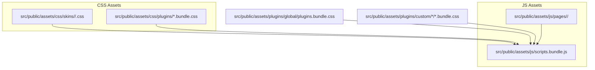
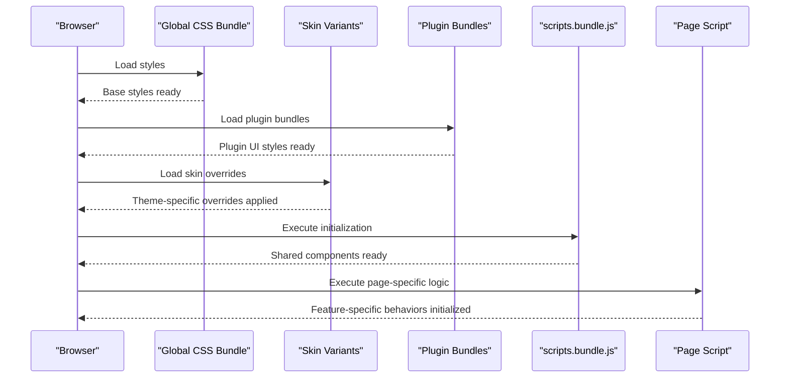
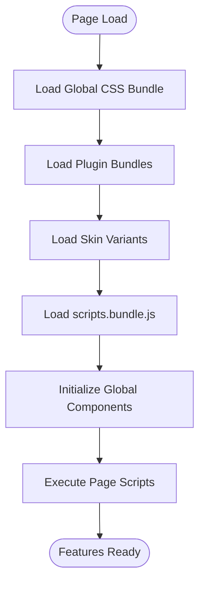
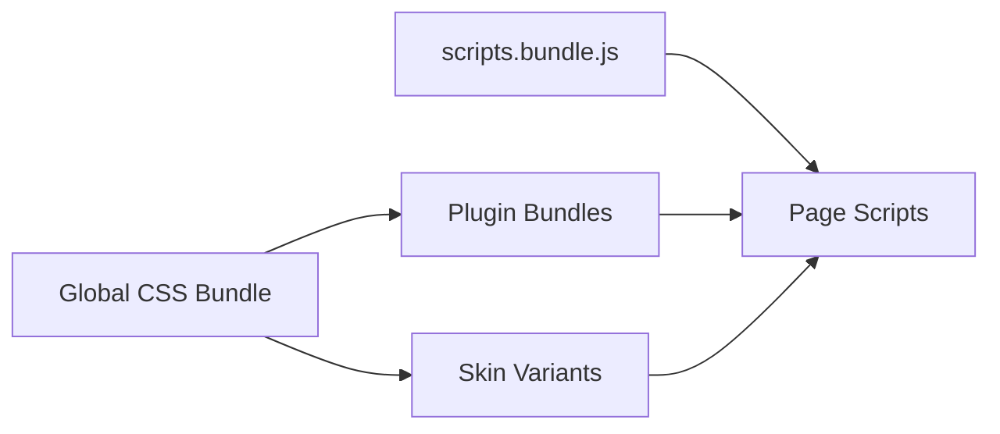

# Asset Management and Bundling

<cite>
**Referenced Files in This Document**
- [dark.css](file://src/public/assets/css/skins/aside/dark.css)
- [dark.css](file://src/public/assets/css/skins/brand/dark.css)
- [plugins.bundle.css](file://src/public/assets/plugins/global/plugins.bundle.css)
- [datatables.bundle.css](file://src/public/assets/plugins/custom/datatables/datatables.bundle.css)
- [fullcalendar.bundle.css](file://src/public/assets/plugins/custom/fullcalendar/fullcalendar.bundle.css)
- [jquery-ui.bundle.css](file://src/public/assets/plugins/custom/jquery-ui/jquery-ui.bundle.css)
- [jstree.bundle.css](file://src/public/assets/plugins/custom/jstree/jstree.bundle.css)
- [scripts.bundle.js](file://src/public/assets/js/scripts.bundle.js)
- [builder.js](file://src/public/assets/js/pages/builder.js)
- [dropdown.js](file://src/public/assets/js/pages/components/base/dropdown.js)
- [dashboard.js](file://src/public/assets/js/pages/custom/pages/dashboard.js)
</cite>

## Table of Contents
1. [Introduction](#introduction)
2. [Project Structure](#project-structure)
3. [Core Components](#core-components)
4. [Architecture Overview](#architecture-overview)
5. [Detailed Component Analysis](#detailed-component-analysis)
6. [Dependency Analysis](#dependency-analysis)
7. [Performance Considerations](#performance-considerations)
8. [Troubleshooting Guide](#troubleshooting-guide)
9. [Conclusion](#conclusion)

## Introduction
This document explains asset management and bundling strategies in Modangci. It covers CSS organization via skins and plugin bundles, the JavaScript asset pipeline (global plugins, page-specific scripts, and custom page loading), asset loading order, dependency management, performance optimization, RTL support, and production deployment practices. It also provides practical guidance for adding custom CSS/JS, modifying bundles, and implementing asset versioning.

## Project Structure
Modangci organizes frontend assets under src/public/assets with two primary categories:
- CSS: skins for theme variants and plugin-specific styles
- JS: global application bundle and page-specific scripts

**Diagram sources**
- [dark.css:1-608](file://src/public/assets/css/skins/aside/dark.css#L1-L608)
- [dark.css:1-45](file://src/public/assets/css/skins/brand/dark.css#L1-L45)
- [plugins.bundle.css:1-800](file://src/public/assets/plugins/global/plugins.bundle.css#L1-L800)
- [datatables.bundle.css:1-800](file://src/public/assets/plugins/custom/datatables/datatables.bundle.css#L1-L800)
- [fullcalendar.bundle.css:1-800](file://src/public/assets/plugins/custom/fullcalendar/fullcalendar.bundle.css#L1-L800)
- [jquery-ui.bundle.css:1-800](file://src/public/assets/plugins/custom/jquery-ui/jquery-ui.bundle.css#L1-L800)
- [jstree.bundle.css:1-800](file://src/public/assets/plugins/custom/jstree/jstree.bundle.css#L1-L800)
- [scripts.bundle.js:1-800](file://src/public/assets/js/scripts.bundle.js#L1-L800)
- [builder.js:1-308](file://src/public/assets/js/pages/builder.js#L1-L308)
- [dropdown.js:1-52](file://src/public/assets/js/pages/components/base/dropdown.js#L1-L52)
- [dashboard.js:1-142](file://src/public/assets/js/pages/custom/pages/dashboard.js#L1-L142)

**Section sources**
- [dark.css:1-608](file://src/public/assets/css/skins/aside/dark.css#L1-L608)
- [dark.css:1-45](file://src/public/assets/css/skins/brand/dark.css#L1-L45)
- [plugins.bundle.css:1-800](file://src/public/assets/plugins/global/plugins.bundle.css#L1-L800)
- [datatables.bundle.css:1-800](file://src/public/assets/plugins/custom/datatables/datatables.bundle.css#L1-L800)
- [fullcalendar.bundle.css:1-800](file://src/public/assets/plugins/custom/fullcalendar/fullcalendar.bundle.css#L1-L800)
- [jquery-ui.bundle.css:1-800](file://src/public/assets/plugins/custom/jquery-ui/jquery-ui.bundle.css#L1-L800)
- [jstree.bundle.css:1-800](file://src/public/assets/plugins/custom/jstree/jstree.bundle.css#L1-L800)
- [scripts.bundle.js:1-800](file://src/public/assets/js/scripts.bundle.js#L1-L800)
- [builder.js:1-308](file://src/public/assets/js/pages/builder.js#L1-L308)
- [dropdown.js:1-52](file://src/public/assets/js/pages/components/base/dropdown.js#L1-L52)
- [dashboard.js:1-142](file://src/public/assets/js/pages/custom/pages/dashboard.js#L1-L142)

## Core Components
- Global CSS bundle: Consolidates framework and plugin styles for predictable loading order.
- Skin variants: Theme-specific overrides layered after global styles.
- Global JS bundle: Initializes core UI components and provides shared utilities.
- Page-specific scripts: Feature-scoped initialization executed after the global bundle.

Key characteristics:
- CSS skins define dark/light variants for aside/brand/header/menu/section areas.
- Plugin bundles encapsulate third-party UI components (e.g., DataTables, FullCalendar, jQuery UI, jstree).
- The global JS bundle initializes tooltips, popovers, portlets, scrollbars, and other shared behaviors.
- Page scripts attach to DOM-ready lifecycle and integrate with global utilities.

**Section sources**
- [dark.css:1-608](file://src/public/assets/css/skins/aside/dark.css#L1-L608)
- [dark.css:1-45](file://src/public/assets/css/skins/brand/dark.css#L1-L45)
- [plugins.bundle.css:1-800](file://src/public/assets/plugins/global/plugins.bundle.css#L1-L800)
- [datatables.bundle.css:1-800](file://src/public/assets/plugins/custom/datatables/datatables.bundle.css#L1-L800)
- [fullcalendar.bundle.css:1-800](file://src/public/assets/plugins/custom/fullcalendar/fullcalendar.bundle.css#L1-L800)
- [jquery-ui.bundle.css:1-800](file://src/public/assets/plugins/custom/jquery-ui/jquery-ui.bundle.css#L1-L800)
- [jstree.bundle.css:1-800](file://src/public/assets/plugins/custom/jstree/jstree.bundle.css#L1-L800)
- [scripts.bundle.js:1-800](file://src/public/assets/js/scripts.bundle.js#L1-L800)

## Architecture Overview
The asset pipeline follows a layered approach:
- Global CSS bundle loads first, followed by plugin bundles, then skin variants.
- Global JS bundle initializes core behaviors; page scripts initialize page-specific features.
- Asset loading order ensures dependencies resolve before runtime usage.

**Diagram sources**
- [plugins.bundle.css:1-800](file://src/public/assets/plugins/global/plugins.bundle.css#L1-L800)
- [datatables.bundle.css:1-800](file://src/public/assets/plugins/custom/datatables/datatables.bundle.css#L1-L800)
- [fullcalendar.bundle.css:1-800](file://src/public/assets/plugins/custom/fullcalendar/fullcalendar.bundle.css#L1-L800)
- [jquery-ui.bundle.css:1-800](file://src/public/assets/plugins/custom/jquery-ui/jquery-ui.bundle.css#L1-L800)
- [jstree.bundle.css:1-800](file://src/public/assets/plugins/custom/jstree/jstree.bundle.css#L1-L800)
- [scripts.bundle.js:1-800](file://src/public/assets/js/scripts.bundle.js#L1-L800)
- [builder.js:1-308](file://src/public/assets/js/pages/builder.js#L1-L308)
- [dropdown.js:1-52](file://src/public/assets/js/pages/components/base/dropdown.js#L1-L52)
- [dashboard.js:1-142](file://src/public/assets/js/pages/custom/pages/dashboard.js#L1-L142)

## Detailed Component Analysis

### CSS Organization and Skins
- Skins directory defines theme variants for major UI regions (aside, brand, header, menu).
- Each variant targets specific selectors to adjust colors, borders, and interactive states.
- Dark skin examples demonstrate hover, active, and open states for navigation and menus.

Implementation highlights:
- Selectors target specific components (e.g., aside menu, header brand, menu items).
- Hover and focus states are animated with transitions for smooth UX.
- Responsive adjustments apply to minimized modes and dropdown overlays.

Best practices:
- Keep skin overrides minimal and scoped to affected components.
- Prefer theme variables or CSS custom properties if introducing a new theme engine.

**Section sources**
- [dark.css:1-608](file://src/public/assets/css/skins/aside/dark.css#L1-L608)
- [dark.css:1-45](file://src/public/assets/css/skins/brand/dark.css#L1-L45)

### Plugin Integration Patterns
- Global plugin bundle consolidates common UI utilities and scrollbars.
- Custom plugin bundles encapsulate third-party libraries (e.g., DataTables, FullCalendar, jQuery UI, jstree).
- Each bundle defines its own selector scope and component styling.

Integration patterns:
- Global bundle initializes scrollbars and utility classes used across pages.
- Custom bundles provide widget-specific styles and are loaded alongside global CSS.

**Section sources**
- [plugins.bundle.css:1-800](file://src/public/assets/plugins/global/plugins.bundle.css#L1-L800)
- [datatables.bundle.css:1-800](file://src/public/assets/plugins/custom/datatables/datatables.bundle.css#L1-L800)
- [fullcalendar.bundle.css:1-800](file://src/public/assets/plugins/custom/fullcalendar/fullcalendar.bundle.css#L1-L800)
- [jquery-ui.bundle.css:1-800](file://src/public/assets/plugins/custom/jquery-ui/jquery-ui.bundle.css#L1-L800)
- [jstree.bundle.css:1-800](file://src/public/assets/plugins/custom/jstree/jstree.bundle.css#L1-L800)

### JavaScript Asset Pipeline
- Global bundle initializes tooltips, popovers, portlets, scrollbars, alerts, sticky elements, and dropdowns.
- Page scripts execute after global initialization to attach feature-specific behaviors.
- Builder and dashboard scripts illustrate AJAX-driven updates and chart rendering.

Initialization flow:
- Global bundle binds to document ready and sets up shared utilities.
- Page scripts register their own ready handlers and integrate with global APIs.

**Section sources**
- [scripts.bundle.js:1-800](file://src/public/assets/js/scripts.bundle.js#L1-L800)
- [builder.js:1-308](file://src/public/assets/js/pages/builder.js#L1-L308)
- [dropdown.js:1-52](file://src/public/assets/js/pages/components/base/dropdown.js#L1-L52)
- [dashboard.js:1-142](file://src/public/assets/js/pages/custom/pages/dashboard.js#L1-L142)

### Asset Loading Order and Dependencies
- CSS load order: global → plugins → skins.
- JS load order: global bundle → page-specific scripts.
- Dependencies:
  - Page scripts depend on global bundle’s initialization.
  - Plugins require their respective CSS bundles to render correctly.

**Diagram sources**
- [plugins.bundle.css:1-800](file://src/public/assets/plugins/global/plugins.bundle.css#L1-L800)
- [datatables.bundle.css:1-800](file://src/public/assets/plugins/custom/datatables/datatables.bundle.css#L1-L800)
- [fullcalendar.bundle.css:1-800](file://src/public/assets/plugins/custom/fullcalendar/fullcalendar.bundle.css#L1-L800)
- [jquery-ui.bundle.css:1-800](file://src/public/assets/plugins/custom/jquery-ui/jquery-ui.bundle.css#L1-L800)
- [jstree.bundle.css:1-800](file://src/public/assets/plugins/custom/jstree/jstree.bundle.css#L1-L800)
- [scripts.bundle.js:1-800](file://src/public/assets/js/scripts.bundle.js#L1-L800)
- [builder.js:1-308](file://src/public/assets/js/pages/builder.js#L1-L308)
- [dropdown.js:1-52](file://src/public/assets/js/pages/components/base/dropdown.js#L1-L52)
- [dashboard.js:1-142](file://src/public/assets/js/pages/custom/pages/dashboard.js#L1-L142)

### RTL Support
- Plugin bundles include directional styles for right-to-left languages.
- Skins define RTL-aware overrides for navigation and branding elements.
- Ensure RTL variants are loaded after base and plugin styles to override correctly.

Practical steps:
- Include RTL plugin bundles alongside base plugin bundles.
- Load skin RTL variants after base skin files.

**Section sources**
- [plugins.bundle.css:1-800](file://src/public/assets/plugins/global/plugins.bundle.css#L1-L800)
- [datatables.bundle.css:1-800](file://src/public/assets/plugins/custom/datatables/datatables.bundle.css#L1-L800)
- [fullcalendar.bundle.css:1-800](file://src/public/assets/plugins/custom/fullcalendar/fullcalendar.bundle.css#L1-L800)
- [jquery-ui.bundle.css:1-800](file://src/public/assets/plugins/custom/jquery-ui/jquery-ui.bundle.css#L1-L800)
- [jstree.bundle.css:1-800](file://src/public/assets/plugins/custom/jstree/jstree.bundle.css#L1-L800)
- [dark.css:1-45](file://src/public/assets/css/skins/brand/dark.css#L1-L45)

### Adding Custom CSS/JS
- Custom CSS:
  - Place new styles in appropriate skin or plugin bundle locations.
  - Maintain load order: global → plugins → skins.
  - Use targeted selectors to avoid conflicts.

- Custom JS:
  - Add a new page script under src/public/assets/js/pages/<category>/.
  - Ensure the script executes after the global bundle.
  - Register DOM-ready handlers and integrate with global utilities.

**Section sources**
- [scripts.bundle.js:1-800](file://src/public/assets/js/scripts.bundle.js#L1-L800)
- [builder.js:1-308](file://src/public/assets/js/pages/builder.js#L1-L308)
- [dropdown.js:1-52](file://src/public/assets/js/pages/components/base/dropdown.js#L1-L52)
- [dashboard.js:1-142](file://src/public/assets/js/pages/custom/pages/dashboard.js#L1-L142)

### Modifying Bundles
- Global CSS bundles:
  - Combine and minify styles for production.
  - Keep global bundle lightweight; defer heavy plugin styles to dedicated bundles.

- Global JS bundles:
  - Keep initialization modular and lazy-load heavy features per page.
  - Avoid blocking the main thread during initialization.

- Page scripts:
  - Encapsulate feature logic and expose public init methods.
  - Defer non-critical work until after initial paint.

**Section sources**
- [plugins.bundle.css:1-800](file://src/public/assets/plugins/global/plugins.bundle.css#L1-L800)
- [scripts.bundle.js:1-800](file://src/public/assets/js/scripts.bundle.js#L1-L800)

### Asset Versioning
- Production deployment:
  - Use hashed filenames or cache-busting query parameters for long-term caching.
  - Maintain separate development and production asset URLs.
  - Invalidate caches after bundle updates.

- Monitoring:
  - Track asset sizes and load times.
  - Audit unused styles/scripts to reduce payload.

[No sources needed since this section provides general guidance]

## Dependency Analysis
Asset dependencies are primarily style-to-script and component-to-plugin relationships:
- Page scripts depend on global bundle initialization.
- Plugins require their CSS bundles to render correctly.
- Skins override base and plugin styles.

**Diagram sources**
- [plugins.bundle.css:1-800](file://src/public/assets/plugins/global/plugins.bundle.css#L1-L800)
- [datatables.bundle.css:1-800](file://src/public/assets/plugins/custom/datatables/datatables.bundle.css#L1-L800)
- [fullcalendar.bundle.css:1-800](file://src/public/assets/plugins/custom/fullcalendar/fullcalendar.bundle.css#L1-L800)
- [jquery-ui.bundle.css:1-800](file://src/public/assets/plugins/custom/jquery-ui/jquery-ui.bundle.css#L1-L800)
- [jstree.bundle.css:1-800](file://src/public/assets/plugins/custom/jstree/jstree.bundle.css#L1-L800)
- [scripts.bundle.js:1-800](file://src/public/assets/js/scripts.bundle.js#L1-L800)
- [builder.js:1-308](file://src/public/assets/js/pages/builder.js#L1-L308)
- [dropdown.js:1-52](file://src/public/assets/js/pages/components/base/dropdown.js#L1-L52)
- [dashboard.js:1-142](file://src/public/assets/js/pages/custom/pages/dashboard.js#L1-L142)

**Section sources**
- [plugins.bundle.css:1-800](file://src/public/assets/plugins/global/plugins.bundle.css#L1-L800)
- [scripts.bundle.js:1-800](file://src/public/assets/js/scripts.bundle.js#L1-L800)
- [builder.js:1-308](file://src/public/assets/js/pages/builder.js#L1-L308)
- [dropdown.js:1-52](file://src/public/assets/js/pages/components/base/dropdown.js#L1-L52)
- [dashboard.js:1-142](file://src/public/assets/js/pages/custom/pages/dashboard.js#L1-L142)

## Performance Considerations
- Minimize and combine CSS/JS for production.
- Defer non-critical CSS and JS to reduce render-blocking.
- Lazy-load heavy plugin features until needed.
- Use efficient selectors in skins to avoid layout thrashing.
- Monitor Largest Contentful Paint (LCP) and First Input Delay (FID) metrics post-deployment.

[No sources needed since this section provides general guidance]

## Troubleshooting Guide
Common issues and resolutions:
- Styles not applying:
  - Verify load order: global → plugins → skins.
  - Confirm skin RTL variants are included for RTL locales.

- Components not initializing:
  - Ensure scripts.bundle.js executes before page scripts.
  - Check for console errors preventing initialization.

- Plugin UI missing:
  - Confirm the corresponding plugin bundle is loaded.
  - Validate selector specificity and CSS overrides.

- Page-specific features not working:
  - Inspect page script initialization and event bindings.
  - Ensure DOM elements exist before binding.

**Section sources**
- [plugins.bundle.css:1-800](file://src/public/assets/plugins/global/plugins.bundle.css#L1-L800)
- [scripts.bundle.js:1-800](file://src/public/assets/js/scripts.bundle.js#L1-L800)
- [builder.js:1-308](file://src/public/assets/js/pages/builder.js#L1-L308)
- [dropdown.js:1-52](file://src/public/assets/js/pages/components/base/dropdown.js#L1-L52)
- [dashboard.js:1-142](file://src/public/assets/js/pages/custom/pages/dashboard.js#L1-L142)

## Conclusion
Modangci’s asset management leverages a layered CSS and JS architecture: global base styles and utilities, plugin-specific styles, theme skins, and page-scoped scripts. By enforcing a strict loading order, managing dependencies carefully, and adopting performance best practices, teams can maintain a scalable and optimized frontend. For production, implement versioning, caching, and monitoring to ensure reliable deployments and strong user experiences.