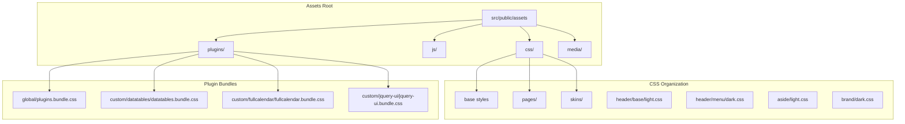
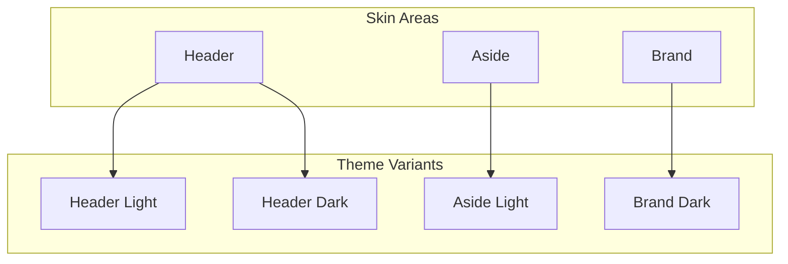
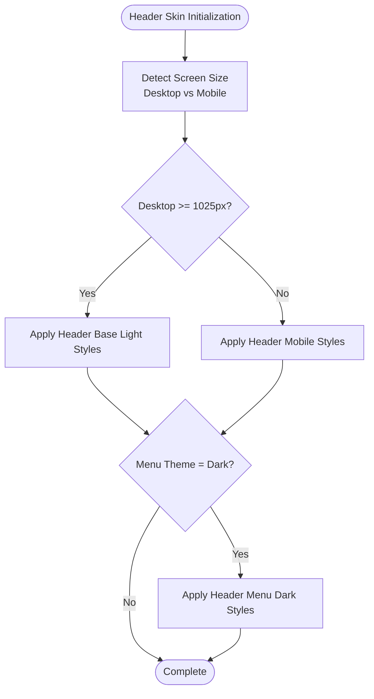
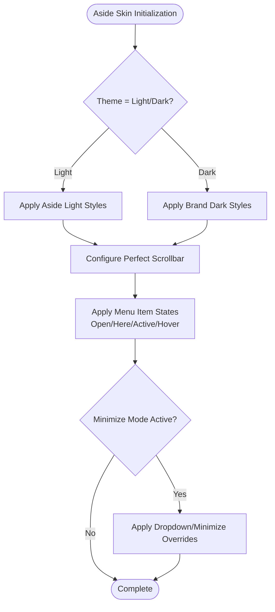
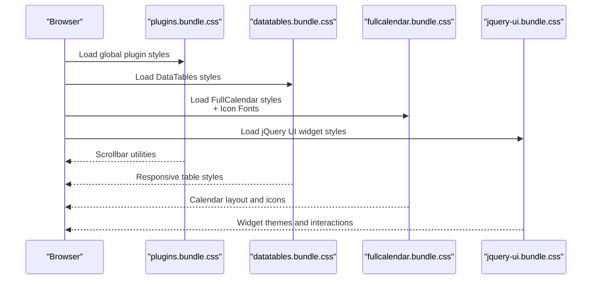
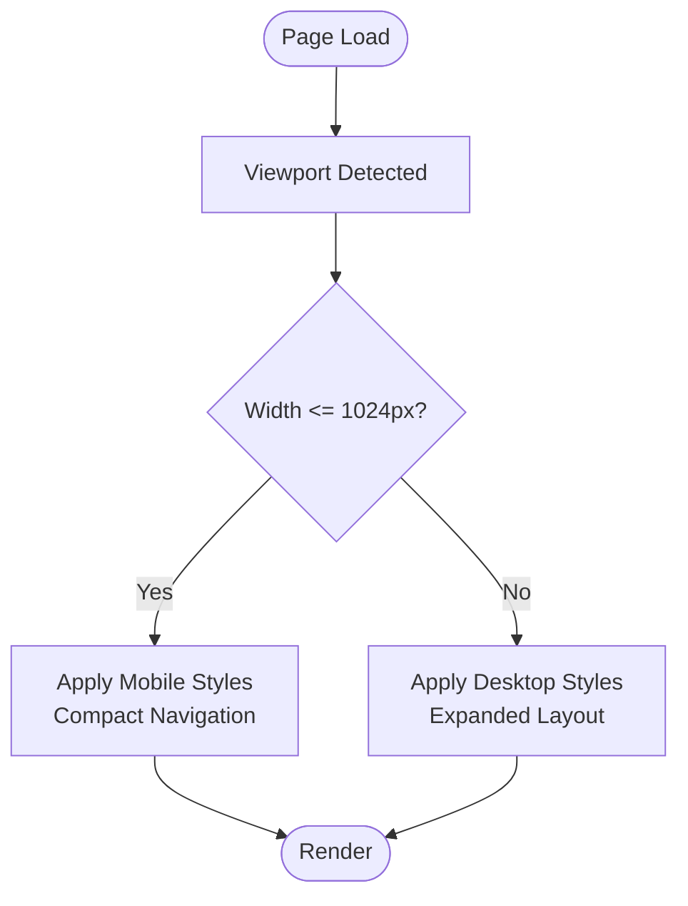
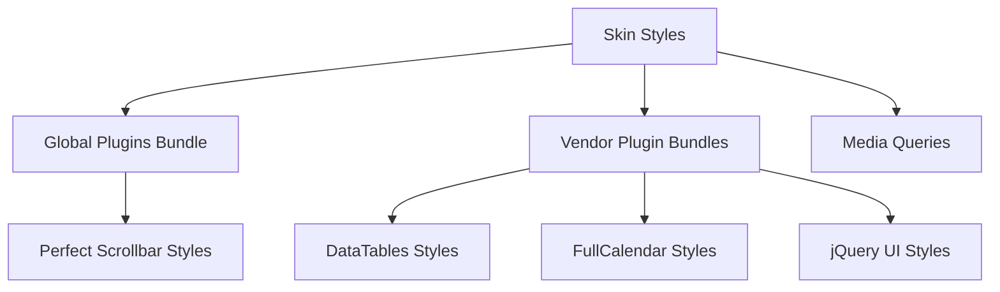

# Bootstrap Integration and Framework Setup

<cite>
**Referenced Files in This Document**
- [light.css](file://src/public/assets/css/skins/header/base/light.css)
- [dark.css](file://src/public/assets/css/skins/header/menu/dark.css)
- [light.css](file://src/public/assets/css/skins/aside/light.css)
- [dark.css](file://src/public/assets/css/skins/brand/dark.css)
- [plugins.bundle.css](file://src/public/assets/plugins/global/plugins.bundle.css)
- [datatables.bundle.css](file://src/public/assets/plugins/custom/datatables/datatables.bundle.css)
- [fullcalendar.bundle.css](file://src/public/assets/plugins/custom/fullcalendar/fullcalendar.bundle.css)
- [jquery-ui.bundle.css](file://src/public/assets/plugins/custom/jquery-ui/jquery-ui.bundle.css)
</cite>

## Table of Contents
1. [Introduction](#introduction)
2. [Project Structure](#project-structure)
3. [Core Components](#core-components)
4. [Architecture Overview](#architecture-overview)
5. [Detailed Component Analysis](#detailed-component-analysis)
6. [Dependency Analysis](#dependency-analysis)
7. [Performance Considerations](#performance-considerations)
8. [Troubleshooting Guide](#troubleshooting-guide)
9. [Conclusion](#conclusion)

## Introduction
This document explains how Modangci integrates Bootstrap 4 with the Metronic theme, focusing on skin system architecture, responsive design patterns, and mobile-first approach. It covers the CSS asset organization (base styles, page vendors, and skin-specific stylesheets), web font loading mechanisms, and practical guidance for customizing Bootstrap components, modifying color schemes, and implementing responsive breakpoints. It also describes the global configuration system and how KTAppOptions enables color palette management for JavaScript components.

## Project Structure
Modangci organizes its frontend assets under the `src/public/assets` directory, separating vendor plugins, page-specific styles, and skin variants. The skin system is structured by theme areas: header, brand, and aside, with distinct light and dark variants. Vendor plugins are bundled into dedicated CSS files to minimize HTTP requests and improve maintainability.

**Diagram sources**
- [light.css](file://src/public/assets/css/skins/header/base/light.css)
- [dark.css](file://src/public/assets/css/skins/header/menu/dark.css)
- [light.css](file://src/public/assets/css/skins/aside/light.css)
- [dark.css](file://src/public/assets/css/skins/brand/dark.css)
- [plugins.bundle.css](file://src/public/assets/plugins/global/plugins.bundle.css)
- [datatables.bundle.css](file://src/public/assets/plugins/custom/datatables/datatables.bundle.css)
- [fullcalendar.bundle.css](file://src/public/assets/plugins/custom/fullcalendar/fullcalendar.bundle.css)
- [jquery-ui.bundle.css](file://src/public/assets/plugins/custom/jquery-ui/jquery-ui.bundle.css)

**Section sources**
- [light.css](file://src/public/assets/css/skins/header/base/light.css)
- [dark.css](file://src/public/assets/css/skins/header/menu/dark.css)
- [light.css](file://src/public/assets/css/skins/aside/light.css)
- [dark.css](file://src/public/assets/css/skins/brand/dark.css)
- [plugins.bundle.css](file://src/public/assets/plugins/global/plugins.bundle.css)
- [datatables.bundle.css](file://src/public/assets/plugins/custom/datatables/datatables.bundle.css)
- [fullcalendar.bundle.css](file://src/public/assets/plugins/custom/fullcalendar/fullcalendar.bundle.css)
- [jquery-ui.bundle.css](file://src/public/assets/plugins/custom/jquery-ui/jquery-ui.bundle.css)

## Core Components
- Skin System Variants: Header base and menu, aside, and brand areas each provide light and dark variants. These variants define color tokens, hover states, and shadows aligned with the Metronic theme.
- Plugin Bundles: Global and custom plugin bundles encapsulate vendor CSS for datepicker, datatables, fullcalendar, and jQuery UI, ensuring consistent styling and reduced maintenance overhead.
- Responsive Breakpoints: Media queries target desktop (min-width: 1025px) and mobile (max-width: 1024px) experiences, enabling adaptive layouts and optimized touch targets.

Key implementation references:
- Header base light variant defines topbar items, menu links, and hover effects for desktop and mobile.
- Header menu dark variant sets background colors, bullet styles, and submenu appearance for dark theme.
- Aside light variant controls background, scrollbar styling, and menu item states.
- Brand dark variant adjusts brand bar background and toggler icons for dark theme.
- Plugin bundles include vendor-specific styles and icon fonts for consistent rendering.

**Section sources**
- [light.css](file://src/public/assets/css/skins/header/base/light.css)
- [dark.css](file://src/public/assets/css/skins/header/menu/dark.css)
- [light.css](file://src/public/assets/css/skins/aside/light.css)
- [dark.css](file://src/public/assets/css/skins/brand/dark.css)
- [plugins.bundle.css](file://src/public/assets/plugins/global/plugins.bundle.css)
- [datatables.bundle.css](file://src/public/assets/plugins/custom/datatables/datatables.bundle.css)
- [fullcalendar.bundle.css](file://src/public/assets/plugins/custom/fullcalendar/fullcalendar.bundle.css)
- [jquery-ui.bundle.css](file://src/public/assets/plugins/custom/jquery-ui/jquery-ui.bundle.css)

## Architecture Overview
The skin system architecture separates concerns across three primary areas:
- Header: Base styling for desktop/mobile topbar and menu links; menu variant for dark theme navigation.
- Aside: Sidebar background, scrollbar styling, and menu item states for light/dark themes.
- Brand: Brand bar background and toggler styling for dark theme.

**Diagram sources**
- [light.css](file://src/public/assets/css/skins/header/base/light.css)
- [dark.css](file://src/public/assets/css/skins/header/menu/dark.css)
- [light.css](file://src/public/assets/css/skins/aside/light.css)
- [dark.css](file://src/public/assets/css/skins/brand/dark.css)

## Detailed Component Analysis

### Header Skin System
The header skin system provides:
- Base light variant: Desktop and mobile topbar styling, hover transitions, and active states for menu links and icons.
- Menu dark variant: Background colors, bullet indicators, and submenu styling tailored for dark theme.

**Diagram sources**
- [light.css](file://src/public/assets/css/skins/header/base/light.css)
- [dark.css](file://src/public/assets/css/skins/header/menu/dark.css)

**Section sources**
- [light.css](file://src/public/assets/css/skins/header/base/light.css)
- [dark.css](file://src/public/assets/css/skins/header/menu/dark.css)

### Aside Skin System
The aside skin system manages:
- Background and shadow for light theme.
- Perfect scrollbar styling for both desktop and mobile.
- Menu item states (open, here, active, hover) with color transitions.
- Dropdown and minimize modes with shadow and background overrides.

**Diagram sources**
- [light.css](file://src/public/assets/css/skins/aside/light.css)
- [dark.css](file://src/public/assets/css/skins/brand/dark.css)

**Section sources**
- [light.css](file://src/public/assets/css/skins/aside/light.css)
- [dark.css](file://src/public/assets/css/skins/brand/dark.css)

### Plugin Bundles and Web Font Loading
Vendor plugins are consolidated into bundle files that include:
- Global plugin styles and scrollbar utilities.
- DataTables styling for responsive tables and pagination.
- FullCalendar styling with icon fonts and button themes.
- jQuery UI styling for draggable, resizable, and interactive widgets.

Web font loading is handled via icon fonts embedded in plugin bundles (e.g., FullCalendar’s fcicons font face), ensuring consistent icon rendering across browsers.

**Diagram sources**
- [plugins.bundle.css](file://src/public/assets/plugins/global/plugins.bundle.css)
- [datatables.bundle.css](file://src/public/assets/plugins/custom/datatables/datatables.bundle.css)
- [fullcalendar.bundle.css](file://src/public/assets/plugins/custom/fullcalendar/fullcalendar.bundle.css)
- [jquery-ui.bundle.css](file://src/public/assets/plugins/custom/jquery-ui/jquery-ui.bundle.css)

**Section sources**
- [plugins.bundle.css](file://src/public/assets/plugins/global/plugins.bundle.css)
- [datatables.bundle.css](file://src/public/assets/plugins/custom/datatables/datatables.bundle.css)
- [fullcalendar.bundle.css](file://src/public/assets/plugins/custom/fullcalendar/fullcalendar.bundle.css)
- [jquery-ui.bundle.css](file://src/public/assets/plugins/custom/jquery-ui/jquery-ui.bundle.css)

### Responsive Design Patterns and Mobile-First Approach
Responsive breakpoints are implemented using media queries targeting:
- Desktop: min-width: 1025px for expanded layouts and desktop-specific styles.
- Mobile: max-width: 1024px for compact layouts, mobile navigation, and adjusted shadows.

These breakpoints ensure optimal rendering across device sizes while maintaining consistent spacing and typography.

**Diagram sources**
- [light.css](file://src/public/assets/css/skins/header/base/light.css)
- [dark.css](file://src/public/assets/css/skins/header/menu/dark.css)
- [light.css](file://src/public/assets/css/skins/aside/light.css)

**Section sources**
- [light.css](file://src/public/assets/css/skins/header/base/light.css)
- [dark.css](file://src/public/assets/css/skins/header/menu/dark.css)
- [light.css](file://src/public/assets/css/skins/aside/light.css)

### Customizing Bootstrap Components and Color Schemes
To customize Bootstrap components and color schemes:
- Override skin-specific variables in the relevant skin files (e.g., header base light, aside light, brand dark).
- Adjust vendor plugin styles by extending or replacing bundle styles where appropriate.
- Use media queries to fine-tune responsive behavior for components like menus and toolbars.

Practical steps:
- Modify color tokens in header and aside skins to reflect new brand colors.
- Extend DataTables or FullCalendar styles to match updated design guidelines.
- Ensure mobile-first adjustments remain consistent with desktop overrides.

**Section sources**
- [light.css](file://src/public/assets/css/skins/header/base/light.css)
- [dark.css](file://src/public/assets/css/skins/header/menu/dark.css)
- [light.css](file://src/public/assets/css/skins/aside/light.css)
- [dark.css](file://src/public/assets/css/skins/brand/dark.css)
- [datatables.bundle.css](file://src/public/assets/plugins/custom/datatables/datatables.bundle.css)
- [fullcalendar.bundle.css](file://src/public/assets/plugins/custom/fullcalendar/fullcalendar.bundle.css)

### Global Configuration and KTAppOptions Integration
The global configuration system leverages KTAppOptions to manage color palettes for JavaScript components. This allows dynamic theming without manual CSS overrides:
- Define color tokens in skin files for consistent visual identity.
- Reference KTAppOptions to apply color schemes to interactive components (e.g., charts, calendars).
- Maintain separation between presentation (CSS) and behavior (JavaScript) for scalability.

Implementation guidance:
- Centralize color definitions in skin files.
- Expose color palettes via KTAppOptions for JavaScript components.
- Test color scheme changes across desktop and mobile breakpoints.

**Section sources**
- [light.css](file://src/public/assets/css/skins/header/base/light.css)
- [dark.css](file://src/public/assets/css/skins/header/menu/dark.css)
- [light.css](file://src/public/assets/css/skins/aside/light.css)
- [dark.css](file://src/public/assets/css/skins/brand/dark.css)

## Dependency Analysis
The skin system depends on:
- Global plugin styles for scrollbar utilities and shared UI behaviors.
- Vendor plugin bundles for specialized components (tables, calendars, UI widgets).
- Media queries to adapt styles for desktop and mobile contexts.

**Diagram sources**
- [plugins.bundle.css](file://src/public/assets/plugins/global/plugins.bundle.css)
- [datatables.bundle.css](file://src/public/assets/plugins/custom/datatables/datatables.bundle.css)
- [fullcalendar.bundle.css](file://src/public/assets/plugins/custom/fullcalendar/fullcalendar.bundle.css)
- [jquery-ui.bundle.css](file://src/public/assets/plugins/custom/jquery-ui/jquery-ui.bundle.css)

**Section sources**
- [plugins.bundle.css](file://src/public/assets/plugins/global/plugins.bundle.css)
- [datatables.bundle.css](file://src/public/assets/plugins/custom/datatables/datatables.bundle.css)
- [fullcalendar.bundle.css](file://src/public/assets/plugins/custom/fullcalendar/fullcalendar.bundle.css)
- [jquery-ui.bundle.css](file://src/public/assets/plugins/custom/jquery-ui/jquery-ui.bundle.css)

## Performance Considerations
- Bundle vendor plugins to reduce HTTP requests and improve load times.
- Use media queries judiciously to avoid excessive recalculations on small screens.
- Prefer CSS custom properties for color tokens to enable runtime theme switching with minimal repaint cost.
- Minimize heavy animations in mobile layouts to preserve responsiveness.

## Troubleshooting Guide
Common issues and resolutions:
- Scrollbar visibility on mobile: Verify Perfect Scrollbar styles in skin files and ensure media query coverage for mobile breakpoints.
- Menu hover states not applying: Confirm theme variant is correctly loaded and media query conditions match viewport size.
- Icon rendering inconsistencies: Ensure plugin bundles include required icon fonts and that font paths resolve correctly.
- DataTables layout shifts: Validate responsive table styles and adjust column widths or pagination settings as needed.

**Section sources**
- [plugins.bundle.css](file://src/public/assets/plugins/global/plugins.bundle.css)
- [datatables.bundle.css](file://src/public/assets/plugins/custom/datatables/datatables.bundle.css)
- [fullcalendar.bundle.css](file://src/public/assets/plugins/custom/fullcalendar/fullcalendar.bundle.css)
- [jquery-ui.bundle.css](file://src/public/assets/plugins/custom/jquery-ui/jquery-ui.bundle.css)

## Conclusion
Modangci’s Bootstrap 4 integration with the Metronic theme follows a structured skin system, organized plugin bundles, and a mobile-first responsive approach. By leveraging media queries, vendor bundles, and centralized color tokens, the system ensures consistent theming across desktop and mobile experiences. KTAppOptions facilitates dynamic color palette management for JavaScript components, enabling scalable customization without compromising maintainability.