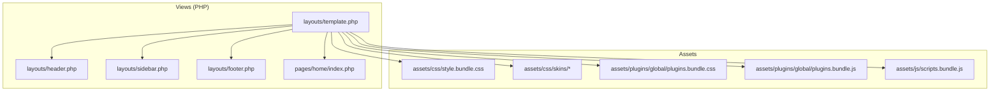
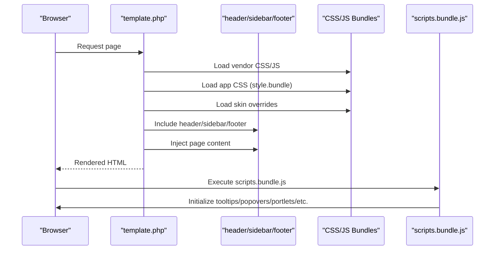
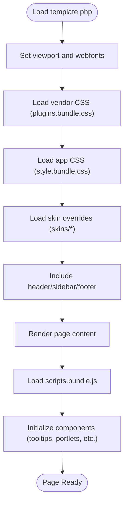
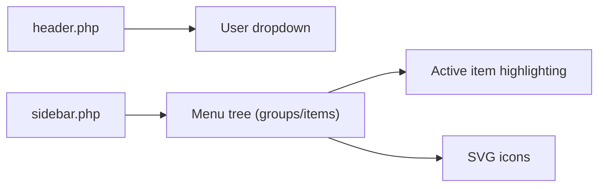
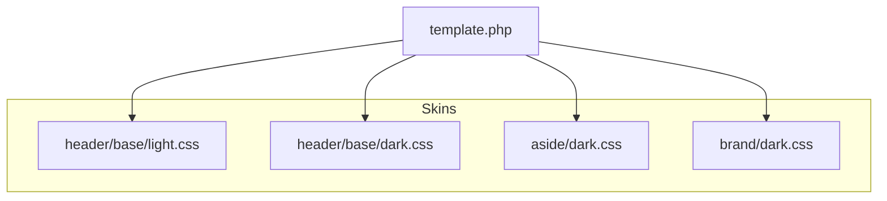
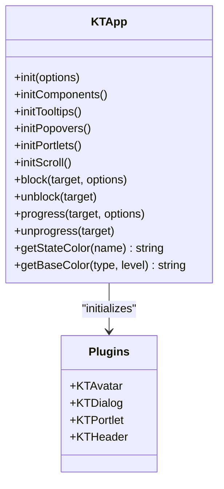
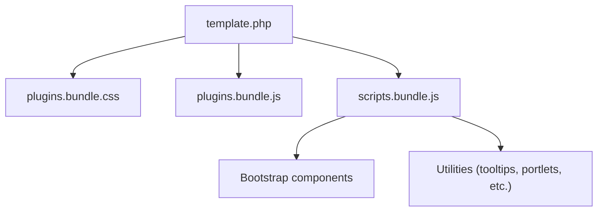
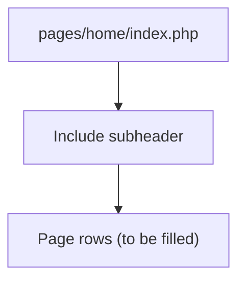
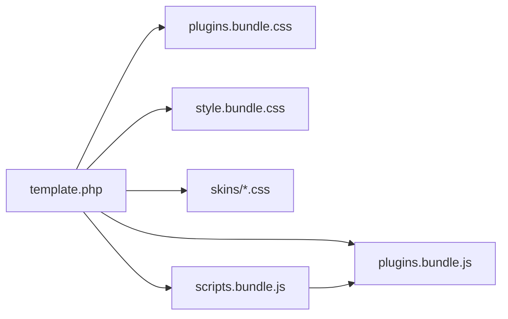

# Frontend Assets and UI

<cite>
**Referenced Files in This Document**
- [template.php](file://src/application/views/layouts/template.php)
- [header.php](file://src/application/views/layouts/header.php)
- [sidebar.php](file://src/application/views/layouts/sidebar.php)
- [footer.php](file://src/application/views/layouts/footer.php)
- [index.php](file://src/application/views/pages/home/index.php)
- [light.css](file://src/public/assets/css/skins/header/base/light.css)
- [dark.css](file://src/public/assets/css/skins/header/base/dark.css)
- [aside-dark.css](file://src/public/assets/css/skins/aside/dark.css)
- [brand-dark.css](file://src/public/assets/css/skins/brand/dark.css)
- [plugins.bundle.css](file://src/public/assets/plugins/global/plugins.bundle.css)
- [plugins.bundle.js](file://src/public/assets/plugins/global/plugins.bundle.js)
- [scripts.bundle.js](file://src/public/assets/js/scripts.bundle.js)
- [jquery.js](file://src/public/assets/plugins/global/plugins.bundle.js)
</cite>

## Table of Contents
1. [Introduction](#introduction)
2. [Project Structure](#project-structure)
3. [Core Components](#core-components)
4. [Architecture Overview](#architecture-overview)
5. [Detailed Component Analysis](#detailed-component-analysis)
6. [Dependency Analysis](#dependency-analysis)
7. [Performance Considerations](#performance-considerations)
8. [Troubleshooting Guide](#troubleshooting-guide)
9. [Conclusion](#conclusion)

## Introduction
This document explains Modangci’s frontend assets and UI system built on Bootstrap and a custom skin framework. It covers how the layout is structured, how Bootstrap and third-party plugins are integrated, how skins and themes are organized, and how JavaScript bundles initialize UI components. It also provides guidance on customization, responsive design, cross-browser compatibility, and performance optimization.

## Project Structure
Modangci organizes frontend assets under the public assets directory and composes pages using PHP views. The layout template wires in global CSS/JS bundles, skin overrides, and per-page scripts. The navigation and branding are defined in dedicated partials, while individual page content is injected into the main content area.

**Diagram sources**
- [template.php:1-180](file://src/application/views/layouts/template.php#L1-L180)
- [header.php:1-98](file://src/application/views/layouts/header.php#L1-L98)
- [sidebar.php:1-128](file://src/application/views/layouts/sidebar.php#L1-L128)
- [footer.php:1-11](file://src/application/views/layouts/footer.php#L1-L11)

**Section sources**
- [template.php:1-180](file://src/application/views/layouts/template.php#L1-L180)
- [header.php:1-98](file://src/application/views/layouts/header.php#L1-L98)
- [sidebar.php:1-128](file://src/application/views/layouts/sidebar.php#L1-L128)
- [footer.php:1-11](file://src/application/views/layouts/footer.php#L1-L11)

## Core Components
- Layout template: Defines the HTML shell, loads vendor and app CSS/JS, and injects partials and page content.
- Partial templates: Header, sidebar, footer, and subheader compose the UI scaffolding.
- Skin system: Theme variants for header, aside, and brand areas are provided as separate CSS files.
- Asset bundles: Global CSS/JS bundles and page-specific scripts are loaded via the template.
- Bootstrap integration: The template references Bootstrap-based classes and icons; initialization code sets up tooltips, popovers, scrollbars, and other components.

**Section sources**
- [template.php:1-180](file://src/application/views/layouts/template.php#L1-L180)
- [header.php:1-98](file://src/application/views/layouts/header.php#L1-L98)
- [sidebar.php:1-128](file://src/application/views/layouts/sidebar.php#L1-L128)
- [light.css:1-103](file://src/public/assets/css/skins/header/base/light.css#L1-L103)
- [dark.css:1-318](file://src/public/assets/css/skins/header/base/dark.css#L1-L318)
- [aside-dark.css:1-608](file://src/public/assets/css/skins/aside/dark.css#L1-L608)
- [brand-dark.css:1-45](file://src/public/assets/css/skins/brand/dark.css#L1-L45)
- [plugins.bundle.css:1-800](file://src/public/assets/plugins/global/plugins.bundle.css#L1-L800)
- [plugins.bundle.js:1-800](file://src/public/assets/plugins/global/plugins.bundle.js#L1-L800)
- [scripts.bundle.js:1-341](file://src/public/assets/js/scripts.bundle.js#L1-L341)

## Architecture Overview
The runtime UI architecture ties together the layout, partials, skin overrides, and bundles. The template includes vendor and app CSS, then applies skin-specific overrides. The scripts bundle initializes Bootstrap components and utilities.

**Diagram sources**
- [template.php:37-176](file://src/application/views/layouts/template.php#L37-L176)
- [scripts.bundle.js:161-331](file://src/public/assets/js/scripts.bundle.js#L161-L331)

## Detailed Component Analysis

### Layout and Template System
- The main template sets viewport meta, web font loading, and includes vendor and app CSS bundles.
- It loads skin overrides for header, menu, brand, and aside.
- It injects partials for header, sidebar, and footer, and renders the requested page content.
- It defines a global configuration object for colors used by the scripts bundle.

**Diagram sources**
- [template.php:17-176](file://src/application/views/layouts/template.php#L17-L176)
- [scripts.bundle.js:161-331](file://src/public/assets/js/scripts.bundle.js#L161-L331)

**Section sources**
- [template.php:17-176](file://src/application/views/layouts/template.php#L17-L176)

### Header and Navigation
- The header partial displays user info and a dropdown menu with navigation items.
- The sidebar partial builds the main navigation menu from hierarchical data, applying active states and SVG icons.

**Diagram sources**
- [header.php:1-98](file://src/application/views/layouts/header.php#L1-L98)
- [sidebar.php:55-113](file://src/application/views/layouts/sidebar.php#L55-L113)

**Section sources**
- [header.php:1-98](file://src/application/views/layouts/header.php#L1-L98)
- [sidebar.php:1-128](file://src/application/views/layouts/sidebar.php#L1-L128)

### Skin System and Theming
- Skin CSS files override base styles for header, aside, and brand areas in light and dark variants.
- The template includes skin files to switch themes globally.

**Diagram sources**
- [template.php:45-49](file://src/application/views/layouts/template.php#L45-L49)
- [light.css:1-103](file://src/public/assets/css/skins/header/base/light.css#L1-L103)
- [dark.css:1-318](file://src/public/assets/css/skins/header/base/dark.css#L1-L318)
- [aside-dark.css:1-608](file://src/public/assets/css/skins/aside/dark.css#L1-L608)
- [brand-dark.css:1-45](file://src/public/assets/css/skins/brand/dark.css#L1-L45)

**Section sources**
- [template.php:45-49](file://src/application/views/layouts/template.php#L45-L49)
- [light.css:1-103](file://src/public/assets/css/skins/header/base/light.css#L1-L103)
- [dark.css:1-318](file://src/public/assets/css/skins/header/base/dark.css#L1-L318)
- [aside-dark.css:1-608](file://src/public/assets/css/skins/aside/dark.css#L1-L608)
- [brand-dark.css:1-45](file://src/public/assets/css/skins/brand/dark.css#L1-L45)

### JavaScript Bundle Initialization
- The scripts bundle initializes Bootstrap components (tooltips, popovers), file inputs, portlets, scroll behavior, alerts, sticky elements, and dropdown positioning.
- It exposes APIs to block/unblock UI, show progress indicators, and access state/base colors.

**Diagram sources**
- [scripts.bundle.js:7-331](file://src/public/assets/js/scripts.bundle.js#L7-L331)

**Section sources**
- [scripts.bundle.js:1-341](file://src/public/assets/js/scripts.bundle.js#L1-L341)

### Bootstrap Integration Patterns
- The template references vendor CSS and JS bundles that include Bootstrap and related plugins.
- The scripts bundle initializes Bootstrap components and utilities.

**Diagram sources**
- [template.php:39-168](file://src/application/views/layouts/template.php#L39-L168)
- [plugins.bundle.css:1-800](file://src/public/assets/plugins/global/plugins.bundle.css#L1-L800)
- [plugins.bundle.js:1-800](file://src/public/assets/plugins/global/plugins.bundle.js#L1-L800)
- [scripts.bundle.js:161-331](file://src/public/assets/js/scripts.bundle.js#L161-L331)

**Section sources**
- [template.php:39-168](file://src/application/views/layouts/template.php#L39-L168)
- [plugins.bundle.css:1-800](file://src/public/assets/plugins/global/plugins.bundle.css#L1-L800)
- [plugins.bundle.js:1-800](file://src/public/assets/plugins/global/plugins.bundle.js#L1-L800)
- [scripts.bundle.js:161-331](file://src/public/assets/js/scripts.bundle.js#L161-L331)

### Page Composition Example
- The home page view includes a subheader partial and leaves room for page-specific rows.

**Diagram sources**
- [index.php:1-7](file://src/application/views/pages/home/index.php#L1-L7)

**Section sources**
- [index.php:1-7](file://src/application/views/pages/home/index.php#L1-L7)

## Dependency Analysis
- The template depends on vendor CSS/JS bundles and app CSS/JS bundles.
- The scripts bundle depends on the vendor JS bundle (jQuery and plugins).
- Skin overrides depend on base CSS and Bootstrap classes.

**Diagram sources**
- [template.php:39-168](file://src/application/views/layouts/template.php#L39-L168)
- [plugins.bundle.css:1-800](file://src/public/assets/plugins/global/plugins.bundle.css#L1-L800)
- [plugins.bundle.js:1-800](file://src/public/assets/plugins/global/plugins.bundle.js#L1-L800)
- [scripts.bundle.js:1-341](file://src/public/assets/js/scripts.bundle.js#L1-L341)

**Section sources**
- [template.php:39-168](file://src/application/views/layouts/template.php#L39-L168)
- [plugins.bundle.css:1-800](file://src/public/assets/plugins/global/plugins.bundle.css#L1-L800)
- [plugins.bundle.js:1-800](file://src/public/assets/plugins/global/plugins.bundle.js#L1-L800)
- [scripts.bundle.js:1-341](file://src/public/assets/js/scripts.bundle.js#L1-L341)

## Performance Considerations
- Asset ordering: Load vendor CSS before app CSS to allow overrides; load vendor JS before app JS to ensure dependencies are available.
- Minimize repaints: Prefer CSS transforms and opacity changes for animations; avoid layout thrashing.
- Lazy initialization: Initialize heavy components only when needed (e.g., portlets, scrollbars).
- Bundle size: Keep vendor and app bundles minimal; defer non-critical scripts.
- Font loading: Preload webfonts to avoid FOIT/FOUT.

## Troubleshooting Guide
- Components not initializing:
  - Verify the scripts bundle is loaded after vendor JS.
  - Ensure the global configuration object is defined before component initialization.
- Skin conflicts:
  - Confirm skin overrides are included after base CSS.
  - Check for specificity wars; adjust selectors if necessary.
- Bootstrap tooltips/popovers missing:
  - Ensure data attributes are correct and Bootstrap JS is loaded.
  - Confirm tooltips/popovers are initialized after DOM content is ready.

**Section sources**
- [template.php:124-176](file://src/application/views/layouts/template.php#L124-L176)
- [scripts.bundle.js:161-331](file://src/public/assets/js/scripts.bundle.js#L161-L331)

## Conclusion
Modangci’s frontend leverages a Bootstrap-based UI with a modular skin system and a robust asset pipeline. The layout template orchestrates vendor and app resources, while partials provide reusable UI scaffolding. The scripts bundle initializes Bootstrap components and utilities, enabling a responsive, themeable interface. Following the documented patterns ensures maintainability, performance, and consistent user experience across devices and browsers.