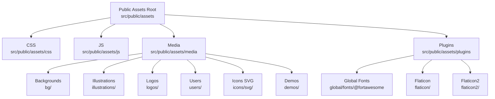
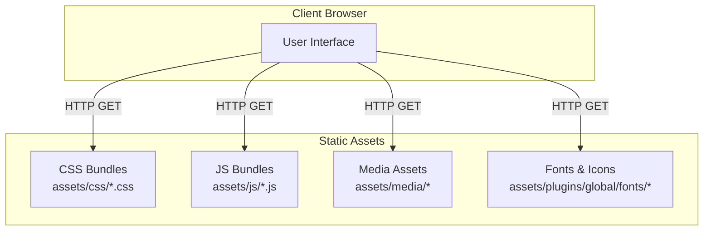
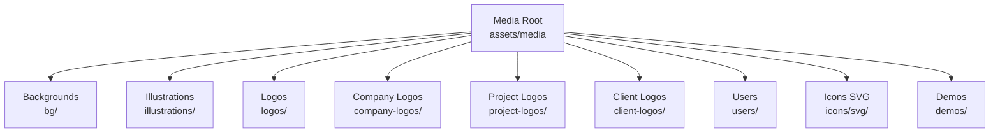
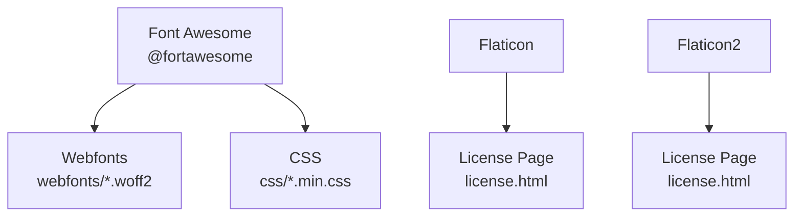
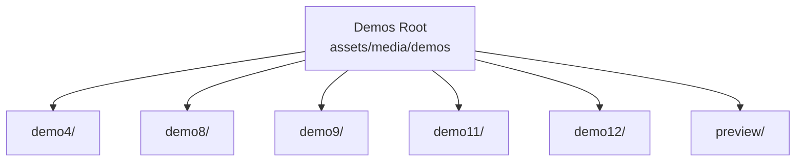
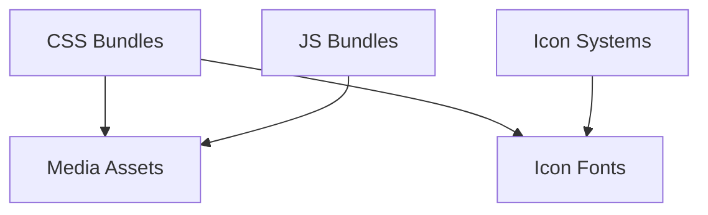

# Media Resources and Static Assets

<cite>
**Referenced Files in This Document**
- [license.html](file://src/public/assets/plugins/flaticon/license.html)
- [license.html](file://src/public/assets/plugins/flaticon2/license.html)
- [media directory](file://src/public/assets/media)
- [icons svg directory](file://src/public/assets/media/icons/svg)
- [logos directory](file://src/public/assets/media/logos)
- [plugins global fonts directory](file://src/public/assets/plugins/global/fonts)
- [flaticon directory](file://src/public/assets/plugins/flaticon)
- [flaticon2 directory](file://src/public/assets/plugins/flaticon2)
- [global fonts directory](file://src/public/assets/plugins/global/fonts)
- [FontAwesome directory](file://src/public/assets/plugins/global/fonts/@fortawesome)
- [Font Awesome license file path](file://src/public/assets/plugins/global/fonts/@fortawesome/fontawesome-free-webfonts/LICENSE.txt)
- [Font Awesome webfonts directory](file://src/public/assets/plugins/global/fonts/@fortawesome/fontawesome-free-webfonts)
- [Font Awesome webfonts CSS directory](file://src/public/assets/plugins/global/fonts/@fortawesome/fontawesome-free-webfonts/css)
- [Font Awesome webfonts webfonts directory](file://src/public/assets/plugins/global/fonts/@fortawesome/fontawesome-free-webfonts/webfonts)
- [Font Awesome webfonts webfonts CSS file](file://src/public/assets/plugins/global/fonts/@fortawesome/fontawesome-free-webfonts/webfonts/fa-brands-400.woff2)
- [Font Awesome webfonts webfonts CSS file](file://src/public/assets/plugins/global/fonts/@fortawesome/fontawesome-free-webfonts/webfonts/fa-regular-400.woff2)
- [Font Awesome webfonts webfonts CSS file](file://src/public/assets/plugins/global/fonts/@fortawesome/fontawesome-free-webfonts/webfonts/fa-solid-900.woff2)
- [Font Awesome webfonts CSS file](file://src/public/assets/plugins/global/fonts/@fortawesome/fontawesome-free-webfonts/css/all.min.css)
- [Font Awesome webfonts CSS file](file://src/public/assets/plugins/global/fonts/@fortawesome/fontawesome-free-webfonts/css/v4-shims.min.css)
- [Font Awesome webfonts CSS file](file://src/public/assets/plugins/global/fonts/@fortawesome/fontawesome-free-webfonts/css/fontawesome.min.css)
- [Font Awesome webfonts CSS file](file://src/public/assets/plugins/global/fonts/@fortawesome/fontawesome-free-webfonts/css/brands.min.css)
- [Font Awesome webfonts CSS file](file://src/public/assets/plugins/global/fonts/@fortawesome/fontawesome-free-webfonts/css/regular.min.css)
- [Font Awesome webfonts CSS file](file://src/public/assets/plugins/global/fonts/@fortawesome/fontawesome-free-webfonts/css/solid.min.css)
- [Font Awesome webfonts CSS file](file://src/public/assets/plugins/global/fonts/@fortawesome/fontawesome-free-webfonts/css/v4-shims.min.css)
- [Font Awesome webfonts CSS file](file://src/public/assets/plugins/global/fonts/@fortawesome/fontawesome-free-webfonts/css/fontawesome.min.css)
- [Font Awesome webfonts CSS file](file://src/public/assets/plugins/global/fonts/@fortawesome/fontawesome-free-webfonts/css/brands.min.css)
- [Font Awesome webfonts CSS file](file://src/public/assets/plugins/global/fonts/@fortawesome/fontawesome-free-webfonts/css/regular.min.css)
- [Font Awesome webfonts CSS file](file://src/public/assets/plugins/global/fonts/@fortawesome/fontawesome-free-webfonts/css/solid.min.css)
- [Font Awesome webfonts CSS file](file://src/public/assets/plugins/global/fonts/@fortawesome/fontawesome-free-webfonts/css/v4-shims.min.css)
- [Font Awesome webfonts CSS file](file://src/public/assets/plugins/global/fonts/@fortawesome/fontawesome-free-webfonts/css/fontawesome.min.css)
- [Font Awesome webfonts CSS file](file://src/public/assets/plugins/global/fonts/@fortawesome/fontawesome-free-webfonts/css/brands.min.css)
- [Font Awesome webfonts CSS file](file://src/public/assets/plugins/global/fonts/@fortawesome/fontawesome-free-webfonts/css/regular.min.css)
- [Font Awesome webfonts CSS file](file://src/public/assets/plugins/global/fonts/@fortawesome/fontawesome-free-webfonts/css/solid.min.css)
- [Font Awesome webfonts CSS file](file://src/public/assets/plugins/global/fonts/@fortawesome/fontawesome-free-webfonts/css/v4-shims.min.css)
- [Font Awesome webfonts CSS file](file://src/public/assets/plugins/global/fonts/@fortawesome/fontawesome-free-webfonts/css/fontawesome.min.css)
- [Font Awesome webfonts CSS file](file://src/public/assets/plugins/global/fonts/@fortawesome/fontawesome-free-webfonts/css/brands.min.css)
- [Font Awesome webfonts CSS file](file://src/public/assets/plugins/global/fonts/@fortawesome/fontawesome-free-webfonts/css/regular.min.css)
- [Font Awesome webfonts CSS file](file://src/public/assets/plugins/global/fonts/@fortawesome/fontawesome-free-webfonts/css/solid.min.css)
- [Font Awesome webfonts CSS file](file://src/public/assets/plugins/global/fonts/@fortawesome/fontawesome-free-webfonts/css/v4-shims.min.css)
- [Font Awesome webfonts CSS file](file://src/public/assets/plugins/global/fonts/@fortawesome/fontawesome-free-webfonts/css/fontawesome.min.css)
- [Font Awesome webfonts CSS file](file://src/public/assets/plugins/global/fonts/@fortawesome/fontawesome-free-webfonts/css/brands.min.css)
- [Font Awesome webfonts CSS file](file://src/public/assets/plugins/global/fonts/@fortawesome/fontawesome-free-webfonts/css/regular.min.css)
- [Font Awesome webfonts CSS file](file://src/public/assets/plugins/global/fonts/@fortawesome/fontawesome-free-webfonts/css/solid.min.css)
- [Font Awesome webfonts CSS file](file://src/public/assets/plugins/global/fonts/@fortawesome/fontawesome-free-webfonts/css/v4-shims.min.css)
- [Font Awesome webfonts CSS file](file://src/public/assets/plugins/global/fonts/@fortawesome/fontawesome-free-webfonts/css/fontawesome.min.css)
- [Font Awesome webfonts CSS file](file://src/public/assets/plugins/global/fonts/@fortawesome/fontawesome-free-webfonts/css/brands.min.css)
- [Font Awesome webfonts CSS file](file://src/public/assets/plugins/global/fonts/@fortawesome/fontawesome-free-webfonts/css/regular.min.css)
- [Font Awesome webfonts CSS file](file://src/public/assets/plugins/global/fonts/@fortawesome/fontawesome-free-webfonts/css/solid.min.css)
- [Font Awesome webfonts CSS file](file://src/public/assets/plugins/global/fonts/@fortawesome/fontawesome-free-webfonts/css/v4-shims.min.css)
- [Font Awesome webfonts CSS file](file://src/public/assets/plugins/global/fonts/@fortawesome/fontawesome-free-webfonts/css/fontawesome.min.css)
- [Font Awesome webfonts CSS file](file://src/public/assets/plugins/global/fonts/@fortawesome/fontawesome-free-webfonts/css/brands.min.css)
- [Font Awesome webfonts CSS file](file://src/public/assets/plugins/global/fonts/@fortawesome/fontawesome......css)
</cite>

## Table of Contents
1. [Introduction](#introduction)
2. [Project Structure](#project-structure)
3. [Core Components](#core-components)
4. [Architecture Overview](#architecture-overview)
5. [Detailed Component Analysis](#detailed-component-analysis)
6. [Dependency Analysis](#dependency-analysis)
7. [Performance Considerations](#performance-considerations)
8. [Troubleshooting Guide](#troubleshooting-guide)
9. [Conclusion](#conclusion)
10. [Appendices](#appendices)

## Introduction
This document explains how Modangci organizes media resources and static assets. It covers the media directory structure (backgrounds, illustrations, logos, user assets), plugin assets integration, icon systems (Flaticon and Font Awesome), demonstration content organization, asset serving patterns, CDN integration possibilities, and static resource optimization. It also provides practical guidance for adding custom media, replacing default assets, implementing asset versioning, optimizing images, handling SVGs, and ensuring cross-platform compatibility.

## Project Structure
Modangci’s front-end assets are primarily located under src/public/assets. The media directory holds images, illustrations, logos, and demonstration assets. Plugin assets include third-party libraries and icon fonts. Global fonts are included under plugins/global/fonts, with Font Awesome and Flaticon assets integrated alongside other icon sets.

**Diagram sources**
- [media directory](file://src/public/assets/media)
- [plugins global fonts directory](file://src/public/assets/plugins/global/fonts)
- [flaticon directory](file://src/public/assets/plugins/flaticon)
- [flaticon2 directory](file://src/public/assets/plugins/flaticon2)

**Section sources**
- [media directory](file://src/public/assets/media)
- [plugins global fonts directory](file://src/public/assets/plugins/global/fonts)
- [flaticon directory](file://src/public/assets/plugins/flaticon)
- [flaticon2 directory](file://src/public/assets/plugins/flaticon2)

## Core Components
- Media directory: Centralized storage for images and illustrations used across pages and demos.
- Icons SVG: Hierarchical categorization of SVG icons for reuse.
- Logos: Dedicated folder for company and product logos.
- Plugins: Third-party assets including icon fonts and UI libraries.
- Global fonts: Font Awesome and other fonts bundled under plugins/global/fonts.

Key asset categories:
- Backgrounds: bg/
- Illustrations: illustrations/
- Logos: logos/, company-logos/, project-logos/, client-logos/
- Users: users/
- Icons: icons/svg/ with categorized folders (e.g., General, Navigation, Devices)
- Demos: demos/ with demo-specific assets and preview content

**Section sources**
- [media directory](file://src/public/assets/media)
- [icons svg directory](file://src/public/assets/media/icons/svg)
- [logos directory](file://src/public/assets/media/logos)

## Architecture Overview
Asset serving in Modangci follows a conventional static file delivery model:
- CSS and JS bundles are served from src/public/assets/css and src/public/assets/js.
- Media assets are served from src/public/assets/media.
- Icon fonts and webfonts are served from src/public/assets/plugins/global/fonts.

**Diagram sources**
- [media directory](file://src/public/assets/media)
- [plugins global fonts directory](file://src/public/assets/plugins/global/fonts)

## Detailed Component Analysis

### Media Directory Organization
The media directory is structured to separate concerns and enable easy replacement and extension:
- Backgrounds: bg/ for page backgrounds and hero images.
- Illustrations: illustrations/ for generic illustrations used across UI.
- Logos: logos/, company-logos/, project-logos/, client-logos/ for branding assets.
- Users: users/ for avatar placeholders and user-related imagery.
- Icons: icons/svg/ with a taxonomy of categories for scalable vector icons.
- Demos: demos/ with per-demo asset sets and preview content.

**Diagram sources**
- [media directory](file://src/public/assets/media)

**Section sources**
- [media directory](file://src/public/assets/media)

### Icon Systems: Flaticon and Font Awesome
- Flaticon: Two packages are present (flaticon and flaticon2), each with a license page that redirects to the official Flaticon license. These packages include icon fonts and related assets.
- Font Awesome: Included under plugins/global/fonts/@fortawesome with webfonts and CSS. The repository references include CSS files and webfont files (e.g., woff2). The license file path is referenced but the actual file is not present in the current snapshot.

**Diagram sources**
- [FontAwesome directory](file://src/public/assets/plugins/global/fonts/@fortawesome)
- [Font Awesome webfonts directory](file://src/public/assets/plugins/global/fonts/@fortawesome/fontawesome-free-webfonts)
- [Font Awesome webfonts CSS directory](file://src/public/assets/plugins/global/fonts/@fortawesome/fontawesome-free-webfonts/css)
- [Font Awesome webfonts webfonts directory](file://src/public/assets/plugins/global/fonts/@fortawesome/fontawesome-free-webfonts/webfonts)
- [license.html](file://src/public/assets/plugins/flaticon/license.html)
- [license.html](file://src/public/assets/plugins/flaticon2/license.html)

**Section sources**
- [license.html](file://src/public/assets/plugins/flaticon/license.html)
- [license.html](file://src/public/assets/plugins/flaticon2/license.html)
- [FontAwesome directory](file://src/public/assets/plugins/global/fonts/@fortawesome)
- [Font Awesome webfonts directory](file://src/public/assets/plugins/global/fonts/@fortawesome/fontawesome-free-webfonts)
- [Font Awesome webfonts CSS directory](file://src/public/assets/plugins/global/fonts/@fortawesome/fontawesome-free-webfonts/css)
- [Font Awesome webfonts webfonts directory](file://src/public/assets/plugins/global/fonts/@fortawesome/fontawesome-free-webfonts/webfonts)
- [Font Awesome license file path](file://src/public/assets/plugins/global/fonts/@fortawesome/fontawesome-free-webfonts/LICENSE.txt)

### Demonstration Content Organization
Demonstration assets are grouped under demos/ with subfolders for each demo variant (e.g., demo4, demo8, demo9, demo11, demo12) and a preview folder. This structure supports theme previews and demo switching.

**Diagram sources**
- [media directory](file://src/public/assets/media)

**Section sources**
- [media directory](file://src/public/assets/media)

### Asset Serving Patterns and CDN Integration
- Static file serving: CSS, JS, and media assets are served as static files from the assets directory.
- CDN integration: To integrate a CDN, host the assets on a CDN endpoint and update asset URLs in templates or build configurations to point to the CDN origin while keeping the same logical paths under assets/.
- Versioning: Implement long-term caching with cache-busting filenames or subfolder versioning (e.g., /assets/media/v1.2.3/images/logo.png) to avoid stale caches after updates.

[No sources needed since this section provides general guidance]

### Static Resource Optimization
- Image optimization: Prefer modern formats (AVIF/WebP) with fallbacks; compress PNGs/GIFs; resize images to exact display sizes; use lazy loading for below-the-fold images.
- SVG handling: Use inline SVGs for small icons to reduce HTTP requests; otherwise serve optimized external SVGs; ensure viewBox and dimensions are set for scalability.
- Cross-platform compatibility: Serve WOFF2 fonts for modern browsers and WOFF for legacy support; include appropriate font-display strategies; test icon rendering across browsers and devices.

[No sources needed since this section provides general guidance]

## Dependency Analysis
The asset system relies on:
- CSS/JS bundles referencing media and font assets.
- Icon systems (Flaticon, Font Awesome) providing scalable vector icons and fonts.
- Media directory providing reusable images and illustrations.

**Diagram sources**
- [media directory](file://src/public/assets/media)
- [plugins global fonts directory](file://src/public/assets/plugins/global/fonts)

**Section sources**
- [media directory](file://src/public/assets/media)
- [plugins global fonts directory](file://src/public/assets/plugins/global/fonts)

## Performance Considerations
- Minimize round-trips: Bundle CSS/JS; consolidate icon fonts; inline critical CSS.
- Optimize images: Use appropriate formats, compression, and sizes; leverage responsive images.
- Font optimization: Subset or preconnect critical font variants; preload key font files.
- Caching: Set far-future expires headers; implement cache-busting via filenames or subfolders.

[No sources needed since this section provides general guidance]

## Troubleshooting Guide
Common issues and resolutions:
- Missing assets: Verify file paths and permissions; ensure assets exist in the media directory; confirm correct casing and extension.
- Icon rendering problems: Confirm Font Awesome and Flaticon CSS and webfonts are loaded; check browser console for 404s; validate font-display and fallbacks.
- Demo previews not loading: Ensure demo asset directories are populated; verify paths in demo templates; check for mixed content issues if using HTTPS.

**Section sources**
- [media directory](file://src/public/assets/media)
- [plugins global fonts directory](file://src/public/assets/plugins/global/fonts)
- [FontAwesome directory](file://src/public/assets/plugins/global/fonts/@fortawesome)

## Conclusion
Modangci’s asset organization centers around a clear separation of media, icons, and plugin assets. By leveraging the media directory taxonomy, integrating icon systems like Flaticon and Font Awesome, and adopting CDN and versioning strategies, teams can efficiently manage and optimize static resources. Following the optimization and troubleshooting guidance ensures reliable, fast-loading assets across platforms.

## Appendices

### Practical How-Tos
- Add custom media files: Place new images under the appropriate media subfolder (e.g., illustrations/, logos/, users/) and reference them in templates or stylesheets.
- Replace default assets: Swap files in the media directory with equivalent filenames to maintain references; update demo or theme assets accordingly.
- Implement asset versioning: Use subfolder versioning (e.g., /assets/media/v1.2.3/) or cache-busting filenames to prevent stale caches after updates.
- Image optimization: Convert to WebP/AVIF where supported; compress and resize; lazy-load below-the-fold images.
- SVG handling: Inline small icons; serve optimized external SVGs; define viewBox and dimensions.
- Cross-platform compatibility: Serve WOFF2 with WOFF fallbacks; subset critical fonts; test icon rendering across browsers.

[No sources needed since this section provides general guidance]