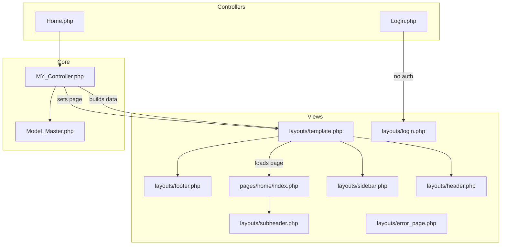
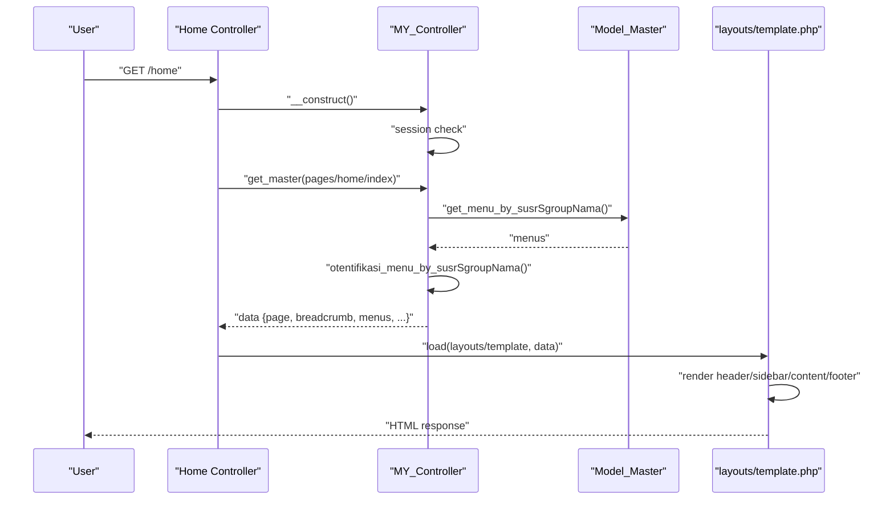
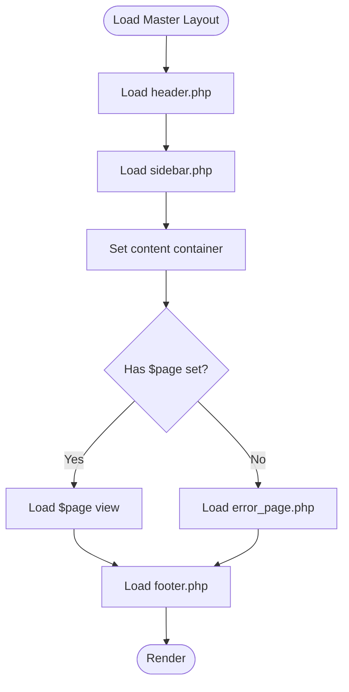
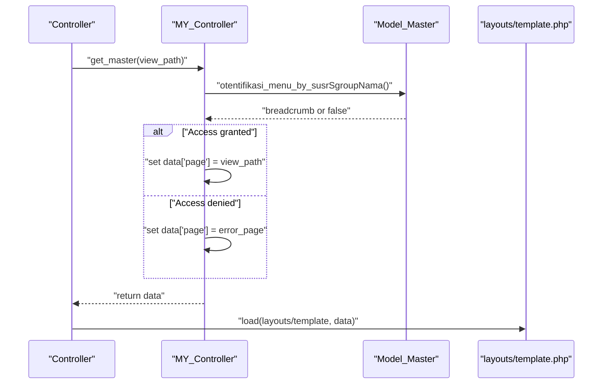
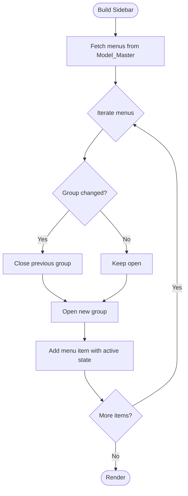
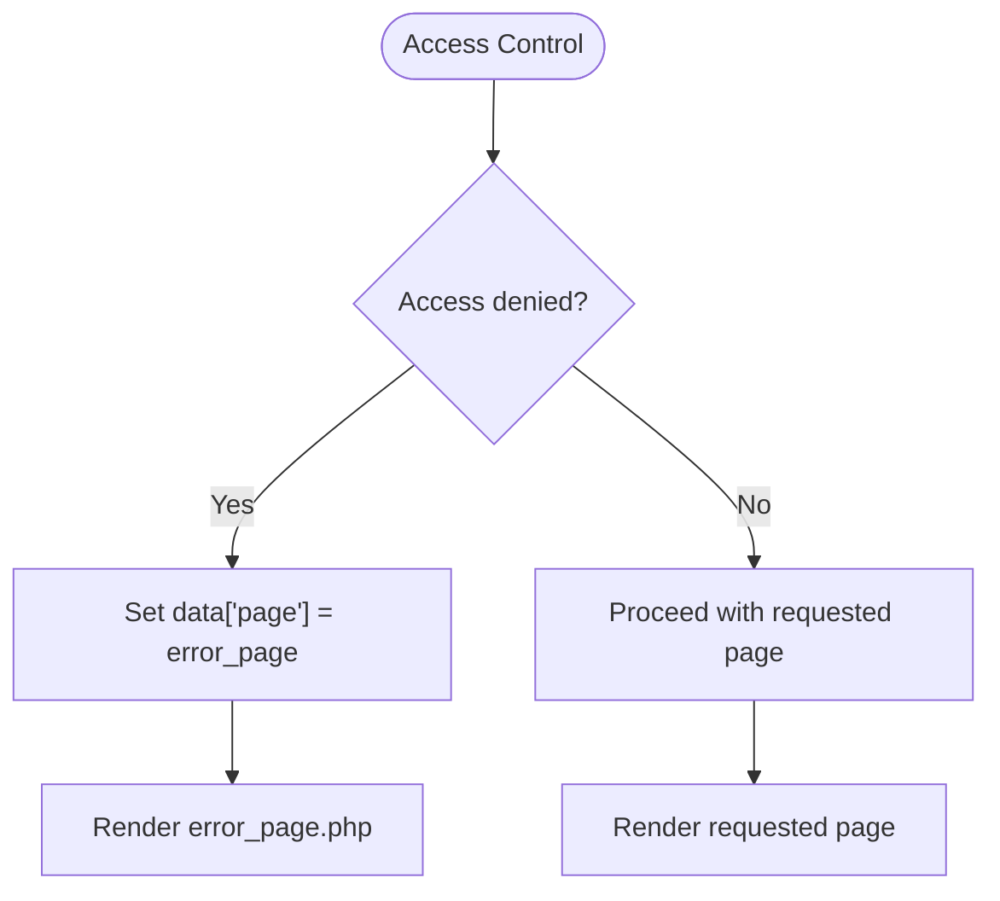
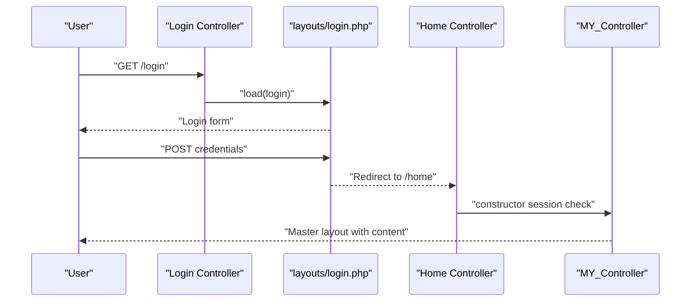
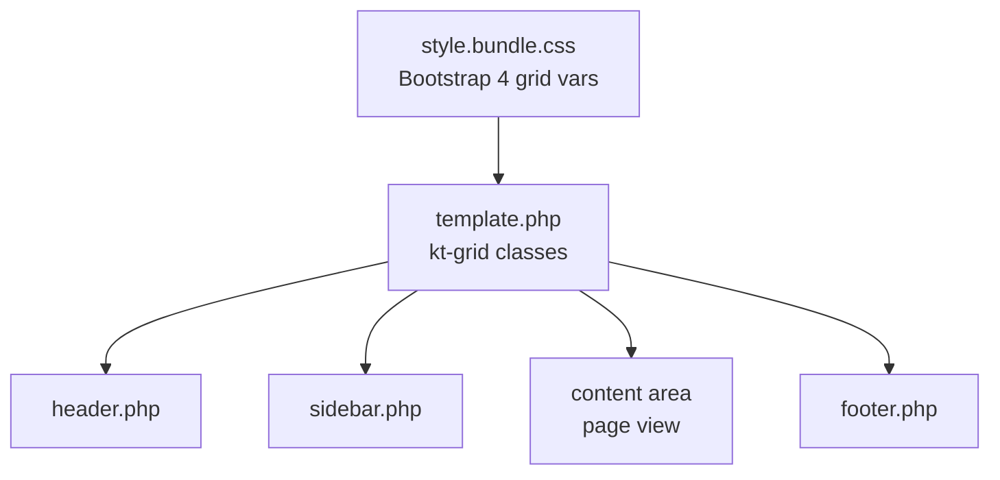
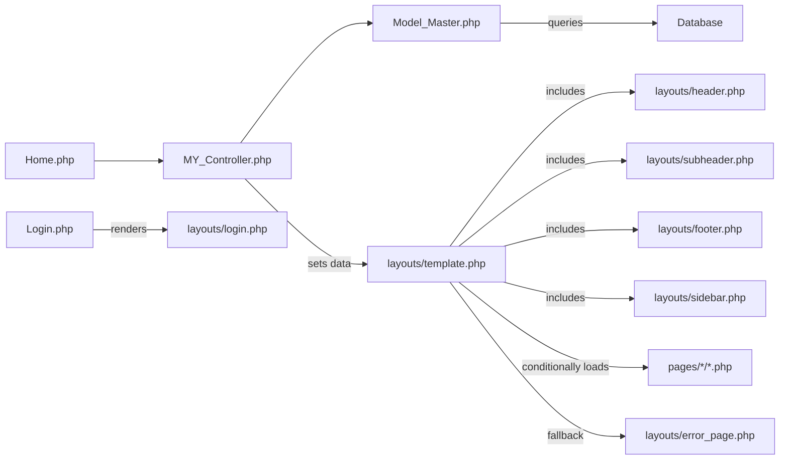

# Template System and Layout Structure

<cite>
**Referenced Files in This Document**
- [template.php](file://src/application/views/layouts/template.php)
- [header.php](file://src/application/views/layouts/header.php)
- [sidebar.php](file://src/application/views/layouts/sidebar.php)
- [footer.php](file://src/application/views/layouts/footer.php)
- [error_page.php](file://src/application/views/layouts/error_page.php)
- [login.php](file://src/application/views/layouts/login.php)
- [subheader.php](file://src/application/views/layouts/subheader.php)
- [Home.php](file://src/application/controllers/Home.php)
- [Login.php](file://src/application/controllers/Login.php)
- [MY_Controller.php](file://src/application/core/MY_Controller.php)
- [Model_Master.php](file://src/application/core/Model_Master.php)
- [style.bundle.css](file://src/public/assets/css/style.bundle.css)
</cite>

## Table of Contents
1. [Introduction](#introduction)
2. [Project Structure](#project-structure)
3. [Core Components](#core-components)
4. [Architecture Overview](#architecture-overview)
5. [Detailed Component Analysis](#detailed-component-analysis)
6. [Dependency Analysis](#dependency-analysis)
7. [Performance Considerations](#performance-considerations)
8. [Troubleshooting Guide](#troubleshooting-guide)
9. [Conclusion](#conclusion)
10. [Appendices](#appendices)

## Introduction
This document explains the template system and layout structure used in Modangci. It covers the main layout architecture with header, sidebar, content area, and footer components, the partial template system, how views are rendered within the layout, dynamic content loading via page variables, error page fallback, and the grid/responsive behavior inherited from the underlying framework. It also provides practical guidance for creating custom layouts, modifying existing templates, and extending the template system.

## Project Structure
The template system is organized around a master layout that composes reusable partials (header, sidebar, subheader, footer). Controllers prepare data and pass a page variable to the layout, which renders the appropriate view inside the content area. Authentication uses a dedicated login layout, while unauthorized access is handled by an error page.

**Diagram sources**
- [Home.php:1-121](file://src/application/controllers/Home.php#L1-L121)
- [Login.php:1-18](file://src/application/controllers/Login.php#L1-L18)
- [MY_Controller.php:1-59](file://src/application/core/MY_Controller.php#L1-L59)
- [Model_Master.php:1-257](file://src/application/core/Model_Master.php#L1-L257)
- [template.php:1-180](file://src/application/views/layouts/template.php#L1-L180)
- [header.php:1-98](file://src/application/views/layouts/header.php#L1-L98)
- [sidebar.php:1-128](file://src/application/views/layouts/sidebar.php#L1-L128)
- [subheader.php:1-40](file://src/application/views/layouts/subheader.php#L1-L40)
- [footer.php:1-11](file://src/application/views/layouts/footer.php#L1-L11)
- [error_page.php:1-50](file://src/application/views/layouts/error_page.php#L1-L50)
- [login.php:1-140](file://src/application/views/layouts/login.php#L1-L140)
- [pages/home/index.php:1-7](file://src/application/views/pages/home/index.php#L1-L7)

**Section sources**
- [template.php:1-180](file://src/application/views/layouts/template.php#L1-L180)
- [header.php:1-98](file://src/application/views/layouts/header.php#L1-L98)
- [sidebar.php:1-128](file://src/application/views/layouts/sidebar.php#L1-L128)
- [footer.php:1-11](file://src/application/views/layouts/footer.php#L1-L11)
- [error_page.php:1-50](file://src/application/views/layouts/error_page.php#L1-L50)
- [login.php:1-140](file://src/application/views/layouts/login.php#L1-L140)
- [Home.php:1-121](file://src/application/controllers/Home.php#L1-L121)
- [Login.php:1-18](file://src/application/controllers/Login.php#L1-L18)
- [MY_Controller.php:1-59](file://src/application/core/MY_Controller.php#L1-L59)
- [Model_Master.php:1-257](file://src/application/core/Model_Master.php#L1-L257)
- [pages/home/index.php:1-7](file://src/application/views/pages/home/index.php#L1-L7)

## Core Components
- Master layout: Composes header, sidebar, content area, and footer; conditionally renders a page or an error fallback.
- Partial templates: Reusable components for header, sidebar, subheader, and footer.
- Controller data pipeline: Builds breadcrumb, menus, user info, and sets the page variable for rendering.
- Error and login layouts: Dedicated layouts for unauthorized access and authentication flows.

Key responsibilities:
- Layout composition and conditional rendering of the page variable.
- Dynamic menu generation and active state management.
- User session checks and access control.
- Error fallback rendering when access is denied.

**Section sources**
- [template.php:95-100](file://src/application/views/layouts/template.php#L95-L100)
- [MY_Controller.php:20-51](file://src/application/core/MY_Controller.php#L20-L51)
- [Model_Master.php:188-238](file://src/application/core/Model_Master.php#L188-L238)

## Architecture Overview
The system follows a layered MVC pattern with a central template layout and partials. Controllers extend a base controller that enforces authentication and prepares shared data. The base controller delegates page rendering to the master layout, which embeds the requested page view.

**Diagram sources**
- [Home.php:21-26](file://src/application/controllers/Home.php#L21-L26)
- [MY_Controller.php:13-18](file://src/application/core/MY_Controller.php#L13-L18)
- [MY_Controller.php:20-51](file://src/application/core/MY_Controller.php#L20-L51)
- [Model_Master.php:188-238](file://src/application/core/Model_Master.php#L188-L238)
- [template.php:84-109](file://src/application/views/layouts/template.php#L84-L109)

## Detailed Component Analysis

### Master Layout and Partial Templates
The master layout defines the HTML shell and includes partials for header, sidebar, content area, and footer. The content area conditionally loads either the page view or an error fallback when the page variable is empty.

**Diagram sources**
- [template.php:80-109](file://src/application/views/layouts/template.php#L80-L109)
- [error_page.php:1-50](file://src/application/views/layouts/error_page.php#L1-L50)

**Section sources**
- [template.php:80-109](file://src/application/views/layouts/template.php#L80-L109)
- [header.php:1-98](file://src/application/views/layouts/header.php#L1-L98)
- [sidebar.php:1-128](file://src/application/views/layouts/sidebar.php#L1-L128)
- [footer.php:1-11](file://src/application/views/layouts/footer.php#L1-L11)
- [subheader.php:1-40](file://src/application/views/layouts/subheader.php#L1-L40)

### Dynamic Content Loading and Page Variable Handling
Controllers set the page variable to the desired view path. The base controller builds shared data including menus, breadcrumb, and user info. Access control determines whether to render the requested page or fall back to an error page.

**Diagram sources**
- [MY_Controller.php:20-51](file://src/application/core/MY_Controller.php#L20-L51)
- [Model_Master.php:222-238](file://src/application/core/Model_Master.php#L222-L238)
- [template.php:95-100](file://src/application/views/layouts/template.php#L95-L100)

**Section sources**
- [Home.php:21-26](file://src/application/controllers/Home.php#L21-L26)
- [MY_Controller.php:20-51](file://src/application/core/MY_Controller.php#L20-L51)
- [Model_Master.php:222-238](file://src/application/core/Model_Master.php#L222-L238)

### Sidebar Menu Rendering and Active States
The sidebar dynamically generates menu groups and items based on user permissions. It tracks the current group and module to apply active/open states and links to module routes.

**Diagram sources**
- [sidebar.php:55-113](file://src/application/views/layouts/sidebar.php#L55-L113)
- [Model_Master.php:188-205](file://src/application/core/Model_Master.php#L188-L205)

**Section sources**
- [sidebar.php:55-113](file://src/application/views/layouts/sidebar.php#L55-L113)
- [Model_Master.php:188-205](file://src/application/core/Model_Master.php#L188-L205)

### Error Page Fallback System
When access is denied, the base controller sets the page variable to the error page, which is rendered inside a minimal layout optimized for error presentation.

**Diagram sources**
- [MY_Controller.php:34-41](file://src/application/core/MY_Controller.php#L34-L41)
- [error_page.php:1-50](file://src/application/views/layouts/error_page.php#L1-L50)

**Section sources**
- [MY_Controller.php:34-41](file://src/application/core/MY_Controller.php#L34-L41)
- [error_page.php:1-50](file://src/application/views/layouts/error_page.php#L1-L50)

### Login Layout and Authentication Flow
The login controller bypasses the master layout and renders a dedicated login layout. After successful authentication, users are redirected to the home controller, which enforces session checks via the base controller.

**Diagram sources**
- [Login.php:13-16](file://src/application/controllers/Login.php#L13-L16)
- [login.php:1-140](file://src/application/views/layouts/login.php#L1-L140)
- [Home.php:21-26](file://src/application/controllers/Home.php#L21-L26)
- [MY_Controller.php:13-18](file://src/application/core/MY_Controller.php#L13-L18)

**Section sources**
- [Login.php:13-16](file://src/application/controllers/Login.php#L13-L16)
- [login.php:1-140](file://src/application/views/layouts/login.php#L1-L140)
- [Home.php:21-26](file://src/application/controllers/Home.php#L21-L26)
- [MY_Controller.php:13-18](file://src/application/core/MY_Controller.php#L13-L18)

### Grid System Integration and Responsive Behavior
The project uses Bootstrap 4 via the global styles bundle. Breakpoints and grid utilities are defined in the stylesheet, enabling responsive layouts out of the box. The master layout leverages grid classes to structure the page horizontally and vertically.

**Diagram sources**
- [style.bundle.css:8-36](file://src/public/assets/css/style.bundle.css#L8-L36)
- [template.php:77-112](file://src/application/views/layouts/template.php#L77-L112)

**Section sources**
- [style.bundle.css:8-36](file://src/public/assets/css/style.bundle.css#L8-L36)
- [template.php:77-112](file://src/application/views/layouts/template.php#L77-L112)

### Creating Custom Layouts and Extending the Template System
To create a new layout:
- Define a new layout file under views/layouts with the same HTML shell and include placeholders for header, sidebar, content, and footer.
- In the controller, set the template variable to the new layout path and ensure the page variable points to the intended view.
- Optionally, introduce additional data variables (e.g., extra scripts) and render them in the layout similar to the existing scripts injection.

To modify existing templates:
- Adjust partials (header, sidebar, subheader, footer) to reflect branding or navigation changes.
- Update the master layout to include new partials or reorder existing ones.
- Ensure access control logic remains intact so unauthorized routes still fall back to the error page.

To extend the template system:
- Centralize common data preparation in the base controller’s data builder method.
- Introduce optional partials (e.g., breadcrumbs, notifications) that views can opt into by setting flags in the data array.
- Add environment-specific assets or scripts via the layout’s script injection section.

**Section sources**
- [template.php:171-176](file://src/application/views/layouts/template.php#L171-L176)
- [MY_Controller.php:20-51](file://src/application/core/MY_Controller.php#L20-L51)

## Dependency Analysis
The template system relies on a small set of core classes and models to orchestrate rendering and access control.

**Diagram sources**
- [Home.php:1-121](file://src/application/controllers/Home.php#L1-L121)
- [Login.php:1-18](file://src/application/controllers/Login.php#L1-L18)
- [MY_Controller.php:1-59](file://src/application/core/MY_Controller.php#L1-L59)
- [Model_Master.php:1-257](file://src/application/core/Model_Master.php#L1-L257)
- [template.php:1-180](file://src/application/views/layouts/template.php#L1-L180)
- [header.php:1-98](file://src/application/views/layouts/header.php#L1-L98)
- [sidebar.php:1-128](file://src/application/views/layouts/sidebar.php#L1-L128)
- [subheader.php:1-40](file://src/application/views/layouts/subheader.php#L1-L40)
- [footer.php:1-11](file://src/application/views/layouts/footer.php#L1-L11)
- [error_page.php:1-50](file://src/application/views/layouts/error_page.php#L1-L50)

**Section sources**
- [Home.php:1-121](file://src/application/controllers/Home.php#L1-L121)
- [Login.php:1-18](file://src/application/controllers/Login.php#L1-L18)
- [MY_Controller.php:1-59](file://src/application/core/MY_Controller.php#L1-L59)
- [Model_Master.php:1-257](file://src/application/core/Model_Master.php#L1-L257)
- [template.php:1-180](file://src/application/views/layouts/template.php#L1-L180)

## Performance Considerations
- Minimize heavy computations in partials; defer to models and controllers.
- Reuse shared assets and avoid duplicating CSS/JS across layouts.
- Keep the number of included partials reasonable to reduce render time.
- Use lazy loading for non-critical resources in the content area.

## Troubleshooting Guide
Common issues and resolutions:
- Unauthorized access leads to error page: Verify the access control logic and ensure the user’s group permits access to the requested module.
- Empty content area: Confirm the controller sets the page variable to a valid view path.
- Session timeout during navigation: Ensure the base controller’s session check runs on protected routes.
- Incorrect active menu state: Review the breadcrumb assignment and menu iteration logic in the sidebar.

**Section sources**
- [MY_Controller.php:13-18](file://src/application/core/MY_Controller.php#L13-L18)
- [MY_Controller.php:34-41](file://src/application/core/MY_Controller.php#L34-L41)
- [sidebar.php:55-113](file://src/application/views/layouts/sidebar.php#L55-L113)

## Conclusion
Modangci’s template system centers on a master layout that composes reusable partials and a robust controller-layer data pipeline. Access control is enforced early, ensuring unauthorized routes gracefully fall back to an error page. The grid system inherited from Bootstrap enables responsive layouts out of the box. By following the outlined extension and modification practices, teams can maintain consistency while adapting the system to evolving requirements.

## Appendices
- Example: Adding a new partial
  - Create a new partial under views/layouts (e.g., notifications).
  - Include it in the master layout where appropriate.
  - Have controllers pass a flag or data to enable/disable the partial per view.
- Example: Switching layouts per route
  - In the controller, set the template variable to the new layout path and ensure the page variable remains valid.