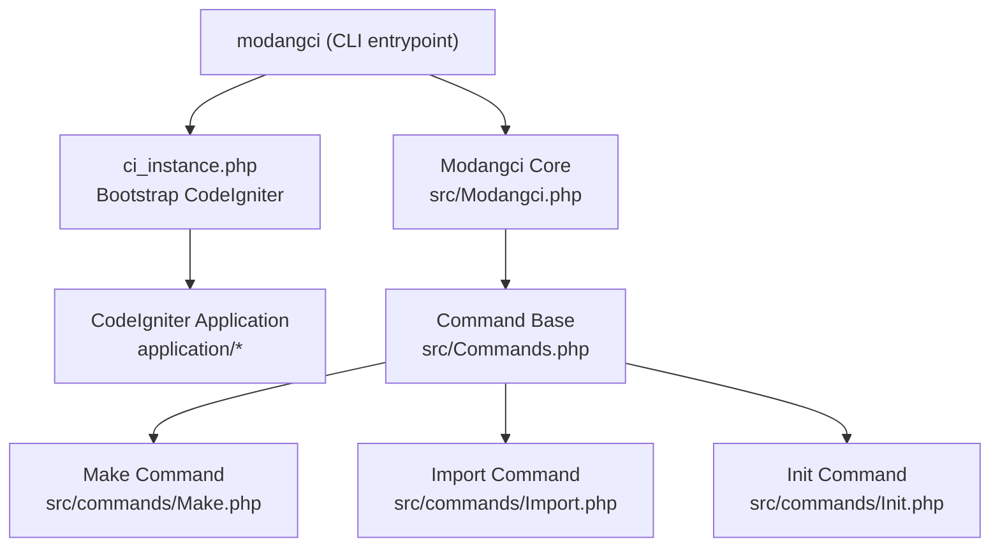
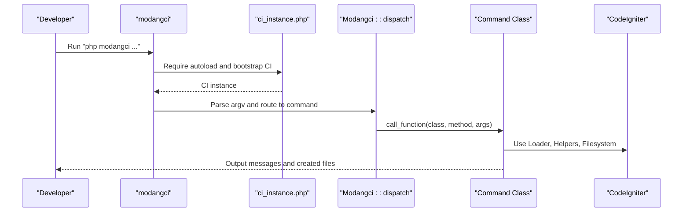
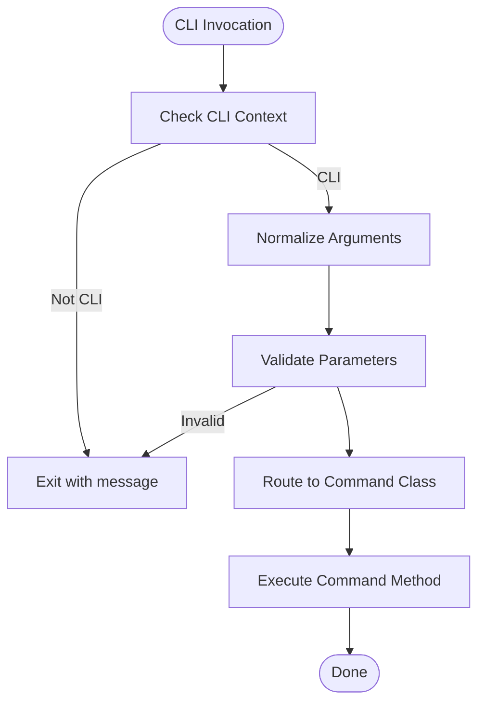
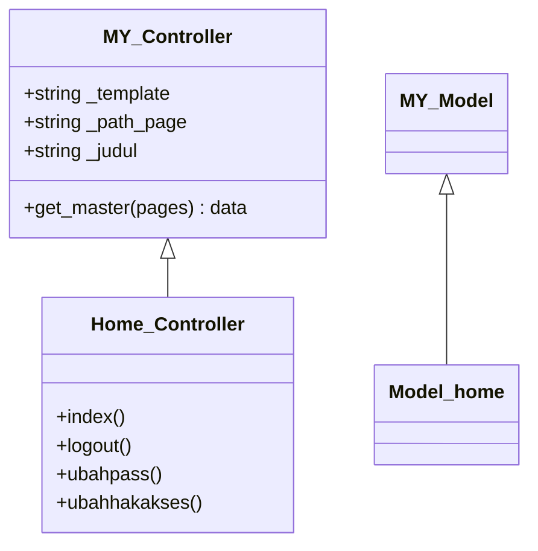
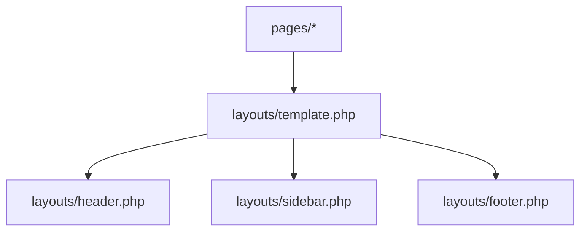
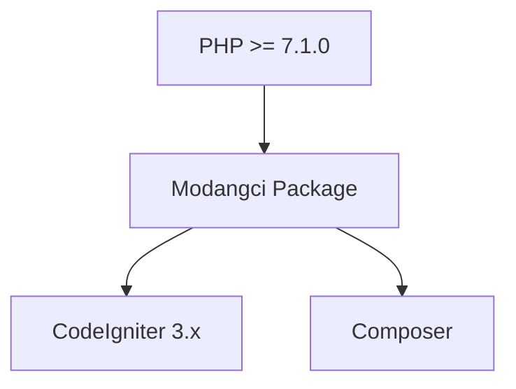

# Getting Started

<cite>
**Referenced Files in This Document**
- [README.md](file://README.md)
- [composer.json](file://composer.json)
- [modangci](file://modangci)
- [install](file://install)
- [ci_instance.php](file://ci_instance.php)
- [src/Modangci.php](file://src/Modangci.php)
- [src/Commands.php](file://src/Commands.php)
- [src/commands/Make.php](file://src/commands/Make.php)
- [src/commands/Import.php](file://src/commands/Import.php)
- [src/commands/Init.php](file://src/commands/Init.php)
- [src/application/core/MY_Controller.php](file://src/application/core/MY_Controller.php)
- [src/application/core/MY_Model.php](file://src/application/core/MY_Model.php)
- [src/application/controllers/Home.php](file://src/application/controllers/Home.php)
- [src/application/models/Model_home.php](file://src/application/models/Model_home.php)
- [src/application/views/layouts/template.php](file://src/application/views/layouts/template.php)
</cite>

## Table of Contents
1. [Introduction](#introduction)
2. [Project Structure](#project-structure)
3. [Core Components](#core-components)
4. [Architecture Overview](#architecture-overview)
5. [Detailed Component Analysis](#detailed-component-analysis)
6. [Dependency Analysis](#dependency-analysis)
7. [Performance Considerations](#performance-considerations)
8. [Troubleshooting Guide](#troubleshooting-guide)
9. [Conclusion](#conclusion)
10. [Appendices](#appendices)

## Introduction
This guide helps you quickly set up Modangci in a CodeIgniter 3 project and start generating controllers, models, views, and scaffolding. It covers prerequisites, installation via Composer, running the installer, initializing your project, and executing your first commands. It also includes verification steps, beginner-friendly examples, and troubleshooting tips.

Prerequisites
- PHP >= 7.1.0
- CodeIgniter 3.x project

## Project Structure
Modangci is a CLI tool that integrates with a CodeIgniter 3 application. It installs a small executable wrapper and a helper to bootstrap the CodeIgniter environment inside the CLI context. The tool provides three command categories:
- Make: Generate individual components (controller, model, helper, libraries, view, or full CRUD)
- Import: Bring in reusable components (models, helpers, libraries) from the package
- Init: Scaffold authentication, controllers, models, views, and full CRUD for a given table

**Diagram sources**
- [modangci](file://modangci)
- [ci_instance.php](file://ci_instance.php)
- [src/Modangci.php](file://src/Modangci.php)
- [src/Commands.php](file://src/Commands.php)
- [src/commands/Make.php](file://src/commands/Make.php)
- [src/commands/Import.php](file://src/commands/Import.php)
- [src/commands/Init.php](file://src/commands/Init.php)

**Section sources**
- [README.md](file://README.md)
- [composer.json](file://composer.json)
- [modangci](file://modangci)
- [ci_instance.php](file://ci_instance.php)
- [src/Modangci.php](file://src/Modangci.php)
- [src/Commands.php](file://src/Commands.php)

## Core Components
- CLI Entrypoint: The modangci file loads Composer autoload, boots CodeIgniter via ci_instance.php, and instantiates the Modangci dispatcher.
- Dispatcher: Parses arguments, validates CLI context, and routes to the appropriate command class and method.
- Commands Base: Provides shared helpers for copying files, recursive copying, creating folders, writing files, and printing messages.
- Make Command: Generates controllers, models, helpers, libraries, standalone views, and full CRUD sets.
- Import Command: Copies prebuilt components into your application and optionally runs Composer for dependencies.
- Init Command: Creates database tables for authentication, imports controllers, models, views, assets, and sets up autoloading/config hints.

**Section sources**
- [modangci](file://modangci)
- [ci_instance.php](file://ci_instance.php)
- [src/Modangci.php](file://src/Modangci.php)
- [src/Commands.php](file://src/Commands.php)
- [src/commands/Make.php](file://src/commands/Make.php)
- [src/commands/Import.php](file://src/commands/Import.php)
- [src/commands/Init.php](file://src/commands/Init.php)

## Architecture Overview
The CLI architecture is thin and purpose-built:
- The CLI wrapper ensures the script runs only in CLI mode.
- It initializes CodeIgniter so commands can use CodeIgniter’s loader, database, and filesystem helpers.
- Commands operate within the CodeIgniter application path (APPPATH) to create or copy files.

**Diagram sources**
- [modangci](file://modangci)
- [ci_instance.php](file://ci_instance.php)
- [src/Modangci.php](file://src/Modangci.php)
- [src/Commands.php](file://src/Commands.php)

## Detailed Component Analysis

### Installation and Setup
Follow these steps to install Modangci in a CodeIgniter 3 project:

1. Create a CodeIgniter 3 project
   - Use the official installer to scaffold a new project.
   - Change into the project directory.

2. Install Modangci via Composer
   - Add the package to your project using Composer.

3. Run the Modangci installer
   - The installer copies the CLI binary and a helper into your project root.

4. Verify the CLI binary
   - Confirm the modangci file exists and is executable.

5. Initialize your project (optional)
   - Run the init auth command to scaffold authentication scaffolding, controllers, models, views, and assets.

6. Configure autoloading and config (init auth prints suggestions)
   - Set autoload libraries and helpers.
   - Set base_url and session save path.

7. Run your first commands
   - Generate a controller, model, helper, library, or a full CRUD.

Verification steps
- After installation, run the CLI help to list available commands.
- Generate a simple controller and confirm it appears under application/controllers.
- Generate a simple model and confirm it appears under application/models.
- Generate a simple view and confirm it appears under application/views.

Common setup issues and fixes
- Running outside CLI: The tool checks for CLI context and exits otherwise. Ensure you run commands with php modangci ...
- Permission errors when creating files/folders: Ensure your project directory is writable by the current user.
- Composer autoload missing: Ensure Composer autoload is present and up to date after adding the package.
- Database connection during Init: Ensure your CodeIgniter database configuration is correct before running init commands.

**Section sources**
- [README.md](file://README.md)
- [install](file://install)
- [modangci](file://modangci)
- [ci_instance.php](file://ci_instance.php)
- [src/commands/Init.php](file://src/commands/Init.php)

### First-Time Usage Examples

Generate your first controller
- Command: make controller Example
- Expected outcome: A controller file is created under application/controllers/Example.php.

Generate your first model
- Command: make model Example
- Expected outcome: A model file is created under application/models/Model_example.php.

Generate your first helper
- Command: make helper Example
- Expected outcome: A helper file is created under application/helpers/example_helper.php.

Generate your first library
- Command: make libraries Example
- Expected outcome: A library file is created under application/libraries/Example.php.

Generate your first view
- Command: make view Example
- Expected outcome: A view directory and index file are created under application/views/example/index.php.

Generate a full CRUD
- Command: make crud Product
- Expected outcome: A controller, model, and view set are generated for Product.

Verify your work
- Open the generated files and confirm they match the expected structure.
- Optionally run the CLI help to review command syntax.

**Section sources**
- [src/commands/Make.php](file://src/commands/Make.php)
- [src/commands/Import.php](file://src/commands/Import.php)
- [src/commands/Init.php](file://src/commands/Init.php)

### Command Categories

Make Command
- Purpose: Generate individual components and full CRUD sets.
- Key capabilities:
  - Controller generation with optional resource flag for REST-like actions.
  - Model generation with optional table and primary key.
  - Helper and library generation.
  - Standalone view generation.
  - Full CRUD generation combining controller, model, and view.

Import Command
- Purpose: Copy reusable components into your application.
- Key capabilities:
  - Import model templates and master models.
  - Import helper files.
  - Import libraries; optionally run Composer for dependencies.

Init Command
- Purpose: Scaffold authentication and CRUD scaffolding for a given table.
- Key capabilities:
  - Create authentication tables and seed default data.
  - Copy controllers, models, views, and assets.
  - Provide autoloading and config hints for sessions and base_url.

**Section sources**
- [src/commands/Make.php](file://src/commands/Make.php)
- [src/commands/Import.php](file://src/commands/Import.php)
- [src/commands/Init.php](file://src/commands/Init.php)

### CLI Flow and Validation
The CLI flow enforces safety and correctness:
- CLI-only execution: The tool checks for CLI context and exits otherwise.
- Argument normalization: Arguments are normalized and validated; unknown parameters are rejected unless whitelisted.
- Dynamic routing: The dispatcher constructs the command class and method names from arguments and invokes them.

**Diagram sources**
- [src/Modangci.php](file://src/Modangci.php)
- [src/Commands.php](file://src/Commands.php)

**Section sources**
- [src/Modangci.php](file://src/Modangci.php)
- [src/Commands.php](file://src/Commands.php)

### Generated Code Patterns
Generated components follow CodeIgniter conventions:
- Controllers extend CI_Controller or a custom base (e.g., MY_Controller).
- Models extend CI_Model or a custom base (e.g., MY_Model).
- Views are placed under application/views with logical subdirectories.
- CRUD generation wires controllers to models and views, and includes basic form validation and encryption-aware keys.

**Diagram sources**
- [src/application/core/MY_Controller.php](file://src/application/core/MY_Controller.php)
- [src/application/core/MY_Model.php](file://src/application/core/MY_Model.php)
- [src/application/models/Model_home.php](file://src/application/models/Model_home.php)
- [src/application/controllers/Home.php](file://src/application/controllers/Home.php)

**Section sources**
- [src/application/core/MY_Controller.php](file://src/application/core/MY_Controller.php)
- [src/application/core/MY_Model.php](file://src/application/core/MY_Model.php)
- [src/application/models/Model_home.php](file://src/application/models/Model_home.php)
- [src/application/controllers/Home.php](file://src/application/controllers/Home.php)

### Template and Layout
The generated views integrate with a shared layout template that includes navigation, header, footer, and assets. This ensures consistent UI across generated pages.

**Diagram sources**
- [src/application/views/layouts/template.php](file://src/application/views/layouts/template.php)

**Section sources**
- [src/application/views/layouts/template.php](file://src/application/views/layouts/template.php)

## Dependency Analysis
- PHP requirement: The package requires PHP >= 7.1.0.
- CodeIgniter 3.x: The CLI bootstraps CodeIgniter to access its loader, database, and filesystem helpers.
- Composer: Used to install the package and optionally pull in third-party dependencies for imported libraries.

**Diagram sources**
- [composer.json](file://composer.json)

**Section sources**
- [composer.json](file://composer.json)

## Performance Considerations
- Use the Make command for quick generation of components without database introspection.
- Use the Init command for full CRUD scaffolding; note it queries information_schema, so ensure your database credentials are correct to avoid delays.
- Keep your project writable to avoid repeated permission-related failures during file creation.

## Troubleshooting Guide
- Command not recognized
  - Ensure you run the command via php modangci ... and that the modangci file is present in your project root.
- Not a CLI request
  - The tool exits if invoked outside CLI. Re-run from the terminal.
- Permission denied when creating files/folders
  - Ensure your project directory is writable by the current user.
- Composer dependency for libraries
  - Some imports require Composer packages (e.g., PDF generator). The Import command can run Composer for you.
- Database errors during Init
  - Verify your database configuration in CodeIgniter before running Init commands.
- Autoload and config
  - Follow the printed suggestions for autoload libraries/helpers and base_url/session path.

**Section sources**
- [src/Modangci.php](file://src/Modangci.php)
- [src/commands/Import.php](file://src/commands/Import.php)
- [src/commands/Init.php](file://src/commands/Init.php)

## Conclusion
With Modangci, you can rapidly scaffold CodeIgniter applications by generating controllers, models, helpers, libraries, views, and full CRUD sets. Start with the Make command for simple components, and use Init to bootstrap authentication and CRUD scaffolding. Follow the setup steps, verify your work, and consult the troubleshooting section for common issues.

## Appendices

### Quick Reference: Commands
- Make
  - make controller name [extends] [-r]
  - make model name [extends] [table] [primary_key]
  - make helper name
  - make libraries name
  - make view name
  - make crud name
- Import
  - import model master
  - import helper datetoindo | daystoindo | monthtoindo | generatepassword | debuglog | terbilang | message
  - import libraries pdfgenerator | encryptions
- Init
  - init auth
  - init controller table controller_class display_name
  - init model table model_class
  - init view table folder_name
  - init crud table class_name display_name

**Section sources**
- [README.md](file://README.md)
- [src/commands/Make.php](file://src/commands/Make.php)
- [src/commands/Import.php](file://src/commands/Import.php)
- [src/commands/Init.php](file://src/commands/Init.php)