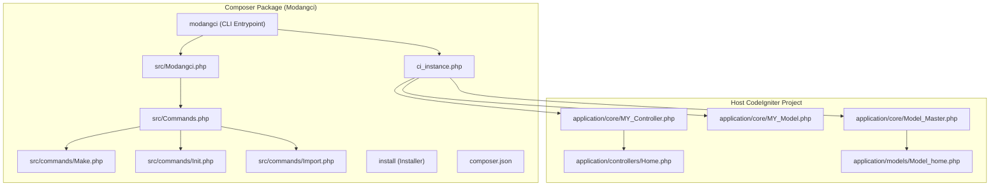
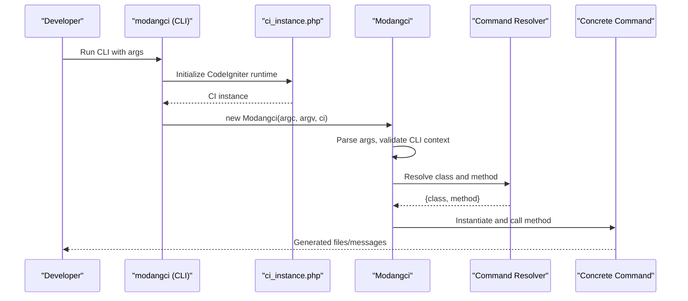
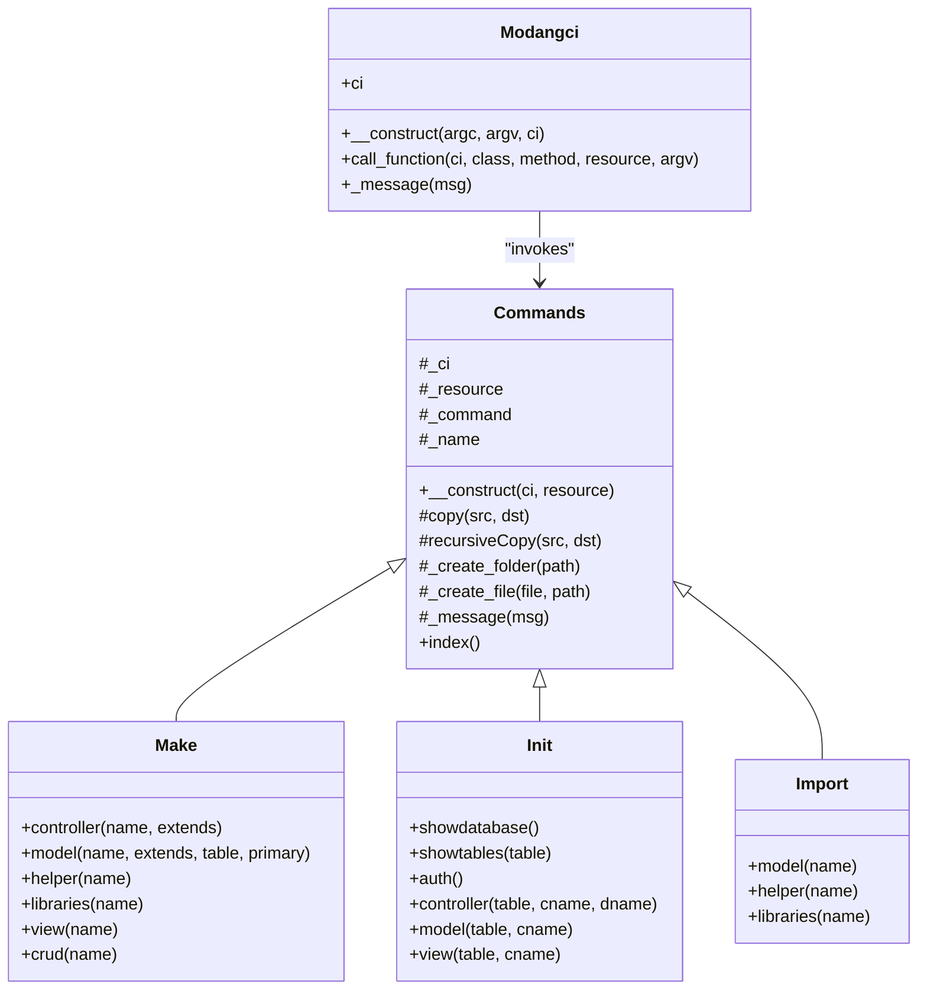
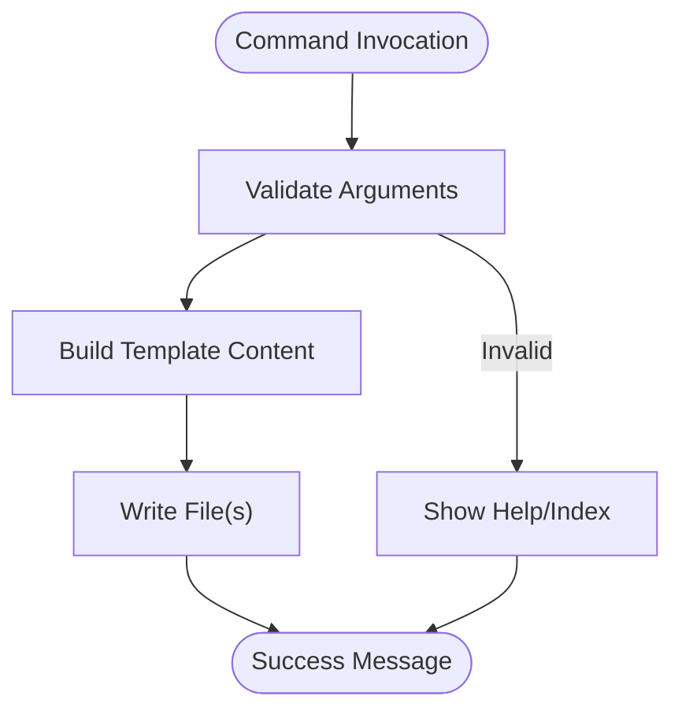
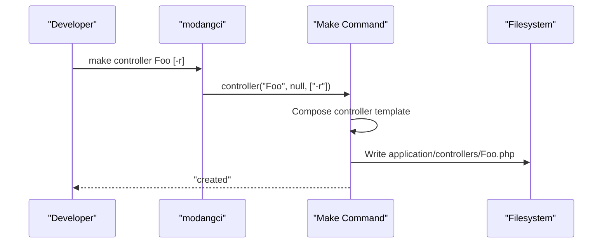
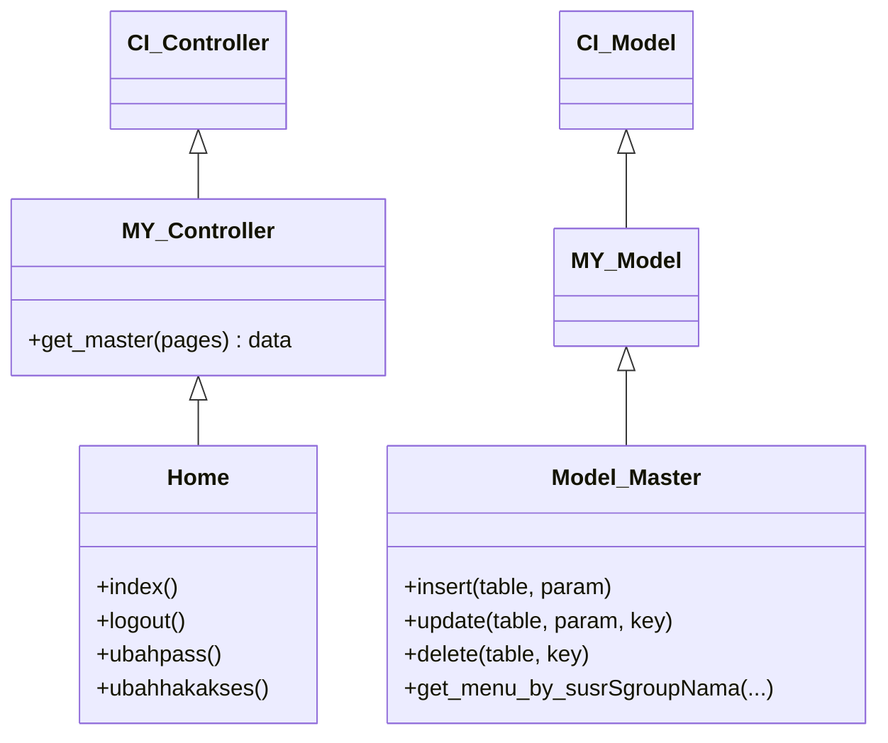
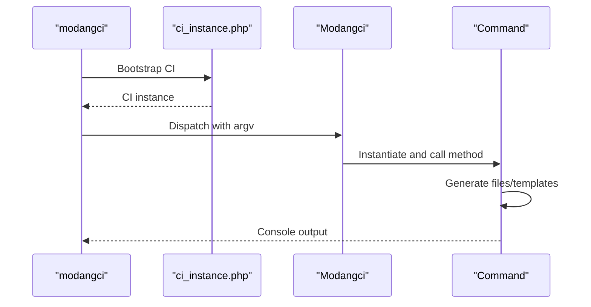
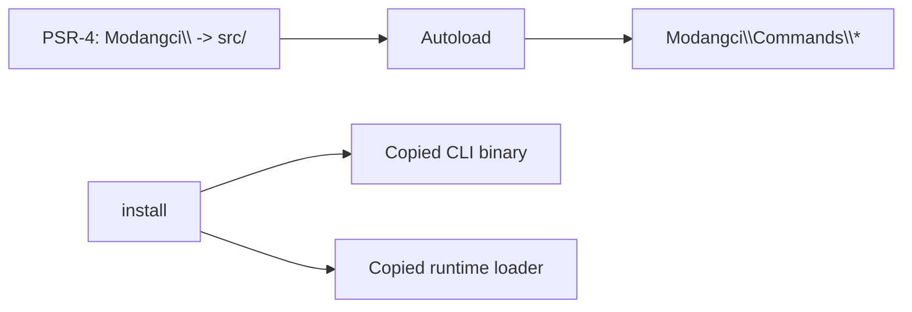
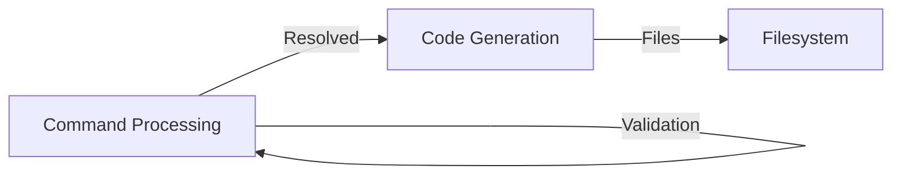
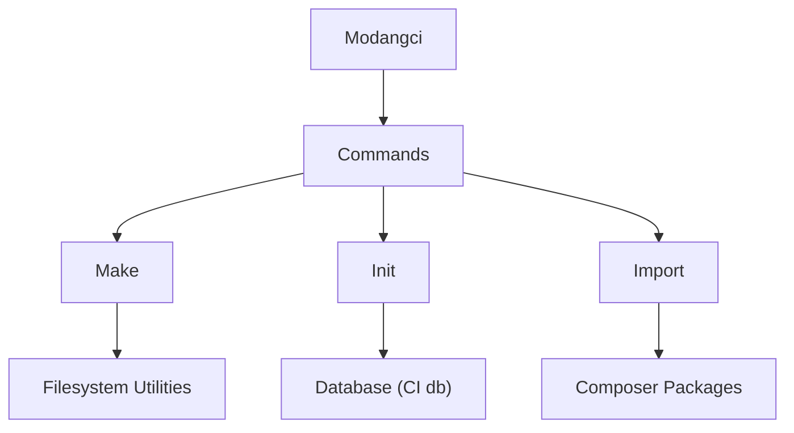

# Architecture and Design

<cite>
**Referenced Files in This Document**
- [Modangci.php](file://src/Modangci.php)
- [Commands.php](file://src/Commands.php)
- [Make.php](file://src/commands/Make.php)
- [Init.php](file://src/commands/Init.php)
- [Import.php](file://src/commands/Import.php)
- [ci_instance.php](file://ci_instance.php)
- [modangci](file://modangci)
- [install](file://install)
- [composer.json](file://composer.json)
- [MY_Controller.php](file://src/application/core/MY_Controller.php)
- [MY_Model.php](file://src/application/core/MY_Model.php)
- [Model_Master.php](file://src/application/core/Model_Master.php)
- [Home.php](file://src/application/controllers/Home.php)
- [Model_home.php](file://src/application/models/Model_home.php)
- [README.md](file://README.md)
</cite>

## Table of Contents
1. [Introduction](#introduction)
2. [Project Structure](#project-structure)
3. [Core Components](#core-components)
4. [Architecture Overview](#architecture-overview)
5. [Detailed Component Analysis](#detailed-component-analysis)
6. [Dependency Analysis](#dependency-analysis)
7. [Performance Considerations](#performance-considerations)
8. [Troubleshooting Guide](#troubleshooting-guide)
9. [Conclusion](#conclusion)
10. [Appendices](#appendices)

## Introduction
This document describes the architecture and design of the Modangci system, a CodeIgniter 3 CLI extension that generates and scaffolds application components. It focuses on:
- Command pattern implementation for CLI invocation
- Factory-style command routing and instantiation
- Template-based code generation for controllers, models, helpers, libraries, and views
- Integration with CodeIgniter’s MVC via base class extensions
- Separation of concerns between command processing and code generation
- System boundaries, data flow, and integration points with the host CodeIgniter application

## Project Structure
Modangci is packaged as a Composer package and installed into an existing CodeIgniter 3 project. The CLI entrypoint initializes a CodeIgniter runtime and delegates to the Modangci dispatcher.

**Diagram sources**
- [modangci:1-26](file://modangci#L1-L26)
- [ci_instance.php:1-87](file://ci_instance.php#L1-L87)
- [Modangci.php:1-60](file://src/Modangci.php#L1-L60)
- [Commands.php:1-135](file://src/Commands.php#L1-L135)
- [Make.php:1-211](file://src/commands/Make.php#L1-L211)
- [Init.php:1-917](file://src/commands/Init.php#L1-L917)
- [Import.php:1-53](file://src/commands/Import.php#L1-L53)
- [MY_Controller.php:1-59](file://src/application/core/MY_Controller.php#L1-L59)
- [MY_Model.php:1-21](file://src/application/core/MY_Model.php#L1-L21)
- [Model_Master.php:1-257](file://src/application/core/Model_Master.php#L1-L257)
- [Home.php:1-121](file://src/application/controllers/Home.php#L1-L121)
- [Model_home.php:1-9](file://src/application/models/Model_home.php#L1-L9)

**Section sources**
- [README.md:1-41](file://README.md#L1-L41)
- [composer.json:1-25](file://composer.json#L1-L25)
- [modangci:1-26](file://modangci#L1-L26)
- [ci_instance.php:1-87](file://ci_instance.php#L1-L87)

## Core Components
- Modangci dispatcher: Parses CLI arguments, validates environment, resolves command class/method, and invokes the appropriate handler.
- Base command class: Provides shared utilities for filesystem operations, messaging, and resource creation.
- Concrete command handlers:
  - Make: Generates boilerplate files for controllers, models, helpers, libraries, and CRUD sets.
  - Init: Scaffolds authentication, controllers, models, views, and assets based on database schema.
  - Import: Copies prebuilt components from the package into the host application.
- CodeIgniter integration: Uses a lightweight runtime loader to expose CI services to CLI commands.

Key responsibilities:
- CLI parsing and dispatching
- Template-based file generation
- Resource copying and scaffolding
- Access to CodeIgniter services (database, loader, helpers)

**Section sources**
- [Modangci.php:1-60](file://src/Modangci.php#L1-L60)
- [Commands.php:1-135](file://src/Commands.php#L1-L135)
- [Make.php:1-211](file://src/commands/Make.php#L1-L211)
- [Init.php:1-917](file://src/commands/Init.php#L1-L917)
- [Import.php:1-53](file://src/commands/Import.php#L1-L53)
- [ci_instance.php:1-87](file://ci_instance.php#L1-L87)

## Architecture Overview
Modangci adopts a command pattern with a central dispatcher and specialized command classes. The CLI entrypoint bootstraps CodeIgniter, then delegates to Modangci, which routes to the appropriate command class and method. Generation logic is encapsulated within each command class, leveraging shared utilities from the base command class.

**Diagram sources**
- [modangci:1-26](file://modangci#L1-L26)
- [ci_instance.php:1-87](file://ci_instance.php#L1-L87)
- [Modangci.php:1-60](file://src/Modangci.php#L1-L60)
- [Commands.php:1-135](file://src/Commands.php#L1-L135)
- [Make.php:1-211](file://src/commands/Make.php#L1-L211)
- [Init.php:1-917](file://src/commands/Init.php#L1-L917)
- [Import.php:1-53](file://src/commands/Import.php#L1-L53)

## Detailed Component Analysis

### Command Pattern Implementation
- Central dispatcher: Parses argv, enforces CLI context, constructs fully qualified command class name, and calls the resolved method with remaining arguments.
- Command resolution: Converts the first argument to a class name under the command namespace and the second to a method name.
- Dynamic invocation: Instantiates the command class with CI instance and resources, then calls the method with remaining positional arguments.

**Diagram sources**
- [Modangci.php:1-60](file://src/Modangci.php#L1-L60)
- [Commands.php:1-135](file://src/Commands.php#L1-L135)
- [Make.php:1-211](file://src/commands/Make.php#L1-L211)
- [Init.php:1-917](file://src/commands/Init.php#L1-L917)
- [Import.php:1-53](file://src/commands/Import.php#L1-L53)

**Section sources**
- [Modangci.php:10-53](file://src/Modangci.php#L10-L53)
- [Commands.php:14-97](file://src/Commands.php#L14-L97)

### Factory Methods for Component Generation
- Base command utilities:
  - Filesystem helpers: copy single file, recursive directory copy, safe folder creation, and file writing with existence checks.
  - Messaging: unified console output for user feedback.
- Concrete factories:
  - Make: Builds templates for controllers, models, helpers, libraries, and a full CRUD set.
  - Init: Reads schema metadata from information_schema, composes CRUD scaffolding, and writes files and assets.
  - Import: Copies prebuilt components from the package into the host application.

**Diagram sources**
- [Commands.php:20-97](file://src/Commands.php#L20-L97)
- [Make.php:54-70](file://src/commands/Make.php#L54-L70)
- [Init.php:480-640](file://src/commands/Init.php#L480-L640)
- [Import.php:14-51](file://src/commands/Import.php#L14-L51)

**Section sources**
- [Commands.php:20-97](file://src/Commands.php#L20-L97)
- [Make.php:16-210](file://src/commands/Make.php#L16-L210)
- [Init.php:110-123](file://src/commands/Init.php#L110-L123)
- [Import.php:14-51](file://src/commands/Import.php#L14-L51)

### Template-Based Code Generation Approach
- Controllers: Generated with optional model loading, basic CRUD actions, and optional response endpoint when requested.
- Models: Generated with configurable table and primary key, exposing all and by-id methods.
- Helpers and Libraries: Minimal templates with placeholders for developer customization.
- Views: Basic HTML shells or CRUD-ready structures depending on flags.
- Init scaffolding: Dynamically builds controllers/models/views based on database schema, including foreign-key-aware joins and form rendering logic.

**Diagram sources**
- [Make.php:16-73](file://src/commands/Make.php#L16-L73)

**Section sources**
- [Make.php:54-194](file://src/commands/Make.php#L54-L194)

### Relationship with CodeIgniter Framework
- Base class extensions:
  - MY_Controller: Adds layout and menu orchestration, session guard, and breadcrumb/data assembly.
  - MY_Model: Extends CI_Model and conditionally loads Model_Master.
  - Model_Master: Provides reusable CRUD operations and transaction wrappers.
- CLI integration:
  - ci_instance.php bootstraps CodeIgniter without a web request, exposing core classes and services.
  - Modangci receives a CI instance and uses it for database access, loading helpers, and filesystem operations.
- Host application usage:
  - Controllers like Home extend MY_Controller and use Model_Master-derived models.

**Diagram sources**
- [MY_Controller.php:1-59](file://src/application/core/MY_Controller.php#L1-L59)
- [MY_Model.php:1-21](file://src/application/core/MY_Model.php#L1-L21)
- [Model_Master.php:1-257](file://src/application/core/Model_Master.php#L1-L257)
- [Home.php:1-121](file://src/application/controllers/Home.php#L1-L121)

**Section sources**
- [ci_instance.php:1-87](file://ci_instance.php#L1-L87)
- [MY_Controller.php:1-59](file://src/application/core/MY_Controller.php#L1-L59)
- [MY_Model.php:1-21](file://src/application/core/MY_Model.php#L1-L21)
- [Model_Master.php:1-257](file://src/application/core/Model_Master.php#L1-L257)
- [Home.php:1-121](file://src/application/controllers/Home.php#L1-L121)
- [Model_home.php:1-9](file://src/application/models/Model_home.php#L1-L9)

### MVC Adaptation for CLI Operations
- CLI entrypoint: Initializes CodeIgniter runtime and passes the CI instance to Modangci.
- Command handlers: Use CI services (database, loader, helpers) to perform scaffolding and generation.
- Separation of concerns:
  - Modangci handles CLI parsing and dispatching.
  - Commands encapsulate generation logic and filesystem operations.
  - CodeIgniter base classes remain unchanged and are reused by generated components.

**Diagram sources**
- [modangci:1-26](file://modangci#L1-L26)
- [ci_instance.php:1-87](file://ci_instance.php#L1-L87)
- [Modangci.php:1-60](file://src/Modangci.php#L1-L60)
- [Commands.php:1-135](file://src/Commands.php#L1-L135)

**Section sources**
- [modangci:1-26](file://modangci#L1-L26)
- [ci_instance.php:1-87](file://ci_instance.php#L1-L87)
- [Modangci.php:10-53](file://src/Modangci.php#L10-L53)

### Plugin System for Extensibility
- PSR-4 autoloading: Composer autoload maps the Modangci namespace to src/.
- Installer: Copies CLI binary and runtime loader into the host project for easy invocation.
- Command extensibility: New commands can be added under src/commands/ with a dedicated class extending the base command class.

**Diagram sources**
- [composer.json:20-24](file://composer.json#L20-L24)
- [install:1-60](file://install#L1-L60)

**Section sources**
- [composer.json:1-25](file://composer.json#L1-L25)
- [install:1-60](file://install#L1-L60)

### Separation of Concerns Between Command Processing and Code Generation
- Command processing:
  - Argument parsing, validation, and dispatching.
  - Resource flag handling and class/method resolution.
- Code generation:
  - Template composition and file writing.
  - Schema-driven scaffolding and asset copying.

**Diagram sources**
- [Modangci.php:19-53](file://src/Modangci.php#L19-L53)
- [Commands.php:20-97](file://src/Commands.php#L20-L97)

**Section sources**
- [Modangci.php:19-53](file://src/Modangci.php#L19-L53)
- [Commands.php:20-97](file://src/Commands.php#L20-L97)

## Dependency Analysis
- Internal dependencies:
  - Modangci depends on the Commands base class and concrete command classes.
  - Concrete commands depend on shared filesystem and messaging utilities.
- External dependencies:
  - CodeIgniter framework classes loaded via ci_instance.php.
  - Optional Composer packages for imported libraries (e.g., PDF generator).
- Composer integration:
  - PSR-4 autoloading enables dynamic command discovery and loading.

**Diagram sources**
- [Modangci.php:1-60](file://src/Modangci.php#L1-L60)
- [Commands.php:1-135](file://src/Commands.php#L1-L135)
- [Make.php:1-211](file://src/commands/Make.php#L1-L211)
- [Init.php:1-917](file://src/commands/Init.php#L1-L917)
- [Import.php:1-53](file://src/commands/Import.php#L1-L53)
- [composer.json:1-25](file://composer.json#L1-L25)

**Section sources**
- [composer.json:1-25](file://composer.json#L1-L25)
- [Init.php:13-29](file://src/commands/Init.php#L13-L29)
- [Import.php:39-46](file://src/commands/Import.php#L39-L46)

## Performance Considerations
- Template composition: Keep templates concise and avoid heavy string concatenation; cache or reuse computed segments where feasible.
- Filesystem operations: Batch writes and minimize repeated checks; use recursive copy for bulk assets.
- Database reads: Limit information_schema queries to necessary tables and columns; cache schema metadata per run when possible.
- CLI overhead: Initialization cost is amortized; ensure early validation to fail fast.

## Troubleshooting Guide
- CLI context enforcement: The dispatcher checks for CLI requests and exits otherwise. Ensure the command is invoked via CLI.
- Argument validation: Non-alphabetic tokens are rejected unless whitelisted; confirm parameter formatting.
- Filesystem permissions: Creation and write operations depend on writable paths; verify APPPATH permissions.
- Composer dependencies: Imported libraries may require installing Composer packages; follow installer prompts.
- CodeIgniter bootstrap: Ensure ci_instance.php is present and paths align with the host project structure.

**Section sources**
- [Modangci.php:13-17](file://src/Modangci.php#L13-L17)
- [Modangci.php:24-32](file://src/Modangci.php#L24-L32)
- [Commands.php:59-97](file://src/Commands.php#L59-L97)
- [Import.php:39-46](file://src/commands/Import.php#L39-L46)
- [ci_instance.php:1-87](file://ci_instance.php#L1-L87)

## Conclusion
Modangci integrates seamlessly with CodeIgniter 3 by initializing a runtime and leveraging base classes for consistent behavior. Its command pattern design cleanly separates CLI processing from generation logic, while template-based scaffolding accelerates development. The system’s extensibility through Composer autoloading and a base command class allows future enhancements without disrupting core functionality.

## Appendices
- Installation and usage steps are documented in the project’s README, including Composer installation, initial setup, and command lists.

**Section sources**
- [README.md:7-41](file://README.md#L7-L41)