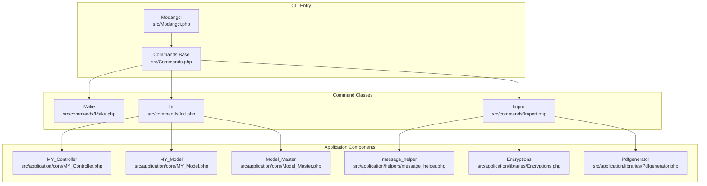
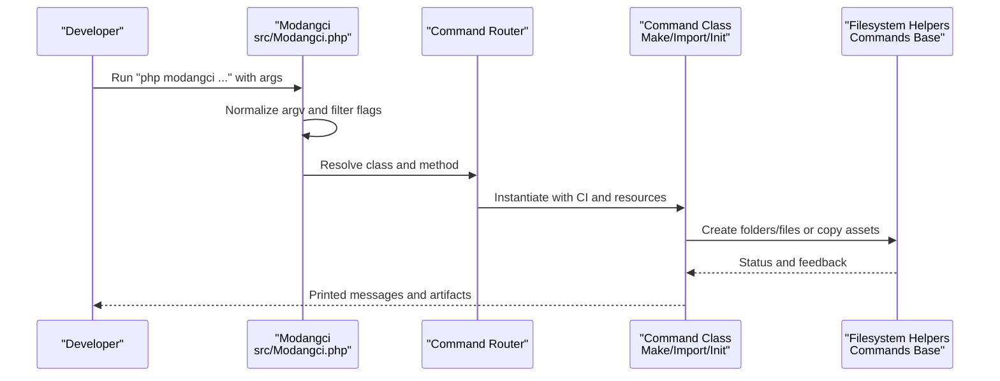
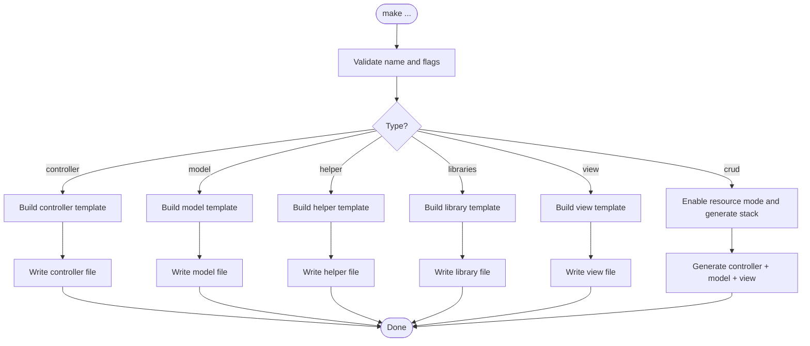
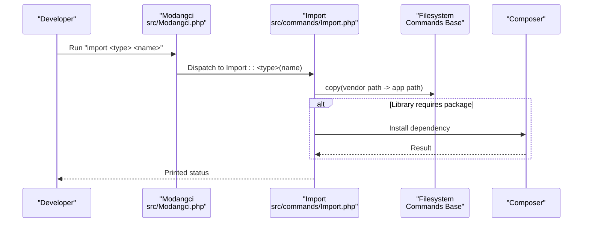
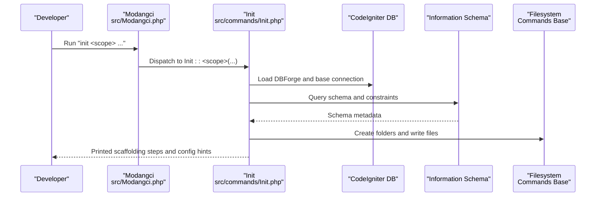
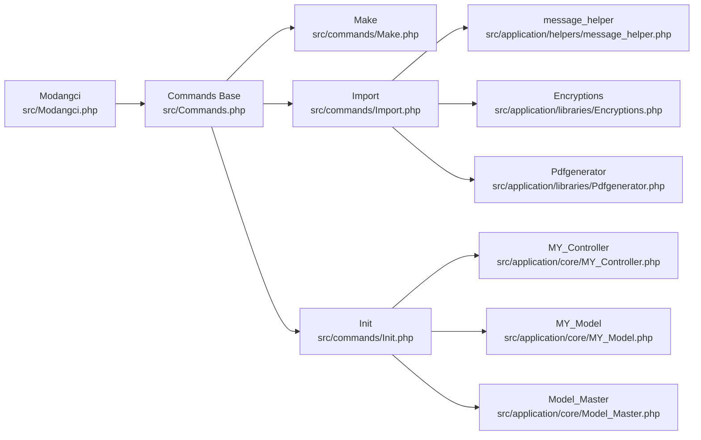

# Core Features and Capabilities

<cite>
**Referenced Files in This Document**
- [README.md](file://README.md)
- [src/Modangci.php](file://src/Modangci.php)
- [src/Commands.php](file://src/Commands.php)
- [src/commands/Make.php](file://src/commands/Make.php)
- [src/commands/Import.php](file://src/commands/Import.php)
- [src/commands/Init.php](file://src/commands/Init.php)
- [src/application/core/MY_Controller.php](file://src/application/core/MY_Controller.php)
- [src/application/core/MY_Model.php](file://src/application/core/MY_Model.php)
- [src/application/core/Model_Master.php](file://src/application/core/Model_Master.php)
- [src/application/helpers/message_helper.php](file://src/application/helpers/message_helper.php)
- [src/application/libraries/Encryptions.php](file://src/application/libraries/Encryptions.php)
- [src/application/libraries/Pdfgenerator.php](file://src/application/libraries/Pdfgenerator.php)
- [install](file://install)
</cite>

## Table of Contents
1. [Introduction](#introduction)
2. [Project Structure](#project-structure)
3. [Core Components](#core-components)
4. [Architecture Overview](#architecture-overview)
5. [Detailed Component Analysis](#detailed-component-analysis)
6. [Dependency Analysis](#dependency-analysis)
7. [Performance Considerations](#performance-considerations)
8. [Troubleshooting Guide](#troubleshooting-guide)
9. [Conclusion](#conclusion)
10. [Appendices](#appendices)

## Introduction
This document explains the Modangci core features that streamline CodeIgniter 3 development through three command categories: Make, Import, and Init. These commands work together to accelerate scaffolding, component generation, and project setup:
- Make: Generates individual components (controllers, models, views, helpers, libraries) and quick CRUD stacks.
- Import: Adds reusable pre-built components (helpers, libraries, and model bases) into your application.
- Init: Performs full project scaffolding, including authentication scaffolding, database-driven CRUD generation, and asset provisioning.

The goal is to help developers quickly build maintainable applications by reducing boilerplate and enforcing consistent patterns.

## Project Structure
Modangci organizes its CLI logic under a namespace and delegates to specialized command classes. It also ships with a set of reusable application components (core, helpers, libraries, and views) that can be imported or scaffolded.

**Diagram sources**
- [src/Modangci.php:1-60](file://src/Modangci.php#L1-L60)
- [src/Commands.php:1-135](file://src/Commands.php#L1-L135)
- [src/commands/Make.php:1-211](file://src/commands/Make.php#L1-L211)
- [src/commands/Import.php:1-53](file://src/commands/Import.php#L1-L53)
- [src/commands/Init.php:1-917](file://src/commands/Init.php#L1-L917)
- [src/application/core/MY_Controller.php:1-59](file://src/application/core/MY_Controller.php#L1-L59)
- [src/application/core/MY_Model.php:1-21](file://src/application/core/MY_Model.php#L1-L21)
- [src/application/core/Model_Master.php:1-257](file://src/application/core/Model_Master.php#L1-L257)
- [src/application/helpers/message_helper.php:1-22](file://src/application/helpers/message_helper.php#L1-L22)
- [src/application/libraries/Encryptions.php:1-56](file://src/application/libraries/Encryptions.php#L1-L56)
- [src/application/libraries/Pdfgenerator.php:1-17](file://src/application/libraries/Pdfgenerator.php#L1-L17)

**Section sources**
- [README.md:1-41](file://README.md#L1-L41)
- [src/Modangci.php:1-60](file://src/Modangci.php#L1-L60)
- [src/Commands.php:1-135](file://src/Commands.php#L1-L135)

## Core Components
- Modangci CLI dispatcher: Parses arguments, validates parameters, and routes to the appropriate command class and method.
- Commands base: Provides shared utilities for copying files/folders, creating folders and files, and printing messages.
- Make: Generates controllers, models, views, helpers, libraries, and a full CRUD stack with optional resource flag.
- Import: Copies pre-built components from vendor assets into your application.
- Init: Creates authentication scaffolding, generates CRUD components from database schema, and provisions assets.

These components collaborate to offer a cohesive developer experience from initial project setup to rapid feature development.

**Section sources**
- [src/Modangci.php:19-53](file://src/Modangci.php#L19-L53)
- [src/Commands.php:20-97](file://src/Commands.php#L20-L97)
- [src/commands/Make.php:16-211](file://src/commands/Make.php#L16-L211)
- [src/commands/Import.php:14-53](file://src/commands/Import.php#L14-L53)
- [src/commands/Init.php:125-478](file://src/commands/Init.php#L125-L478)

## Architecture Overview
The CLI architecture follows a simple routing pattern:
- The CLI entry parses argv, normalizes parameters, and whitelists special flags.
- It constructs the target command class name and invokes the requested method with remaining arguments.
- Each command class extends the base Commands class and uses shared helpers for filesystem operations.

**Diagram sources**
- [src/Modangci.php:19-53](file://src/Modangci.php#L19-L53)
- [src/Commands.php:20-97](file://src/Commands.php#L20-L97)

**Section sources**
- [src/Modangci.php:19-53](file://src/Modangci.php#L19-L53)
- [src/Commands.php:20-97](file://src/Commands.php#L20-L97)

## Detailed Component Analysis

### Make: Component Generation
Purpose:
- Quickly scaffold MVC components and a full CRUD stack with minimal effort.

Capabilities:
- Controller: Create a controller with optional inheritance and optional resource actions via a flag.
- Model: Create a model with optional table and primary key, generating convenience methods.
- Helper: Create a helper with a guarded function declaration.
- Libraries: Create a library class with optional CodeIgniter instance access.
- View: Create a simple HTML view stub, optionally populated with sample data.
- CRUD: Generate a complete stack (controller, model, view) with optional resource actions.

Processing logic:
- Validates name presence and sets internal metadata.
- Builds templates with placeholders for class names, inheritance, and optional logic.
- Writes files to the appropriate application directories and prints status.

**Diagram sources**
- [src/commands/Make.php:16-211](file://src/commands/Make.php#L16-L211)

**Section sources**
- [src/commands/Make.php:16-211](file://src/commands/Make.php#L16-L211)
- [README.md:15-22](file://README.md#L15-L22)

### Import: Adding Pre-built Components
Purpose:
- Bring reusable components (helpers, libraries, and model bases) into your application with a single command.

Capabilities:
- Import model base: Adds foundational model classes.
- Import helpers: Adds commonly used helpers (e.g., message, date formatting).
- Import libraries: Adds libraries (e.g., encryption, PDF generator), optionally installing Composer dependencies when required.

Processing logic:
- Validates name presence and sets internal metadata.
- Copies vendor assets to the application directory.
- For libraries requiring external packages, triggers Composer installation.

**Diagram sources**
- [src/commands/Import.php:14-53](file://src/commands/Import.php#L14-L53)
- [src/Commands.php:20-57](file://src/Commands.php#L20-L57)

**Section sources**
- [src/commands/Import.php:14-53](file://src/commands/Import.php#L14-L53)
- [README.md:23-34](file://README.md#L23-L34)

### Init: Complete Project Scaffolding
Purpose:
- Accelerate project setup by generating authentication scaffolding, database-driven CRUD, and assets.

Capabilities:
- Authentication scaffolding: Creates tables, seeds default roles and users, and copies controllers, models, views, and assets.
- Controller scaffolding: Generates a full controller from a database table, including index/create/update/save/delete actions, form validation, and foreign key-aware rendering.
- Model scaffolding: Generates a model with convenience methods and joins based on foreign keys.
- View scaffolding: Generates index and form views tailored to the table schema.
- CRUD scaffolding: Orchestrates controller, model, and view generation from a table.

Processing logic:
- Connects to the information schema to introspect tables and constraints.
- Uses templates to generate controllers, models, and views.
- Copies assets and prints configuration steps for autoloading and base URL.

**Diagram sources**
- [src/commands/Init.php:15-29](file://src/commands/Init.php#L15-L29)
- [src/commands/Init.php:57-108](file://src/commands/Init.php#L57-L108)
- [src/commands/Init.php:480-640](file://src/commands/Init.php#L480-L640)
- [src/Commands.php:20-97](file://src/Commands.php#L20-L97)

**Section sources**
- [src/commands/Init.php:125-478](file://src/commands/Init.php#L125-L478)
- [src/commands/Init.php:480-701](file://src/commands/Init.php#L480-L701)
- [README.md:35-41](file://README.md#L35-L41)

### Practical Workflows and How They Complement Each Other
Typical development scenarios:
- New project setup:
  - Use Init auth to scaffold authentication tables, controllers, models, views, and assets.
  - Follow printed instructions to configure autoload and base URL.
- Rapid CRUD feature:
  - Use Init controller/model/view with a table to generate a full CRUD stack.
  - Iterate on views and adjust validation rules as needed.
- Component reuse:
  - Use Import to bring in helpers and libraries (e.g., message, encryptions, PDF generator).
  - Use Import model master to standardize model behavior across the app.
- Individual component creation:
  - Use Make controller/model/helper/libraries/view for quick prototypes or small features.
  - Use Make crud to bootstrap a new domain entity with full actions.

These workflows complement each other by progressing from project scaffolding to component-level generation and finally to reusable component imports.

**Section sources**
- [src/commands/Init.php:125-478](file://src/commands/Init.php#L125-L478)
- [src/commands/Init.php:480-701](file://src/commands/Init.php#L480-L701)
- [src/commands/Import.php:14-53](file://src/commands/Import.php#L14-L53)
- [src/commands/Make.php:16-211](file://src/commands/Make.php#L16-L211)

## Dependency Analysis
Modangci’s command classes depend on:
- The base Commands class for filesystem operations and messaging.
- CodeIgniter’s core classes (e.g., DBForge, Encryption, Output) for Init scaffolding and runtime helpers.
- Vendor-provided assets for importing and scaffolding.

**Diagram sources**
- [src/Modangci.php:1-60](file://src/Modangci.php#L1-L60)
- [src/Commands.php:1-135](file://src/Commands.php#L1-L135)
- [src/commands/Make.php:1-211](file://src/commands/Make.php#L1-L211)
- [src/commands/Import.php:1-53](file://src/commands/Import.php#L1-L53)
- [src/commands/Init.php:1-917](file://src/commands/Init.php#L1-L917)
- [src/application/core/MY_Controller.php:1-59](file://src/application/core/MY_Controller.php#L1-L59)
- [src/application/core/MY_Model.php:1-21](file://src/application/core/MY_Model.php#L1-L21)
- [src/application/core/Model_Master.php:1-257](file://src/application/core/Model_Master.php#L1-L257)
- [src/application/helpers/message_helper.php:1-22](file://src/application/helpers/message_helper.php#L1-L22)
- [src/application/libraries/Encryptions.php:1-56](file://src/application/libraries/Encryptions.php#L1-L56)
- [src/application/libraries/Pdfgenerator.php:1-17](file://src/application/libraries/Pdfgenerator.php#L1-L17)

**Section sources**
- [src/Modangci.php:19-53](file://src/Modangci.php#L19-L53)
- [src/Commands.php:20-97](file://src/Commands.php#L20-L97)

## Performance Considerations
- Filesystem operations: Copying assets and writing files can be I/O bound. Batch operations (e.g., recursiveCopy) minimize repeated system calls.
- Database introspection: Init queries information schema to derive schema and constraints. Keep database connections efficient and avoid unnecessary repeated queries.
- Template generation: String concatenation builds controller/model/view templates. For very large schemas, consider incremental generation and caching where appropriate.
- Composer dependency installation: When importing libraries requiring external packages, ensure network availability and Composer cache optimization.

## Troubleshooting Guide
Common issues and resolutions:
- Command not found:
  - Ensure the command class and method exist. The CLI falls back to listing available commands if the method does not exist.
- Permission errors when writing files/folders:
  - Verify that the application path is writable and that the process has sufficient permissions.
- Missing vendor assets during import:
  - Confirm that the vendor path exists and the requested asset is present.
- Database connectivity during Init:
  - Ensure the database configuration is correct and the information schema is accessible.
- Composer dependency failures:
  - Check network connectivity and Composer cache. Some libraries require explicit Composer installation.

**Section sources**
- [src/Modangci.php:49-53](file://src/Modangci.php#L49-L53)
- [src/Commands.php:59-97](file://src/Commands.php#L59-L97)
- [src/commands/Import.php:37-47](file://src/commands/Import.php#L37-L47)
- [src/commands/Init.php:13-29](file://src/commands/Init.php#L13-L29)

## Conclusion
Modangci’s Make, Import, and Init commands provide a cohesive toolkit for CodeIgniter 3 development:
- Make accelerates component creation with flexible templates.
- Import streamlines reuse by adding proven helpers, libraries, and model bases.
- Init delivers end-to-end scaffolding, from authentication to database-driven CRUD.

Together, they reduce boilerplate, enforce consistent patterns, and speed up delivery across the entire development lifecycle.

## Appendices

### Appendix A: CLI Invocation and Setup
- Installation and initial setup:
  - Create a CodeIgniter project, require Modangci, run the installer, and then use the CLI to generate components.
- Running commands:
  - Use the CLI entry script to invoke Make, Import, and Init with appropriate arguments and flags.

**Section sources**
- [README.md:7-14](file://README.md#L7-L14)
- [install:15-26](file://install#L15-L26)

### Appendix B: Application Core and Helpers Used by Init
- MY_Controller: Provides session checks and page composition helpers.
- MY_Model and Model_Master: Centralize database operations and menu/permission logic.
- message_helper: Standardized JSON response for AJAX operations.
- Encryptions: Safe encoding/decoding utilities for URIs and keys.
- Pdfgenerator: PDF generation wrapper using Dompdf.

**Section sources**
- [src/application/core/MY_Controller.php:1-59](file://src/application/core/MY_Controller.php#L1-L59)
- [src/application/core/MY_Model.php:1-21](file://src/application/core/MY_Model.php#L1-L21)
- [src/application/core/Model_Master.php:1-257](file://src/application/core/Model_Master.php#L1-L257)
- [src/application/helpers/message_helper.php:1-22](file://src/application/helpers/message_helper.php#L1-L22)
- [src/application/libraries/Encryptions.php:1-56](file://src/application/libraries/Encryptions.php#L1-L56)
- [src/application/libraries/Pdfgenerator.php:1-17](file://src/application/libraries/Pdfgenerator.php#L1-L17)