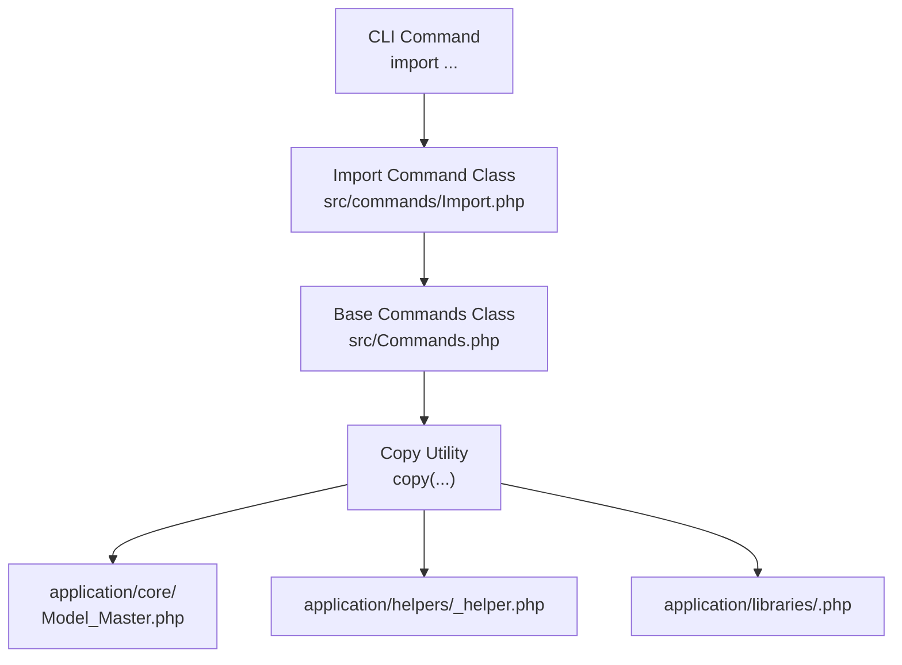
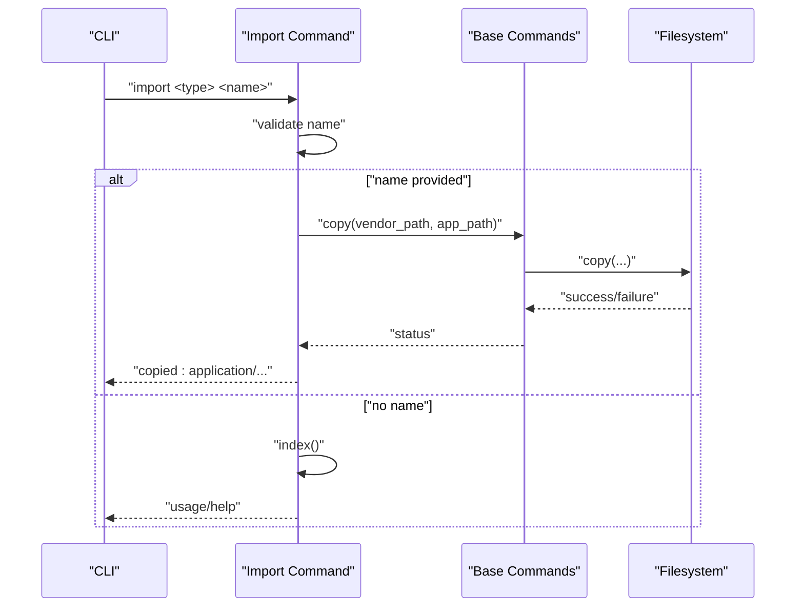
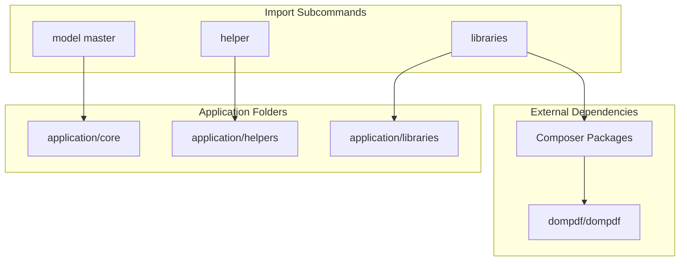

# Import Commands

<cite>
**Referenced Files in This Document**
- [Import.php](file://src/commands/Import.php)
- [Commands.php](file://src/Commands.php)
- [README.md](file://README.md)
- [Model_Master.php](file://src/application/core/Model_Master.php)
- [MY_Model.php](file://src/application/core/MY_Model.php)
- [datetoindo_helper.php](file://src/application/helpers/datetoindo_helper.php)
- [daystoindo_helper.php](file://src/application/helpers/daystoindo_helper.php)
- [debuglog_helper.php](file://src/application/helpers/debuglog_helper.php)
- [generatepassword_helper.php](file://src/application/helpers/generatepassword_helper.php)
- [message_helper.php](file://src/application/helpers/message_helper.php)
- [monthtoindo_helper.php](file://src/application/helpers/monthtoindo_helper.php)
- [terbilang_helper.php](file://src/application/helpers/terbilang_helper.php)
- [Pdfgenerator.php](file://src/application/libraries/Pdfgenerator.php)
- [Encryptions.php](file://src/application/libraries/Encryptions.php)
</cite>

## Table of Contents
1. [Introduction](#introduction)
2. [Project Structure](#project-structure)
3. [Core Components](#core-components)
4. [Architecture Overview](#architecture-overview)
5. [Detailed Component Analysis](#detailed-component-analysis)
6. [Dependency Analysis](#dependency-analysis)
7. [Performance Considerations](#performance-considerations)
8. [Troubleshooting Guide](#troubleshooting-guide)
9. [Conclusion](#conclusion)

## Introduction
This document explains the Import commands functionality for bringing pre-built components into an existing CodeIgniter project. It covers the import subcommands for:
- Model master import
- Helper imports (date formatting, password generation, message handling, and others)
- Library imports (PDF generator, encryption)

It details the command syntax, parameters, options, and how these imports integrate with the project’s application structure. Practical examples and best practices are included to help you adopt these components effectively while understanding limitations and compatibility requirements.

## Project Structure
The Import commands operate by copying pre-packaged components from the vendor directory into your CodeIgniter application’s standard folders:
- application/core for models
- application/helpers for helper functions
- application/libraries for third-party or custom libraries

**Diagram sources**
- [Import.php:14-51](file://src/commands/Import.php#L14-L51)
- [Commands.php:20-29](file://src/Commands.php#L20-L29)

**Section sources**
- [Import.php:14-51](file://src/commands/Import.php#L14-L51)
- [Commands.php:20-29](file://src/Commands.php#L20-L29)

## Core Components
The Import command class exposes three primary subcommands:
- import model master
- import helper <helper_name>
- import libraries <library_name>

Each subcommand resolves the target component and copies it into the appropriate application directory. Some library imports also trigger Composer installation for dependencies.

Key behaviors:
- If no component name is provided, the subcommand prints the available options and usage.
- Helper and library imports accept a single argument specifying the component name.
- Model imports accept an optional model name; if omitted, the master model is imported.

Command summary:
- import model master
- import helper datetoindo
- import helper daystoindo
- import helper debuglog
- import helper generatepassword
- import helper message
- import helper monthtoindo
- import helper terbilang
- import libraries pdfgenerator
- import libraries encryptions

**Section sources**
- [Commands.php:111-121](file://src/Commands.php#L111-L121)
- [README.md:23-33](file://README.md#L23-L33)
- [Import.php:14-51](file://src/commands/Import.php#L14-L51)

## Architecture Overview
The import workflow follows a predictable flow: CLI invocation → command routing → resource resolution → copy operation → optional dependency installation.

**Diagram sources**
- [Import.php:14-51](file://src/commands/Import.php#L14-L51)
- [Commands.php:20-29](file://src/Commands.php#L20-L29)

## Detailed Component Analysis

### Model Master Import
Purpose:
- Adds a reusable base model that centralizes common database operations and logging.

Behavior:
- Copies MY_Model and Model_Master into application/core.
- Invoked via import model master.

Integration:
- Model_Master extends MY_Model, which itself extends CodeIgniter’s model base.
- After import, your application models can extend Model_Master to inherit shared methods.

Available methods (selected):
- Retrieval: get_by_id, get_by_last_id, get_ref_table
- Insert/update/delete: insert, insert_batch, replace, update, update_batch, delete, delete_truncate
- Menu and authentication helpers: get_menu_by_susrSgroupNama, get_menu_non_login, otentifikasi_menu_by_susrSgroupNama, otentifikasi_menu_by_susrNama

Usage example:
- Run import model master to bring the base model into your project.

Best practices:
- Ensure MY_Model exists or is copied alongside Model_Master.
- Extend your domain models from Model_Master to reuse standardized CRUD and logging.

**Section sources**
- [Import.php:14-24](file://src/commands/Import.php#L14-L24)
- [Model_Master.php:1-257](file://src/application/core/Model_Master.php#L1-L257)
- [MY_Model.php](file://src/application/core/MY_Model.php)

### Helper Imports
Overview:
- Helpers are small, focused functions grouped under application/helpers.
- The import command supports multiple helpers, each providing a specific utility.

Supported helpers and their purpose:
- datetoindo: converts date strings to Indonesian format (e.g., "01 Januari 2025")
- daystoindo: converts numeric day-of-week to Indonesian name (e.g., "1" → "Senin")
- debuglog: logs queries and contextual info to a file
- generatepassword: generates a random numeric password of configurable length
- message: formats and outputs JSON-formatted alerts/messages
- monthtoindo: converts numeric month to Indonesian name (e.g., "01" → "Januari")
- terbilang: converts numbers to Indonesian words (e.g., "123" → "seratus dua puluh tiga")

Usage examples:
- import helper datetoindo
- import helper daystoindo
- import helper debuglog
- import helper generatepassword
- import helper message
- import helper monthtoindo
- import helper terbilang

Integration:
- After import, load the helper in controllers or models as needed.
- Functions are guarded by existence checks to avoid redeclaration errors.

Notes:
- Some helpers rely on CodeIgniter’s singleton instance and session data.
- Ensure proper file permissions so CodeIgniter can autoload helpers.

**Section sources**
- [Import.php:26-35](file://src/commands/Import.php#L26-L35)
- [datetoindo_helper.php:1-23](file://src/application/helpers/datetoindo_helper.php#L1-L23)
- [daystoindo_helper.php:1-23](file://src/application/helpers/daystoindo_helper.php#L1-L23)
- [debuglog_helper.php:1-34](file://src/application/helpers/debuglog_helper.php#L1-L34)
- [generatepassword_helper.php:1-26](file://src/application/helpers/generatepassword_helper.php#L1-L26)
- [message_helper.php:1-22](file://src/application/helpers/message_helper.php#L1-L22)
- [monthtoindo_helper.php:1-28](file://src/application/helpers/monthtoindo_helper.php#L1-L28)
- [terbilang_helper.php:1-107](file://src/application/helpers/terbilang_helper.php#L1-L107)

### Library Imports
Overview:
- Libraries encapsulate reusable functionality under application/libraries.
- Some libraries require external dependencies managed via Composer.

Supported libraries:
- pdfgenerator: generates PDFs from HTML using Dompdf
- encryptions: AES-256-CBC encryption/decryption with base64-safe encoding

Usage examples:
- import libraries pdfgenerator
- import libraries encryptions

Integration:
- pdfgenerator depends on dompdf/dompdf; importing triggers a Composer require.
- encryptions initializes CodeIgniter’s encryption library with AES-256-CBC.

Compatibility and prerequisites:
- pdfgenerator requires Composer to install dompdf/dompdf automatically during import.
- encryptions relies on CodeIgniter’s encryption library and a consistent cipher mode/key configuration.

**Section sources**
- [Import.php:37-51](file://src/commands/Import.php#L37-L51)
- [Pdfgenerator.php:1-17](file://src/application/libraries/Pdfgenerator.php#L1-L17)
- [Encryptions.php:1-56](file://src/application/libraries/Encryptions.php#L1-L56)

## Dependency Analysis
Relationships between import commands and components:

**Diagram sources**
- [Import.php:14-51](file://src/commands/Import.php#L14-L51)
- [Pdfgenerator.php:1-17](file://src/application/libraries/Pdfgenerator.php#L1-L17)

**Section sources**
- [Import.php:37-51](file://src/commands/Import.php#L37-L51)

## Performance Considerations
- Helper functions are lightweight and suitable for frequent use; ensure minimal computation inside hot paths.
- PDF generation can be memory-intensive; configure PHP memory limits appropriately and stream outputs when possible.
- Encryption operations add CPU overhead; batch operations and cache decrypted values where feasible.
- Logging helpers should write to rotating files to prevent disk growth.

[No sources needed since this section provides general guidance]

## Troubleshooting Guide
Common issues and resolutions:
- File not found during import:
  - The import checks for the vendor source file before copying. If missing, the command reports the missing path. Verify the vendor path and package installation.
- Permission denied:
  - Ensure the web server or CLI user has write permissions to application/core, application/helpers, and application/libraries.
- Composer dependency failures:
  - For libraries requiring external packages (e.g., dompdf/dompdf), ensure Composer is installed and accessible. Re-run the import after resolving Composer errors.
- Helper function conflicts:
  - Helpers guard against redeclaration using existence checks. If a function name conflict occurs, rename the helper or adjust autoloading order.
- Encryption initialization:
  - Encryptions library initializes CodeIgniter’s encryption driver. Confirm the encryption configuration and cipher mode match across environments.

**Section sources**
- [Commands.php:20-29](file://src/Commands.php#L20-L29)
- [Import.php:37-51](file://src/commands/Import.php#L37-L51)

## Conclusion
The Import commands streamline adding proven components—models, helpers, and libraries—to your CodeIgniter project. By following the documented syntax and best practices, you can quickly integrate standardized functionality while maintaining compatibility and performance. Always verify permissions, external dependencies, and configuration to ensure smooth operation.