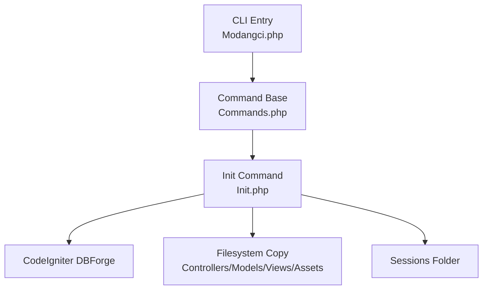
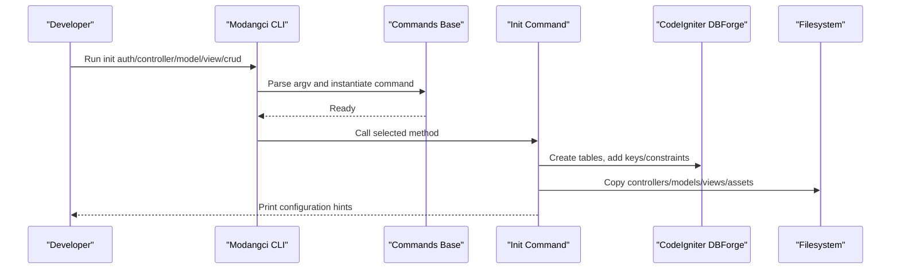
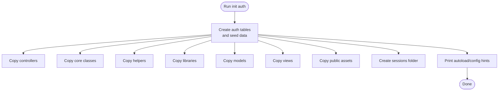
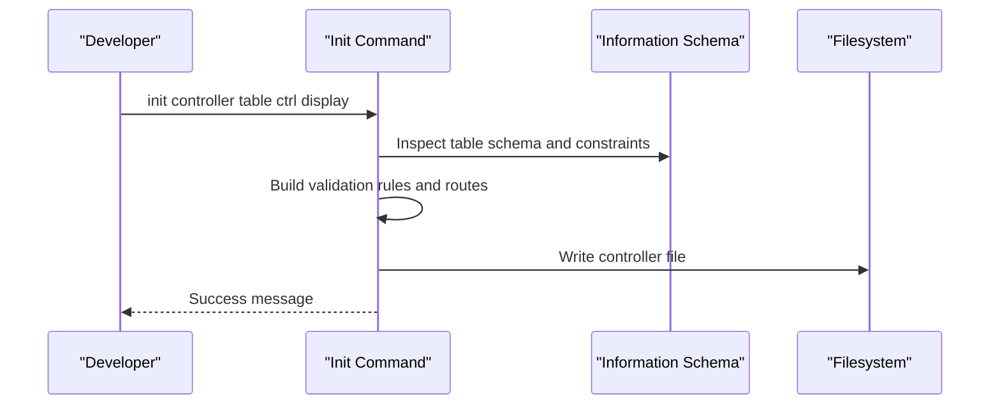
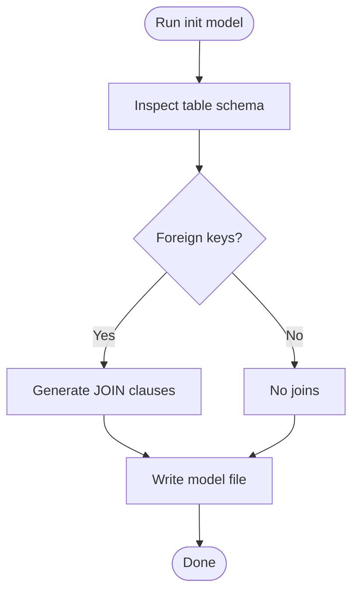
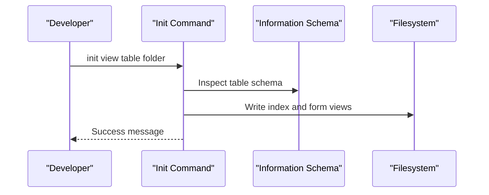
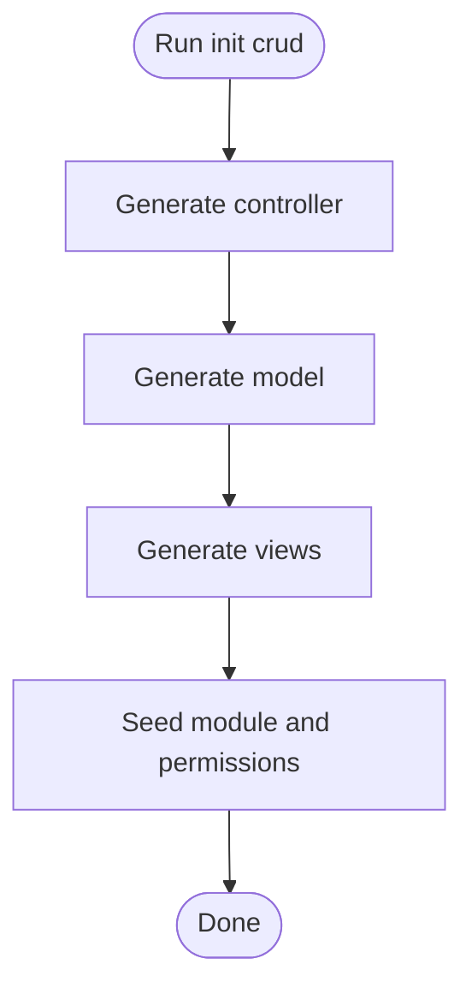
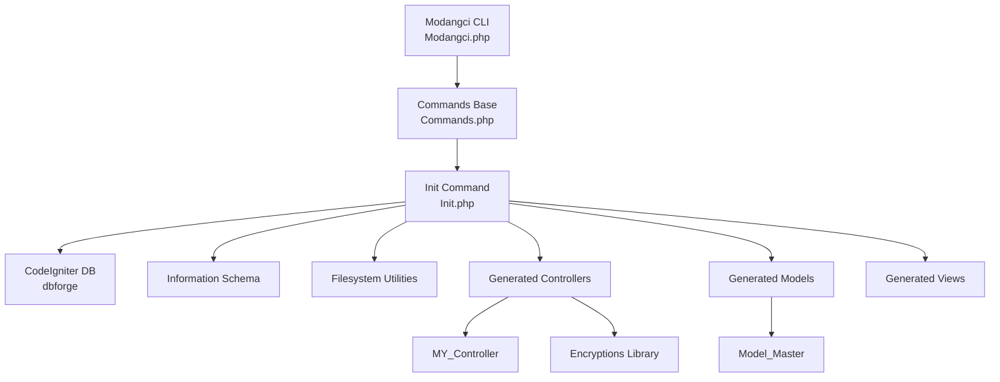

# Init Commands

<cite>
**Referenced Files in This Document**
- [Init.php](file://src/commands/Init.php)
- [Commands.php](file://src/Commands.php)
- [Modangci.php](file://src/Modangci.php)
- [ci_instance.php](file://ci_instance.php)
- [README.md](file://README.md)
- [install](file://install)
- [MY_Controller.php](file://src/application/core/MY_Controller.php)
- [Model_Master.php](file://src/application/core/Model_Master.php)
- [Encryptions.php](file://src/application/libraries/Encryptions.php)
- [Login.php](file://src/application/controllers/Login.php)
- [Otentifikasi.php](file://src/application/controllers/Otentifikasi.php)
</cite>

## Table of Contents
1. [Introduction](#introduction)
2. [Project Structure](#project-structure)
3. [Core Components](#core-components)
4. [Architecture Overview](#architecture-overview)
5. [Detailed Component Analysis](#detailed-component-analysis)
6. [Dependency Analysis](#dependency-analysis)
7. [Performance Considerations](#performance-considerations)
8. [Troubleshooting Guide](#troubleshooting-guide)
9. [Conclusion](#conclusion)

## Introduction
This document explains the Init commands that transform a basic CodeIgniter project into a fully functional application with authentication scaffolding, database table creation, and UI template integration. It covers all init subcommands, their syntax, parameters, and configuration options, along with prerequisites, database requirements, and post-initialization customization steps.

## Project Structure
The Init command set resides under the Modangci CLI package and orchestrates:
- Database table creation via CodeIgniter’s dbforge
- Controller, model, and view generation for CRUD scaffolding
- UI template and assets copying
- Session storage preparation
- Authentication-related configuration hints

**Diagram sources**
- [Modangci.php:10-41](file://src/Modangci.php#L10-L41)
- [Commands.php:14-18](file://src/Commands.php#L14-L18)
- [Init.php:10-29](file://src/commands/Init.php#L10-L29)

**Section sources**
- [README.md:35-40](file://README.md#L35-L40)
- [Modangci.php:36-41](file://src/Modangci.php#L36-L41)
- [Commands.php:125-131](file://src/Commands.php#L125-L131)

## Core Components
- Init command class: Provides subcommands for authentication scaffolding, controller/model/view generation, and CRUD scaffolding.
- Command base class: Supplies filesystem copy, recursive copy, folder creation, file creation, and messaging utilities.
- CLI entrypoint: Parses arguments and dispatches to the appropriate command and method.

Key capabilities:
- Authentication system setup with role-based access control tables and seed data
- Controller scaffolding from a database table with validation and encryption-aware routing
- Model scaffolding with joins for foreign keys
- View scaffolding with index and form templates, including select rendering for foreign keys
- CRUD scaffolding that wires controller, model, and view together and registers module permissions

**Section sources**
- [Init.php:125-478](file://src/commands/Init.php#L125-L478)
- [Init.php:480-701](file://src/commands/Init.php#L480-L701)
- [Init.php:703-916](file://src/commands/Init.php#L703-L916)
- [Commands.php:20-97](file://src/Commands.php#L20-L97)
- [Modangci.php:36-53](file://src/Modangci.php#L36-L53)

## Architecture Overview
The Init command architecture integrates with CodeIgniter’s database and filesystem layers to generate application artifacts and configure authentication.

**Diagram sources**
- [Modangci.php:36-53](file://src/Modangci.php#L36-L53)
- [Init.php:125-478](file://src/commands/Init.php#L125-L478)
- [Init.php:480-701](file://src/commands/Init.php#L480-L701)
- [Init.php:703-916](file://src/commands/Init.php#L703-L916)

## Detailed Component Analysis

### Authentication System Setup (init auth)
Purpose:
- Create authentication and authorization tables
- Seed default groups, units, modules, and a default admin user
- Copy UI templates and assets
- Provide configuration hints for autoloading and session storage

Tables created:
- s_user_group: User group definitions
- s_unit: Units/organizational units
- s_user_modul_group_ref: Module groups (e.g., admin, temporary)
- s_user_modul_ref: Available modules with display names and ordering
- s_user_group_modul: Permissions linking groups to modules
- s_user_group_unit: Unit assignments per group
- s_user: Users with credentials and group linkage

Generated assets:
- Controllers: Home, Login, Otentifikasi, and role-based controllers
- Core classes: MY_Controller, MY_Model, Model_Master
- Helpers: message, generatepassword
- Libraries: Encryptions
- Models: Home, Login, and role-based models
- Views: Layouts and page templates
- Public assets: Stylesheets, JavaScript, and plugin bundles

Post-init configuration hints:
- Autoload libraries and helpers
- Set base_url and session save path

**Diagram sources**
- [Init.php:125-478](file://src/commands/Init.php#L125-L478)

**Section sources**
- [Init.php:125-478](file://src/commands/Init.php#L125-L478)
- [MY_Controller.php:13-18](file://src/application/core/MY_Controller.php#L13-L18)
- [Otentifikasi.php:35-62](file://src/application/controllers/Otentifikasi.php#L35-L62)
- [Encryptions.php:21-53](file://src/application/libraries/Encryptions.php#L21-L53)

### Controller Scaffolding (init controller)
Purpose:
- Generate a ready-to-use controller from a database table
- Auto-generate form validation rules based on schema
- Integrate encryption for primary key URLs and secure updates/deletes
- Load referenced tables for foreign key selects

Parameters:
- table_name: Target database table
- controller_class: Lowercase controller name
- controller_display: Human-readable title

Generated controller features:
- Index listing with encrypted key URLs
- Create/update actions with validation
- Save/delete actions with AJAX-friendly responses
- Automatic foreign key select population

**Diagram sources**
- [Init.php:480-640](file://src/commands/Init.php#L480-L640)

**Section sources**
- [Init.php:480-640](file://src/commands/Init.php#L480-L640)

### Model Scaffolding (init model)
Purpose:
- Generate a model tailored to a table with foreign key joins
- Provide all() and by_id() convenience methods
- Support encryption-aware key handling in controller

Parameters:
- table_name: Target database table
- model_class: Lowercase model name

Generated model features:
- Protected table property
- Joined queries for foreign keys
- Standardized result retrieval

**Diagram sources**
- [Init.php:642-701](file://src/commands/Init.php#L642-L701)

**Section sources**
- [Init.php:642-701](file://src/commands/Init.php#L642-L701)

### View Scaffolding (init view)
Purpose:
- Generate index and form views for a table
- Render foreign key selects dynamically
- Provide encrypted key links for update/delete

Parameters:
- table_name: Target database table
- folder_name: Lowercase views folder

Generated views:
- index: Table listing with action buttons
- form: Edit/create form with validation-ready inputs

**Diagram sources**
- [Init.php:703-916](file://src/commands/Init.php#L703-L916)

**Section sources**
- [Init.php:703-916](file://src/commands/Init.php#L703-L916)

### CRUD Scaffolding (init crud)
Purpose:
- One-step generation of controller, model, and views for a table
- Register module permissions for ADMIN group
- Add module entry to temporary menu

Parameters:
- table_name: Target database table
- class_name: Lowercase controller/model/view base name
- display_name: Human-readable module title

**Diagram sources**
- [Init.php:894-916](file://src/commands/Init.php#L894-L916)

**Section sources**
- [Init.php:894-916](file://src/commands/Init.php#L894-L916)

## Dependency Analysis
- CLI entrypoint depends on CodeIgniter instance resolution and argument parsing.
- Init command depends on:
  - CodeIgniter database connection and dbforge for schema operations
  - Information Schema queries for introspection
  - Filesystem utilities for copying templates and assets
- Generated components depend on:
  - MY_Controller for session checks and menu loading
  - Model_Master for standardized CRUD operations
  - Encryptions library for secure key encoding/decoding
  - Login/Otentifikasi controllers for authentication flow

**Diagram sources**
- [Modangci.php:10-41](file://src/Modangci.php#L10-L41)
- [Init.php:10-29](file://src/commands/Init.php#L10-L29)
- [MY_Controller.php:20-51](file://src/application/core/MY_Controller.php#L20-L51)
- [Model_Master.php:188-256](file://src/application/core/Model_Master.php#L188-L256)
- [Encryptions.php:21-53](file://src/application/libraries/Encryptions.php#L21-L53)

**Section sources**
- [Modangci.php:36-53](file://src/Modangci.php#L36-L53)
- [Init.php:10-29](file://src/commands/Init.php#L10-L29)
- [MY_Controller.php:13-18](file://src/application/core/MY_Controller.php#L13-L18)
- [Model_Master.php:188-256](file://src/application/core/Model_Master.php#L188-L256)
- [Encryptions.php:21-53](file://src/application/libraries/Encryptions.php#L21-L53)

## Performance Considerations
- Use transactions for inserts during auth seeding to maintain consistency.
- Limit Information Schema queries to necessary tables and columns.
- Avoid excessive filesystem writes by checking existence before copying.
- Keep generated controllers lean; rely on shared base classes for common logic.

## Troubleshooting Guide
Common issues and resolutions:
- Database connectivity errors during init auth:
  - Ensure CodeIgniter database configuration is valid and reachable.
  - Confirm the application can connect to the target database before running init auth.
- Missing autoload configuration:
  - Apply the printed autoload and config hints after running init auth.
- Session storage path:
  - Set the session save path to the generated sessions folder as instructed.
- Permission denied when writing files/folders:
  - Verify write permissions for the application directory and ensure sufficient disk space.
- Encryption key mismatch:
  - Ensure the encryption key used by the Encryptions library matches the application configuration.

**Section sources**
- [Init.php:422-478](file://src/commands/Init.php#L422-L478)
- [Encryptions.php:21-53](file://src/application/libraries/Encryptions.php#L21-L53)

## Conclusion
The Init commands streamline transforming a basic CodeIgniter project into a production-ready application with authentication, role-based access control, and full CRUD scaffolding. By leveraging database introspection and template copying, Init automates repetitive setup tasks while providing clear configuration hints for seamless integration.