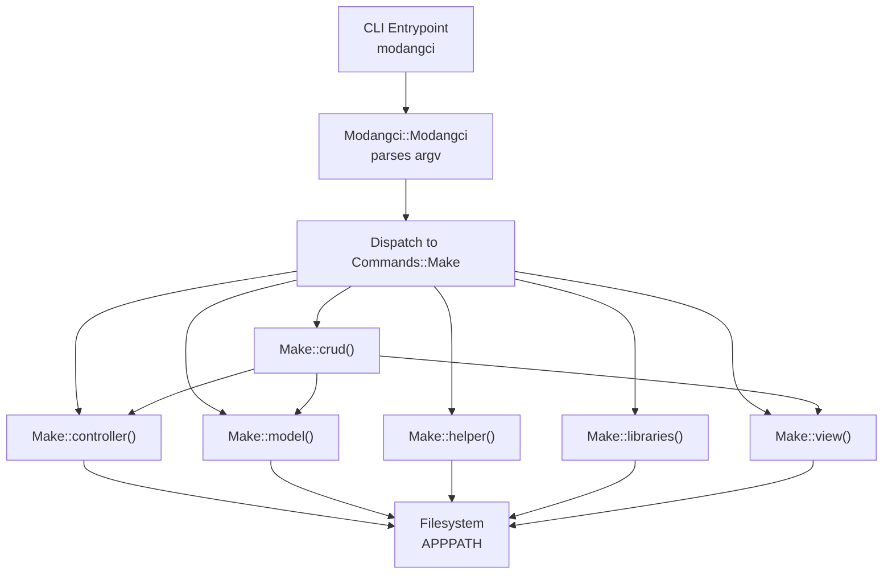
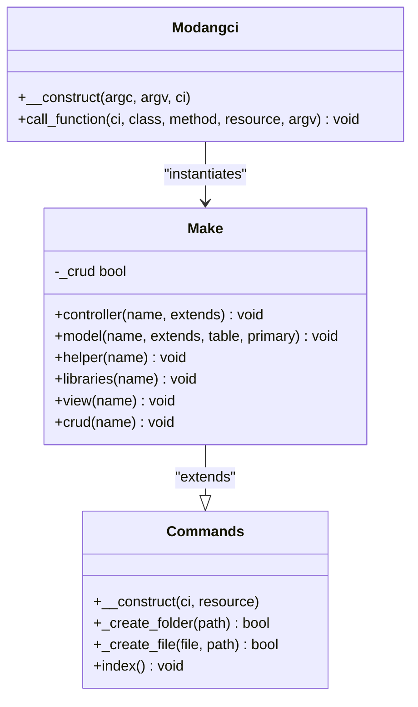
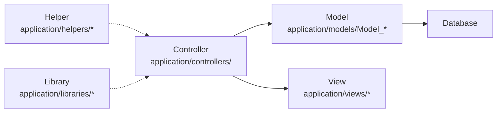
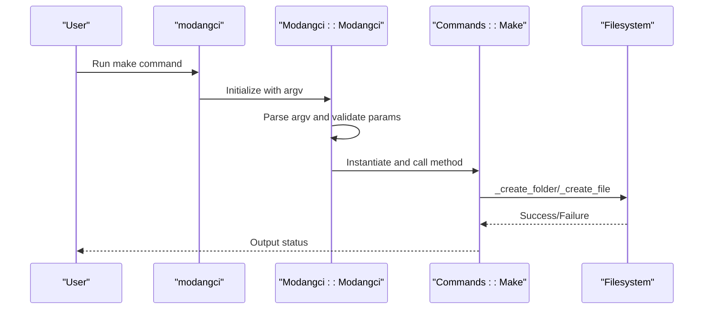

# Make Commands

<cite>
**Referenced Files in This Document**
- [Make.php](file://src/commands/Make.php)
- [Commands.php](file://src/Commands.php)
- [Modangci.php](file://src/Modangci.php)
- [modangci](file://modangci)
- [install](file://install)
- [README.md](file://README.md)
- [MY_Controller.php](file://src/application/core/MY_Controller.php)
- [MY_Model.php](file://src/application/core/MY_Model.php)
- [Home.php](file://src/application/controllers/Home.php)
- [Model_home.php](file://src/application/models/Model_home.php)
- [message_helper.php](file://src/application/helpers/message_helper.php)
</cite>

## Table of Contents
1. [Introduction](#introduction)
2. [Project Structure](#project-structure)
3. [Core Components](#core-components)
4. [Architecture Overview](#architecture-overview)
5. [Detailed Component Analysis](#detailed-component-analysis)
6. [Dependency Analysis](#dependency-analysis)
7. [Performance Considerations](#performance-considerations)
8. [Troubleshooting Guide](#troubleshooting-guide)
9. [Conclusion](#conclusion)
10. [Appendices](#appendices)

## Introduction
This document explains the Make commands for component generation in the project. It covers all make subcommands: controller generation, model creation, view scaffolding, CRUD operation generation, helper creation, and library generation. It also documents the resource flag (-r/--resource), how it affects component generation, and how generated components relate to CodeIgniter’s MVC architecture. Practical examples and best practices are included to guide efficient development.

## Project Structure
The Make command system is implemented as a CLI tool that integrates with CodeIgniter 3. The CLI entrypoint initializes a CodeIgniter instance and dispatches commands to the appropriate handler class. The Make command handler generates files under the CodeIgniter application directory.

**Diagram sources**
- [modangci:1-26](file://modangci#L1-L26)
- [Modangci.php:10-41](file://src/Modangci.php#L10-L41)
- [Make.php:16-209](file://src/commands/Make.php#L16-L209)
- [Commands.php:76-92](file://src/Commands.php#L76-L92)

**Section sources**
- [modangci:1-26](file://modangci#L1-L26)
- [Modangci.php:10-41](file://src/Modangci.php#L10-L41)
- [Make.php:16-209](file://src/commands/Make.php#L16-L209)
- [Commands.php:76-92](file://src/Commands.php#L76-L92)

## Core Components
- Commands base class: Provides shared filesystem operations and help output.
- Make class: Implements generation logic for controllers, models, helpers, libraries, views, and CRUD bundles.
- CLI dispatcher: Parses arguments, validates allowed parameters, and routes to the correct handler.

Key capabilities:
- Generate controllers with optional inheritance and resource flag (-r/--resource).
- Generate models with optional table and primary key parameters.
- Generate helpers and libraries with minimal boilerplate.
- Generate views with optional CRUD data loading.
- Generate a full CRUD bundle with controller, model, and view.

**Section sources**
- [Commands.php:7-18](file://src/Commands.php#L7-L18)
- [Make.php:7-14](file://src/commands/Make.php#L7-L14)
- [Modangci.php:19-40](file://src/Modangci.php#L19-L40)

## Architecture Overview
The Make command architecture follows a layered design:
- CLI layer: parses arguments and invokes handlers.
- Handler layer: Commands base class provides filesystem utilities; Make extends it to implement generation logic.
- Output layer: Generated files are written under APPPATH with conventional CodeIgniter paths.

**Diagram sources**
- [Commands.php:7-97](file://src/Commands.php#L7-L97)
- [Make.php:7-209](file://src/commands/Make.php#L7-L209)
- [Modangci.php:7-53](file://src/Modangci.php#L7-L53)

## Detailed Component Analysis

### Make controller
Generates a controller class with optional inheritance and optional resource actions.

Command syntax:
- make controller <name> [extends] [-r]

Parameters:
- name: Controller name (converted to PascalCase).
- extends: Optional base class (defaults to CI_Controller).
- -r or --resource: Enables CRUD-style actions in the controller.

Behavior:
- Creates a controller under application/controllers/.
- If -r is present, adds response, create, update, save, and delete methods.
- If -r is absent, writes a simple index action.
- If CRUD mode is enabled via crud(), loads the associated model and renders a view.

Examples:
- Generate a basic controller: make controller Product
- Generate a controller extending a custom base: make controller Product MY_Controller
- Generate a resource controller: make controller Product -r

Relationship to MVC:
- Controllers handle requests and orchestrate models and views.
- Extending a base controller aligns with the project’s MY_Controller pattern.

**Section sources**
- [Make.php:16-73](file://src/commands/Make.php#L16-L73)
- [Commands.php:101-102](file://src/Commands.php#L101-L102)
- [MY_Controller.php:3-18](file://src/application/core/MY_Controller.php#L3-L18)

### Make model
Generates a model class with optional table and primary key parameters.

Command syntax:
- make model <name> [extends] [table] [primary]

Parameters:
- name: Model name (converted to PascalCase).
- extends: Optional base class (defaults to CI_Model).
- table: Optional table name; if provided, adds an all() method.
- primary: Optional primary key; if provided with table, adds a by_id() method.

Behavior:
- Creates a model under application/models/Model_<lowercase>.
- Adds table and primary attributes and corresponding methods when parameters are supplied.
- Supports extending a custom base model.

Examples:
- Basic model: make model User
- Model with table: make model User User s_user
- Model with table and primary key: make model User User s_user id

Relationship to MVC:
- Models encapsulate data access and business logic.
- Extending a base model aligns with the project’s MY_Model pattern.

**Section sources**
- [Make.php:75-127](file://src/commands/Make.php#L75-L127)
- [Commands.php](file://src/Commands.php#L103)
- [MY_Model.php:3-8](file://src/application/core/MY_Model.php#L3-L8)

### Make helper
Generates a helper file with a placeholder function.

Command syntax:
- make helper <name>

Parameters:
- name: Helper name (converted to PascalCase).

Behavior:
- Creates a helper under application/helpers/<name>_helper.php.
- Includes a function_exists wrapper and a placeholder function.

Examples:
- make helper Message

Relationship to MVC:
- Helpers provide reusable functions for views and controllers.

**Section sources**
- [Make.php:129-148](file://src/commands/Make.php#L129-L148)
- [Commands.php](file://src/Commands.php#L104)
- [message_helper.php:4-20](file://src/application/helpers/message_helper.php#L4-L20)

### Make libraries
Generates a library class with optional CodeIgniter instance access.

Command syntax:
- make libraries <name>

Parameters:
- name: Library name (converted to PascalCase).

Behavior:
- Creates a library under application/libraries/<name>.php.
- Includes a constructor that obtains the CodeIgniter instance.

Examples:
- make libraries PDF

Relationship to MVC:
- Libraries encapsulate reusable functionality that can be loaded by controllers.

**Section sources**
- [Make.php:150-170](file://src/commands/Make.php#L150-L170)
- [Commands.php](file://src/Commands.php#L105)

### Make view
Generates a view file with optional CRUD data rendering.

Command syntax:
- make view <name>

Parameters:
- name: View name (lowercased).

Behavior:
- Creates a folder under application/views/<name> and an index file.
- If CRUD mode is enabled, renders a placeholder for data; otherwise, prints a simple HTML body.

Examples:
- make view Product

Relationship to MVC:
- Views render presentation logic and consume data passed by controllers.

**Section sources**
- [Make.php:172-194](file://src/commands/Make.php#L172-L194)
- [Commands.php](file://src/Commands.php#L106)

### Make CRUD
Generates a complete CRUD bundle consisting of controller, model, and view.

Command syntax:
- make crud <name>

Parameters:
- name: Resource name (used for controller, model, and view).

Behavior:
- Sets CRUD mode internally.
- Invokes controller(), model(), and view() with the same name.
- The controller includes CRUD actions when -r is set via the resource flag.

Examples:
- make crud Product

Relationship to MVC:
- CRUD generation aligns with typical MVC flows: controller handles requests, model manages data, view renders output.

**Section sources**
- [Make.php:196-209](file://src/commands/Make.php#L196-L209)
- [Commands.php](file://src/Commands.php#L107)

### Resource Flag (-r/--resource)
Purpose:
- Enables CRUD-style actions in the generated controller.
- Triggers model and view generation to include data-loading and placeholders.

Behavior:
- Recognized by the CLI dispatcher and passed to the handler.
- Used by Make::controller() to inject response, create, update, save, and delete methods.
- Used by Make::view() to render data placeholders when CRUD mode is active.
- Used by Make::controller() to load the associated model and pass data to views.

Examples:
- make controller Product -r
- make crud Product

**Section sources**
- [Modangci.php:19-33](file://src/Modangci.php#L19-L33)
- [Make.php:23-44](file://src/commands/Make.php#L23-L44)
- [Make.php:178-181](file://src/commands/Make.php#L178-L181)
- [Make.php:47-52](file://src/commands/Make.php#L47-L52)

### Relationship to CodeIgniter MVC Architecture
Generated components integrate with the project’s MVC structure:
- Controllers: Extend a base controller class and load models and views.
- Models: Extend a base model class and optionally define table and primary key metadata.
- Views: Render data provided by controllers.
- Helpers and Libraries: Provide reusable functions and classes.

**Diagram sources**
- [Home.php:4-18](file://src/application/controllers/Home.php#L4-L18)
- [Model_home.php:2-7](file://src/application/models/Model_home.php#L2-L7)
- [MY_Controller.php:3-18](file://src/application/core/MY_Controller.php#L3-L18)
- [MY_Model.php:3-8](file://src/application/core/MY_Model.php#L3-L8)
- [message_helper.php:4-20](file://src/application/helpers/message_helper.php#L4-L20)

## Dependency Analysis
The CLI dispatcher validates allowed parameters and routes to the Make handler. The Make handler depends on the Commands base class for filesystem operations and on CodeIgniter’s write_file helper to persist generated files.

**Diagram sources**
- [modangci:1-26](file://modangci#L1-L26)
- [Modangci.php:10-41](file://src/Modangci.php#L10-L41)
- [Commands.php:59-92](file://src/Commands.php#L59-L92)

**Section sources**
- [Modangci.php:19-40](file://src/Modangci.php#L19-L40)
- [Commands.php:59-92](file://src/Commands.php#L59-L92)

## Performance Considerations
- Filesystem operations: The generator uses PHP’s file operations and CodeIgniter’s write_file helper. Ensure APPPATH is writable to avoid failures.
- Parameter validation: The CLI validates allowed parameters to prevent unexpected behavior.
- Minimal overhead: Generation is a one-time operation during development; no runtime impact on application performance.

## Troubleshooting Guide
Common issues and resolutions:
- Command not recognized:
  - Ensure the CLI is invoked from the project root and the modangci script is executable.
  - Verify the autoload configuration and that the namespace is correctly mapped.
- Permission errors:
  - APPPATH must be writable for the CLI process to create files and folders.
- Invalid parameters:
  - Only allowed parameters are accepted; unrecognized tokens will cause the process to exit with a message.
- Existing files/folders:
  - The generator checks for duplicates and reports conflicts; remove or rename existing items before retrying.

**Section sources**
- [Modangci.php:13-17](file://src/Modangci.php#L13-L17)
- [Modangci.php:24-28](file://src/Modangci.php#L24-L28)
- [Commands.php:76-92](file://src/Commands.php#L76-L92)

## Conclusion
The Make commands provide a streamlined way to scaffold CodeIgniter components and full CRUD stacks. By leveraging the resource flag and following the project’s base classes, developers can quickly generate consistent, MVC-aligned code that integrates seamlessly with the existing application structure.

## Appendices

### Command Reference
- make controller <name> [extends] [-r]
- make model <name> [extends] [table] [primary]
- make helper <name>
- make libraries <name>
- make view <name>
- make crud <name>

Notes:
- Names are normalized to PascalCase for classes and lowercase for views.
- The -r/--resource flag enables CRUD actions in controllers and data placeholders in views.

**Section sources**
- [Commands.php:101-107](file://src/Commands.php#L101-L107)
- [README.md:15-21](file://README.md#L15-L21)

### Practical Examples
- Generate a product controller with CRUD actions:
  - make controller Product -r
- Generate a product model with table and primary key:
  - make model Product Product s_product id
- Generate a helper for messages:
  - make helper Message
- Generate a PDF library:
  - make libraries PDF
- Generate a product view:
  - make view Product
- Generate a complete CRUD for products:
  - make crud Product

**Section sources**
- [Make.php:16-209](file://src/commands/Make.php#L16-L209)
- [Commands.php:101-107](file://src/Commands.php#L101-L107)

### Best Practices
- Use meaningful names that reflect domain concepts.
- Prefer extending base classes (MY_Controller, MY_Model) to centralize common behavior.
- Keep helpers and libraries small and focused.
- Use the resource flag to accelerate CRUD development while customizing later.
- Validate generated files in APPPATH and commit only necessary changes to version control.

[No sources needed since this section provides general guidance]