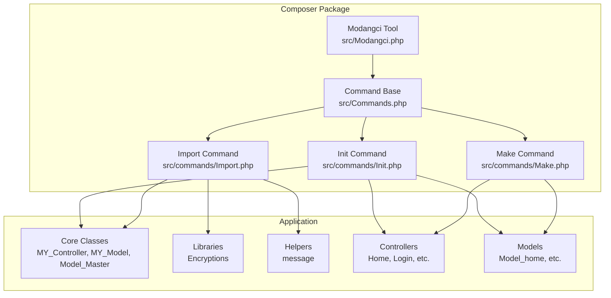
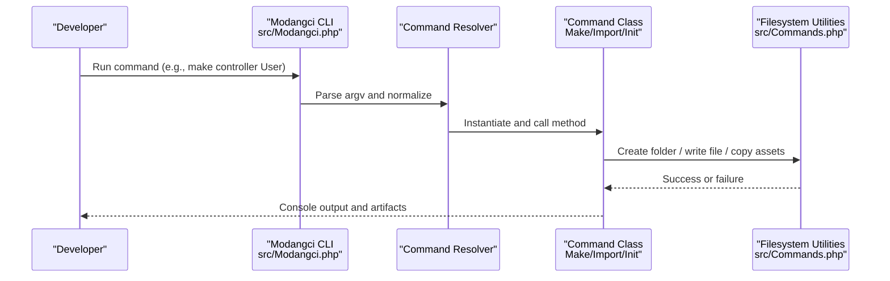
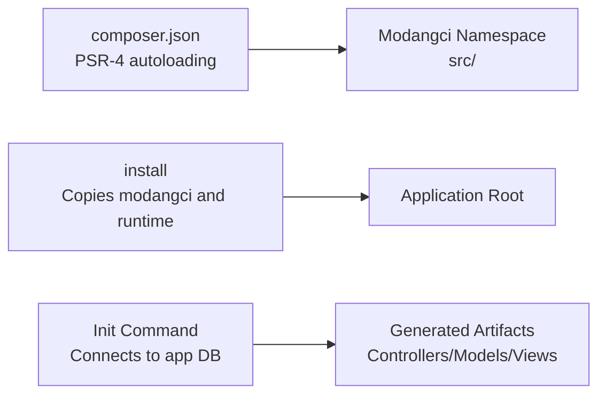

# Development Workflow and Best Practices

<cite>
**Referenced Files in This Document**
- [README.md](file://README.md)
- [composer.json](file://composer.json)
- [install](file://install)
- [src/Modangci.php](file://src/Modangci.php)
- [src/Commands.php](file://src/Commands.php)
- [src/commands/Make.php](file://src/commands/Make.php)
- [src/commands/Import.php](file://src/commands/Import.php)
- [src/commands/Init.php](file://src/commands/Init.php)
- [src/application/core/MY_Controller.php](file://src/application/core/MY_Controller.php)
- [src/application/core/MY_Model.php](file://src/application/core/MY_Model.php)
- [src/application/core/Model_Master.php](file://src/application/core/Model_Master.php)
- [src/application/libraries/Encryptions.php](file://src/application/libraries/Encryptions.php)
- [src/application/helpers/message_helper.php](file://src/application/helpers/message_helper.php)
- [src/application/controllers/Home.php](file://src/application/controllers/Home.php)
- [src/application/models/Model_home.php](file://src/application/models/Model_home.php)
</cite>

## Table of Contents
1. [Introduction](#introduction)
2. [Project Structure](#project-structure)
3. [Core Components](#core-components)
4. [Architecture Overview](#architecture-overview)
5. [Detailed Component Analysis](#detailed-component-analysis)
6. [Dependency Analysis](#dependency-analysis)
7. [Performance Considerations](#performance-considerations)
8. [Troubleshooting Guide](#troubleshooting-guide)
9. [Conclusion](#conclusion)
10. [Appendices](#appendices)

## Introduction
This document describes the Modangci development workflow and best practices for CodeIgniter 3 projects. It focuses on recommended development practices, efficient workflow patterns, and how to extend the tool for custom requirements. It covers typical scenarios such as new project setup, component creation workflows, iterative development processes, organizing generated code, maintaining consistency across team projects, choosing the right command types, customizing templates, and integrating with version control systems. Practical examples and troubleshooting guidance are included to help teams adopt consistent, scalable development practices.

## Project Structure
Modangci is a CLI tool packaged as a Composer package. It integrates into a CodeIgniter 3 application via an installer script and exposes three command categories:
- Make: Generate lightweight scaffolding for controllers, models, helpers, libraries, and CRUD bundles.
- Import: Bring in reusable components from the vendor bundle into the application.
- Init: Scaffold authentication, roles, and CRUD scaffolding from existing database tables.

**Diagram sources**
- [src/Modangci.php:10-41](file://src/Modangci.php#L10-L41)
- [src/Commands.php:14-18](file://src/Commands.php#L14-L18)
- [src/commands/Make.php:16-73](file://src/commands/Make.php#L16-L73)
- [src/commands/Import.php:14-35](file://src/commands/Import.php#L14-L35)
- [src/commands/Init.php:125-478](file://src/commands/Init.php#L125-L478)
- [src/application/core/MY_Controller.php:1-59](file://src/application/core/MY_Controller.php#L1-L59)
- [src/application/core/MY_Model.php:1-21](file://src/application/core/MY_Model.php#L1-L21)
- [src/application/core/Model_Master.php:1-257](file://src/application/core/Model_Master.php#L1-L257)
- [src/application/libraries/Encryptions.php:1-56](file://src/application/libraries/Encryptions.php#L1-L56)
- [src/application/helpers/message_helper.php:1-22](file://src/application/helpers/message_helper.php#L1-L22)
- [src/application/controllers/Home.php:1-121](file://src/application/controllers/Home.php#L1-L121)
- [src/application/models/Model_home.php:1-9](file://src/application/models/Model_home.php#L1-L9)

**Section sources**
- [README.md:1-41](file://README.md#L1-L41)
- [composer.json:1-25](file://composer.json#L1-L25)
- [install:15-26](file://install#L15-L26)

## Core Components
- Modangci CLI dispatcher: Parses arguments, validates CLI context, and routes to the appropriate command class and method.
- Command base: Provides shared utilities for copying files, recursive copying, creating folders, writing files, and messaging.
- Make command: Generates controllers, models, helpers, libraries, and a full CRUD bundle with optional response endpoints.
- Import command: Copies reusable components from the vendor bundle into the application and optionally runs Composer installs for dependencies.
- Init command: Creates authentication scaffolding, database tables, and copies core, controllers, models, views, and assets; also scaffolds CRUD from database tables.

Key behaviors:
- CLI enforcement ensures the tool runs only in CLI mode.
- Argument normalization and parameter filtering prevent invalid inputs.
- Resource flags enable optional features (e.g., response endpoints in Make).

**Section sources**
- [src/Modangci.php:10-41](file://src/Modangci.php#L10-L41)
- [src/Commands.php:14-97](file://src/Commands.php#L14-L97)
- [src/commands/Make.php:16-210](file://src/commands/Make.php#L16-L210)
- [src/commands/Import.php:14-51](file://src/commands/Import.php#L14-L51)
- [src/commands/Init.php:125-478](file://src/commands/Init.php#L125-L478)

## Architecture Overview
The CLI architecture follows a simple dispatcher pattern:
- The CLI entry resolves the target command class and method.
- The command class extends a base class that provides filesystem and messaging utilities.
- Generated artifacts are written under the application directory with consistent naming conventions.

**Diagram sources**
- [src/Modangci.php:19-41](file://src/Modangci.php#L19-L41)
- [src/Commands.php:59-97](file://src/Commands.php#L59-L97)
- [src/commands/Make.php:16-73](file://src/commands/Make.php#L16-L73)
- [src/commands/Import.php:14-35](file://src/commands/Import.php#L14-L35)
- [src/commands/Init.php:125-130](file://src/commands/Init.php#L125-L130)

## Detailed Component Analysis

### CLI Entry and Routing
- Validates CLI context and enforces safe argument parsing.
- Normalizes arguments and extracts resource flags.
- Resolves command class and method dynamically and invokes them.

Best practices:
- Keep argument names lowercase and avoid special characters outside allowed flags.
- Use resource flags consistently for optional features.

**Section sources**
- [src/Modangci.php:10-41](file://src/Modangci.php#L10-L41)

### Command Base Utilities
- Copy single files and recursively copy directories.
- Create folders with permission checks and error messaging.
- Write files safely and report outcomes.

Best practices:
- Always check return values for folder and file creation.
- Use consistent messaging for user feedback.

**Section sources**
- [src/Commands.php:20-97](file://src/Commands.php#L20-L97)

### Make Command Workflows
- Controller generation supports optional response endpoints via a resource flag.
- Model generation supports optional table and primary key parameters to auto-generate common methods.
- Helper and library generators scaffold boilerplate with placeholders.
- View generator creates a basic HTML page or a placeholder for CRUD data.
- CRUD bundle generator composes controller, model, and view together.

Recommended usage:
- Use the response endpoints flag for APIs or AJAX-first controllers.
- Provide table and primary key for models to leverage auto-generated methods.
- Use CRUD bundle for rapid prototyping and iterate from there.

**Section sources**
- [src/commands/Make.php:16-210](file://src/commands/Make.php#L16-L210)

### Import Command Workflows
- Imports core classes, helpers, and libraries from the vendor bundle.
- Optionally runs Composer commands for dependencies (e.g., PDF generator).

Recommended usage:
- Import reusable components to avoid duplicating code.
- Add Composer dependencies before importing libraries that require them.

**Section sources**
- [src/commands/Import.php:14-51](file://src/commands/Import.php#L14-L51)

### Init Command Workflows
- Authentication scaffolding: Creates role-based tables, inserts defaults, sets up sessions, and copies controllers, models, views, and assets.
- Controller scaffolding: Reads table schema, infers primary and foreign keys, generates CRUD controller with validation, encryption, and AJAX handling.
- Model scaffolding: Generates models with joins for foreign keys and common methods.
- View scaffolding: Creates index and form views with dynamic table headers, rows, and form controls.

Recommended usage:
- Use Init auth to bootstrap authentication and roles quickly.
- Use Init controller/model/view/crud with real database tables to generate production-ready scaffolding.

**Section sources**
- [src/commands/Init.php:125-478](file://src/commands/Init.php#L125-L478)

### Core Application Integration
- MY_Controller: Centralized layout and menu resolution, session guard, and breadcrumb building.
- MY_Model and Model_Master: Shared model base and transactional CRUD helpers, logging hooks, and menu retrieval utilities.
- Encryptions library: Safe encoding/decoding for URIs and keys.
- Message helper: Standardized JSON response for AJAX flows.

Recommended usage:
- Extend MY_Controller for all application controllers to enforce consistent layout and permissions.
- Use Model_Master methods for CRUD operations to centralize transaction handling and logging.
- Use Encryptions for secure parameter passing in URLs.

**Section sources**
- [src/application/core/MY_Controller.php:1-59](file://src/application/core/MY_Controller.php#L1-L59)
- [src/application/core/MY_Model.php:1-21](file://src/application/core/MY_Model.php#L1-L21)
- [src/application/core/Model_Master.php:1-257](file://src/application/core/Model_Master.php#L1-L257)
- [src/application/libraries/Encryptions.php:1-56](file://src/application/libraries/Encryptions.php#L1-L56)
- [src/application/helpers/message_helper.php:1-22](file://src/application/helpers/message_helper.php#L1-L22)
- [src/application/controllers/Home.php:1-121](file://src/application/controllers/Home.php#L1-L121)
- [src/application/models/Model_home.php:1-9](file://src/application/models/Model_home.php#L1-L9)

## Dependency Analysis
- Composer autoloading maps the Modangci namespace to the src directory.
- The CLI installer copies the executable and runtime files into the application root.
- The Init command connects to the application’s database to introspect schema and generate code accordingly.

**Diagram sources**
- [composer.json:20-24](file://composer.json#L20-L24)
- [install:15-26](file://install#L15-L26)
- [src/commands/Init.php:13-29](file://src/commands/Init.php#L13-L29)

**Section sources**
- [composer.json:20-24](file://composer.json#L20-L24)
- [install:15-26](file://install#L15-L26)
- [src/commands/Init.php:13-29](file://src/commands/Init.php#L13-L29)

## Performance Considerations
- Prefer using Model_Master methods for CRUD operations to leverage transactions and centralized logging.
- Avoid heavy logic in views; delegate to controllers and models.
- Use foreign key-aware scaffolding to minimize manual join logic.
- Keep generated controllers lean and move business logic into models.

[No sources needed since this section provides general guidance]

## Troubleshooting Guide
Common issues and resolutions:
- Running outside CLI: The CLI enforces CLI-only execution. Ensure you run commands from the terminal.
- Invalid parameters: Only allowed flags are accepted; otherwise, the tool prints an error and exits. Verify flags and argument casing.
- File/folder creation failures: Creation utilities return false on write errors. Check permissions and paths.
- Missing Composer dependencies: Some imports require Composer packages. Install dependencies before importing.
- Database introspection failures: Init requires a working database connection and schema visibility. Confirm database credentials and privileges.

**Section sources**
- [src/Modangci.php:13-17](file://src/Modangci.php#L13-L17)
- [src/Modangci.php:24-32](file://src/Modangci.php#L24-L32)
- [src/Commands.php:62-73](file://src/Commands.php#L62-L73)
- [src/commands/Import.php:45-47](file://src/commands/Import.php#L45-L47)
- [src/commands/Init.php:13-29](file://src/commands/Init.php#L13-L29)

## Conclusion
Modangci streamlines CodeIgniter 3 development by offering three complementary workflows: Make for quick scaffolding, Import for reusable components, and Init for authentication and database-driven CRUD scaffolding. By adopting consistent naming conventions, leveraging core classes, and using resource flags appropriately, teams can maintain high productivity while keeping generated code organized and maintainable. Integrating with version control and Composer ensures reproducibility and scalability across projects.

[No sources needed since this section summarizes without analyzing specific files]

## Appendices

### Recommended Development Scenarios

- New project setup
  - Create a CodeIgniter project and require the package.
  - Run the installer to place the CLI executable and runtime files.
  - Initialize authentication scaffolding and review autoload and config settings printed by the tool.
  - Commit the generated files and assets to version control.

  **Section sources**
  - [README.md:7-13](file://README.md#L7-L13)
  - [install:15-26](file://install#L15-L26)
  - [src/commands/Init.php:470-478](file://src/commands/Init.php#L470-L478)

- Component creation workflows
  - Use Make to generate a controller with optional response endpoints.
  - Use Make model with table and primary key to auto-generate common methods.
  - Use Make helper/library to scaffold reusable utilities.
  - Use Make view for simple pages or integrate with CRUD bundles.

  **Section sources**
  - [src/commands/Make.php:16-210](file://src/commands/Make.php#L16-L210)

- Iterative development processes
  - Start with Init controller/model/view/crud using an existing table to generate baseline code.
  - Refactor generated code into domain-specific models and controllers.
  - Add business logic to models and extend controllers as needed.
  - Use Import to bring in additional helpers or libraries.

  **Section sources**
  - [src/commands/Init.php:480-701](file://src/commands/Init.php#L480-L701)
  - [src/commands/Import.php:14-51](file://src/commands/Import.php#L14-L51)

- Organizing generated code and maintaining consistency
  - Place generated controllers under application/controllers and models under application/models.
  - Use consistent naming conventions (e.g., Model_User, User controller).
  - Centralize shared logic in MY_Controller and Model_Master.
  - Keep views under application/views/pages/<resource>.

  **Section sources**
  - [src/application/core/MY_Controller.php:1-59](file://src/application/core/MY_Controller.php#L1-L59)
  - [src/application/core/Model_Master.php:1-257](file://src/application/core/Model_Master.php#L1-L257)

- Extending the tool for custom requirements
  - Customize templates by modifying the command classes to adjust generated code.
  - Add new command categories by creating new command classes under src/commands/.
  - Integrate with Composer to pull in third-party libraries during import.

  **Section sources**
  - [src/commands/Make.php:16-210](file://src/commands/Make.php#L16-L210)
  - [src/commands/Import.php:37-51](file://src/commands/Import.php#L37-L51)
  - [composer.json:20-24](file://composer.json#L20-L24)

- Choosing command types
  - Use Make for lightweight scaffolding and experimentation.
  - Use Import for bringing in reusable components and libraries.
  - Use Init for authentication scaffolding and database-driven CRUD.

  **Section sources**
  - [README.md:15-41](file://README.md#L15-L41)

- Customizing generated templates
  - Modify the file generation logic in Make and Init command classes to tailor boilerplate.
  - Adjust controller templates to include additional middleware or guards.
  - Extend model templates to add domain-specific methods.

  **Section sources**
  - [src/commands/Make.php:54-68](file://src/commands/Make.php#L54-L68)
  - [src/commands/Init.php:527-631](file://src/commands/Init.php#L527-L631)

- Version control integration
  - Commit generated controllers, models, views, and assets after initial scaffolding.
  - Track changes to custom templates and command overrides separately.
  - Use branches to isolate feature-specific scaffolding and refactoring.

  [No sources needed since this section provides general guidance]